# 业务功能模块

<cite>
**本文引用的文件**
- [backend/index.js](file://backend/index.js)
- [backend/routes/auth.js](file://backend/routes/auth.js)
- [backend/routes/admin.js](file://backend/routes/admin.js)
- [backend/middleware/auth.js](file://backend/middleware/auth.js)
- [backend/storage.js](file://backend/storage.js)
- [backend/cache.js](file://backend/cache.js)
- [backend/db/schema.sql](file://backend/db/schema.sql)
- [backend/config.js](file://backend/config.js)
- [backend/reviews.json](file://backend/reviews.json)
- [frontend/h5/src/views/services/Index.vue](file://frontend/h5/src/views/services/Index.vue)
- [frontend/h5/src/views/services/Apply.vue](file://frontend/h5/src/views/services/Apply.vue)
- [frontend/h5/src/views/cases/Index.vue](file://frontend/h5/src/views/cases/Index.vue)
- [frontend/h5/src/views/reviews/Index.vue](file://frontend/h5/src/views/reviews/Index.vue)
- [frontend/h5/src/views/admin/reviews/ReviewList.vue](file://frontend/h5/src/views/admin/reviews/ReviewList.vue)
- [frontend/h5/src/views/admin/config/ServiceConfigList.vue](file://frontend/h5/src/views/admin/config/ServiceConfigList.vue)
- [frontend/h5/src/views/home/Index.vue](file://frontend/h5/src/views/home/Index.vue)
- [frontend/miniprogram/pages/home/index.vue](file://frontend/miniprogram/pages/home/index.vue)
- [frontend/h5/src/stores/user.js](file://frontend/h5/src/stores/user.js)
- [frontend/h5/src/stores/application.js](file://frontend/h5/src/stores/application.js)
- [frontend/h5/src/stores/service.js](file://frontend/h5/src/stores/service.js)
</cite>

## 更新摘要
**所做更改**
- 新增首页轮播图系统章节，详细说明从静态配置到动态Banner管理的重构
- 更新用户管理系统章节，增加Banner管理相关权限控制
- 更新服务管理系统章节，增加Banner配置管理功能
- 新增Banner管理后台功能说明
- 更新数据流转图，体现Banner管理的完整流程

## 目录
1. [简介](#简介)
2. [项目结构](#项目结构)
3. [核心组件](#核心组件)
4. [架构总览](#架构总览)
5. [详细组件分析](#详细组件分析)
6. [依赖分析](#依赖分析)
7. [性能考虑](#性能考虑)
8. [故障排查指南](#故障排查指南)
9. [结论](#结论)
10. [附录](#附录)

## 简介
本文件面向低空飞行服务平台的业务功能模块，围绕六大核心子系统进行系统化梳理：用户管理系统、服务管理系统、订单/申请管理系统、案例展示系统、评价系统、权限控制系统。**本次更新重点反映了首页轮播图系统从静态配置到动态Banner管理的重大重构**，新增了多张Banner图片上传、链接配置和后台管理功能。文档从架构设计、数据流、处理逻辑、权限控制、集成点与错误处理等方面进行深入分析，并提供可视化图示与使用示例，帮助开发者与运营人员快速理解与落地。

## 项目结构
后端采用 Node.js + Express 架构，前端基于 Vue 3 + Vant 移动端组件库，数据库采用 JSON 文件或 PostgreSQL 的双模存储策略。整体采用前后端分离模式，通过 RESTful 接口进行交互。**新增的Banner管理系统支持多张轮播图的动态配置与管理**。

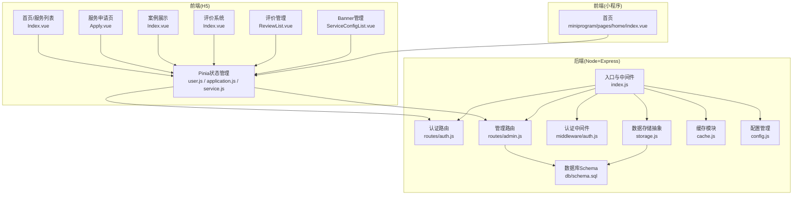

**图表来源**
- [backend/index.js:1-120](file://backend/index.js#L1-L120)
- [backend/routes/auth.js:1-60](file://backend/routes/auth.js#L1-L60)
- [backend/routes/admin.js:1-40](file://backend/routes/admin.js#L1-L40)
- [backend/middleware/auth.js:1-40](file://backend/middleware/auth.js#L1-L40)
- [backend/storage.js:1-40](file://backend/storage.js#L1-L40)
- [backend/cache.js:1-40](file://backend/cache.js#L1-L40)
- [backend/db/schema.sql:1-10](file://backend/db/schema.sql#L1-L10)
- [backend/config.js:1-40](file://backend/config.js#L1-L40)
- [frontend/h5/src/views/admin/config/ServiceConfigList.vue:1-800](file://frontend/h5/src/views/admin/config/ServiceConfigList.vue#L1-L800)
- [frontend/miniprogram/pages/home/index.vue:1-714](file://frontend/miniprogram/pages/home/index.vue#L1-L714)

**章节来源**
- [backend/index.js:1-120](file://backend/index.js#L1-L120)
- [backend/routes/auth.js:1-60](file://backend/routes/auth.js#L1-L60)
- [backend/routes/admin.js:1-40](file://backend/routes/admin.js#L1-L40)
- [backend/middleware/auth.js:1-40](file://backend/middleware/auth.js#L1-L40)
- [backend/storage.js:1-40](file://backend/storage.js#L1-L40)
- [backend/cache.js:1-40](file://backend/cache.js#L1-L40)
- [backend/db/schema.sql:1-10](file://backend/db/schema.sql#L1-L10)
- [backend/config.js:1-40](file://backend/config.js#L1-L40)

## 核心组件
- 用户管理系统：提供登录、注册、SSO、微信登录、令牌刷新与注销等能力，支持多种登录渠道与角色权限控制。
- 服务管理系统：提供服务配置查看与更新、研学展示数据管理，支持按管理员角色隔离可见范围，**新增Banner配置管理功能**。
- 订单/申请管理系统：提供申请列表查询、状态更新、导出 Excel、统计看板等功能，支持按角色过滤与分页。
- 案例展示系统：提供案例分类浏览、媒体资源轮播、详情弹窗、URL 归一化处理等。
- **评价系统**：提供多板块评价展示、匿名评价、图片上传、课程关联、提交审核、管理员审核管理等完整功能链路。
- **Banner管理系统**：**新增**支持首页Banner图片的多图管理、链接配置、后台编辑与实时预览，提供完整的动态轮播图解决方案。
- 权限控制系统：基于角色的访问控制，支持 admin、dsl_admin、study_admin 等角色权限管理。

**章节来源**
- [backend/routes/auth.js:96-147](file://backend/routes/auth.js#L96-L147)
- [backend/routes/admin.js:29-61](file://backend/routes/admin.js#L29-L61)
- [backend/routes/admin.js:66-111](file://backend/routes/admin.js#L66-L111)
- [backend/routes/admin.js:116-166](file://backend/routes/admin.js#L116-L166)
- [backend/routes/admin.js:171-207](file://backend/routes/admin.js#L171-L207)
- [backend/index.js:1173-1269](file://backend/index.js#L1173-L1269)
- [frontend/h5/src/views/cases/Index.vue:269-344](file://frontend/h5/src/views/cases/Index.vue#L269-L344)
- [frontend/h5/src/views/reviews/Index.vue:263-397](file://frontend/h5/src/views/reviews/Index.vue#L263-L397)
- [frontend/h5/src/views/admin/config/ServiceConfigList.vue:425-482](file://frontend/h5/src/views/admin/config/ServiceConfigList.vue#L425-L482)

## 架构总览
后端通过统一入口加载配置、中间件与路由，采用 JSON 文件或 PostgreSQL 存储，结合内存缓存提升读取性能。前端通过 Pinia 管理用户态与业务状态，调用后端接口完成业务闭环。**新增的Banner管理系统通过配置中心实现动态轮播图管理**。

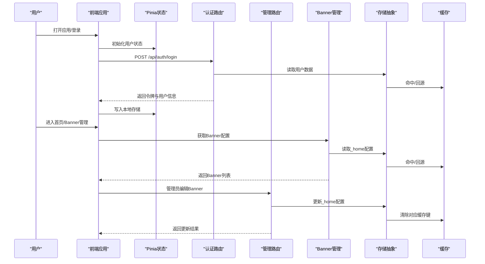

**图表来源**
- [backend/index.js:434-475](file://backend/index.js#L434-L475)
- [backend/routes/auth.js:96-147](file://backend/routes/auth.js#L96-L147)
- [backend/routes/admin.js:66-111](file://backend/routes/admin.js#L66-L111)
- [backend/storage.js:134-181](file://backend/storage.js#L134-L181)
- [backend/cache.js:57-67](file://backend/cache.js#L57-L67)
- [frontend/h5/src/views/admin/config/ServiceConfigList.vue:618-672](file://frontend/h5/src/views/admin/config/ServiceConfigList.vue#L618-L672)

## 详细组件分析

### 用户管理系统
- 功能要点
  - 登录/注册：支持手机号/用户名+密码登录，密码加密存储，自动升级明文密码为哈希。
  - SSO 登录：通过授权码查询平台会员信息，自动创建或更新用户并发放令牌。
  - 微信登录：小程序 code2session 获取 openid/unionid，支持手机号绑定。
  - 令牌管理：支持刷新令牌与注销，刷新时校验令牌有效性与过期时间。
  - 权限控制：基于角色的访问控制，支持 admin、dsl_admin、study_admin 等角色。
  - **Banner管理权限**：管理员可编辑首页Banner配置，普通用户仅可查看。

**章节来源**
- [backend/routes/auth.js:96-147](file://backend/routes/auth.js#L96-L147)
- [backend/routes/auth.js:230-294](file://backend/routes/auth.js#L230-L294)
- [backend/routes/auth.js:322-392](file://backend/routes/auth.js#L322-L392)
- [backend/routes/auth.js:513-588](file://backend/routes/auth.js#L513-L588)

### 服务管理系统
- 功能要点
  - 服务配置查看：按角色返回对应服务配置，支持 DSL 与研学管理员隔离。
  - 服务配置更新：支持 admin 全量更新，或按角色限定更新特定服务。
  - 研学展示数据：提供 studyShowcase 的增删改查与更新。
  - **Banner配置管理**：**新增**支持首页Banner图片的多图管理、链接配置、后台编辑。
- 关键流程（服务配置更新）
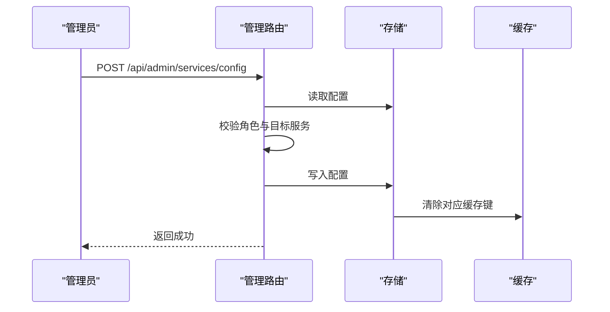

**图表来源**
- [backend/routes/admin.js:309-357](file://backend/routes/admin.js#L309-L357)
- [backend/storage.js:164-172](file://backend/storage.js#L164-L172)
- [backend/cache.js:108-116](file://backend/cache.js#L108-L116)

**章节来源**
- [backend/routes/admin.js:282-305](file://backend/routes/admin.js#L282-L305)
- [backend/routes/admin.js:309-357](file://backend/routes/admin.js#L309-L357)
- [backend/routes/admin.js:375-404](file://backend/routes/admin.js#L375-L404)

### 订单/申请管理系统
- 功能要点
  - 申请列表：支持分页、按状态与服务 ID 过滤、按角色隔离。
  - 更新状态：支持更新状态与备注，记录管理员操作。
  - 导出 Excel：按角色过滤后导出申请列表。
  - 统计看板：按角色返回订单总量、待处理、处理中、已完成等指标。
- 关键流程（申请状态更新）
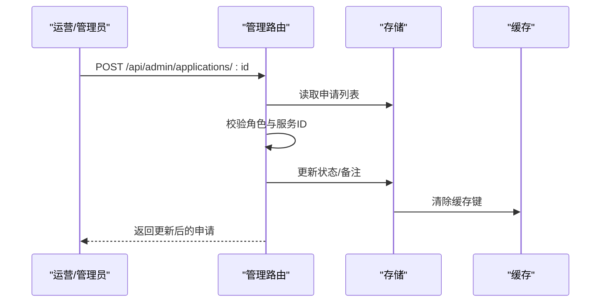

**图表来源**
- [backend/routes/admin.js:116-166](file://backend/routes/admin.js#L116-L166)
- [backend/storage.js:154-162](file://backend/storage.js#L154-L162)
- [backend/cache.js:108-116](file://backend/cache.js#L108-L116)

- 关键流程（导出 Excel）
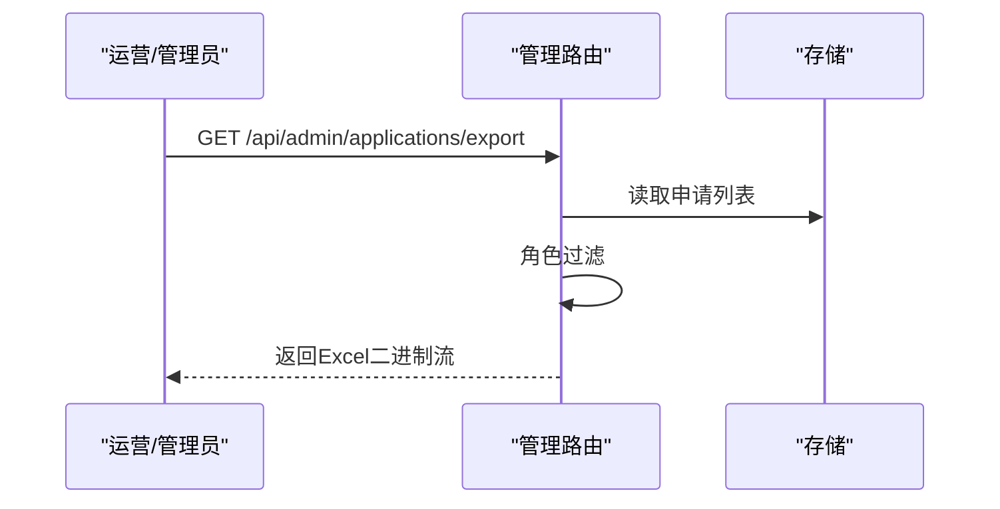

**图表来源**
- [backend/routes/admin.js:171-207](file://backend/routes/admin.js#L171-L207)

**章节来源**
- [backend/routes/admin.js:66-111](file://backend/routes/admin.js#L66-L111)
- [backend/routes/admin.js:116-166](file://backend/routes/admin.js#L116-L166)
- [backend/routes/admin.js:171-207](file://backend/routes/admin.js#L171-L207)
- [backend/routes/admin.js:29-61](file://backend/routes/admin.js#L29-L61)

### 案例展示系统
- 功能要点
  - 分类浏览：支持全部案例与按服务类型分类。
  - 媒体资源：支持图片与视频轮播，自动归一化媒体 URL。
  - 详情弹窗：展示服务类型、地点、时间、亮点等信息。
- 关键流程（案例列表加载）
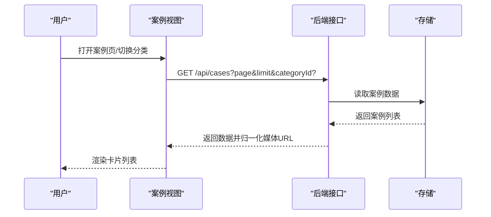

**图表来源**
- [frontend/h5/src/views/cases/Index.vue:269-344](file://frontend/h5/src/views/cases/Index.vue#L269-L344)
- [backend/storage.js:144-152](file://backend/storage.js#L144-L152)

**章节来源**
- [frontend/h5/src/views/cases/Index.vue:269-344](file://frontend/h5/src/views/cases/Index.vue#L269-L344)

### 评价系统
**更新** 新增完整的评价系统模块，包含用户评价和管理员审核管理两大功能板块

- 功能要点
  - 多板块评价：支持研学、销售、乐园等板块，展示评分与评价内容。
  - 匿名评价：支持匿名提交，保护隐私。
  - 图片上传：支持多图上传并归档到后端存储。
  - 课程关联：按板块动态加载课程列表。
  - 管理员审核：提供评价审核、拒绝、删除等管理功能。
  - 实时展示：用户可在评价页查看已审核通过的评价。
- 关键流程（用户提交评价）
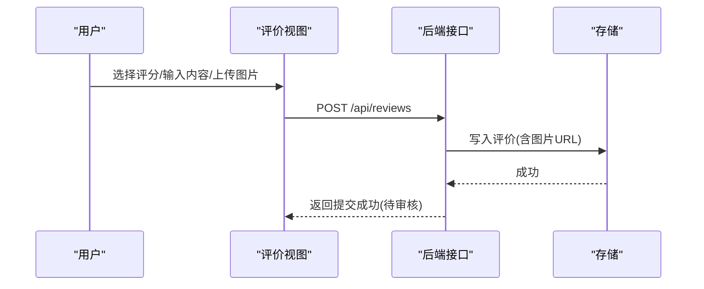

**图表来源**
- [frontend/h5/src/views/reviews/Index.vue:348-397](file://frontend/h5/src/views/reviews/Index.vue#L348-L397)
- [backend/index.js:1219-1269](file://backend/index.js#L1219-L1269)

- 关键流程（管理员审核评价）
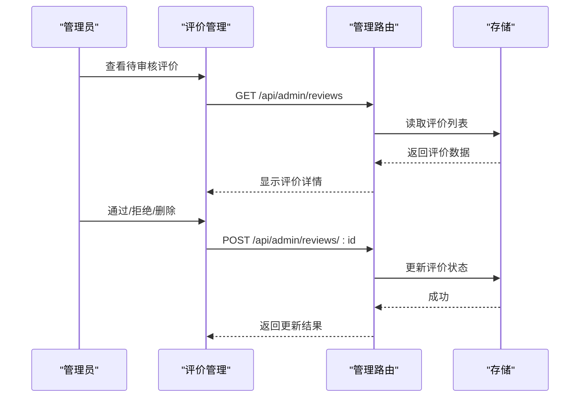

**图表来源**
- [frontend/h5/src/views/admin/reviews/ReviewList.vue:167-203](file://frontend/h5/src/views/admin/reviews/ReviewList.vue#L167-L203)
- [backend/routes/admin.js:409-481](file://backend/routes/admin.js#L409-L481)

**章节来源**
- [frontend/h5/src/views/reviews/Index.vue:263-397](file://frontend/h5/src/views/reviews/Index.vue#L263-L397)
- [frontend/h5/src/views/admin/reviews/ReviewList.vue:1-344](file://frontend/h5/src/views/admin/reviews/ReviewList.vue#L1-L344)
- [backend/index.js:1173-1269](file://backend/index.js#L1173-L1269)
- [backend/routes/admin.js:409-511](file://backend/routes/admin.js#L409-L511)
- [backend/reviews.json:1-54](file://backend/reviews.json#L1-L54)

### 首页轮播图系统（新增）

**更新** 首页轮播图系统从静态配置重构为动态Banner管理，支持多张Banner图片的上传、链接配置和后台管理

- 功能要点
  - **动态Banner管理**：支持首页Banner图片的多图管理，每张Banner可配置独立链接。
  - **后台编辑功能**：管理员可通过ServiceConfigList页面管理Banner配置。
  - **图片上传与裁剪**：支持Banner图片上传，内置图片裁剪功能。
  - **实时预览**：编辑过程中可实时预览Banner效果。
  - **链接配置**：支持外部链接或内部页面路由配置。
  - **移动端适配**：小程序端同样支持Banner管理功能。
- 关键流程（Banner配置管理）
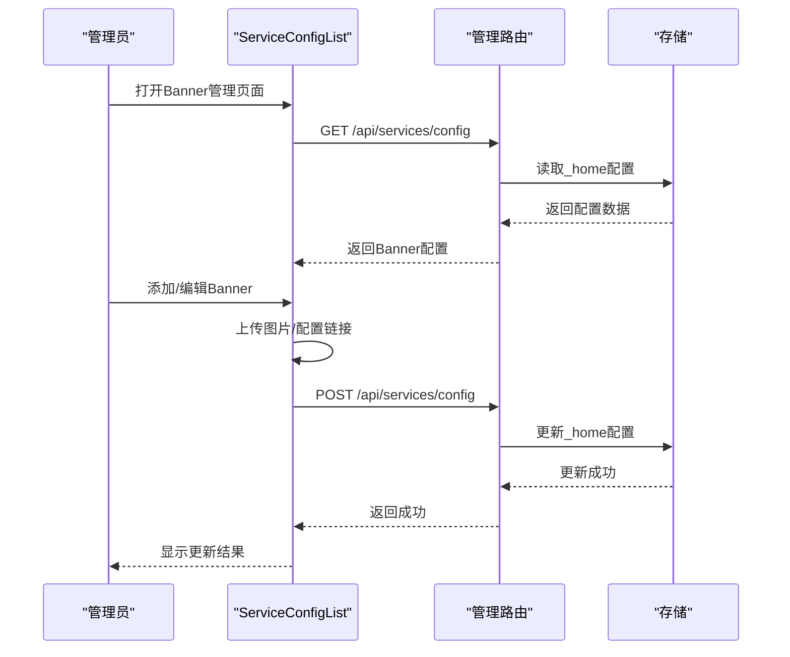

**图表来源**
- [frontend/h5/src/views/admin/config/ServiceConfigList.vue:425-482](file://frontend/h5/src/views/admin/config/ServiceConfigList.vue#L425-L482)
- [frontend/h5/src/views/admin/config/ServiceConfigList.vue:618-672](file://frontend/h5/src/views/admin/config/ServiceConfigList.vue#L618-L672)
- [backend/routes/admin.js:309-357](file://backend/routes/admin.js#L309-L357)

- 关键流程（Banner数据加载）
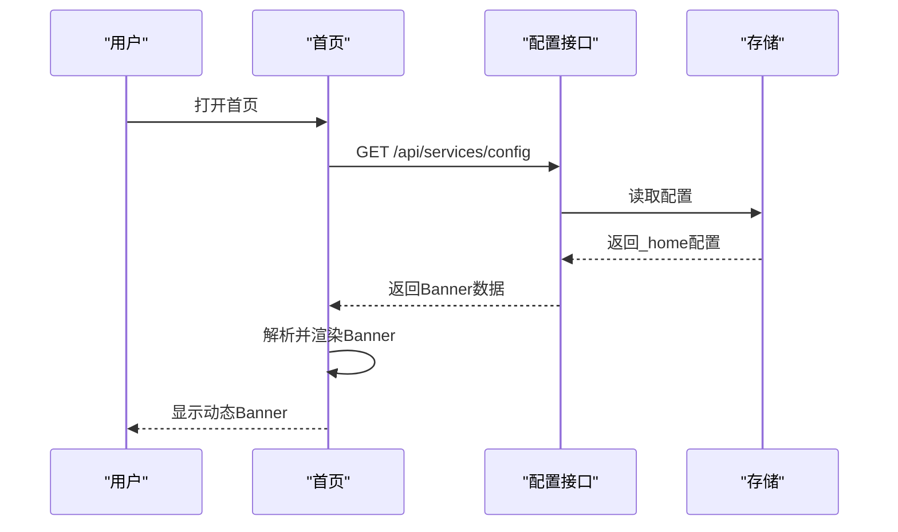

**图表来源**
- [frontend/h5/src/views/home/Index.vue:170-196](file://frontend/h5/src/views/home/Index.vue#L170-L196)
- [frontend/miniprogram/pages/home/index.vue:324-341](file://frontend/miniprogram/pages/home/index.vue#L324-L341)

**章节来源**
- [frontend/h5/src/views/admin/config/ServiceConfigList.vue:425-482](file://frontend/h5/src/views/admin/config/ServiceConfigList.vue#L425-L482)
- [frontend/h5/src/views/admin/config/ServiceConfigList.vue:618-672](file://frontend/h5/src/views/admin/config/ServiceConfigList.vue#L618-L672)
- [frontend/h5/src/views/home/Index.vue:170-196](file://frontend/h5/src/views/home/Index.vue#L170-L196)
- [frontend/miniprogram/pages/home/index.vue:324-341](file://frontend/miniprogram/pages/home/index.vue#L324-L341)

## 依赖分析
- 组件耦合
  - 前端 Pinia 状态与后端路由强耦合，通过统一接口交互。
  - 存储抽象屏蔽底层差异（JSON/PG），缓存模块提供透明缓存。
  - 中间件负责认证与权限校验，贯穿所有受保护路由。
  - **Banner管理系统依赖图片上传功能**，通过通用上传接口实现。
- 外部依赖
  - 微信登录依赖微信官方 API。
  - SSO 依赖平台会员查询接口。
  - Excel 导出依赖 XLSX 库。
  - **评价系统依赖图片上传功能**，通过通用上传接口实现。
  - **Banner管理依赖文件上传与图片处理**。
- 潜在循环依赖
  - 当前模块划分清晰，未发现循环依赖迹象。

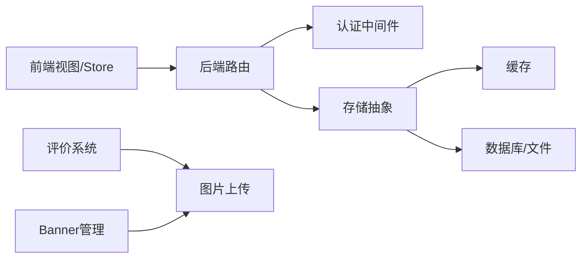

**图表来源**
- [backend/middleware/auth.js:11-45](file://backend/middleware/auth.js#L11-L45)
- [backend/storage.js:134-181](file://backend/storage.js#L134-L181)
- [backend/cache.js:1-40](file://backend/cache.js#L1-L40)

**章节来源**
- [backend/middleware/auth.js:11-45](file://backend/middleware/auth.js#L11-L45)
- [backend/storage.js:134-181](file://backend/storage.js#L134-L181)
- [backend/cache.js:1-40](file://backend/cache.js#L1-L40)

## 性能考虑
- 缓存策略
  - 用户/案例/申请/配置/评价/Banner分别设置不同 TTL，降低磁盘/数据库压力。
  - 写入后主动清理对应缓存键，保证读写一致性。
- 存储迁移
  - 支持 JSON 文件与 PostgreSQL 双模运行，PG 模式下使用 JSONB 存储，具备扩展性。
- 媒体处理
  - 前端对媒体 URL 进行归一化，避免跨域与内网地址问题，提升加载稳定性。
  - **Banner图片支持裁剪与压缩**，优化移动端加载性能。
- 导出性能
  - 导出接口一次性读取并写入缓冲区，适合中小规模数据；大规模建议分批或异步任务。
- **评价系统性能**
  - 评价数据采用独立文件存储，避免与其他数据竞争。
  - 支持分页加载，管理员界面默认加载200条数据。
- **Banner系统性能**
  - Banner配置通过缓存模块管理，减少频繁读取数据库的压力。
  - 支持多张Banner的懒加载，提升首屏加载速度。

**章节来源**
- [backend/cache.js:57-67](file://backend/cache.js#L57-L67)
- [backend/storage.js:134-181](file://backend/storage.js#L134-L181)
- [backend/db/schema.sql:1-10](file://backend/db/schema.sql#L1-L10)
- [frontend/h5/src/views/cases/Index.vue:197-234](file://frontend/h5/src/views/cases/Index.vue#L197-L234)
- [frontend/h5/src/views/admin/reviews/ReviewList.vue:146-157](file://frontend/h5/src/views/admin/reviews/ReviewList.vue#L146-L157)
- [frontend/h5/src/views/admin/config/ServiceConfigList.vue:390-423](file://frontend/h5/src/views/admin/config/ServiceConfigList.vue#L390-L423)

## 故障排查指南
- 登录失败
  - 检查账号密码是否正确，确认是否触发速率限制。
  - 若为明文密码，系统会自动升级为哈希存储。
- 令牌过期
  - 使用刷新接口获取新访问令牌，确保刷新令牌有效且未过期。
- 权限不足
  - 确认用户角色是否满足接口要求，注意 DSL/研学管理员的可见范围限制。
  - **Banner管理权限**：仅admin角色可编辑首页Banner配置。
- 导出失败
  - 检查数据量与内存占用，必要时分页导出或优化查询条件。
- 媒体加载失败
  - 检查媒体 URL 是否为相对路径或内网地址，前端已做归一化处理但仍需确保可访问。
- **评价系统故障**
  - 提交评价失败：检查网络连接和图片上传状态。
  - 审核功能异常：确认管理员权限和评价状态。
  - 数据不显示：检查评价状态是否为已审核通过。
- **Banner系统故障**
  - Banner图片上传失败：检查文件格式与大小限制。
  - Banner配置不生效：确认缓存是否正确清除。
  - Banner链接无效：检查链接格式是否正确。

**章节来源**
- [backend/routes/auth.js:110-116](file://backend/routes/auth.js#L110-L116)
- [backend/routes/auth.js:240-294](file://backend/routes/auth.js#L240-L294)
- [backend/middleware/auth.js:59-74](file://backend/middleware/auth.js#L59-L74)
- [backend/routes/admin.js:171-207](file://backend/routes/admin.js#L171-L207)
- [frontend/h5/src/views/cases/Index.vue:197-234](file://frontend/h5/src/views/cases/Index.vue#L197-L234)
- [frontend/h5/src/views/reviews/Index.vue:348-397](file://frontend/h5/src/views/reviews/Index.vue#L348-L397)
- [frontend/h5/src/views/admin/config/ServiceConfigList.vue:630-672](file://frontend/h5/src/views/admin/config/ServiceConfigList.vue#L630-L672)

## 结论
本平台通过清晰的模块划分与中间件权限控制，实现了用户、服务、订单、案例、评价与**新增的动态Banner管理**的完整业务闭环。前端采用 Pinia 管理状态，后端提供统一接口与缓存策略，具备良好的扩展性与可维护性。**本次Banner系统的重大重构为平台提供了灵活的首页展示能力，支持多张轮播图的动态管理与实时预览，进一步完善了平台的内容营销生态**。建议后续在大规模数据场景下引入异步导出与分页优化，并持续完善权限与审计日志。

## 附录
- 使用示例
  - 用户登录：调用登录接口，获取访问与刷新令牌，写入本地存储。
  - 服务申请：根据服务类型渲染不同表单字段，提交后由后台流转至订单管理。
  - 案例浏览：按分类筛选案例，点击卡片查看详情弹窗，支持媒体轮播。
  - **评价提交**：选择板块与课程，填写评分与内容，上传图片后提交，等待审核。
  - **评价管理**：管理员登录后台，审核待审核评价，通过或拒绝后影响用户端展示。
  - **Banner管理**：管理员登录后台，添加/编辑Banner图片与链接，实时预览效果。
- 业务流程图（服务申请）
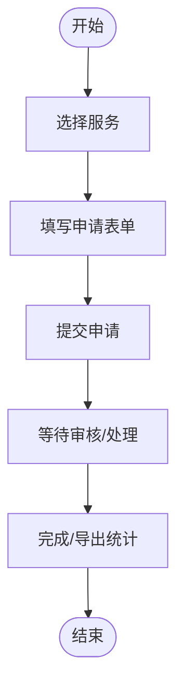

- **业务流程图（Banner管理系统）**
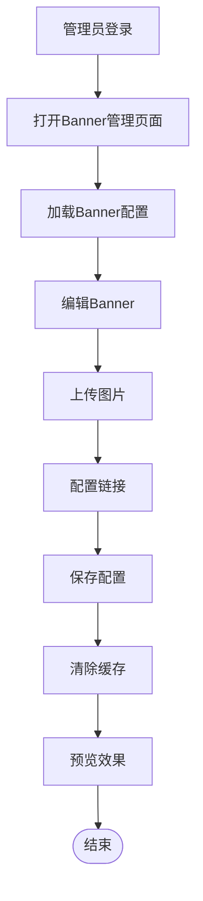

- **业务流程图（评价系统）**
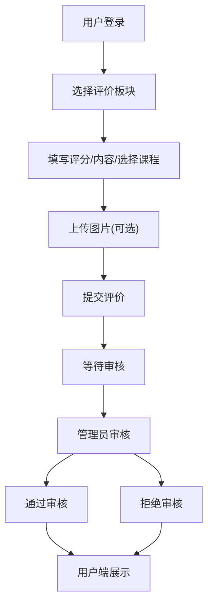