# 医疗配送模块功能设计

<cite>
**本文档引用的文件**
- [医疗配送模块功能设计.md](file://docs/医疗配送模块功能设计.md)
- [routes/medical.js](file://backend/routes/medical.js)
- [storage.js](file://backend/storage.js)
- [stores/medical.js](file://frontend/h5/src/stores/medical.js)
- [views/medical/OrderCreate.vue](file://frontend/h5/src/views/medical/OrderCreate.vue)
- [views/medical/Orders.vue](file://frontend/h5/src/views/medical/Orders.vue)
- [views/medical/OrderDetail.vue](file://frontend/h5/src/views/medical/OrderDetail.vue)
- [views/medical/Certification.vue](file://frontend/h5/src/views/medical/Certification.vue)
- [views/medical/Contacts.vue](file://frontend/h5/src/views/medical/Contacts.vue)
- [views/medical/ReceivedOrders.vue](file://frontend/h5/src/views/medical/ReceivedOrders.vue)
- [router/index.js](file://frontend/h5/src/router/index.js)
- [config.js](file://backend/config.js)
- [db/schema.sql](file://backend/db/schema.sql)
- [db/migrate.js](file://backend/db/migrate.js)
- [db/pg.js](file://backend/db/pg.js)
- [views/admin/medical/CertificationList.vue](file://frontend/h5/src/views/admin/medical/CertificationList.vue)
- [views/admin/medical/OrderList.vue](file://frontend/h5/src/views/admin/medical/OrderList.vue)
- [views/admin/medical/PadList.vue](file://frontend/h5/src/views/admin/medical/PadList.vue)
- [views/medical/OrderRate.vue](file://frontend/h5/src/views/medical/OrderRate.vue)
- [views/medical/MapSelect.vue](file://frontend/h5/src/views/medical/MapSelect.vue)
- [views/medical/CertificationStatus.vue](file://frontend/h5/src/views/medical/CertificationStatus.vue)
</cite>

## 更新摘要
**所做更改**
- 新增收件人订单管理功能：包括 /orders/received 接口和收件人权限扩展
- 新增收件人签收确认机制：/orders/:id/confirm-receipt 接口
- 更新订单状态流转图以包含收件人签收流程
- 增加收件人权限验证逻辑
- 更新前端路由保护机制

## 目录
1. [项目概述](#项目概述)
2. [模块架构](#模块架构)
3. [核心功能模块](#核心功能模块)
4. [数据流分析](#数据流分析)
5. [API接口设计](#api接口设计)
6. [前端界面设计](#前端界面设计)
7. [状态管理](#状态管理)
8. [权限控制](#权限控制)
9. [数据库设计](#数据库设计)
10. [性能考虑](#性能考虑)
11. [故障排除指南](#故障排除指南)
12. [总结](#总结)

## 项目概述

医疗配送模块是低空综合服务平台的重要组成部分，隶属于"无人机物流"业务线，与现有的"吊运作业"功能平级。该模块专注于提供同城/区域医疗物资的无人机即时配送服务，主要面向医院、检验中心、药房等医疗机构用户。

### 模块定位

- **业务范围**: 医疗配送（Medical Delivery）
- **模块归属**: 低空服务 > 无人机物流
- **开发阶段**: 已完成（MVP）
- **设计参考**: 闪送、UU跑腿、达达快送等同城即时配送平台

### 一期功能总览

| 编号 | 功能域 | 功能点 | 优先级 | 端侧 |
|------|--------|--------|--------|------|
| 1 | 寄件人认证 | 实名认证申请 | P0 | H5 |
| 2 | 寄件人认证 | 授权协议签署 | P0 | H5 |
| 3 | 寄件人认证 | 认证状态查询与管理 | P1 | H5 / 管理端 |
| 4 | 配送下单 | 寄件/取货信息填写 | P0 | H5 |
| 5 | 配送下单 | 起降场地图选择 | P0 | H5 |
| 6 | 配送下单 | 物品信息与紧急程度 | P0 | H5 |
| 7 | 配送下单 | 物品拍照上传 | P0 | H5 |
| 8 | 配送下单 | 预估时间展示 | P1 | H5 |
| 9 | 订单管理 | 订单提交与状态流转 | P0 | H5 / 管理端 |
| 10 | 订单管理 | 管理端接单与调度 | P0 | 管理端 |
| 11 | 订单管理 | 异常处理与取消 | P1 | H5 / 管理端 |
| 12 | 订单管理 | 取消规则与退单机制 | P0 | H5 / 管理端 |
| 13 | 订单管理 | 超时自动处理 | P1 | 后端 |
| 14 | 订单管理 | 再次下单（快捷复制） | P1 | H5 |
| 15 | 常用联系人 | 联系人管理（增删改） | P1 | H5 |
| 16 | 常用联系人 | 下单时快速选择 | P1 | H5 |
| 17 | 评价系统 | 配送完成后评价 | P2 | H5 |
| 18 | 起降场管理 | 起降场坐标预设 | P0 | 管理端 |
| 19 | 起降场管理 | 启停用管理 | P1 | 管理端 |
| 20 | 消息通知 | 短信通知（接口预留） | P1 | 后端 |
| 21 | 消息通知 | 订单状态变更记录 | P1 | 后端 |
| 22 | 一键联系 | 寄件人/取货人电话联系 | P1 | H5 / 管理端 |
| 23 | 收件人管理 | 寄件人订单列表 | P0 | H5 |
| 24 | 收件人管理 | 收件人签收确认 | P0 | H5 |

## 模块架构

### 整体架构图

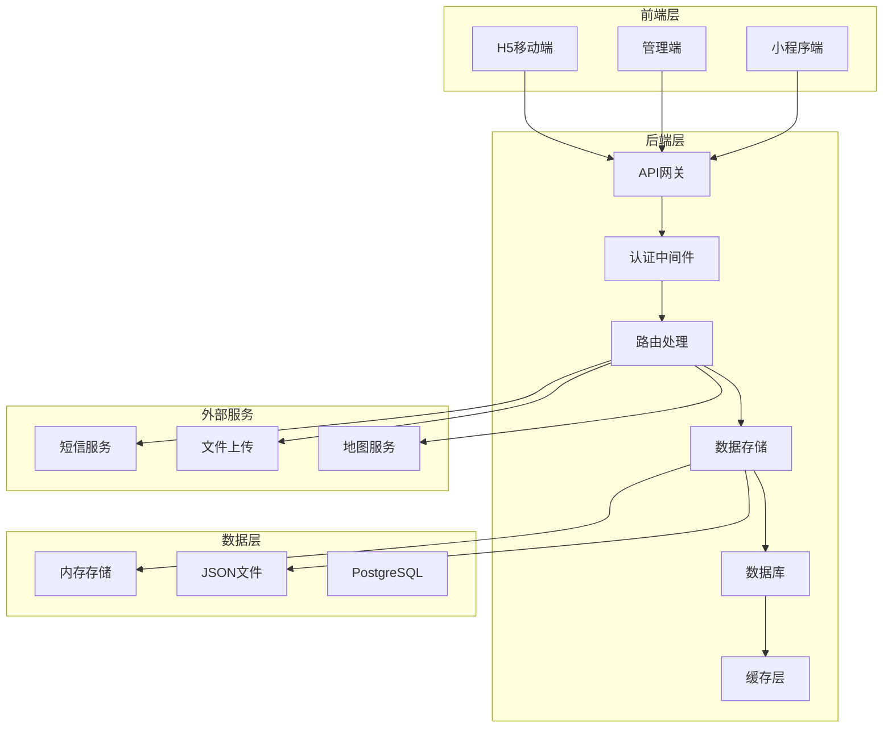

**图表来源**
- [routes/medical.js:1-20](file://backend/routes/medical.js#L1-L20)
- [storage.js:1-30](file://backend/storage.js#L1-L30)

### 技术栈

- **前端**: Vue.js 3 + Vant + Pinia
- **后端**: Node.js + Express
- **数据库**: PostgreSQL + JSON文件存储
- **认证**: JWT Token + 角色权限控制
- **文件存储**: 本地文件系统 + 对象存储
- **消息通知**: 短信服务集成
- **地图服务**: 高德地图API集成

## 核心功能模块

### 1. 寄件人认证模块

#### 认证流程

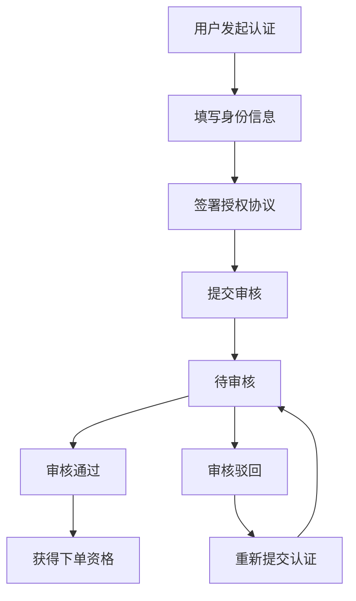

**图表来源**
- [views/medical/Certification.vue:1-130](file://frontend/h5/src/views/medical/Certification.vue#L1-L130)
- [views/medical/CertificationStatus.vue:1-80](file://frontend/h5/src/views/medical/CertificationStatus.vue#L1-L80)

#### 认证字段设计

| 字段 | 必填 | 说明 |
|------|------|------|
| 真实姓名 | 是 | 与身份证一致 |
| 手机号 | 是 | 接收验证码与通知 |
| 所属机构 | 是 | 医院/检验中心/药房/其他 |
| 机构名称 | 是 | 机构全称 |
| 机构地址 | 否 | 辅助信息 |
| 职务 | 否 | 医生/护士/药师/检验师/其他 |
| 授权协议确认 | 是 | 勾选确认 |

#### 认证状态机

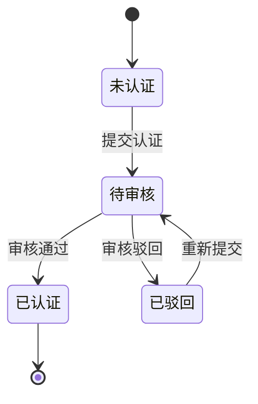

**图表来源**
- [stores/medical.js:1-120](file://frontend/h5/src/stores/medical.js#L1-L120)
- [routes/medical.js:100-200](file://backend/routes/medical.js#L100-L200)

### 2. 配送下单模块

#### 下单页面结构

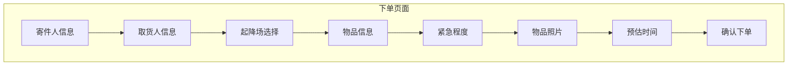

**图表来源**
- [views/medical/OrderCreate.vue:1-122](file://frontend/h5/src/views/medical/OrderCreate.vue#L1-L122)
- [views/medical/MapSelect.vue:1-150](file://frontend/h5/src/views/medical/MapSelect.vue#L1-L150)

#### 物品拍照上传

- **上传要求**: 至少1张，最多3张物品照片
- **用途**: 确认物品包装完整、符合运输要求
- **技术实现**: 复用现有Multer上传机制，图片压缩至1MB以内

#### 预估时间计算

**更新** 订单估价已从费用计算改为时间估算

| 计价因子 | 计算规则 | 说明 |
|----------|----------|------|
| 响应时间 | 普通30分钟/加急15分钟/特急5分钟 | 根据紧急程度计算 |
| 准备时间 | 普通20分钟/加急10分钟/特急5分钟 | 物品准备和交接时间 |
| 飞行时间 | 距离/60小时 | 基于60km/h飞行速度计算 |
| 温控加价 | 无 | 温控要求不影响预估时间 |

### 3. 订单管理系统

#### 订单状态流转

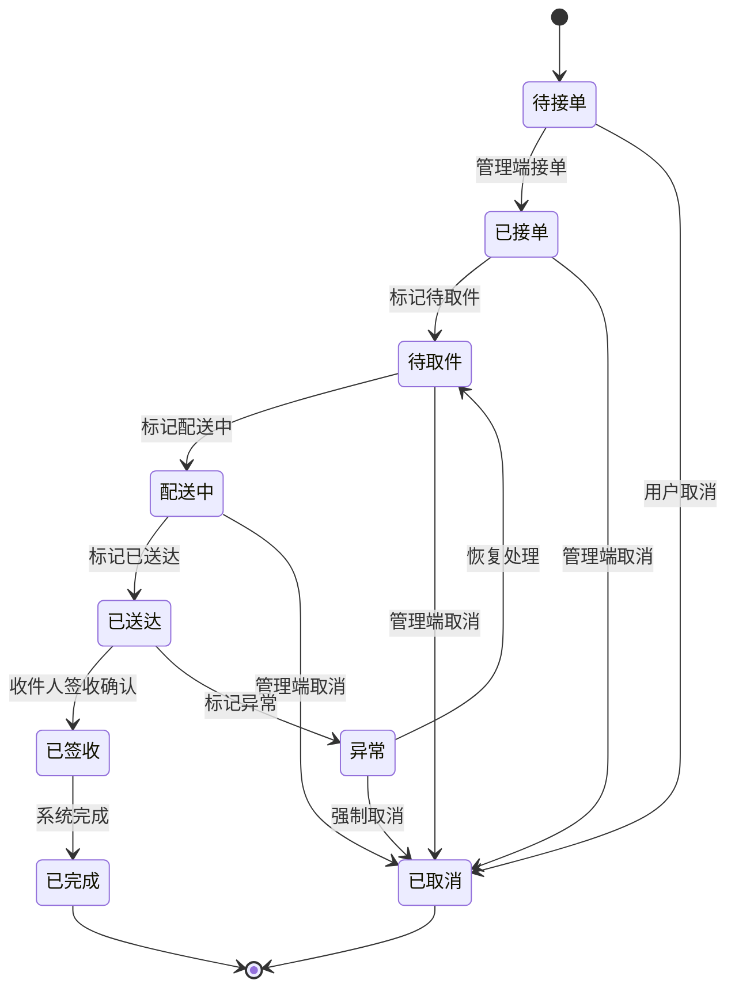

**图表来源**
- [views/medical/Orders.vue:1-42](file://frontend/h5/src/views/medical/Orders.vue#L1-L42)
- [views/medical/OrderDetail.vue:81-128](file://frontend/h5/src/views/medical/OrderDetail.vue#L81-L128)

#### 异常类型

| 异常代码 | 异常类型 | 说明 |
|----------|----------|------|
| WEATHER | 天气原因 | 大风/雷雨/大雾等不适宜飞行 |
| EQUIPMENT | 设备故障 | 无人机或起降场设备故障 |
| AIRSPACE | 空域限制 | 临时空域管制或禁飞 |
| ITEM_ISSUE | 物品问题 | 物品不符合运输要求或包装破损 |
| RECEIVER | 取货人问题 | 取货人失联或拒绝取货 |
| OTHER | 其他 | 其他不可控因素 |

### 4. 收件人订单管理模块

#### 收件人订单列表

**新增** 收件人可通过 /api/medical/orders/received 接口获取自己负责配送的订单列表

- **权限验证**: 通过 receiver.user_id 或手机号匹配
- **状态筛选**: 支持按状态过滤（全部/配送中/待签收/已签收）
- **分页支持**: 默认每页20条记录
- **兼容性**: 支持旧数据格式（手机号匹配）

#### 收件人签收确认

**新增** 收件人可通过 /api/medical/orders/:id/confirm-receipt 接口进行签收确认

- **权限验证**: 仅收件人可操作
- **状态检查**: 仅已送达状态可签收
- **签收信息**: 记录签收人、签收时间和签收方式
- **通知机制**: 自动通知寄件人订单已完成

#### 收件人权限验证逻辑

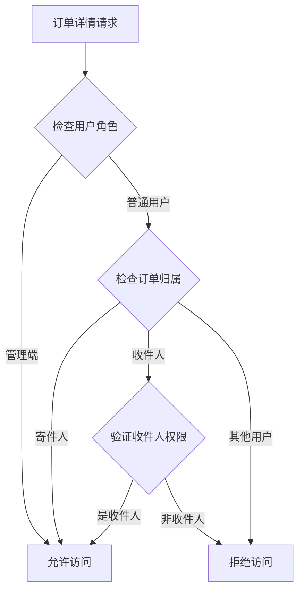

**图表来源**
- [routes/medical.js:654-681](file://backend/routes/medical.js#L654-L681)
- [routes/medical.js:683-729](file://backend/routes/medical.js#L683-L729)

### 5. 起降场管理系统

#### 起降场数据结构

| 字段 | 类型 | 说明 |
|------|------|------|
| id | UUID | 唯一标识 |
| name | String | 起降场名称（如"温医大附一院起降场"） |
| address | String | 详细地址描述 |
| latitude | Number | 纬度（WGS-84） |
| longitude | Number | 经度（WGS-84） |
| contact_name | String | 场地联系人 |
| contact_phone | String | 场地联系电话 |
| operating_hours | String | 运营时间（如"08:00-20:00"） |
| max_weight | Number | 最大承重(kg) |
| enabled | Boolean | 是否启用 |
| created_at | DateTime | 创建时间 |
| updated_at | DateTime | 更新时间 |

### 6. 常用联系人管理

#### 联系人字段

| 字段 | 类型 | 必填 | 说明 |
|------|------|------|------|
| id | UUID | - | 唯一标识 |
| user_id | UUID | 是 | 所属用户 |
| name | String | 是 | 联系人姓名 |
| phone | String | 是 | 联系电话 |
| org_name | String | 否 | 所属机构 |
| label | String | 否 | 标签（如"检验科张护士"） |
| is_default | Boolean | - | 是否默认联系人 |
| created_at | DateTime | - | 创建时间 |

### 7. 评价系统

#### 评价数据结构

| 字段 | 类型 | 说明 |
|------|------|------|
| id | UUID | 唯一标识 |
| order_id | UUID | 关联订单 |
| user_id | UUID | 评价用户 |
| rating | Integer | 评分（1-5星） |
| tags | Array | 评价标签 |
| comment | String | 评价内容 |
| created_at | DateTime | 评价时间 |

## 数据流分析

### 订单创建流程

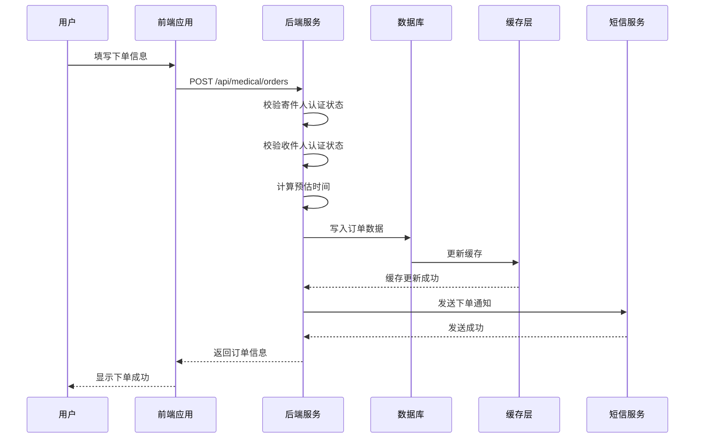

**图表来源**
- [views/medical/OrderCreate.vue:259-279](file://frontend/h5/src/views/medical/OrderCreate.vue#L259-L279)
- [routes/medical.js:508-641](file://backend/routes/medical.js#L508-L641)

### 收件人签收流程

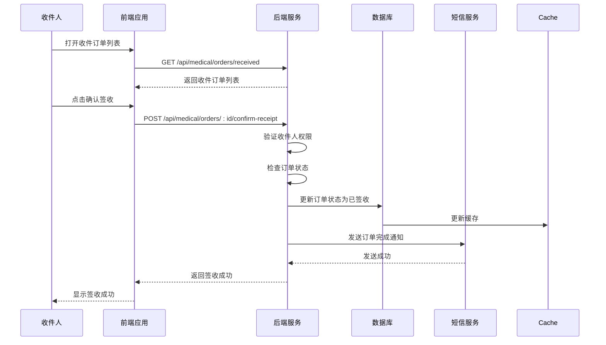

**图表来源**
- [views/medical/ReceivedOrders.vue:107-120](file://frontend/h5/src/views/medical/ReceivedOrders.vue#L107-L120)
- [routes/medical.js:683-729](file://backend/routes/medical.js#L683-L729)

### 超时检查机制

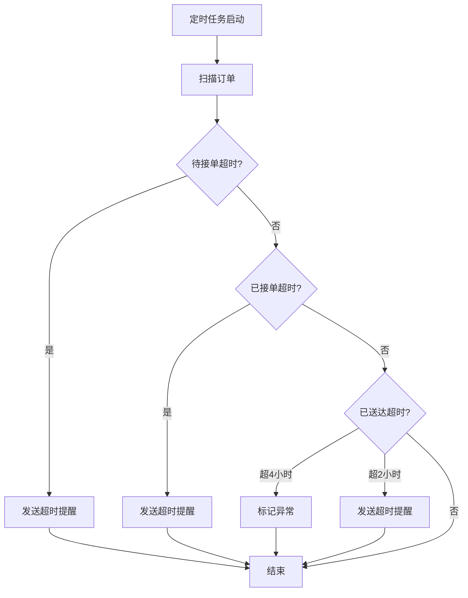

**图表来源**
- [routes/medical.js:1034-1106](file://backend/routes/medical.js#L1034-L1106)

## API接口设计

### 认证相关接口

| 方法 | 路径 | 说明 |
|------|------|------|
| GET | /api/medical/certification/status | 查询当前用户认证状态 |
| POST | /api/medical/certification/apply | 提交认证申请 |
| POST | /api/medical/certification/resubmit | 重新提交认证（驳回后） |
| GET | /api/medical/certification/admin/list | 管理端获取认证列表 |
| POST | /api/medical/certification/admin/approve | 管理端审核通过 |
| POST | /api/medical/certification/admin/reject | 管理端审核驳回 |

### 起降场相关接口

| 方法 | 路径 | 说明 |
|------|------|------|
| GET | /api/medical/pads | 获取启用的起降场列表（C端） |
| GET | /api/medical/pads/all | 获取全部起降场（管理端） |
| POST | /api/medical/pads | 新增起降场 |
| PUT | /api/medical/pads/:id | 编辑起降场 |
| DELETE | /api/medical/pads/:id | 删除起降场 |

### 订单相关接口

| 方法 | 路径 | 说明 |
|------|------|------|
| POST | /api/medical/orders | 创建配送订单 |
| GET | /api/medical/orders/my | 获取我的订单列表（C端） |
| GET | /api/medical/orders/:id | 获取订单详情 |
| POST | /api/medical/orders/:id/cancel | 取消订单（C端/管理端） |
| POST | /api/medical/orders/:id/reorder | 再次下单（获取复制数据） |
| GET | /api/medical/orders | 获取全部订单（管理端） |
| POST | /api/medical/orders/:id/accept | 管理端接单 |
| POST | /api/medical/orders/:id/pickup | 标记待取件 |
| POST | /api/medical/orders/:id/deliver | 标记配送中 |
| POST | /api/medical/orders/:id/delivered | 标记已送达 |
| POST | /api/medical/orders/:id/complete | 标记已完成 |
| POST | /api/medical/orders/:id/exception | 标记异常 |
| GET | /api/medical/orders/estimate | 获取预估时间 |
| GET | /api/medical/orders/received | 获取收件人订单列表（新增） |
| POST | /api/medical/orders/:id/confirm-receipt | 收件人签收确认（新增） |

### 常用联系人接口

| 方法 | 路径 | 说明 |
|------|------|------|
| GET | /api/medical/contacts | 获取常用联系人列表 |
| POST | /api/medical/contacts | 新增常用联系人 |
| PUT | /api/medical/contacts/:id | 编辑常用联系人 |
| DELETE | /api/medical/contacts/:id | 删除常用联系人 |

### 评价相关接口

| 方法 | 路径 | 说明 |
|------|------|------|
| POST | /api/medical/orders/:id/rate | 提交订单评价 |
| GET | /api/medical/orders/:id/rating | 获取订单评价 |
| GET | /api/medical/ratings/stats | 获取评价统计（管理端） |

## 前端界面设计

### 页面布局

#### 认证页面

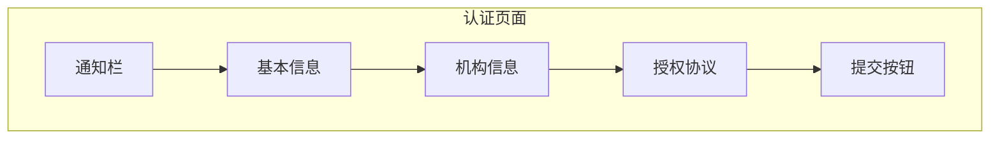

**图表来源**
- [views/medical/Certification.vue:1-130](file://frontend/h5/src/views/medical/Certification.vue#L1-L130)
- [views/medical/CertificationStatus.vue:1-80](file://frontend/h5/src/views/medical/CertificationStatus.vue#L1-L80)

#### 下单页面


**图表来源**
- [views/medical/OrderCreate.vue:1-122](file://frontend/h5/src/views/medical/OrderCreate.vue#L1-L122)
- [views/medical/MapSelect.vue:1-150](file://frontend/h5/src/views/medical/MapSelect.vue#L1-L150)

#### 订单列表页面

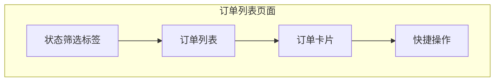

**图表来源**
- [views/medical/Orders.vue:1-42](file://frontend/h5/src/views/medical/Orders.vue#L1-L42)

#### 收件人订单页面

**新增** 收件人可通过专门的订单页面管理自己负责配送的订单

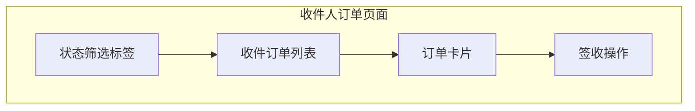

**图表来源**
- [views/medical/ReceivedOrders.vue:1-199](file://frontend/h5/src/views/medical/ReceivedOrders.vue#L1-L199)

### 管理端界面

#### 管理端功能页面

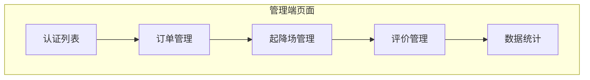

**图表来源**
- [views/admin/medical/CertificationList.vue:1-100](file://frontend/h5/src/views/admin/medical/CertificationList.vue#L1-L100)
- [views/admin/medical/OrderList.vue:1-120](file://frontend/h5/src/views/admin/medical/OrderList.vue#L1-L120)
- [views/admin/medical/PadList.vue:1-80](file://frontend/h5/src/views/admin/medical/PadList.vue#L1-L80)

### 组件交互

#### 订单详情组件

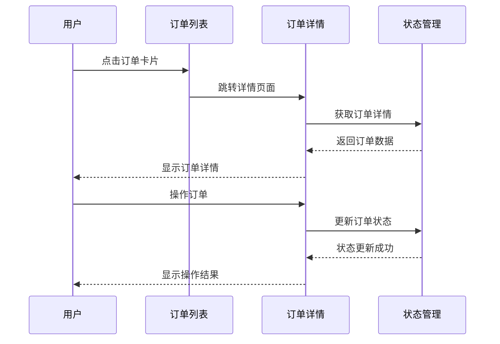

**图表来源**
- [views/medical/OrderDetail.vue:81-128](file://frontend/h5/src/views/medical/OrderDetail.vue#L81-L128)

#### 收件人签收组件

**新增** 收件人签收确认流程

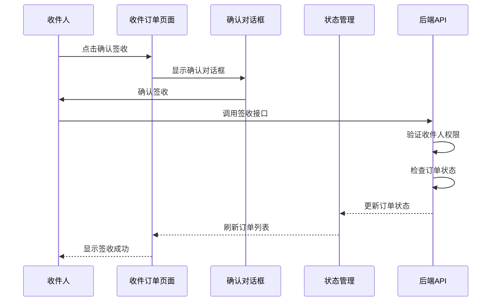

**图表来源**
- [views/medical/ReceivedOrders.vue:107-120](file://frontend/h5/src/views/medical/ReceivedOrders.vue#L107-L120)

## 状态管理

### Pinia状态管理

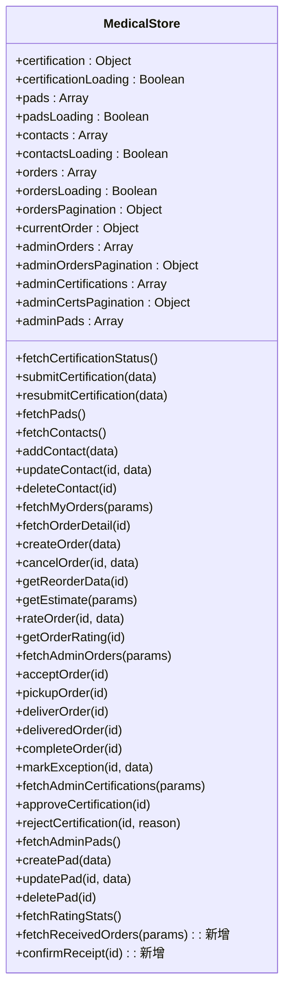

**图表来源**
- [stores/medical.js:1-301](file://frontend/h5/src/stores/medical.js#L1-L301)

### 状态流转

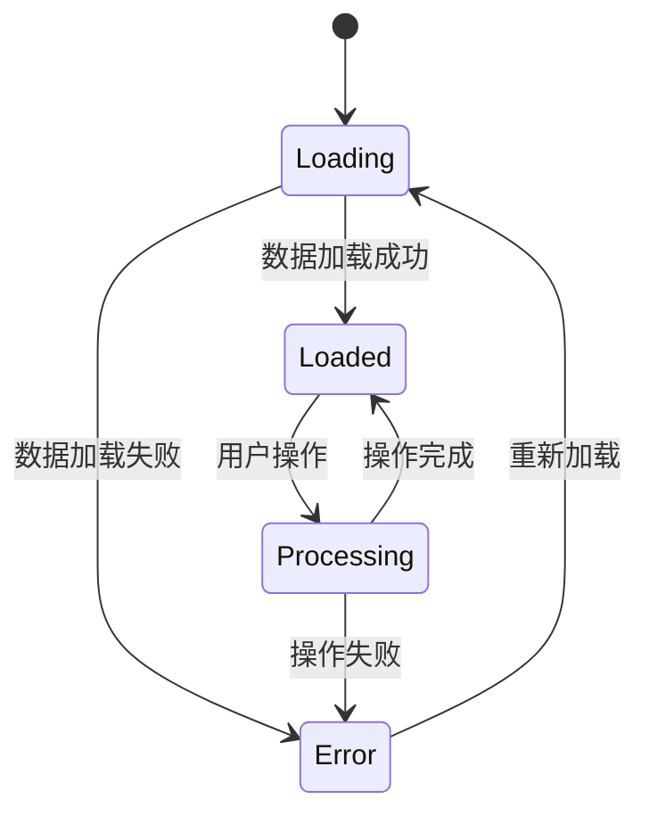

**图表来源**
- [stores/medical.js:44-301](file://frontend/h5/src/stores/medical.js#L44-L301)

## 权限控制

### 角色权限矩阵

| 角色 | 权限范围 |
|------|----------|
| 普通用户 | 提交认证申请、查看认证状态、下单、查看自己的订单、取消自己的订单、查看收件订单、签收确认 |
| admin | 全部管理端权限：订单管理、认证审核、起降场管理、短信配置 |
| dsl_admin | 同上（无人机物流模块管理员） |

### 认证中间件

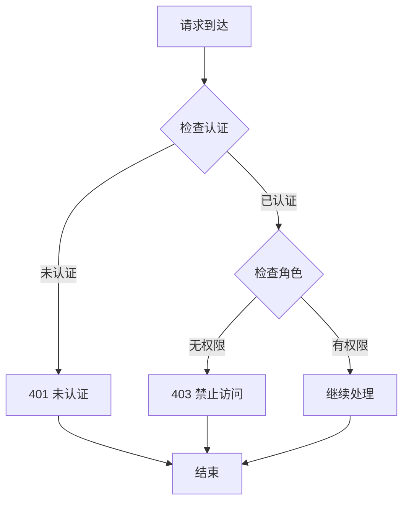

**图表来源**
- [routes/medical.js:16-19](file://backend/routes/medical.js#L16-L19)

### 前端路由保护

**更新** 前端路由增加了对医疗配送模块的登录保护

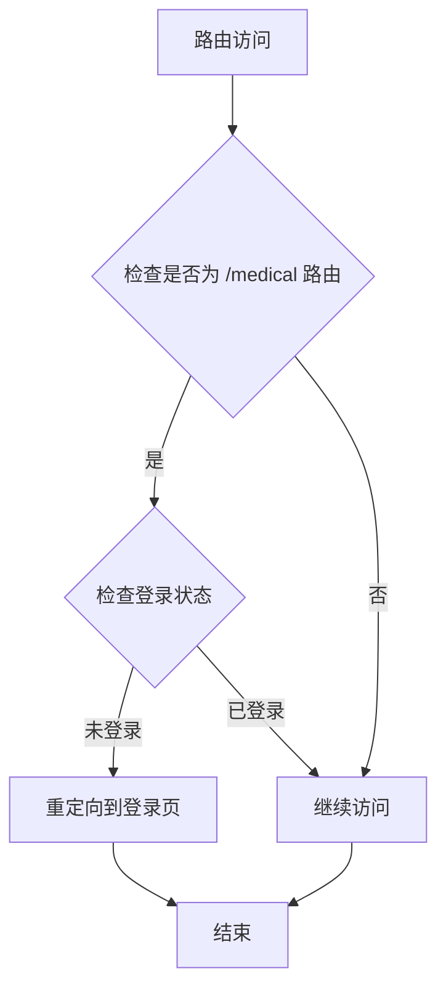

**图表来源**
- [router/index.js:272-280](file://frontend/h5/src/router/index.js#L272-L280)

### 收件人权限验证

**新增** 收件人权限验证逻辑

```mermaid
flowchart TD
OrderDetail[订单详情请求] --> CheckRole{检查用户角色}
CheckRole --> |管理端| Allow[允许访问]
CheckRole --> |普通用户| CheckOwner{检查订单归属}
CheckOwner --> |寄件人| Allow
CheckOwner --> |收件人| CheckReceiver{验证收件人权限}
CheckReceiver --> |是收件人| Allow
CheckReceiver --> |手机号匹配| CheckPhone{验证手机号}
CheckPhone --> |匹配成功| Allow
CheckPhone --> |匹配失败| Deny[拒绝访问]
CheckOwner --> |其他用户| Deny
```

**图表来源**
- [routes/medical.js:741-744](file://backend/routes/medical.js#L741-L744)

## 数据库设计

### 数据模型关系

```mermaid
erDiagram
MEDICAL_CERTIFICATIONS {
uuid id PK
uuid user_id
string real_name
string phone
string org_type
string org_name
string org_address
string position
string status
boolean auth_agreement
datetime auth_signed_at
json review
datetime created_at
datetime updated_at
}
MEDICAL_PADS {
uuid id PK
string name
string address
float latitude
float longitude
string contact_name
string contact_phone
string operating_hours
float max_weight
boolean enabled
boolean deleted
datetime created_at
datetime updated_at
}
MEDICAL_CONTACTS {
uuid id PK
uuid user_id
string name
string phone
string org_name
string label
boolean is_default
datetime created_at
}
MEDICAL_ORDERS {
uuid id PK
string order_no
json sender
json receiver
json route
json item
string urgency
string urgency_label
datetime estimated_delivery_time
string status
string status_label
json timeline
json operator
json cancel_info
json exception_info
uuid rating
string remark
boolean timeout_warned
datetime created_at
datetime updated_at
}
MEDICAL_RATINGS {
uuid id PK
uuid order_id
uuid user_id
int rating
array tags
string comment
datetime created_at
}
MEDICAL_SMS_LOGS {
uuid id PK
uuid order_id
string phone
string template_key
string content
string status
string provider_msg
datetime created_at
}
MEDICAL_CERTIFICATIONS ||--o{ MEDICAL_ORDERS : "认证用户"
MEDICAL_PADS ||--o{ MEDICAL_ORDERS : "起降场"
MEDICAL_CONTACTS ||--o{ MEDICAL_ORDERS : "联系人"
MEDICAL_ORDERS ||--|| MEDICAL_RATINGS : "评价"
```

**图表来源**
- [db/schema.sql:1-200](file://backend/db/schema.sql#L1-L200)
- [storage.js:13-33](file://backend/storage.js#L13-L33)

### 存储策略

**更新** 数据库存储结构已更新为 PostgreSQL JSON 存储

| 数据类型 | 存储方式 | 缓存策略 | 过期时间 |
|----------|----------|----------|----------|
| 订单数据 | PostgreSQL JSONB | 缓存 | 30秒 |
| 认证数据 | PostgreSQL JSONB | 缓存 | 60秒 |
| 起降场数据 | PostgreSQL JSONB | 缓存 | 5分钟 |
| 联系人数据 | PostgreSQL JSONB | 缓存 | 60秒 |
| 评价数据 | PostgreSQL JSONB | 缓存 | 60秒 |
| 短信日志 | PostgreSQL JSONB | 缓存 | 60秒 |

**图表来源**
- [storage.js:277-331](file://backend/storage.js#L277-L331)

### 数据迁移脚本

```mermaid
flowchart TD
Start[数据库初始化] --> CreateSchema[创建表结构]
CreateSchema --> SeedData[导入基础数据]
SeedData --> Migrate[执行迁移脚本]
Migrate --> Complete[初始化完成]
```

**图表来源**
- [db/migrate.js:1-100](file://backend/db/migrate.js#L1-L100)
- [db/pg.js:1-80](file://backend/db/pg.js#L1-L80)

## 性能考虑

### 缓存策略

1. **读取缓存**: 对频繁访问的数据使用内存缓存，减少磁盘IO
2. **写入缓存**: 写入后立即清除对应缓存，确保数据一致性
3. **缓存过期**: 不同数据设置不同过期时间，平衡性能和实时性

### 文件存储优化

1. **异步写入**: 使用异步文件写入，避免阻塞主线程
2. **批量操作**: 对于大量数据操作，使用批量处理
3. **文件大小限制**: 控制单个文件大小，便于管理和备份

### 短信服务优化

1. **模拟模式**: 开发环境使用日志模拟，避免真实短信费用
2. **模板配置**: 预留短信模板配置，便于生产环境接入
3. **发送记录**: 记录短信发送状态，便于问题排查

## 故障排除指南

### 常见问题及解决方案

#### 1. 下单失败

**问题症状**: 下单后提示失败，订单未创建

**可能原因**:
- 用户未完成认证
- 起降场选择错误
- 物品照片上传失败
- 系统超时
- 收件人未完成认证

**解决步骤**:
1. 检查用户认证状态
2. 验证起降场有效性
3. 确认物品照片格式和大小
4. 检查收件人认证状态
5. 查看系统日志

#### 2. 收件人无法看到订单

**问题症状**: 收件人登录后看不到自己负责配送的订单

**可能原因**:
- 收件人未完成认证
- 订单状态不正确
- 数据库中收件人信息格式不正确

**解决步骤**:
1. 检查收件人认证状态
2. 验证订单状态是否为待签收或已送达
3. 检查数据库中收件人信息格式
4. 确认手机号匹配逻辑

#### 3. 签收确认失败

**问题症状**: 收件人点击签收后提示失败

**可能原因**:
- 收件人权限验证失败
- 订单状态不是已送达
- 系统内部错误

**解决步骤**:
1. 检查收件人认证状态
2. 验证订单状态是否为已送达
3. 查看后端日志
4. 确认签收接口调用

#### 4. 短信通知失败

**问题症状**: 订单状态变更后未收到短信通知

**可能原因**:
- 短信服务配置错误
- 手机号码格式不正确
- 短信模板未配置

**解决步骤**:
1. 检查短信服务配置
2. 验证手机号格式
3. 测试短信模板
4. 查看短信发送日志

#### 5. 订单状态异常

**问题症状**: 订单状态显示异常或无法更新

**可能原因**:
- 超时检查任务未运行
- 数据库连接问题
- 权限不足

**解决步骤**:
1. 检查定时任务状态
2. 验证数据库连接
3. 确认用户权限
4. 重启相关服务

### 调试工具

#### 日志分析

```javascript
// 后端日志示例
logger.info('医疗配送订单已创建', { 
  orderId: newOrder.id, 
  orderNo: orderNo 
});

logger.warn('订单待接单超时', { 
  orderId: order.id, 
  orderNo: order.order_no 
});

logger.info('收件人确认签收', { 
  orderId: id, 
  receiverId: req.user.id 
});
```

#### 前端调试

```javascript
// 状态管理调试
console.log('当前认证状态:', store.certification);
console.log('订单列表:', store.orders);
console.log('收件订单:', store.receivedOrders);
console.log('起降场列表:', store.pads);
```

## 总结

医疗配送模块是一个功能完整、架构清晰的即时配送系统。通过合理的模块划分、完善的权限控制和高效的存储策略，实现了从认证到配送的全流程管理。

### 主要优势

1. **模块化设计**: 功能模块清晰分离，便于维护和扩展
2. **权限控制**: 严格的用户认证和角色权限管理
3. **状态管理**: 完善的订单状态流转和异常处理机制
4. **数据存储**: 灵活的存储策略，支持多种部署环境
5. **用户体验**: 直观的界面设计和流畅的操作体验
6. **管理功能**: 完整的管理端功能，支持多角色协同工作
7. **路由保护**: 增强的前端路由保护机制
8. **收件人管理**: 新增的收件人订单管理和签收确认功能

### 已实现的功能

- **认证管理**: 简化的实名认证流程，移除身份证号和照片要求
- **订单管理**: 全流程订单状态管理，支持异常处理
- **起降场管理**: 起降场的增删改查和状态管理
- **联系人管理**: 常用联系人的便捷管理
- **评价系统**: 完整的评价和统计功能
- **管理端**: 全套管理功能，支持多角色操作
- **路由保护**: 医疗配送模块的登录保护机制
- **收件人管理**: 收件人订单列表和签收确认功能

### 新增功能特性

- **收件人订单管理**: 通过 /orders/received 接口提供收件人专用订单列表
- **收件人权限验证**: 支持通过 user_id 和手机号双重验证
- **签收确认机制**: 收件人专属的签收确认接口和流程
- **状态完整性**: 完整的订单状态流转，包含收件人签收环节

### 后续改进方向

1. **支付集成**: 二期接入在线支付功能
2. **实时跟踪**: 无人机实时位置跟踪
3. **智能调度**: 基于AI的智能调度算法
4. **数据分析**: 配送效率和质量分析
5. **多端支持**: 移动端小程序和管理端APP

该模块为低空综合服务平台提供了重要的医疗配送能力，为未来的业务扩展奠定了坚实的基础。新增的收件人管理功能进一步完善了peer-to-peer订单管理模式，提升了整体用户体验和服务质量。