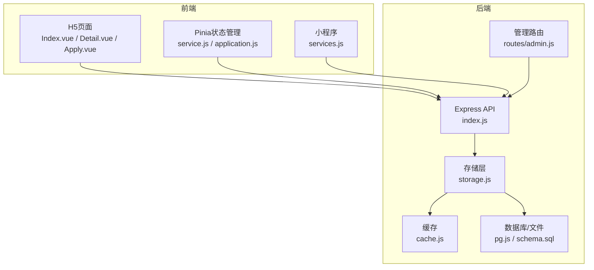
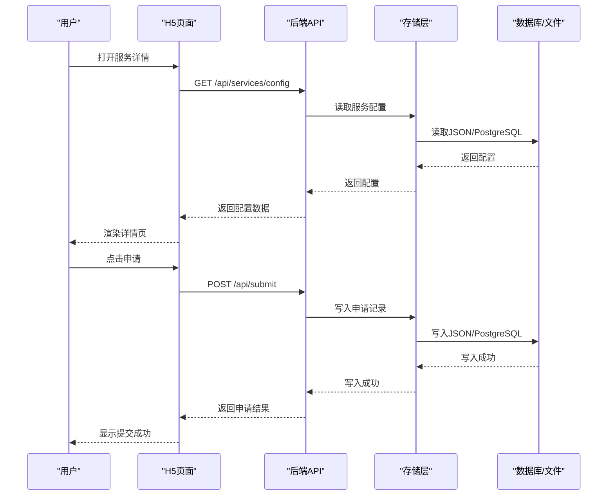
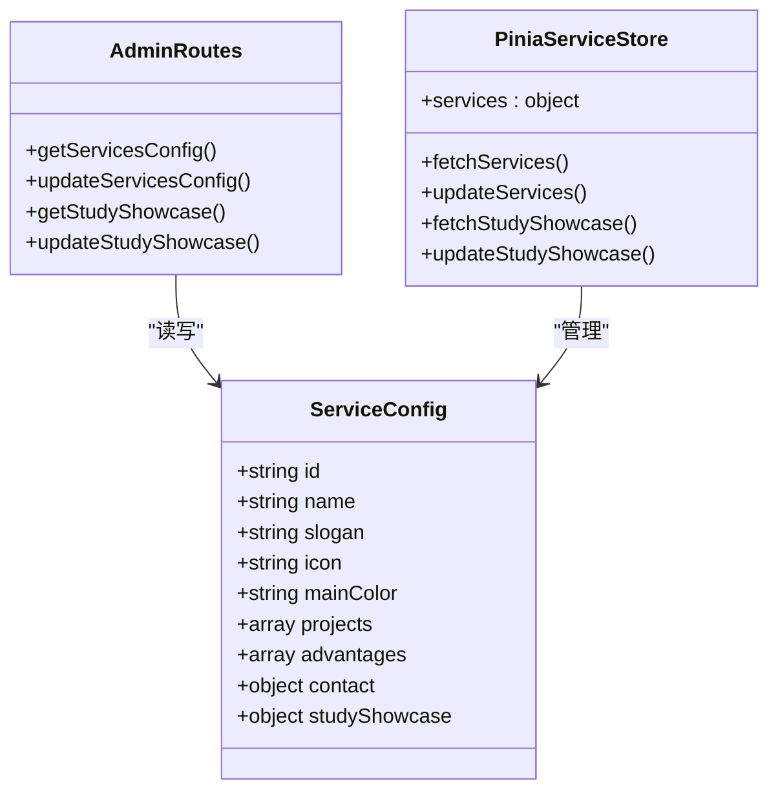
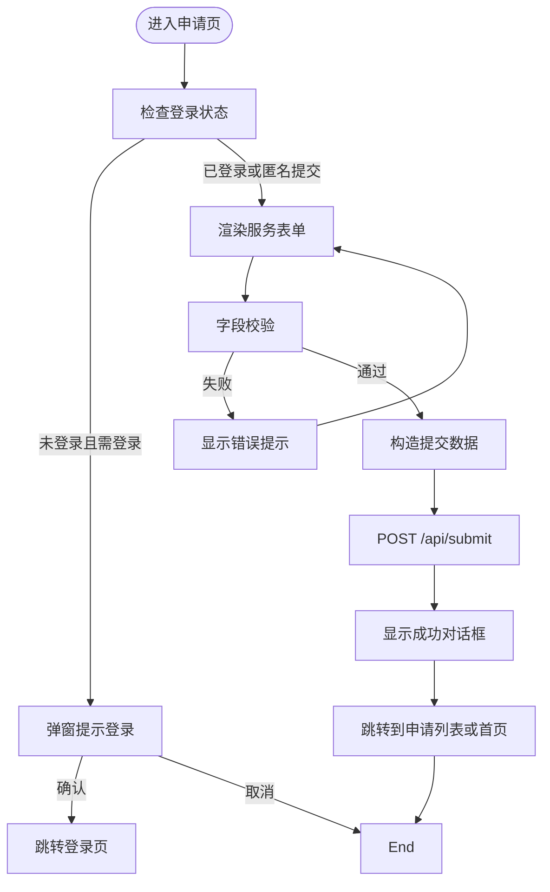
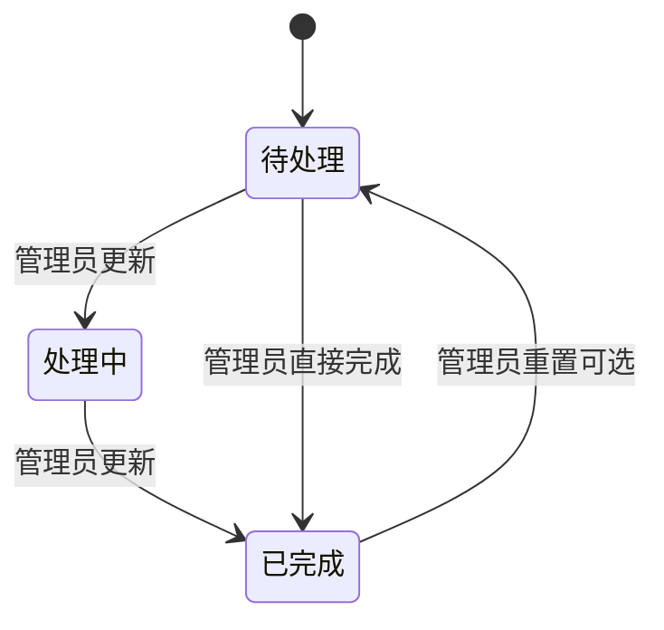
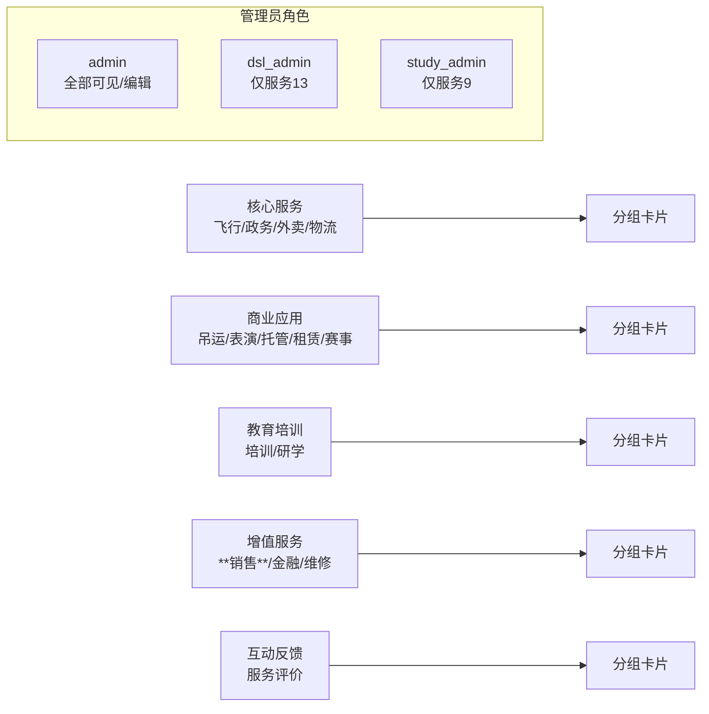
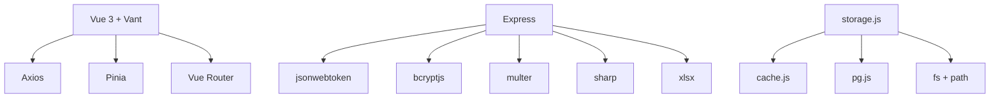
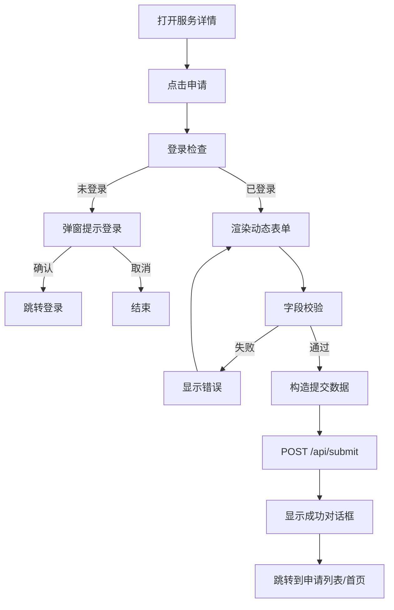
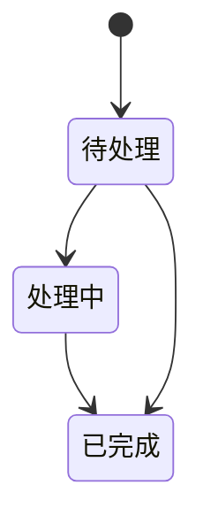

# 服务管理系统

<cite>
**本文档引用的文件**
- [backend/index.js](file://backend/index.js)
- [backend/config.js](file://backend/config.js)
- [backend/storage.js](file://backend/storage.js)
- [backend/cache.js](file://backend/cache.js)
- [backend/db/pg.js](file://backend/db/pg.js)
- [backend/db/schema.sql](file://backend/db/schema.sql)
- [backend/routes/admin.js](file://backend/routes/admin.js)
- [backend/services_config.json](file://backend/services_config.json)
- [frontend/h5/src/views/services/Index.vue](file://frontend/h5/src/views/services/Index.vue)
- [frontend/h5/src/views/services/Detail.vue](file://frontend/h5/src/views/services/Detail.vue)
- [frontend/h5/src/views/services/Apply.vue](file://frontend/h5/src/views/services/Apply.vue)
- [frontend/h5/src/stores/service.js](file://frontend/h5/src/stores/service.js)
- [frontend/h5/src/stores/application.js](file://frontend/h5/src/stores/application.js)
- [frontend/miniprogram/utils/services.js](file://frontend/miniprogram/utils/services.js)
- [frontend/miniprogram/pages/services/detail.vue](file://frontend/miniprogram/pages/services/detail.vue)
</cite>

## 更新摘要
**所做更改**
- 更新服务名称标准化：将'二手交易'和'无人机二手交易'统一为'无人机销售'
- 更新图标资源：exchange.svg替换为shop.svg，确保前后端图标一致性
- 调整服务布局：优化服务列表网格布局，改进移动端显示效果
- 更新服务配置：同步后端服务配置中的图标路径和描述信息

## 目录
1. [项目概述](#项目概述)
2. [项目结构](#项目结构)
3. [核心组件](#核心组件)
4. [架构总览](#架构总览)
5. [详细组件分析](#详细组件分析)
6. [依赖关系分析](#依赖关系分析)
7. [性能考虑](#性能考虑)
8. [故障排除指南](#故障排除指南)
9. [结论](#结论)
10. [附录](#附录)

## 项目概述
本项目为低空飞行服务平台的服务管理系统，围绕12种低空飞行服务（包括飞行服务、政务服务、无人机物流、吊运、表演、托管、租赁、培训、研学、**无人机销售**、金融、维修、赛事等）构建完整的配置管理、申请流程、状态跟踪与展示体系。系统采用前后端分离架构，后端基于Express提供REST API，前端采用Vue 3 + Vant构建H5页面与Pinia状态管理，同时支持小程序端服务列表。

**更新** 服务名称已标准化为"无人机销售"，统一了之前"二手交易"和"无人机二手交易"的表述，提升了用户体验的一致性。

## 项目结构
系统分为三层：
- 后端（Node.js + Express）：提供服务配置、申请提交、状态管理、导出等功能
- 前端（Vue 3 + Vant）：服务展示、详情、申请表单、状态跟踪
- 数据存储：本地JSON文件或PostgreSQL JSONB存储

**图表来源**
- [backend/index.js:1-1401](file://backend/index.js#L1-L1401)
- [backend/routes/admin.js:1-514](file://backend/routes/admin.js#L1-L514)
- [backend/storage.js:1-197](file://backend/storage.js#L1-L197)
- [backend/cache.js:1-119](file://backend/cache.js#L1-L119)
- [backend/db/pg.js:1-56](file://backend/db/pg.js#L1-L56)
- [backend/db/schema.sql:1-10](file://backend/db/schema.sql#L1-L10)
- [frontend/h5/src/views/services/Index.vue:1-225](file://frontend/h5/src/views/services/Index.vue#L1-L225)
- [frontend/h5/src/views/services/Detail.vue:1-800](file://frontend/h5/src/views/services/Detail.vue#L1-L800)
- [frontend/h5/src/views/services/Apply.vue:1-1237](file://frontend/h5/src/views/services/Apply.vue#L1-L1237)
- [frontend/h5/src/stores/service.js:1-164](file://frontend/h5/src/stores/service.js#L1-L164)
- [frontend/h5/src/stores/application.js:1-101](file://frontend/h5/src/stores/application.js#L1-L101)
- [frontend/miniprogram/utils/services.js:1-65](file://frontend/miniprogram/utils/services.js#L1-L65)

**章节来源**
- [backend/index.js:1-1401](file://backend/index.js#L1-L1401)
- [backend/config.js:1-123](file://backend/config.js#L1-L123)
- [backend/storage.js:1-197](file://backend/storage.js#L1-L197)
- [backend/cache.js:1-119](file://backend/cache.js#L1-L119)
- [backend/db/pg.js:1-56](file://backend/db/pg.js#L1-L56)
- [backend/db/schema.sql:1-10](file://backend/db/schema.sql#L1-L10)
- [frontend/h5/src/views/services/Index.vue:1-225](file://frontend/h5/src/views/services/Index.vue#L1-L225)
- [frontend/h5/src/views/services/Detail.vue:1-800](file://frontend/h5/src/views/services/Detail.vue#L1-L800)
- [frontend/h5/src/views/services/Apply.vue:1-1237](file://frontend/h5/src/views/services/Apply.vue#L1-L1237)
- [frontend/h5/src/stores/service.js:1-164](file://frontend/h5/src/stores/service.js#L1-L164)
- [frontend/h5/src/stores/application.js:1-101](file://frontend/h5/src/stores/application.js#L1-L101)
- [frontend/miniprogram/utils/services.js:1-65](file://frontend/miniprogram/utils/services.js#L1-L65)

## 核心组件
- 服务配置管理：后端提供服务配置的增删改查，前端Pinia状态管理服务配置，支持按角色（admin、dsl_admin、study_admin）隔离配置。
- 申请流程：前端申请表单根据服务ID动态渲染不同字段，提交后写入后端存储，支持登录态与匿名态两种提交路径。
- 状态跟踪：申请状态包含"待处理/处理中/已完成"，管理员可按角色查看与更新。
- 展示组件：服务列表、详情页、申请页三类页面，详情页支持服务配置驱动的动态展示。
- 数据存储：支持本地JSON文件与PostgreSQL JSONB两种存储模式，内置缓存提升读取性能。

**更新** 服务名称标准化后，"无人机销售"服务的图标已更新为shop.svg，提供更直观的购物体验。

**章节来源**
- [backend/routes/admin.js:280-357](file://backend/routes/admin.js#L280-L357)
- [frontend/h5/src/stores/service.js:1-164](file://frontend/h5/src/stores/service.js#L1-L164)
- [frontend/h5/src/views/services/Apply.vue:812-1206](file://frontend/h5/src/views/services/Apply.vue#L812-L1206)
- [backend/storage.js:164-172](file://backend/storage.js#L164-L172)
- [backend/cache.js:101-119](file://backend/cache.js#L101-L119)

## 架构总览
系统采用RESTful API设计，前端通过HTTP请求与后端交互，后端通过存储层读写数据，支持本地文件与PostgreSQL两种后端存储。

**图表来源**
- [backend/index.js:907-916](file://backend/index.js#L907-L916)
- [backend/index.js:1021-1034](file://backend/index.js#L1021-L1034)
- [backend/storage.js:164-172](file://backend/storage.js#L164-L172)
- [backend/db/schema.sql:1-10](file://backend/db/schema.sql#L1-L10)

**章节来源**
- [backend/index.js:907-916](file://backend/index.js#L907-L916)
- [backend/index.js:1021-1034](file://backend/index.js#L1021-L1034)
- [backend/storage.js:164-172](file://backend/storage.js#L164-L172)
- [backend/db/schema.sql:1-10](file://backend/db/schema.sql#L1-L10)

## 详细组件分析

### 服务配置管理
- 配置数据结构：以服务ID为键的对象，包含服务名称、标语、图标、颜色、项目列表、优势、联系方式等字段；部分服务（如服务9）包含研学展示数据。
- 动态表单生成：前端根据服务ID映射不同字段集，Apply.vue按服务类型渲染对应表单控件。
- 权限控制：admin可修改所有配置；dsl_admin仅能修改服务13；study_admin仅能修改服务9。
- 管理端接口：GET /api/admin/services/config、POST /api/admin/services/config。

**图表来源**
- [backend/routes/admin.js:280-404](file://backend/routes/admin.js#L280-L404)
- [frontend/h5/src/stores/service.js:1-164](file://frontend/h5/src/stores/service.js#L1-L164)

**章节来源**
- [backend/routes/admin.js:280-404](file://backend/routes/admin.js#L280-L404)
- [frontend/h5/src/stores/service.js:1-164](file://frontend/h5/src/stores/service.js#L1-L164)

### 服务申请流程设计
- 服务分类：前端Index.vue定义12种服务的基础数据与分组；Apply.vue根据服务ID渲染动态表单。
- 申请表单验证：使用Vant表单组件的规则校验，部分字段包含正则校验（如手机号、身份证号）。
- 提交流程：Apply.vue构造提交数据，自动添加服务ID、服务名称、申请单号、申请时间、初始状态等，调用POST /api/submit写入后端。
- 登录态处理：非赛事服务需要登录，赛事服务（ID 13）支持匿名提交并自动生成注册号。

**图表来源**
- [frontend/h5/src/views/services/Apply.vue:1113-1206](file://frontend/h5/src/views/services/Apply.vue#L1113-L1206)
- [backend/index.js:1021-1034](file://backend/index.js#L1021-L1034)

**章节来源**
- [frontend/h5/src/views/services/Index.vue:44-121](file://frontend/h5/src/views/services/Index.vue#L44-L121)
- [frontend/h5/src/views/services/Apply.vue:812-1206](file://frontend/h5/src/views/services/Apply.vue#L812-L1206)
- [backend/index.js:1021-1034](file://backend/index.js#L1021-L1034)

### 服务状态跟踪机制
- 状态定义：待处理、处理中、已完成。
- 管理端状态更新：管理员通过POST /api/admin/applications/:id更新申请状态，支持按角色过滤数据。
- 前端状态聚合：Pinia应用状态管理store提供待处理、处理中、已完成的筛选与分页能力。

**图表来源**
- [backend/routes/admin.js:116-166](file://backend/routes/admin.js#L116-L166)
- [frontend/h5/src/stores/application.js:24-101](file://frontend/h5/src/stores/application.js#L24-L101)

**章节来源**
- [backend/routes/admin.js:116-166](file://backend/routes/admin.js#L116-L166)
- [frontend/h5/src/stores/application.js:24-101](file://frontend/h5/src/stores/application.js#L24-L101)

### 服务分类管理体系
- 前端分组：Index.vue定义核心服务、商业应用、教育培训、增值服务、互动反馈五组。
- 小程序分组：miniprogram/utils/services.js定义核心服务、商业应用、教育培训、增值服务四组。
- 管理员角色隔离：admin可查看/编辑全部；dsl_admin仅服务13；study_admin仅服务9。

**更新** 服务分类中"二手交易"已标准化为"销售"，图标更新为shop.svg，提供更直观的购物体验。

**图表来源**
- [frontend/h5/src/views/services/Index.vue:64-90](file://frontend/h5/src/views/services/Index.vue#L64-L90)
- [frontend/miniprogram/utils/services.js:20-41](file://frontend/miniprogram/utils/services.js#L20-L41)
- [backend/routes/admin.js:285-299](file://backend/routes/admin.js#L285-L299)

**章节来源**
- [frontend/h5/src/views/services/Index.vue:64-90](file://frontend/h5/src/views/services/Index.vue#L64-L90)
- [frontend/miniprogram/utils/services.js:20-41](file://frontend/miniprogram/utils/services.js#L20-L41)
- [backend/routes/admin.js:285-299](file://backend/routes/admin.js#L285-L299)

### 服务展示组件与详情页面
- 详情页渲染：Detail.vue根据服务ID获取配置，支持服务配置驱动的动态展示（项目、优势、联系方式等），研学/培训服务有专属样式与内容。
- 研学展示：支持studyShowcase配置，详情页优先使用配置中的展示数据。
- 底部操作栏：根据服务类型显示不同的按钮文案（立即下单/立即报名/立即办理）。

**更新** 无人机销售服务的图标已更新为shop.svg，提供更直观的购物体验。

**章节来源**
- [frontend/h5/src/views/services/Detail.vue:348-418](file://frontend/h5/src/views/services/Detail.vue#L348-L418)
- [frontend/h5/src/stores/service.js:94-117](file://frontend/h5/src/stores/service.js#L94-L117)

### 申请表单组件实现细节
- 动态字段：根据服务ID渲染不同表单字段（物流、政务服务、托管、吊运、培训、研学、维修、赛事等）。
- 选择器与日期控件：使用Vant Picker/DatePicker，支持多选项与日期选择。
- 文件上传：支持图片上传，限制数量与类型。
- 提交逻辑：构造包含服务ID、服务名称、申请单号、申请时间、初始状态等字段的申请对象，调用后端提交接口。

**章节来源**
- [frontend/h5/src/views/services/Apply.vue:49-689](file://frontend/h5/src/views/services/Apply.vue#L49-L689)
- [frontend/h5/src/views/services/Apply.vue:812-1206](file://frontend/h5/src/views/services/Apply.vue#L812-L1206)

### 服务图标与布局优化
- 图标更新：exchange.svg替换为shop.svg，提供更直观的购物体验标识。
- 布局调整：优化服务列表网格布局，改进移动端显示效果，提升用户体验。
- 一致性保证：前后端图标路径统一，确保服务展示的一致性。

**更新** 新增服务图标与布局优化章节，详细说明图标更新和布局调整的具体实现。

**章节来源**
- [frontend/h5/src/views/services/Index.vue:55-56](file://frontend/h5/src/views/services/Index.vue#L55-L56)
- [frontend/miniprogram/utils/services.js:12-13](file://frontend/miniprogram/utils/services.js#L12-L13)
- [frontend/miniprogram/pages/services/detail.vue:220](file://frontend/miniprogram/pages/services/detail.vue#L220)

## 依赖关系分析
- 前端依赖：Vue 3、Vant UI、Axios、Pinia、路由与HTTP工具。
- 后端依赖：Express、bcrypt、jsonwebtoken、multer、sharp、xlsx、pg（可选）、dotenv。
- 存储依赖：本地JSON文件或PostgreSQL JSONB，缓存模块提供内存缓存。

**图表来源**
- [backend/index.js:1-1401](file://backend/index.js#L1-L1401)
- [backend/storage.js:1-197](file://backend/storage.js#L1-L197)
- [backend/cache.js:1-119](file://backend/cache.js#L1-L119)
- [backend/db/pg.js:1-56](file://backend/db/pg.js#L1-L56)

**章节来源**
- [backend/index.js:1-1401](file://backend/index.js#L1-L1401)
- [backend/storage.js:1-197](file://backend/storage.js#L1-L197)
- [backend/cache.js:1-119](file://backend/cache.js#L1-L119)
- [backend/db/pg.js:1-56](file://backend/db/pg.js#L1-L56)

## 性能考虑
- 缓存策略：用户、申请、案例、服务配置、评价分别设置不同TTL（1分钟到5分钟），减少磁盘读取压力。
- 存储切换：支持PostgreSQL JSONB存储，便于扩展与备份；本地模式适合开发与小规模部署。
- 图片压缩：提供图片压缩接口，降低带宽与加载时间。
- 分页与过滤：管理端申请列表支持分页与筛选，避免一次性传输大量数据。

**章节来源**
- [backend/cache.js:101-119](file://backend/cache.js#L101-L119)
- [backend/storage.js:134-181](file://backend/storage.js#L134-L181)
- [backend/index.js:86-114](file://backend/index.js#L86-L114)
- [backend/routes/admin.js:66-111](file://backend/routes/admin.js#L66-L111)

## 故障排除指南
- 配置加载失败：检查环境变量与配置文件，确认JWT密钥、微信小程序配置、数据库连接等。
- 提交失败：检查网络请求、后端日志与存储写入权限；确认服务ID与必填字段。
- 状态更新失败：确认管理员角色权限与申请ID有效性。
- 图片压缩失败：回退到原始图片，检查sharp依赖与文件路径。
- 图标显示问题：检查shop.svg文件是否存在，确认前后端图标路径一致。

**更新** 新增图标显示问题的故障排除指南。

**章节来源**
- [backend/config.js:78-123](file://backend/config.js#L78-L123)
- [backend/index.js:1021-1034](file://backend/index.js#L1021-L1034)
- [backend/routes/admin.js:116-166](file://backend/routes/admin.js#L116-L166)
- [backend/index.js:86-114](file://backend/index.js#L86-L114)

## 结论
本系统通过清晰的前后端职责划分与灵活的配置驱动机制，实现了低空飞行服务的完整生命周期管理。服务配置、申请流程、状态跟踪与展示组件相互协作，既满足当前业务需求，又具备良好的扩展性与可维护性。

**更新** 最新的服务名称标准化和图标更新进一步提升了系统的用户体验和品牌一致性。建议后续完善申请详情页、增加更多服务状态与通知机制，并持续优化缓存与存储性能。

## 附录

### 服务配置示例
- 服务ID映射：1=无人机物流、2=政务服务、3=无人机托管、4=无人机吊运、5=无人机表演、6=飞手培训、7=无人机租赁、8=无人机外卖、9=低空研学、**10=无人机销售**、11=金融服务、12=维修服务、13=无人机赛事。
- 配置字段：名称、标语、图标、主色调、项目列表、优势、联系方式、研学展示等。

**更新** 服务ID 10的名称已标准化为"无人机销售"，图标更新为shop.svg。

**章节来源**
- [frontend/h5/src/views/services/Index.vue:44-61](file://frontend/h5/src/views/services/Index.vue#L44-L61)
- [frontend/miniprogram/utils/services.js:1-17](file://frontend/miniprogram/utils/services.js#L1-L17)

### 申请流程图

**图表来源**
- [frontend/h5/src/views/services/Apply.vue:1113-1206](file://frontend/h5/src/views/services/Apply.vue#L1113-L1206)
- [backend/index.js:1021-1034](file://backend/index.js#L1021-L1034)

### 状态机设计

**图表来源**
- [backend/routes/admin.js:116-166](file://backend/routes/admin.js#L116-L166)

### 代码实现指南
- 后端新增服务：在storage.js中确保services_config.json存在，配置文件初始化逻辑见initStorage；在routes/admin.js中为新服务ID添加权限控制与配置接口。
- 前端新增服务：在Index.vue与miniprogram/utils/services.js中添加服务基础数据与分组；在Apply.vue中为新服务ID添加表单字段与校验规则；在Detail.vue中补充详情展示逻辑。
- 状态管理：在Pinia store中添加对应getter与actions，确保与后端接口一致。
- 图标更新：确保前后端图标路径一致，shop.svg文件存在于正确位置。

**更新** 新增图标更新的代码实现指南。

**章节来源**
- [backend/storage.js:42-63](file://backend/storage.js#L42-L63)
- [backend/routes/admin.js:285-299](file://backend/routes/admin.js#L285-L299)
- [frontend/h5/src/views/services/Index.vue:44-90](file://frontend/h5/src/views/services/Index.vue#L44-L90)
- [frontend/h5/src/views/services/Apply.vue:49-689](file://frontend/h5/src/views/services/Apply.vue#L49-L689)
- [frontend/h5/src/views/services/Detail.vue:348-418](file://frontend/h5/src/views/services/Detail.vue#L348-L418)

### 服务名称标准化对照表
| 原名称 | 新名称 | 图标变更 |
|--------|--------|----------|
| 二手交易 | 无人机销售 | exchange.svg → shop.svg |
| 无人机二手交易 | 无人机销售 | exchange.svg → shop.svg |

**更新** 新增服务名称标准化对照表，详细说明变更内容。

**章节来源**
- [frontend/h5/src/views/services/Index.vue:55-56](file://frontend/h5/src/views/services/Index.vue#L55-L56)
- [frontend/miniprogram/utils/services.js:12-13](file://frontend/miniprogram/utils/services.js#L12-L13)
- [frontend/miniprogram/pages/services/detail.vue:220](file://frontend/miniprogram/pages/services/detail.vue#L220)