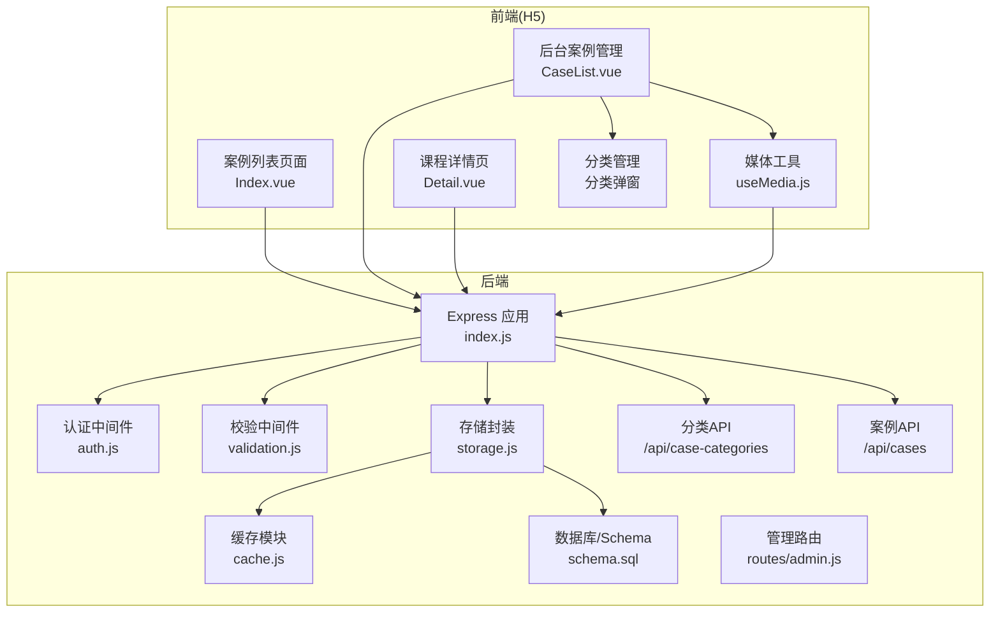
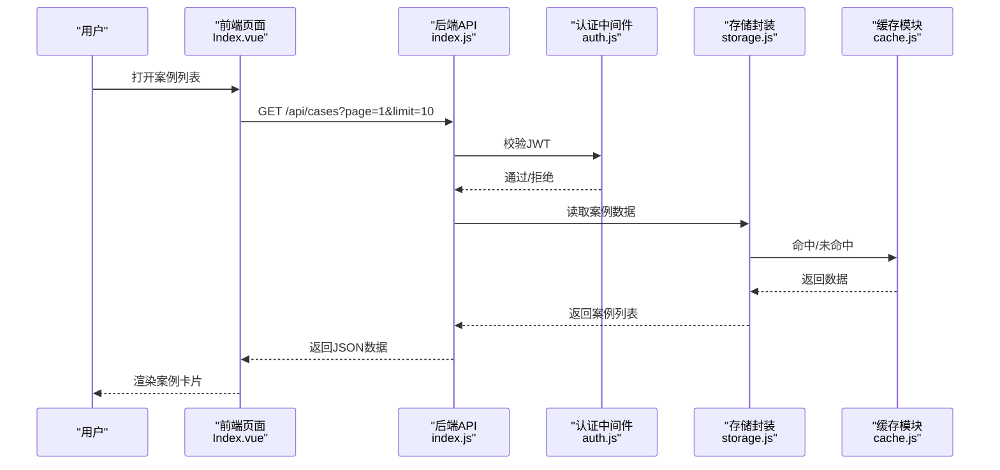
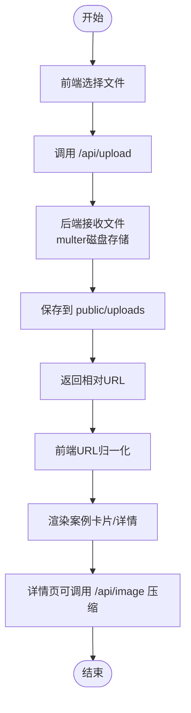
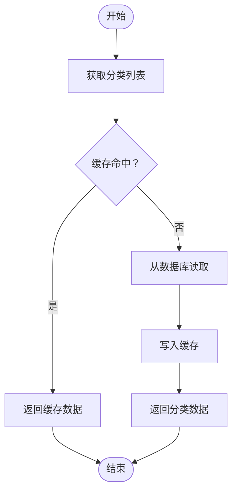
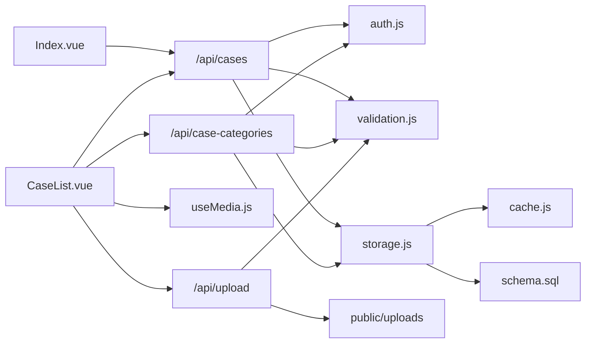

# 案例展示系统

<cite>
**本文引用的文件**
- [backend/index.js](file://backend/index.js)
- [backend/storage.js](file://backend/storage.js)
- [backend/config.js](file://backend/config.js)
- [backend/cache.js](file://backend/cache.js)
- [backend/middleware/auth.js](file://backend/middleware/auth.js)
- [backend/middleware/validation.js](file://backend/middleware/validation.js)
- [backend/db/schema.sql](file://backend/db/schema.sql)
- [backend/routes/admin.js](file://backend/routes/admin.js)
- [frontend/h5/src/views/cases/Index.vue](file://frontend/h5/src/views/cases/Index.vue)
- [frontend/h5/src/views/admin/cases/CaseList.vue](file://frontend/h5/src/views/admin/cases/CaseList.vue)
- [frontend/h5/src/views/admin/composables/useMedia.js](file://frontend/h5/src/views/admin/composables/useMedia.js)
- [frontend/h5/src/views/study/Detail.vue](file://frontend/h5/src/views/study/Detail.vue)
</cite>

## 更新摘要
**所做更改**
- 新增完整的案例分类和动态标签管理功能章节
- 更新案例数据模型以包含分类标识字段
- 新增分类 CRUD API 端点说明
- 更新后台管理界面以支持分类管理
- 新增缓存机制和存储函数说明
- 更新前端分类展示和筛选功能

## 目录
1. [引言](#引言)
2. [项目结构](#项目结构)
3. [核心组件](#核心组件)
4. [架构总览](#架构总览)
5. [详细组件分析](#详细组件分析)
6. [依赖关系分析](#依赖关系分析)
7. [性能考量](#性能考量)
8. [故障排查指南](#故障排查指南)
9. [结论](#结论)
10. [附录](#附录)

## 引言
本文件面向"低空飞行服务平台案例展示系统"，围绕案例管理功能、媒体资源处理机制、分类展示策略、点赞统计系统进行系统化说明，并解释案例数据模型、图片上传处理、视频资源管理、内容审核流程。文档同时覆盖案例列表展示、案例详情页面、后台案例管理界面的设计实现，提供案例数据结构、媒体处理流程、展示组件实现和管理后台操作指南。

**更新** 新增完整的案例分类和动态标签管理功能，包括后端存储函数、缓存机制、API端点以及前端管理界面增强。

## 项目结构
系统采用前后端分离架构：
- 后端基于 Express，提供 REST API、认证鉴权、缓存、文件上传、数据库存储等能力。
- 前端采用 Vue 3 + Vant，提供案例列表、详情、后台管理等页面。
- 存储层支持本地 JSON 文件与 PostgreSQL 两种模式，具备统一的读写封装。

**图表来源**
- [backend/index.js:1-800](file://backend/index.js#L1-L800)
- [backend/storage.js:1-197](file://backend/storage.js#L1-L197)
- [backend/cache.js:1-119](file://backend/cache.js#L1-L119)
- [backend/db/schema.sql:1-10](file://backend/db/schema.sql#L1-L10)
- [backend/middleware/auth.js:1-168](file://backend/middleware/auth.js#L1-L168)
- [backend/middleware/validation.js:1-192](file://backend/middleware/validation.js#L1-L192)
- [backend/routes/admin.js:1-514](file://backend/routes/admin.js#L1-L514)
- [frontend/h5/src/views/cases/Index.vue:1-640](file://frontend/h5/src/views/cases/Index.vue#L1-L640)
- [frontend/h5/src/views/admin/cases/CaseList.vue:1-235](file://frontend/h5/src/views/admin/cases/CaseList.vue#L1-L235)
- [frontend/h5/src/views/admin/composables/useMedia.js:1-65](file://frontend/h5/src/views/admin/composables/useMedia.js#L1-L65)
- [frontend/h5/src/views/study/Detail.vue:1-800](file://frontend/h5/src/views/study/Detail.vue#L1-L800)

**章节来源**
- [backend/index.js:1-800](file://backend/index.js#L1-L800)
- [backend/storage.js:1-197](file://backend/storage.js#L1-L197)
- [backend/config.js:1-123](file://backend/config.js#L1-L123)
- [backend/cache.js:1-119](file://backend/cache.js#L1-L119)
- [backend/db/schema.sql:1-10](file://backend/db/schema.sql#L1-L10)
- [backend/middleware/auth.js:1-168](file://backend/middleware/auth.js#L1-L168)
- [backend/middleware/validation.js:1-192](file://backend/middleware/validation.js#L1-L192)
- [backend/routes/admin.js:1-514](file://backend/routes/admin.js#L1-L514)
- [frontend/h5/src/views/cases/Index.vue:1-640](file://frontend/h5/src/views/cases/Index.vue#L1-L640)
- [frontend/h5/src/views/admin/cases/CaseList.vue:1-235](file://frontend/h5/src/views/admin/cases/CaseList.vue#L1-L235)
- [frontend/h5/src/views/admin/composables/useMedia.js:1-65](file://frontend/h5/src/views/admin/composables/useMedia.js#L1-L65)
- [frontend/h5/src/views/study/Detail.vue:1-800](file://frontend/h5/src/views/study/Detail.vue#L1-L800)

## 核心组件
- 案例数据模型：包含分类标识、标题、描述、封面类型与地址、媒体资源数组、完整描述、项目亮点、服务类型、地点、时间、浏览量等字段。
- 媒体资源处理：支持图片与视频两类资源，提供上传、URL 归一化、后端缩略图压缩接口。
- 分类展示策略：前端按分类 Tabs 过滤展示，支持"全部案例"与具体分类。
- 点赞统计系统：当前代码未发现点赞字段与接口，建议后续扩展。
- 内容审核流程：后台提供评价审核接口，案例内容审核可参考该模式扩展。
- **新增** 案例分类管理：支持动态创建、编辑、删除分类，自动分配ID，缓存机制优化性能。

**章节来源**
- [backend/index.js:367-423](file://backend/index.js#L367-L423)
- [backend/storage.js:223-246](file://backend/storage.js#L223-L246)
- [frontend/h5/src/views/cases/Index.vue:249-255](file://frontend/h5/src/views/cases/Index.vue#L249-L255)
- [frontend/h5/src/views/admin/cases/CaseList.vue:134-149](file://frontend/h5/src/views/admin/cases/CaseList.vue#L134-L149)

## 架构总览
系统采用"前端页面 + 后端 API + 存储层"的三层架构。前端通过 Axios 调用后端接口，后端通过中间件进行认证与校验，存储层负责数据持久化与缓存。

**图表来源**
- [backend/index.js:289-423](file://backend/index.js#L289-L423)
- [backend/middleware/auth.js:11-45](file://backend/middleware/auth.js#L11-L45)
- [backend/storage.js:144-152](file://backend/storage.js#L144-L152)
- [backend/cache.js:57-67](file://backend/cache.js#L57-L67)
- [frontend/h5/src/views/cases/Index.vue:269-318](file://frontend/h5/src/views/cases/Index.vue#L269-L318)

## 详细组件分析

### 案例数据模型
- 字段要点：categoryId、title、description、service、location、date、views、coverType、cover、media（数组，含 type/url/poster）、fullDescription、highlights（数组）。
- 示例数据：后端初始化包含两条默认案例，涵盖图片与视频封面及多媒体资源。

**章节来源**
- [backend/index.js:367-423](file://backend/index.js#L367-L423)

### 媒体资源处理机制
- 上传流程：前端通过 useMedia.js 的 uploadFile 调用 /api/upload，后端使用 multer 接收文件并保存到 public/uploads，返回相对 URL。
- URL 归一化：前端在渲染前对媒体 URL 进行归一化，兼容绝对/相对/容器内网地址，保证同域访问。
- 图片压缩：后端提供 /api/image 接口，基于 sharp 对图片进行缩放与质量压缩，带缓存头。

**图表来源**
- [frontend/h5/src/views/admin/composables/useMedia.js:40-64](file://frontend/h5/src/views/admin/composables/useMedia.js#L40-L64)
- [backend/index.js:278-285](file://backend/index.js#L278-L285)
- [backend/index.js:86-114](file://backend/index.js#L86-L114)
- [frontend/h5/src/views/cases/Index.vue:197-247](file://frontend/h5/src/views/cases/Index.vue#L197-L247)

**章节来源**
- [frontend/h5/src/views/admin/composables/useMedia.js:1-65](file://frontend/h5/src/views/admin/composables/useMedia.js#L1-L65)
- [backend/index.js:261-285](file://backend/index.js#L261-L285)
- [backend/index.js:86-114](file://backend/index.js#L86-L114)
- [frontend/h5/src/views/cases/Index.vue:193-247](file://frontend/h5/src/views/cases/Index.vue#L193-L247)

### 分类展示策略
- 前端维护分类列表（全部案例、无人机物流、无人机吊运、无人机表演），通过 activeCategory 控制过滤条件。
- 列表页支持下拉刷新与上拉加载，分页参数 page/limit 传递给后端。
- 后端根据 categoryId 参数过滤案例集合。

**章节来源**
- [frontend/h5/src/views/cases/Index.vue:249-255](file://frontend/h5/src/views/cases/Index.vue#L249-L255)
- [frontend/h5/src/views/cases/Index.vue:269-318](file://frontend/h5/src/views/cases/Index.vue#L269-L318)
- [backend/index.js:289-423](file://backend/index.js#L289-L423)

### 案例分类管理功能
- **新增** 分类数据模型：包含 id、name、service 字段，默认包含无人机物流、无人机吊运、无人机表演三个基础分类。
- **新增** 缓存机制：使用 CASE_CATEGORIES 缓存键，10分钟TTL，提升分类查询性能。
- **新增** CRUD API：
  - GET /api/case-categories：获取分类列表
  - POST /api/case-categories/create：创建新分类
  - POST /api/case-categories/update：更新分类
  - POST /api/case-categories/delete：删除分类（需确保无案例关联）

**图表来源**
- [backend/storage.js:223-246](file://backend/storage.js#L223-L246)
- [backend/cache.js:111](file://backend/cache.js#L111)
- [backend/index.js:1547-1594](file://backend/index.js#L1547-L1594)

**章节来源**
- [backend/storage.js:223-246](file://backend/storage.js#L223-L246)
- [backend/cache.js:111](file://backend/cache.js#L111)
- [backend/index.js:1547-1594](file://backend/index.js#L1547-L1594)

### 后台分类管理界面
- **新增** 分类管理弹窗：支持查看、新增、编辑、删除分类。
- **新增** 自动ID分配：基于现有最大ID+1，确保唯一性。
- **新增** 默认服务同步：编辑案例时自动同步分类的默认服务类型。
- **新增** 删除保护：检测是否有案例使用该分类，防止误删。

**章节来源**
- [frontend/h5/src/views/admin/cases/CaseList.vue:130-289](file://frontend/h5/src/views/admin/cases/CaseList.vue#L130-L289)
- [frontend/h5/src/views/admin/cases/CaseList.vue:203-212](file://frontend/h5/src/views/admin/cases/CaseList.vue#L203-L212)

### 点赞统计系统
- 当前代码未发现点赞字段或相关接口。
- 建议在案例模型中增加 likes 字段与 /api/cases/:id/like 接口，后端记录用户点赞状态并更新计数，前端展示与交互。

**章节来源**
- [backend/index.js:367-423](file://backend/index.js#L367-L423)

### 内容审核流程
- 后端提供 /api/reviews 接口族，支持获取、审核（通过/拒绝）、删除评价，体现"内容审核"的通用模式。
- 案例内容审核可复用该模式：在案例模型中增加 status 字段，后台提供审核接口与状态变更日志。

**章节来源**
- [backend/routes/admin.js:408-481](file://backend/routes/admin.js#L408-L481)

### 案例列表展示
- 页面结构：导航栏、分类 Tabs、下拉刷新、无限滚动列表、空状态。
- 渲染逻辑：根据 coverType 渲染图片或视频封面，显示服务类型标签、时间与浏览量。
- 详情弹窗：支持图片轮播与视频播放控制。

**章节来源**
- [frontend/h5/src/views/cases/Index.vue:1-186](file://frontend/h5/src/views/cases/Index.vue#L1-L186)
- [frontend/h5/src/views/cases/Index.vue:320-369](file://frontend/h5/src/views/cases/Index.vue#L320-L369)

### 案例详情页面
- 展示媒体轮播（图片/视频），支持自动轮播与手动切换。
- 详情信息：服务类型、地点、时间等字段展示。
- 亮点列表：支持多条项目亮点展示。

**章节来源**
- [frontend/h5/src/views/cases/Index.vue:104-184](file://frontend/h5/src/views/cases/Index.vue#L104-L184)

### 后台案例管理界面
- 列表页：支持新增、编辑、删除案例，展示缩略图、分类、地点、时间、浏览量与封面类型。
- 表单编辑：支持分类选择、标题/简介/地点/时间、封面类型切换、封面上传、媒体资源增删改、项目亮点标签、详细描述。
- 上传与归一化：使用 useMedia.js 完成上传与 URL 归一化。

**章节来源**
- [frontend/h5/src/views/admin/cases/CaseList.vue:1-235](file://frontend/h5/src/views/admin/cases/CaseList.vue#L1-L235)
- [frontend/h5/src/views/admin/composables/useMedia.js:1-65](file://frontend/h5/src/views/admin/composables/useMedia.js#L1-L65)

### 存储与缓存
- 存储封装：统一读写 JSON 文件或 PostgreSQL 的 json_store 表，支持双写兼容与去重序列化。
- 缓存策略：针对用户、案例、申请、配置、评价、**新增**分类分别设置不同 TTL，降低 IO 压力。

**章节来源**
- [backend/storage.js:1-197](file://backend/storage.js#L1-L197)
- [backend/cache.js:1-119](file://backend/cache.js#L1-L119)
- [backend/db/schema.sql:1-10](file://backend/db/schema.sql#L1-L10)

### 认证与权限
- JWT 认证：提供登录、注册、刷新、登出、微信登录等接口，支持可选认证与角色限制。
- 管理员角色：admin/dsl_admin/study_admin，不同角色可见与操作范围不同。

**章节来源**
- [backend/index.js:434-762](file://backend/index.js#L434-L762)
- [backend/middleware/auth.js:1-168](file://backend/middleware/auth.js#L1-L168)
- [backend/routes/admin.js:29-61](file://backend/routes/admin.js#L29-L61)

## 依赖关系分析
- 前端依赖：Axios、Vant UI、Vue Router、Pinia（部分页面）。
- 后端依赖：Express、Multer、Sharp、JWT、Bcrypt、XLSX、Axios、PostgreSQL（可选）。
- 关键耦合点：前端通过 /api/cases 与 /api/upload 与后端交互；后端通过 storage.js 与 cache.js 解耦数据访问。

**图表来源**
- [frontend/h5/src/views/cases/Index.vue:269-318](file://frontend/h5/src/views/cases/Index.vue#L269-L318)
- [frontend/h5/src/views/admin/cases/CaseList.vue:134-205](file://frontend/h5/src/views/admin/cases/CaseList.vue#L134-L205)
- [frontend/h5/src/views/admin/composables/useMedia.js:40-64](file://frontend/h5/src/views/admin/composables/useMedia.js#L40-L64)
- [backend/index.js:278-285](file://backend/index.js#L278-L285)
- [backend/middleware/auth.js:11-45](file://backend/middleware/auth.js#L11-L45)
- [backend/middleware/validation.js:154-180](file://backend/middleware/validation.js#L154-L180)
- [backend/storage.js:102-132](file://backend/storage.js#L102-L132)
- [backend/cache.js:57-67](file://backend/cache.js#L57-L67)
- [backend/db/schema.sql:1-10](file://backend/db/schema.sql#L1-L10)

**章节来源**
- [backend/index.js:261-285](file://backend/index.js#L261-L285)
- [backend/storage.js:102-132](file://backend/storage.js#L102-L132)
- [backend/cache.js:57-67](file://backend/cache.js#L57-L67)
- [backend/db/schema.sql:1-10](file://backend/db/schema.sql#L1-L10)
- [frontend/h5/src/views/admin/composables/useMedia.js:40-64](file://frontend/h5/src/views/admin/composables/useMedia.js#L40-L64)

## 性能考量
- 缓存策略：案例数据默认缓存 5 分钟，用户/申请/评价 1 分钟，**新增**分类数据缓存 10 分钟，显著降低读取延迟。
- 图片压缩：后端 /api/image 使用 sharp 进行缩放与质量压缩，设置缓存头，减少带宽与渲染压力。
- 文件上传：限制文件类型与大小，避免大体积资源占用存储与网络。
- 分页与懒加载：前端列表使用分页与虚拟滚动，减少一次性渲染成本。

**章节来源**
- [backend/cache.js:134-152](file://backend/cache.js#L134-L152)
- [backend/index.js:86-114](file://backend/index.js#L86-L114)
- [backend/middleware/validation.js:154-180](file://backend/middleware/validation.js#L154-L180)
- [frontend/h5/src/views/cases/Index.vue:269-318](file://frontend/h5/src/views/cases/Index.vue#L269-L318)

## 故障排查指南
- 上传失败：检查 /api/upload 是否返回 success，确认文件类型与大小限制，查看后端日志。
- 媒体加载失败：确认 URL 归一化逻辑，避免混合内容与相对路径问题。
- JWT 过期：前端应捕获 401 并引导刷新令牌或重新登录。
- 数据不一致：缓存清理后重试，或等待 TTL 自然过期。
- **新增** 分类管理错误：检查分类是否被案例引用，确认缓存是否正确清除。

**章节来源**
- [frontend/h5/src/views/admin/composables/useMedia.js:40-64](file://frontend/h5/src/views/admin/composables/useMedia.js#L40-L64)
- [backend/middleware/auth.js:31-44](file://backend/middleware/auth.js#L31-L44)
- [backend/cache.js:72-79](file://backend/cache.js#L72-L79)

## 结论
本系统以简洁的前后端分离架构实现了案例展示与管理能力，具备良好的扩展性与可维护性。媒体处理与缓存策略有效提升了用户体验与性能。**新增的案例分类管理功能**进一步增强了系统的灵活性，支持动态分类管理与缓存优化。建议后续补充点赞统计、案例内容审核与评论系统，进一步完善生态闭环。

## 附录
- 环境变量与配置：JWT 密钥、端口、CORS、上传限制、数据库连接等。
- 数据库 Schema：json_store 表用于存储 JSON 数据，支持 PostgreSQL 与文件两种模式。

**章节来源**
- [backend/config.js:1-123](file://backend/config.js#L1-L123)
- [backend/db/schema.sql:1-10](file://backend/db/schema.sql#L1-L10)