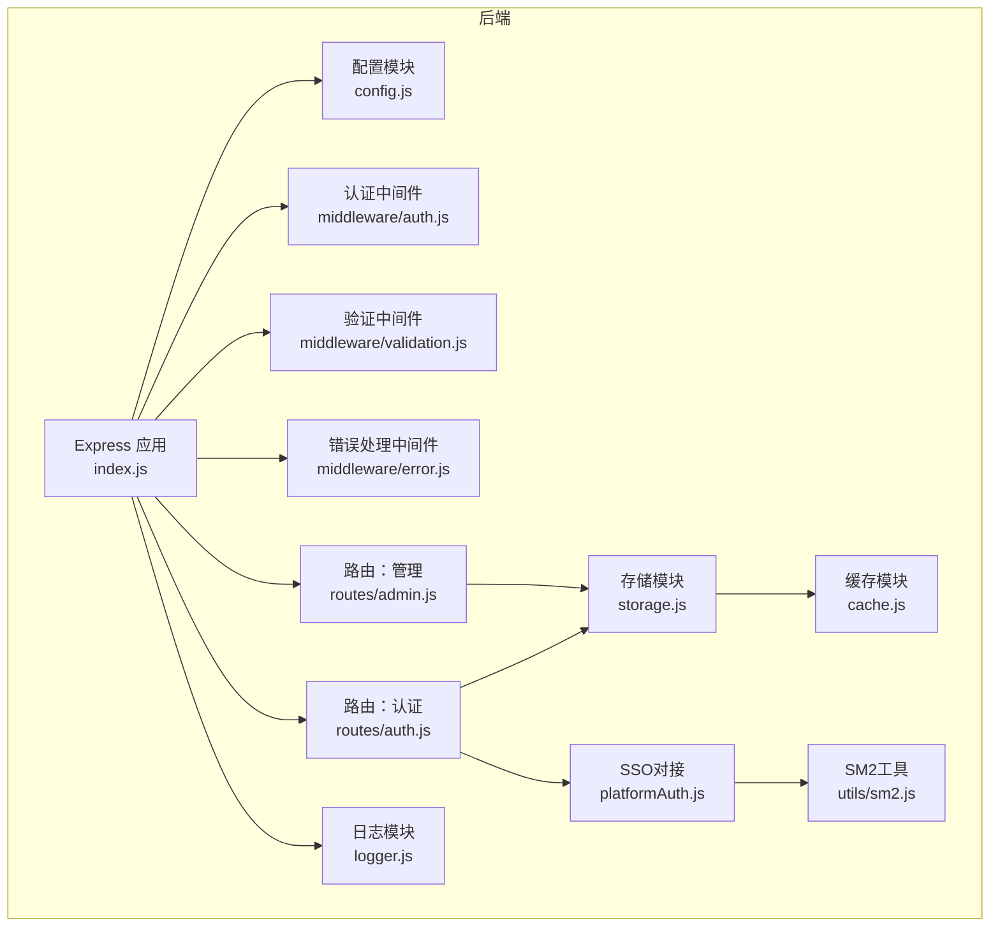
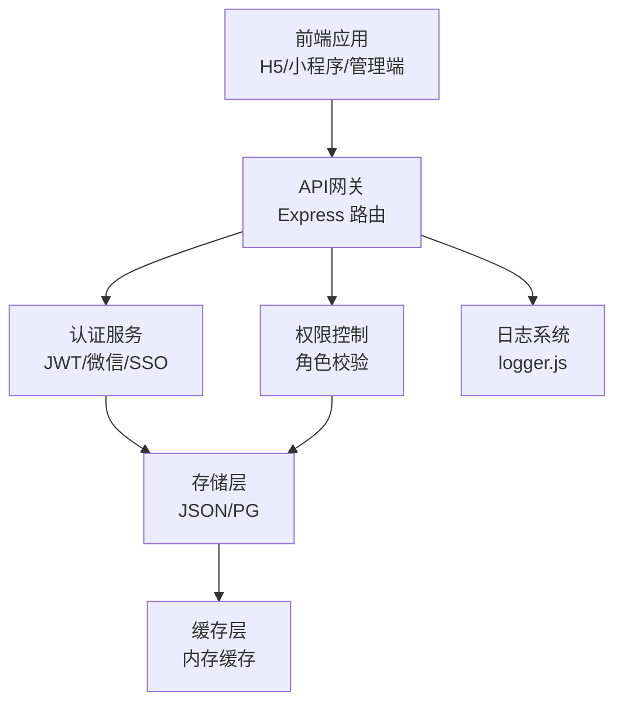
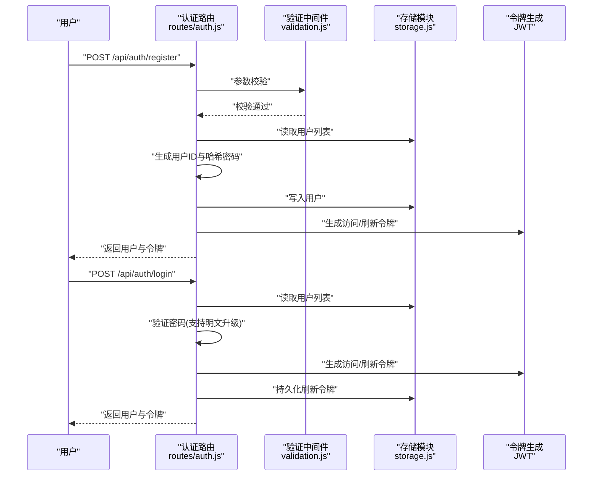
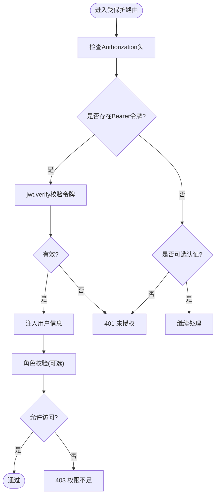
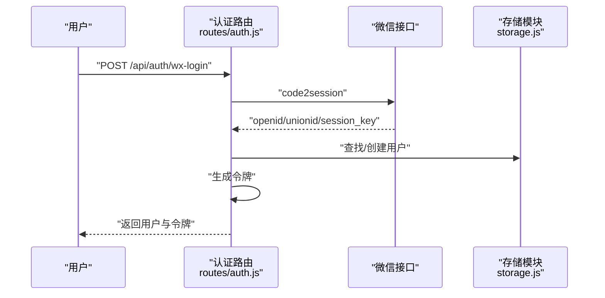
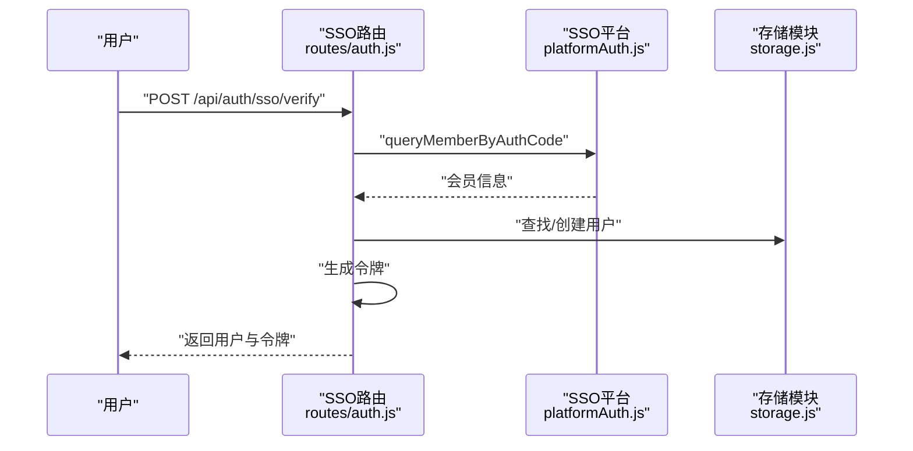
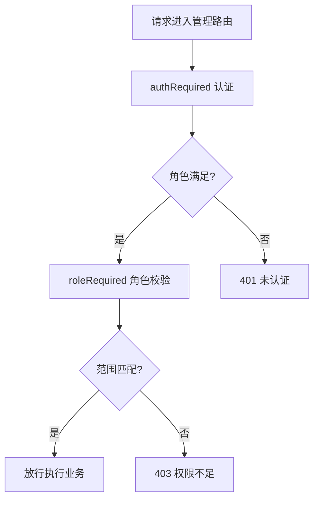
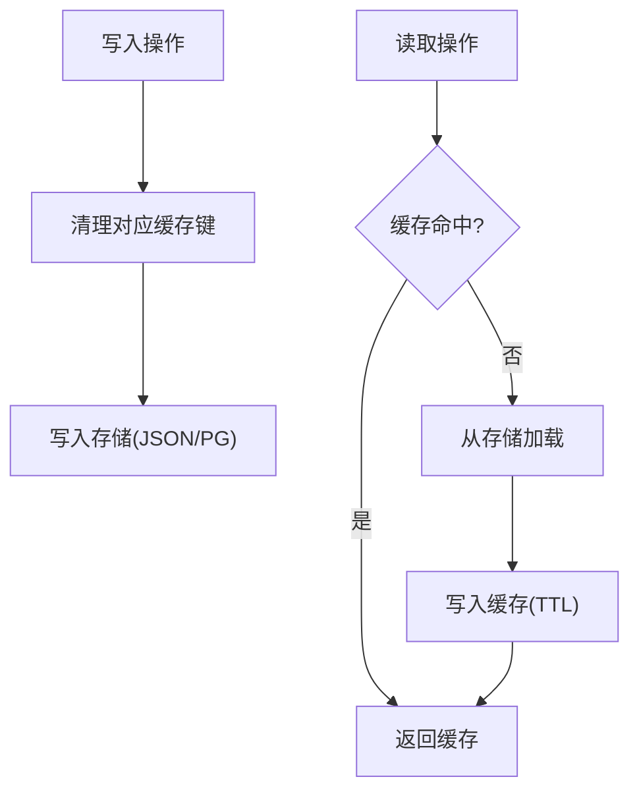
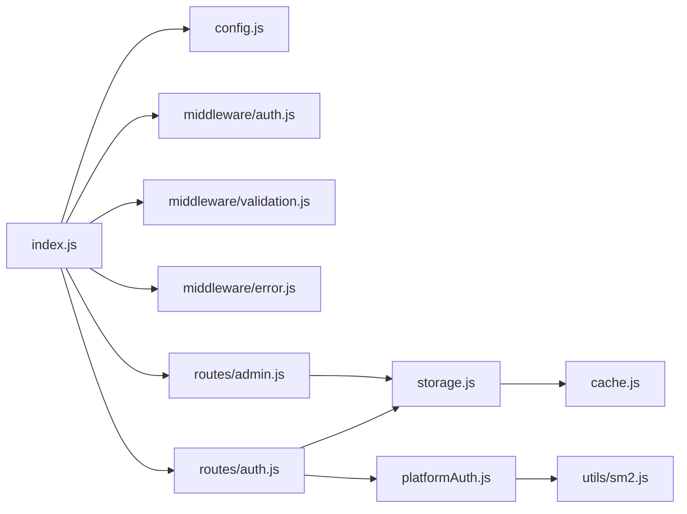

# 用户管理系统

<cite>
**本文引用的文件**
- [backend/index.js](file://backend/index.js)
- [backend/route/auth.js](file://backend/routes/auth.js)
- [backend/middleware/auth.js](file://backend/middleware/auth.js)
- [backend/middleware/validation.js](file://backend/middleware/validation.js)
- [backend/middleware/error.js](file://backend/middleware/error.js)
- [backend/config.js](file://backend/config.js)
- [backend/storage.js](file://backend/storage.js)
- [backend/cache.js](file://backend/cache.js)
- [backend/logger.js](file://backend/logger.js)
- [backend/platformAuth.js](file://backend/platformAuth.js)
- [backend/utils/sm2.js](file://backend/utils/sm2.js)
- [backend/db/schema.sql](file://backend/db/schema.sql)
- [backend/OPTIMIZATION_SUMMARY.md](file://backend/OPTIMIZATION_SUMMARY.md)
- [backend/QUICK_REFERENCE.md](file://backend/QUICK_REFERENCE.md)
</cite>

## 目录
1. [简介](#简介)
2. [项目结构](#项目结构)
3. [核心组件](#核心组件)
4. [架构总览](#架构总览)
5. [详细组件分析](#详细组件分析)
6. [依赖关系分析](#依赖关系分析)
7. [性能考虑](#性能考虑)
8. [故障排查指南](#故障排查指南)
9. [结论](#结论)
10. [附录](#附录)

## 简介
本文件面向低空飞行服务平台的用户管理系统，系统采用 Node.js + Express 构建，提供用户注册与登录、JWT 认证、微信登录、SSO 单点登录、权限控制、用户状态同步与缓存等能力。文档从架构、组件、流程、数据模型、中间件、安全与性能等方面进行全面阐述，并给出流程图与使用指南。

## 项目结构
后端采用模块化组织，关键目录与文件如下：
- config.js：集中配置管理（JWT、微信、SSO、数据库、上传、服务器等）
- middleware/*：认证、验证、错误处理中间件
- routes/*：认证与管理路由
- storage.js：统一读写数据（支持 JSON 文件与 PostgreSQL）
- cache.js：内存缓存模块
- logger.js：结构化日志
- platformAuth.js：SSO 平台对接（含 SM2/SM4 加解密）
- utils/sm2.js：SM2 工具（兼容 Java SDK）

图表来源
- [backend/index.js](file://backend/index.js)
- [backend/config.js](file://backend/config.js)
- [backend/middleware/auth.js](file://backend/middleware/auth.js)
- [backend/middleware/validation.js](file://backend/middleware/validation.js)
- [backend/middleware/error.js](file://backend/middleware/error.js)
- [backend/routes/auth.js](file://backend/routes/auth.js)
- [backend/routes/admin.js](file://backend/routes/admin.js)
- [backend/storage.js](file://backend/storage.js)
- [backend/cache.js](file://backend/cache.js)
- [backend/logger.js](file://backend/logger.js)
- [backend/platformAuth.js](file://backend/platformAuth.js)
- [backend/utils/sm2.js](file://backend/utils/sm2.js)

章节来源
- [backend/index.js](file://backend/index.js)
- [backend/config.js](file://backend/config.js)
- [backend/OPTIMIZATION_SUMMARY.md](file://backend/OPTIMIZATION_SUMMARY.md)
- [backend/QUICK_REFERENCE.md](file://backend/QUICK_REFERENCE.md)

## 核心组件
- JWT 认证与令牌管理：生成访问令牌与刷新令牌，支持刷新与登出
- 用户注册与登录：支持手机号/用户名登录与密码校验，支持明文密码自动升级为哈希
- 微信登录：小程序 code2session 与 H5 OAuth 授权登录
- SSO 单点登录：基于畅行温州平台的授权码换取会员信息，自动创建或关联用户
- 权限控制：基于角色的访问控制（RBAC），支持管理员、DSL 管理员、研学管理员等
- 数据存储与缓存：统一存储接口，支持 JSON 文件与 PostgreSQL；内置缓存减少 I/O
- 输入验证与安全：请求体消毒、参数校验、速率限制、错误处理与日志

章节来源
- [backend/index.js](file://backend/index.js)
- [backend/routes/auth.js](file://backend/routes/auth.js)
- [backend/middleware/auth.js](file://backend/middleware/auth.js)
- [backend/middleware/validation.js](file://backend/middleware/validation.js)
- [backend/storage.js](file://backend/storage.js)
- [backend/cache.js](file://backend/cache.js)
- [backend/platformAuth.js](file://backend/platformAuth.js)

## 架构总览
系统整体采用分层架构：
- 表现层：前端 H5/小程序与管理端
- API 层：Express 路由与中间件
- 业务层：认证、权限、SSO、微信登录等业务逻辑
- 数据层：统一存储接口，支持本地 JSON 与 PostgreSQL

图表来源
- [backend/index.js](file://backend/index.js)
- [backend/routes/auth.js](file://backend/routes/auth.js)
- [backend/routes/admin.js](file://backend/routes/admin.js)
- [backend/storage.js](file://backend/storage.js)
- [backend/cache.js](file://backend/cache.js)
- [backend/logger.js](file://backend/logger.js)

## 详细组件分析

### 用户注册与登录流程
- 注册：校验手机号格式与密码强度，生成用户 ID，使用 bcrypt 对密码进行哈希存储，返回访问令牌与刷新令牌
- 登录：根据手机号或用户名查找用户，验证密码（支持明文自动升级为哈希），生成并下发令牌，同时持久化刷新令牌
- 登出：清空用户刷新令牌
- 刷新：使用刷新令牌签发新的访问令牌

图表来源
- [backend/routes/auth.js](file://backend/routes/auth.js)
- [backend/middleware/validation.js](file://backend/middleware/validation.js)
- [backend/storage.js](file://backend/storage.js)

章节来源
- [backend/routes/auth.js](file://backend/routes/auth.js)
- [backend/middleware/validation.js](file://backend/middleware/validation.js)
- [backend/storage.js](file://backend/storage.js)

### JWT 认证机制与中间件
- 认证中间件：从 Authorization 头解析 Bearer 令牌，验证 JWT，注入用户信息到请求对象
- 角色中间件：基于用户角色进行权限判定
- 可选认证：当存在令牌时验证，不存在时放行
- 令牌刷新：校验刷新令牌有效性与过期时间，签发新的访问令牌

图表来源
- [backend/middleware/auth.js](file://backend/middleware/auth.js)

章节来源
- [backend/middleware/auth.js](file://backend/middleware/auth.js)

### 微信登录集成
- 小程序登录：使用 code 调用微信 code2session 接口获取 openid/unionid/session_key，查找或创建用户，发放令牌
- H5 公众号授权：提供授权 URL，回调获取 access_token/openid，拉取用户信息，创建或关联用户并发放令牌
- 手机号绑定：通过微信手机号接口解密获取手机号，绑定到当前用户

图表来源
- [backend/routes/auth.js](file://backend/routes/auth.js)

章节来源
- [backend/routes/auth.js](file://backend/routes/auth.js)

### SSO 单点登录实现
- 授权码换取会员信息：通过平台授权码调用 SSO 接口，获取会员信息
- 用户关联与创建：优先按平台会员号匹配，其次按手机号匹配，不存在则创建新用户
- 令牌发放：生成并持久化刷新令牌

图表来源
- [backend/routes/auth.js](file://backend/routes/auth.js)
- [backend/platformAuth.js](file://backend/platformAuth.js)

章节来源
- [backend/routes/auth.js](file://backend/routes/auth.js)
- [backend/platformAuth.js](file://backend/platformAuth.js)

### 权限控制体系
- 角色定义：user、admin、dsl_admin、study_admin
- 权限隔离：不同管理员仅可见其职责范围内的数据
- 路由级保护：使用角色中间件与可选认证中间件组合

图表来源
- [backend/middleware/auth.js](file://backend/middleware/auth.js)
- [backend/routes/admin.js](file://backend/routes/admin.js)

章节来源
- [backend/routes/admin.js](file://backend/routes/admin.js)
- [backend/middleware/auth.js](file://backend/middleware/auth.js)

### 用户状态同步策略
- 缓存策略：用户、申请、案例、服务配置分别设置不同 TTL，写入时主动清理缓存键
- 存储抽象：统一 read/write 接口，支持 JSON 文件与 PostgreSQL（通过 JSON_STORE 表）
- 状态一致性：写操作后立即失效缓存，读操作走缓存，保证最终一致性

图表来源
- [backend/storage.js](file://backend/storage.js)
- [backend/cache.js](file://backend/cache.js)
- [backend/db/schema.sql](file://backend/db/schema.sql)

章节来源
- [backend/storage.js](file://backend/storage.js)
- [backend/cache.js](file://backend/cache.js)
- [backend/db/schema.sql](file://backend/db/schema.sql)

### 数据模型与字段说明
- 用户表（users）：包含 id、phone、username、password/passwordHash、name、role、avatar、wxOpenid、wxUnionid、wxSessionKey、platformMemberNo、platformSource、createTime、refreshToken、refreshTokenExpiresAt 等
- 申请表（applications）：包含服务相关信息与状态
- 案例表（cases）：展示案例数据
- 服务配置（services_config）：按服务维度的配置
- 评价表（reviews）：用户评价与审核状态

章节来源
- [backend/storage.js](file://backend/storage.js)
- [backend/db/schema.sql](file://backend/db/schema.sql)

### 认证中间件实现要点
- authRequired：强制认证，校验 JWT，注入用户信息
- roleRequired：基于角色白名单校验
- optionalAuth：可选认证，不影响请求继续
- rateLimit：基于 IP 的滑动窗口限流

章节来源
- [backend/middleware/auth.js](file://backend/middleware/auth.js)
- [backend/middleware/validation.js](file://backend/middleware/validation.js)

### 密码加密存储
- 注册与登录时使用 bcrypt 对密码进行哈希存储
- 支持明文密码自动升级为哈希，确保历史兼容
- 登录失败不暴露具体原因，统一返回错误信息

章节来源
- [backend/routes/auth.js](file://backend/routes/auth.js)
- [backend/index.js](file://backend/index.js)

### 会话管理
- 会话基于 JWT：访问令牌短期有效，刷新令牌长期有效
- 刷新流程：使用刷新令牌签发新的访问令牌
- 登出流程：清空用户刷新令牌，使旧令牌失效

章节来源
- [backend/routes/auth.js](file://backend/routes/auth.js)
- [backend/index.js](file://backend/index.js)

## 依赖关系分析
- Express 应用依赖配置模块、中间件、路由与存储模块
- 认证路由依赖验证中间件、存储模块与 JWT
- 管理路由依赖认证中间件、存储模块与角色中间件
- SSO 依赖平台对接模块与 SM2/SM4 工具
- 存储模块依赖缓存模块与数据库适配

图表来源
- [backend/index.js](file://backend/index.js)
- [backend/config.js](file://backend/config.js)
- [backend/middleware/auth.js](file://backend/middleware/auth.js)
- [backend/middleware/validation.js](file://backend/middleware/validation.js)
- [backend/middleware/error.js](file://backend/middleware/error.js)
- [backend/routes/auth.js](file://backend/routes/auth.js)
- [backend/routes/admin.js](file://backend/routes/admin.js)
- [backend/storage.js](file://backend/storage.js)
- [backend/cache.js](file://backend/cache.js)
- [backend/platformAuth.js](file://backend/platformAuth.js)
- [backend/utils/sm2.js](file://backend/utils/sm2.js)

章节来源
- [backend/index.js](file://backend/index.js)
- [backend/routes/auth.js](file://backend/routes/auth.js)
- [backend/routes/admin.js](file://backend/routes/admin.js)
- [backend/storage.js](file://backend/storage.js)
- [backend/platformAuth.js](file://backend/platformAuth.js)

## 性能考虑
- 缓存策略：用户、申请、案例、服务配置分别设置不同 TTL，写入时主动失效缓存
- I/O 优化：统一存储接口，减少重复读取
- 速率限制：针对登录/注册接口进行限流，防止暴力破解
- 日志结构化：便于监控与性能分析

章节来源
- [backend/cache.js](file://backend/cache.js)
- [backend/storage.js](file://backend/storage.js)
- [backend/middleware/auth.js](file://backend/middleware/auth.js)
- [backend/logger.js](file://backend/logger.js)

## 故障排查指南
- 登录失败：检查 JWT_SECRET、微信配置、手机号格式与密码强度
- SSO 失败：检查平台对接参数、SM2/SM4 密钥与网络连通性
- 权限不足：确认用户角色与路由权限配置
- 缓存不一致：执行写操作后缓存会自动失效；必要时手动清理缓存
- 日志查看：查看 logs 目录下按日期分割的日志文件

章节来源
- [backend/middleware/error.js](file://backend/middleware/error.js)
- [backend/logger.js](file://backend/logger.js)
- [backend/OPTIMIZATION_SUMMARY.md](file://backend/OPTIMIZATION_SUMMARY.md)
- [backend/QUICK_REFERENCE.md](file://backend/QUICK_REFERENCE.md)

## 结论
本用户管理系统通过模块化设计、完善的中间件体系与安全机制，实现了从认证、授权到数据存储与缓存的完整闭环。系统支持多种登录方式与权限隔离，具备良好的扩展性与可维护性。建议在生产环境中启用 PostgreSQL、HTTPS、严格的 CORS 策略，并持续完善监控与测试体系。

## 附录
- 配置项说明：JWT 密钥、微信 AppID/Secret、SSO 参数、数据库连接、上传配置、服务器基础信息等
- 部署建议：生成强密钥、配置环境变量、准备日志目录、选择合适的存储方案

章节来源
- [backend/config.js](file://backend/config.js)
- [backend/OPTIMIZATION_SUMMARY.md](file://backend/OPTIMIZATION_SUMMARY.md)
- [backend/QUICK_REFERENCE.md](file://backend/QUICK_REFERENCE.md)