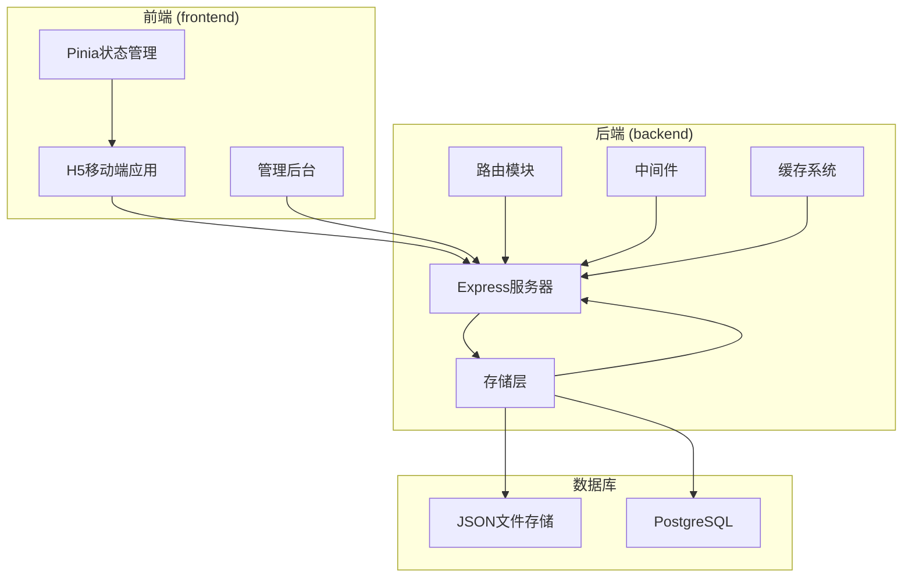
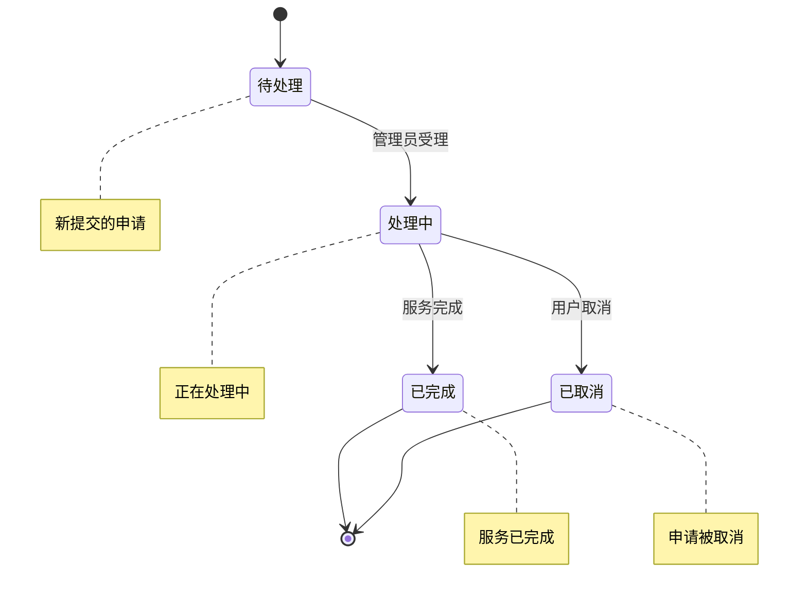
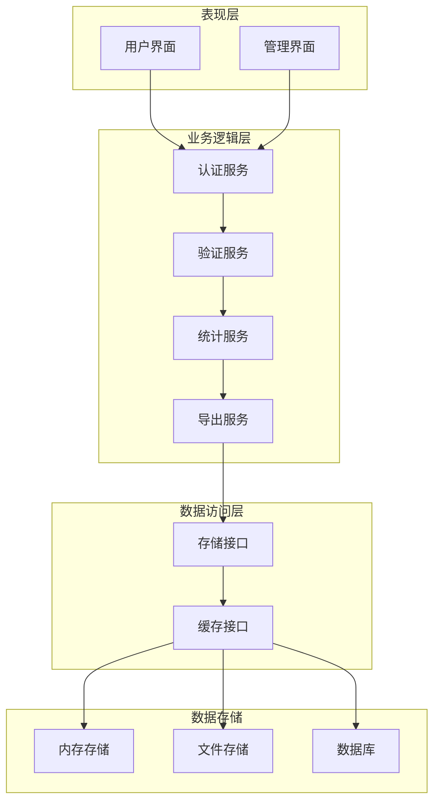
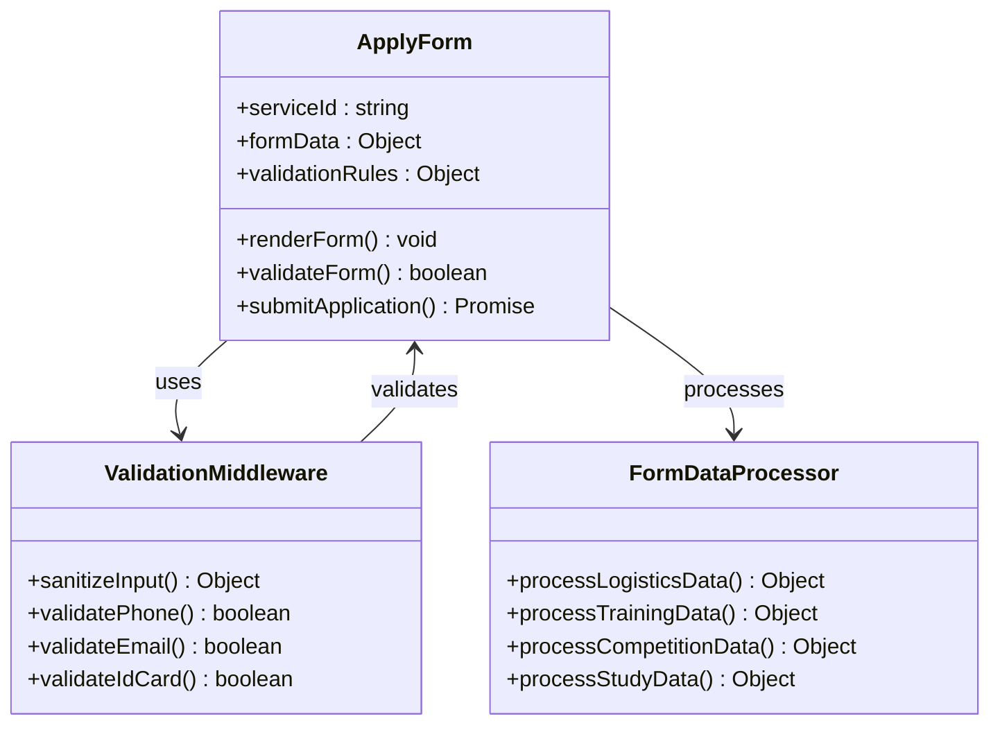
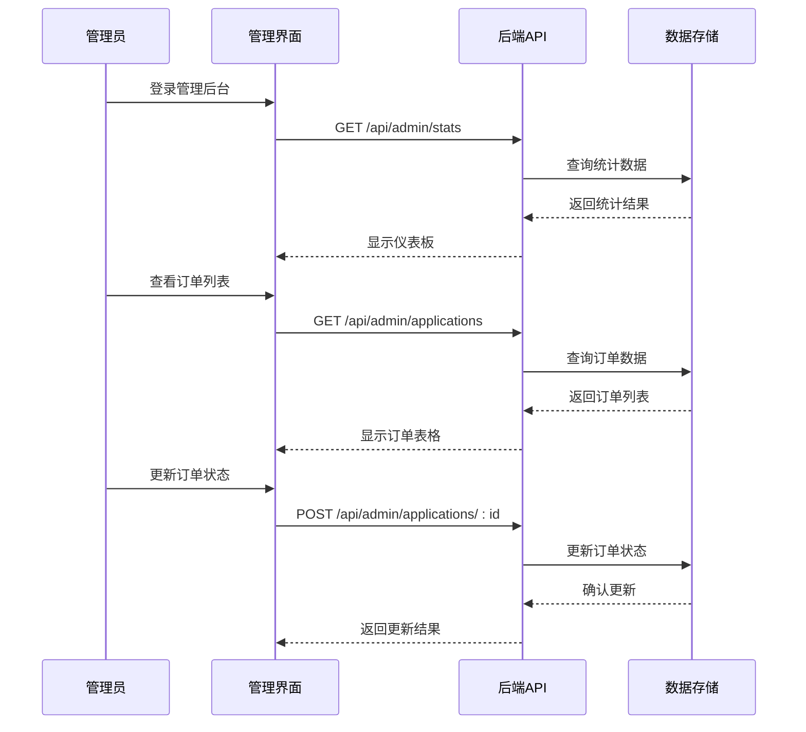
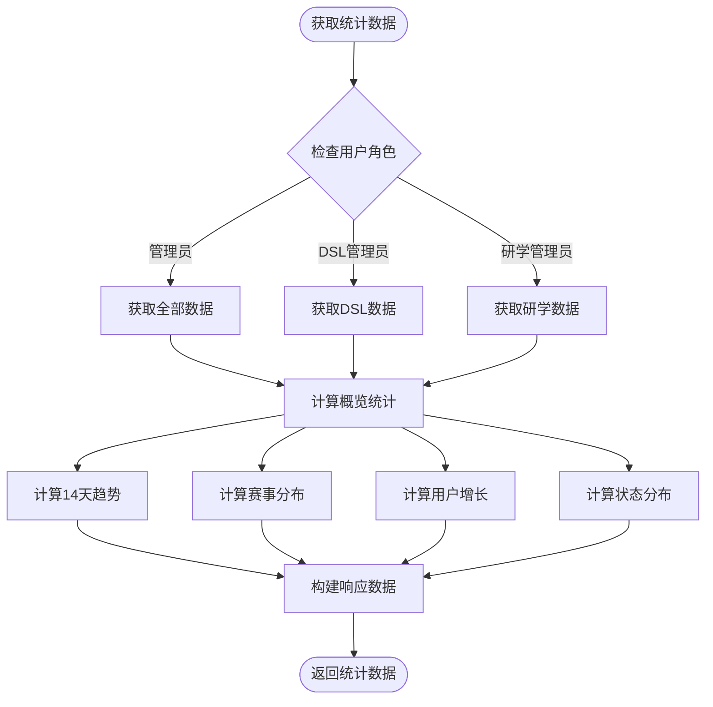
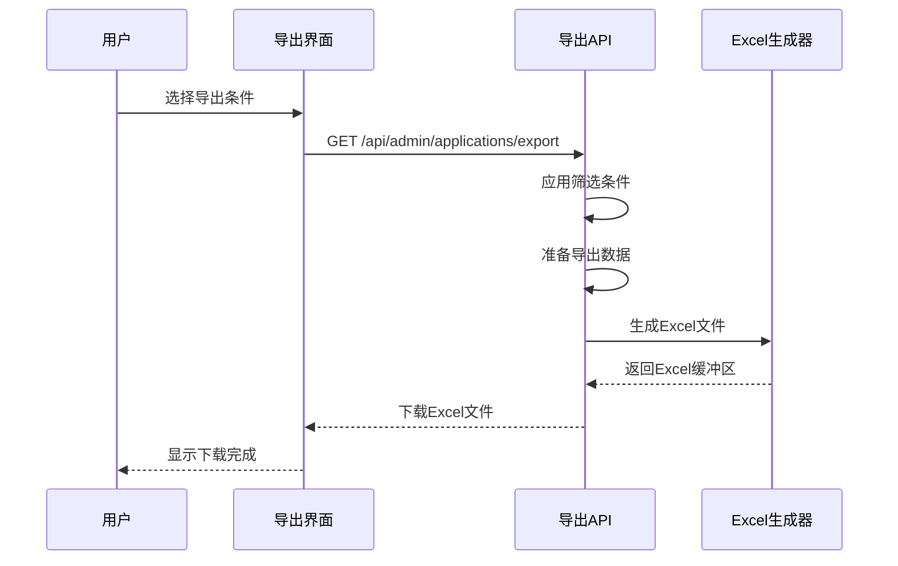
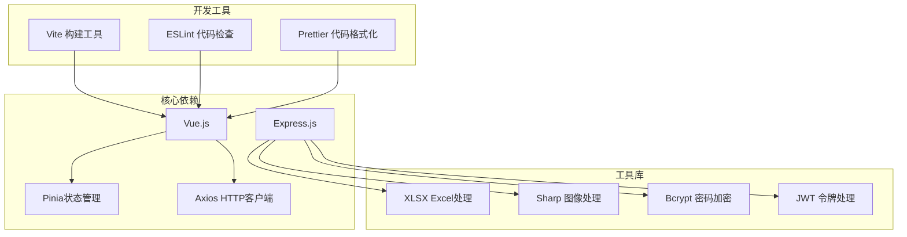

# 订单申请系统

<cite>
**本文档引用的文件**
- [backend/index.js](file://backend/index.js)
- [backend/routes/admin.js](file://backend/routes/admin.js)
- [backend/middleware/validation.js](file://backend/middleware/validation.js)
- [backend/storage.js](file://backend/storage.js)
- [backend/cache.js](file://backend/cache.js)
- [backend/db/schema.sql](file://backend/db/schema.sql)
- [backend/config.js](file://backend/config.js)
- [frontend/h5/src/views/services/Apply.vue](file://frontend/h5/src/views/services/Apply.vue)
- [frontend/h5/src/views/admin/orders/OrderList.vue](file://frontend/h5/src/views/admin/orders/OrderList.vue)
- [frontend/h5/src/views/admin/Dashboard.vue](file://frontend/h5/src/views/admin/Dashboard.vue)
- [frontend/h5/src/stores/application.js](file://frontend/h5/src/stores/application.js)
</cite>

## 目录
1. [简介](#简介)
2. [项目结构](#项目结构)
3. [核心组件](#核心组件)
4. [架构概览](#架构概览)
5. [详细组件分析](#详细组件分析)
6. [依赖关系分析](#依赖关系分析)
7. [性能考虑](#性能考虑)
8. [故障排除指南](#故障排除指南)
9. [结论](#结论)

## 简介

低空飞行服务平台订单申请系统是一个基于Node.js和Vue.js构建的完整订单管理系统，专门服务于低空飞行相关的各类服务申请。该系统提供了完整的申请流程管理、状态跟踪、数据统计和导出功能，支持多角色权限管理，包括普通用户、管理员、DSL管理员和研学管理员。

系统的核心特性包括：
- 多服务类型支持（物流、赛事、培训、研学等11种服务）
- 完整的申请流程管理（提交、审核、处理、完成）
- 实时状态跟踪和通知
- 数据统计和可视化报表
- 批量操作和导出功能
- 多角色权限控制

## 项目结构

该项目采用前后端分离的架构设计，具有清晰的模块化组织：

**图表来源**
- [backend/index.js:1-50](file://backend/index.js#L1-L50)
- [backend/storage.js:1-50](file://backend/storage.js#L1-L50)

**章节来源**
- [backend/index.js:1-100](file://backend/index.js#L1-L100)
- [frontend/h5/src/views/services/Apply.vue:1-50](file://frontend/h5/src/views/services/Apply.vue#L1-L50)

## 核心组件

### 1. 申请表单系统

申请表单系统支持11种不同的服务类型，每种服务都有特定的字段要求和验证规则：

| 服务ID | 服务名称 | 关键字段 | 验证规则 |
|--------|----------|----------|----------|
| 1 | 无人机物流 | 联系人、电话、货物类型、重量、体积 | 必填验证、格式验证 |
| 2 | 政务服务 | 服务类型、巡检区域、时间 | 文本验证 |
| 3 | 无人机托管 | 机型、数量、时长 | 数字验证 |
| 4 | 无人机吊运 | 物品类型、重量、高度 | 数字验证 |
| 6 | 飞手培训 | 姓名、电话、性别、身份证 | 必填验证 |
| 9 | 低空研学 | 学校、年级、人数、日期 | 必填验证 |
| 13 | DSL赛事 | 角色、单位、证件号 | 复杂验证 |

### 2. 状态管理系统

系统实现了完整的订单状态管理机制：

**图表来源**
- [backend/index.js:1036-1052](file://backend/index.js#L1036-L1052)

### 3. 权限控制系统

系统支持四种角色的权限管理：

| 角色 | 权限范围 | 功能限制 |
|------|----------|----------|
| user | 个人申请 | 仅能查看自己的申请 |
| admin | 全部权限 | 管理所有申请和用户 |
| dsl_admin | 赛事服务 | 仅能管理DSL赛事申请 |
| study_admin | 研学服务 | 仅能管理研学申请 |

**章节来源**
- [backend/index.js:1054-1085](file://backend/index.js#L1054-L1085)
- [backend/routes/admin.js:132-145](file://backend/routes/admin.js#L132-L145)

## 架构概览

系统采用分层架构设计，确保了良好的可维护性和扩展性：

**图表来源**
- [backend/index.js:1380-1401](file://backend/index.js#L1380-L1401)
- [backend/storage.js:42-63](file://backend/storage.js#L42-L63)

## 详细组件分析

### 申请表单组件分析

申请表单组件实现了复杂的服务适配逻辑，根据不同的服务类型动态渲染相应的表单字段：

**图表来源**
- [frontend/h5/src/views/services/Apply.vue:812-889](file://frontend/h5/src/views/services/Apply.vue#L812-L889)
- [backend/middleware/validation.js:59-149](file://backend/middleware/validation.js#L59-L149)

#### 表单验证规则

每个服务类型的表单都有一套特定的验证规则：

**物流服务验证规则：**
- 联系人：必填，长度2-20字符
- 联系电话：必填，11位手机号格式
- 货物类型：必填，从预定义列表选择
- 货物重量：必填，数值格式，范围1-1000kg

**培训服务验证规则：**
- 姓名：必填，长度2-20字符
- 联系电话：必填，11位手机号格式
- 身份证号：必填，18位格式验证
- 考试机型：必填，从预定义列表选择

**章节来源**
- [frontend/h5/src/views/services/Apply.vue:1113-1206](file://frontend/h5/src/views/services/Apply.vue#L1113-L1206)
- [backend/middleware/validation.js:59-98](file://backend/middleware/validation.js#L59-L98)

### 管理后台组件分析

管理后台提供了完整的订单管理界面，支持批量操作和实时统计：

**图表来源**
- [frontend/h5/src/views/admin/orders/OrderList.vue:191-240](file://frontend/h5/src/views/admin/orders/OrderList.vue#L191-L240)
- [backend/routes/admin.js:116-166](file://backend/routes/admin.js#L116-L166)

#### 订单管理功能

管理后台提供了以下核心功能：

**批量操作功能：**
- 全选/取消全选
- 批量状态更新
- 批量导出选择的订单

**筛选和搜索：**
- 按状态筛选（待处理、处理中、已完成、已取消）
- 按服务类型筛选
- 日期范围筛选

**实时统计：**
- 订单总数统计
- 状态分布饼图
- 近14天趋势线图

**章节来源**
- [frontend/h5/src/views/admin/orders/OrderList.vue:1-258](file://frontend/h5/src/views/admin/orders/OrderList.vue#L1-L258)
- [backend/routes/admin.js:66-111](file://backend/routes/admin.js#L66-L111)

### 数据统计组件分析

系统提供了全面的数据统计和可视化功能：

**图表来源**
- [backend/index.js:948-1018](file://backend/index.js#L948-L1018)

#### 统计指标说明

系统提供以下关键统计指标：

**概览指标：**
- 总订单数：所有服务的申请总数
- 待处理订单：需要立即处理的申请数量
- 处理中订单：正在处理中的申请数量
- 已完成订单：已完成的申请数量
- 用户总数：平台注册用户数量
- 赛事报名总数：DSL赛事的报名数量

**趋势分析：**
- 近14天订单趋势：每日申请数量变化
- 用户月度增长：按月统计新用户注册数量

**分布分析：**
- 赛事报名角色分布：运动员、教练员、裁判员、俱乐部的比例
- 订单状态分布：各状态下订单的数量占比

**章节来源**
- [frontend/h5/src/views/admin/Dashboard.vue:72-86](file://frontend/h5/src/views/admin/Dashboard.vue#L72-L86)
- [backend/index.js:957-1013](file://backend/index.js#L957-L1013)

### 导出功能组件分析

系统提供了灵活的订单导出功能，支持多种筛选条件：

**图表来源**
- [backend/routes/admin.js:171-207](file://backend/routes/admin.js#L171-L207)

#### 导出功能特性

**筛选条件支持：**
- 按日期范围筛选
- 按状态筛选
- 按服务类型筛选
- 按订单ID精确筛选

**数据格式支持：**
- Excel格式（.xlsx）
- 自动列宽调整
- 中文字段标题
- 数据类型自动识别

**权限控制：**
- 管理员：可导出所有数据
- DSL管理员：仅可导出DSL相关数据
- 研学管理员：仅可导出研学相关数据

**章节来源**
- [backend/routes/admin.js:171-207](file://backend/routes/admin.js#L171-L207)

## 依赖关系分析

系统的关键依赖关系如下：

**图表来源**
- [backend/package.json](file://backend/package.json)
- [frontend/h5/package.json](file://frontend/h5/package.json)

### 外部服务集成

系统集成了多个外部服务：

**微信服务集成：**
- 微信小程序登录
- 微信手机号授权
- 微信access_token管理

**SSO单点登录：**
- 畅行温州平台集成
- 会员信息同步
- 授权码验证

**文件存储服务：**
- 本地文件存储
- 图片压缩处理
- 文件类型和大小限制

**章节来源**
- [backend/index.js:55-69](file://backend/index.js#L55-L69)
- [backend/index.js:492-549](file://backend/index.js#L492-L549)
- [backend/index.js:278-285](file://backend/index.js#L278-L285)

## 性能考虑

### 缓存策略

系统采用了多层次的缓存策略来提升性能：

**内存缓存：**
- 用户数据缓存：60秒过期
- 申请数据缓存：60秒过期  
- 案例数据缓存：300秒过期
- 服务配置缓存：300秒过期
- 评价数据缓存：60秒过期

**缓存键管理：**
- 统一的缓存键命名规范
- 自动过期清理机制
- 缓存命中率监控

### 数据存储优化

**存储后端切换：**
- JSON文件存储（开发环境）
- PostgreSQL存储（生产环境）
- 自动表迁移机制

**索引优化：**
- 申请ID索引
- 用户ID索引
- 创建时间索引
- 服务类型索引

### 性能监控

系统内置了性能监控机制：

**请求日志：**
- 请求耗时统计
- 错误率监控
- API调用频率分析

**内存使用监控：**
- 缓存使用情况
- 内存泄漏检测
- GC活动监控

## 故障排除指南

### 常见问题及解决方案

**1. 申请提交失败**
- 检查网络连接状态
- 验证必填字段完整性
- 确认用户登录状态
- 查看控制台错误信息

**2. 订单状态更新异常**
- 确认管理员权限
- 检查服务类型权限限制
- 验证订单ID有效性
- 查看服务器响应状态

**3. 数据导出失败**
- 检查Excel插件版本
- 验证筛选条件格式
- 确认文件大小限制
- 查看浏览器兼容性

**4. 缓存数据过期**
- 手动刷新页面
- 清除浏览器缓存
- 检查缓存配置
- 重启应用服务

### 调试工具

**前端调试：**
- Vue DevTools
- 浏览器开发者工具
- 网络请求监控
- 控制台错误追踪

**后端调试：**
- 日志文件分析
- 请求响应追踪
- 数据库查询监控
- 性能指标分析

**章节来源**
- [backend/logger.js](file://backend/logger.js)
- [backend/middleware/error.js](file://backend/middleware/error.js)

## 结论

低空飞行服务平台订单申请系统是一个功能完整、架构清晰的现代化Web应用。系统通过合理的分层设计、完善的权限控制和丰富的功能特性，为用户提供了一站式的低空飞行服务申请体验。

**主要优势：**
- 多角色权限管理，满足不同用户需求
- 完整的申请流程管理，支持状态跟踪
- 丰富的数据统计和可视化功能
- 灵活的导出和批量操作能力
- 良好的性能优化和缓存策略

**未来改进方向：**
- 增强移动端用户体验
- 扩展更多服务类型支持
- 优化大数据量下的性能表现
- 增加更多自动化处理功能
- 完善异常处理和监控告警机制

该系统为低空飞行服务的数字化转型提供了坚实的技术基础，具备良好的扩展性和维护性，能够适应未来业务发展的需求。