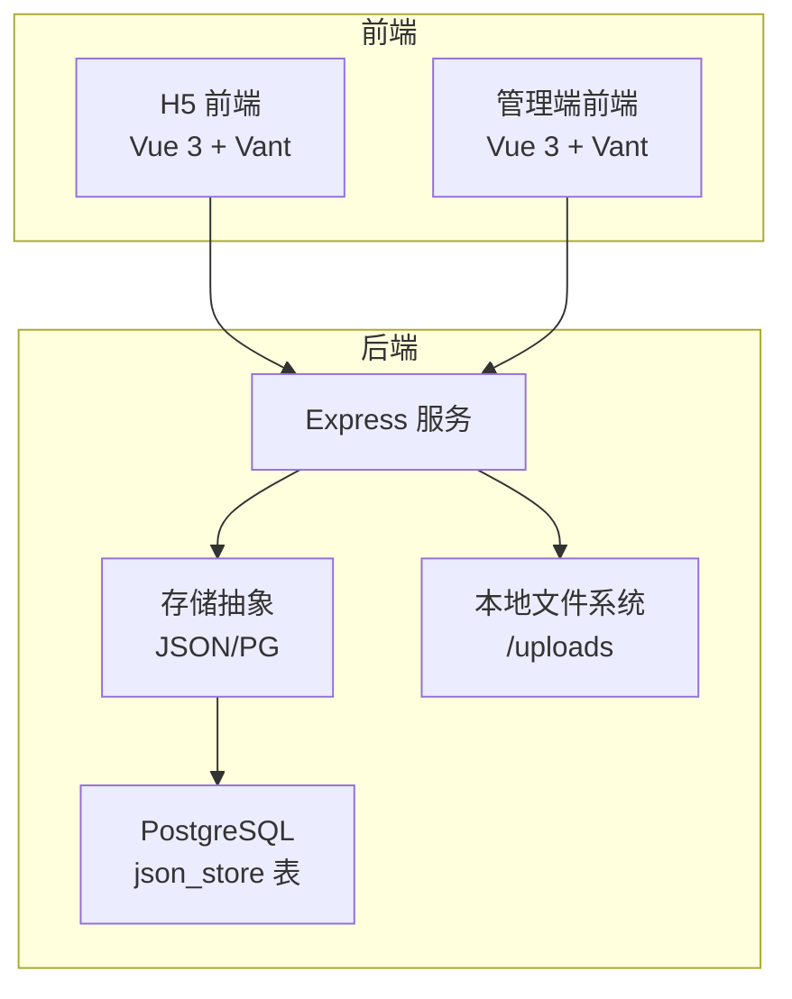
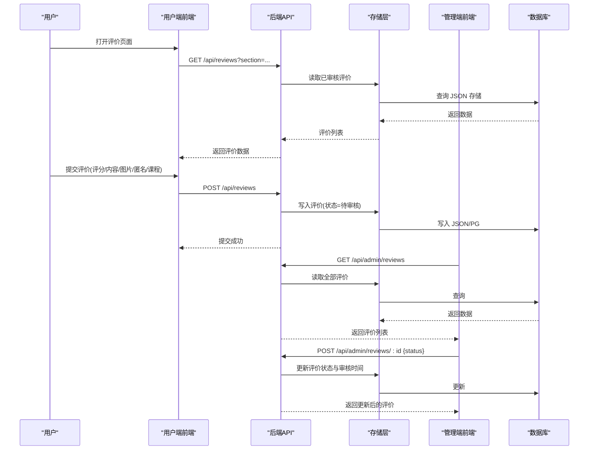
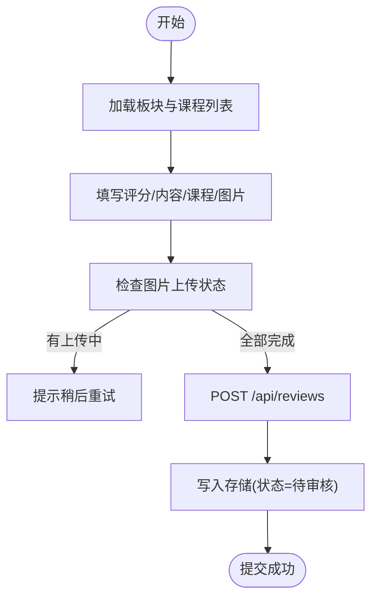
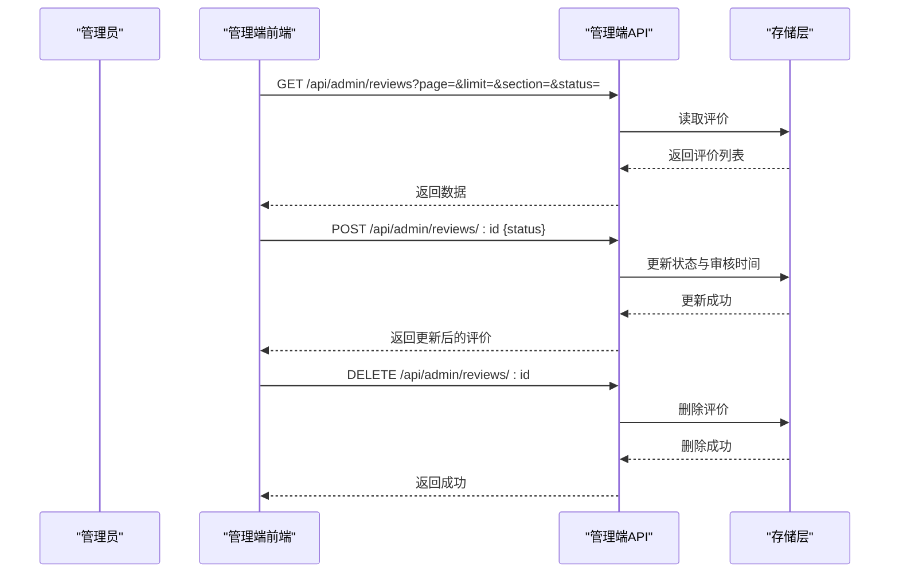
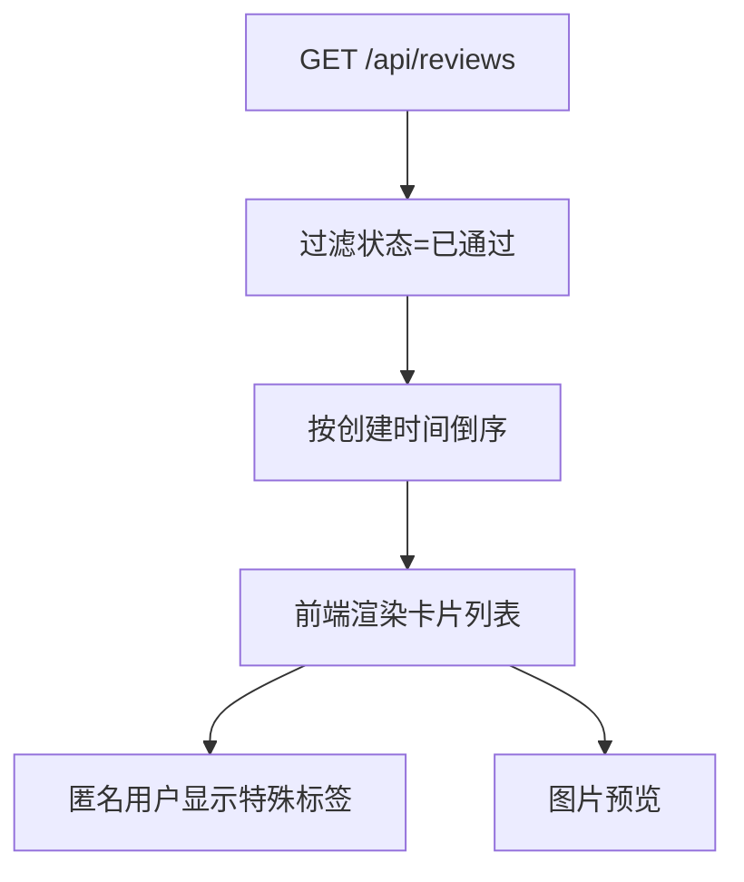
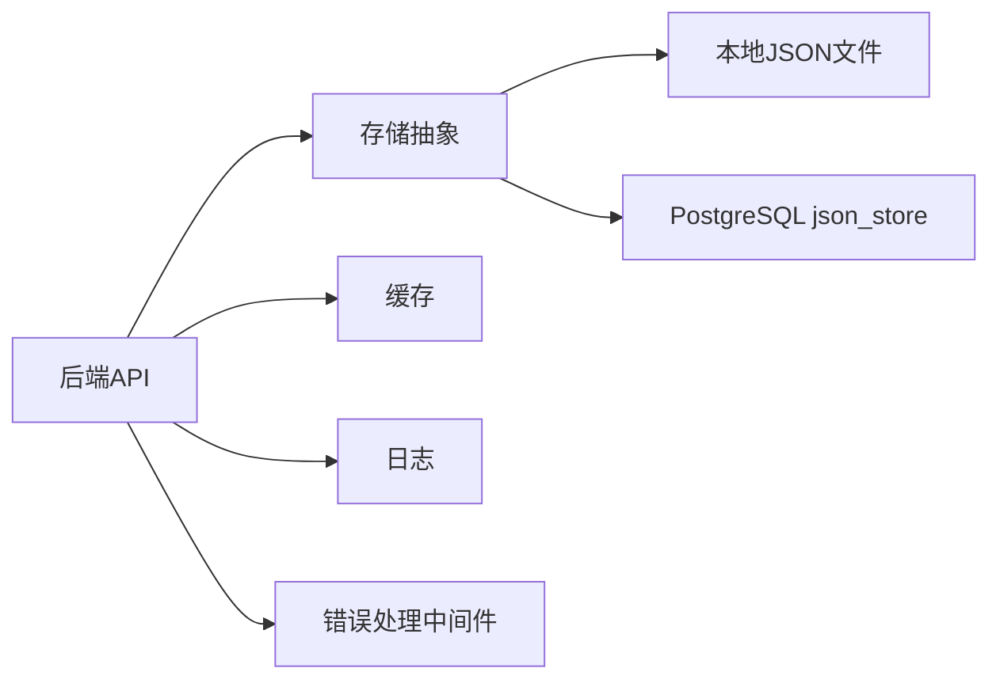

# 评价评价系统

<cite>
**本文档引用的文件**
- [backend/index.js](file://backend/index.js)
- [backend/routes/admin.js](file://backend/routes/admin.js)
- [backend/storage.js](file://backend/storage.js)
- [backend/db/schema.sql](file://backend/db/schema.sql)
- [backend/config.js](file://backend/config.js)
- [backend/middleware/error.js](file://backend/middleware/error.js)
- [backend/reviews.json](file://backend/reviews.json)
- [backend/services_config.json](file://backend/services_config.json)
- [frontend/h5/src/views/reviews/Index.vue](file://frontend/h5/src/views/reviews/Index.vue)
- [frontend/h5/src/views/admin/reviews/ReviewList.vue](file://frontend/h5/src/views/admin/reviews/ReviewList.vue)
- [frontend/h5/src/views/admin/composables/useMedia.js](file://frontend/h5/src/views/admin/composables/useMedia.js)
</cite>

## 更新摘要
**所做更改**
- 新增多板块评价支持（研学、无人机销售、乐园）功能说明
- 更新评价数据模型，增加课程关联和匿名评价功能
- 完善管理员审核后台功能描述
- 新增课程选择与板块联动机制说明
- 补充图片上传与媒体归一化处理流程
- 更新API接口规范，包含完整的评价系统接口说明

## 目录
1. [引言](#引言)
2. [项目结构](#项目结构)
3. [核心组件](#核心组件)
4. [架构总览](#架构总览)
5. [详细组件分析](#详细组件分析)
6. [依赖关系分析](#依赖关系分析)
7. [性能考虑](#性能考虑)
8. [故障排除指南](#故障排除指南)
9. [结论](#结论)

## 引言
本文件面向低空飞行服务平台的评价评价系统，围绕评价提交流程、审核机制、展示策略与统计分析进行系统化技术文档说明。文档覆盖数据模型、内容审核流程、评价排序算法、统计指标计算，并给出用户评价提交界面、管理员审核后台、评价展示页面的实现细节，以及评价流程图、审核机制设计、统计报表实现和API接口规范。

## 项目结构
系统采用前后端分离架构：
- 后端基于 Express，提供 REST API、文件上传、存储抽象与管理后台接口
- 前端采用 Vue 3 + Vant 组件库，分别提供用户端评价页面与管理端审核页面
- 存储层支持本地 JSON 文件与 PostgreSQL（通过 JSONB 字段）两种模式

**图表来源**
- [backend/index.js:1354-1372](file://backend/index.js#L1354-L1372)
- [backend/storage.js:102-131](file://backend/storage.js#L102-L131)
- [backend/db/schema.sql:1-10](file://backend/db/schema.sql#L1-L10)

**章节来源**
- [backend/index.js:1354-1372](file://backend/index.js#L1354-L1372)
- [backend/storage.js:42-63](file://backend/storage.js#L42-L63)
- [backend/db/schema.sql:1-10](file://backend/db/schema.sql#L1-L10)

## 核心组件
- 评价数据模型：包含评价标识、用户信息、匿名标记、板块分类、评分、内容、课程名称、图片列表、状态、创建与审核时间等字段
- 评价提交接口：用户端提交评价，进入"待审核"状态
- 评价审核接口：管理端对评价进行"通过/拒绝"，并记录审核时间
- 评价展示接口：仅返回已通过的评价，按创建时间倒序
- 课程选择接口：根据板块动态提供可选课程列表
- 文件上传接口：支持图片上传，返回标准化 URL

**章节来源**
- [backend/reviews.json:1-54](file://backend/reviews.json#L1-L54)
- [backend/index.js:1178-1269](file://backend/index.js#L1178-L1269)
- [backend/routes/admin.js:409-481](file://backend/routes/admin.js#L409-L481)
- [backend/storage.js:174-181](file://backend/storage.js#L174-L181)

## 架构总览
下图展示了评价系统的关键交互流程：用户提交、后端持久化、管理端审核、公开展示与课程联动。

**图表来源**
- [backend/index.js:1198-1269](file://backend/index.js#L1198-L1269)
- [backend/routes/admin.js:409-481](file://backend/routes/admin.js#L409-L481)
- [backend/storage.js:174-181](file://backend/storage.js#L174-L181)

## 详细组件分析

### 评价数据模型
- 字段定义
  - 标识：字符串 UUID
  - 用户：用户ID、显示名称、头像、匿名标记
  - 板块：'yanxue'/'sale'/'park'
  - 评分：整数（1-5）
  - 内容：文本，限制长度
  - 课程：字符串，来自板块课程列表
  - 图片：URL 数组
  - 状态：'pending'/'approved'/'rejected'
  - 时间：创建时间、审核时间
- 数据来源
  - 示例数据见 reviews.json
  - 运行时存储于本地 JSON 文件或 PostgreSQL 的 json_store 表

**章节来源**
- [backend/reviews.json:1-54](file://backend/reviews.json#L1-L54)
- [backend/db/schema.sql:1-10](file://backend/db/schema.sql#L1-L10)
- [backend/storage.js:174-181](file://backend/storage.js#L174-L181)

### 评价提交流程
- 用户端
  - 选择板块，动态加载课程列表
  - 填写评分、内容、选择课程、上传图片
  - 匿名开关控制是否匿名
  - 提交后显示"等待审核"
- 后端
  - 校验必填项与图片状态
  - 写入状态为"待审核"的评价
  - 返回提交结果

**图表来源**
- [frontend/h5/src/views/reviews/Index.vue:348-388](file://frontend/h5/src/views/reviews/Index.vue#L348-L388)
- [backend/index.js:1247-1269](file://backend/index.js#L1247-L1269)

**章节来源**
- [frontend/h5/src/views/reviews/Index.vue:263-397](file://frontend/h5/src/views/reviews/Index.vue#L263-L397)
- [backend/index.js:1178-1269](file://backend/index.js#L1178-L1269)

### 审核机制设计
- 管理端接口
  - 获取全部评价（支持分页、板块、状态筛选）
  - 更新评价状态（批准/拒绝），记录审核时间
  - 删除评价
- 权限与过滤
  - 管理员可查看全部；特定角色仅能操作对应服务ID的数据
- 审核状态流转
  - 待审核 → 已通过/已拒绝
  - 已通过的评价对外展示

**图表来源**
- [backend/routes/admin.js:409-481](file://backend/routes/admin.js#L409-L481)
- [backend/storage.js:174-181](file://backend/storage.js#L174-L181)

**章节来源**
- [backend/routes/admin.js:409-481](file://backend/routes/admin.js#L409-L481)

### 评价展示策略
- 对外接口
  - GET /api/reviews：返回已通过的评价，按创建时间倒序
  - GET /api/reviews?section=...：按板块过滤
- 用户端页面
  - 展示评分概览（平均分、评价数量）
  - 支持匿名显示"匿名用户"
  - 图片预览与课程标签

**图表来源**
- [backend/index.js:1198-1216](file://backend/index.js#L1198-L1216)
- [frontend/h5/src/views/reviews/Index.vue:235-273](file://frontend/h5/src/views/reviews/Index.vue#L235-L273)

**章节来源**
- [backend/index.js:1198-1216](file://backend/index.js#L1198-L1216)
- [frontend/h5/src/views/reviews/Index.vue:1-638](file://frontend/h5/src/views/reviews/Index.vue#L1-L638)

### 课程选择与板块联动
- 接口
  - GET /api/reviews/courses?section=...：返回板块对应的课程列表
- 前端
  - 切换板块时预加载课程列表
  - 选择课程后写入评价表单

**章节来源**
- [backend/index.js:1178-1196](file://backend/index.js#L1178-L1196)
- [frontend/h5/src/views/reviews/Index.vue:275-287](file://frontend/h5/src/views/reviews/Index.vue#L275-L287)

### 文件上传与媒体归一化
- 接口
  - POST /api/upload：上传图片，返回标准化 URL
- 归一化规则
  - 本地相对路径自动补全前缀
  - 本地回环地址（localhost/127.0.0.1/0.0.0.0/172.17.0.1 或端口 8090）去除主机部分，仅保留路径
- 前端上传流程
  - 选择图片 → 上传 → 成功后加入评价表单

**章节来源**
- [backend/index.js:263-286](file://backend/index.js#L263-L286)
- [frontend/h5/src/views/admin/composables/useMedia.js:7-34](file://frontend/h5/src/views/admin/composables/useMedia.js#L7-L34)
- [frontend/h5/src/views/reviews/Index.vue:317-346](file://frontend/h5/src/views/reviews/Index.vue#L317-L346)

### API 接口规范

- 评价相关
  - GET /api/reviews
    - 查询参数：section（可选）
    - 返回：已通过的评价数组，按创建时间倒序
  - POST /api/reviews
    - 请求体：section、rating、content、isAnonymous、courseName、images
    - 返回：提交成功消息
  - GET /api/reviews/courses
    - 查询参数：section
    - 返回：课程列表（id/name）

- 管理端
  - GET /api/admin/reviews
    - 查询参数：page、limit、section、status
    - 返回：分页评价列表与分页信息
  - POST /api/admin/reviews/:id
    - 请求体：status（approved/rejected）
    - 返回：更新后的评价
  - DELETE /api/admin/reviews/:id
    - 返回：删除成功消息

**章节来源**
- [backend/index.js:1178-1269](file://backend/index.js#L1178-L1269)
- [backend/routes/admin.js:409-481](file://backend/routes/admin.js#L409-L481)

## 依赖关系分析
- 存储层
  - 本地模式：每个键对应一个 JSON 文件（如 reviews.json）
  - PG 模式：统一使用 json_store 表，键值映射 JSONB 数据
- 缓存
  - 读取操作带缓存，写入操作清除对应缓存键
- 错误处理
  - 统一错误中间件，区分文件大小、JWT、数据库约束等错误类型

**图表来源**
- [backend/storage.js:102-131](file://backend/storage.js#L102-L131)
- [backend/db/schema.sql:1-10](file://backend/db/schema.sql#L1-L10)
- [backend/middleware/error.js:9-58](file://backend/middleware/error.js#L9-L58)

**章节来源**
- [backend/storage.js:134-181](file://backend/storage.js#L134-L181)
- [backend/middleware/error.js:9-58](file://backend/middleware/error.js#L9-L58)

## 性能考虑
- 读取性能
  - 评价读取默认带缓存（60 秒），减少磁盘/数据库访问
  - 管理端读取（用户、案例、申请）分别设置不同缓存时长
- 写入性能
  - 写入后主动清理对应缓存键，保证一致性
- 数据库迁移
  - json_store 表为后续规范化与索引优化预留空间

## 故障排除指南
- 上传失败
  - 检查文件大小与类型限制
  - 确认 /uploads 目录可写
- 审核状态异常
  - 确认管理端请求体中的 status 为 approved 或 rejected
  - 检查对应评价是否存在
- 展示为空
  - 确认评价状态为 approved
  - 检查板块参数是否正确
- 配置问题
  - 检查环境变量与配置文件中的数据库与上传目录设置

**章节来源**
- [backend/middleware/error.js:16-58](file://backend/middleware/error.js#L16-L58)
- [backend/config.js:55-60](file://backend/config.js#L55-L60)
- [backend/index.js:263-286](file://backend/index.js#L263-L286)

## 结论
本评价系统以清晰的流程与模块化设计实现了从用户提交、管理审核到公开展示的完整闭环。通过本地 JSON 与 PostgreSQL 双存储模式，满足不同规模部署需求；通过缓存与错误处理提升稳定性与可用性。未来可在以下方面持续优化：引入更细粒度的权限控制、扩展统计维度（如按课程/时间段聚合）、增强审核日志与审计追踪。