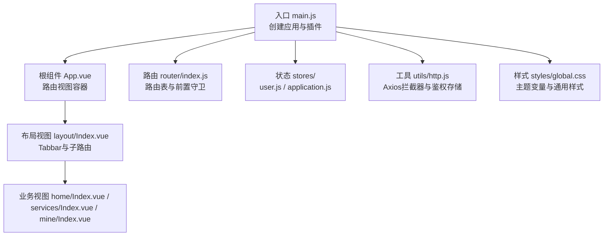
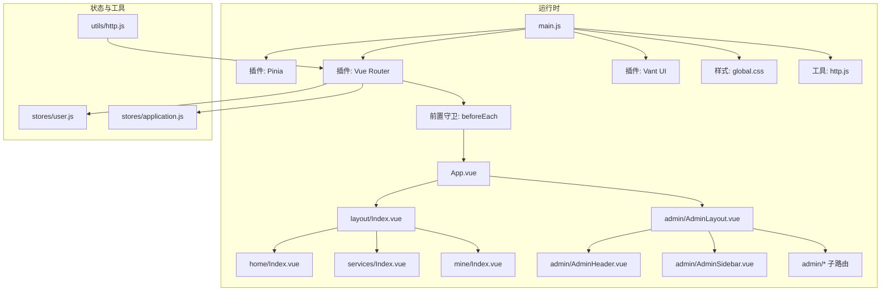
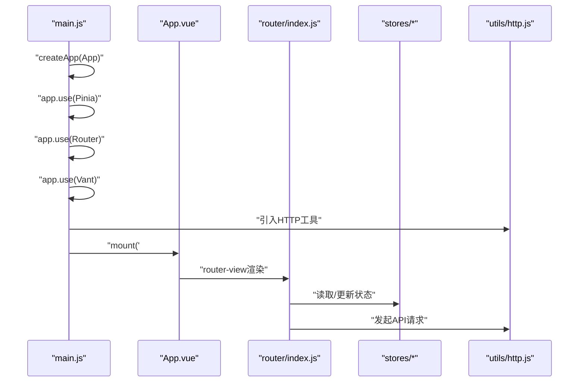
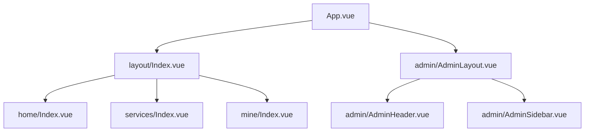
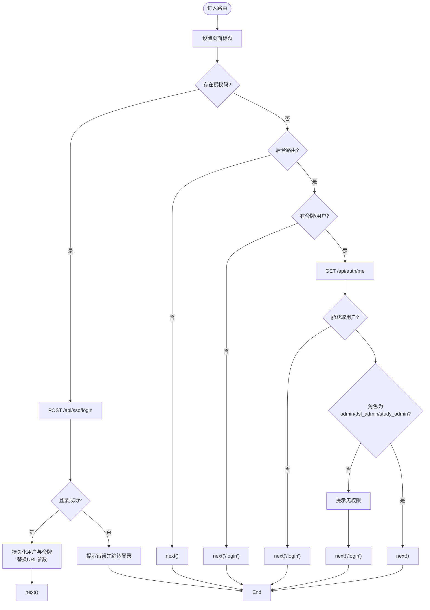
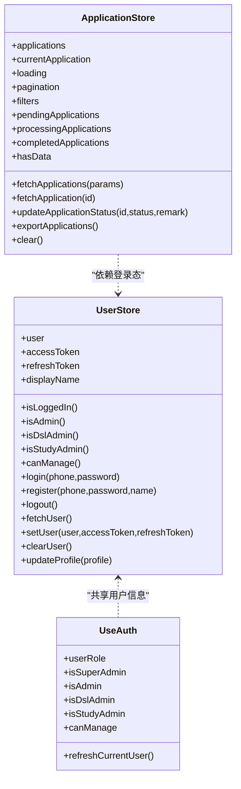
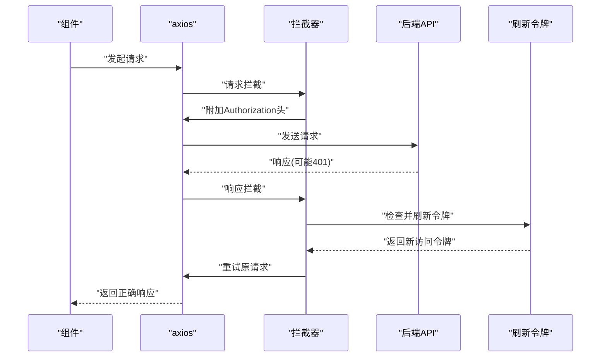
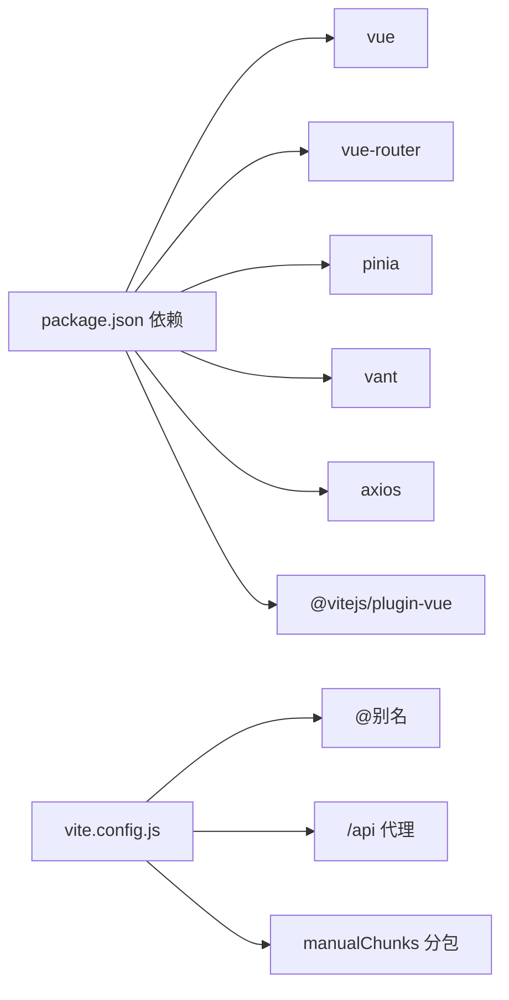

# Vue.js应用结构

<cite>
**本文引用的文件**
- [main.js](file://frontend/h5/src/main.js)
- [App.vue](file://frontend/h5/src/App.vue)
- [router/index.js](file://frontend/h5/src/router/index.js)
- [styles/global.css](file://frontend/h5/src/styles/global.css)
- [utils/http.js](file://frontend/h5/src/utils/http.js)
- [stores/user.js](file://frontend/h5/src/stores/user.js)
- [stores/application.js](file://frontend/h5/src/stores/application.js)
- [views/layout/Index.vue](file://frontend/h5/src/views/layout/Index.vue)
- [views/admin/AdminLayout.vue](file://frontend/h5/src/views/admin/AdminLayout.vue)
- [views/admin/components/AdminHeader.vue](file://frontend/h5/src/views/admin/components/AdminHeader.vue)
- [views/admin/components/AdminSidebar.vue](file://frontend/h5/src/views/admin/components/AdminSidebar.vue)
- [views/admin/composables/useAuth.js](file://frontend/h5/src/views/admin/composables/useAuth.js)
- [views/home/Index.vue](file://frontend/h5/src/views/home/Index.vue)
- [views/services/Index.vue](file://frontend/h5/src/views/services/Index.vue)
- [views/mine/Index.vue](file://frontend/h5/src/views/mine/Index.vue)
- [package.json](file://frontend/h5/package.json)
- [vite.config.js](file://frontend/h5/vite.config.js)
</cite>

## 目录
1. [简介](#简介)
2. [项目结构](#项目结构)
3. [核心组件](#核心组件)
4. [架构总览](#架构总览)
5. [详细组件分析](#详细组件分析)
6. [依赖分析](#依赖分析)
7. [性能考虑](#性能考虑)
8. [故障排查指南](#故障排查指南)
9. [结论](#结论)
10. [附录](#附录)

## 简介
本文件面向低空飞行服务平台的Vue.js前端应用，系统性梳理应用初始化配置、组件树结构、路由系统、样式架构与运行机制，解释启动流程、插件系统集成、全局状态注入与组件生命周期管理，并提供最佳实践与排障建议。

## 项目结构
该应用采用基于功能域的目录组织方式，核心入口位于H5端，主要目录包括：
- src：源代码
  - components：通用组件（当前仓库未直接提供）
  - views：页面级视图组件
  - router：路由配置
  - stores：状态管理（Pinia）
  - utils：工具模块（HTTP拦截器等）
  - styles：全局样式
  - App.vue、main.js：应用根组件与入口
- vite.config.js：构建与开发服务器配置
- package.json：依赖与脚本

图表来源
- [main.js:1-22](file://frontend/h5/src/main.js#L1-L22)
- [App.vue:1-32](file://frontend/h5/src/App.vue#L1-L32)
- [router/index.js:1-227](file://frontend/h5/src/router/index.js#L1-L227)
- [stores/user.js:1-177](file://frontend/h5/src/stores/user.js#L1-L177)
- [stores/application.js:1-177](file://frontend/h5/src/stores/application.js#L1-L177)
- [utils/http.js:1-99](file://frontend/h5/src/utils/http.js#L1-L99)
- [styles/global.css:1-96](file://frontend/h5/src/styles/global.css#L1-L96)

章节来源
- [main.js:1-22](file://frontend/h5/src/main.js#L1-L22)
- [package.json:1-27](file://frontend/h5/package.json#L1-L27)

## 核心组件
- 应用入口与初始化
  - 使用 createApp 创建应用实例，按序注册 Pinia、Vue Router、Vant UI，并挂载到 DOM。
  - 引入全局样式与HTTP工具，统一注入全局行为。
- 根组件 App.vue
  - 通过 router-view 渲染当前路由组件，并包裹过渡动画，实现页面切换的视觉体验。
- 路由系统
  - 定义多级路由与懒加载视图；在 beforeEach 中设置页面标题、SSO授权码处理、后台管理权限校验。
- 状态管理
  - Pinia Store：用户状态（登录态、角色、用户信息）与应用/订单状态（列表、分页、筛选、导出）。
- HTTP与鉴权
  - Axios请求拦截器自动附加 Bearer Token；响应拦截器处理401并刷新令牌；提供 authStorage 封装本地令牌存取。
- 样式架构
  - 全局CSS变量定义主题色、布局尺寸；通用容器与卡片样式；移动端安全区域适配。

章节来源
- [main.js:14-20](file://frontend/h5/src/main.js#L14-L20)
- [App.vue:1-32](file://frontend/h5/src/App.vue#L1-L32)
- [router/index.js:150-223](file://frontend/h5/src/router/index.js#L150-L223)
- [stores/user.js:7-35](file://frontend/h5/src/stores/user.js#L7-L35)
- [stores/application.js:7-39](file://frontend/h5/src/stores/application.js#L7-L39)
- [utils/http.js:19-78](file://frontend/h5/src/utils/http.js#L19-L78)
- [styles/global.css:17-50](file://frontend/h5/src/styles/global.css#L17-L50)

## 架构总览
应用采用“入口 -> 插件注册 -> 路由守卫 -> 视图渲染 -> 状态管理 -> HTTP拦截”的主流程；后台管理采用独立布局与侧边菜单，结合组合式函数 useAuth 进行角色判定与用户信息同步。

图表来源
- [main.js:14-20](file://frontend/h5/src/main.js#L14-L20)
- [router/index.js:150-223](file://frontend/h5/src/router/index.js#L150-L223)
- [views/layout/Index.vue:1-83](file://frontend/h5/src/views/layout/Index.vue#L1-L83)
- [views/admin/AdminLayout.vue:1-85](file://frontend/h5/src/views/admin/AdminLayout.vue#L1-L85)
- [views/admin/components/AdminHeader.vue:1-109](file://frontend/h5/src/views/admin/components/AdminHeader.vue#L1-L109)
- [views/admin/components/AdminSidebar.vue:1-175](file://frontend/h5/src/views/admin/components/AdminSidebar.vue#L1-L175)
- [stores/user.js:1-177](file://frontend/h5/src/stores/user.js#L1-L177)
- [stores/application.js:1-177](file://frontend/h5/src/stores/application.js#L1-L177)
- [utils/http.js:1-99](file://frontend/h5/src/utils/http.js#L1-L99)

## 详细组件分析

### 应用初始化与插件系统
- 初始化步骤
  - 创建应用实例，注册 Pinia、Vue Router、Vant UI。
  - 引入全局样式与HTTP工具，确保全局样式与请求拦截生效。
- 插件职责
  - Pinia：集中式状态管理，提供用户与应用状态Store。
  - Vue Router：路由定义、导航策略、前置守卫。
  - Vant UI：移动端组件库，提供交互与视觉基础。
- 全局配置
  - 路由历史模式为浏览器历史；开发服务器代理/api与/uploads；别名@指向src目录。

图表来源
- [main.js:14-20](file://frontend/h5/src/main.js#L14-L20)
- [router/index.js:150-223](file://frontend/h5/src/router/index.js#L150-L223)
- [stores/user.js:1-177](file://frontend/h5/src/stores/user.js#L1-L177)
- [stores/application.js:1-177](file://frontend/h5/src/stores/application.js#L1-L177)
- [utils/http.js:1-99](file://frontend/h5/src/utils/http.js#L1-L99)

章节来源
- [main.js:1-22](file://frontend/h5/src/main.js#L1-L22)
- [vite.config.js:12-51](file://frontend/h5/vite.config.js#L12-L51)

### 组件树结构与布局
- 根组件 App.vue
  - 通过 router-view 渲染当前路由组件，配合过渡动画实现页面切换。
- 前台布局 layout/Index.vue
  - 条件渲染底部Tabbar，根据路由meta控制是否显示；使用Vant Tabbar Item与图标。
- 后台布局 admin/AdminLayout.vue
  - 结合 AdminHeader 与 AdminSidebar，支持移动端抽屉与PC侧边栏；根据用户角色动态展示菜单。
- 页面视图
  - home/Index.vue：沉浸式背景、功能金刚区、轮播与推荐服务。
  - services/Index.vue：服务分组网格与搜索。
  - mine/Index.vue：用户信息卡片、统计数据、功能菜单与登出。

图表来源
- [App.vue:1-32](file://frontend/h5/src/App.vue#L1-L32)
- [views/layout/Index.vue:1-83](file://frontend/h5/src/views/layout/Index.vue#L1-L83)
- [views/admin/AdminLayout.vue:1-85](file://frontend/h5/src/views/admin/AdminLayout.vue#L1-L85)
- [views/admin/components/AdminHeader.vue:1-109](file://frontend/h5/src/views/admin/components/AdminHeader.vue#L1-L109)
- [views/admin/components/AdminSidebar.vue:1-175](file://frontend/h5/src/views/admin/components/AdminSidebar.vue#L1-L175)
- [views/home/Index.vue:1-638](file://frontend/h5/src/views/home/Index.vue#L1-L638)
- [views/services/Index.vue:1-225](file://frontend/h5/src/views/services/Index.vue#L1-L225)
- [views/mine/Index.vue:1-336](file://frontend/h5/src/views/mine/Index.vue#L1-L336)

章节来源
- [views/layout/Index.vue:42-47](file://frontend/h5/src/views/layout/Index.vue#L42-L47)
- [views/admin/AdminLayout.vue:23-48](file://frontend/h5/src/views/admin/AdminLayout.vue#L23-L48)

### 路由系统设计
- 路由表
  - 定义前台布局与Tabbar路由、登录/注册、服务详情、案例、评价、后台管理等路由。
  - 后台管理路由嵌套，包含仪表盘、订单、案例、用户、赛事、配置、评价等子路由。
- 导航策略
  - 默认重定向至/home；后台管理路由强制登录与角色校验。
- 路由守卫
  - 设置页面标题；支持 jyauthcode 与 authcode 参数，自动完成SSO登录并持久化用户信息与令牌；后台路由校验访问令牌与用户角色，非管理员提示并回退登录。

图表来源
- [router/index.js:155-223](file://frontend/h5/src/router/index.js#L155-L223)

章节来源
- [router/index.js:5-148](file://frontend/h5/src/router/index.js#L5-L148)
- [router/index.js:155-223](file://frontend/h5/src/router/index.js#L155-L223)

### 样式架构与响应式设计
- 全局样式组织
  - reset与基础字体设置；CSS变量定义主题色、功能色、文本色、边框与背景、卡片阴影与圆角、布局最大宽度、Tabbar高度、侧边栏宽度、管理头部高度。
  - 通用容器 page-container 与内容区 content-wrapper；卡片样式 card；文本省略类。
- 响应式设计
  - 移动端安全区域适配（env(safe-area-inset-* )）；Tabbar在大屏居中、在小屏全宽；后台布局在PC下主内容区偏移侧边栏宽度，在移动端减少内边距。
- 组件级样式
  - 布局组件使用 :deep 选择器覆盖第三方UI库样式；页面组件采用 scoped 样式与变量复用，保证主题一致性。

章节来源
- [styles/global.css:1-96](file://frontend/h5/src/styles/global.css#L1-L96)
- [views/layout/Index.vue:56-80](file://frontend/h5/src/views/layout/Index.vue#L56-L80)
- [views/admin/AdminLayout.vue:72-83](file://frontend/h5/src/views/admin/AdminLayout.vue#L72-L83)
- [views/admin/components/AdminHeader.vue:100-108](file://frontend/h5/src/views/admin/components/AdminHeader.vue#L100-L108)
- [views/admin/components/AdminSidebar.vue:158-174](file://frontend/h5/src/views/admin/components/AdminSidebar.vue#L158-L174)

### 全局状态注入与组件生命周期管理
- Pinia Store
  - 用户状态：登录态、角色判断、用户信息、登录/注册/登出、刷新用户信息、更新资料。
  - 应用/订单状态：列表、分页、筛选、详情、状态更新、导出Excel、清空状态。
- 生命周期管理
  - 在页面组件中使用 onMounted/onUnmounted 等钩子进行资源清理与定时器管理；后台布局在挂载时刷新当前用户信息。
- 组合式函数 useAuth
  - 从本地存储解析用户角色，计算管理员权限；提供刷新用户信息方法，异常时清理令牌与用户信息。

图表来源
- [stores/user.js:7-176](file://frontend/h5/src/stores/user.js#L7-L176)
- [stores/application.js:7-176](file://frontend/h5/src/stores/application.js#L7-L176)
- [views/admin/composables/useAuth.js:6-44](file://frontend/h5/src/views/admin/composables/useAuth.js#L6-L44)

章节来源
- [stores/user.js:1-177](file://frontend/h5/src/stores/user.js#L1-L177)
- [stores/application.js:1-177](file://frontend/h5/src/stores/application.js#L1-L177)
- [views/admin/AdminLayout.vue:46-48](file://frontend/h5/src/views/admin/AdminLayout.vue#L46-L48)
- [views/admin/composables/useAuth.js:17-32](file://frontend/h5/src/views/admin/composables/useAuth.js#L17-L32)

### HTTP拦截与鉴权流程
- 请求拦截
  - 自动从本地存储读取访问令牌并附加到Authorization头。
- 响应拦截
  - 处理401未授权：若存在刷新令牌则尝试刷新；并发请求排队等待新令牌；刷新失败则清理令牌并拒绝请求。
- 工具封装
  - authStorage 提供令牌读取、设置与清理；统一导出axios实例。

图表来源
- [utils/http.js:19-78](file://frontend/h5/src/utils/http.js#L19-L78)

章节来源
- [utils/http.js:1-99](file://frontend/h5/src/utils/http.js#L1-L99)

## 依赖分析
- 运行时依赖
  - Vue 3、Vue Router、Pinia、Vant UI、Axios、vue-echarts、Leaflet、vue-cropper 等。
- 开发依赖
  - Vite、@vitejs/plugin-vue、@vitejs/plugin-basic-ssl。
- 构建与开发
  - Vite配置：别名@、手动分包（echarts与vue-echarts）、开发服务器端口与代理、安全响应头。

图表来源
- [package.json:10-25](file://frontend/h5/package.json#L10-L25)
- [vite.config.js:17-51](file://frontend/h5/vite.config.js#L17-L51)

章节来源
- [package.json:1-27](file://frontend/h5/package.json#L1-L27)
- [vite.config.js:1-54](file://frontend/h5/vite.config.js#L1-L54)

## 性能考虑
- 代码分割
  - 手动分包将 echarts 与 vue-echarts 单独拆分，降低首屏体积，提升图表相关页面加载速度。
- 资源懒加载
  - 路由组件采用动态导入，按需加载页面代码。
- 缓存与重试
  - 401自动刷新令牌并排队重试，减少重复登录成本。
- 样式与布局
  - 使用CSS变量统一主题，减少重复样式；移动端安全区域与Tabbar适配，避免额外重绘。

章节来源
- [vite.config.js:25-29](file://frontend/h5/vite.config.js#L25-L29)
- [router/index.js:150-153](file://frontend/h5/src/router/index.js#L150-L153)
- [utils/http.js:46-76](file://frontend/h5/src/utils/http.js#L46-L76)

## 故障排查指南
- 登录与权限
  - 若后台路由无法访问，检查是否存在有效访问令牌与用户信息；确认用户角色为admin/dsl_admin/study_admin。
  - SSO授权码登录失败时，查看控制台错误与Toast提示，确认后端接口与参数名（jyauthcode/authcode）。
- 令牌刷新
  - 401频繁出现时，确认刷新令牌存在且可用；检查刷新流程是否并发阻塞；必要时清理本地存储并重新登录。
- 路由跳转异常
  - 检查路由元信息（meta）与前置守卫逻辑；确认重定向与children配置正确。
- 样式问题
  - 确认CSS变量定义与页面scoped样式未被意外覆盖；移动端Tabbar与后台侧边栏在不同屏幕下的表现。

章节来源
- [router/index.js:155-223](file://frontend/h5/src/router/index.js#L155-L223)
- [utils/http.js:28-78](file://frontend/h5/src/utils/http.js#L28-L78)
- [views/admin/AdminLayout.vue:23-48](file://frontend/h5/src/views/admin/AdminLayout.vue#L23-L48)

## 结论
该Vue.js应用以清晰的目录结构、完善的路由与守卫、统一的状态管理与HTTP拦截、以及模块化的样式体系，构建了低空飞行服务平台的前台与后台界面。通过合理的代码分割与响应式设计，兼顾了性能与用户体验。建议在后续迭代中持续完善组件抽象、增强错误边界与监控埋点，并补充单元测试与端到端测试以提升稳定性。

## 附录
- 最佳实践
  - 将常用UI组件封装为可复用组件，减少重复代码。
  - 对异步请求进行统一错误处理与用户提示，避免静默失败。
  - 使用组合式函数抽取跨页面逻辑（如鉴权、媒体查询），提升可维护性。
  - 对关键页面进行性能监控与缓存策略优化。
- 参考路径
  - 应用入口与插件注册：[main.js:14-20](file://frontend/h5/src/main.js#L14-L20)
  - 根组件与路由视图：[App.vue:1-32](file://frontend/h5/src/App.vue#L1-L32)
  - 路由守卫与导航策略：[router/index.js:155-223](file://frontend/h5/src/router/index.js#L155-L223)
  - 全局样式与主题变量：[styles/global.css:17-50](file://frontend/h5/src/styles/global.css#L17-L50)
  - HTTP拦截与令牌刷新：[utils/http.js:19-78](file://frontend/h5/src/utils/http.js#L19-L78)
  - 用户状态与动作：[stores/user.js:37-175](file://frontend/h5/src/stores/user.js#L37-L175)
  - 应用/订单状态与动作：[stores/application.js:41-175](file://frontend/h5/src/stores/application.js#L41-L175)
  - 布局与后台组件：[views/layout/Index.vue:1-83](file://frontend/h5/src/views/layout/Index.vue#L1-L83)、[views/admin/AdminLayout.vue:1-85](file://frontend/h5/src/views/admin/AdminLayout.vue#L1-L85)、[views/admin/components/AdminHeader.vue:1-109](file://frontend/h5/src/views/admin/components/AdminHeader.vue#L1-L109)、[views/admin/components/AdminSidebar.vue:1-175](file://frontend/h5/src/views/admin/components/AdminSidebar.vue#L1-L175)
  - 页面视图示例：[views/home/Index.vue:1-638](file://frontend/h5/src/views/home/Index.vue#L1-L638)、[views/services/Index.vue:1-225](file://frontend/h5/src/views/services/Index.vue#L1-L225)、[views/mine/Index.vue:1-336](file://frontend/h5/src/views/mine/Index.vue#L1-L336)