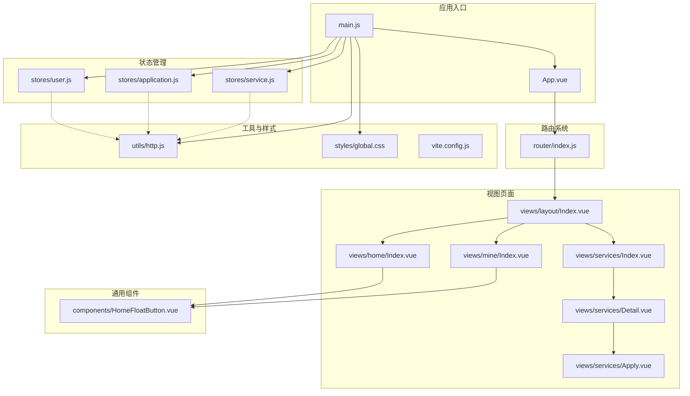
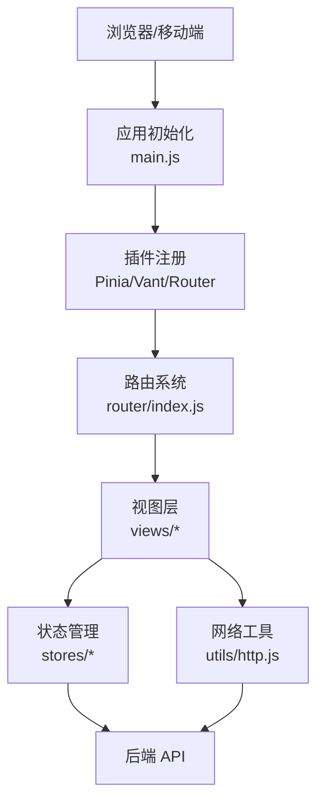
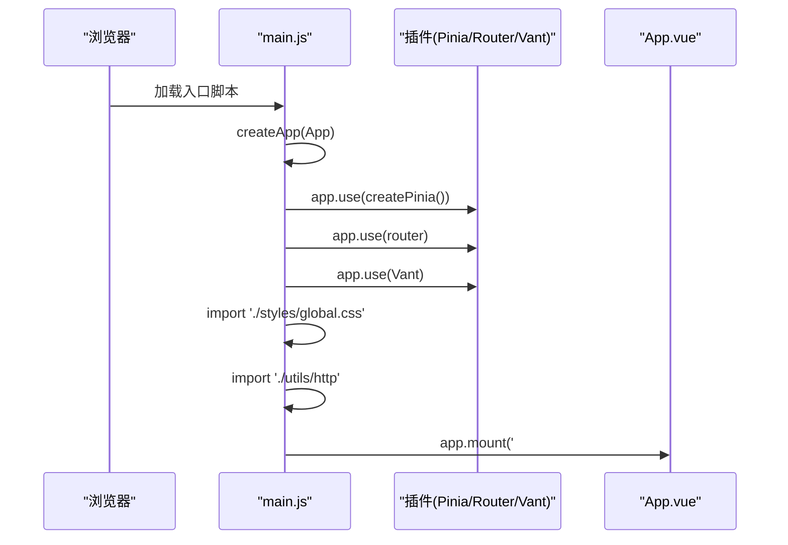
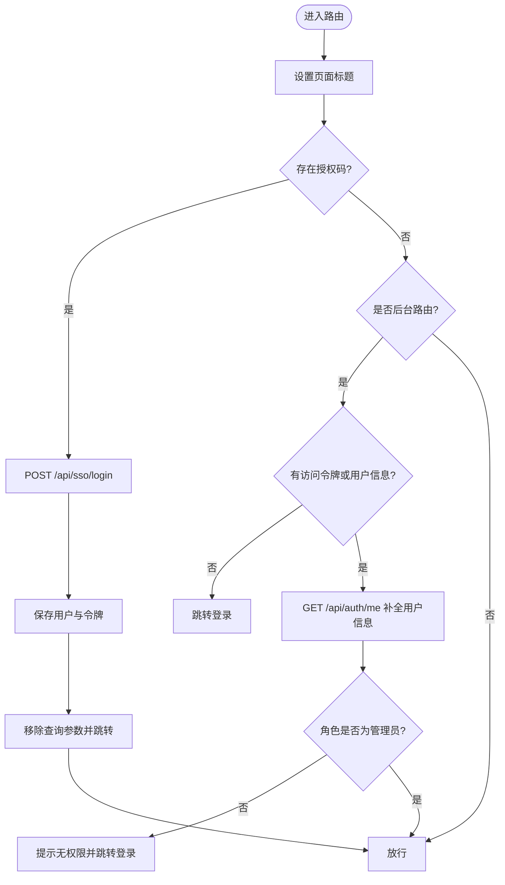
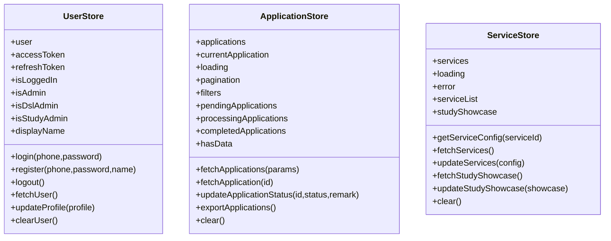
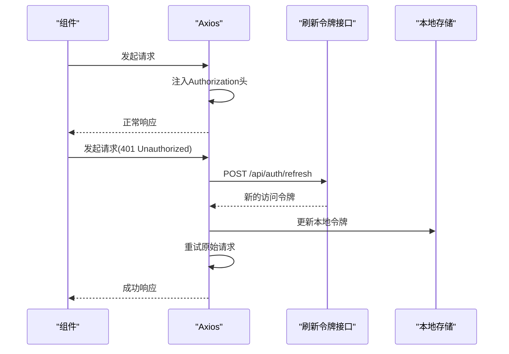
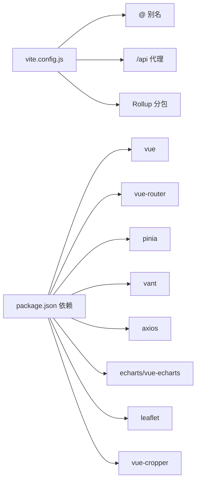

# 前端应用架构

<cite>
**本文档引用的文件**
- [main.js](file://frontend/h5/src/main.js)
- [App.vue](file://frontend/h5/src/App.vue)
- [router/index.js](file://frontend/h5/src/router/index.js)
- [user.js](file://frontend/h5/src/stores/user.js)
- [application.js](file://frontend/h5/src/stores/application.js)
- [service.js](file://frontend/h5/src/stores/service.js)
- [global.css](file://frontend/h5/src/styles/global.css)
- [http.js](file://frontend/h5/src/utils/http.js)
- [layout/Index.vue](file://frontend/h5/src/views/layout/Index.vue)
- [home/Index.vue](file://frontend/h5/src/views/home/Index.vue)
- [services/Index.vue](file://frontend/h5/src/views/services/Index.vue)
- [services/Apply.vue](file://frontend/h5/src/views/services/Apply.vue)
- [services/Detail.vue](file://frontend/h5/src/views/services/Detail.vue)
- [mine/Index.vue](file://frontend/h5/src/views/mine/Index.vue)
- [HomeFloatButton.vue](file://frontend/h5/src/components/HomeFloatButton.vue)
- [package.json](file://frontend/h5/package.json)
- [vite.config.js](file://frontend/h5/vite.config.js)
</cite>

## 目录
1. [引言](#引言)
2. [项目结构](#项目结构)
3. [核心组件](#核心组件)
4. [架构总览](#架构总览)
5. [详细组件分析](#详细组件分析)
6. [依赖关系分析](#依赖关系分析)
7. [性能考虑](#性能考虑)
8. [故障排查指南](#故障排查指南)
9. [结论](#结论)
10. [附录](#附录)

## 引言
本文件面向低空飞行服务平台前端应用，系统化梳理基于 Vue 3 + Pinia + Vant 的前端架构，涵盖应用初始化配置、组件树结构、路由系统设计、样式架构、状态管理、组件架构、页面视图设计、响应式与多端适配策略以及用户体验优化建议。目标是帮助开发者快速理解系统设计与实现，并提供可落地的最佳实践。

## 项目结构
前端采用 H5 移动端优先的单页应用（SPA），核心目录组织如下：
- 应用入口与根组件：main.js、App.vue
- 路由系统：router/index.js
- 状态管理：stores 下的用户、应用/订单、服务配置 Store
- 视图页面：views 下按功能模块划分的页面
- 组件：components 下通用组件
- 工具与网络：utils/http.js
- 样式：styles/global.css
- 构建工具：vite.config.js
- 依赖：package.json

图表来源
- [main.js:1-22](file://frontend/h5/src/main.js#L1-L22)
- [App.vue:1-32](file://frontend/h5/src/App.vue#L1-L32)
- [router/index.js:1-227](file://frontend/h5/src/router/index.js#L1-L227)
- [user.js:1-177](file://frontend/h5/src/stores/user.js#L1-L177)
- [application.js:1-177](file://frontend/h5/src/stores/application.js#L1-L177)
- [service.js:1-164](file://frontend/h5/src/stores/service.js#L1-L164)
- [layout/Index.vue:1-83](file://frontend/h5/src/views/layout/Index.vue#L1-L83)
- [home/Index.vue:1-638](file://frontend/h5/src/views/home/Index.vue#L1-L638)
- [services/Index.vue:1-225](file://frontend/h5/src/views/services/Index.vue#L1-L225)
- [services/Detail.vue:1-800](file://frontend/h5/src/views/services/Detail.vue#L1-L800)
- [services/Apply.vue:1-800](file://frontend/h5/src/views/services/Apply.vue#L1-L800)
- [mine/Index.vue:1-336](file://frontend/h5/src/views/mine/Index.vue#L1-L336)
- [HomeFloatButton.vue:1-53](file://frontend/h5/src/components/HomeFloatButton.vue#L1-L53)
- [http.js:1-99](file://frontend/h5/src/utils/http.js#L1-L99)
- [global.css:1-96](file://frontend/h5/src/styles/global.css#L1-L96)
- [vite.config.js:1-54](file://frontend/h5/vite.config.js#L1-L54)

章节来源
- [main.js:1-22](file://frontend/h5/src/main.js#L1-L22)
- [router/index.js:1-227](file://frontend/h5/src/router/index.js#L1-L227)
- [package.json:1-27](file://frontend/h5/package.json#L1-L27)

## 核心组件
- 应用初始化与插件集成：在应用入口中注册 Pinia、路由、Vant 组件库与全局样式，挂载应用。
- 根组件与过渡动画：根组件通过 router-view 渲染页面，并统一应用淡入淡出过渡。
- 路由守卫与鉴权：在路由前置守卫中处理 SSO 授权码登录、管理员权限校验与页面标题设置。
- 状态管理：用户状态、应用/订单状态、服务配置状态三类 Store，分别负责用户信息、申请列表与导出、服务配置与展示数据。
- 网络层：基于 Axios 的请求拦截器与响应拦截器，自动注入 Authorization 头与刷新令牌流程。
- 布局与通用组件：底部 Tabbar 布局、悬浮返回首页按钮等。

章节来源
- [main.js:1-22](file://frontend/h5/src/main.js#L1-L22)
- [App.vue:1-32](file://frontend/h5/src/App.vue#L1-L32)
- [router/index.js:155-223](file://frontend/h5/src/router/index.js#L155-L223)
- [user.js:1-177](file://frontend/h5/src/stores/user.js#L1-L177)
- [application.js:1-177](file://frontend/h5/src/stores/application.js#L1-L177)
- [service.js:1-164](file://frontend/h5/src/stores/service.js#L1-L164)
- [http.js:19-78](file://frontend/h5/src/utils/http.js#L19-L78)
- [layout/Index.vue:1-83](file://frontend/h5/src/views/layout/Index.vue#L1-L83)
- [HomeFloatButton.vue:1-53](file://frontend/h5/src/components/HomeFloatButton.vue#L1-L53)

## 架构总览
整体采用“入口初始化 → 路由系统 → 视图层 → 状态管理/网络工具”的分层架构。路由负责页面导航与鉴权，视图层承载页面逻辑与交互，状态管理集中处理用户与业务数据，网络层统一处理请求与响应。

图表来源
- [main.js:1-22](file://frontend/h5/src/main.js#L1-L22)
- [router/index.js:1-227](file://frontend/h5/src/router/index.js#L1-L227)
- [http.js:1-99](file://frontend/h5/src/utils/http.js#L1-L99)

## 详细组件分析

### 应用初始化与入口
- 初始化顺序：创建应用实例 → 注册 Pinia → 注册路由 → 注册 Vant → 引入全局样式 → 挂载应用。
- 插件与依赖：Vue 3、Vue Router、Pinia、Vant 4、Axios。
- 全局样式：引入全局 CSS 与 HTTP 工具。

图表来源
- [main.js:1-22](file://frontend/h5/src/main.js#L1-L22)

章节来源
- [main.js:1-22](file://frontend/h5/src/main.js#L1-L22)
- [package.json:10-20](file://frontend/h5/package.json#L10-L20)

### 路由系统与导航
- 路由结构：采用嵌套路由，主布局包含 Tabbar；提供服务大厅、全部服务、我的申请、个人中心等页面；支持登录、注册、案例、评价、后台管理等子路由。
- 路由守卫：动态设置页面标题；支持 jyauthcode/authcode 两种授权码参数；管理员路由保护与角色校验；SSO 登录成功后刷新页面并移除查询参数。
- 路由元信息：title、showTabbar 等用于控制页面标题与 Tabbar 显示。

图表来源
- [router/index.js:155-223](file://frontend/h5/src/router/index.js#L155-L223)

章节来源
- [router/index.js:5-148](file://frontend/h5/src/router/index.js#L5-L148)
- [router/index.js:155-223](file://frontend/h5/src/router/index.js#L155-L223)

### 状态管理（Pinia）
- 用户状态（user.js）：登录/注册/登出/刷新用户信息/更新资料；提供角色判断与显示名称等派生状态。
- 应用/订单状态（application.js）：申请列表、分页、筛选、详情、状态更新、导出 Excel。
- 服务配置状态（service.js）：服务配置读取与更新、研学展示数据读取与更新。

图表来源
- [user.js:7-177](file://frontend/h5/src/stores/user.js#L7-L177)
- [application.js:7-177](file://frontend/h5/src/stores/application.js#L7-L177)
- [service.js:7-164](file://frontend/h5/src/stores/service.js#L7-L164)

章节来源
- [user.js:1-177](file://frontend/h5/src/stores/user.js#L1-L177)
- [application.js:1-177](file://frontend/h5/src/stores/application.js#L1-L177)
- [service.js:1-164](file://frontend/h5/src/stores/service.js#L1-L164)

### 样式架构与主题
- 全局样式：重置样式、字体、主题色变量（主色、功能色、文本、边框、背景、卡片阴影与圆角、布局尺寸等）。
- 页面容器与内容包装：page-container、content-wrapper 等通用类。
- 布局适配：Tabbar 高度、最大宽度、安全区适配等。

章节来源
- [global.css:1-96](file://frontend/h5/src/styles/global.css#L1-L96)

### 网络与鉴权
- 请求拦截：自动注入 Bearer Token。
- 响应拦截：401 时触发刷新令牌流程，避免重复刷新，队列化等待，刷新成功后重试原始请求。
- 令牌存储：封装 authStorage 对本地存储的访问与清理。

图表来源
- [http.js:19-78](file://frontend/h5/src/utils/http.js#L19-L78)

章节来源
- [http.js:1-99](file://frontend/h5/src/utils/http.js#L1-L99)

### 布局组件设计
- 主布局：layout/Index.vue 作为路由出口容器，根据路由元信息控制 Tabbar 显示；底部 Tabbar 采用 Vant 组件，支持图标与文案切换。
- 通用组件：HomeFloatButton.vue 在非首页时显示悬浮返回首页按钮，适配安全区。

章节来源
- [layout/Index.vue:1-83](file://frontend/h5/src/views/layout/Index.vue#L1-L83)
- [HomeFloatButton.vue:1-53](file://frontend/h5/src/components/HomeFloatButton.vue#L1-L53)

### 页面视图设计

#### 首页设计（home/Index.vue）
- 视觉与交互：沉浸式背景视频、顶部毛玻璃搜索栏、功能金刚区轮播、通知横幅、推荐卡片与服务列表。
- 数据来源：通过后端服务配置接口动态加载首页头部图、轮播消息等。
- 交互行为：下拉刷新、搜索关键词轮播、功能快捷入口与服务详情跳转。

章节来源
- [home/Index.vue:1-638](file://frontend/h5/src/views/home/Index.vue#L1-L638)

#### 服务页面（services/Index.vue）
- 结构：顶部粘性搜索栏，按分组展示服务网格，支持关键词过滤。
- 交互：点击服务项跳转详情或外部链接。

章节来源
- [services/Index.vue:1-225](file://frontend/h5/src/views/services/Index.vue#L1-L225)

#### 服务详情（services/Detail.vue）
- 结构：根据服务类型渲染不同头部（普通服务图标或研学/培训专题 Banner），展示服务介绍、项目、优势、联系方式等。
- 交互：根据服务类型决定底部“立即办理/报名/下单”按钮文案与跳转逻辑。

章节来源
- [services/Detail.vue:1-800](file://frontend/h5/src/views/services/Detail.vue#L1-L800)

#### 申请页面（services/Apply.vue）
- 结构：根据服务 ID 动态渲染不同表单字段，支持弹窗选择器、日期选择、文件上传等。
- 交互：表单校验、提交与失败提示、根据服务类型决定提交文案。

章节来源
- [services/Apply.vue:1-800](file://frontend/h5/src/views/services/Apply.vue#L1-L800)

#### 个人中心（mine/Index.vue）
- 结构：用户信息卡片、统计数据、功能菜单、关于与客服信息、退出登录确认。
- 交互：登录状态检测、统计信息加载、退出登录清理本地状态。

章节来源
- [mine/Index.vue:1-336](file://frontend/h5/src/views/mine/Index.vue#L1-L336)

## 依赖关系分析
- 构建与运行：Vite 作为构建工具，配置代理到后端 API，输出分包策略优化 ECharts 依赖。
- 运行时依赖：Vue 3、Vue Router、Pinia、Vant 4、Axios、ECharts、Leaflet、Vue Cropper 等。
- 代理与安全：开发服务器配置代理与安全响应头。

图表来源
- [vite.config.js:12-51](file://frontend/h5/vite.config.js#L12-L51)
- [package.json:10-25](file://frontend/h5/package.json#L10-L25)

章节来源
- [vite.config.js:1-54](file://frontend/h5/vite.config.js#L1-L54)
- [package.json:1-27](file://frontend/h5/package.json#L1-L27)

## 性能考虑
- 代码分割：Vite Rollup 手动分包将 ECharts 与 vue-echarts 单独拆分，减少首屏包体。
- 资源懒加载：路由组件采用动态导入，按需加载页面。
- 网络优化：Axios 自动注入令牌与刷新机制，减少无效请求与重复刷新。
- 样式与布局：统一主题变量与布局尺寸，避免重复计算与样式抖动。

章节来源
- [vite.config.js:22-30](file://frontend/h5/vite.config.js#L22-L30)
- [http.js:19-78](file://frontend/h5/src/utils/http.js#L19-L78)
- [global.css:16-50](file://frontend/h5/src/styles/global.css#L16-L50)

## 故障排查指南
- 登录与鉴权
  - SSO 授权码：检查 jyauthcode/authcode 参数是否存在，确认登录接口返回与本地存储更新。
  - 管理员权限：确认用户角色是否为 admin/dsl_admin/study_admin。
- 状态同步
  - 用户信息：登录后需同步更新本地 user 与令牌；登出需清理本地状态。
  - 申请列表：分页与筛选参数需与后端接口一致；导出 Excel 需处理二进制响应。
- 网络请求
  - 401 未授权：检查刷新令牌流程是否正确执行；确认 pendingQueue 是否阻塞。
  - 代理配置：开发环境 /api 与 /uploads 代理是否指向正确后端地址。
- 样式与布局
  - Tabbar 适配：确认 --tabbar-height 与安全区变量生效；页面最大宽度与居中。
  - 毛玻璃与透明度：注意浏览器兼容性与 backdrop-filter 生效条件。

章节来源
- [router/index.js:155-223](file://frontend/h5/src/router/index.js#L155-L223)
- [user.js:88-146](file://frontend/h5/src/stores/user.js#L88-L146)
- [application.js:45-156](file://frontend/h5/src/stores/application.js#L45-L156)
- [http.js:19-78](file://frontend/h5/src/utils/http.js#L19-L78)
- [vite.config.js:35-44](file://frontend/h5/vite.config.js#L35-L44)
- [global.css:46-80](file://frontend/h5/src/styles/global.css#L46-L80)

## 结论
该前端应用以 Vue 3 为核心，结合 Pinia 实现清晰的状态管理，配合 Vant 组件库与自定义样式，构建了移动端优先的服务平台界面。路由系统通过守卫实现鉴权与标题管理，网络层具备完善的令牌刷新机制。页面围绕“服务大厅—服务列表—详情—申请”的闭环设计，兼顾易用性与扩展性。建议后续持续优化首屏性能、增强错误边界与可访问性，并完善后台管理页面的权限与数据治理。

## 附录
- 组件使用示例与最佳实践
  - 使用 Pinia Store：在页面中通过 defineStore 引入对应 Store，使用 getter 与 action 管理状态与副作用。
  - 路由守卫：在 beforeEach 中处理鉴权与标题，避免硬编码，统一管理权限。
  - 网络请求：通过封装的 axios 实例与 authStorage 管理令牌，避免在组件中分散处理。
  - 响应式与多端适配：使用 CSS 变量与安全区变量，结合 Vant 组件的移动端特性，保证在不同设备上的稳定表现。
  - 用户体验：在关键交互（如下拉刷新、表单提交）中提供明确反馈与错误提示，减少用户困惑。