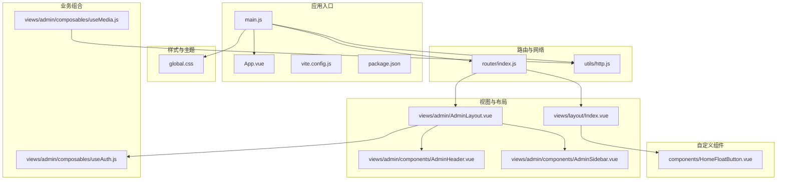
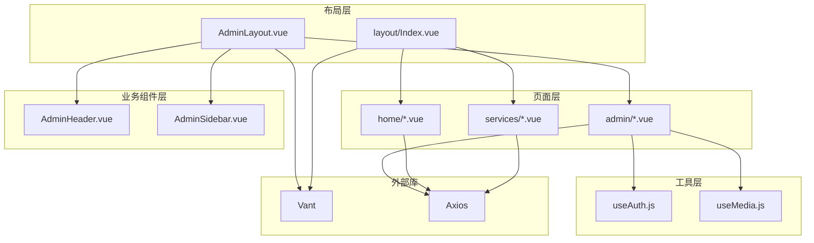
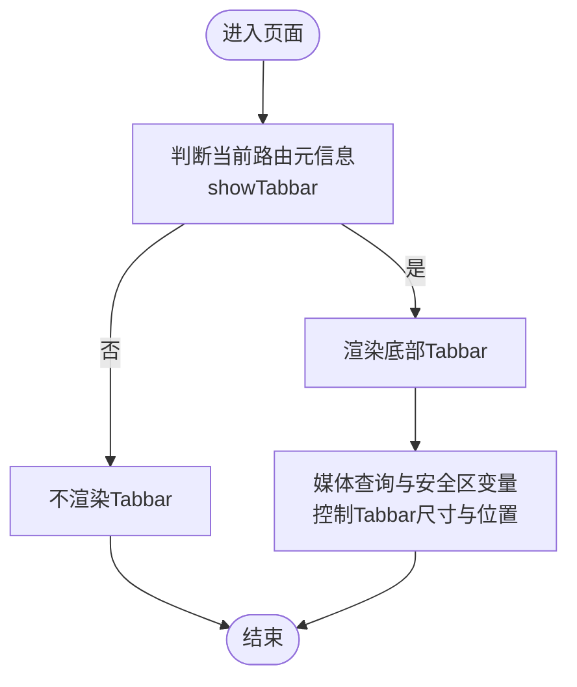
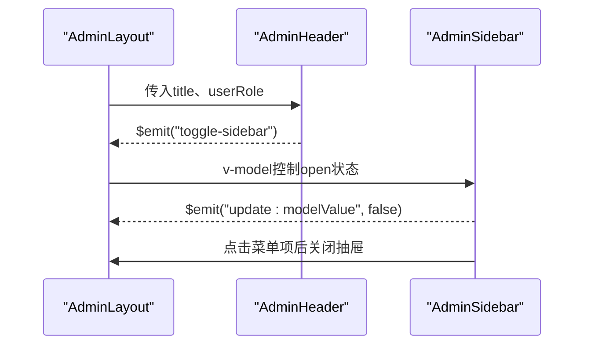
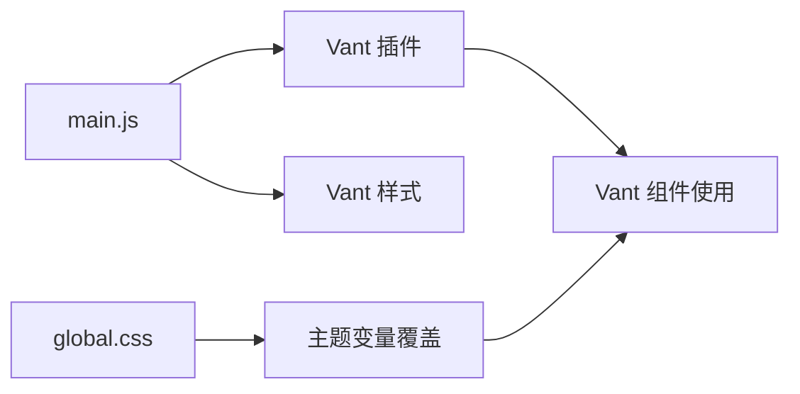
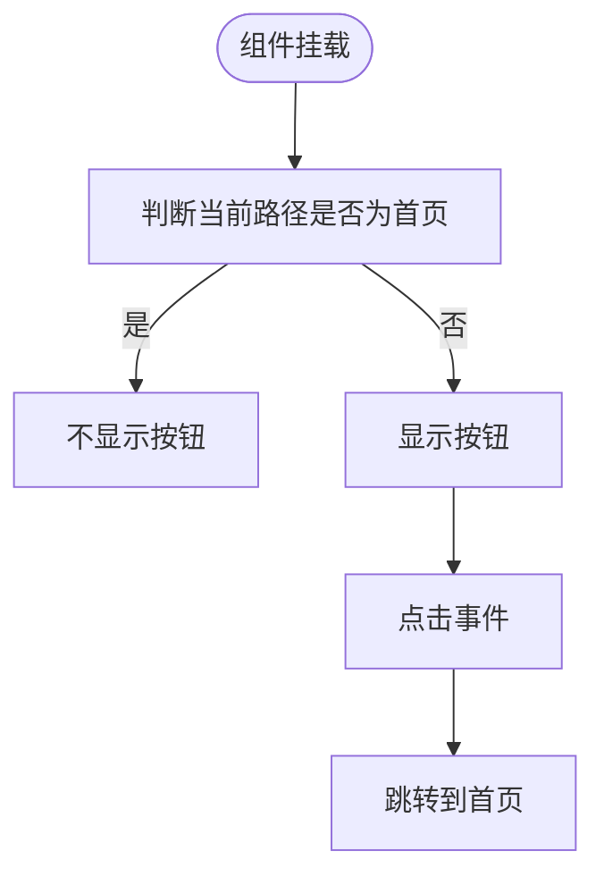
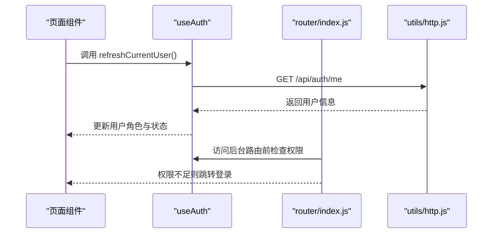
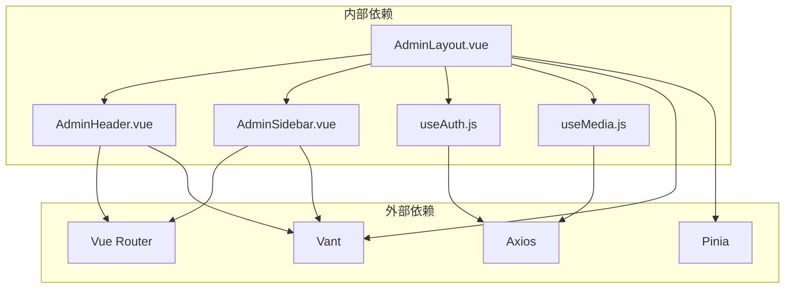

# 组件架构

<cite>
**本文引用的文件**
- [frontend/h5/src/App.vue](file://frontend/h5/src/App.vue)
- [frontend/h5/src/main.js](file://frontend/h5/src/main.js)
- [frontend/h5/package.json](file://frontend/h5/package.json)
- [frontend/h5/vite.config.js](file://frontend/h5/vite.config.js)
- [frontend/h5/src/styles/global.css](file://frontend/h5/src/styles/global.css)
- [frontend/h5/src/router/index.js](file://frontend/h5/src/router/index.js)
- [frontend/h5/src/utils/http.js](file://frontend/h5/src/utils/http.js)
- [frontend/h5/src/views/layout/Index.vue](file://frontend/h5/src/views/layout/Index.vue)
- [frontend/h5/src/views/admin/AdminLayout.vue](file://frontend/h5/src/views/admin/AdminLayout.vue)
- [frontend/h5/src/views/admin/components/AdminHeader.vue](file://frontend/h5/src/views/admin/components/AdminHeader.vue)
- [frontend/h5/src/views/admin/components/AdminSidebar.vue](file://frontend/h5/src/views/admin/components/AdminSidebar.vue)
- [frontend/h5/src/views/admin/composables/useAuth.js](file://frontend/h5/src/views/admin/composables/useAuth.js)
- [frontend/h5/src/views/admin/composables/useMedia.js](file://frontend/h5/src/views/admin/composables/useMedia.js)
- [frontend/h5/src/components/HomeFloatButton.vue](file://frontend/h5/src/components/HomeFloatButton.vue)
</cite>

## 目录
1. [简介](#简介)
2. [项目结构](#项目结构)
3. [核心组件](#核心组件)
4. [架构总览](#架构总览)
5. [组件详解](#组件详解)
6. [依赖关系分析](#依赖关系分析)
7. [性能考量](#性能考量)
8. [故障排查指南](#故障排查指南)
9. [结论](#结论)
10. [附录](#附录)

## 简介
本文件面向低空飞行服务平台的前端组件架构，聚焦以下目标：
- 布局组件设计：响应式布局、网格系统、断点管理
- 业务组件封装：可复用组件、组件通信、事件处理
- UI组件库使用：Vant组件库集成、主题定制、按需加载
- 自定义组件开发：组件规范、Props设计、事件系统
- 生命周期、插槽使用、组件继承与组合模式
- 组件开发最佳实践与性能优化建议

## 项目结构
前端采用Vue 3 + Vite + Pinia + Vue Router技术栈，整体结构清晰，按功能域划分：
- 应用入口与全局配置：App.vue、main.js、vite.config.js、package.json
- 样式与主题：global.css统一变量与基础样式
- 路由与鉴权：router/index.js、utils/http.js
- 视图与布局：views目录下的页面与布局组件
- 业务组合与工具：composables目录下的可复用逻辑
- 自定义组件：components目录下的通用UI组件

**图表来源**
- [frontend/h5/src/App.vue:1-32](file://frontend/h5/src/App.vue#L1-L32)
- [frontend/h5/src/main.js:1-22](file://frontend/h5/src/main.js#L1-L22)
- [frontend/h5/vite.config.js:1-54](file://frontend/h5/vite.config.js#L1-L54)
- [frontend/h5/package.json:1-27](file://frontend/h5/package.json#L1-L27)
- [frontend/h5/src/styles/global.css:1-96](file://frontend/h5/src/styles/global.css#L1-L96)
- [frontend/h5/src/router/index.js:1-227](file://frontend/h5/src/router/index.js#L1-L227)
- [frontend/h5/src/utils/http.js:1-99](file://frontend/h5/src/utils/http.js#L1-L99)
- [frontend/h5/src/views/layout/Index.vue:1-83](file://frontend/h5/src/views/layout/Index.vue#L1-L83)
- [frontend/h5/src/views/admin/AdminLayout.vue:1-85](file://frontend/h5/src/views/admin/AdminLayout.vue#L1-L85)
- [frontend/h5/src/views/admin/components/AdminHeader.vue:1-109](file://frontend/h5/src/views/admin/components/AdminHeader.vue#L1-L109)
- [frontend/h5/src/views/admin/components/AdminSidebar.vue:1-175](file://frontend/h5/src/views/admin/components/AdminSidebar.vue#L1-L175)
- [frontend/h5/src/views/admin/composables/useAuth.js:1-45](file://frontend/h5/src/views/admin/composables/useAuth.js#L1-L45)
- [frontend/h5/src/views/admin/composables/useMedia.js:1-65](file://frontend/h5/src/views/admin/composables/useMedia.js#L1-L65)
- [frontend/h5/src/components/HomeFloatButton.vue:1-53](file://frontend/h5/src/components/HomeFloatButton.vue#L1-L53)

**章节来源**
- [frontend/h5/src/App.vue:1-32](file://frontend/h5/src/App.vue#L1-L32)
- [frontend/h5/src/main.js:1-22](file://frontend/h5/src/main.js#L1-L22)
- [frontend/h5/vite.config.js:1-54](file://frontend/h5/vite.config.js#L1-L54)
- [frontend/h5/package.json:1-27](file://frontend/h5/package.json#L1-L27)
- [frontend/h5/src/styles/global.css:1-96](file://frontend/h5/src/styles/global.css#L1-L96)
- [frontend/h5/src/router/index.js:1-227](file://frontend/h5/src/router/index.js#L1-L227)
- [frontend/h5/src/utils/http.js:1-99](file://frontend/h5/src/utils/http.js#L1-L99)

## 核心组件
- 应用根组件：通过App.vue包裹router-view并添加过渡动画，确保页面切换的流畅性。
- 应用启动器：main.js中注册Pinia、Router、Vant，并挂载应用。
- 主题与全局样式：global.css定义CSS变量与通用容器、卡片等样式，支撑全站风格一致。
- 路由守卫：router/index.js集中处理标题设置、SSO登录、后台管理权限校验。
- 网络拦截：utils/http.js统一注入Authorization头、处理401刷新令牌、并发请求队列。

**章节来源**
- [frontend/h5/src/App.vue:1-32](file://frontend/h5/src/App.vue#L1-L32)
- [frontend/h5/src/main.js:1-22](file://frontend/h5/src/main.js#L1-L22)
- [frontend/h5/src/styles/global.css:1-96](file://frontend/h5/src/styles/global.css#L1-L96)
- [frontend/h5/src/router/index.js:155-223](file://frontend/h5/src/router/index.js#L155-L223)
- [frontend/h5/src/utils/http.js:19-78](file://frontend/h5/src/utils/http.js#L19-L78)

## 架构总览
平台采用“布局-页面-业务组件-工具函数”的分层架构：
- 布局层：AdminLayout、Index.vue提供后台与前台的统一布局骨架
- 页面层：各功能模块的Index.vue作为页面容器
- 业务组件层：AdminHeader、AdminSidebar等可复用UI组件
- 工具层：useAuth、useMedia等组合式函数封装业务逻辑
- 外部库：Vant提供UI能力，Axios负责HTTP请求

**图表来源**
- [frontend/h5/src/views/admin/AdminLayout.vue:1-85](file://frontend/h5/src/views/admin/AdminLayout.vue#L1-L85)
- [frontend/h5/src/views/layout/Index.vue:1-83](file://frontend/h5/src/views/layout/Index.vue#L1-L83)
- [frontend/h5/src/views/admin/components/AdminHeader.vue:1-109](file://frontend/h5/src/views/admin/components/AdminHeader.vue#L1-L109)
- [frontend/h5/src/views/admin/components/AdminSidebar.vue:1-175](file://frontend/h5/src/views/admin/components/AdminSidebar.vue#L1-L175)
- [frontend/h5/src/views/admin/composables/useAuth.js:1-45](file://frontend/h5/src/views/admin/composables/useAuth.js#L1-L45)
- [frontend/h5/src/views/admin/composables/useMedia.js:1-65](file://frontend/h5/src/views/admin/composables/useMedia.js#L1-L65)
- [frontend/h5/src/router/index.js:1-227](file://frontend/h5/src/router/index.js#L1-L227)
- [frontend/h5/src/utils/http.js:1-99](file://frontend/h5/src/utils/http.js#L1-L99)

## 组件详解

### 响应式布局与断点管理
- 设计要点
  - 使用CSS变量统一控制最大宽度、侧边栏宽度、Tabbar高度等，便于主题定制与跨端适配。
  - 在AdminLayout与AdminSidebar中针对移动端与桌面端分别设置布局偏移与显示策略。
  - layout/Index.vue中的Tabbar通过媒体查询与安全区变量保证在不同设备上的可用性。
- 关键实现位置
  - 布局变量与容器：global.css
  - 后台布局与侧边栏：AdminLayout.vue、AdminSidebar.vue
  - 移动端Tabbar：layout/Index.vue

**图表来源**
- [frontend/h5/src/views/layout/Index.vue:42-47](file://frontend/h5/src/views/layout/Index.vue#L42-L47)
- [frontend/h5/src/views/layout/Index.vue:56-80](file://frontend/h5/src/views/layout/Index.vue#L56-L80)
- [frontend/h5/src/styles/global.css:46-50](file://frontend/h5/src/styles/global.css#L46-L50)

**章节来源**
- [frontend/h5/src/styles/global.css:17-50](file://frontend/h5/src/styles/global.css#L17-L50)
- [frontend/h5/src/views/admin/AdminLayout.vue:71-83](file://frontend/h5/src/views/admin/AdminLayout.vue#L71-L83)
- [frontend/h5/src/views/admin/components/AdminSidebar.vue:158-173](file://frontend/h5/src/views/admin/components/AdminSidebar.vue#L158-L173)
- [frontend/h5/src/views/layout/Index.vue:42-80](file://frontend/h5/src/views/layout/Index.vue#L42-L80)

### 业务组件封装：AdminHeader 与 AdminSidebar
- 组件职责
  - AdminHeader：展示页面标题、用户信息；通过事件向父组件传递侧边栏开关指令。
  - AdminSidebar：根据用户角色动态生成菜单项；移动端以抽屉形式呈现，支持遮罩层与过渡动画。
- Props与事件
  - AdminHeader：接收title、userRole；触发toggle-sidebar
  - AdminSidebar：接收modelValue、isAdmin、isDslAdmin、isStudyAdmin；触发update:modelValue
- 通信方式
  - 父子通信：v-model双向绑定控制侧边栏显隐；事件回调更新状态
  - 路由集成：使用router-link进行导航，结合isActive高亮当前项

**图表来源**
- [frontend/h5/src/views/admin/AdminLayout.vue:3-20](file://frontend/h5/src/views/admin/AdminLayout.vue#L3-L20)
- [frontend/h5/src/views/admin/components/AdminHeader.vue:19-34](file://frontend/h5/src/views/admin/components/AdminHeader.vue#L19-L34)
- [frontend/h5/src/views/admin/components/AdminSidebar.vue:37-71](file://frontend/h5/src/views/admin/components/AdminSidebar.vue#L37-L71)

**章节来源**
- [frontend/h5/src/views/admin/components/AdminHeader.vue:1-109](file://frontend/h5/src/views/admin/components/AdminHeader.vue#L1-L109)
- [frontend/h5/src/views/admin/components/AdminSidebar.vue:1-175](file://frontend/h5/src/views/admin/components/AdminSidebar.vue#L1-L175)
- [frontend/h5/src/views/admin/AdminLayout.vue:23-49](file://frontend/h5/src/views/admin/AdminLayout.vue#L23-L49)

### UI组件库使用：Vant集成、主题定制与按需加载
- 集成方式
  - 在main.js中全局引入Vant与样式，确保全站组件可用。
- 主题定制
  - 通过global.css的CSS变量覆盖Vant组件的默认样式，如Tabbar尺寸、图标大小、文字字号等。
- 按需加载
  - 通过Vite插件与构建配置实现代码分割，例如将echarts与vue-echarts打包到独立chunk，减少首屏体积。

**图表来源**
- [frontend/h5/src/main.js:6-18](file://frontend/h5/src/main.js#L6-L18)
- [frontend/h5/src/styles/global.css:56-80](file://frontend/h5/src/styles/global.css#L56-L80)
- [frontend/h5/vite.config.js:25-28](file://frontend/h5/vite.config.js#L25-L28)

**章节来源**
- [frontend/h5/src/main.js:6-18](file://frontend/h5/src/main.js#L6-L18)
- [frontend/h5/src/styles/global.css:56-80](file://frontend/h5/src/styles/global.css#L56-L80)
- [frontend/h5/vite.config.js:22-30](file://frontend/h5/vite.config.js#L22-L30)

### 自定义组件开发：HomeFloatButton
- 设计目标：在非首页时提供“回到首页”的悬浮按钮，提升导航效率。
- 实现要点
  - 通过计算属性判断是否显示；使用路由跳转实现导航。
  - 使用CSS变量与安全区适配，保证在刘海屏/安全区下的正确位置。
- 适用场景：首页以外的页面，需要快速返回首页。

**图表来源**
- [frontend/h5/src/components/HomeFloatButton.vue:7-20](file://frontend/h5/src/components/HomeFloatButton.vue#L7-L20)
- [frontend/h5/src/components/HomeFloatButton.vue:22-50](file://frontend/h5/src/components/HomeFloatButton.vue#L22-L50)

**章节来源**
- [frontend/h5/src/components/HomeFloatButton.vue:1-53](file://frontend/h5/src/components/HomeFloatButton.vue#L1-L53)

### 组合式函数：useAuth 与 useMedia
- useAuth
  - 提供用户角色状态（admin/dsl_admin/study_admin）与权限判断，支持从本地存储或接口刷新当前用户信息。
  - 与路由守卫配合，实现后台管理权限校验。
- useMedia
  - 提供媒体URL标准化与文件上传能力，统一处理相对路径、本地回环地址与跨域问题。
  - 通过Vant Toast提示上传结果，增强用户体验。

**图表来源**
- [frontend/h5/src/views/admin/composables/useAuth.js:17-32](file://frontend/h5/src/views/admin/composables/useAuth.js#L17-L32)
- [frontend/h5/src/router/index.js:184-220](file://frontend/h5/src/router/index.js#L184-L220)
- [frontend/h5/src/utils/http.js:28-78](file://frontend/h5/src/utils/http.js#L28-L78)

**章节来源**
- [frontend/h5/src/views/admin/composables/useAuth.js:1-45](file://frontend/h5/src/views/admin/composables/useAuth.js#L1-L45)
- [frontend/h5/src/views/admin/composables/useMedia.js:1-65](file://frontend/h5/src/views/admin/composables/useMedia.js#L1-L65)
- [frontend/h5/src/router/index.js:155-223](file://frontend/h5/src/router/index.js#L155-L223)
- [frontend/h5/src/utils/http.js:1-99](file://frontend/h5/src/utils/http.js#L1-L99)

### 组件生命周期、插槽与事件
- 生命周期
  - AdminLayout在mounted阶段刷新当前用户信息，确保权限判断准确。
- 插槽
  - layout/Index.vue中使用了Vant Tabbar的插槽用于自定义图标。
- 事件
  - AdminHeader通过$emit触发toggle-sidebar；AdminSidebar通过update:modelValue实现v-model双向绑定。

**章节来源**
- [frontend/h5/src/views/admin/AdminLayout.vue:46-48](file://frontend/h5/src/views/admin/AdminLayout.vue#L46-L48)
- [frontend/h5/src/views/layout/Index.vue:12-36](file://frontend/h5/src/views/layout/Index.vue#L12-L36)
- [frontend/h5/src/views/admin/components/AdminHeader.vue:4-24](file://frontend/h5/src/views/admin/components/AdminHeader.vue#L4-L24)
- [frontend/h5/src/views/admin/components/AdminSidebar.vue:14-44](file://frontend/h5/src/views/admin/components/AdminSidebar.vue#L14-L44)

## 依赖关系分析
- 组件耦合
  - AdminLayout与AdminHeader/AdminSidebar存在父子耦合，通过事件与v-model解耦具体交互细节。
  - 页面组件依赖useAuth与useMedia，形成“页面-组合式函数”的松耦合。
- 外部依赖
  - Vant提供UI基础能力；Axios负责HTTP请求与鉴权；Pinia提供状态管理；Vue Router负责路由与导航。
- 构建优化
  - vite.config.js对echarts与vue-echarts进行手动分包，降低首屏体积。

**图表来源**
- [frontend/h5/src/views/admin/AdminLayout.vue:26-28](file://frontend/h5/src/views/admin/AdminLayout.vue#L26-L28)
- [frontend/h5/src/views/admin/components/AdminHeader.vue:1-109](file://frontend/h5/src/views/admin/components/AdminHeader.vue#L1-L109)
- [frontend/h5/src/views/admin/components/AdminSidebar.vue:1-175](file://frontend/h5/src/views/admin/components/AdminSidebar.vue#L1-L175)
- [frontend/h5/src/views/admin/composables/useAuth.js:1-45](file://frontend/h5/src/views/admin/composables/useAuth.js#L1-L45)
- [frontend/h5/src/views/admin/composables/useMedia.js:1-65](file://frontend/h5/src/views/admin/composables/useMedia.js#L1-L65)
- [frontend/h5/src/router/index.js:1-227](file://frontend/h5/src/router/index.js#L1-L227)
- [frontend/h5/src/utils/http.js:1-99](file://frontend/h5/src/utils/http.js#L1-L99)
- [frontend/h5/src/main.js:1-22](file://frontend/h5/src/main.js#L1-L22)

**章节来源**
- [frontend/h5/src/router/index.js:1-227](file://frontend/h5/src/router/index.js#L1-L227)
- [frontend/h5/src/utils/http.js:1-99](file://frontend/h5/src/utils/http.js#L1-L99)
- [frontend/h5/vite.config.js:22-30](file://frontend/h5/vite.config.js#L22-L30)

## 性能考量
- 代码分割与懒加载
  - 路由级异步加载页面组件，减少初始包体。
  - 手动分包echarts与vue-echarts，避免与主包耦合。
- 请求优化
  - Axios统一注入Authorization头，避免重复设置；401自动刷新令牌并排队重试，减少错误重试成本。
- 样式与主题
  - 使用CSS变量统一主题，减少重复样式与重绘。
- 移动端体验
  - 使用安全区变量与媒体查询，避免内容被刘海/状态栏遮挡。

**章节来源**
- [frontend/h5/src/router/index.js:15-147](file://frontend/h5/src/router/index.js#L15-L147)
- [frontend/h5/vite.config.js:22-30](file://frontend/h5/vite.config.js#L22-L30)
- [frontend/h5/src/utils/http.js:19-78](file://frontend/h5/src/utils/http.js#L19-L78)
- [frontend/h5/src/styles/global.css:17-50](file://frontend/h5/src/styles/global.css#L17-L50)

## 故障排查指南
- 登录与权限
  - 若访问后台路由被重定向至登录页，检查本地存储中的用户信息与令牌是否存在；确认useAuth刷新流程是否成功。
- 图片上传
  - 若上传失败或返回相对路径异常，检查useMedia.normalizeMediaUrl逻辑与useMedia.uploadFile的返回值。
- 路由跳转
  - 若Tabbar点击无效，检查router-link与路由meta配置；确认showTabbar条件是否满足。
- 样式异常
  - 若布局错位或按钮位置异常，检查global.css中的CSS变量与媒体查询规则。

**章节来源**
- [frontend/h5/src/router/index.js:155-223](file://frontend/h5/src/router/index.js#L155-L223)
- [frontend/h5/src/views/admin/composables/useMedia.js:7-34](file://frontend/h5/src/views/admin/composables/useMedia.js#L7-L34)
- [frontend/h5/src/views/layout/Index.vue:42-47](file://frontend/h5/src/views/layout/Index.vue#L42-L47)
- [frontend/h5/src/styles/global.css:46-50](file://frontend/h5/src/styles/global.css#L46-L50)

## 结论
本组件架构以Vue 3为核心，结合Vant、Axios、Pinia与Vue Router，实现了清晰的布局分层、可复用的业务组件与完善的权限与网络拦截机制。通过CSS变量与媒体查询实现跨端适配，借助Vite的分包策略优化首屏性能。推荐在后续迭代中持续沉淀组合式函数、完善单元测试与组件文档，进一步提升可维护性与扩展性。

## 附录
- 最佳实践清单
  - 将通用逻辑抽象为组合式函数，减少重复代码
  - 使用CSS变量统一主题，避免硬编码颜色与尺寸
  - 对大资源（如图表）采用懒加载与分包策略
  - 严格定义Props类型与默认值，明确事件命名规范
  - 在移动端充分考虑安全区与手势操作的可用性