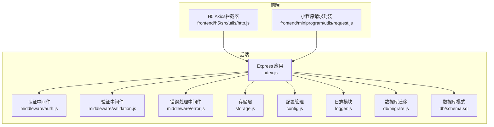
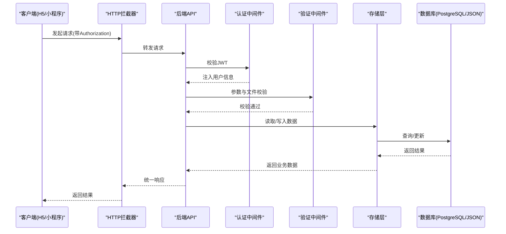
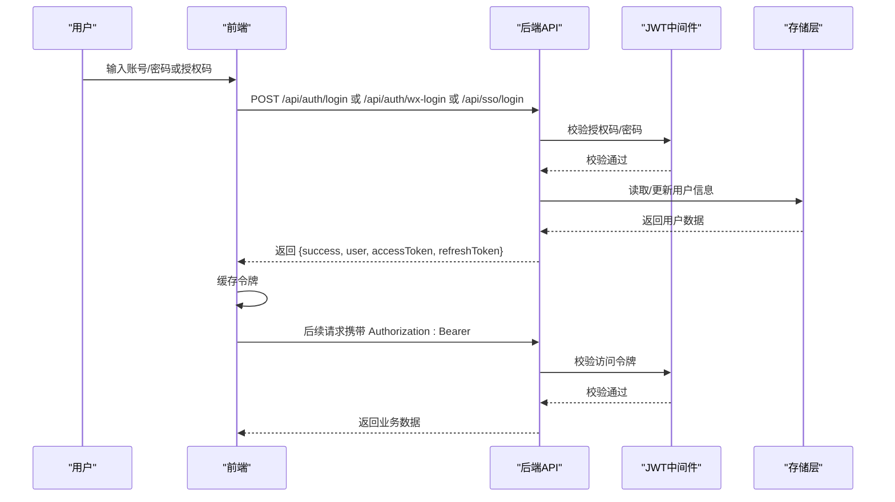
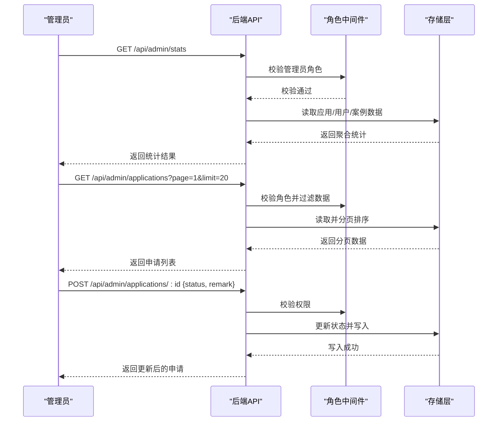
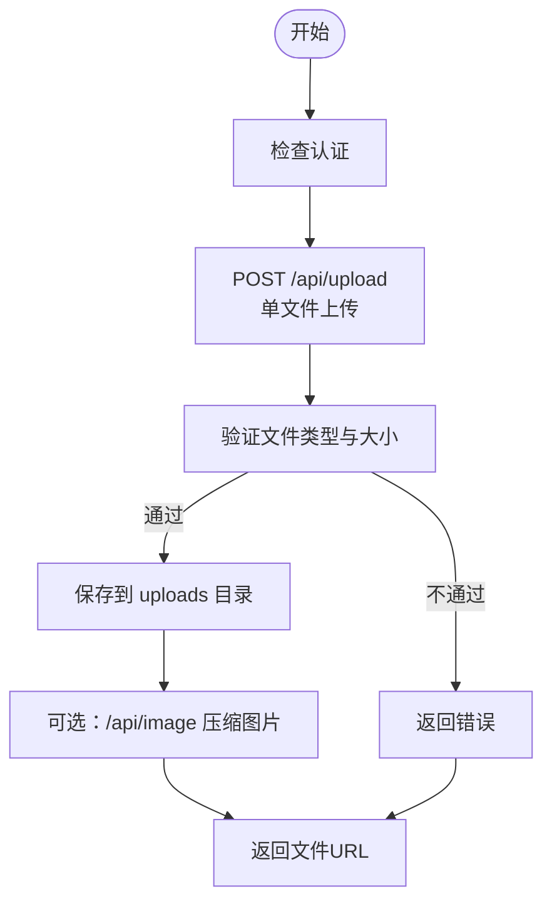
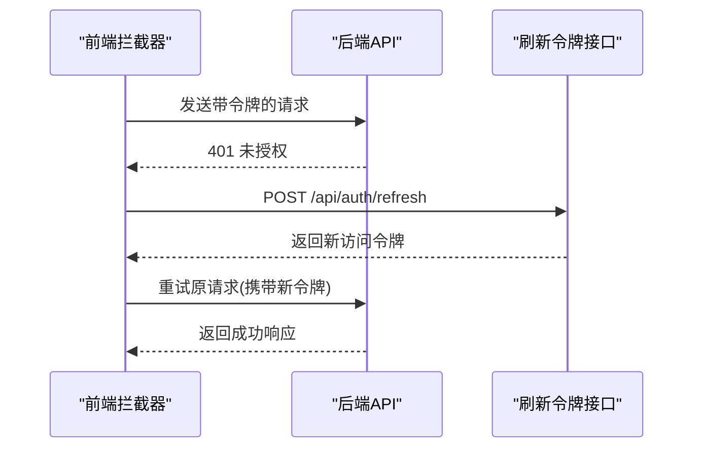
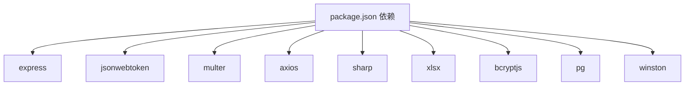

# API文档模板

<cite>
**本文档引用的文件**
- [backend/index.js](file://backend/index.js)
- [backend/routes/auth.js](file://backend/routes/auth.js)
- [backend/routes/admin.js](file://backend/routes/admin.js)
- [backend/middleware/auth.js](file://backend/middleware/auth.js)
- [backend/middleware/validation.js](file://backend/middleware/validation.js)
- [backend/middleware/error.js](file://backend/middleware/error.js)
- [backend/storage.js](file://backend/storage.js)
- [backend/config.js](file://backend/config.js)
- [backend/db/schema.sql](file://backend/db/schema.sql)
- [backend/db/migrate.js](file://backend/db/migrate.js)
- [backend/logger.js](file://backend/logger.js)
- [backend/package.json](file://backend/package.json)
- [docs/接入文档/Apifox使用说明.md](file://docs/接入文档/Apifox使用说明.md)
- [frontend/h5/src/utils/http.js](file://frontend/h5/src/utils/http.js)
- [frontend/miniprogram/utils/request.js](file://frontend/miniprogram/utils/request.js)
</cite>

## 目录
1. [简介](#简介)
2. [项目结构](#项目结构)
3. [核心组件](#核心组件)
4. [架构总览](#架构总览)
5. [详细组件分析](#详细组件分析)
6. [依赖关系分析](#依赖关系分析)
7. [性能考虑](#性能考虑)
8. [故障排除指南](#故障排除指南)
9. [结论](#结论)
10. [附录](#附录)

## 简介
本指南旨在为低空飞行服务平台提供一套标准化的API文档模板与最佳实践，涵盖接口概述、请求与响应示例、错误码说明、参数与返回值定义、维护策略、版本管理与变更记录，并结合项目现有实现，给出用户管理、服务申请、文件上传等核心功能的完整示例文档。同时，说明如何使用工具生成API文档、进行自动化测试与文档同步，以及如何优化API文档的可读性、国际化支持与多端适配。

## 项目结构
后端采用Express框架，按功能模块划分路由与中间件，统一通过中间件进行认证、鉴权、输入验证与错误处理。前端分别提供H5与小程序两套实现，均通过拦截器自动处理令牌刷新与重试逻辑。

**图表来源**
- [backend/index.js:1-120](file://backend/index.js#L1-L120)
- [backend/middleware/auth.js:1-168](file://backend/middleware/auth.js#L1-L168)
- [backend/middleware/validation.js:1-192](file://backend/middleware/validation.js#L1-L192)
- [backend/middleware/error.js:1-90](file://backend/middleware/error.js#L1-L90)
- [backend/storage.js:1-197](file://backend/storage.js#L1-L197)
- [backend/config.js:1-123](file://backend/config.js#L1-L123)
- [backend/db/migrate.js:1-62](file://backend/db/migrate.js#L1-L62)
- [backend/db/schema.sql:1-10](file://backend/db/schema.sql#L1-L10)
- [frontend/h5/src/utils/http.js:1-99](file://frontend/h5/src/utils/http.js#L1-L99)
- [frontend/miniprogram/utils/request.js:1-144](file://frontend/miniprogram/utils/request.js#L1-L144)

**章节来源**
- [backend/index.js:1-120](file://backend/index.js#L1-L120)
- [backend/package.json:1-34](file://backend/package.json#L1-L34)

## 核心组件
- 认证与权限中间件：提供JWT校验、角色校验、可选认证与基础速率限制。
- 输入验证与消毒：对请求体、查询参数、文件上传进行格式与安全校验。
- 错误处理：统一错误响应格式，区分开发与生产环境。
- 存储层：支持JSON文件与PostgreSQL两种存储后端，内置缓存与迁移工具。
- 配置管理：集中管理JWT、微信、数据库、上传、服务器等配置。
- 日志模块：结构化日志记录，便于审计与问题排查。
- 前端拦截器：H5与小程序分别实现请求头注入、401自动刷新令牌与队列重试。

**章节来源**
- [backend/middleware/auth.js:1-168](file://backend/middleware/auth.js#L1-L168)
- [backend/middleware/validation.js:1-192](file://backend/middleware/validation.js#L1-L192)
- [backend/middleware/error.js:1-90](file://backend/middleware/error.js#L1-L90)
- [backend/storage.js:1-197](file://backend/storage.js#L1-L197)
- [backend/config.js:1-123](file://backend/config.js#L1-L123)
- [backend/logger.js:1-104](file://backend/logger.js#L1-L104)
- [frontend/h5/src/utils/http.js:1-99](file://frontend/h5/src/utils/http.js#L1-L99)
- [frontend/miniprogram/utils/request.js:1-144](file://frontend/miniprogram/utils/request.js#L1-L144)

## 架构总览
下图展示了从客户端到后端的典型调用链路，包括认证、鉴权、业务处理与存储层交互。

**图表来源**
- [backend/middleware/auth.js:11-45](file://backend/middleware/auth.js#L11-L45)
- [backend/middleware/validation.js:52-98](file://backend/middleware/validation.js#L52-L98)
- [backend/storage.js:134-181](file://backend/storage.js#L134-L181)
- [backend/db/schema.sql:1-10](file://backend/db/schema.sql#L1-L10)

## 详细组件分析

### 用户认证与授权流程
用户通过多种方式登录（账号密码、微信小程序、微信公众号、SSO），系统生成访问令牌与刷新令牌，并在过期时通过刷新令牌换取新令牌。

**图表来源**
- [backend/routes/auth.js:96-147](file://backend/routes/auth.js#L96-L147)
- [backend/routes/auth.js:513-588](file://backend/routes/auth.js#L513-L588)
- [backend/routes/auth.js:322-392](file://backend/routes/auth.js#L322-L392)
- [backend/middleware/auth.js:11-45](file://backend/middleware/auth.js#L11-L45)
- [backend/storage.js:134-142](file://backend/storage.js#L134-L142)

**章节来源**
- [backend/routes/auth.js:96-147](file://backend/routes/auth.js#L96-L147)
- [backend/routes/auth.js:513-588](file://backend/routes/auth.js#L513-L588)
- [backend/routes/auth.js:322-392](file://backend/routes/auth.js#L322-L392)
- [backend/middleware/auth.js:11-45](file://backend/middleware/auth.js#L11-L45)

### 管理员功能与数据导出
管理员可查看统计、管理申请、导出Excel、管理用户与服务配置等。系统根据角色过滤数据并进行权限控制。

**图表来源**
- [backend/routes/admin.js:29-61](file://backend/routes/admin.js#L29-L61)
- [backend/routes/admin.js:66-111](file://backend/routes/admin.js#L66-L111)
- [backend/routes/admin.js:116-166](file://backend/routes/admin.js#L116-L166)
- [backend/middleware/auth.js:50-75](file://backend/middleware/auth.js#L50-L75)
- [backend/storage.js:154-162](file://backend/storage.js#L154-L162)

**章节来源**
- [backend/routes/admin.js:29-61](file://backend/routes/admin.js#L29-L61)
- [backend/routes/admin.js:66-111](file://backend/routes/admin.js#L66-L111)
- [backend/routes/admin.js:116-166](file://backend/routes/admin.js#L116-L166)
- [backend/middleware/auth.js:50-75](file://backend/middleware/auth.js#L50-L75)

### 文件上传与图片压缩
系统支持单文件上传与图片压缩，提供统一的上传接口与安全校验。

**图表来源**
- [backend/index.js:278-285](file://backend/index.js#L278-L285)
- [backend/index.js:86-114](file://backend/index.js#L86-L114)
- [backend/middleware/validation.js:154-180](file://backend/middleware/validation.js#L154-L180)

**章节来源**
- [backend/index.js:278-285](file://backend/index.js#L278-L285)
- [backend/index.js:86-114](file://backend/index.js#L86-L114)
- [backend/middleware/validation.js:154-180](file://backend/middleware/validation.js#L154-L180)

### 前端令牌刷新与重试机制
H5与小程序均实现了统一的拦截器，自动处理401未授权并刷新令牌，支持并发请求排队与重试。

**图表来源**
- [frontend/h5/src/utils/http.js:28-78](file://frontend/h5/src/utils/http.js#L28-L78)
- [frontend/miniprogram/utils/request.js:36-134](file://frontend/miniprogram/utils/request.js#L36-L134)

**章节来源**
- [frontend/h5/src/utils/http.js:28-78](file://frontend/h5/src/utils/http.js#L28-L78)
- [frontend/miniprogram/utils/request.js:36-134](file://frontend/miniprogram/utils/request.js#L36-L134)

## 依赖关系分析
后端主要依赖Express、JWT、Multer、Axios、Sharp、XLSX、Winston等库；前端H5使用Axios，小程序使用uni.request与本地存储。

**图表来源**
- [backend/package.json:12-29](file://backend/package.json#L12-L29)

**章节来源**
- [backend/package.json:12-29](file://backend/package.json#L12-L29)

## 性能考虑
- 缓存策略：存储层对用户、案例、申请、服务配置、评价等数据设置不同缓存过期时间，减少数据库压力。
- 图片压缩：提供在线图片压缩接口，支持宽高与质量参数，失败时回退原图并设置缓存头。
- 速率限制：基于IP的简单窗口计数实现，防止暴力破解与滥用。
- 数据库迁移：提供JSON到PostgreSQL的迁移脚本，支持大体量数据平滑过渡。

**章节来源**
- [backend/storage.js:134-181](file://backend/storage.js#L134-L181)
- [backend/index.js:86-114](file://backend/index.js#L86-L114)
- [backend/middleware/auth.js:108-143](file://backend/middleware/auth.js#L108-L143)
- [backend/db/migrate.js:35-55](file://backend/db/migrate.js#L35-L55)

## 故障排除指南
- 401未认证/令牌过期：检查Authorization头、刷新令牌是否有效，确认JWT密钥与TTL配置。
- 403权限不足：确认用户角色与接口所需角色匹配。
- 400参数错误：检查必填字段、查询参数类型与范围、文件类型与大小。
- 429请求过于频繁：降低请求频率或调整速率限制配置。
- 500服务器错误：查看日志文件定位具体错误堆栈与上下文。

**章节来源**
- [backend/middleware/error.js:9-62](file://backend/middleware/error.js#L9-L62)
- [backend/middleware/auth.js:11-45](file://backend/middleware/auth.js#L11-L45)
- [backend/middleware/validation.js:103-149](file://backend/middleware/validation.js#L103-L149)
- [backend/logger.js:86-94](file://backend/logger.js#L86-L94)

## 结论
本模板基于项目现有实现，提供了标准化的API文档编写规范与最佳实践。通过统一的认证、验证、错误处理与存储层设计，配合前端拦截器的令牌刷新机制，能够支撑用户管理、服务申请、文件上传等核心业务场景。建议在实际落地时，结合团队规范补充版本管理与变更记录，并持续优化可读性与多端适配。

## 附录

### API文档模板结构
- 接口概述
  - 标题与描述
  - 请求方法与路径
  - 权限要求与适用端
- 请求参数
  - 路径参数、查询参数、请求体字段说明（类型、必填、默认值、取值范围）
- 请求示例
  - 完整请求URL、Headers、Body
- 响应示例
  - 成功与失败响应结构
- 错误码说明
  - HTTP状态码与业务success字段组合
  - 常见错误与解决方案
- 版本管理与变更记录
  - 版本号、生效日期、变更内容、影响范围
- 维护策略
  - 文档同步、自动化测试、发布流程

### 核心功能示例：用户管理
- 登录
  - 方法：POST
  - 路径：/api/auth/login
  - 权限：匿名
  - 请求体：{ phone/username, password }
  - 响应：{ success, user, accessToken, refreshToken }
- 刷新令牌
  - 方法：POST
  - 路径：/api/auth/refresh
  - 权限：需携带refreshToken
  - 响应：{ success, accessToken }
- 微信登录
  - 方法：POST
  - 路径：/api/auth/wx-login
  - 权限：匿名
  - 请求体：{ code }
  - 响应：{ success, user, isNewUser, accessToken, refreshToken }

**章节来源**
- [backend/routes/auth.js:96-147](file://backend/routes/auth.js#L96-L147)
- [backend/routes/auth.js:230-294](file://backend/routes/auth.js#L230-L294)
- [backend/routes/auth.js:513-588](file://backend/routes/auth.js#L513-L588)

### 核心功能示例：服务申请
- 获取申请列表
  - 方法：GET
  - 路径：/api/admin/applications
  - 权限：管理员
  - 查询参数：page, limit, status, serviceId
  - 响应：分页数据与统计信息
- 更新申请状态
  - 方法：POST
  - 路径：/api/admin/applications/:id
  - 权限：管理员
  - 请求体：{ status, remark }
  - 响应：更新后的申请数据

**章节来源**
- [backend/routes/admin.js:66-111](file://backend/routes/admin.js#L66-L111)
- [backend/routes/admin.js:116-166](file://backend/routes/admin.js#L116-L166)

### 核心功能示例：文件上传
- 上传文件
  - 方法：POST
  - 路径：/api/upload
  - 权限：认证用户
  - 表单字段：file
  - 响应：{ success, url }
- 图片压缩
  - 方法：GET
  - 路径：/api/image?url=&width=&quality=
  - 响应：压缩后的图片流

**章节来源**
- [backend/index.js:278-285](file://backend/index.js#L278-L285)
- [backend/index.js:86-114](file://backend/index.js#L86-L114)

### 工具与自动化
- Apifox使用说明：提供参数生成、请求构建与导入集合的步骤，便于联调与测试。
- 建议：将API文档与测试用例纳入CI/CD，确保文档与代码同步更新。

**章节来源**
- [docs/接入文档/Apifox使用说明.md:1-69](file://docs/接入文档/Apifox使用说明.md#L1-L69)

### 可读性优化、国际化与多端适配
- 可读性：统一字段命名、示例数据、错误提示文案；保持前后端一致的响应结构。
- 国际化：在配置中预留多语言键值，前端按语言切换显示。
- 多端适配：H5与小程序共享同一后端接口，通过各自拦截器处理令牌与错误。

**章节来源**
- [frontend/h5/src/utils/http.js:19-78](file://frontend/h5/src/utils/http.js#L19-L78)
- [frontend/miniprogram/utils/request.js:59-134](file://frontend/miniprogram/utils/request.js#L59-L134)