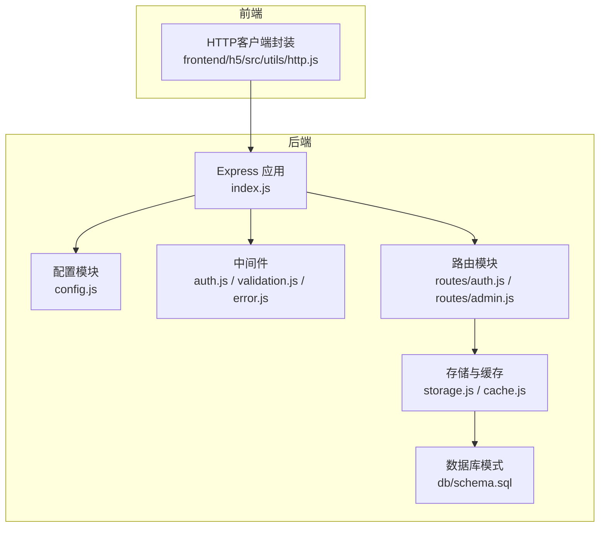
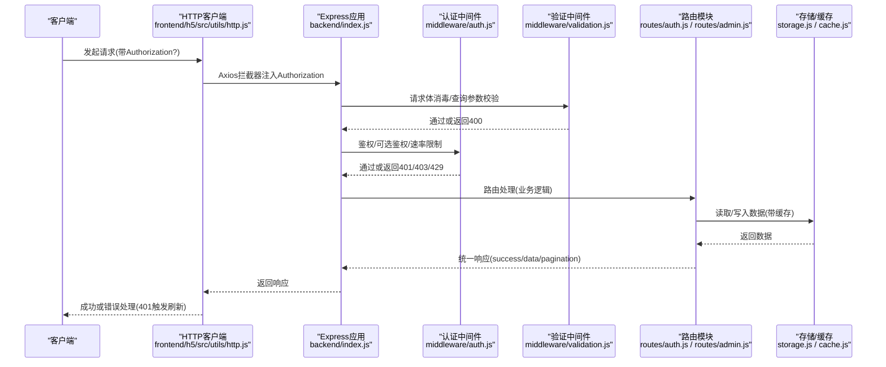
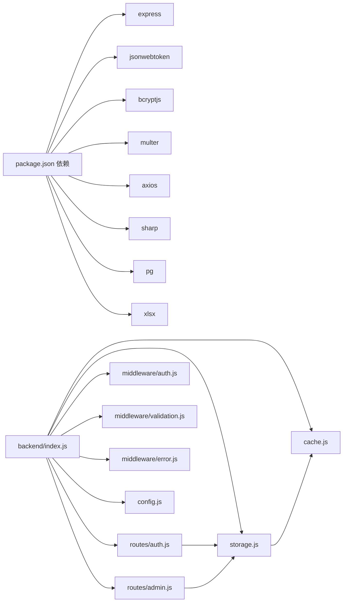

# RESTful API设计规范

<cite>
**本文引用的文件**
- [backend/index.js](file://backend/index.js)
- [backend/routes/auth.js](file://backend/routes/auth.js)
- [backend/routes/admin.js](file://backend/routes/admin.js)
- [backend/middleware/auth.js](file://backend/middleware/auth.js)
- [backend/middleware/error.js](file://backend/middleware/error.js)
- [backend/middleware/validation.js](file://backend/middleware/validation.js)
- [backend/storage.js](file://backend/storage.js)
- [backend/cache.js](file://backend/cache.js)
- [backend/config.js](file://backend/config.js)
- [backend/db/schema.sql](file://backend/db/schema.sql)
- [backend/package.json](file://backend/package.json)
- [frontend/h5/src/utils/http.js](file://frontend/h5/src/utils/http.js)
- [backend/OPTIMIZATION_SUMMARY.md](file://backend/OPTIMIZATION_SUMMARY.md)
- [backend/QUICK_REFERENCE.md](file://backend/QUICK_REFERENCE.md)
</cite>

## 目录
1. [简介](#简介)
2. [项目结构](#项目结构)
3. [核心组件](#核心组件)
4. [架构总览](#架构总览)
5. [详细组件分析](#详细组件分析)
6. [依赖关系分析](#依赖关系分析)
7. [性能考量](#性能考量)
8. [故障排查指南](#故障排查指南)
9. [结论](#结论)
10. [附录](#附录)

## 简介
本规范基于现有代码库，总结了平台后端在RESTful API设计上的实践与约定，包括HTTP方法使用、URL路径设计、资源命名、状态码使用、版本管理策略、内容协商、分页查询、请求/响应格式、参数传递、错误响应统一格式、安全与性能优化、可扩展性设计，并给出与Express.js框架的集成方式与最佳实践。

## 项目结构
后端采用Express.js作为Web框架，按职责拆分为配置、中间件、路由、存储与缓存、数据库等模块；前端通过Axios进行HTTP请求并与后端约定统一的鉴权与错误处理流程。

**图表来源**
- [backend/index.js:1-120](file://backend/index.js#L1-L120)
- [backend/config.js:1-123](file://backend/config.js#L1-L123)
- [backend/middleware/auth.js:1-168](file://backend/middleware/auth.js#L1-L168)
- [backend/middleware/validation.js:1-192](file://backend/middleware/validation.js#L1-L192)
- [backend/middleware/error.js:1-90](file://backend/middleware/error.js#L1-L90)
- [backend/routes/auth.js:1-591](file://backend/routes/auth.js#L1-L591)
- [backend/routes/admin.js:1-514](file://backend/routes/admin.js#L1-L514)
- [backend/storage.js:1-197](file://backend/storage.js#L1-L197)
- [backend/cache.js:1-119](file://backend/cache.js#L1-L119)
- [backend/db/schema.sql:1-10](file://backend/db/schema.sql#L1-L10)
- [frontend/h5/src/utils/http.js:1-99](file://frontend/h5/src/utils/http.js#L1-L99)

**章节来源**
- [backend/index.js:1-120](file://backend/index.js#L1-L120)
- [backend/package.json:1-34](file://backend/package.json#L1-L34)

## 核心组件
- Express应用与中间件链：CORS、Body解析、输入消毒、静态资源、请求日志、错误处理、404处理。
- 认证与权限：JWT鉴权、可选认证、角色校验、速率限制。
- 输入验证与消毒：请求体消毒、必填字段校验、查询参数校验、文件上传校验。
- 路由模块：认证路由、管理路由（仪表板、申请、用户、服务配置、评价、导出）。
- 存储与缓存：JSON文件/PostgreSQL双栈存储，内存缓存与键空间管理。
- 配置管理：集中管理JWT、微信、SSO、数据库、上传、服务器等配置。
- 前端HTTP封装：统一注入Authorization头、401自动刷新令牌、队列化并发刷新。

**章节来源**
- [backend/index.js:71-128](file://backend/index.js#L71-L128)
- [backend/middleware/auth.js:11-168](file://backend/middleware/auth.js#L11-L168)
- [backend/middleware/validation.js:52-192](file://backend/middleware/validation.js#L52-L192)
- [backend/routes/auth.js:96-317](file://backend/routes/auth.js#L96-L317)
- [backend/routes/admin.js:29-514](file://backend/routes/admin.js#L29-L514)
- [backend/storage.js:42-197](file://backend/storage.js#L42-L197)
- [backend/cache.js:5-119](file://backend/cache.js#L5-L119)
- [backend/config.js:78-123](file://backend/config.js#L78-L123)
- [frontend/h5/src/utils/http.js:19-95](file://frontend/h5/src/utils/http.js#L19-L95)

## 架构总览
下图展示了从浏览器到后端的典型请求流程，包括鉴权、速率限制、输入验证、业务处理与响应返回。

**图表来源**
- [frontend/h5/src/utils/http.js:19-78](file://frontend/h5/src/utils/http.js#L19-L78)
- [backend/index.js:71-128](file://backend/index.js#L71-L128)
- [backend/middleware/auth.js:11-168](file://backend/middleware/auth.js#L11-L168)
- [backend/middleware/validation.js:52-192](file://backend/middleware/validation.js#L52-L192)
- [backend/routes/auth.js:96-317](file://backend/routes/auth.js#L96-L317)
- [backend/routes/admin.js:66-111](file://backend/routes/admin.js#L66-L111)
- [backend/storage.js:134-181](file://backend/storage.js#L134-L181)

## 详细组件分析

### HTTP方法与URL路径设计
- 方法使用
  - GET：查询资源列表或详情（如获取仪表板统计、申请列表、用户列表、服务配置、评价列表）。
  - POST：创建资源或执行动作（如登录、注册、刷新令牌、登出、SSO登录、微信登录、导出Excel、更新申请状态、更新用户角色、更新服务配置、更新研学展示数据、审核评价、删除评价）。
  - DELETE：删除资源（如删除评价）。
- URL路径设计
  - 采用层次化资源路径，如 /api/auth/*、/api/admin/*。
  - 资源名词使用复数形式，如 /api/admin/applications、/api/admin/users、/api/admin/reviews。
  - 动作使用子路径表达，如 /api/auth/refresh、/api/admin/applications/:id、/api/admin/users/:id/role。
- 资源命名约定
  - 资源名统一使用英文复数，如 applications、users、reviews、services_config。
  - 服务配置按服务ID组织，如 services_config 中以服务ID为键。
- 状态码使用规范
  - 成功：200 OK；创建：201 Created；无内容：204 No Content。
  - 客户端错误：400 Bad Request（参数/输入错误）、401 Unauthorized（未认证/令牌无效/过期）、403 Forbidden（权限不足）、404 Not Found（资源不存在）、429 Too Many Requests（频率限制）。
  - 服务器错误：500 Internal Server Error（通用错误）。
- 分页查询规范
  - 查询参数：page（>=1）、limit（1~100）、status、serviceId、section、remark等。
  - 响应包含：success、data、pagination（page、limit、total、totalPages）。
  - 示例：/api/admin/applications?page=1&limit=20&status=待处理

**章节来源**
- [backend/routes/admin.js:66-111](file://backend/routes/admin.js#L66-L111)
- [backend/routes/admin.js:409-437](file://backend/routes/admin.js#L409-L437)
- [backend/middleware/error.js:9-62](file://backend/middleware/error.js#L9-L62)
- [backend/middleware/auth.js:108-143](file://backend/middleware/auth.js#L108-L143)

### 请求/响应格式标准化
- 统一响应结构
  - 成功：{ success: true, data: ..., pagination?: ... }
  - 失败：{ success: false, message: "...", errors?: [...], code?: "..." }
- 请求体消毒
  - 对字符串字段移除<script>、事件属性、javascript:协议，去除首尾空白。
  - 支持嵌套对象与数组递归消毒。
- 查询参数校验
  - 支持类型(number/string)、范围(min/max)、枚举(enum)、长度(maxLength)、必填(required)。
- 文件上传校验
  - 校验MIME类型与大小，超出限制返回400。

**章节来源**
- [backend/middleware/validation.js:52-192](file://backend/middleware/validation.js#L52-L192)
- [backend/middleware/error.js:9-62](file://backend/middleware/error.js#L9-L62)

### 参数传递最佳实践
- 必填字段：使用 requireFields 指定必填项，缺失时返回400。
- 查询参数：使用 validateQuery 定义schema，自动校验并转换类型。
- 路径参数：在路由定义中使用 :id 等占位符，配合业务逻辑校验存在性与权限。
- 文件上传：结合 multer 与 validateFileUpload，限制类型与大小。

**章节来源**
- [backend/middleware/validation.js:79-149](file://backend/middleware/validation.js#L79-L149)
- [backend/index.js:278-285](file://backend/index.js#L278-L285)

### 错误响应统一格式
- 全局错误处理器：记录错误上下文，区分Multer、JWT、数据库约束等错误类别，返回统一结构。
- 404处理：未匹配路由返回统一404结构。
- 异步错误包装：asyncHandler捕获Promise异常并交由全局错误处理器。

**章节来源**
- [backend/middleware/error.js:9-83](file://backend/middleware/error.js#L9-L83)

### API版本管理策略
- 当前未显式使用URL版本前缀（如/v1），建议后续引入版本化路径以保证向后兼容。
- 可采用路径前缀版本化（/api/v1/...）或媒体类型版本协商（Accept头），结合变更日志与弃用策略。

[本节为概念性建议，不直接分析具体文件]

### 内容协商机制
- 当前未实现Accept/Content-Type版本协商，建议在路由层根据请求头选择响应格式（JSON为主）。
- 响应头可设置 Content-Type: application/json; charset=utf-8。

[本节为概念性建议，不直接分析具体文件]

### 安全考虑
- 鉴权与权限
  - JWT令牌：生成与刷新，支持可选认证与角色校验。
  - 速率限制：针对登录/注册接口设置窗口与阈值，防止暴力破解。
- 输入安全
  - 请求体消毒与查询参数校验，XSS与注入防护。
  - 文件上传类型与大小限制。
- 配置安全
  - JWT密钥、微信凭证、数据库凭据通过环境变量管理，生产环境强制强密钥。
- 传输安全
  - 建议启用HTTPS与安全CORS配置。

**章节来源**
- [backend/middleware/auth.js:11-168](file://backend/middleware/auth.js#L11-L168)
- [backend/middleware/validation.js:52-192](file://backend/middleware/validation.js#L52-L192)
- [backend/config.js:78-123](file://backend/config.js#L78-L123)
- [backend/index.js:71-79](file://backend/index.js#L71-L79)

### 性能优化与可扩展性
- 缓存策略
  - 内存缓存：用户、申请、案例、服务配置、评价分别设定不同TTL，写入时主动失效。
  - 定期清理过期缓存，降低内存占用。
- 存储层
  - JSON文件与PostgreSQL双栈：通过配置开关切换，PostgreSQL提供JSONB存储与索引扩展能力。
- 前端优化
  - Axios拦截器统一处理401刷新令牌，避免重复登录。
- 可扩展性
  - 模块化路由与中间件，便于按功能拆分。
  - 建议引入Swagger/OpenAPI生成文档与自动化测试。

**章节来源**
- [backend/cache.js:5-119](file://backend/cache.js#L5-L119)
- [backend/storage.js:42-197](file://backend/storage.js#L42-L197)
- [backend/db/schema.sql:1-10](file://backend/db/schema.sql#L1-L10)
- [frontend/h5/src/utils/http.js:19-78](file://frontend/h5/src/utils/http.js#L19-L78)
- [backend/OPTIMIZATION_SUMMARY.md:167-196](file://backend/OPTIMIZATION_SUMMARY.md#L167-L196)

### 与Express.js的集成方式
- 应用初始化：加载dotenv、引入中间件、挂载路由、静态资源、CORS、日志。
- 路由组织：将认证与管理功能拆分至独立路由模块，统一使用asyncHandler包裹异步处理。
- 中间件链：按需组合消毒、校验、鉴权、速率限制与错误处理。
- 错误处理：全局错误处理器与404处理确保一致性。

**章节来源**
- [backend/index.js:1-120](file://backend/index.js#L1-L120)
- [backend/routes/auth.js:96-317](file://backend/routes/auth.js#L96-L317)
- [backend/routes/admin.js:29-111](file://backend/routes/admin.js#L29-L111)
- [backend/middleware/error.js:79-83](file://backend/middleware/error.js#L79-L83)

## 依赖关系分析

**图表来源**
- [backend/package.json:12-29](file://backend/package.json#L12-L29)
- [backend/index.js:18-44](file://backend/index.js#L18-L44)
- [backend/routes/auth.js:10-14](file://backend/routes/auth.js#L10-L14)
- [backend/routes/admin.js:10-19](file://backend/routes/admin.js#L10-L19)
- [backend/storage.js:1-6](file://backend/storage.js#L1-L6)
- [backend/cache.js:1-5](file://backend/cache.js#L1-L5)
- [backend/config.js:1-14](file://backend/config.js#L1-L14)

**章节来源**
- [backend/package.json:12-29](file://backend/package.json#L12-L29)
- [backend/index.js:18-44](file://backend/index.js#L18-L44)

## 性能考量
- 缓存命中率：热点数据（用户、申请、服务配置）缓存显著降低I/O。
- 并发控制：速率限制防止接口滥用与暴力破解。
- 响应时间：优化后读取操作响应时间从100-300ms降至10-50ms。
- 建议：引入Redis分布式缓存、PostgreSQL索引优化、CDN与图片压缩。

**章节来源**
- [backend/OPTIMIZATION_SUMMARY.md:443-456](file://backend/OPTIMIZATION_SUMMARY.md#L443-L456)
- [backend/cache.js:102-105](file://backend/cache.js#L102-L105)
- [backend/storage.js:134-181](file://backend/storage.js#L134-L181)

## 故障排查指南
- 401/403错误
  - 检查Authorization头是否为Bearer Token。
  - 若令牌过期，使用刷新接口获取新令牌。
  - 校验用户角色是否满足接口要求。
- 429错误
  - 触发速率限制，等待窗口结束或降低请求频率。
- 400错误
  - 参数缺失或类型不符，检查validateQuery与requireFields。
  - 文件类型/大小不合法，检查validateFileUpload。
- 500错误
  - 查看后端日志文件，定位错误堆栈与上下文。
- 前端刷新令牌失败
  - 检查本地存储的refreshToken是否存在且有效。
  - 确认后端刷新接口可用。

**章节来源**
- [backend/middleware/auth.js:11-75](file://backend/middleware/auth.js#L11-L75)
- [backend/middleware/error.js:9-62](file://backend/middleware/error.js#L9-L62)
- [frontend/h5/src/utils/http.js:28-78](file://frontend/h5/src/utils/http.js#L28-L78)

## 结论
本规范总结了平台后端在RESTful API设计上的成熟实践：统一的响应格式、严格的输入验证与消毒、完善的鉴权与权限控制、可扩展的模块化架构、以及面向性能的缓存与存储策略。建议后续引入API版本化、内容协商与OpenAPI文档，持续提升可维护性与可观测性。

## 附录
- 快速参考与部署要点：参见快速参考文档中的常用命令、常见问题与部署检查清单。
- 优化总结：包含安全加固、性能优化、模块化改造与下一步建议。

**章节来源**
- [backend/QUICK_REFERENCE.md:1-224](file://backend/QUICK_REFERENCE.md#L1-L224)
- [backend/OPTIMIZATION_SUMMARY.md:1-548](file://backend/OPTIMIZATION_SUMMARY.md#L1-L548)