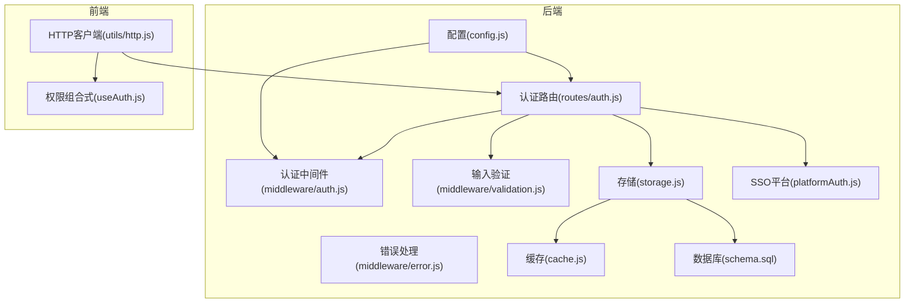
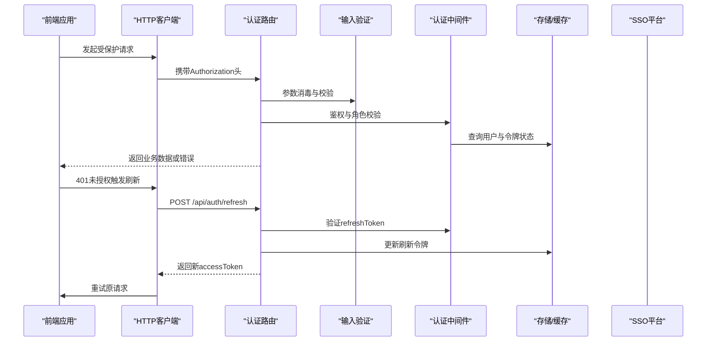
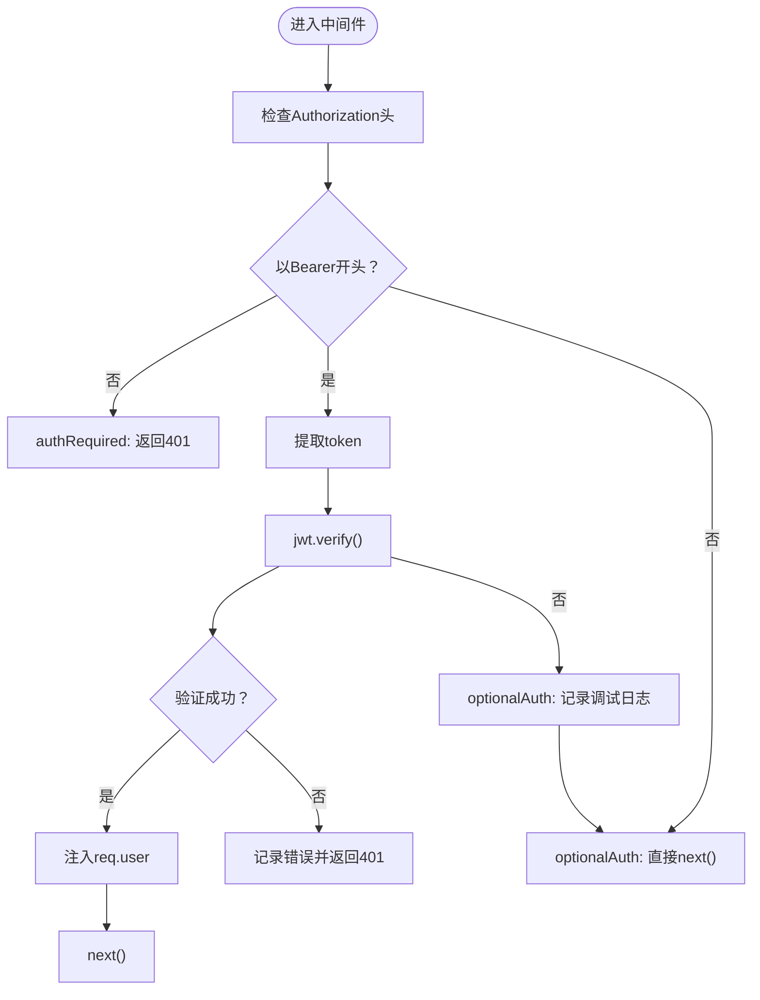
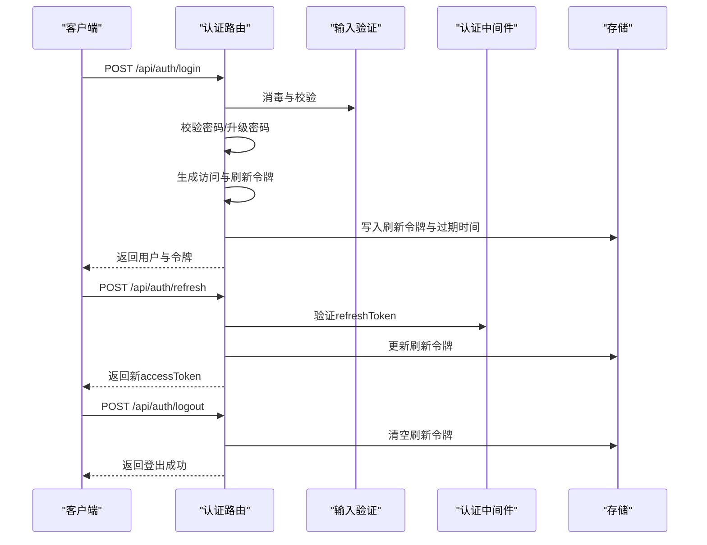
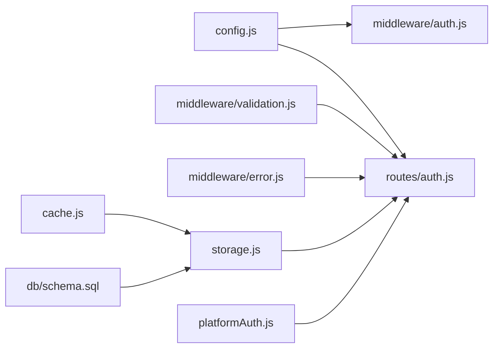

# 认证中间件

<cite>
**本文引用的文件列表**
- [backend/middleware/auth.js](file://backend/middleware/auth.js)
- [backend/routes/auth.js](file://backend/routes/auth.js)
- [backend/config.js](file://backend/config.js)
- [backend/storage.js](file://backend/storage.js)
- [backend/cache.js](file://backend/cache.js)
- [backend/middleware/validation.js](file://backend/middleware/validation.js)
- [backend/middleware/error.js](file://backend/middleware/error.js)
- [backend/platformAuth.js](file://backend/platformAuth.js)
- [backend/index.js](file://backend/index.js)
- [frontend/h5/src/utils/http.js](file://frontend/h5/src/utils/http.js)
- [frontend/h5/src/views/admin/composables/useAuth.js](file://frontend/h5/src/views/admin/composables/useAuth.js)
- [backend/db/schema.sql](file://backend/db/schema.sql)
</cite>

## 目录
1. [简介](#简介)
2. [项目结构](#项目结构)
3. [核心组件](#核心组件)
4. [架构总览](#架构总览)
5. [详细组件分析](#详细组件分析)
6. [依赖关系分析](#依赖关系分析)
7. [性能考量](#性能考量)
8. [故障排查指南](#故障排查指南)
9. [结论](#结论)
10. [附录](#附录)

## 简介
本文件系统性阐述认证中间件系统的实现与使用，涵盖：
- JWT认证机制与令牌生成/验证流程
- 刷新令牌策略与SSO/微信登录集成
- authRequired与authOptional中间件的区别与使用场景
- 角色权限控制机制与roleRequired中间件
- 完整认证流程示例（登录、刷新、登出）
- 在Express.js中集成中间件、异常处理与细粒度权限控制
- 安全最佳实践与常见问题解决方案

## 项目结构
认证相关代码主要分布在后端中间件、路由、配置与存储层，并在前端通过HTTP拦截器与本地存储配合完成令牌刷新与鉴权。

图表来源
- [backend/routes/auth.js:1-591](file://backend/routes/auth.js#L1-L591)
- [backend/middleware/auth.js:1-168](file://backend/middleware/auth.js#L1-L168)
- [backend/config.js:1-123](file://backend/config.js#L1-L123)
- [backend/storage.js:1-197](file://backend/storage.js#L1-L197)
- [backend/cache.js:1-119](file://backend/cache.js#L1-L119)
- [backend/platformAuth.js:1-177](file://backend/platformAuth.js#L1-L177)
- [frontend/h5/src/utils/http.js:1-99](file://frontend/h5/src/utils/http.js#L1-L99)
- [frontend/h5/src/views/admin/composables/useAuth.js:1-45](file://frontend/h5/src/views/admin/composables/useAuth.js#L1-L45)

章节来源
- [backend/routes/auth.js:1-591](file://backend/routes/auth.js#L1-L591)
- [backend/middleware/auth.js:1-168](file://backend/middleware/auth.js#L1-L168)
- [backend/config.js:1-123](file://backend/config.js#L1-L123)
- [backend/storage.js:1-197](file://backend/storage.js#L1-L197)
- [backend/cache.js:1-119](file://backend/cache.js#L1-L119)
- [backend/platformAuth.js:1-177](file://backend/platformAuth.js#L1-L177)
- [frontend/h5/src/utils/http.js:1-99](file://frontend/h5/src/utils/http.js#L1-L99)
- [frontend/h5/src/views/admin/composables/useAuth.js:1-45](file://frontend/h5/src/views/admin/composables/useAuth.js#L1-L45)

## 核心组件
- 认证中间件：提供强制认证、可选认证与角色校验
- 认证路由：登录、注册、刷新、登出、SSO与微信登录
- 配置模块：集中管理JWT密钥、令牌TTL、微信与SSO参数
- 存储与缓存：用户数据持久化与缓存
- 输入验证与错误处理：请求消毒、参数校验与统一错误响应
- 平台对接：SSO平台成员信息查询与加解密

章节来源
- [backend/middleware/auth.js:1-168](file://backend/middleware/auth.js#L1-L168)
- [backend/routes/auth.js:1-591](file://backend/routes/auth.js#L1-L591)
- [backend/config.js:1-123](file://backend/config.js#L1-L123)
- [backend/storage.js:1-197](file://backend/storage.js#L1-L197)
- [backend/cache.js:1-119](file://backend/cache.js#L1-L119)
- [backend/middleware/validation.js:1-192](file://backend/middleware/validation.js#L1-L192)
- [backend/middleware/error.js:1-90](file://backend/middleware/error.js#L1-L90)
- [backend/platformAuth.js:1-177](file://backend/platformAuth.js#L1-L177)

## 架构总览
认证系统采用“路由层负责业务逻辑，中间件层负责鉴权与校验”的分层设计。前端通过HTTP拦截器自动处理401与令牌刷新，后端通过中间件注入用户上下文并进行角色校验。

图表来源
- [frontend/h5/src/utils/http.js:19-78](file://frontend/h5/src/utils/http.js#L19-L78)
- [backend/routes/auth.js:227-294](file://backend/routes/auth.js#L227-L294)
- [backend/middleware/auth.js:11-45](file://backend/middleware/auth.js#L11-L45)
- [backend/storage.js:134-142](file://backend/storage.js#L134-L142)

## 详细组件分析

### JWT认证机制与令牌生命周期
- 令牌类型
  - 访问令牌：短期有效，用于日常受保护资源访问
  - 刷新令牌：长期有效，仅用于换取新的访问令牌
- 生成策略
  - 访问令牌：包含sub（用户ID）、role（角色），TTL由配置决定
  - 刷新令牌：包含sub与type=refresh，TTL较长
- 验证策略
  - 访问令牌：在中间件中验证签名与过期时间，注入用户上下文
  - 刷新令牌：验证type与用户记录中的刷新令牌一致性及过期时间
- 刷新流程
  - 前端收到401时，使用localStorage中的refreshToken调用刷新接口
  - 后端验证后返回新的accessToken并可更新refreshToken
  - 前端将新token写回localStorage并重试原请求

章节来源
- [backend/routes/auth.js:49-73](file://backend/routes/auth.js#L49-L73)
- [backend/middleware/auth.js:23-44](file://backend/middleware/auth.js#L23-L44)
- [backend/routes/auth.js:227-294](file://backend/routes/auth.js#L227-L294)
- [frontend/h5/src/utils/http.js:58-76](file://frontend/h5/src/utils/http.js#L58-L76)

### 中间件：authRequired vs authOptional
- authRequired
  - 必须提供有效的Bearer令牌，否则返回401
  - 验证通过后在req.user中注入用户ID与角色
- authOptional
  - 若提供令牌则验证，若无效则忽略，不阻断请求
  - 适用于公开接口中“可选登录态”的场景（如展示用户是否已登录）

图表来源
- [backend/middleware/auth.js:11-45](file://backend/middleware/auth.js#L11-L45)
- [backend/middleware/auth.js:80-101](file://backend/middleware/auth.js#L80-L101)

章节来源
- [backend/middleware/auth.js:11-45](file://backend/middleware/auth.js#L11-L45)
- [backend/middleware/auth.js:80-101](file://backend/middleware/auth.js#L80-L101)

### 角色权限控制：roleRequired中间件
- 作用：基于req.user.role进行白名单匹配
- 行为：未认证返回401；角色不在允许列表返回403；通过则放行
- 使用建议：对管理端接口按角色分组，如admin、dsl_admin、study_admin

章节来源
- [backend/middleware/auth.js:50-75](file://backend/middleware/auth.js#L50-L75)

### 认证路由与流程
- 登录
  - 支持手机号/用户名+密码登录，向后兼容明文密码并自动升级为哈希
  - 成功后生成访问与刷新令牌，持久化刷新令牌与过期时间
- 注册
  - 校验手机号格式与密码强度，创建用户并生成初始令牌
- 刷新
  - 校验refreshToken类型、用户记录一致性与过期时间，返回新accessToken
- 登出
  - 清空用户记录中的refreshToken与过期时间
- SSO登录
  - 通过authcode查询平台成员信息，自动创建或更新用户并发放令牌
- 微信登录
  - 小程序code换取session，查找或创建用户并发放令牌

图表来源
- [backend/routes/auth.js:96-147](file://backend/routes/auth.js#L96-L147)
- [backend/routes/auth.js:227-294](file://backend/routes/auth.js#L227-L294)
- [backend/routes/auth.js:299-317](file://backend/routes/auth.js#L299-L317)

章节来源
- [backend/routes/auth.js:96-147](file://backend/routes/auth.js#L96-L147)
- [backend/routes/auth.js:152-205](file://backend/routes/auth.js#L152-L205)
- [backend/routes/auth.js:227-294](file://backend/routes/auth.js#L227-L294)
- [backend/routes/auth.js:299-317](file://backend/routes/auth.js#L299-L317)
- [backend/routes/auth.js:322-392](file://backend/routes/auth.js#L322-L392)
- [backend/routes/auth.js:513-588](file://backend/routes/auth.js#L513-L588)

### 前端集成与令牌刷新
- HTTP拦截器
  - 请求阶段自动附加Authorization头
  - 响应阶段捕获401，若存在refreshToken则发起刷新
  - 刷新成功后重试原请求，失败则清除本地令牌并拒绝请求
- 组合式useAuth
  - 读取本地用户信息与角色，计算管理员与超级管理员状态
  - 提供刷新当前用户信息的方法

章节来源
- [frontend/h5/src/utils/http.js:19-78](file://frontend/h5/src/utils/http.js#L19-L78)
- [frontend/h5/src/views/admin/composables/useAuth.js:17-32](file://frontend/h5/src/views/admin/composables/useAuth.js#L17-L32)

### 安全配置与最佳实践
- JWT密钥与TTL
  - 通过环境变量配置，生产环境要求足够长度的密钥
- 速率限制
  - 登录/注册接口内置简单IP窗口限流，防止暴力破解
- 输入消毒与参数校验
  - 消毒HTML脚本与事件属性，校验手机号/邮箱/必填字段
- 日志与审计
  - 记录登录失败、令牌过期、权限不足等关键事件
- 传输安全
  - 建议启用HTTPS，令牌通过安全通道传输

章节来源
- [backend/config.js:78-104](file://backend/config.js#L78-L104)
- [backend/middleware/auth.js:108-143](file://backend/middleware/auth.js#L108-L143)
- [backend/middleware/validation.js:52-98](file://backend/middleware/validation.js#L52-L98)
- [backend/middleware/error.js:9-62](file://backend/middleware/error.js#L9-L62)

## 依赖关系分析
- 中间件依赖
  - 认证中间件依赖配置模块提供的JWT密钥与TTL
  - 认证路由依赖中间件进行鉴权与角色校验
- 存储与缓存
  - 存储模块负责用户数据的读写与缓存，降低文件IO压力
- 平台对接
  - SSO模块封装平台接口调用与加解密逻辑，认证路由调用其查询方法

图表来源
- [backend/config.js:1-123](file://backend/config.js#L1-L123)
- [backend/middleware/auth.js:1-168](file://backend/middleware/auth.js#L1-L168)
- [backend/routes/auth.js:1-591](file://backend/routes/auth.js#L1-L591)
- [backend/middleware/validation.js:1-192](file://backend/middleware/validation.js#L1-L192)
- [backend/middleware/error.js:1-90](file://backend/middleware/error.js#L1-L90)
- [backend/storage.js:1-197](file://backend/storage.js#L1-L197)
- [backend/cache.js:1-119](file://backend/cache.js#L1-L119)
- [backend/db/schema.sql:1-10](file://backend/db/schema.sql#L1-L10)
- [backend/platformAuth.js:1-177](file://backend/platformAuth.js#L1-L177)

章节来源
- [backend/config.js:1-123](file://backend/config.js#L1-L123)
- [backend/middleware/auth.js:1-168](file://backend/middleware/auth.js#L1-L168)
- [backend/routes/auth.js:1-591](file://backend/routes/auth.js#L1-L591)
- [backend/middleware/validation.js:1-192](file://backend/middleware/validation.js#L1-L192)
- [backend/middleware/error.js:1-90](file://backend/middleware/error.js#L1-L90)
- [backend/storage.js:1-197](file://backend/storage.js#L1-L197)
- [backend/cache.js:1-119](file://backend/cache.js#L1-L119)
- [backend/db/schema.sql:1-10](file://backend/db/schema.sql#L1-L10)
- [backend/platformAuth.js:1-177](file://backend/platformAuth.js#L1-L177)

## 性能考量
- 缓存策略
  - 用户数据读取使用缓存，减少磁盘IO与JSON解析开销
  - 缓存定期清理过期项，避免内存膨胀
- 速率限制
  - 登录/注册接口限制请求频率，缓解暴力破解与DDoS
- 存储迁移
  - 支持PostgreSQL JSONB存储，便于扩展与规范化

章节来源
- [backend/cache.js:57-79](file://backend/cache.js#L57-L79)
- [backend/storage.js:134-142](file://backend/storage.js#L134-L142)
- [backend/middleware/auth.js:108-143](file://backend/middleware/auth.js#L108-L143)
- [backend/db/schema.sql:1-10](file://backend/db/schema.sql#L1-L10)

## 故障排查指南
- 常见错误与处理
  - 401 未提供/无效令牌：检查Authorization头格式与签名，确认密钥一致
  - 401 令牌过期：前端触发刷新，若刷新失败需重新登录
  - 403 权限不足：确认用户角色是否在允许列表
  - 400 参数校验失败：检查必填字段与格式
  - 500 服务器内部错误：查看日志，关注数据库约束与平台接口异常
- 建议排查步骤
  - 检查JWT密钥与TTL配置
  - 确认存储层可用与缓存状态
  - 核对SSO/微信接口参数与凭证
  - 查看错误中间件输出的上下文日志

章节来源
- [backend/middleware/error.js:9-62](file://backend/middleware/error.js#L9-L62)
- [backend/middleware/validation.js:79-98](file://backend/middleware/validation.js#L79-L98)
- [backend/config.js:78-104](file://backend/config.js#L78-L104)

## 结论
本认证中间件系统通过清晰的中间件职责划分、完善的令牌生命周期管理与前端自动刷新机制，提供了稳定且可扩展的认证能力。结合角色权限控制与输入消毒、速率限制等安全措施，能够满足多数业务场景的安全与性能需求。建议在生产环境中严格配置密钥与TTL，并持续监控日志与缓存命中率。

## 附录

### API调用示例（不含具体代码）
- 登录
  - 方法与路径：POST /api/auth/login
  - 请求体：手机号/用户名与密码
  - 成功响应：返回用户信息与访问/刷新令牌
- 刷新
  - 方法与路径：POST /api/auth/refresh
  - 请求体：刷新令牌
  - 成功响应：返回新的访问令牌
- 登出
  - 方法与路径：POST /api/auth/logout
  - 成功响应：返回登出成功
- 获取当前用户
  - 方法与路径：GET /api/auth/me
  - 成功响应：返回当前用户信息
- SSO登录
  - 方法与路径：POST /api/auth/sso/verify
  - 请求体：authcode
  - 成功响应：返回平台成员信息与令牌
- 微信登录
  - 方法与路径：POST /api/auth/wx-login
  - 请求体：小程序code
  - 成功响应：返回用户信息与令牌

章节来源
- [backend/routes/auth.js:96-147](file://backend/routes/auth.js#L96-L147)
- [backend/routes/auth.js:227-294](file://backend/routes/auth.js#L227-L294)
- [backend/routes/auth.js:299-317](file://backend/routes/auth.js#L299-L317)
- [backend/routes/auth.js:210-225](file://backend/routes/auth.js#L210-L225)
- [backend/routes/auth.js:322-392](file://backend/routes/auth.js#L322-L392)
- [backend/routes/auth.js:513-588](file://backend/routes/auth.js#L513-L588)