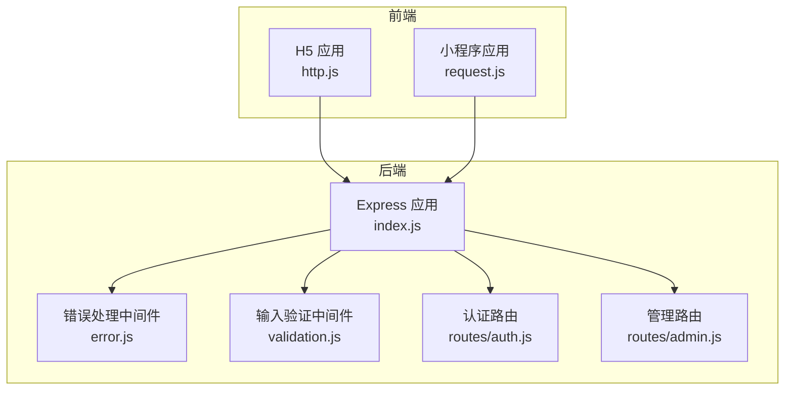
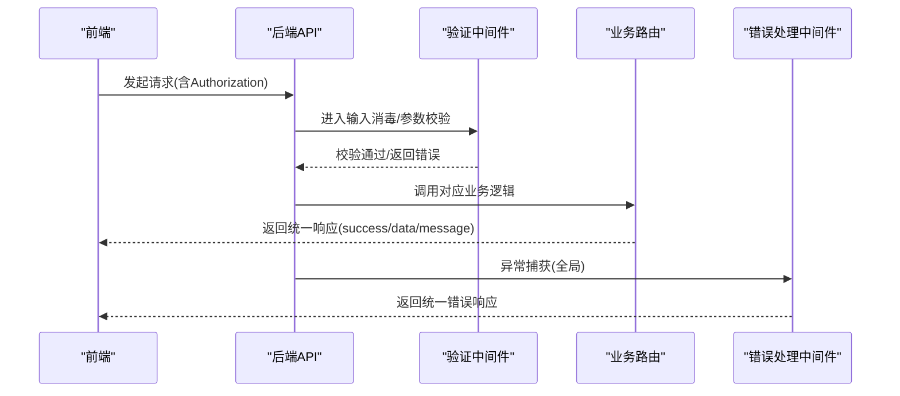
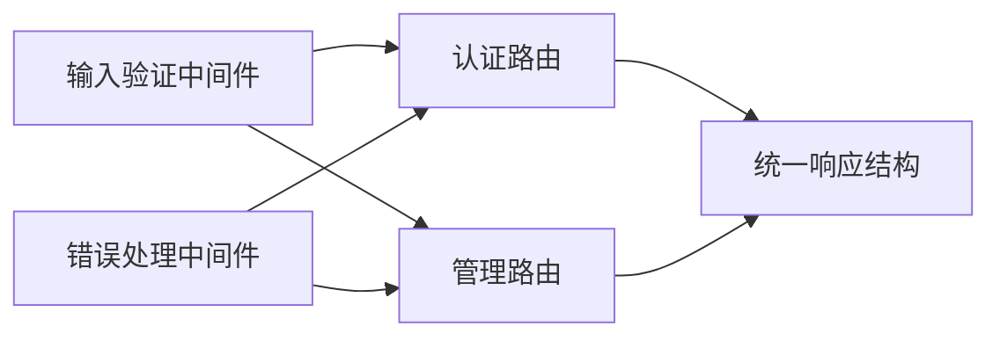

# 请求响应格式

<cite>
**本文引用的文件**
- [backend/middleware/error.js](file://backend/middleware/error.js)
- [backend/middleware/validation.js](file://backend/middleware/validation.js)
- [backend/index.js](file://backend/index.js)
- [backend/routes/admin.js](file://backend/routes/admin.js)
- [backend/routes/auth.js](file://backend/routes/auth.js)
- [backend/config.js](file://backend/config.js)
- [frontend/h5/src/utils/http.js](file://frontend/h5/src/utils/http.js)
- [frontend/miniprogram/utils/request.js](file://frontend/miniprogram/utils/request.js)
</cite>

## 目录
1. [简介](#简介)
2. [项目结构](#项目结构)
3. [核心组件](#核心组件)
4. [架构总览](#架构总览)
5. [详细组件分析](#详细组件分析)
6. [依赖关系分析](#依赖关系分析)
7. [性能考量](#性能考量)
8. [故障排查指南](#故障排查指南)
9. [结论](#结论)
10. [附录](#附录)

## 简介
本文件系统化梳理本项目的统一请求响应格式规范，明确统一响应结构（success 字段、message 字段、data 字段、可选的错误扩展字段）、标准数据类型与格式、请求参数验证规则与必填字段标识、数据类型约束，并给出成功响应、错误响应、分页响应的标准格式示例路径与最佳实践建议。同时说明如何处理不同类型的业务数据、数组数据、嵌套对象的序列化，以及前后端数据交互的最佳实践与兼容性考虑。

## 项目结构
本项目采用前后端分离架构：
- 后端基于 Express，提供 RESTful API，集中于统一响应结构与参数校验。
- 前端包含 H5 与小程序两套实现，均通过拦截器自动注入鉴权头并处理 401 刷新流程。

图表来源
- [backend/index.js:1-120](file://backend/index.js#L1-L120)
- [backend/middleware/error.js:1-90](file://backend/middleware/error.js#L1-L90)
- [backend/middleware/validation.js:1-192](file://backend/middleware/validation.js#L1-L192)
- [backend/routes/auth.js:1-120](file://backend/routes/auth.js#L1-L120)
- [backend/routes/admin.js:1-60](file://backend/routes/admin.js#L1-L60)

章节来源
- [backend/index.js:1-120](file://backend/index.js#L1-L120)
- [backend/middleware/error.js:1-90](file://backend/middleware/error.js#L1-L90)
- [backend/middleware/validation.js:1-192](file://backend/middleware/validation.js#L1-L192)
- [backend/routes/auth.js:1-120](file://backend/routes/auth.js#L1-L120)
- [backend/routes/admin.js:1-60](file://backend/routes/admin.js#L1-L60)

## 核心组件
- 统一响应结构
  - 成功响应：包含 success: true 与 data 字段；部分场景返回 message 字段。
  - 错误响应：包含 success: false 与 message 字段；开发环境可附加 stack、detail 等调试信息。
- 参数验证与消毒
  - 输入消毒：对字符串、数组、嵌套对象进行 XSS 防护与清洗。
  - 查询参数校验：支持必填、类型（number）、范围（min/max）、字符串长度、枚举值等。
  - 必填字段校验：支持多级字段路径校验。
  - 文件上传校验：类型与大小限制。
- 错误处理
  - 统一错误响应模板，区分业务错误与系统错误，404、JWT 过期/无效、数据库约束等场景。
- 前后端交互
  - 前端自动注入 Authorization: Bearer <token>。
  - 401 时自动刷新令牌并重试原请求。

章节来源
- [backend/middleware/error.js:9-73](file://backend/middleware/error.js#L9-L73)
- [backend/middleware/validation.js:9-191](file://backend/middleware/validation.js#L9-L191)
- [frontend/h5/src/utils/http.js:19-78](file://frontend/h5/src/utils/http.js#L19-L78)
- [frontend/miniprogram/utils/request.js:59-134](file://frontend/miniprogram/utils/request.js#L59-L134)

## 架构总览
下图展示了从前端发起请求到后端返回统一响应的整体流程，以及参数校验与错误处理的关键节点。

图表来源
- [backend/index.js:116-128](file://backend/index.js#L116-L128)
- [backend/middleware/validation.js:52-149](file://backend/middleware/validation.js#L52-L149)
- [backend/middleware/error.js:79-83](file://backend/middleware/error.js#L79-L83)
- [frontend/h5/src/utils/http.js:19-78](file://frontend/h5/src/utils/http.js#L19-L78)
- [frontend/miniprogram/utils/request.js:59-134](file://frontend/miniprogram/utils/request.js#L59-L134)

## 详细组件分析

### 统一响应结构设计
- 成功响应
  - 结构：success: true，data: 业务数据；部分场景返回 message: 提示信息。
  - 示例路径：[成功响应示例路径:57-61](file://backend/routes/admin.js#L57-L61)、[成功响应示例路径:101-111](file://backend/routes/admin.js#L101-L111)、[成功响应示例路径:142-147](file://backend/routes/auth.js#L142-L147)
- 错误响应
  - 结构：success: false，message: 错误描述；开发环境可包含 stack、detail。
  - 示例路径：[错误响应示例路径:57-61](file://backend/middleware/error.js#L57-L61)、[错误响应示例路径:186-199](file://backend/index.js#L186-L199)
- 分页响应
  - 结构：success: true，data: 当前页数据，pagination: { page, limit, total, totalPages }。
  - 示例路径：[分页响应示例路径:101-111](file://backend/routes/admin.js#L101-L111)

章节来源
- [backend/middleware/error.js:57-61](file://backend/middleware/error.js#L57-L61)
- [backend/routes/admin.js:57-61](file://backend/routes/admin.js#L57-L61)
- [backend/routes/admin.js:101-111](file://backend/routes/admin.js#L101-L111)
- [backend/routes/auth.js:142-147](file://backend/routes/auth.js#L142-L147)

### 请求参数验证规则与必填字段
- 输入消毒
  - 对字符串进行 XSS 过滤、移除事件属性、javascript: 协议等；对对象递归清洗；对数组逐项清洗。
  - 示例路径：[消毒函数实现路径:9-47](file://backend/middleware/validation.js#L9-L47)、[请求体消毒中间件路径:52-57](file://backend/middleware/validation.js#L52-L57)
- 必填字段校验
  - 支持单层与多级字段路径（如 a.b）；对空字符串进行 trim 后判断。
  - 示例路径：[必填字段校验实现路径:79-98](file://backend/middleware/validation.js#L79-L98)
- 查询参数校验
  - 支持 required、type: number、min/max、type: string + maxLength、enum。
  - 示例路径：[查询参数校验实现路径:103-149](file://backend/middleware/validation.js#L103-L149)
- 文件上传校验
  - 校验类型与大小，超出限制返回错误响应。
  - 示例路径：[文件上传校验实现路径:154-180](file://backend/middleware/validation.js#L154-L180)

章节来源
- [backend/middleware/validation.js:9-47](file://backend/middleware/validation.js#L9-L47)
- [backend/middleware/validation.js:52-57](file://backend/middleware/validation.js#L52-L57)
- [backend/middleware/validation.js:79-98](file://backend/middleware/validation.js#L79-L98)
- [backend/middleware/validation.js:103-149](file://backend/middleware/validation.js#L103-L149)
- [backend/middleware/validation.js:154-180](file://backend/middleware/validation.js#L154-L180)

### 数据类型与格式约定
- 字段命名
  - 统一使用小驼峰命名，避免连字符与特殊字符。
- 字符串
  - 统一 UTF-8 编码；必要时进行 trim。
- 数字
  - 明确整数/浮点数语义；查询参数校验时转换为 Number 并做边界检查。
- 日期时间
  - 统一使用 ISO 8601 字符串格式（如 2025-01-01T00:00:00Z）。
- 布尔
  - 使用 true/false 字面量。
- 数组与对象
  - 嵌套对象与数组按需展开；避免深层嵌套导致序列化体积过大。
- 文件
  - 上传文件返回相对 URL；前端拼接基础地址。

章节来源
- [backend/middleware/validation.js:116-126](file://backend/middleware/validation.js#L116-L126)
- [backend/index.js:279-285](file://backend/index.js#L279-L285)

### 响应示例与序列化说明
- 成功响应（业务数据）
  - 示例路径：[统计与列表数据:57-61](file://backend/routes/admin.js#L57-L61)、[分页列表数据:101-111](file://backend/routes/admin.js#L101-L111)
- 成功响应（登录/注册/刷新）
  - 示例路径：[登录成功:142-147](file://backend/routes/auth.js#L142-L147)、[注册成功:200-205](file://backend/routes/auth.js#L200-L205)、[刷新成功:283-287](file://backend/routes/auth.js#L283-L287)
- 错误响应（通用/404/鉴权）
  - 示例路径：[全局错误:57-61](file://backend/middleware/error.js#L57-L61)、[404:67-73](file://backend/middleware/error.js#L67-L73)、[未登录/过期:186-199](file://backend/index.js#L186-L199)
- 分页响应
  - 示例路径：[分页结构:104-109](file://backend/routes/admin.js#L104-L109)

章节来源
- [backend/routes/admin.js:57-61](file://backend/routes/admin.js#L57-L61)
- [backend/routes/admin.js:101-111](file://backend/routes/admin.js#L101-L111)
- [backend/routes/auth.js:142-147](file://backend/routes/auth.js#L142-L147)
- [backend/routes/auth.js:200-205](file://backend/routes/auth.js#L200-L205)
- [backend/routes/auth.js:283-287](file://backend/routes/auth.js#L283-L287)
- [backend/middleware/error.js:57-61](file://backend/middleware/error.js#L57-L61)
- [backend/middleware/error.js:67-73](file://backend/middleware/error.js#L67-L73)
- [backend/index.js:186-199](file://backend/index.js#L186-L199)

### 前后端数据交互最佳实践
- 鉴权头注入
  - 前端自动在请求头添加 Authorization: Bearer <token>。
  - 示例路径：[H5 注入逻辑:19-26](file://frontend/h5/src/utils/http.js#L19-L26)、[小程序 注入逻辑:61-66](file://frontend/miniprogram/utils/request.js#L61-L66)
- 401 自动刷新
  - 前端检测 401 时，调用 /api/auth/refresh 获取新 token 并重试原请求。
  - 示例路径：[H5 刷新流程:28-78](file://frontend/h5/src/utils/http.js#L28-L78)、[小程序 刷新流程:59-134](file://frontend/miniprogram/utils/request.js#L59-L134)
- 令牌持久化
  - 前端本地存储 accessToken 与 refreshToken；刷新成功后更新本地存储。
  - 示例路径：[H5 存储与清理:80-95](file://frontend/h5/src/utils/http.js#L80-L95)、[小程序 存储与清理:19-34](file://frontend/miniprogram/utils/request.js#L19-L34)

章节来源
- [frontend/h5/src/utils/http.js:19-95](file://frontend/h5/src/utils/http.js#L19-L95)
- [frontend/miniprogram/utils/request.js:59-134](file://frontend/miniprogram/utils/request.js#L59-L134)

## 依赖关系分析
- 中间件耦合
  - 输入消毒中间件在 app.use 层级生效，确保所有路由进入业务逻辑前完成清洗。
  - 错误处理中间件作为兜底，保证异常被统一格式化输出。
- 路由层
  - 认证路由与管理路由分别承担登录/注册/刷新/鉴权与业务数据管理职责，均遵循统一响应结构。
- 配置层
  - 服务器、JWT、微信、上传等配置集中管理，影响响应行为（如 401 时的提示文案）。

图表来源
- [backend/middleware/validation.js:52-57](file://backend/middleware/validation.js#L52-L57)
- [backend/middleware/error.js:79-83](file://backend/middleware/error.js#L79-L83)
- [backend/routes/auth.js:96-147](file://backend/routes/auth.js#L96-L147)
- [backend/routes/admin.js:29-111](file://backend/routes/admin.js#L29-L111)

章节来源
- [backend/middleware/validation.js:52-57](file://backend/middleware/validation.js#L52-L57)
- [backend/middleware/error.js:79-83](file://backend/middleware/error.js#L79-L83)
- [backend/routes/auth.js:96-147](file://backend/routes/auth.js#L96-L147)
- [backend/routes/admin.js:29-111](file://backend/routes/admin.js#L29-L111)

## 性能考量
- 请求日志
  - 后端记录请求耗时与状态，便于性能监控与问题定位。
  - 示例路径：[请求日志实现:117-128](file://backend/index.js#L117-L128)
- 上传与压缩
  - 图片压缩接口在失败时回退到原始图片，保证可用性但可能影响带宽。
  - 示例路径：[图片压缩实现:86-114](file://backend/index.js#L86-L114)
- 分页策略
  - 后端对列表数据进行内存排序与切片，建议结合数据库分页以降低内存压力。
  - 示例路径：[分页实现:96-111](file://backend/routes/admin.js#L96-L111)

章节来源
- [backend/index.js:117-128](file://backend/index.js#L117-L128)
- [backend/index.js:86-114](file://backend/index.js#L86-L114)
- [backend/routes/admin.js:96-111](file://backend/routes/admin.js#L96-L111)

## 故障排查指南
- 常见错误场景
  - 未登录/登录过期：返回 401，message 提示未登录或登录已过期。
  - 无权限访问：返回 403，message 提示无权限访问。
  - 接口不存在：返回 404，message 提示接口不存在并附带 path。
  - 参数校验失败：返回 400，message 说明参数问题，必要时包含 errors 数组。
  - 文件上传错误：文件过大或类型不支持时返回 400。
- 开发环境调试
  - 开发模式下错误响应可包含 stack 与 detail，便于定位问题。
- 前端 401 自动刷新
  - 若刷新失败，清除本地 token 并中断后续请求，避免死循环。

章节来源
- [backend/middleware/error.js:17-61](file://backend/middleware/error.js#L17-L61)
- [backend/middleware/error.js:67-73](file://backend/middleware/error.js#L67-L73)
- [backend/middleware/validation.js:103-149](file://backend/middleware/validation.js#L103-L149)
- [backend/middleware/validation.js:154-180](file://backend/middleware/validation.js#L154-L180)
- [frontend/h5/src/utils/http.js:28-78](file://frontend/h5/src/utils/http.js#L28-L78)
- [frontend/miniprogram/utils/request.js:75-123](file://frontend/miniprogram/utils/request.js#L75-L123)

## 结论
本项目通过统一响应结构、严格的参数验证与消毒、完善的错误处理机制，以及前后端一致的鉴权与刷新流程，构建了稳定、可维护且易扩展的 API 交互规范。建议在新增接口时严格遵循本文规范，确保一致性与可预测性。

## 附录

### 统一响应字段定义
- success: 布尔，表示请求是否成功
- message: 字符串，错误描述或成功提示
- data: 任意类型，业务数据主体
- pagination: 对象，分页信息（仅在分页接口出现）
  - page: 数字
  - limit: 数字
  - total: 数字
  - totalPages: 数字
- 错误扩展字段（开发环境）
  - stack: 字符串，堆栈信息
  - detail: 任意类型，详细错误上下文

章节来源
- [backend/routes/admin.js:104-109](file://backend/routes/admin.js#L104-L109)
- [backend/middleware/error.js:57-61](file://backend/middleware/error.js#L57-L61)

### 参数校验规则清单
- 必填字段
  - 支持单层与多级字段路径；空字符串经 trim 后视为缺失。
  - 示例路径：[必填字段校验:79-98](file://backend/middleware/validation.js#L79-L98)
- 查询参数
  - required: 布尔
  - type: number | string
  - min/max: 数字范围
  - maxLength: 字符串最大长度
  - enum: 枚举集合
  - 示例路径：[查询参数校验:103-149](file://backend/middleware/validation.js#L103-L149)
- 输入消毒
  - XSS 过滤、事件属性移除、javascript: 协议移除、trim
  - 示例路径：[消毒实现:9-47](file://backend/middleware/validation.js#L9-L47)

章节来源
- [backend/middleware/validation.js:79-98](file://backend/middleware/validation.js#L79-L98)
- [backend/middleware/validation.js:103-149](file://backend/middleware/validation.js#L103-L149)
- [backend/middleware/validation.js:9-47](file://backend/middleware/validation.js#L9-L47)

### 前端交互要点
- 自动注入 Authorization: Bearer <token>
- 401 时自动刷新并重试
- 本地存储与清理 token

章节来源
- [frontend/h5/src/utils/http.js:19-95](file://frontend/h5/src/utils/http.js#L19-L95)
- [frontend/miniprogram/utils/request.js:59-134](file://frontend/miniprogram/utils/request.js#L59-L134)