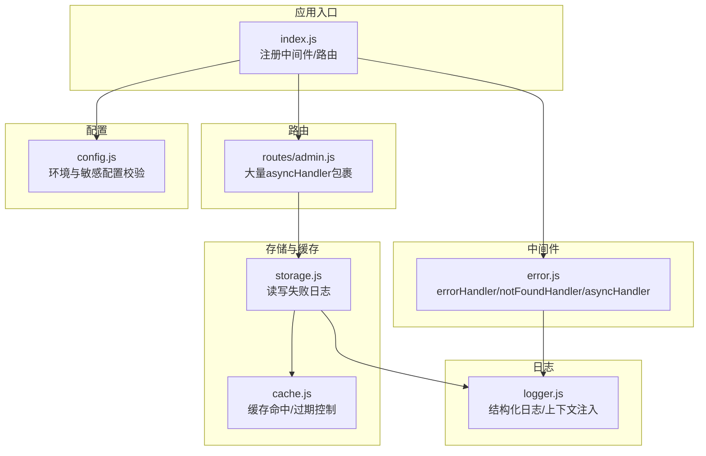
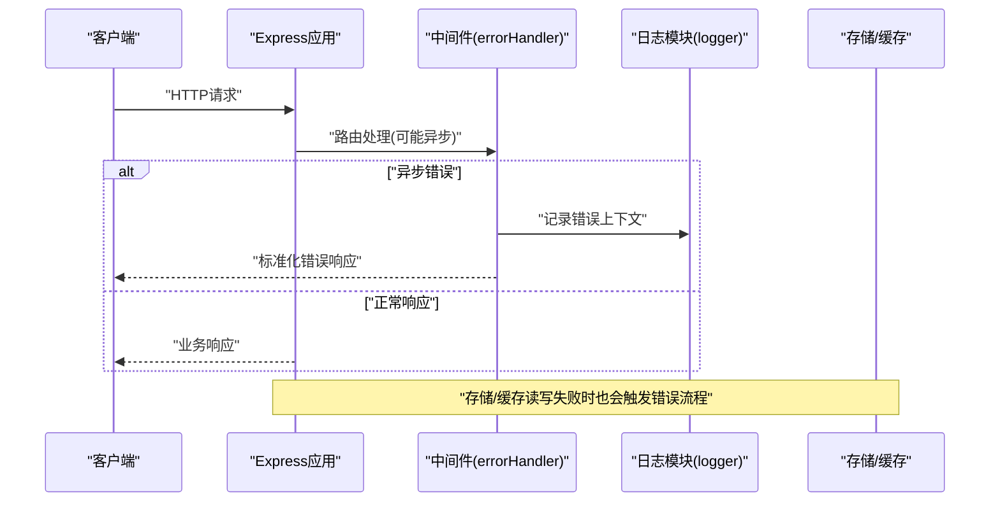
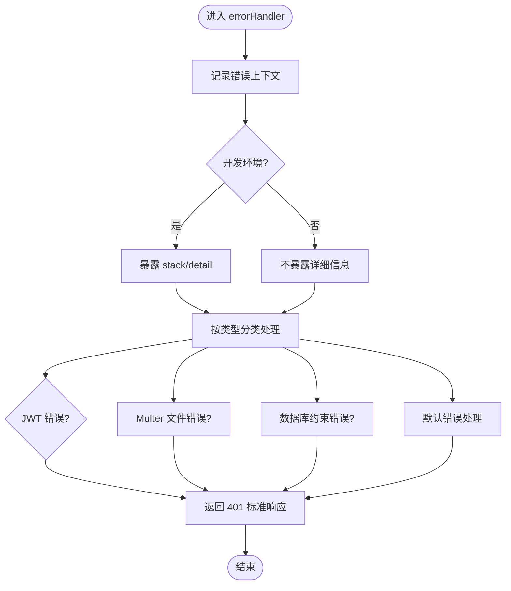
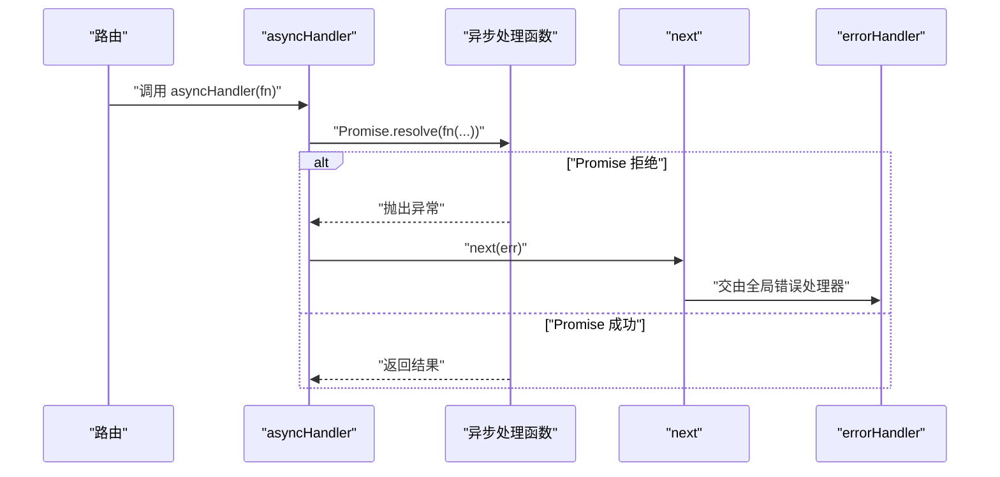
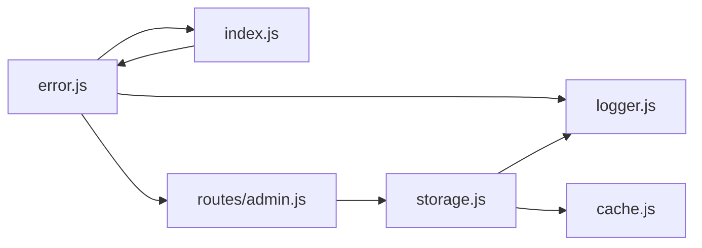

# 错误处理系统

<cite>
**本文引用的文件**
- [error.js](file://backend/middleware/error.js)
- [index.js](file://backend/index.js)
- [logger.js](file://backend/logger.js)
- [admin.js](file://backend/routes/admin.js)
- [config.js](file://backend/config.js)
- [storage.js](file://backend/storage.js)
- [cache.js](file://backend/cache.js)
</cite>

## 目录
1. [简介](#简介)
2. [项目结构](#项目结构)
3. [核心组件](#核心组件)
4. [架构总览](#架构总览)
5. [详细组件分析](#详细组件分析)
6. [依赖关系分析](#依赖关系分析)
7. [性能考量](#性能考量)
8. [故障排查指南](#故障排查指南)
9. [结论](#结论)
10. [附录](#附录)

## 简介
本文件系统性梳理了平台后端的错误处理体系，重点覆盖：
- 全局错误处理中间件的实现机制与职责边界
- asyncHandler 高阶函数的设计动机、使用方式与最佳实践
- 错误分类与响应格式标准化（业务错误、系统错误、参数错误）
- 错误码与错误消息设计原则
- 异步错误捕获与处理示例
- 错误日志记录、上下文注入与敏感信息过滤
- 错误恢复策略、降级处理与用户体验优化
- 如何扩展系统以支持新的错误类型

## 项目结构
错误处理系统主要由以下模块组成：
- 中间件层：全局错误处理、404处理、异步错误包装
- 应用入口：注册中间件、挂载路由、统一错误处理
- 日志模块：结构化日志记录与上下文注入
- 路由层：大量使用 asyncHandler 包裹异步处理逻辑
- 存储与缓存：读写失败时的错误传播与日志记录
- 配置模块：运行环境与敏感配置校验

图表来源
- [index.js:18-20](file://backend/index.js#L18-L20)
- [error.js:8-62](file://backend/middleware/error.js#L8-L62)
- [logger.js:85-94](file://backend/logger.js#L85-L94)
- [admin.js:18-21](file://backend/routes/admin.js#L18-L21)
- [storage.js:21-40](file://backend/storage.js#L21-L40)
- [cache.js:5-99](file://backend/cache.js#L5-L99)
- [config.js:78-104](file://backend/config.js#L78-L104)

章节来源
- [index.js:18-20](file://backend/index.js#L18-L20)
- [error.js:8-62](file://backend/middleware/error.js#L8-L62)
- [logger.js:85-94](file://backend/logger.js#L85-L94)
- [admin.js:18-21](file://backend/routes/admin.js#L18-L21)
- [storage.js:21-40](file://backend/storage.js#L21-L40)
- [cache.js:5-99](file://backend/cache.js#L5-L99)
- [config.js:78-104](file://backend/config.js#L78-L104)

## 核心组件
- 全局错误处理器：集中处理未捕获异常、特定框架错误（如 JWT、Multer）以及数据库约束错误，统一返回标准响应。
- 404 处理器：对未匹配路由进行统一响应。
- 异步错误包装器：将异步函数包裹为 Promise，自动捕获异常并交由全局错误处理器处理，避免 try-catch 嵌套。
- 结构化日志：记录请求上下文、错误堆栈、请求体摘要等，便于问题定位与审计。
- 路由层集成：大量路由采用 asyncHandler 包裹，确保异步逻辑错误被统一捕获。

章节来源
- [error.js:8-62](file://backend/middleware/error.js#L8-L62)
- [error.js:66-73](file://backend/middleware/error.js#L66-L73)
- [error.js:78-83](file://backend/middleware/error.js#L78-L83)
- [logger.js:85-94](file://backend/logger.js#L85-L94)
- [admin.js:28-111](file://backend/routes/admin.js#L28-L111)

## 架构总览
全局错误处理在应用启动时注册，路由层通过 asyncHandler 统一包裹异步处理逻辑，错误发生时由 errorHandler 进行分类处理并返回标准化响应；同时记录结构化日志，包含请求方法、URL、IP、堆栈与请求体摘要。

图表来源
- [index.js:18-20](file://backend/index.js#L18-L20)
- [error.js:8-62](file://backend/middleware/error.js#L8-L62)
- [logger.js:85-94](file://backend/logger.js#L85-L94)
- [storage.js:21-40](file://backend/storage.js#L21-L40)

## 详细组件分析

### 全局错误处理中间件
- 职责边界
  - 记录错误上下文（方法、URL、IP、堆栈、请求体摘要）
  - 对特定错误类型进行分类处理（JWT、Multer、数据库约束）
  - 在开发环境暴露详细信息（stack、detail），生产环境隐藏
  - 404 未匹配路由统一处理
- 关键实现要点
  - 通过 logger.errorWithContext 注入上下文
  - 对 err.code 与 err.name 进行分支判断
  - 对数据库约束错误（如 PostgreSQL 约束码前缀）进行友好提示
  - 默认回退到 500 并返回 success:false 的标准响应

图表来源
- [error.js:9-62](file://backend/middleware/error.js#L9-L62)
- [logger.js:85-94](file://backend/logger.js#L85-L94)

章节来源
- [error.js:9-62](file://backend/middleware/error.js#L9-L62)
- [logger.js:85-94](file://backend/logger.js#L85-L94)

### 404 处理器
- 对未匹配路由统一返回标准响应，包含路径信息，便于前端与监控系统识别未命中。

章节来源
- [error.js:66-73](file://backend/middleware/error.js#L66-L73)

### 异步错误包装器 asyncHandler
- 设计动机
  - 避免在每个异步路由中重复 try-catch
  - 将 Promise 拒绝交给 next，由全局 errorHandler 统一处理
- 使用方式
  - 在路由处理函数外层包裹 asyncHandler
  - 适用于所有异步操作（数据库读写、第三方接口调用、文件处理等）

图表来源
- [error.js:78-83](file://backend/middleware/error.js#L78-L83)

章节来源
- [error.js:78-83](file://backend/middleware/error.js#L78-L83)
- [admin.js:28-111](file://backend/routes/admin.js#L28-L111)
- [index.js:86-114](file://backend/index.js#L86-L114)

### 错误分类与响应格式
- 业务错误
  - 场景：参数校验失败、权限不足、资源不存在、业务规则不满足
  - 特征：通常返回 400/401/403/404，message 为用户可读提示
  - 示例：登录失败、文件大小超限、角色权限不足、评价状态非法
- 系统错误
  - 场景：数据库约束冲突、第三方接口异常、文件上传异常、内部服务异常
  - 特征：返回 400/500，message 为通用提示；开发环境可携带 detail
  - 示例：数据库约束违反、微信授权失败、文件字段不支持
- 参数错误
  - 场景：必填字段缺失、类型不匹配、范围越界
  - 特征：返回 400，message 明确指出问题所在
  - 示例：手机号/密码为空、分页参数非法、角色值不在允许集合

响应格式标准化
- 字段约定：success（布尔）、message（字符串）、可选 code（错误码）、可选 detail（开发环境）
- 开发环境附加：stack（堆栈）、detail（错误详情）
- 生产环境隐藏：不暴露 stack、detail，仅返回通用提示

章节来源
- [error.js:16-61](file://backend/middleware/error.js#L16-L61)
- [admin.js:116-166](file://backend/routes/admin.js#L116-L166)
- [admin.js:230-277](file://backend/routes/admin.js#L230-L277)
- [admin.js:442-481](file://backend/routes/admin.js#L442-L481)

### 错误码定义与错误消息设计
- 错误码建议
  - 令牌过期：TOKEN_EXPIRED
  - 文件过大：FILE_TOO_LARGE
  - 不支持的文件字段：UNSUPPORTED_FIELD
  - 数据库约束冲突：DB_CONSTRAINT_VIOLATED
- 错误消息设计原则
  - 用户可读：简洁明确，避免技术术语
  - 上下文完整：包含字段名或业务场景
  - 与国际化兼容：避免硬编码具体语言
  - 与日志一致：错误码与日志上下文保持一致

章节来源
- [error.js:39-44](file://backend/middleware/error.js#L39-L44)
- [error.js:17-29](file://backend/middleware/error.js#L17-L29)
- [error.js:48-54](file://backend/middleware/error.js#L48-L54)

### 异步错误捕获与处理示例
- 路由层示例
  - 管理端统计、申请列表、导出、用户管理、服务配置、评价管理等均使用 asyncHandler 包裹
- 应用入口示例
  - 图片压缩接口使用 asyncHandler 包裹，内部异常交由全局错误处理器
- 存储层示例
  - 读写 JSON 文件失败会记录错误日志，错误最终由 errorHandler 统一处理

章节来源
- [admin.js:28-111](file://backend/routes/admin.js#L28-L111)
- [admin.js:171-207](file://backend/routes/admin.js#L171-L207)
- [admin.js:212-225](file://backend/routes/admin.js#L212-L225)
- [admin.js:309-357](file://backend/routes/admin.js#L309-L357)
- [admin.js:408-481](file://backend/routes/admin.js#L408-L481)
- [index.js:86-114](file://backend/index.js#L86-L114)
- [storage.js:21-40](file://backend/storage.js#L21-L40)

### 错误日志记录与敏感信息过滤
- 日志上下文
  - 方法、URL、IP、堆栈、请求体摘要（截断，避免泄露）
- 敏感信息过滤
  - 用户对象序列化时剔除 password、passwordHash、refreshToken、wxSessionKey 等
  - 请求体只记录前 500 字符，避免泄露敏感数据
- 日志级别
  - error/warn/info/debug，按配置输出到控制台与文件

章节来源
- [logger.js:85-94](file://backend/logger.js#L85-L94)
- [logger.js:26-56](file://backend/logger.js#L26-L56)
- [admin.js:215-219](file://backend/routes/admin.js#L215-L219)

### 错误恢复策略与降级处理
- 缓存降级
  - 读取失败时返回空/默认值，避免阻塞主流程
  - 写入失败记录错误日志，不影响当前请求返回
- 文件上传降级
  - Multer 限制文件大小与字段，返回明确错误提示
- 第三方接口降级
  - 微信授权失败时返回用户可读错误，避免内部堆栈泄露
- 用户体验优化
  - 统一错误响应格式，前端可直接解析
  - 404 统一提示接口不存在，便于前端导航与调试

章节来源
- [storage.js:21-40](file://backend/storage.js#L21-L40)
- [error.js:16-29](file://backend/middleware/error.js#L16-L29)
- [error.js:31-45](file://backend/middleware/error.js#L31-L45)
- [admin.js:698-762](file://backend/routes/admin.js#L698-L762)

### 扩展错误处理系统
- 新增错误类型
  - 在 errorHandler 中新增 err.code/err.name 分支，返回对应状态码与 message
  - 为新错误类型定义错误码常量并在日志与响应中保持一致
- 新增路由保护
  - 在新路由中统一使用 asyncHandler 包裹异步处理逻辑
  - 对敏感数据进行序列化过滤
- 新增日志上下文
  - 在需要的关键节点调用 logger.info/errorWithContext，补充业务上下文
- 配置与安全
  - 通过 config.validateConfig 校验敏感配置，避免生产环境使用默认密钥
  - 在生产环境隐藏 stack/detail，仅保留必要信息

章节来源
- [error.js:8-62](file://backend/middleware/error.js#L8-L62)
- [admin.js:18-21](file://backend/routes/admin.js#L18-L21)
- [logger.js:85-94](file://backend/logger.js#L85-L94)
- [config.js:78-104](file://backend/config.js#L78-L104)

## 依赖关系分析
- 中间件依赖
  - errorHandler 依赖 logger 输出上下文
  - asyncHandler 依赖 next 将异常传递给 errorHandler
- 应用入口依赖
  - index.js 注册 errorHandler 与 notFoundHandler
  - index.js 使用 asyncHandler 包裹图片压缩接口
- 路由层依赖
  - routes/admin.js 大量使用 asyncHandler 包裹异步处理
- 存储与缓存依赖
  - storage.js 在读写失败时记录错误日志，错误最终由 errorHandler 处理
  - cache.js 提供缓存命中/过期控制，降低存储压力

图表来源
- [error.js:85-89](file://backend/middleware/error.js#L85-L89)
- [index.js:18-20](file://backend/index.js#L18-L20)
- [admin.js:18-21](file://backend/routes/admin.js#L18-L21)
- [storage.js:21-40](file://backend/storage.js#L21-L40)
- [cache.js:5-99](file://backend/cache.js#L5-L99)

章节来源
- [error.js:85-89](file://backend/middleware/error.js#L85-L89)
- [index.js:18-20](file://backend/index.js#L18-L20)
- [admin.js:18-21](file://backend/routes/admin.js#L18-L21)
- [storage.js:21-40](file://backend/storage.js#L21-L40)
- [cache.js:5-99](file://backend/cache.js#L5-L99)

## 性能考量
- 缓存策略
  - 用户、申请、案例、服务配置、评价分别设置不同 TTL，减少磁盘 IO
  - 写入后主动删除缓存键，保证一致性
- 日志开销
  - 结构化日志写入文件，避免频繁 I/O；生产环境仅记录必要字段
- 异步处理
  - asyncHandler 将异常转交全局处理器，避免在路由中重复 try-catch，减少分支判断

章节来源
- [cache.js:5-99](file://backend/cache.js#L5-L99)
- [storage.js:134-181](file://backend/storage.js#L134-L181)
- [logger.js:26-56](file://backend/logger.js#L26-L56)

## 故障排查指南
- 常见问题定位
  - 查看日志文件（按日期命名），定位错误时间、URL、IP、堆栈
  - 检查请求体摘要，确认是否包含敏感信息被截断
- JWT 相关
  - TokenExpiredError 返回 401 并带 TOKEN_EXPIRED 错误码
  - JsonWebTokenError 返回 401，提示无效令牌
- 文件上传
  - LIMIT_FILE_SIZE：文件过大
  - LIMIT_UNEXPECTED_FILE：不支持的文件字段
- 数据库约束
  - PostgreSQL 约束码以 23 开头时，返回数据违反约束的友好提示
- 配置校验
  - validateConfig 在生产环境要求 JWT_SECRET 至少 32 位，否则抛出错误

章节来源
- [logger.js:85-94](file://backend/logger.js#L85-L94)
- [error.js:31-45](file://backend/middleware/error.js#L31-L45)
- [error.js:16-29](file://backend/middleware/error.js#L16-L29)
- [error.js:48-54](file://backend/middleware/error.js#L48-L54)
- [config.js:78-104](file://backend/config.js#L78-L104)

## 结论
该错误处理系统通过全局中间件、结构化日志与 asyncHandler 包装，实现了统一的错误捕获、分类处理与响应标准化。配合缓存与配置校验，既保证了生产环境的安全与稳定，又提升了开发与运维效率。建议在扩展新功能时遵循现有模式，统一错误码与消息设计，持续完善日志上下文与降级策略。

## 附录
- 关键实现路径参考
  - 全局错误处理：[error.js:8-62](file://backend/middleware/error.js#L8-L62)
  - 404 处理：[error.js:66-73](file://backend/middleware/error.js#L66-L73)
  - 异步包装器：[error.js:78-83](file://backend/middleware/error.js#L78-L83)
  - 结构化日志：[logger.js:85-94](file://backend/logger.js#L85-L94)
  - 路由层使用示例：[admin.js:28-111](file://backend/routes/admin.js#L28-L111)
  - 应用入口注册：[index.js:18-20](file://backend/index.js#L18-L20), [index.js:1374-1377](file://backend/index.js#L1374-L1377)
  - 存储读写日志：[storage.js:21-40](file://backend/storage.js#L21-L40)
  - 缓存策略：[cache.js:5-99](file://backend/cache.js#L5-L99)
  - 配置校验：[config.js:78-104](file://backend/config.js#L78-L104)