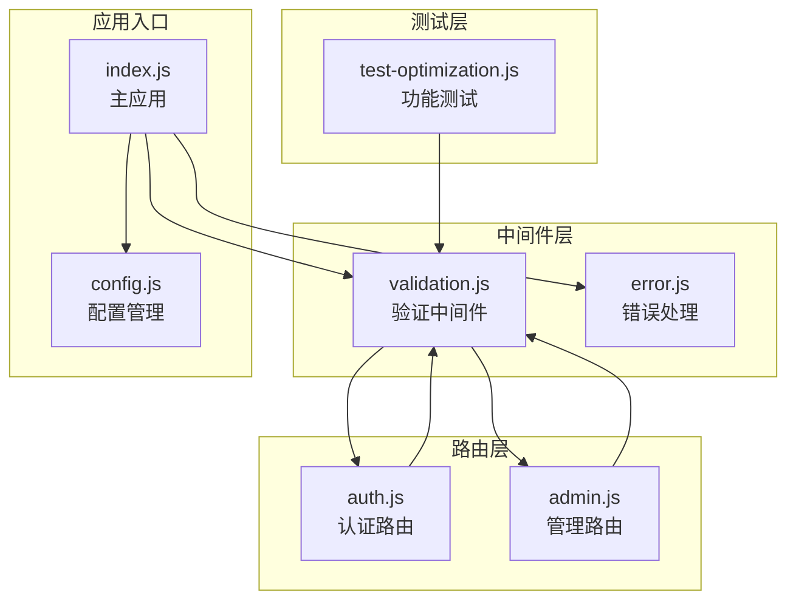
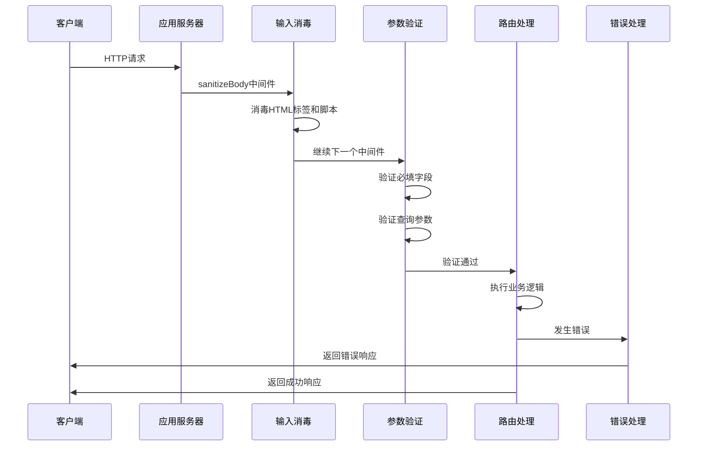
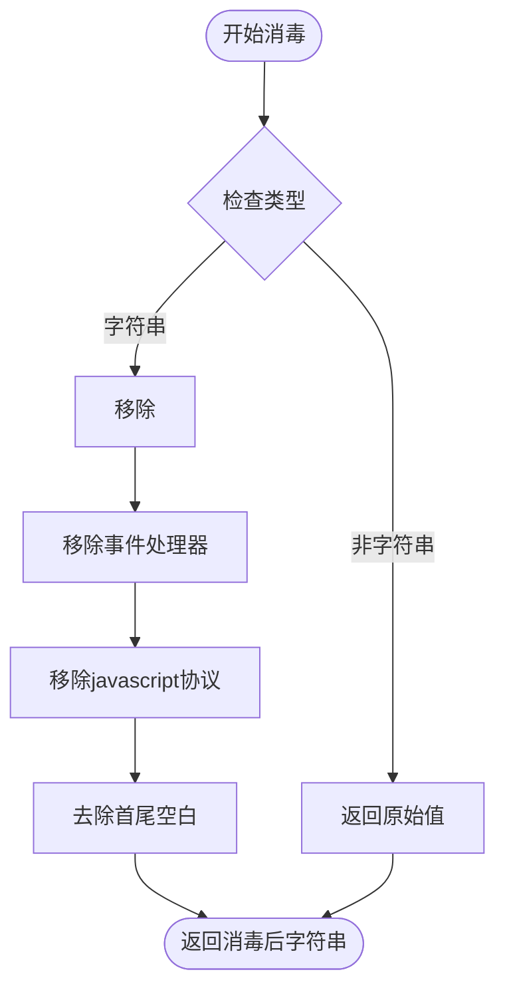
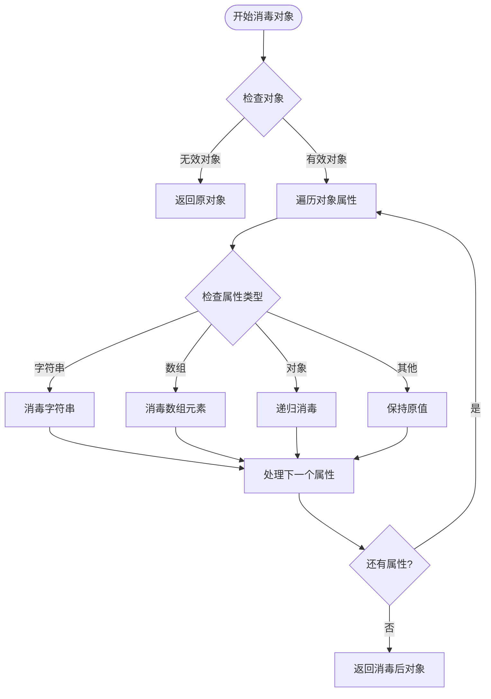
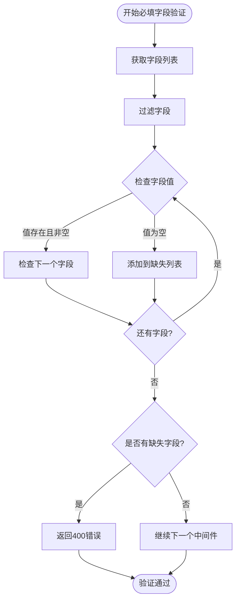
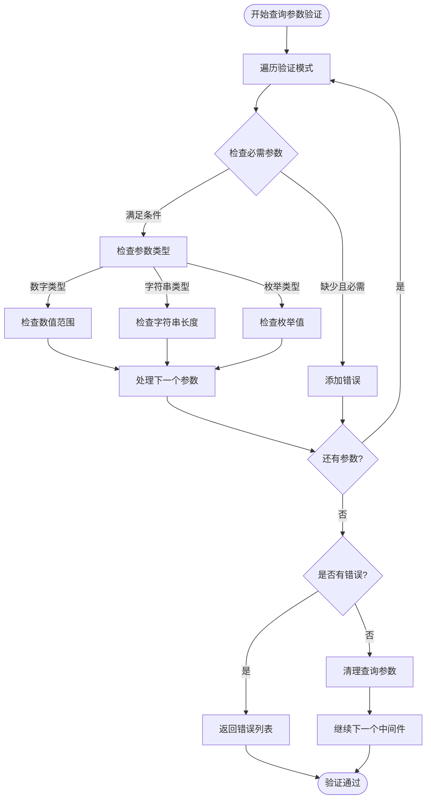
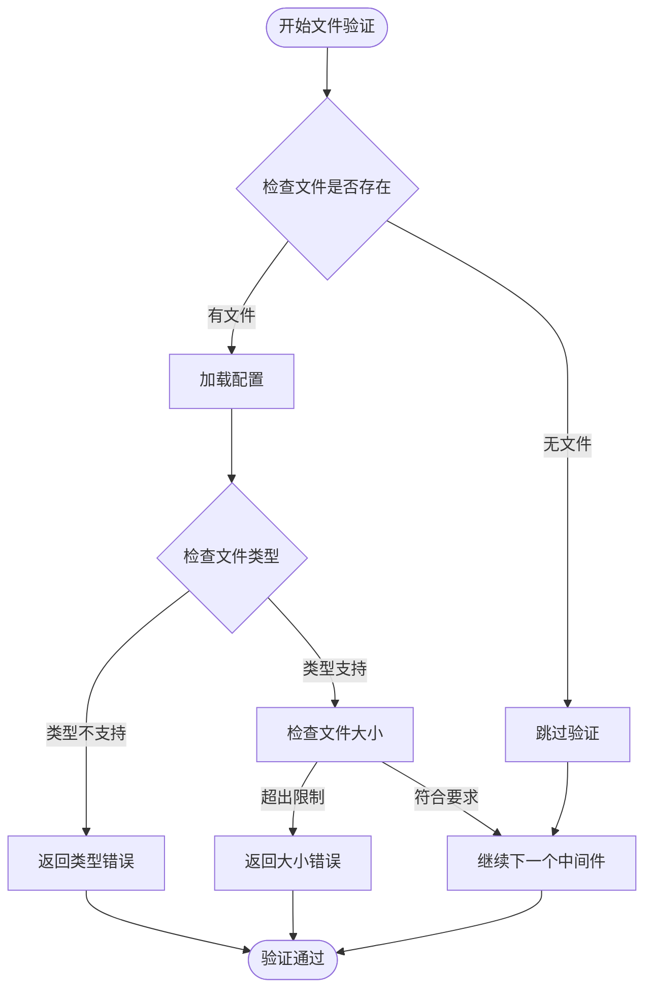
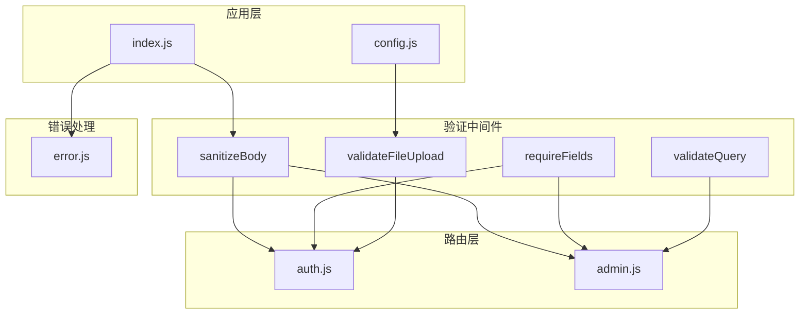

# 验证中间件

<cite>
**本文档引用的文件**
- [validation.js](file://backend/middleware/validation.js)
- [auth.js](file://backend/routes/auth.js)
- [admin.js](file://backend/routes/admin.js)
- [index.js](file://backend/index.js)
- [config.js](file://backend/config.js)
- [error.js](file://backend/middleware/error.js)
- [test-optimization.js](file://backend/test-optimization.js)
</cite>

## 目录
1. [简介](#简介)
2. [项目结构](#项目结构)
3. [核心组件](#核心组件)
4. [架构概览](#架构概览)
5. [详细组件分析](#详细组件分析)
6. [依赖关系分析](#依赖关系分析)
7. [性能考虑](#性能考虑)
8. [故障排除指南](#故障排除指南)
9. [结论](#结论)

## 简介

验证中间件系统是本项目安全架构的重要组成部分，负责确保所有传入请求的数据都经过适当的验证和消毒处理。该系统提供了多层次的安全防护，包括输入消毒、参数验证、格式检查、长度限制、枚举验证等功能，有效防止了XSS攻击、SQL注入等常见安全威胁。

系统采用Express.js框架构建，通过中间件机制在请求进入业务逻辑之前进行统一的数据验证和处理。验证中间件不仅处理HTTP请求参数，还负责文件上传验证和全局输入消毒，确保整个应用的数据安全性。

## 项目结构

验证中间件系统主要分布在以下目录结构中：



**图表来源**
- [validation.js:1-192](file://backend/middleware/validation.js#L1-L192)
- [index.js:1-800](file://backend/index.js#L1-L800)

**章节来源**
- [validation.js:1-192](file://backend/middleware/validation.js#L1-L192)
- [index.js:1-800](file://backend/index.js#L1-L800)

## 核心组件

验证中间件系统包含以下核心组件：

### 1. 输入消毒中间件
- **sanitizeBody**: 全局请求体消毒中间件
- **sanitizeString**: 字符串消毒函数
- **sanitizeObject**: 对象消毒函数

### 2. 参数验证组件
- **requireFields**: 必填字段验证
- **validateQuery**: 查询参数验证
- **validatePhone**: 手机号格式验证
- **validateEmail**: 邮箱格式验证

### 3. 文件验证组件
- **validateFileUpload**: 文件上传验证

### 4. 安全防护组件
- **XSS防护**: 移除脚本标签和事件处理器
- **SQL注入防护**: 通过消毒机制防止恶意输入

**章节来源**
- [validation.js:51-57](file://backend/middleware/validation.js#L51-L57)
- [validation.js:78-98](file://backend/middleware/validation.js#L78-L98)
- [validation.js:102-149](file://backend/middleware/validation.js#L102-L149)
- [validation.js:154-180](file://backend/middleware/validation.js#L154-L180)

## 架构概览

验证中间件系统采用分层架构设计，通过Express.js的中间件机制实现请求拦截和数据处理：



**图表来源**
- [index.js:80-81](file://backend/index.js#L80-L81)
- [validation.js:51-57](file://backend/middleware/validation.js#L51-L57)
- [validation.js:78-98](file://backend/middleware/validation.js#L78-L98)

系统的核心执行流程如下：

1. **全局消毒**: 所有请求在进入路由处理前都会经过sanitizeBody中间件
2. **参数验证**: 根据路由配置应用相应的验证规则
3. **业务处理**: 验证通过后执行具体的业务逻辑
4. **错误处理**: 统一捕获和处理各种类型的错误

**章节来源**
- [index.js:80-81](file://backend/index.js#L80-L81)
- [auth.js:96-147](file://backend/routes/auth.js#L96-L147)
- [admin.js:66-111](file://backend/routes/admin.js#L66-L111)

## 详细组件分析

### 输入消毒中间件

输入消毒中间件是整个验证系统的基础，负责移除潜在的恶意内容：

#### sanitizeString函数
该函数专门处理字符串输入，提供多层防护：



**图表来源**
- [validation.js:9-22](file://backend/middleware/validation.js#L9-L22)

消毒规则包括：
- 移除所有`<script>`标签及其内容
- 移除HTML事件属性（如onclick、onload等）
- 移除javascript协议
- 去除首尾空白字符

#### sanitizeObject函数
该函数递归处理复杂对象结构：



**图表来源**
- [validation.js:27-47](file://backend/middleware/validation.js#L27-L47)

**章节来源**
- [validation.js:9-47](file://backend/middleware/validation.js#L9-L47)

### 参数验证组件

#### requireFields中间件
必填字段验证确保关键数据的存在性：



**图表来源**
- [validation.js:78-98](file://backend/middleware/validation.js#L78-L98)

支持嵌套字段访问，使用点号语法（如`user.name`）。

#### validateQuery中间件
查询参数验证提供灵活的参数校验规则：



**图表来源**
- [validation.js:102-149](file://backend/middleware/validation.js#L102-L149)

验证规则包括：
- **类型检查**: 支持number和string类型
- **长度限制**: 字符串最大长度验证
- **数值范围**: 最小值和最大值检查
- **枚举验证**: 限定值集合检查
- **必需参数**: 必填字段检查

**章节来源**
- [validation.js:78-149](file://backend/middleware/validation.js#L78-L149)

### 文件上传验证

文件上传验证确保上传文件的安全性和合规性：



**图表来源**
- [validation.js:154-180](file://backend/middleware/validation.js#L154-L180)

验证规则包括：
- **类型限制**: 通过配置文件定义允许的MIME类型
- **大小限制**: 通过配置文件定义最大文件大小
- **动态配置**: 支持运行时修改验证规则

**章节来源**
- [validation.js:154-180](file://backend/middleware/validation.js#L154-L180)

### 安全防护机制

#### XSS防护
系统通过多种方式防止跨站脚本攻击：

1. **脚本标签移除**: 使用正则表达式移除`<script>`标签
2. **事件处理器清理**: 移除HTML事件属性（如`onclick`、`onload`等）
3. **JavaScript协议过滤**: 防止`javascript:`协议的使用
4. **HTML实体编码**: 对特殊字符进行适当处理

#### SQL注入防护
虽然项目使用JSON文件存储而非直接SQL查询，但消毒机制同样适用于防止潜在的注入攻击：

1. **输入消毒**: 所有用户输入都会经过消毒处理
2. **参数验证**: 严格的参数类型和格式检查
3. **白名单机制**: 枚举验证确保只有允许的值被接受

**章节来源**
- [validation.js:9-22](file://backend/middleware/validation.js#L9-L22)
- [validation.js:62-74](file://backend/middleware/validation.js#L62-L74)

## 依赖关系分析

验证中间件系统与其他组件的依赖关系如下：



**图表来源**
- [index.js:18-18](file://backend/index.js#L18-L18)
- [auth.js:12-12](file://backend/routes/auth.js#L12-L12)
- [admin.js:18-18](file://backend/routes/admin.js#L18-L18)

### 中间件执行顺序

验证中间件的执行顺序遵循Express.js的标准中间件链：

1. **全局消毒**: `sanitizeBody`始终在最前面执行
2. **参数验证**: 根据路由配置按顺序执行
3. **业务处理**: 验证通过后执行路由处理函数
4. **错误处理**: 统一的错误处理中间件

### 配置依赖

验证中间件依赖以下配置：

- **文件上传配置**: 从`config.upload`读取允许的文件类型和大小限制
- **JWT配置**: 用于认证相关的验证
- **环境配置**: 根据NODE_ENV决定错误信息的详细程度

**章节来源**
- [index.js:18-18](file://backend/index.js#L18-L18)
- [auth.js:12-12](file://backend/routes/auth.js#L12-L12)
- [admin.js:18-18](file://backend/routes/admin.js#L18-L18)
- [config.js:55-60](file://backend/config.js#L55-L60)

## 性能考虑

验证中间件系统在保证安全性的同时，也考虑了性能优化：

### 消毒算法复杂度
- **字符串消毒**: O(n)，其中n为字符串长度
- **对象消毒**: O(n)，其中n为对象中字符串属性的总长度
- **数组消毒**: O(n)，递归处理每个元素

### 内存使用
- 消毒过程创建新的对象副本，内存使用量约为原始数据的1.5-2倍
- 对于大型请求体，建议合理设置body-parser的大小限制

### 缓存策略
- 消毒规则相对固定，可以在应用启动时预编译正则表达式
- 配置变更时重新编译相关规则

### 并发处理
- 所有验证函数都是纯函数，线程安全
- 可以在多线程环境中安全使用

## 故障排除指南

### 常见问题及解决方案

#### 1. 验证规则配置错误
**症状**: 参数验证总是失败
**原因**: 验证模式配置不正确
**解决方案**: 检查`validateQuery`的schema配置，确保字段名和规则匹配

#### 2. XSS防护过度
**症状**: 正常文本被错误地移除
**原因**: 消毒规则过于严格
**解决方案**: 调整消毒规则或在业务逻辑中进行适当的文本处理

#### 3. 文件上传失败
**症状**: 文件上传总是返回错误
**原因**: 文件类型或大小不符合要求
**解决方案**: 检查`config.upload`配置，确认允许的文件类型和大小限制

#### 4. 性能问题
**症状**: 请求处理变慢
**原因**: 大型请求体的消毒处理
**解决方案**: 优化请求体大小，考虑分块处理大文件

### 调试技巧

#### 启用详细日志
在开发环境中，可以通过设置`NODE_ENV=development`来获取更详细的错误信息。

#### 单元测试
系统包含完整的单元测试，可以验证各个验证组件的功能：

```javascript
// 测试示例
test('验证中间件加载', () => {
  const validation = require('./middleware/validation');
  if (!validation.sanitizeBody) throw new Error('sanitizeBody未定义');
  if (!validation.validatePhone) throw new Error('validatePhone未定义');
  if (!validation.requireFields) throw new Error('requireFields未定义');
});
```

**章节来源**
- [error.js:9-62](file://backend/middleware/error.js#L9-L62)
- [test-optimization.js:84-89](file://backend/test-optimization.js#L84-L89)

## 结论

验证中间件系统为本项目提供了全面的安全防护机制。通过多层次的验证和消毒处理，有效防止了常见的安全威胁，包括XSS攻击、参数注入等。

系统的主要优势包括：

1. **模块化设计**: 各个验证组件职责明确，易于维护和扩展
2. **灵活性**: 支持自定义验证规则和配置
3. **性能优化**: 采用高效的消毒算法和合理的内存管理
4. **错误处理**: 完善的错误处理机制，提供友好的错误信息
5. **测试覆盖**: 包含完整的单元测试，确保功能可靠性

未来可以考虑的改进方向：
- 添加更多的内置验证规则
- 实现更精细的性能监控
- 增强日志记录功能
- 提供更灵活的配置管理

通过持续的优化和完善，验证中间件系统将继续为项目的稳定运行提供可靠保障。