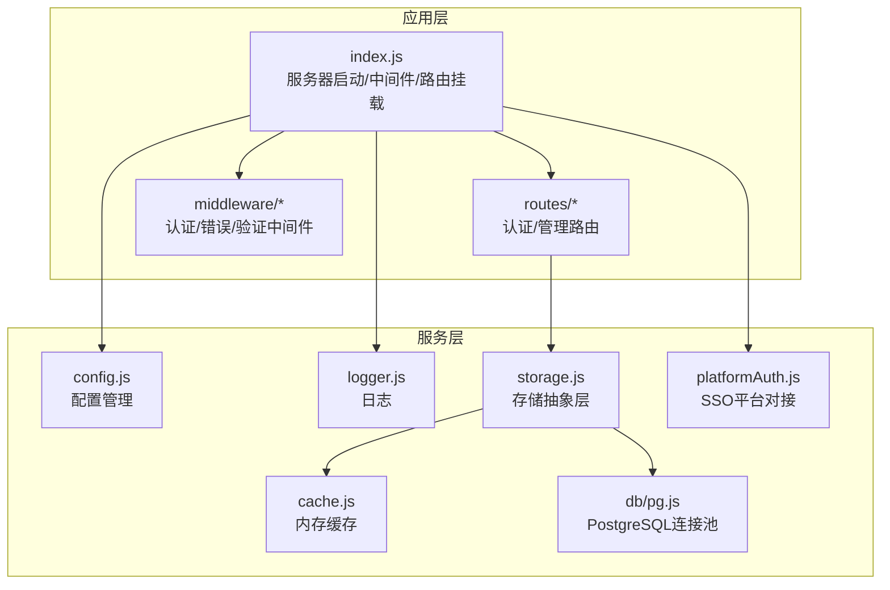
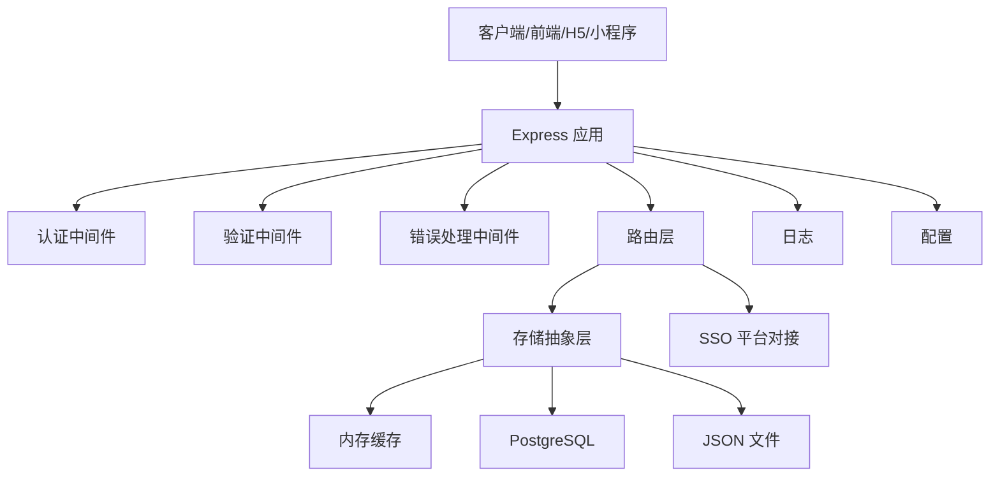
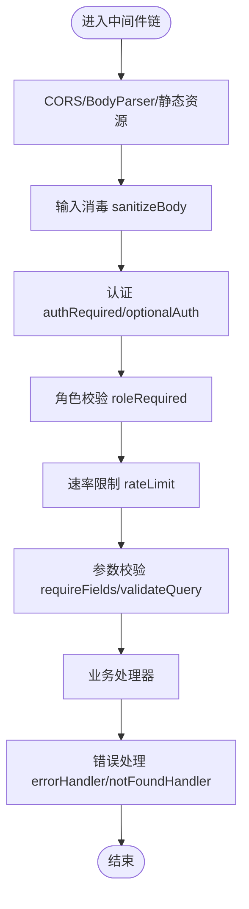
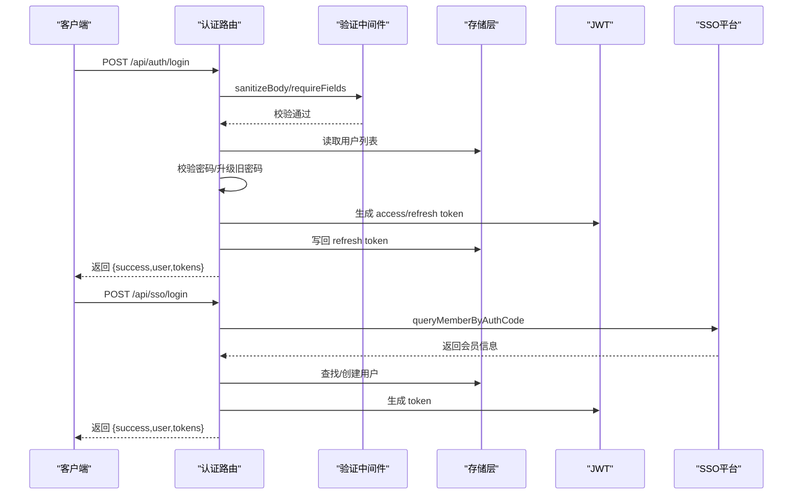
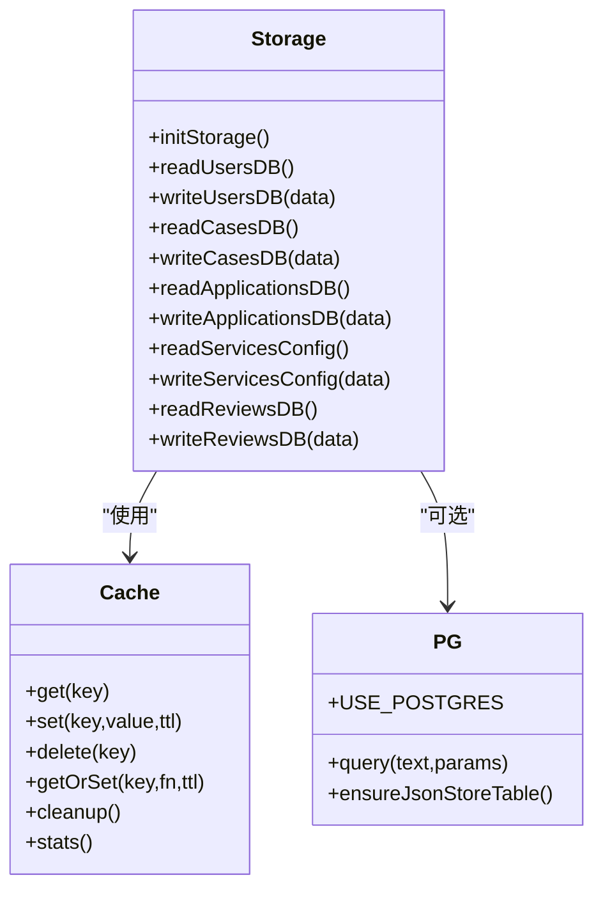
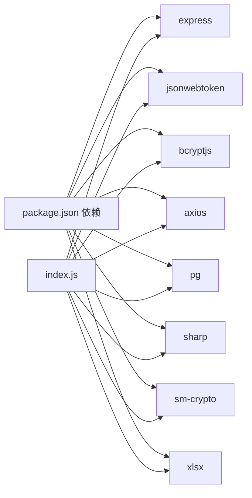

# 后端服务架构

<cite>
**本文引用的文件**
- [backend/index.js](file://backend/index.js)
- [backend/config.js](file://backend/config.js)
- [backend/logger.js](file://backend/logger.js)
- [backend/storage.js](file://backend/storage.js)
- [backend/cache.js](file://backend/cache.js)
- [backend/db/pg.js](file://backend/db/pg.js)
- [backend/platformAuth.js](file://backend/platformAuth.js)
- [backend/middleware/auth.js](file://backend/middleware/auth.js)
- [backend/middleware/error.js](file://backend/middleware/error.js)
- [backend/middleware/validation.js](file://backend/middleware/validation.js)
- [backend/routes/auth.js](file://backend/routes/auth.js)
- [backend/routes/admin.js](file://backend/routes/admin.js)
- [backend/package.json](file://backend/package.json)
</cite>

## 目录
1. [简介](#简介)
2. [项目结构](#项目结构)
3. [核心组件](#核心组件)
4. [架构总览](#架构总览)
5. [详细组件分析](#详细组件分析)
6. [依赖关系分析](#依赖关系分析)
7. [性能考量](#性能考量)
8. [故障排查指南](#故障排查指南)
9. [结论](#结论)
10. [附录](#附录)

## 简介
本文件面向低空飞行服务平台后端服务，系统性梳理其服务架构与实现细节，重点覆盖以下方面：
- 服务器启动与配置：环境变量加载、配置校验、静态资源与图片压缩服务
- 路由系统设计：认证路由、管理路由、SSO与微信登录集成
- 中间件架构：认证/鉴权、输入消毒、参数校验、错误处理、速率限制
- 错误处理机制：统一错误响应、异步错误包装、404处理
- 认证与授权系统：JWT认证、用户权限模型、SSO单点登录、微信登录
- 数据存储系统：存储抽象层、JSON文件存储、PostgreSQL集成、缓存机制
- RESTful API 设计规范：接口文档、请求/响应格式、错误码定义
- 中间件工作原理、认证流程与数据处理逻辑
- 具体代码示例与使用模式

## 项目结构
后端采用 Express 应用，按功能模块分层组织：
- 核心入口与中间件：index.js、middleware/*
- 路由层：routes/*
- 存储与数据库：storage.js、db/pg.js、schema.sql（同目录）
- 平台对接：platformAuth.js
- 工具与配置：config.js、logger.js、cache.js
- 前端静态资源：public/*

图表来源
- [backend/index.js:1-1401](file://backend/index.js#L1-L1401)
- [backend/routes/auth.js:1-591](file://backend/routes/auth.js#L1-L591)
- [backend/routes/admin.js:1-514](file://backend/routes/admin.js#L1-L514)
- [backend/middleware/auth.js:1-168](file://backend/middleware/auth.js#L1-L168)
- [backend/middleware/error.js:1-90](file://backend/middleware/error.js#L1-L90)
- [backend/middleware/validation.js:1-192](file://backend/middleware/validation.js#L1-L192)
- [backend/storage.js:1-197](file://backend/storage.js#L1-L197)
- [backend/cache.js:1-119](file://backend/cache.js#L1-L119)
- [backend/db/pg.js:1-56](file://backend/db/pg.js#L1-L56)
- [backend/platformAuth.js:1-177](file://backend/platformAuth.js#L1-L177)
- [backend/config.js:1-123](file://backend/config.js#L1-L123)
- [backend/logger.js:1-104](file://backend/logger.js#L1-L104)

章节来源
- [backend/index.js:1-1401](file://backend/index.js#L1-L1401)
- [backend/package.json:1-34](file://backend/package.json#L1-L34)

## 核心组件
- 服务器启动与配置
  - 环境变量加载与配置校验，打印运行配置
  - CORS、BodyParser、静态资源、请求日志中间件
  - 图片压缩服务端点
- 路由系统
  - 认证路由：登录、注册、刷新、登出、SSO、微信登录
  - 管理路由：统计、申请管理、用户管理、服务配置、评价管理
- 中间件架构
  - 认证/鉴权：Bearer Token 校验、可选认证、角色控制、速率限制
  - 输入消毒与参数校验：XSS 过滤、必填字段、查询参数校验、文件上传校验
  - 错误处理：统一错误响应、404、异步错误包装
- 数据存储系统
  - 抽象层：JSON 文件与 PostgreSQL 双栈支持
  - 缓存：内存缓存，针对不同数据设置 TTL
- 平台对接
  - SSO：基于 SM2/SM4 的加签与加密，对接畅行温州平台
  - 微信：小程序与公众号登录、手机号绑定

章节来源
- [backend/index.js:1-1401](file://backend/index.js#L1-L1401)
- [backend/routes/auth.js:1-591](file://backend/routes/auth.js#L1-L591)
- [backend/routes/admin.js:1-514](file://backend/routes/admin.js#L1-L514)
- [backend/middleware/auth.js:1-168](file://backend/middleware/auth.js#L1-L168)
- [backend/middleware/validation.js:1-192](file://backend/middleware/validation.js#L1-L192)
- [backend/middleware/error.js:1-90](file://backend/middleware/error.js#L1-L90)
- [backend/storage.js:1-197](file://backend/storage.js#L1-L197)
- [backend/cache.js:1-119](file://backend/cache.js#L1-L119)
- [backend/db/pg.js:1-56](file://backend/db/pg.js#L1-L56)
- [backend/platformAuth.js:1-177](file://backend/platformAuth.js#L1-L177)

## 架构总览
整体采用“Express + 中间件 + 存储抽象 + 平台对接”的分层架构，支持本地 JSON 文件与 PostgreSQL 两种持久化方案，并内置内存缓存提升读性能。

图表来源
- [backend/index.js:1-1401](file://backend/index.js#L1-L1401)
- [backend/storage.js:1-197](file://backend/storage.js#L1-L197)
- [backend/cache.js:1-119](file://backend/cache.js#L1-L119)
- [backend/db/pg.js:1-56](file://backend/db/pg.js#L1-L56)
- [backend/platformAuth.js:1-177](file://backend/platformAuth.js#L1-L177)
- [backend/middleware/auth.js:1-168](file://backend/middleware/auth.js#L1-L168)
- [backend/middleware/validation.js:1-192](file://backend/middleware/validation.js#L1-L192)
- [backend/middleware/error.js:1-90](file://backend/middleware/error.js#L1-L90)
- [backend/logger.js:1-104](file://backend/logger.js#L1-L104)
- [backend/config.js:1-123](file://backend/config.js#L1-L123)

## 详细组件分析

### 服务器启动与配置
- 环境变量加载与配置校验
  - 通过 dotenv 加载 .env；对 JWT 密钥长度、微信配置、SSO 参数进行校验
  - 生产环境强制 JWT 密钥长度≥32
- 中间件链路
  - CORS、BodyParser、输入消毒、静态资源、请求日志、错误处理
- 图片压缩服务
  - 基于 sharp 对静态图片进行缩放与压缩，带缓存头
- 启动时初始化
  - 存储初始化（JSON 文件或 PostgreSQL 表）
  - 确保管理员账户存在（含历史兼容）

章节来源
- [backend/index.js:1-1401](file://backend/index.js#L1-L1401)
- [backend/config.js:1-123](file://backend/config.js#L1-L123)

### 路由系统设计
- 认证路由（routes/auth.js）
  - 登录/注册/刷新/登出
  - SSO 验证与自动注册
  - 微信公众号与小程序登录
- 管理路由（routes/admin.js）
  - 统计数据、申请管理、导出 Excel
  - 用户管理、角色变更
  - 服务配置（按角色隔离）
  - 评价管理（审核/删除）

章节来源
- [backend/routes/auth.js:1-591](file://backend/routes/auth.js#L1-L591)
- [backend/routes/admin.js:1-514](file://backend/routes/admin.js#L1-L514)

### 中间件架构
- 认证与权限
  - authRequired：Bearer Token 校验，注入用户信息
  - optionalAuth：可选认证，忽略无效 token
  - roleRequired：角色白名单校验
  - rateLimit：基于 Map 的简单滑动窗口限流
- 输入消毒与参数校验
  - sanitizeBody：递归清洗字符串字段，移除脚本与事件属性
  - requireFields：必填字段校验
  - validateQuery：查询参数类型/范围/枚举校验
  - validateFileUpload：类型与大小校验
- 错误处理
  - errorHandler：统一错误响应，区分 JWT/PG/文件上传错误
  - notFoundHandler：404
  - asyncHandler：Promise.catch 包装

图表来源
- [backend/middleware/auth.js:1-168](file://backend/middleware/auth.js#L1-L168)
- [backend/middleware/validation.js:1-192](file://backend/middleware/validation.js#L1-L192)
- [backend/middleware/error.js:1-90](file://backend/middleware/error.js#L1-L90)

章节来源
- [backend/middleware/auth.js:1-168](file://backend/middleware/auth.js#L1-L168)
- [backend/middleware/validation.js:1-192](file://backend/middleware/validation.js#L1-L192)
- [backend/middleware/error.js:1-90](file://backend/middleware/error.js#L1-L90)

### 错误处理机制
- 统一响应结构
  - success: boolean
  - message: string
  - code: string（如 TOKEN_EXPIRED）
  - stack/detail（开发环境）
- 错误分类
  - JWT：TokenExpiredError、JsonWebTokenError
  - 文件上传：LIMIT_FILE_SIZE/LIMIT_UNEXPECTED_FILE
  - 数据库：PostgreSQL 约束违反（code 以 23 开头）
  - 404：接口不存在
- 异步错误包装
  - asyncHandler 将 Promise 异常透传给统一错误处理器

章节来源
- [backend/middleware/error.js:1-90](file://backend/middleware/error.js#L1-L90)

### 认证与授权系统
- JWT 认证机制
  - 生成：access token（短期）与 refresh token（长期）
  - 校验：Bearer Token，支持可选认证
  - 刷新：校验 refresh token 并签发新 token
  - 登出：清除用户 refresh token
- 用户权限管理
  - 角色：user、admin、dsl_admin、study_admin
  - 角色路由保护：roleRequired
  - 管理员账户初始化与兼容旧密码
- SSO 单点登录
  - 平台对接：SM2/SM4 加解密与签名
  - 授权入口与验证接口，支持自动注册
- 微信登录集成
  - 小程序 code→session：查找/创建用户并发放 token
  - 公众号授权：授权 URL 生成与回调，获取用户信息并发放 token
  - 手机号绑定：通过 access_token 获取用户手机号

图表来源
- [backend/routes/auth.js:1-591](file://backend/routes/auth.js#L1-L591)
- [backend/platformAuth.js:1-177](file://backend/platformAuth.js#L1-L177)
- [backend/storage.js:1-197](file://backend/storage.js#L1-L197)

章节来源
- [backend/routes/auth.js:1-591](file://backend/routes/auth.js#L1-L591)
- [backend/platformAuth.js:1-177](file://backend/platformAuth.js#L1-L177)
- [backend/middleware/auth.js:1-168](file://backend/middleware/auth.js#L1-L168)

### 数据存储系统
- 存储抽象层
  - JSON 文件：users.json、cases.json、applications.json、services_config.json、reviews.json
  - PostgreSQL：json_store 表（JSONB），支持双写与冲突更新
  - 初始化：根据 USE_POSTGRES 决定初始化策略
- 缓存机制
  - 内存缓存：Cache 类，支持 TTL、清理过期、统计
  - 缓存键：用户、申请、案例、服务配置、评价等
  - 读路径：getOrSet 回调加载，写路径：delete 清缓存
- 数据一致性
  - 写操作后主动清理对应缓存键
  - 读路径优先命中缓存，降低 IO

图表来源
- [backend/storage.js:1-197](file://backend/storage.js#L1-L197)
- [backend/cache.js:1-119](file://backend/cache.js#L1-L119)
- [backend/db/pg.js:1-56](file://backend/db/pg.js#L1-L56)

章节来源
- [backend/storage.js:1-197](file://backend/storage.js#L1-L197)
- [backend/cache.js:1-119](file://backend/cache.js#L1-L119)
- [backend/db/pg.js:1-56](file://backend/db/pg.js#L1-L56)

### RESTful API 设计规范
- 统一响应结构
  - 成功：{ success: true, data/... }
  - 失败：{ success: false, message, code? }
- 请求/响应格式
  - Content-Type: application/json
  - 查询参数：validateQuery 校验类型/范围/枚举
  - 文件上传：validateFileUpload 校验类型与大小
- 错误码定义
  - TOKEN_EXPIRED：令牌过期
  - 其他：根据错误类型映射（JWT/文件/数据库/通用）
- 接口示例（路径与方法）
  - 认证：POST /api/auth/login、POST /api/auth/register、POST /api/auth/refresh、POST /api/auth/logout、GET /api/auth/me
  - SSO：GET /sso/login、POST /api/sso/login、POST /api/sso/verify
  - 微信：POST /api/auth/wx-login、POST /api/auth/wx-phone、GET /api/auth/wechat-oauth-url、GET /api/auth/wechat-oauth/callback
  - 管理：GET /api/admin/stats、GET /api/admin/applications、POST /api/admin/applications/:id、GET /api/admin/applications/export、GET /api/admin/users、POST /api/admin/users/:id/role、GET /api/admin/services/config、POST /api/admin/services/config、GET /api/admin/study/showcase、POST /api/admin/study/showcase、GET /api/admin/reviews、POST /api/admin/reviews/:id、DELETE /api/admin/reviews/:id

章节来源
- [backend/routes/auth.js:1-591](file://backend/routes/auth.js#L1-L591)
- [backend/routes/admin.js:1-514](file://backend/routes/admin.js#L1-L514)
- [backend/middleware/error.js:1-90](file://backend/middleware/error.js#L1-L90)

## 依赖关系分析
- 核心依赖
  - express、cors、body-parser、multer、sharp、xlsx
  - jsonwebtoken、bcryptjs、axios
  - pg（PostgreSQL）、sm-crypto（SM2/SM4）
  - winston（日志，自定义 Logger）
- 模块耦合
  - index.js 作为入口，集中挂载中间件与路由
  - routes 依赖 storage 与 middleware，间接依赖 config/logger
  - storage 依赖 cache 与 db/pg，实现双栈切换
  - platformAuth 仅在认证路由中被调用

图表来源
- [backend/package.json:1-34](file://backend/package.json#L1-L34)
- [backend/index.js:1-1401](file://backend/index.js#L1-L1401)

章节来源
- [backend/package.json:1-34](file://backend/package.json#L1-L34)
- [backend/index.js:1-1401](file://backend/index.js#L1-L1401)

## 性能考量
- 缓存策略
  - 用户/案例/申请/配置/评价分别设置不同 TTL，减少磁盘 IO
  - 写操作后主动删除缓存键，保证一致性
- 存储选择
  - 开发/小规模：JSON 文件
  - 生产/高并发：PostgreSQL，支持事务与并发
- 图片处理
  - sharp 压缩与缓存头，减轻前端压力
- 速率限制
  - 基于 Map 的简单限流，防止暴力破解与滥用

## 故障排查指南
- 常见问题与定位
  - JWT 相关：检查密钥长度与过期时间；确认 Bearer Token 格式
  - 文件上传：检查类型与大小限制；查看 Multer 错误码
  - PostgreSQL：检查连接串/SSL 配置；关注约束违反错误
  - SSO：检查平台地址、SM2/SM4 密钥与签名流程
- 日志与监控
  - 使用 Logger 输出结构化日志，结合请求上下文定位问题
  - 生产环境避免暴露堆栈，开发环境可开启详细信息

章节来源
- [backend/middleware/error.js:1-90](file://backend/middleware/error.js#L1-L90)
- [backend/logger.js:1-104](file://backend/logger.js#L1-L104)
- [backend/platformAuth.js:1-177](file://backend/platformAuth.js#L1-L177)

## 结论
该后端服务以 Express 为核心，通过中间件实现横切关注点，采用存储抽象层支持多后端，结合内存缓存与平台对接能力，形成一套可扩展、可维护的服务架构。建议在生产环境中启用 PostgreSQL、强化密钥管理与安全审计，并持续优化缓存策略与限流规则。

## 附录
- 环境变量与配置项
  - JWT：JWT_SECRET、ACCESS_TOKEN_TTL、REFRESH_TOKEN_TTL
  - 管理员：SUPER_ADMIN_PHONE、默认密码（随机生成）
  - 微信：WX_APPID/WX_SECRET、WX_MP_APPID/WX_MP_SECRET
  - SSO：PLATFORM_*（含 SM2 私钥与 SM4 密钥）
  - 数据库：USE_POSTGRES、PG_URL/PG_*、PG_SSL
  - 上传：UPLOAD_DIR、MAX_FILE_SIZE、ALLOWED_FILE_TYPES
  - 服务器：PORT、NODE_ENV、CORS_ORIGIN、BASE_URL、FRONTEND_URL
- 启动与迁移
  - npm scripts：start、dev、migrate:pg、setup
  - 运行前确保 .env 配置完整

章节来源
- [backend/config.js:1-123](file://backend/config.js#L1-L123)
- [backend/package.json:1-34](file://backend/package.json#L1-L34)