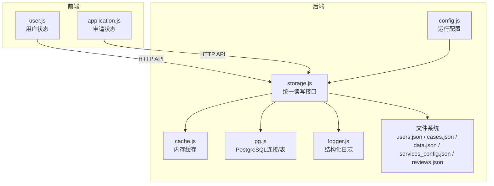
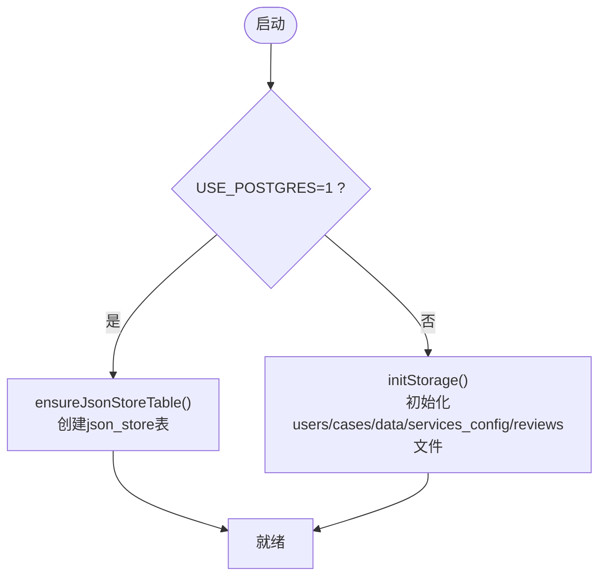
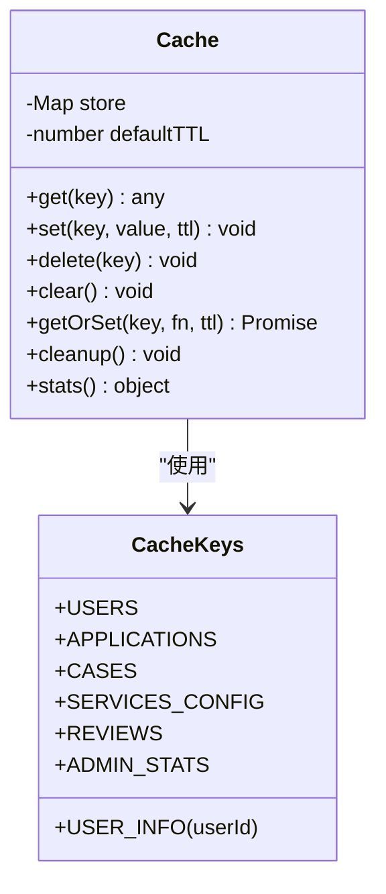
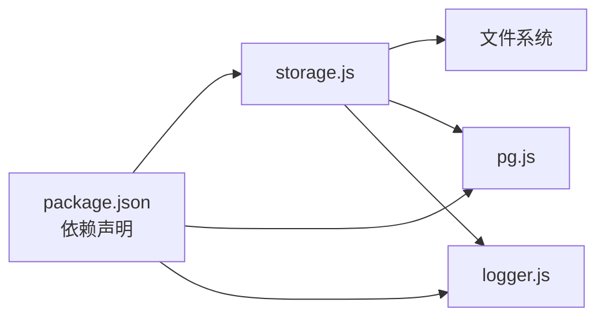

# JSON文件存储

<cite>
**本文引用的文件**
- [storage.js](file://backend/storage.js)
- [pg.js](file://backend/db/pg.js)
- [cache.js](file://backend/cache.js)
- [logger.js](file://backend/logger.js)
- [users.json](file://backend/users.json)
- [cases.json](file://backend/cases.json)
- [data.json](file://backend/data.json)
- [services_config.json](file://backend/services_config.json)
- [reviews.json](file://backend/reviews.json)
- [package.json](file://backend/package.json)
- [config.js](file://backend/config.js)
- [user.js](file://frontend/h5/src/stores/user.js)
- [application.js](file://frontend/h5/src/stores/application.js)
</cite>

## 目录
1. [简介](#简介)
2. [项目结构](#项目结构)
3. [核心组件](#核心组件)
4. [架构总览](#架构总览)
5. [详细组件分析](#详细组件分析)
6. [依赖分析](#依赖分析)
7. [性能考虑](#性能考虑)
8. [故障排查指南](#故障排查指南)
9. [结论](#结论)
10. [附录](#附录)

## 简介
本文件系统采用“JSON文件 + 内存缓存 + 可选PostgreSQL后备”的混合存储架构，用于支撑平台的用户、案例、申请、服务配置与评价等数据持久化。其设计目标是在开发与轻量生产环境中提供简单可靠的读写能力，同时通过缓存降低文件IO压力，通过PostgreSQL实现可扩展的数据存储。

## 项目结构
- 存储层位于 backend/storage.js，负责统一的JSON文件读写与缓存集成。
- 数据文件位于 backend/ 目录下，分别对应不同业务实体：
  - users.json：用户数据
  - cases.json：案例数据
  - data.json：申请/订单数据
  - services_config.json：服务配置
  - reviews.json：评价数据
- 缓存层位于 backend/cache.js，提供基于内存的键值缓存与TTL管理。
- PostgreSQL支持位于 backend/db/pg.js，当启用时，存储层切换至json_store表。
- 日志与配置位于 backend/logger.js 与 backend/config.js，提供结构化日志与运行时配置。
- 前端Pinia Store位于 frontend/h5/src/stores/，用于管理用户态与申请态数据，与后端API交互。

**图示来源**
- [storage.js:1-197](file://backend/storage.js#L1-L197)
- [cache.js:1-119](file://backend/cache.js#L1-L119)
- [pg.js:1-56](file://backend/db/pg.js#L1-L56)
- [logger.js:1-104](file://backend/logger.js#L1-L104)
- [config.js:1-123](file://backend/config.js#L1-L123)
- [user.js:1-177](file://frontend/h5/src/stores/user.js#L1-L177)
- [application.js:1-177](file://frontend/h5/src/stores/application.js#L1-L177)

**章节来源**
- [storage.js:1-197](file://backend/storage.js#L1-L197)
- [cache.js:1-119](file://backend/cache.js#L1-L119)
- [pg.js:1-56](file://backend/db/pg.js#L1-L56)
- [logger.js:1-104](file://backend/logger.js#L1-L104)
- [config.js:1-123](file://backend/config.js#L1-L123)

## 核心组件
- 统一存储接口
  - 初始化：自动创建缺失的数据文件或PostgreSQL表
  - 读取：按键返回对应JSON数据，支持回退值
  - 写入：按键写入JSON数据，返回布尔结果
- 缓存策略
  - 针对不同实体设置不同的TTL，减少重复读取
  - 写入后主动删除对应缓存键，保证一致性
- 文件组织
  - 每个业务实体一个独立JSON文件，便于维护与备份
- 日志与错误处理
  - 读写失败时记录结构化日志，便于问题定位

**章节来源**
- [storage.js:42-132](file://backend/storage.js#L42-L132)
- [cache.js:54-98](file://backend/cache.js#L54-L98)

## 架构总览
存储层在运行时根据配置决定数据持久化路径：
- 若启用PostgreSQL（USE_POSTGRES=1），则使用json_store表进行读写
- 否则使用本地JSON文件进行读写

**图示来源**
- [pg.js:39-48](file://backend/db/pg.js#L39-L48)
- [storage.js:42-63](file://backend/storage.js#L42-L63)

## 详细组件分析

### 统一存储接口（storage.js）
- 关键职责
  - 定义JSON键映射与文件路径
  - 提供读写函数，封装错误处理与日志
  - 在PostgreSQL模式下，兼容历史字符串序列化数据
- 读取流程
  - 非PG模式：根据键匹配文件路径，读取并解析JSON
  - PG模式：查询json_store表，若数据为字符串则尝试二次解析
- 写入流程
  - 非PG模式：将数据序列化为JSON并写入对应文件
  - PG模式：直接写入JSONB列，自动处理序列化

```mermaid
sequenceDiagram
participant C as "调用方"
participant S as "storage.js"
participant F as "文件系统"
participant P as "PostgreSQL"
C->>S : readJsonStore(key)
alt 非PG模式
S->>F : 读取对应JSON文件
F-->>S : 返回JSON数据
else PG模式
S->>P : 查询json_store表
P-->>S : 返回JSONB/字符串
S->>S : 如为字符串则JSON.parse()
end
S-->>C : 返回数据
C->>S : writeJsonStore(key, data)
alt 非PG模式
S->>F : 写入JSON文件
F-->>S : 成功/失败
else PG模式
S->>P : INSERT/UPDATE json_store
P-->>S : 成功
end
S-->>C : 返回布尔结果
```

**图示来源**
- [storage.js:65-132](file://backend/storage.js#L65-L132)
- [pg.js:31-37](file://backend/db/pg.js#L31-L37)

**章节来源**
- [storage.js:13-197](file://backend/storage.js#L13-L197)

### 缓存层（cache.js）
- 设计要点
  - 基于Map的内存缓存，支持TTL过期
  - 提供getOrSet回调式获取/设置
  - 定时清理过期项，避免内存泄漏
- TTL策略
  - 用户：60秒
  - 案例：5分钟
  - 申请：1分钟
  - 服务配置：5分钟
  - 评价：60秒

**图示来源**
- [cache.js:5-99](file://backend/cache.js#L5-L99)

**章节来源**
- [cache.js:1-119](file://backend/cache.js#L1-L119)

### 数据文件与格式规范

- users.json（用户数据）
  - 结构：数组，元素为用户对象
  - 字段示例：id、phone、password、name、role、avatar、createTime、passwordHash、refreshToken、refreshTokenExpiresAt
  - 用途：用户认证与权限管理
  - 访问：readUsersDB/writeUsersDB

- cases.json（案例数据）
  - 结构：数组，元素为案例对象
  - 字段示例：id、title、description、location、date、coverType、cover、media、highlights、categoryId、service
  - 用途：展示低空经济相关案例
  - 访问：readCasesDB/writeCasesDB

- data.json（申请/订单数据）
  - 结构：数组，元素为申请对象
  - 字段示例：id、createTime、contactName、contactPhone、serviceName、serviceId、status、以及与具体服务相关的字段
  - 用途：管理各类服务的申请与处理流程
  - 访问：readApplicationsDB/writeApplicationsDB

- services_config.json（服务配置）
  - 结构：对象，键为服务ID，值为服务配置对象
  - 字段示例：name、slogan、icon、color、mainColor、intro、projects、advantages、contactPhone、address、以及与培训、研学等服务相关的复杂字段
  - 用途：前端渲染与服务目录管理
  - 访问：readServicesConfig/writeServicesConfig

- reviews.json（评价数据）
  - 结构：数组，元素为评价对象
  - 字段示例：id、userId、userName、userAvatar、isAnonymous、section、rating、content、courseName、images、status、createTime、reviewTime
  - 用途：展示与管理用户评价
  - 访问：readReviewsDB/writeReviewsDB

**章节来源**
- [users.json:1-58](file://backend/users.json#L1-L58)
- [cases.json:1-88](file://backend/cases.json#L1-L88)
- [data.json:1-594](file://backend/data.json#L1-L594)
- [services_config.json:1-1230](file://backend/services_config.json#L1-L1230)
- [reviews.json:1-54](file://backend/reviews.json#L1-L54)

### 文件锁机制
- 当前实现未显式使用文件锁（如flock）。在并发写入时，存在竞态风险，可能导致数据损坏或部分写入。
- 建议在生产环境引入文件锁或采用PostgreSQL以获得原子性与并发控制。

**章节来源**
- [storage.js:32-40](file://backend/storage.js#L32-L40)

### 读写操作实现细节
- 读取
  - 非PG：同步读取文件字节流，解析JSON，异常时返回回退值并记录日志
  - PG：查询JSONB列，若为字符串则二次解析，异常时返回回退值
- 写入
  - 非PG：序列化为JSON字符串写入文件，异常时记录日志
  - PG：直接写入JSONB列，自动序列化
- 缓存
  - 读：优先命中缓存，否则从存储层加载并写入缓存
  - 写：先删除缓存键，再写入存储层

**章节来源**
- [storage.js:21-40](file://backend/storage.js#L21-L40)
- [storage.js:65-132](file://backend/storage.js#L65-L132)
- [cache.js:54-98](file://backend/cache.js#L54-L98)

## 依赖分析
- 运行时依赖
  - Node.js fs/path：文件系统操作
  - winston（通过logger.js封装）：结构化日志
  - pg：PostgreSQL客户端（可选）
  - bcryptjs/jsonwebtoken/sm-crypto/gm-crypto等：安全与加密功能（与存储无直接耦合）
- 配置依赖
  - USE_POSTGRES：控制存储后端
  - PG_* 环境变量：PostgreSQL连接参数
  - LOG_DIR/LOG_LEVEL：日志目录与级别
- 前端依赖
  - Pinia：状态管理
  - axios：HTTP请求
  - 与后端API交互，间接依赖存储层

**图示来源**
- [package.json:12-28](file://backend/package.json#L12-L28)
- [storage.js:1-6](file://backend/storage.js#L1-L6)

**章节来源**
- [package.json:1-34](file://backend/package.json#L1-L34)
- [config.js:42-53](file://backend/config.js#L42-L53)

## 性能考虑
- 优点
  - 读写简单，延迟低；缓存显著降低文件IO
  - 无需数据库连接池与复杂事务
- 局限
  - 文件系统随机访问与顺序写入的性能差异
  - 并发写入无锁，易产生竞争
  - 大文件增长导致的碎片与磁盘IO放大
- 优化建议
  - 引入文件锁或切换至PostgreSQL
  - 对热点文件采用追加写策略（如分片/滚动文件）
  - 增加写入批处理与合并策略
  - 使用更快的SSD与合适的文件系统（如ext4/XFS）

[本节为通用性能讨论，不直接分析具体文件，故无“章节来源”]

## 故障排查指南
- 常见问题
  - 文件不存在：initStorage会在启动时创建缺失文件
  - JSON解析失败：readJsonFile捕获异常并返回回退值，同时记录错误日志
  - 写入失败：writeJsonFile捕获异常并返回false，同时记录错误日志
  - PG禁用：当USE_POSTGRES非1时，query会抛错提示启用PG
- 排查步骤
  - 检查日志目录与级别（LOG_DIR/LOG_LEVEL）
  - 确认USE_POSTGRES与PG_*环境变量
  - 验证文件权限与磁盘空间
  - 使用缓存统计接口观察命中率与过期情况
- 相关实现
  - 日志记录：logger.js
  - 配置校验：config.js
  - 缓存清理：cache.js

**章节来源**
- [storage.js:21-40](file://backend/storage.js#L21-L40)
- [storage.js:82-99](file://backend/storage.js#L82-L99)
- [pg.js:31-37](file://backend/db/pg.js#L31-L37)
- [logger.js:32-94](file://backend/logger.js#L32-L94)
- [config.js:78-104](file://backend/config.js#L78-L104)
- [cache.js:72-98](file://backend/cache.js#L72-L98)

## 结论
该JSON文件存储系统以极简方式实现了多实体数据持久化，配合内存缓存显著降低了IO压力。在开发与轻量生产场景中具备良好可用性；但在高并发与可靠性方面存在改进空间。建议在生产环境中启用PostgreSQL，以获得更强的一致性、并发控制与运维能力。

[本节为总结性内容，不直接分析具体文件，故无“章节来源”]

## 附录

### 数据文件作用一览
- users.json：用户账户与权限
- cases.json：案例展示
- data.json：申请/订单生命周期
- services_config.json：服务目录与配置
- reviews.json：用户评价与审核

**章节来源**
- [users.json:1-58](file://backend/users.json#L1-L58)
- [cases.json:1-88](file://backend/cases.json#L1-L88)
- [data.json:1-594](file://backend/data.json#L1-L594)
- [services_config.json:1-1230](file://backend/services_config.json#L1-L1230)
- [reviews.json:1-54](file://backend/reviews.json#L1-L54)

### 迁移策略
- 从JSON文件迁移到PostgreSQL
  - 步骤：导出各JSON文件为中间格式 → 在PG中创建json_store表 → 导入数据 → 修改USE_POSTGRES=1 → 验证读写
  - 注意：PG模式下兼容历史字符串序列化数据，避免破坏性升级
- 从PostgreSQL迁移到JSON文件
  - 步骤：导出json_store表为JSON → 替换对应文件 → 修改USE_POSTGRES=0 → 验证读写

**章节来源**
- [pg.js:39-48](file://backend/db/pg.js#L39-L48)
- [storage.js:82-99](file://backend/storage.js#L82-L99)

### 数据备份方案
- 文件备份
  - 定期复制JSON文件至备份目录
  - 使用快照或版本化存储（如S3/GCS）
- 数据库备份
  - 使用pg_dump导出json_store表
  - 结合时间点恢复（PITR）策略

**章节来源**
- [pg.js:31-37](file://backend/db/pg.js#L31-L37)

### 故障恢复机制
- 自愈
  - initStorage在启动时自动创建缺失文件
  - readJsonStore在解析失败时返回回退值，避免崩溃
- 人工干预
  - 检查日志定位错误
  - 回滚到最近一次备份
  - 切换存储后端（PG↔文件）验证数据一致性

**章节来源**
- [storage.js:42-63](file://backend/storage.js#L42-L63)
- [storage.js:65-81](file://backend/storage.js#L65-L81)
- [logger.js:32-94](file://backend/logger.js#L32-L94)