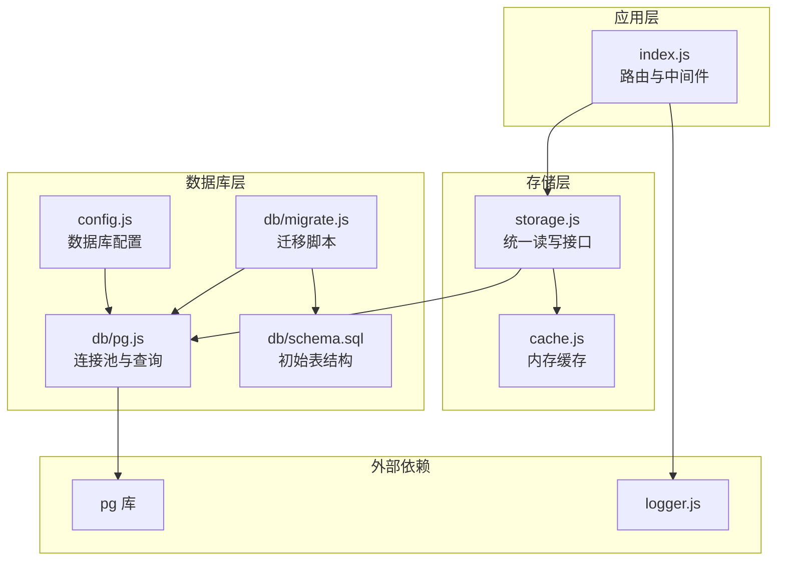
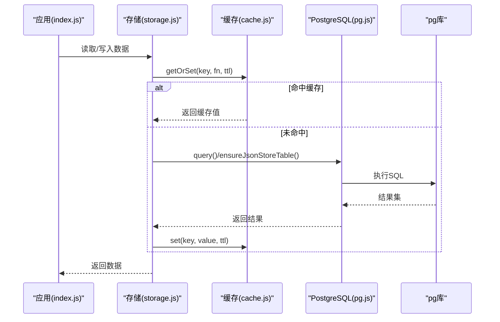
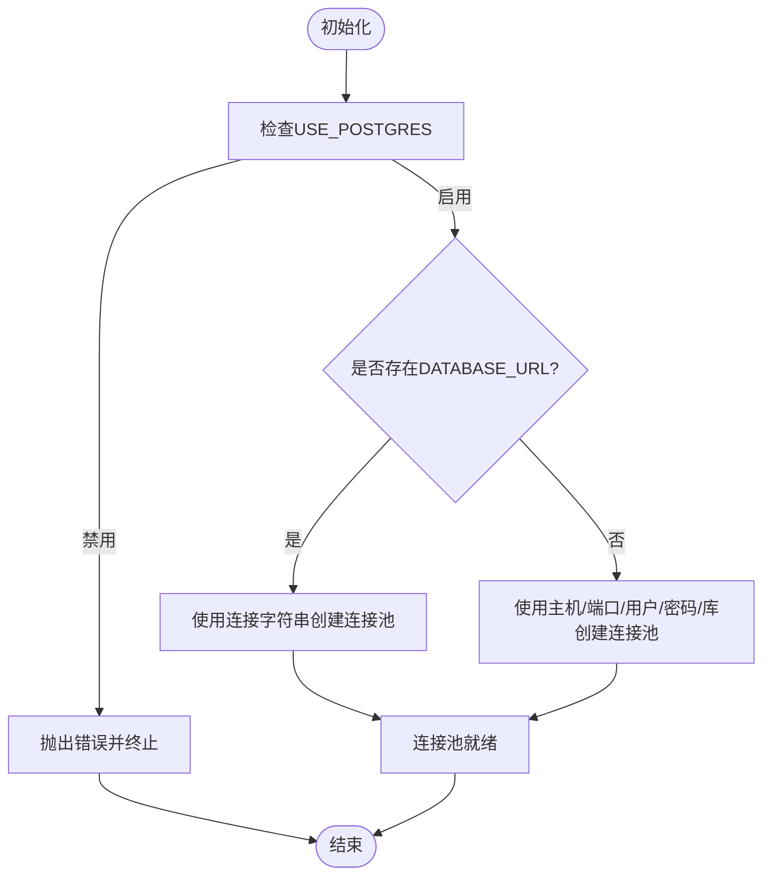
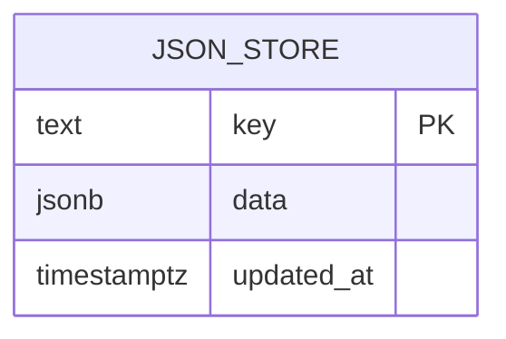
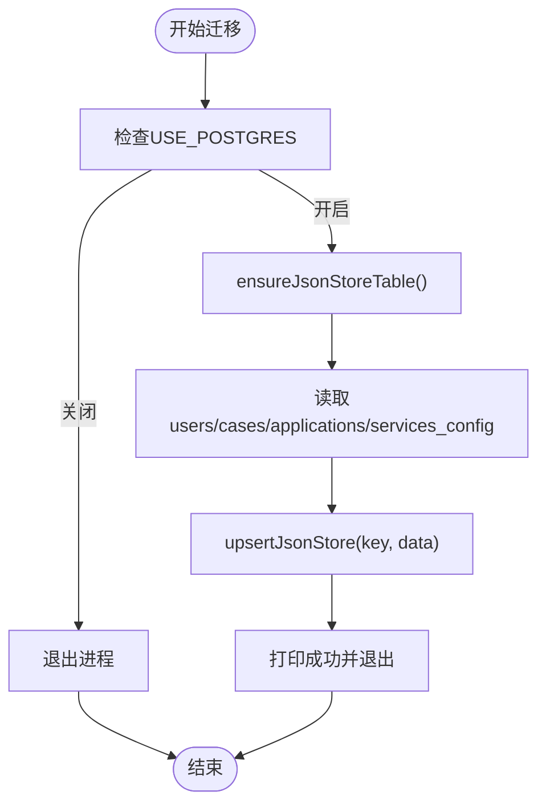
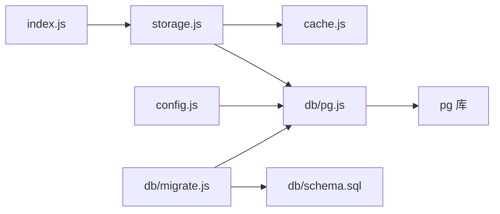

# PostgreSQL数据库集成

<cite>
**本文引用的文件**
- [backend/db/pg.js](file://backend/db/pg.js)
- [backend/db/migrate.js](file://backend/db/migrate.js)
- [backend/db/schema.sql](file://backend/db/schema.sql)
- [backend/storage.js](file://backend/storage.js)
- [backend/config.js](file://backend/config.js)
- [backend/index.js](file://backend/index.js)
- [backend/package.json](file://backend/package.json)
- [backend/cache.js](file://backend/cache.js)
- [backend/logger.js](file://backend/logger.js)
- [backend/data.json](file://backend/data.json)
- [backend/cases.json](file://backend/cases.json)
- [backend/.env.example](file://backend/.env.example)
- [backend/setup.sh](file://backend/setup.sh)
- [backend/setup.bat](file://backend/setup.bat)
- [backend/fix-study-goals-encoding.sql](file://backend/fix-study-goals-encoding.sql)
- [sql/schema.sql](file://sql/schema.sql)
</cite>

## 目录
1. [简介](#简介)
2. [项目结构](#项目结构)
3. [核心组件](#核心组件)
4. [架构总览](#架构总览)
5. [详细组件分析](#详细组件分析)
6. [依赖关系分析](#依赖关系分析)
7. [性能考虑](#性能考虑)
8. [故障排查指南](#故障排查指南)
9. [结论](#结论)
10. [附录](#附录)

## 简介
本文件面向PostgreSQL数据库集成，系统性阐述连接配置、连接池管理、事务处理机制；详解json_store表设计、数据存储策略与JSONB字段优势；展示数据库迁移脚本执行流程、版本管理与数据迁移策略；并提供性能优化、索引设计、查询优化技巧，以及数据库监控、备份恢复与高可用部署建议。最后总结数据一致性、并发控制与错误重试机制的最佳实践。

## 项目结构
后端采用“配置驱动 + 存储抽象 + 连接池 + 迁移脚本”的分层设计：
- 配置层：集中于配置模块，统一读取环境变量并校验关键参数
- 存储层：抽象出JSON存储接口，支持本地JSON文件与PostgreSQL两种后端
- 数据库层：封装PostgreSQL连接池与基础查询，提供表初始化与迁移能力
- 应用层：业务路由与中间件基于存储层提供的统一接口

**图表来源**
- [backend/index.js:1-120](file://backend/index.js#L1-L120)
- [backend/storage.js:1-60](file://backend/storage.js#L1-L60)
- [backend/cache.js:1-40](file://backend/cache.js#L1-L40)
- [backend/config.js:42-53](file://backend/config.js#L42-L53)
- [backend/db/pg.js:1-56](file://backend/db/pg.js#L1-L56)
- [backend/db/migrate.js:1-62](file://backend/db/migrate.js#L1-L62)
- [backend/db/schema.sql:1-10](file://backend/db/schema.sql#L1-L10)

**章节来源**
- [backend/package.json:12-29](file://backend/package.json#L12-L29)
- [backend/index.js:16-44](file://backend/index.js#L16-L44)
- [backend/config.js:42-53](file://backend/config.js#L42-L53)

## 核心组件
- 连接池与查询封装：提供连接池创建、查询执行、表初始化能力
- 存储抽象：统一读写接口，自动选择PostgreSQL或JSON文件后端
- 迁移脚本：读取本地JSON数据，写入json_store表
- 配置模块：集中管理数据库连接参数与运行时开关
- 缓存模块：对高频读取的数据进行内存缓存，降低数据库压力
- 日志模块：结构化日志输出，便于运维与排障

**章节来源**
- [backend/db/pg.js:9-56](file://backend/db/pg.js#L9-L56)
- [backend/storage.js:42-132](file://backend/storage.js#L42-L132)
- [backend/db/migrate.js:35-55](file://backend/db/migrate.js#L35-L55)
- [backend/config.js:42-53](file://backend/config.js#L42-L53)
- [backend/cache.js:54-99](file://backend/cache.js#L54-L99)
- [backend/logger.js:97-104](file://backend/logger.js#L97-L104)

## 架构总览
PostgreSQL集成采用“配置驱动 + 抽象存储 + 连接池 + 迁移脚本”的架构，确保在开发、测试、生产环境中平滑切换。

**图表来源**
- [backend/index.js:425-432](file://backend/index.js#L425-L432)
- [backend/storage.js:134-181](file://backend/storage.js#L134-L181)
- [backend/cache.js:54-67](file://backend/cache.js#L54-L67)
- [backend/db/pg.js:31-37](file://backend/db/pg.js#L31-L37)

## 详细组件分析

### 连接配置与连接池管理
- 运行开关：通过环境变量启用/禁用PostgreSQL，未启用时抛出明确错误
- 连接方式：优先使用连接字符串，其次使用主机、端口、用户名、密码、数据库等参数
- SSL支持：可按需开启SSL，拒绝校验证书（开发环境）
- 连接池：使用pg库的Pool创建连接池，复用连接，减少握手开销

**图表来源**
- [backend/db/pg.js:3-29](file://backend/db/pg.js#L3-L29)

**章节来源**
- [backend/db/pg.js:3-29](file://backend/db/pg.js#L3-L29)
- [backend/.env.example:56-69](file://backend/.env.example#L56-L69)

### 事务处理机制
- 当前实现：未显式使用事务块，所有写操作均以单条SQL执行
- 建议：对于多步写入或需要强一致性的场景，应使用BEGIN/COMMIT包裹，或使用pg库的事务API
- 错误处理：查询失败会向上抛出，迁移脚本捕获后退出进程

**章节来源**
- [backend/db/pg.js:31-37](file://backend/db/pg.js#L31-L37)
- [backend/db/migrate.js:57-60](file://backend/db/migrate.js#L57-L60)

### json_store表设计与数据存储策略
- 表结构：主键key、JSONB列data、时间戳updated_at
- 设计优势：
  - JSONB支持高效索引与查询，适合半结构化数据
  - 支持原子更新与部分更新，减少锁竞争
  - 存储二进制JSON，读写性能优于文本JSON
- 存储策略：
  - 写入：INSERT ... ON CONFLICT (key) DO UPDATE
  - 读取：按key精确匹配，兼容历史可能的字符串化数据
  - 初始化：ensureJsonStoreTable确保表存在

**图表来源**
- [backend/db/schema.sql:2-6](file://backend/db/schema.sql#L2-L6)
- [sql/schema.sql:2-6](file://sql/schema.sql#L2-L6)

**章节来源**
- [backend/db/schema.sql:1-10](file://backend/db/schema.sql#L1-L10)
- [backend/db/pg.js:39-48](file://backend/db/pg.js#L39-L48)
- [backend/storage.js:65-100](file://backend/storage.js#L65-L100)
- [backend/storage.js:120-132](file://backend/storage.js#L120-L132)

### 迁移脚本执行流程与版本管理
- 流程概览：
  1) 校验USE_POSTGRES开关
  2) 初始化json_store表
  3) 读取本地JSON数据
  4) 写入json_store（ON CONFLICT更新）
  5) 成功后退出
- 版本管理：当前为一次性迁移脚本，未引入版本号；建议后续引入版本表或迁移元数据表
- 数据迁移策略：批量写入，避免逐条插入；对历史数据做兼容解析

**图表来源**
- [backend/db/migrate.js:35-55](file://backend/db/migrate.js#L35-L55)

**章节来源**
- [backend/db/migrate.js:12-33](file://backend/db/migrate.js#L12-L33)
- [backend/db/migrate.js:35-55](file://backend/db/migrate.js#L35-L55)

### 查询优化与索引设计
- 当前查询：按key精确匹配，无需额外索引
- 建议索引：
  - 对常用过滤字段建立GIN索引（如JSONB路径索引）
  - 对updated_at建立普通索引，支持按时间排序与范围查询
- 查询优化：
  - 使用EXPLAIN/EXPLAIN ANALYZE分析慢查询
  - 避免SELECT *，仅返回必要字段
  - 利用JSONB操作符（?、@>、?<）进行条件过滤

[本节为通用优化建议，不直接分析具体文件]

### 性能优化与监控
- 连接池优化：合理设置最大连接数、空闲超时、查询超时
- 缓存策略：对热点数据设置合适TTL，定期清理过期缓存
- 监控指标：QPS、连接池使用率、慢查询、错误率、响应时间
- 建议工具：pg_stat_statements、Prometheus+Grafana

[本节为通用优化建议，不直接分析具体文件]

### 备份恢复与高可用
- 备份策略：逻辑备份（pg_dump）+ 定时快照
- 恢复流程：验证备份完整性 -> 指定时间点恢复 -> 校验数据一致性
- 高可用：主从复制、读写分离、故障转移

[本节为通用运维建议，不直接分析具体文件]

### 数据一致性、并发控制与错误重试
- 一致性：使用事务保证多步写入原子性；对关键业务采用悲观锁或乐观锁
- 并发控制：连接池并发上限与业务队列结合；避免热点key争用
- 错误重试：对瞬时错误（网络抖动、连接超时）进行指数退避重试

[本节为通用工程实践，不直接分析具体文件]

## 依赖关系分析
- 存储层依赖数据库层与缓存层
- 应用层路由依赖存储层
- 数据库层依赖pg库
- 配置模块为数据库层提供参数

**图表来源**
- [backend/index.js:16-44](file://backend/index.js#L16-L44)
- [backend/storage.js:1-6](file://backend/storage.js#L1-L6)
- [backend/db/pg.js:1](file://backend/db/pg.js#L1)
- [backend/config.js:42-53](file://backend/config.js#L42-L53)
- [backend/db/migrate.js:3](file://backend/db/migrate.js#L3)
- [backend/db/schema.sql:1](file://backend/db/schema.sql#L1)

**章节来源**
- [backend/package.json:12-29](file://backend/package.json#L12-L29)
- [backend/index.js:16-44](file://backend/index.js#L16-L44)

## 性能考虑
- 连接池参数：根据QPS与CPU核数设定最大连接数；设置合理的空闲回收与查询超时
- 缓存命中：对读多写少的数据设置较长TTL；对写后读场景及时清理缓存
- SQL优化：避免全表扫描；利用JSONB索引与条件过滤；拆分复杂查询
- IO优化：批量写入；压缩传输；合理分区（未来规范化后）

[本节为通用性能建议，不直接分析具体文件]

## 故障排查指南
- 连接失败：检查环境变量、网络连通性、SSL配置
- 权限不足：确认数据库用户具备创建表与写入权限
- 数据不一致：检查迁移脚本执行状态与日志；核对ON CONFLICT逻辑
- 缓存异常：检查缓存清理定时器与TTL设置
- 日志定位：通过结构化日志定位请求上下文与错误堆栈

**章节来源**
- [backend/db/pg.js:31-37](file://backend/db/pg.js#L31-L37)
- [backend/storage.js:21-40](file://backend/storage.js#L21-L40)
- [backend/logger.js:86-94](file://backend/logger.js#L86-L94)

## 结论
本项目通过配置驱动与存储抽象实现了PostgreSQL与JSON文件的无缝切换，json_store表配合JSONB提供了灵活高效的半结构化数据存储方案。迁移脚本简化了初始数据导入流程。建议后续引入事务封装、版本化迁移、索引与监控体系，以满足生产环境对一致性、可观测性与性能的要求。

## 附录

### 环境变量与配置要点
- 数据库开关：USE_POSTGRES=1启用PostgreSQL
- 连接方式：DATABASE_URL或主机/端口/用户/密码/库组合
- SSL：PG_SSL=true启用SSL（开发环境可关闭校验）
- 缓存：可扩展Redis缓存（预留配置项）

**章节来源**
- [backend/.env.example:56-69](file://backend/.env.example#L56-L69)
- [backend/config.js:42-53](file://backend/config.js#L42-L53)

### 启动与初始化
- 快速配置脚本：自动生成.env、安装依赖、创建日志与上传目录
- 初始化流程：应用启动时根据USE_POSTGRES决定初始化策略

**章节来源**
- [backend/setup.sh:9-24](file://backend/setup.sh#L9-L24)
- [backend/setup.bat:7-22](file://backend/setup.bat#L7-L22)
- [backend/storage.js:42-63](file://backend/storage.js#L42-L63)

### 历史数据修复示例
- 针对JSONB内容编码问题，提供修复SQL示例，演示使用jsonb_set进行局部更新

**章节来源**
- [backend/fix-study-goals-encoding.sql:1-21](file://backend/fix-study-goals-encoding.sql#L1-L21)