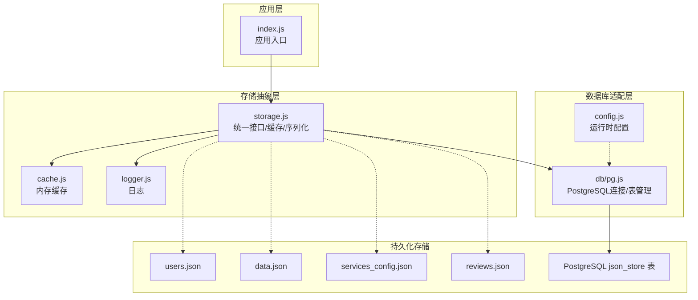
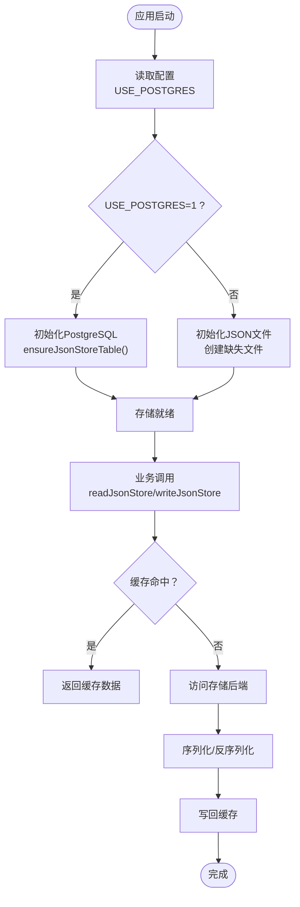
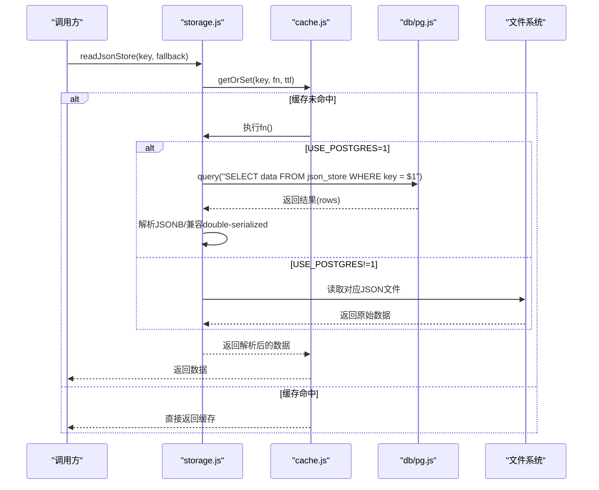
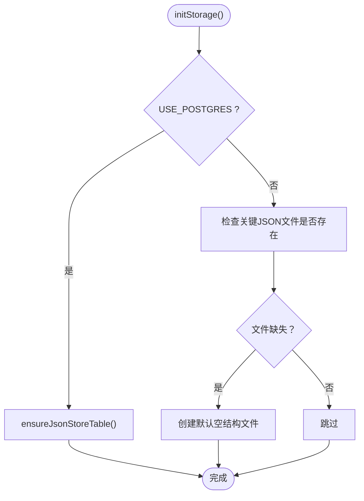
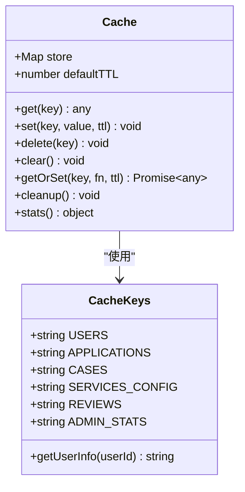
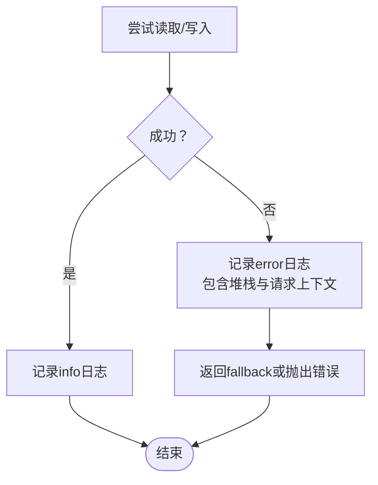
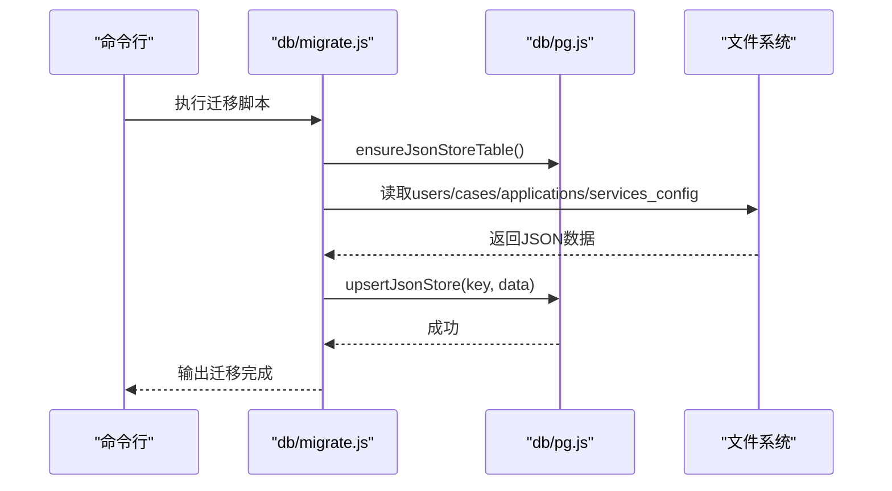
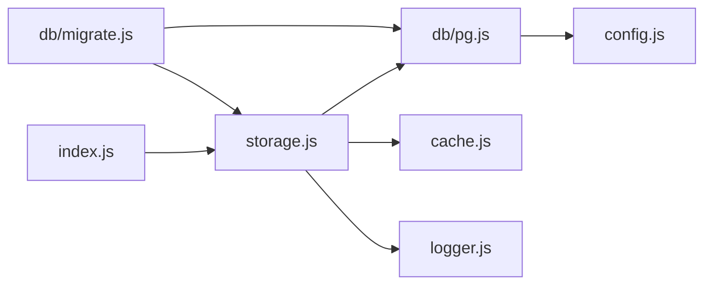

# 存储抽象层设计

<cite>
**本文档引用的文件**
- [storage.js](file://backend/storage.js)
- [pg.js](file://backend/db/pg.js)
- [config.js](file://backend/config.js)
- [cache.js](file://backend/cache.js)
- [logger.js](file://backend/logger.js)
- [index.js](file://backend/index.js)
- [migrate.js](file://backend/db/migrate.js)
- [package.json](file://backend/package.json)
- [data.json](file://backend/data.json)
- [users.json](file://backend/users.json)
- [services_config.json](file://backend/services_config.json)
- [reviews.json](file://backend/reviews.json)
</cite>

## 目录
1. [引言](#引言)
2. [项目结构](#项目结构)
3. [核心组件](#核心组件)
4. [架构总览](#架构总览)
5. [详细组件分析](#详细组件分析)
6. [依赖关系分析](#依赖关系分析)
7. [性能考量](#性能考量)
8. [故障排查指南](#故障排查指南)
9. [结论](#结论)
10. [附录](#附录)

## 引言
本文件系统性阐述后端存储抽象层的设计理念与实现细节，重点覆盖：
- 统一的数据访问接口与多存储后端支持策略
- JSON文件存储与PostgreSQL数据库的切换机制
- 存储键值映射、数据序列化处理
- 初始化流程、文件路径管理与错误处理
- 扩展性设计与新存储类型接入方法
- 性能对比分析、最佳实践与常见问题解决方案

## 项目结构
存储抽象层位于后端目录，采用按职责分层的组织方式：
- 存储核心：storage.js 提供统一的读写接口与缓存集成
- 数据库适配：db/pg.js 提供PostgreSQL连接池与表结构管理
- 配置中心：config.js 提供运行时配置与环境变量解析
- 缓存层：cache.js 提供内存缓存与TTL管理
- 日志：logger.js 提供结构化日志记录
- 应用入口：index.js 在启动阶段初始化存储并注入业务路由
- 迁移工具：db/migrate.js 提供从JSON文件到PostgreSQL的迁移脚本

**图表来源**
- [storage.js:1-197](file://backend/storage.js#L1-L197)
- [pg.js:1-56](file://backend/db/pg.js#L1-L56)
- [config.js:1-123](file://backend/config.js#L1-L123)
- [cache.js:1-119](file://backend/cache.js#L1-L119)
- [logger.js:1-104](file://backend/logger.js#L1-L104)
- [index.js:1-1401](file://backend/index.js#L1-L1401)

**章节来源**
- [storage.js:1-197](file://backend/storage.js#L1-L197)
- [pg.js:1-56](file://backend/db/pg.js#L1-L56)
- [config.js:1-123](file://backend/config.js#L1-L123)
- [cache.js:1-119](file://backend/cache.js#L1-L119)
- [logger.js:1-104](file://backend/logger.js#L1-L104)
- [index.js:1-1401](file://backend/index.js#L1-L1401)

## 核心组件
- 存储抽象接口
  - 初始化：根据配置决定使用PostgreSQL或本地JSON文件
  - 读取：统一键值映射到具体文件或表
  - 写入：统一键值映射到具体文件或表
  - 序列化：JSON文件使用字符串化，PostgreSQL使用JSONB自动序列化
- 缓存集成：针对高频读取的数据提供内存缓存，降低I/O压力
- 错误处理：文件读写与数据库查询均进行异常捕获与日志记录
- 迁移工具：将现有JSON数据迁移到PostgreSQL的json_store表

**章节来源**
- [storage.js:42-132](file://backend/storage.js#L42-L132)
- [cache.js:5-99](file://backend/cache.js#L5-L99)
- [logger.js:32-73](file://backend/logger.js#L32-L73)
- [migrate.js:23-55](file://backend/db/migrate.js#L23-L55)

## 架构总览
存储抽象层通过环境变量驱动后端选择，实现“同一套接口，双后端实现”的统一访问模式。

**图表来源**
- [config.js:42-53](file://backend/config.js#L42-L53)
- [storage.js:42-132](file://backend/storage.js#L42-L132)
- [cache.js:57-67](file://backend/cache.js#L57-L67)

**章节来源**
- [config.js:42-53](file://backend/config.js#L42-L53)
- [storage.js:42-132](file://backend/storage.js#L42-L132)
- [cache.js:57-67](file://backend/cache.js#L57-L67)

## 详细组件分析

### 存储抽象接口与键值映射
- 键值定义：统一使用键常量映射到具体数据集
  - applications → data.json
  - cases → cases.json
  - users → users.json
  - services_config → services_config.json
  - reviews → reviews.json
- 读取流程：根据USE_POSTGRES分支
  - Postgres：查询json_store表，兼容历史double-serialized数据
  - JSON：按键映射到对应文件，读取并解析
- 写入流程：根据USE_POSTGRES分支
  - Postgres：直接写入JSONB字段，自动序列化
  - JSON：按键映射到对应文件，写入字符串化数据

**图表来源**
- [storage.js:65-100](file://backend/storage.js#L65-L100)
- [cache.js:57-67](file://backend/cache.js#L57-L67)
- [pg.js:31-37](file://backend/db/pg.js#L31-L37)

**章节来源**
- [storage.js:13-19](file://backend/storage.js#L13-L19)
- [storage.js:65-132](file://backend/storage.js#L65-L132)

### 初始化流程与文件路径管理
- 初始化逻辑
  - Postgres：确保json_store表存在
  - JSON：检查并创建缺失的数据文件
- 文件路径
  - 统一使用相对路径拼接，保证跨平台一致性
  - 关键文件：data.json、cases.json、users.json、services_config.json、reviews.json

**图表来源**
- [storage.js:42-63](file://backend/storage.js#L42-L63)

**章节来源**
- [storage.js:7-11](file://backend/storage.js#L7-L11)
- [storage.js:42-63](file://backend/storage.js#L42-L63)

### 缓存策略与失效机制
- 缓存键命名：统一前缀与命名约定，便于管理与清理
- TTL设置：针对不同数据集设置差异化的过期时间
  - 用户列表：60秒
  - 案例数据：5分钟
  - 申请数据：1分钟
  - 服务配置：5分钟
  - 评价数据：60秒
- 写入触发：任何写入操作都会删除对应缓存键，确保一致性

**图表来源**
- [cache.js:5-99](file://backend/cache.js#L5-L99)
- [cache.js:108-116](file://backend/cache.js#L108-L116)

**章节来源**
- [cache.js:5-99](file://backend/cache.js#L5-L99)
- [cache.js:108-116](file://backend/cache.js#L108-L116)
- [storage.js:134-181](file://backend/storage.js#L134-L181)

### 错误处理与日志记录
- 文件读写：捕获异常并记录错误日志
- 数据库查询：在Postgres禁用时抛出明确错误
- 日志格式：结构化输出，包含时间戳、级别、消息与上下文元数据

**图表来源**
- [storage.js:21-40](file://backend/storage.js#L21-L40)
- [pg.js:31-37](file://backend/db/pg.js#L31-L37)
- [logger.js:32-94](file://backend/logger.js#L32-L94)

**章节来源**
- [storage.js:21-40](file://backend/storage.js#L21-L40)
- [pg.js:31-37](file://backend/db/pg.js#L31-L37)
- [logger.js:32-94](file://backend/logger.js#L32-L94)

### 迁移机制与数据一致性
- 迁移脚本：在Postgres启用时，将JSON文件内容迁移到json_store表
- 写入策略：使用UPSERT保证幂等更新
- 兼容性：读取时兼容历史double-serialized数据（字符串化JSON）

**图表来源**
- [migrate.js:23-55](file://backend/db/migrate.js#L23-L55)
- [pg.js:39-48](file://backend/db/pg.js#L39-L48)

**章节来源**
- [migrate.js:1-62](file://backend/db/migrate.js#L1-L62)
- [storage.js:88-99](file://backend/storage.js#L88-L99)

## 依赖关系分析
- 运行时依赖
  - PostgreSQL驱动：pg.js负责连接池与查询封装
  - 环境变量：config.js集中解析USE_POSTGRES与数据库连接参数
  - 缓存：cache.js提供内存缓存，index.js在启动阶段加载
- 文件依赖
  - JSON数据文件：users.json、data.json、services_config.json、reviews.json
  - 迁移脚本：db/migrate.js依赖pg.js与JSON文件

**图表来源**
- [storage.js:1-6](file://backend/storage.js#L1-L6)
- [pg.js:1-5](file://backend/db/pg.js#L1-L5)
- [config.js:42-53](file://backend/config.js#L42-L53)
- [migrate.js:1-3](file://backend/db/migrate.js#L1-L3)
- [index.js:31-43](file://backend/index.js#L31-L43)

**章节来源**
- [package.json:12-28](file://backend/package.json#L12-L28)
- [storage.js:1-6](file://backend/storage.js#L1-L6)
- [pg.js:1-5](file://backend/db/pg.js#L1-L5)
- [config.js:42-53](file://backend/config.js#L42-L53)
- [migrate.js:1-3](file://backend/db/migrate.js#L1-L3)
- [index.js:31-43](file://backend/index.js#L31-L43)

## 性能考量
- 读取性能
  - 缓存命中显著降低I/O压力，特别是用户列表与评价数据
  - Postgres在并发读取场景下具备更好的稳定性
- 写入性能
  - Postgres使用JSONB字段，写入时由驱动自动序列化，减少应用层负担
  - JSON文件写入涉及磁盘同步，建议批量写入或合并更新
- 迁移成本
  - 迁移脚本一次性执行，后续读写性能稳定
  - 建议在低峰期执行迁移，避免影响线上流量

[本节为通用性能讨论，无需列出具体文件来源]

## 故障排查指南
- Postgres未启用但调用查询
  - 现象：抛出“PostgreSQL is disabled”错误
  - 处理：设置USE_POSTGRES=1或切换到JSON模式
- JSON文件损坏或权限不足
  - 现象：读取失败，返回fallback并记录错误日志
  - 处理：检查文件权限与磁盘空间，必要时恢复备份
- 缓存一致性问题
  - 现象：读取到旧数据
  - 处理：确认写入后是否删除对应缓存键，检查TTL设置
- 迁移失败
  - 现象：迁移脚本退出或提示未启用Postgres
  - 处理：确认USE_POSTGRES=1与数据库连接参数正确

**章节来源**
- [pg.js:31-37](file://backend/db/pg.js#L31-L37)
- [storage.js:21-40](file://backend/storage.js#L21-L40)
- [cache.js:43-45](file://backend/cache.js#L43-L45)
- [migrate.js:35-40](file://backend/db/migrate.js#L35-L40)

## 结论
存储抽象层通过统一接口与环境变量驱动，实现了JSON文件与PostgreSQL的无缝切换。配合内存缓存与完善的错误处理，既保证了开发阶段的便利性，也为生产环境提供了稳定的扩展基础。迁移脚本确保历史数据平滑过渡，缓存策略有效降低了I/O压力。未来可通过类似模式接入其他存储后端，进一步增强系统的可扩展性。

[本节为总结性内容，无需列出具体文件来源]

## 附录

### 新存储类型接入方法
- 设计原则
  - 保持与现有接口一致：initStorage、readJsonStore、writeJsonStore
  - 明确键值映射与序列化策略
  - 提供错误处理与日志记录
- 实现步骤
  1) 定义后端适配模块，暴露query/ensureTable等函数
  2) 在storage.js中引入适配模块并添加USE_POSTGRES分支
  3) 在cache.js中增加对应的缓存键与TTL
  4) 编写迁移脚本（如适用）
  5) 更新环境变量与部署文档

[本节为概念性指导，无需列出具体文件来源]

### 性能对比要点
- I/O特性：Postgres更适合高并发读写，JSON适合轻量级场景
- 数据模型：Postgres支持复杂查询与事务，JSON适合简单键值访问
- 可运维性：Postgres具备更强的监控与备份能力

[本节为通用对比分析，无需列出具体文件来源]