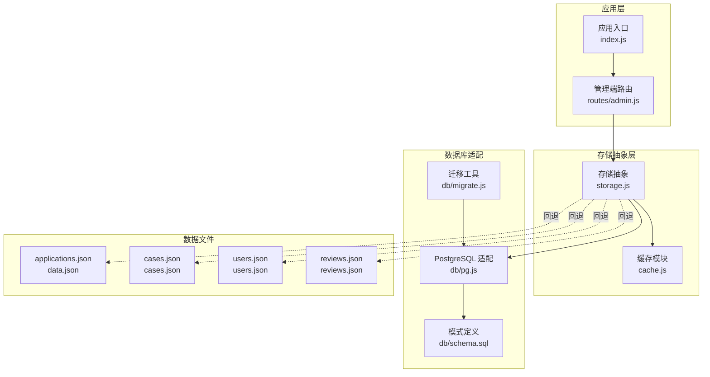
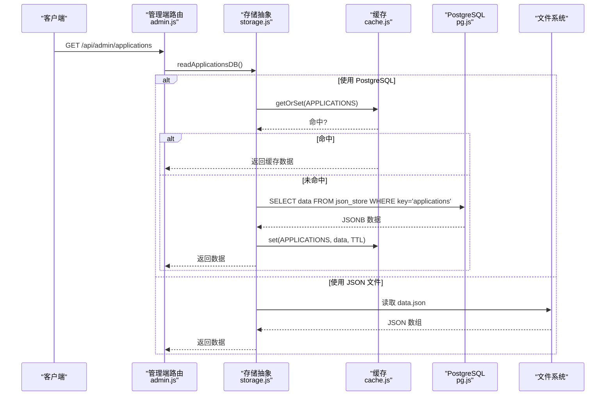
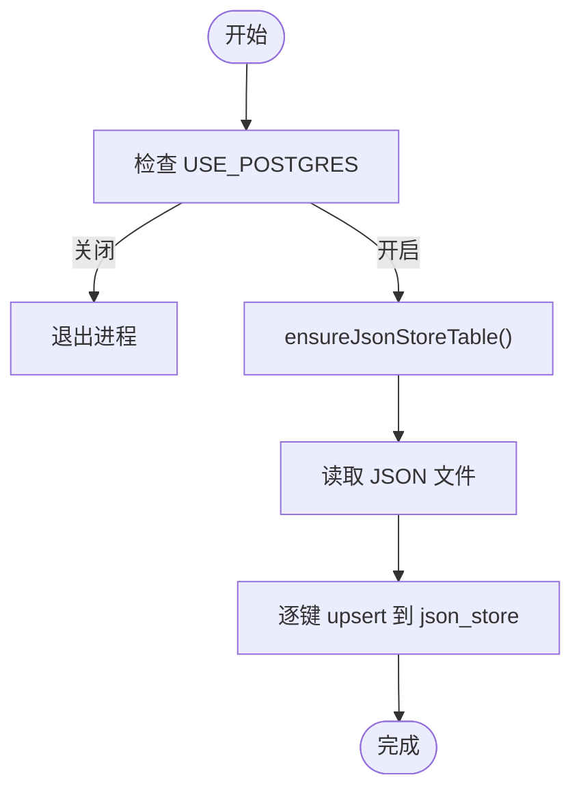
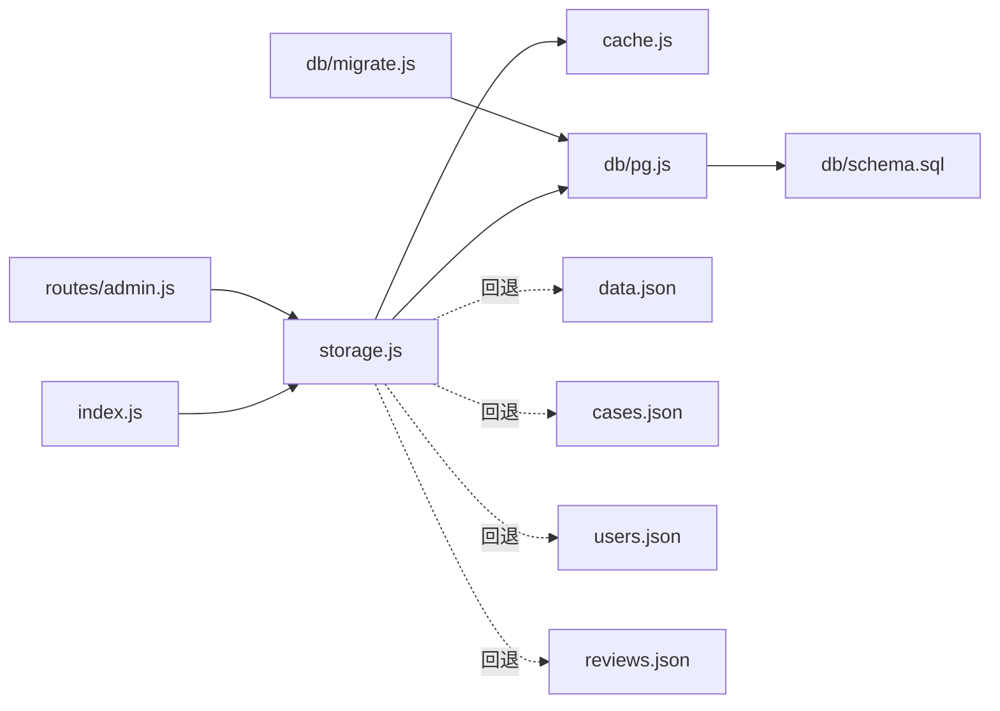

# 数据存储系统

<cite>
**本文引用的文件**
- [storage.js](file://backend/storage.js)
- [pg.js](file://backend/db/pg.js)
- [cache.js](file://backend/cache.js)
- [migrate.js](file://backend/db/migrate.js)
- [schema.sql](file://backend/db/schema.sql)
- [config.js](file://backend/config.js)
- [index.js](file://backend/index.js)
- [admin.js](file://backend/routes/admin.js)
- [logger.js](file://backend/logger.js)
- [data.json](file://backend/data.json)
- [cases.json](file://backend/cases.json)
- [users.json](file://backend/users.json)
- [reviews.json](file://backend/reviews.json)
</cite>

## 目录
1. [简介](#简介)
2. [项目结构](#项目结构)
3. [核心组件](#核心组件)
4. [架构总览](#架构总览)
5. [详细组件分析](#详细组件分析)
6. [依赖关系分析](#依赖关系分析)
7. [性能考量](#性能考量)
8. [故障排查指南](#故障排查指南)
9. [结论](#结论)
10. [附录](#附录)

## 简介
本文件面向低空飞行服务平台的数据存储系统，系统采用“存储抽象层 + 双存储策略”的设计：在启用 PostgreSQL 时，使用 JSONB 存储于统一表；在禁用时，回退到本地 JSON 文件存储。该设计兼顾开发调试与生产部署的灵活性，同时通过缓存层降低读写开销，并提供数据迁移工具支持从旧版 JSON 文件迁移到新表结构。

## 项目结构
后端存储相关的关键目录与文件：
- 存储抽象层：backend/storage.js
- 数据库适配：backend/db/pg.js
- 缓存模块：backend/cache.js
- 迁移工具：backend/db/migrate.js
- 架构脚本：backend/db/schema.sql
- 配置中心：backend/config.js
- 应用入口：backend/index.js
- 管理端路由：backend/routes/admin.js
- 日志模块：backend/logger.js
- 示例数据：backend/data.json、backend/cases.json、backend/users.json、backend/reviews.json

图表来源
- [index.js:1-120](file://backend/index.js#L1-L120)
- [admin.js:1-50](file://backend/routes/admin.js#L1-L50)
- [storage.js:1-60](file://backend/storage.js#L1-L60)
- [cache.js:1-40](file://backend/cache.js#L1-L40)
- [pg.js:1-30](file://backend/db/pg.js#L1-L30)
- [schema.sql:1-10](file://backend/db/schema.sql#L1-L10)
- [migrate.js:1-30](file://backend/db/migrate.js#L1-L30)

章节来源
- [index.js:1-120](file://backend/index.js#L1-L120)
- [storage.js:1-60](file://backend/storage.js#L1-L60)

## 核心组件
- 存储抽象层：统一对外提供初始化、读写接口，内部根据配置选择 PostgreSQL 或本地 JSON 文件。
- 缓存模块：基于内存 Map 的简单缓存，带 TTL 和定期清理，显著降低文件读取压力。
- 数据库适配：封装 pg 连接池、查询执行、表初始化。
- 迁移工具：将旧版 JSON 文件内容写入 PostgreSQL 的 json_store 表。
- 配置中心：集中管理数据库开关、连接参数、JWT 等安全配置。

章节来源
- [storage.js:1-197](file://backend/storage.js#L1-L197)
- [cache.js:1-119](file://backend/cache.js#L1-L119)
- [pg.js:1-56](file://backend/db/pg.js#L1-L56)
- [migrate.js:1-62](file://backend/db/migrate.js#L1-L62)
- [config.js:1-123](file://backend/config.js#L1-L123)

## 架构总览
存储系统通过一个统一的抽象层屏蔽底层差异，向上提供一致的 CRUD 接口。当 USE_POSTGRES=1 时，所有 JSON 结构数据以 JSONB 形式保存在 json_store 表中；否则回退到本地 JSON 文件，按业务实体分文件存储。

图表来源
- [admin.js:66-111](file://backend/routes/admin.js#L66-L111)
- [storage.js:154-162](file://backend/storage.js#L154-L162)
- [cache.js:57-67](file://backend/cache.js#L57-L67)
- [pg.js:31-37](file://backend/db/pg.js#L31-L37)

## 详细组件分析

### 存储抽象层（storage.js）
职责与特性
- 初始化：根据 USE_POSTGRES 决定创建 json_store 表或确保各 JSON 文件存在。
- 读写：提供 read/write 包装函数，分别针对 users、cases、applications、services_config、reviews。
- 解析兼容：PostgreSQL 读取时对字符串形式的 JSON 做二次解析，兼容历史数据。
- 缓存集成：每个实体读写均与缓存键配合，写入后清理对应缓存，读取前尝试命中缓存。

复杂度与性能
- 读取：缓存命中 O(1)，未命中时 PostgreSQL 为单表查询，JSON 文件为磁盘 IO。
- 写入：PostgreSQL 为单条 upsert，JSON 文件为整文件写回。

扩展性
- 新增实体：在 JSON_KEYS 中新增键名，补充读写函数，按需设定缓存 TTL。
- 切换后端：仅需调整 USE_POSTGRES，无需修改上层调用代码。

章节来源
- [storage.js:42-132](file://backend/storage.js#L42-L132)
- [storage.js:134-181](file://backend/storage.js#L134-L181)

### 缓存模块（cache.js）
职责与特性
- 内存缓存：Map 存储，支持 TTL、清理过期项、统计信息。
- 自动清理：定时器每 5 分钟清理过期项，避免内存泄漏。
- 缓存键常量：集中管理各类实体缓存键，支持动态键如用户信息。

复杂度与性能
- get/set/delete：平均 O(1)，cleanup 遍历清理 O(n)。
- 适合高频读取、低频变更的数据（如案例、配置）。

章节来源
- [cache.js:1-119](file://backend/cache.js#L1-L119)

### 数据库适配（db/pg.js）
职责与特性
- 连接池：根据 DATABASE_URL 或主机/端口/用户/密码/库名创建连接池。
- 查询：封装 query，统一错误提示。
- 表初始化：ensureJsonStoreTable 在 PostgreSQL 下创建 json_store 表。

事务与一致性
- 当前实现未显式使用事务块；单条 upsert 语义明确，具备幂等性（ON CONFLICT）。

章节来源
- [pg.js:1-56](file://backend/db/pg.js#L1-L56)

### 迁移工具（db/migrate.js）
职责与特性
- 读取旧版 JSON 文件：users、cases、applications、services_config。
- 写入 json_store：逐个 upsert，确保历史数据可用。

执行流程

图表来源
- [migrate.js:35-55](file://backend/db/migrate.js#L35-L55)
- [pg.js:39-48](file://backend/db/pg.js#L39-L48)

章节来源
- [migrate.js:1-62](file://backend/db/migrate.js#L1-L62)

### 数据模型与CRUD映射
- applications：订单/申请数据，支持分页、筛选、导出。
- cases：案例数据，支持缓存与展示。
- users：用户数据，含角色与鉴权字段。
- services_config：服务配置，按服务 ID 维度分组。
- reviews：评价数据，支持审核与分页。

CRUD 实现要点
- 读取：优先缓存，未命中则访问后端（PG 或 JSON 文件）。
- 写入：直接覆盖后端，写入后清理对应缓存键。
- 管理端路由：admin.js 对应实体提供 GET/POST/DELETE 等操作，统一调用 storage 层。

章节来源
- [admin.js:66-111](file://backend/routes/admin.js#L66-L111)
- [admin.js:282-357](file://backend/routes/admin.js#L282-L357)
- [admin.js:409-481](file://backend/routes/admin.js#L409-L481)

### 数据文件与示例
- data.json：applications 示例数据，包含多种服务类型字段。
- cases.json：cases 示例数据，包含媒体资源与高亮描述。
- users.json：users 示例数据，包含管理员与普通用户。
- reviews.json：reviews 示例数据，包含评分、状态与图片。

章节来源
- [data.json:1-200](file://backend/data.json#L1-L200)
- [cases.json:1-88](file://backend/cases.json#L1-L88)
- [users.json:1-58](file://backend/users.json#L1-L58)
- [reviews.json:1-54](file://backend/reviews.json#L1-L54)

## 依赖关系分析
- storage.js 依赖 cache.js 与 db/pg.js；在 PostgreSQL 模式下依赖 json_store 表。
- index.js 引入 storage 并在启动阶段进行初始化与默认数据补全。
- admin.js 路由依赖 storage 提供的读写函数。
- migrate.js 依赖 db/pg.js 与各 JSON 文件路径。

图表来源
- [index.js:31-43](file://backend/index.js#L31-L43)
- [admin.js:10-16](file://backend/routes/admin.js#L10-L16)
- [storage.js:1-6](file://backend/storage.js#L1-L6)
- [pg.js:1-6](file://backend/db/pg.js#L1-L6)
- [schema.sql:1-10](file://backend/db/schema.sql#L1-L10)
- [migrate.js:1-10](file://backend/db/migrate.js#L1-L10)

章节来源
- [index.js:31-43](file://backend/index.js#L31-L43)
- [admin.js:10-16](file://backend/routes/admin.js#L10-L16)
- [storage.js:1-6](file://backend/storage.js#L1-L6)

## 性能考量
- 缓存策略
  - users：60 秒
  - cases：5 分钟
  - applications：1 分钟
  - services_config：5 分钟
  - reviews：1 分钟
- 读放大控制：通过缓存键与 TTL 降低重复读取；写入后主动清理缓存，保证一致性。
- 文件系统优化：JSON 文件写入为整文件覆盖，建议在高并发写入场景切换至 PostgreSQL。
- 连接池：pg.js 已内置连接池，建议结合实际并发调优最大连接数与空闲回收策略（当前未显式配置）。

[本节为通用性能建议，不直接分析具体文件]

## 故障排查指南
常见问题与处理
- PostgreSQL 未启用
  - 现象：调用 query 抛错提示未启用。
  - 处理：设置 USE_POSTGRES=1 并提供 DATABASE_URL 或主机/端口/用户/密码/库名。
- 迁移失败或数据未生效
  - 现象：迁移脚本退出或日志报错。
  - 处理：确认 USE_POSTGRES 开启、数据库可达、schema.sql 已创建表；检查 JSON 文件格式。
- 缓存脏读
  - 现象：写入后读取到旧数据。
  - 处理：确认写入函数是否调用 cache.delete；检查 TTL 是否过长。
- 日志与审计
  - 管理端路由在关键操作处记录日志，便于追踪。

章节来源
- [pg.js:31-37](file://backend/db/pg.js#L31-L37)
- [migrate.js:35-60](file://backend/db/migrate.js#L35-L60)
- [admin.js:156-160](file://backend/routes/admin.js#L156-L160)
- [logger.js:1-104](file://backend/logger.js#L1-L104)

## 结论
该存储系统通过“抽象层 + 双存储策略”，在开发与生产之间实现了平滑切换；结合缓存与迁移工具，既保证了易用性，也为后续规范化与扩展打下基础。建议在高并发场景优先使用 PostgreSQL，并根据业务特征调整缓存策略与连接池参数。

[本节为总结性内容，不直接分析具体文件]

## 附录

### 数据模型定义（概要）
- applications：订单/申请集合，字段涵盖联系人、服务、地址、状态等。
- cases：案例集合，字段涵盖标题、描述、封面、媒体、亮点等。
- users：用户集合，字段涵盖手机号、角色、头像、创建时间、令牌等。
- services_config：服务配置对象，按服务 ID 分组。
- reviews：评价集合，字段涵盖评分、内容、状态、图片等。

章节来源
- [data.json:1-200](file://backend/data.json#L1-L200)
- [cases.json:1-88](file://backend/cases.json#L1-L88)
- [users.json:1-58](file://backend/users.json#L1-L58)
- [reviews.json:1-54](file://backend/reviews.json#L1-L54)

### 扩展存储功能指南
- 添加新实体
  - 在 storage.js 的 JSON_KEYS 中新增键名。
  - 实现 readXXXDB 与 writeXXXDB 包装函数，按需设置缓存 TTL。
  - 在 admin.js 中添加对应路由（GET/POST/DELETE 等）。
- 切换后端
  - 设置 USE_POSTGRES=1 并运行迁移工具，将旧数据导入 json_store。
  - 确认 schema.sql 已创建表，且连接参数正确。
- 数据同步机制
  - 当前未实现跨后端的实时同步；建议在需要时引入消息队列或触发器，或定期任务进行增量对账。

章节来源
- [storage.js:134-197](file://backend/storage.js#L134-L197)
- [admin.js:282-357](file://backend/routes/admin.js#L282-L357)
- [migrate.js:35-55](file://backend/db/migrate.js#L35-L55)