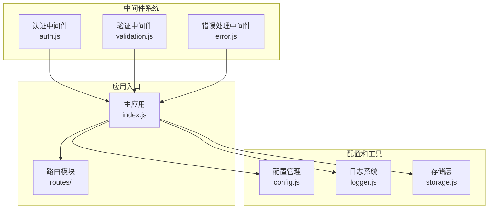
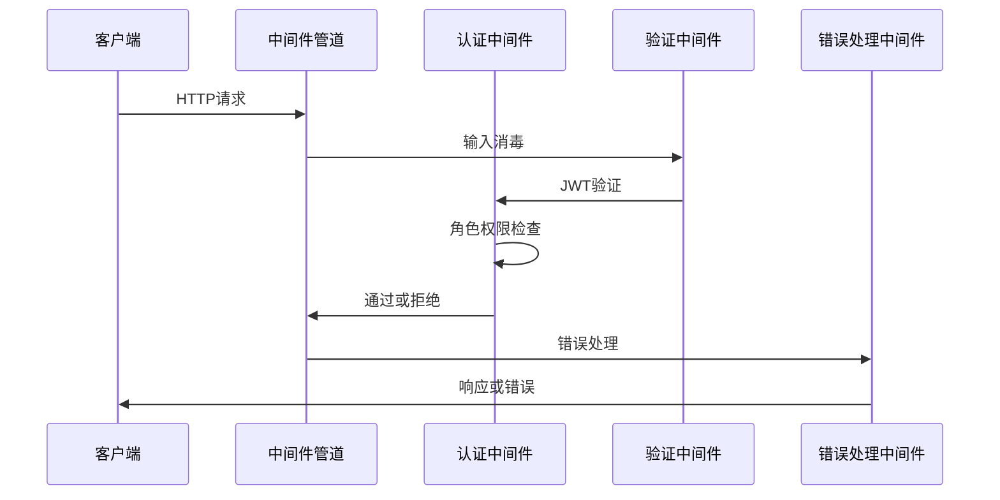
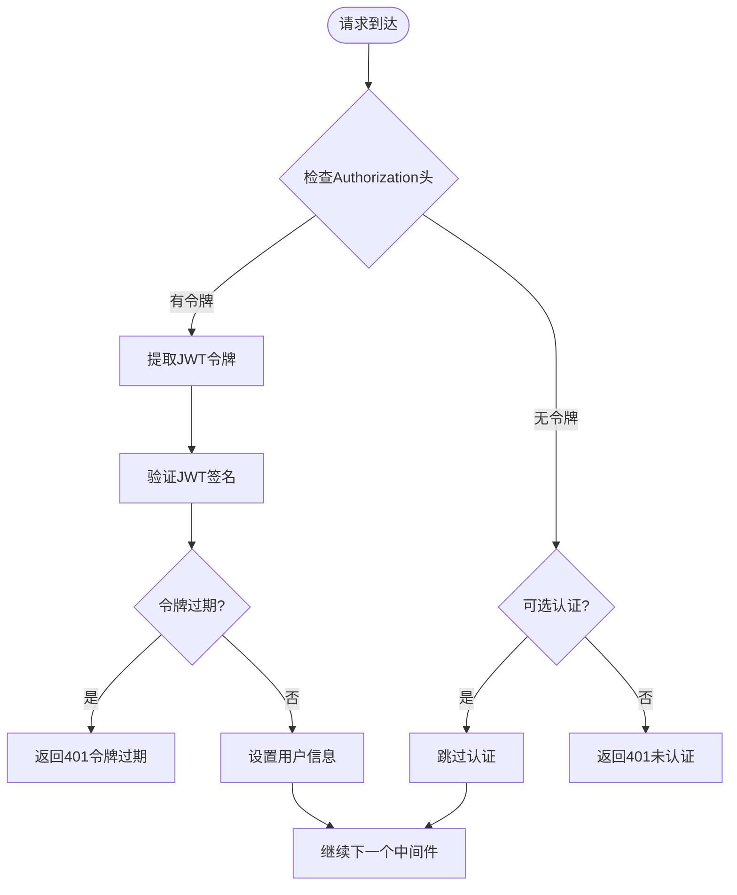
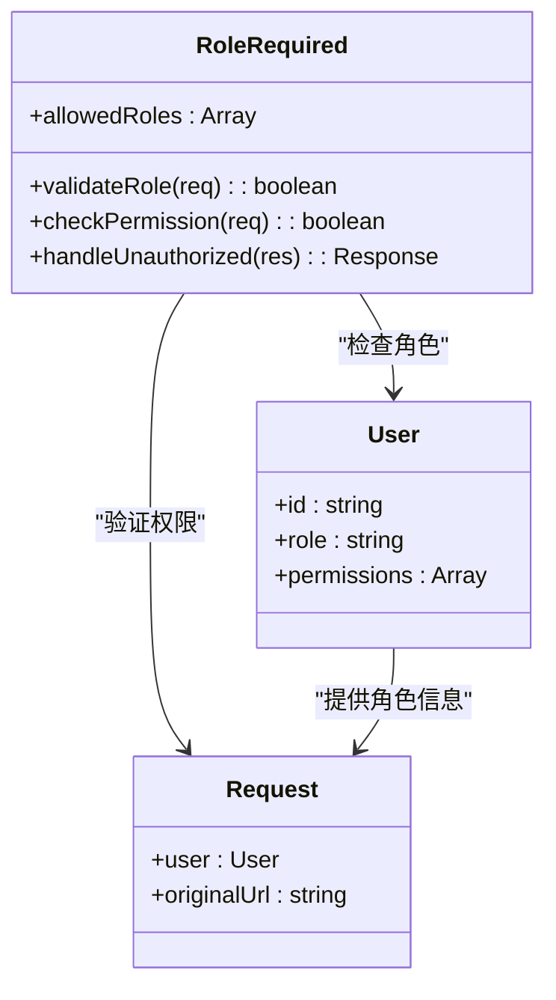
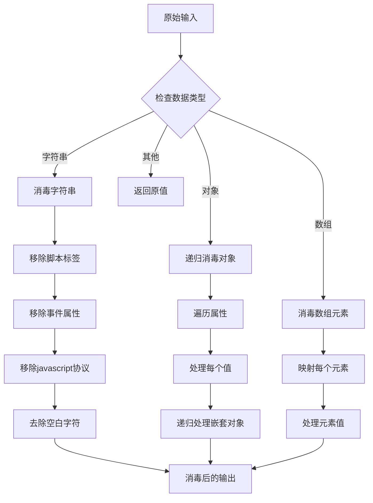
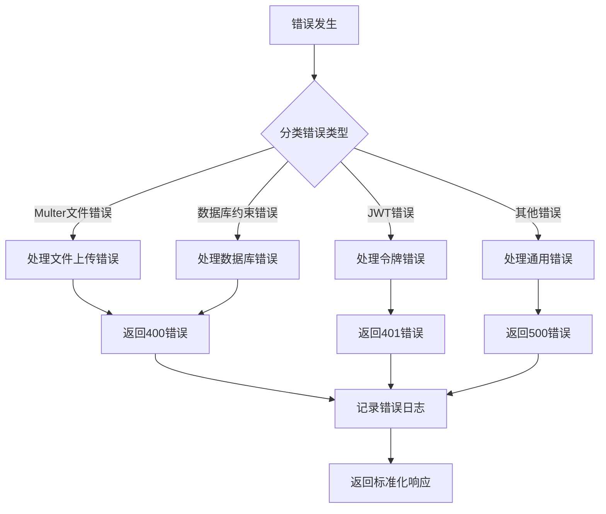
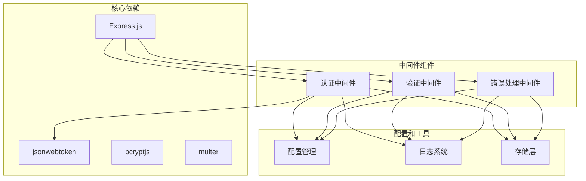
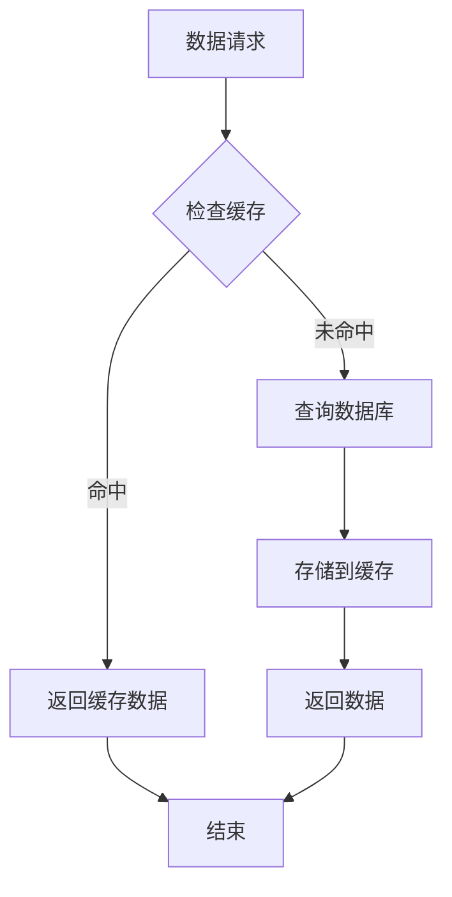

# 中间件系统

<cite>
**本文档引用的文件**
- [auth.js](file://backend/middleware/auth.js)
- [validation.js](file://backend/middleware/validation.js)
- [error.js](file://backend/middleware/error.js)
- [index.js](file://backend/index.js)
- [config.js](file://backend/config.js)
- [auth.js](file://backend/routes/auth.js)
- [admin.js](file://backend/routes/admin.js)
- [logger.js](file://backend/logger.js)
- [storage.js](file://backend/storage.js)
</cite>

## 目录
1. [简介](#简介)
2. [项目结构](#项目结构)
3. [核心组件](#核心组件)
4. [架构概览](#架构概览)
5. [详细组件分析](#详细组件分析)
6. [依赖关系分析](#依赖关系分析)
7. [性能考量](#性能考量)
8. [故障排除指南](#故障排除指南)
9. [结论](#结论)
10. [附录](#附录)

## 简介

低空飞行服务平台中间件系统是一个基于Express.js构建的安全中间件框架，专门设计用于处理认证、权限控制、输入验证和错误处理等核心功能。该系统采用模块化设计，提供了完整的中间件生态系统，确保应用程序的安全性和可靠性。

系统的核心特点包括：
- **多层安全保护**：JWT令牌验证、角色权限控制、输入消毒和参数校验
- **灵活的中间件组合**：支持同步和异步中间件的链式调用
- **全面的错误处理**：统一的错误格式化和异常捕获机制
- **性能优化**：内存缓存、请求速率限制和高效的日志记录

## 项目结构

中间件系统位于`backend/middleware/`目录下，采用按功能分组的组织方式：



**图表来源**
- [auth.js:1-168](file://backend/middleware/auth.js#L1-L168)
- [validation.js:1-192](file://backend/middleware/validation.js#L1-L192)
- [error.js:1-90](file://backend/middleware/error.js#L1-L90)
- [index.js:1-200](file://backend/index.js#L1-L200)

**章节来源**
- [auth.js:1-168](file://backend/middleware/auth.js#L1-L168)
- [validation.js:1-192](file://backend/middleware/validation.js#L1-L192)
- [error.js:1-90](file://backend/middleware/error.js#L1-L90)

## 核心组件

### 认证中间件

认证中间件负责JWT令牌验证和用户身份识别，提供三种认证模式：

1. **强制认证** (`authRequired`)：要求有效的JWT令牌
2. **可选认证** (`optionalAuth`)：令牌有效时进行认证，无效时跳过
3. **角色认证** (`roleRequired`)：基于用户角色的权限控制

### 输入验证中间件

输入验证中间件提供多层次的安全防护：

1. **数据消毒**：防止XSS攻击和恶意脚本注入
2. **参数校验**：验证必填字段、数据类型和范围
3. **文件上传验证**：文件类型和大小限制

### 错误处理中间件

错误处理中间件确保应用程序的健壮性：

1. **全局错误捕获**：统一处理未捕获的异常
2. **HTTP状态码映射**：根据错误类型返回适当的HTTP状态码
3. **异步错误包装**：简化异步函数的错误处理

**章节来源**
- [auth.js:11-167](file://backend/middleware/auth.js#L11-L167)
- [validation.js:9-191](file://backend/middleware/validation.js#L9-L191)
- [error.js:9-89](file://backend/middleware/error.js#L9-L89)

## 架构概览

中间件系统采用Express.js的中间件管道模式，按照执行顺序组织：



**图表来源**
- [index.js:80-82](file://backend/index.js#L80-L82)
- [auth.js:11-45](file://backend/middleware/auth.js#L11-L45)
- [validation.js:52-57](file://backend/middleware/validation.js#L52-L57)
- [error.js:9-62](file://backend/middleware/error.js#L9-L62)

## 详细组件分析

### 认证中间件详解

#### JWT令牌验证流程



**图表来源**
- [auth.js:11-45](file://backend/middleware/auth.js#L11-L45)
- [auth.js:80-101](file://backend/middleware/auth.js#L80-L101)

#### 角色权限控制机制

角色权限控制通过`roleRequired`中间件实现，支持多角色授权：



**图表来源**
- [auth.js:50-75](file://backend/middleware/auth.js#L50-L75)

**章节来源**
- [auth.js:11-167](file://backend/middleware/auth.js#L11-L167)

### 输入验证中间件详解

#### 数据消毒算法

输入验证中间件采用递归消毒策略，确保深层嵌套对象的安全性：



**图表来源**
- [validation.js:9-47](file://backend/middleware/validation.js#L9-L47)
- [validation.js:27-47](file://backend/middleware/validation.js#L27-L47)

#### 参数验证规则

参数验证支持多种数据类型和约束条件：

| 验证类型 | 约束条件 | 示例 |
|---------|---------|------|
| 必填字段 | `requiredFields` | `validatePhone` |
| 数字范围 | `min/max` | `validateQuery` |
| 字符串长度 | `maxLength` | `validateQuery` |
| 枚举值 | `enum` | `validateQuery` |
| 正则表达式 | `pattern` | `validatePhone` |

**章节来源**
- [validation.js:52-191](file://backend/middleware/validation.js#L52-L191)

### 错误处理中间件详解

#### 错误分类和处理策略



**图表来源**
- [error.js:9-62](file://backend/middleware/error.js#L9-L62)

**章节来源**
- [error.js:9-90](file://backend/middleware/error.js#L9-L90)

## 依赖关系分析

中间件系统各组件之间的依赖关系如下：



**图表来源**
- [auth.js:4-6](file://backend/middleware/auth.js#L4-L6)
- [validation.js](file://backend/middleware/validation.js#L4)
- [error.js](file://backend/middleware/error.js#L4)

**章节来源**
- [config.js:1-123](file://backend/config.js#L1-L123)
- [logger.js:1-104](file://backend/logger.js#L1-L104)
- [storage.js:1-197](file://backend/storage.js#L1-L197)

## 性能考量

### 内存缓存策略

中间件系统采用智能缓存机制减少数据库查询压力：



**图表来源**
- [storage.js:134-181](file://backend/storage.js#L134-L181)

### 请求速率限制

系统内置简单的内存级速率限制，防止暴力攻击：

- **时间窗口**：15分钟
- **默认限制**：每IP每窗口100次请求
- **清理机制**：每分钟自动清理过期数据

### 日志性能优化

日志系统采用异步写入和文件轮转机制：

- **异步写入**：避免阻塞请求处理
- **文件轮转**：按日期创建日志文件
- **级别控制**：根据环境变量调整日志级别

**章节来源**
- [storage.js:134-181](file://backend/storage.js#L134-L181)
- [auth.js:108-160](file://backend/middleware/auth.js#L108-L160)
- [logger.js:32-57](file://backend/logger.js#L32-L57)

## 故障排除指南

### 常见问题诊断

#### 认证相关问题

| 问题症状 | 可能原因 | 解决方案 |
|---------|---------|---------|
| 401未认证 | 缺少Authorization头 | 检查客户端是否正确发送令牌 |
| 401令牌过期 | JWT过期时间已到 | 重新登录获取新令牌 |
| 403权限不足 | 用户角色不匹配 | 检查用户角色配置 |
| 429请求过于频繁 | 超出速率限制 | 等待冷却时间或增加限制 |

#### 输入验证问题

| 问题症状 | 可能原因 | 解决方案 |
|---------|---------|---------|
| 400参数错误 | 数据类型不匹配 | 检查请求参数格式 |
| 400文件上传失败 | 文件类型不支持 | 确认文件扩展名 |
| 400文件过大 | 超出大小限制 | 减小文件尺寸 |

#### 错误处理问题

| 问题症状 | 可能原因 | 解决方案 |
|---------|---------|---------|
| 500服务器错误 | 未捕获的异常 | 检查错误日志 |
| 错误信息泄露 | 开发环境配置 | 设置正确的NODE_ENV |

**章节来源**
- [error.js:9-62](file://backend/middleware/error.js#L9-L62)
- [auth.js:11-45](file://backend/middleware/auth.js#L11-L45)

### 调试技巧

1. **启用详细日志**：设置`LOG_LEVEL=debug`
2. **检查环境变量**：验证JWT密钥和数据库配置
3. **使用开发工具**：利用浏览器开发者工具调试API请求
4. **监控缓存命中率**：观察缓存性能指标

## 结论

低空飞行服务平台中间件系统提供了一个完整、安全且高性能的中间件解决方案。通过模块化的架构设计和完善的错误处理机制，系统能够有效保护应用程序免受各种安全威胁。

关键优势包括：
- **多层次安全防护**：从输入消毒到JWT验证的全方位保护
- **灵活的权限控制**：基于角色的细粒度权限管理
- **高效的错误处理**：统一的错误格式化和异常捕获
- **性能优化**：智能缓存和内存管理策略

建议在生产环境中：
1. 设置强JWT密钥和合适的过期时间
2. 配置适当的日志级别和监控
3. 定期审查和更新安全配置
4. 实施额外的DDoS防护措施

## 附录

### 自定义中间件开发指南

#### 同步中间件示例

```javascript
// 基础同步中间件结构
function customMiddleware(req, res, next) {
  // 执行前置逻辑
  try {
    // 验证逻辑
    const isValid = validateRequest(req);
    
    if (!isValid) {
      return res.status(400).json({
        success: false,
        message: '请求验证失败'
      });
    }
    
    // 继续处理下一个中间件
    next();
  } catch (error) {
    // 错误处理
    next(error);
  }
}
```

#### 异步中间件示例

```javascript
// 异步中间件结构
async function asyncCustomMiddleware(req, res, next) {
  try {
    // 异步验证逻辑
    const result = await validateAsync(req);
    
    if (!result.isValid) {
      return res.status(400).json({
        success: false,
        message: result.message
      });
    }
    
    next();
  } catch (error) {
    next(error);
  }
}

// 使用asyncHandler包装异步函数
router.get('/endpoint', asyncHandler(async (req, res) => {
  // 异步处理逻辑
  const data = await processData(req);
  res.json({ success: true, data });
}));
```

#### 中间件组合模式

```javascript
// 顺序执行中间件
app.use(middleware1);
app.use(middleware2);
app.use(middleware3);

// 条件执行中间件
if (condition) {
  app.use(middleware1);
}
app.use(middleware2);

// 路由级中间件
router.use('/api', middleware1, middleware2);
```

### 最佳实践建议

1. **中间件执行顺序**：认证中间件应在验证中间件之前执行
2. **错误处理**：始终使用统一的错误处理中间件
3. **日志记录**：记录关键操作和错误信息
4. **性能监控**：定期检查中间件的执行时间和资源使用
5. **安全审计**：定期审查中间件的安全配置和权限设置