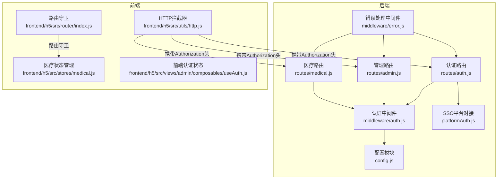
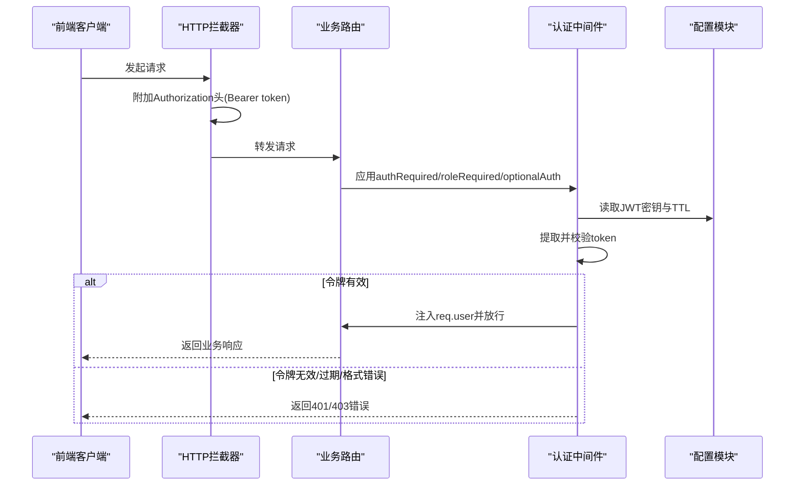
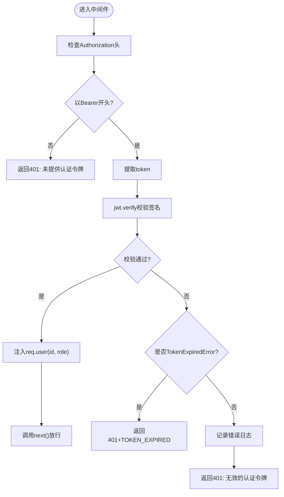
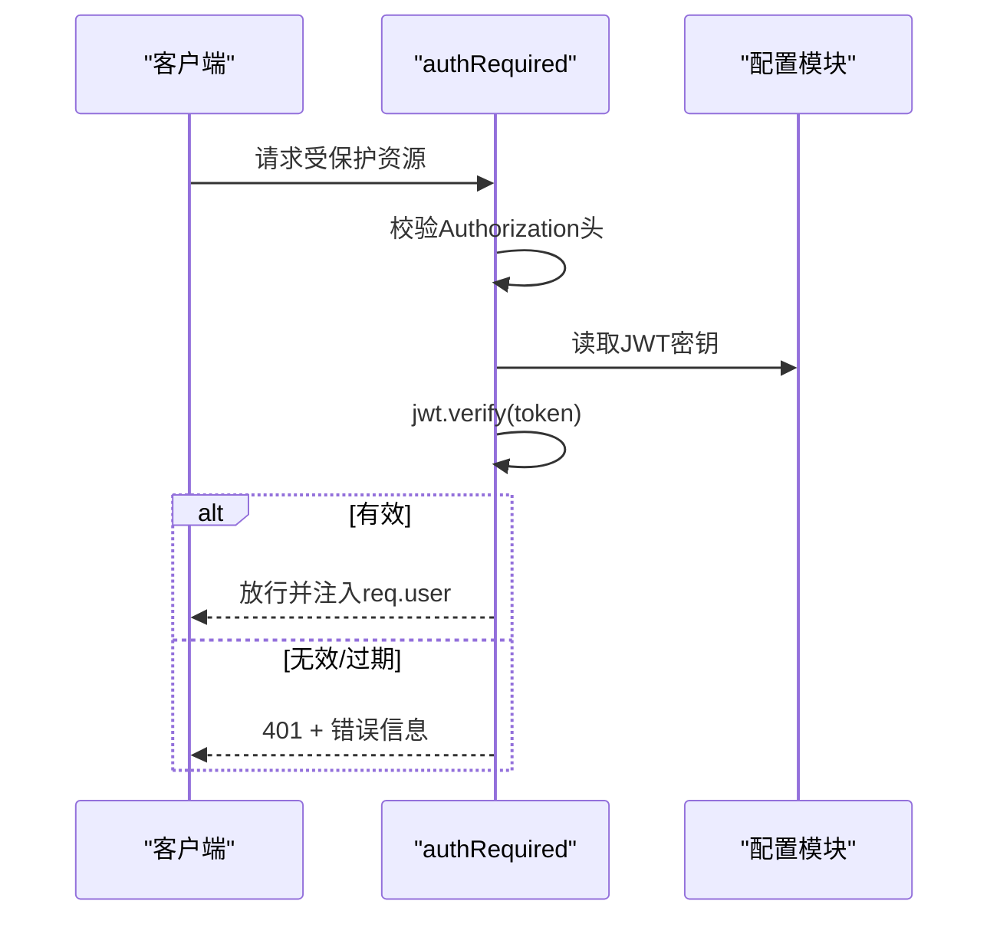
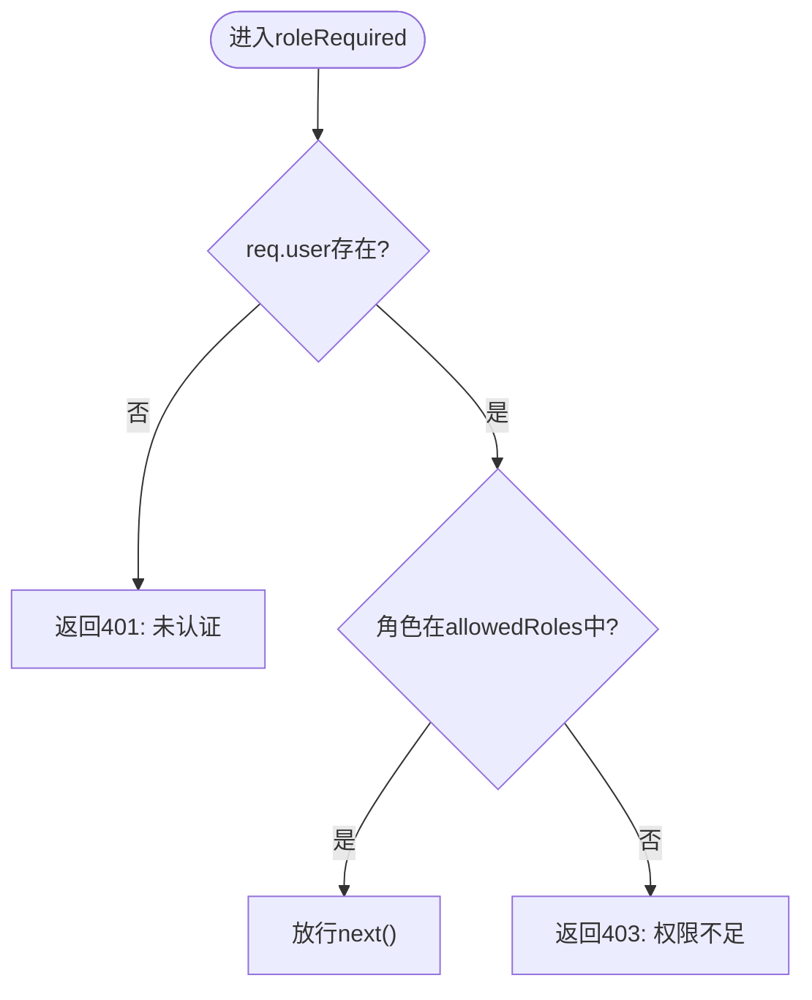
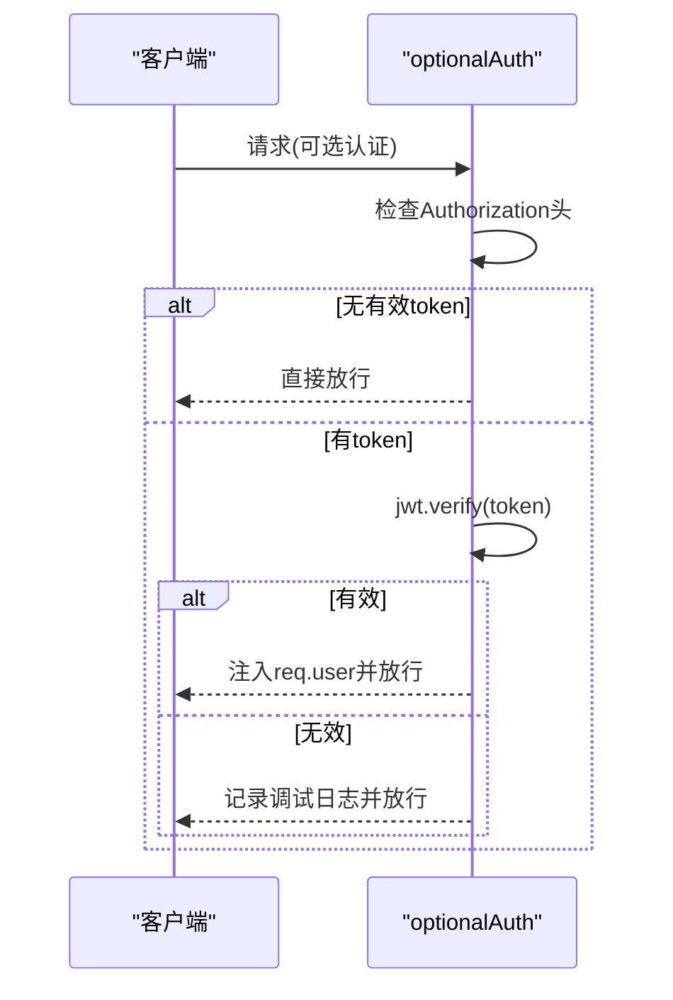
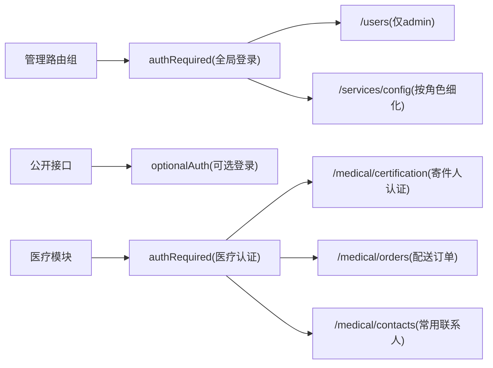
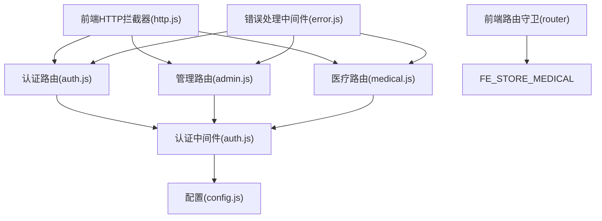
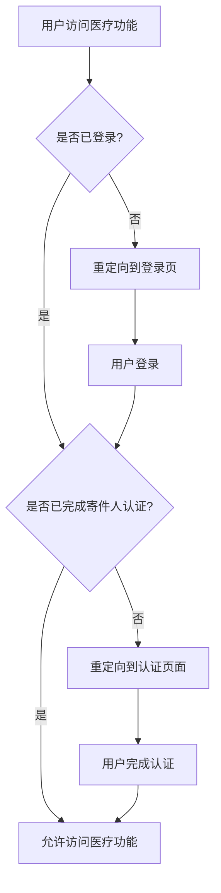

# 认证中间件

<cite>
**本文引用的文件**
- [backend/middleware/auth.js](file://backend/middleware/auth.js)
- [backend/config.js](file://backend/config.js)
- [backend/routes/admin.js](file://backend/routes/admin.js)
- [backend/routes/auth.js](file://backend/routes/auth.js)
- [backend/routes/medical.js](file://backend/routes/medical.js)
- [backend/platformAuth.js](file://backend/platformAuth.js)
- [backend/middleware/error.js](file://backend/middleware/error.js)
- [backend/middleware/validation.js](file://backend/middleware/validation.js)
- [backend/index.js](file://backend/index.js)
- [frontend/h5/src/utils/http.js](file://frontend/h5/src/utils/http.js)
- [frontend/h5/src/views/admin/composables/useAuth.js](file://frontend/h5/src/views/admin/composables/useAuth.js)
- [frontend/h5/src/router/index.js](file://frontend/h5/src/router/index.js)
- [frontend/h5/src/stores/medical.js](file://frontend/h5/src/stores/medical.js)
- [backend/package.json](file://backend/package.json)
</cite>

## 更新摘要
**变更内容**
- 新增医疗配送模块路由保护章节，详细说明医疗相关页面的认证要求
- 更新前端路由保护逻辑，增加医疗模块的路由守卫
- 扩展认证中间件使用示例，包含医疗模块的实际应用场景
- 增强错误处理和权限控制的说明，涵盖医疗模块特有的业务逻辑

## 目录
1. [简介](#简介)
2. [项目结构](#项目结构)
3. [核心组件](#核心组件)
4. [架构总览](#架构总览)
5. [详细组件分析](#详细组件分析)
6. [医疗模块路由保护](#医疗模块路由保护)
7. [依赖关系分析](#依赖关系分析)
8. [性能考虑](#性能考虑)
9. [故障排除指南](#故障排除指南)
10. [结论](#结论)
11. [附录](#附录)

## 简介
本文件系统性地阐述认证中间件的设计与实现，重点覆盖以下方面：
- JWT 令牌提取、解码与验证机制
- authRequired 中间件的强制认证逻辑、token 格式检查与错误处理
- roleRequired 中间件的角色权限验证、allowedRoles 配置与权限拒绝处理
- optionalAuth 中间件的可选认证实现与无 token 的处理策略
- 在路由中的使用示例与组合使用场景
- 认证失败的错误码与统一响应格式
- **新增** 医疗配送模块的路由保护机制与实现细节

## 项目结构
认证相关能力主要分布在后端中间件、路由与配置模块，并由前端发起请求时自动携带 Bearer 令牌。新增的医疗模块路由保护确保所有医疗相关功能都需要有效的用户认证。



**图表来源**
- [backend/middleware/auth.js:1-168](file://backend/middleware/auth.js#L1-L168)
- [backend/config.js:1-123](file://backend/config.js#L1-L123)
- [backend/routes/auth.js:1-591](file://backend/routes/auth.js#L1-L591)
- [backend/routes/admin.js:1-514](file://backend/routes/admin.js#L1-L514)
- [backend/routes/medical.js:1-1094](file://backend/routes/medical.js#L1-L1094)
- [backend/platformAuth.js:1-177](file://backend/platformAuth.js#L1-L177)
- [backend/middleware/error.js:1-90](file://backend/middleware/error.js#L1-L90)
- [frontend/h5/src/utils/http.js:1-99](file://frontend/h5/src/utils/http.js#L1-L99)
- [frontend/h5/src/views/admin/composables/useAuth.js:1-45](file://frontend/h5/src/views/admin/composables/useAuth.js#L1-L45)
- [frontend/h5/src/router/index.js:272-280](file://frontend/h5/src/router/index.js#L272-L280)
- [frontend/h5/src/stores/medical.js:1-301](file://frontend/h5/src/stores/medical.js#L1-L301)

**章节来源**
- [backend/middleware/auth.js:1-168](file://backend/middleware/auth.js#L1-L168)
- [backend/config.js:1-123](file://backend/config.js#L1-L123)
- [backend/routes/auth.js:1-591](file://backend/routes/auth.js#L1-L591)
- [backend/routes/admin.js:1-514](file://backend/routes/admin.js#L1-L514)
- [backend/routes/medical.js:1-1094](file://backend/routes/medical.js#L1-L1094)
- [backend/platformAuth.js:1-177](file://backend/platformAuth.js#L1-L177)
- [backend/middleware/error.js:1-90](file://backend/middleware/error.js#L1-L90)
- [frontend/h5/src/utils/http.js:1-99](file://frontend/h5/src/utils/http.js#L1-L99)
- [frontend/h5/src/views/admin/composables/useAuth.js:1-45](file://frontend/h5/src/views/admin/composables/useAuth.js#L1-L45)
- [frontend/h5/src/router/index.js:272-280](file://frontend/h5/src/router/index.js#L272-L280)
- [frontend/h5/src/stores/medical.js:1-301](file://frontend/h5/src/stores/medical.js#L1-L301)

## 核心组件
- authRequired：强制认证中间件，校验 Authorization 头与 JWT 有效性，注入 req.user
- roleRequired：基于角色的权限控制中间件，支持 allowedRoles 白名单
- optionalAuth：可选认证中间件，仅在存在有效 token 时注入用户信息
- rateLimit：简单速率限制中间件（非认证核心，但与登录等接口配合）

上述组件均位于认证中间件模块中，依赖配置模块提供的 JWT 密钥与过期时间。

**章节来源**
- [backend/middleware/auth.js:11-101](file://backend/middleware/auth.js#L11-L101)
- [backend/config.js:9-14](file://backend/config.js#L9-L14)

## 架构总览
认证流程自前端发起请求开始，经由中间件进行令牌校验与角色权限判断，最终进入业务路由处理。新增的医疗模块路由保护确保所有医疗相关功能都需要有效的用户认证。



**图表来源**
- [backend/middleware/auth.js:11-101](file://backend/middleware/auth.js#L11-L101)
- [backend/config.js:9-14](file://backend/config.js#L9-L14)
- [frontend/h5/src/utils/http.js:19-26](file://frontend/h5/src/utils/http.js#L19-L26)

## 详细组件分析

### JWT 令牌验证机制
- 令牌提取：从 Authorization 头中提取 Bearer token，若缺失或格式不正确则返回 401
- 令牌解码与验证：使用配置模块中的 JWT 密钥对 token 进行签名验证
- 过期处理：捕获过期错误并返回带 TOKEN_EXPIRED 错误码的 401 响应
- 无效令牌：记录日志并返回 401



**图表来源**
- [backend/middleware/auth.js:11-45](file://backend/middleware/auth.js#L11-L45)
- [backend/config.js:9-14](file://backend/config.js#L9-L14)

**章节来源**
- [backend/middleware/auth.js:11-45](file://backend/middleware/auth.js#L11-L45)
- [backend/config.js:9-14](file://backend/config.js#L9-L14)

### authRequired 强制认证中间件
- 功能：确保每个受保护路由都必须具备有效 JWT
- 令牌格式检查：要求 Authorization 头必须为 Bearer <token> 形式
- 错误处理：
  - 缺失头：401 未提供认证令牌
  - 格式错误：401 未提供认证令牌
  - 校验失败：401 无效的认证令牌
  - 过期：401 并带 TOKEN_EXPIRED 错误码
- 成功后在 req.user 中注入用户标识与角色



**图表来源**
- [backend/middleware/auth.js:11-45](file://backend/middleware/auth.js#L11-L45)
- [backend/config.js:9-14](file://backend/config.js#L9-L14)

**章节来源**
- [backend/middleware/auth.js:11-45](file://backend/middleware/auth.js#L11-L45)

### roleRequired 角色权限验证
- 功能：基于 allowedRoles 白名单进行角色校验
- 依赖：依赖前置 authRequired 已注入 req.user
- 行为：
  - 未认证：401 未认证
  - 角色不在白名单：403 权限不足
  - 通过：放行
- 典型用法：在路由级别传入允许的角色数组



**图表来源**
- [backend/middleware/auth.js:50-75](file://backend/middleware/auth.js#L50-L75)

**章节来源**
- [backend/middleware/auth.js:50-75](file://backend/middleware/auth.js#L50-L75)

### optionalAuth 可选认证
- 功能：仅在存在有效 token 时才注入用户信息；无 token 或 token 无效时不阻断请求
- 场景：某些公开接口需要"尽可能识别用户"，但不强制要求登录
- 行为：
  - 无 Authorization 或非 Bearer：直接 next()
  - 有 token 且有效：注入 req.user
  - 有 token 但无效：记录调试日志并继续 next()



**图表来源**
- [backend/middleware/auth.js:80-101](file://backend/middleware/auth.js#L80-L101)

**章节来源**
- [backend/middleware/auth.js:80-101](file://backend/middleware/auth.js#L80-L101)

### 在路由中的使用示例
- 全站强制认证：在管理路由前挂载 authRequired，使所有子路由默认需要登录
- 局部角色控制：在特定路由上叠加 roleRequired(['admin']) 实现管理员专属接口
- 组合使用：先强制认证，再按需进行角色校验
- 可选认证：在部分公开接口使用 optionalAuth，以便在登录状态下提供个性化内容
- **新增** 医疗模块认证：所有医疗相关API都需要有效的用户认证



**图表来源**
- [backend/routes/admin.js:23-24](file://backend/routes/admin.js#L23-L24)
- [backend/routes/admin.js:212-212](file://backend/routes/admin.js#L212-L212)
- [backend/routes/medical.js:16-16](file://backend/routes/medical.js#L16-L16)
- [backend/middleware/auth.js:80-101](file://backend/middleware/auth.js#L80-L101)

**章节来源**
- [backend/routes/admin.js:23-24](file://backend/routes/admin.js#L23-L24)
- [backend/routes/admin.js:212-212](file://backend/routes/admin.js#L212-L212)
- [backend/routes/medical.js:16-16](file://backend/routes/medical.js#L16-L16)
- [backend/middleware/auth.js:80-101](file://backend/middleware/auth.js#L80-L101)

## 医疗模块路由保护

### 医疗模块概述
医疗配送模块是一个完整的业务模块，包含以下核心功能：
- **寄件人认证**：用户身份认证与资质审核
- **起降场管理**：无人机起降点的管理与查询
- **常用联系人**：用户联系人的管理
- **配送订单**：医疗物品的配送订单管理
- **评价系统**：订单完成后的评价功能

### 后端路由保护机制
医疗模块的所有API接口都采用了严格的认证和权限控制：

#### 认证要求
- **所有医疗API**：必须通过 `authRequired` 中间件验证
- **管理端功能**：额外通过 `roleRequired(['admin', 'dsl_admin'])` 验证角色
- **用户专属功能**：通过 `req.user.id` 验证数据访问权限

#### 典型路由示例
```javascript
// 认证状态查询 - 需要登录
router.get('/certification/status', authRequired, asyncHandler(async (req, res) => {
  // 仅当前用户可访问
}));

// 创建订单 - 需要通过认证且完成寄件人认证
router.post('/orders', authRequired, asyncHandler(async (req, res) => {
  // 检查寄件人认证状态
  const certs = await readMedicalCertificationsDB();
  const myCert = certs.find(c => c.user_id === req.user.id && c.status === 'approved');
  if (!myCert) {
    return res.status(403).json({ success: false, message: '您尚未通过寄件人认证，无法下单' });
  }
  // 继续订单创建逻辑...
}));

// 管理端功能 - 需要管理员权限
router.get('/orders', authRequired, roleRequired(['admin', 'dsl_admin']), asyncHandler(async (req, res) => {
  // 管理员专用功能
}));
```

### 前端路由保护机制
前端通过路由守卫实现医疗模块的访问控制：

#### 路由守卫实现
```javascript
// 医疗模块路由保护
if (to.path.startsWith('/medical')) {
  const accessToken = authStorage.getAccessToken()
  if (!accessToken) {
    showFailToast('请先登录后再使用医疗配送功能')
    next('/login')
    return
  }
}
```

#### 医疗状态管理
前端通过 Pinia store 管理医疗模块的状态：
- **认证状态**：检查用户是否已完成寄件人认证
- **订单管理**：获取用户的医疗配送订单
- **联系人管理**：管理常用的联系人信息
- **起降场查询**：获取可用的起降场列表

**章节来源**
- [backend/routes/medical.js:196-210](file://backend/routes/medical.js#L196-L210)
- [backend/routes/medical.js:491-498](file://backend/routes/medical.js#L491-L498)
- [backend/routes/medical.js:768-797](file://backend/routes/medical.js#L768-L797)
- [frontend/h5/src/router/index.js:272-280](file://frontend/h5/src/router/index.js#L272-L280)
- [frontend/h5/src/stores/medical.js:44-74](file://frontend/h5/src/stores/medical.js#L44-L74)

## 依赖关系分析
- 认证中间件依赖配置模块提供 JWT 密钥与过期时间
- 路由层通过 require 引入中间件并组合使用
- 前端通过 HTTP 拦截器统一附加 Authorization 头
- 错误处理中间件统一捕获并格式化错误响应
- **新增** 医疗模块依赖认证中间件确保数据安全访问



**图表来源**
- [backend/middleware/auth.js:1-168](file://backend/middleware/auth.js#L1-L168)
- [backend/config.js:1-123](file://backend/config.js#L1-L123)
- [backend/routes/auth.js:1-591](file://backend/routes/auth.js#L1-L591)
- [backend/routes/admin.js:1-514](file://backend/routes/admin.js#L1-L514)
- [backend/routes/medical.js:1-1094](file://backend/routes/medical.js#L1-L1094)
- [backend/middleware/error.js:1-90](file://backend/middleware/error.js#L1-L90)
- [frontend/h5/src/utils/http.js:1-99](file://frontend/h5/src/utils/http.js#L1-L99)
- [frontend/h5/src/router/index.js:272-280](file://frontend/h5/src/router/index.js#L272-L280)
- [frontend/h5/src/stores/medical.js:1-301](file://frontend/h5/src/stores/medical.js#L1-L301)

**章节来源**
- [backend/middleware/auth.js:1-168](file://backend/middleware/auth.js#L1-L168)
- [backend/config.js:1-123](file://backend/config.js#L1-L123)
- [backend/routes/auth.js:1-591](file://backend/routes/auth.js#L1-L591)
- [backend/routes/admin.js:1-514](file://backend/routes/admin.js#L1-L514)
- [backend/routes/medical.js:1-1094](file://backend/routes/medical.js#L1-L1094)
- [backend/middleware/error.js:1-90](file://backend/middleware/error.js#L1-L90)
- [frontend/h5/src/utils/http.js:1-99](file://frontend/h5/src/utils/http.js#L1-L99)
- [frontend/h5/src/router/index.js:272-280](file://frontend/h5/src/router/index.js#L272-L280)
- [frontend/h5/src/stores/medical.js:1-301](file://frontend/h5/src/stores/medical.js#L1-L301)

## 性能考虑
- 令牌验证为 O(1)，开销极低
- 建议在网关或反向代理层做基础限流，避免针对登录接口的暴力尝试
- 对于高频接口，可结合 optionalAuth 降低不必要的鉴权成本
- 前端统一拦截器复用 token，减少重复请求与网络往返
- **新增** 医疗模块采用分页查询和缓存策略，提高大数据量场景下的性能表现

## 故障排除指南
- 401 未提供认证令牌
  - 检查前端是否正确设置 Authorization 头
  - 确认请求头格式为 Bearer <token>
  - **新增** 医疗模块：确认用户已完成登录且token有效
- 401 令牌已过期
  - 使用刷新令牌接口刷新 access token
  - 检查服务端 JWT 过期时间配置
- 401 无效的认证令牌
  - 核对 JWT 密钥一致性
  - 检查 token 是否被篡改或来自不同签发方
- 403 权限不足
  - 确认用户角色是否在 allowedRoles 白名单中
  - 检查路由是否正确叠加了 roleRequired 中间件
  - **新增** 医疗模块：确认用户已完成寄件人认证
- 429 请求过于频繁,请稍后重试
  - 登录/注册接口设置了速率限制，避免频繁尝试
  - 前端应避免短时间内的重复提交

**章节来源**
- [backend/middleware/auth.js:14-44](file://backend/middleware/auth.js#L14-L44)
- [backend/middleware/auth.js:53-71](file://backend/middleware/auth.js#L53-L71)
- [backend/middleware/auth.js:127-131](file://backend/middleware/auth.js#L127-L131)
- [backend/middleware/error.js:31-45](file://backend/middleware/error.js#L31-L45)

## 结论
本认证中间件体系以 JWT 为核心，结合强制认证、角色权限与可选认证三种策略，满足从公开到受限的多层级安全需求。通过统一的中间件与路由组合，既保证了安全性，又提供了良好的扩展性与可维护性。**新增的医疗模块路由保护机制进一步强化了业务数据的安全性，确保只有经过认证的用户才能访问医疗相关的功能和服务。** 建议在生产环境中严格管理 JWT 密钥与过期策略，并结合前端拦截器与错误处理机制，提供一致的用户体验。

## 附录

### 认证失败错误码与响应格式
- 401 未提供认证令牌
  - message: 未提供认证令牌
- 401 令牌已过期
  - message: 令牌已过期
  - code: TOKEN_EXPIRED
- 401 无效的认证令牌
  - message: 无效的认证令牌
- 403 权限不足
  - message: 权限不足
- 429 请求过于频繁,请稍后重试
  - message: 请求过于频繁,请稍后重试

**章节来源**
- [backend/middleware/auth.js:15-44](file://backend/middleware/auth.js#L15-L44)
- [backend/middleware/auth.js:67-71](file://backend/middleware/auth.js#L67-L71)
- [backend/middleware/auth.js:127-131](file://backend/middleware/auth.js#L127-L131)
- [backend/middleware/error.js:39-44](file://backend/middleware/error.js#L39-L44)

### 前端集成要点
- 统一在 HTTP 拦截器中附加 Authorization: Bearer <token>
- 401 时触发刷新令牌流程，刷新成功后重试原请求
- 本地持久化 access/refresh token，避免每次请求重复登录
- **新增** 医疗模块：在路由守卫中检查用户登录状态和认证状态

**章节来源**
- [frontend/h5/src/utils/http.js:19-78](file://frontend/h5/src/utils/http.js#L19-L78)
- [frontend/h5/src/router/index.js:272-280](file://frontend/h5/src/router/index.js#L272-L280)
- [frontend/h5/src/stores/medical.js:44-74](file://frontend/h5/src/stores/medical.js#L44-L74)

### 医疗模块认证流程


**图表来源**
- [frontend/h5/src/router/index.js:272-280](file://frontend/h5/src/router/index.js#L272-L280)
- [backend/routes/medical.js:491-498](file://backend/routes/medical.js#L491-L498)