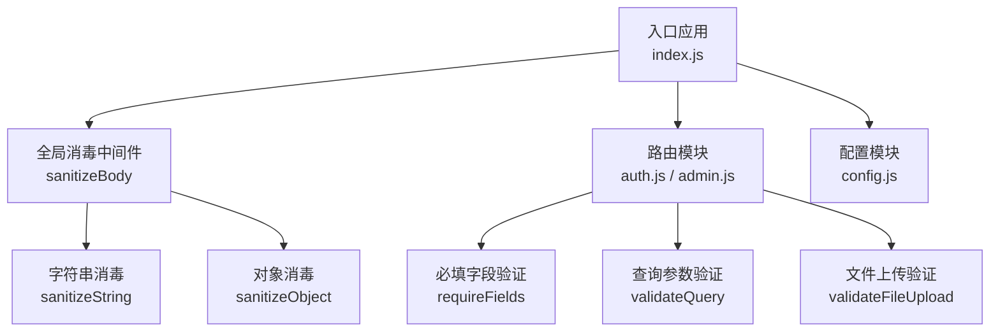
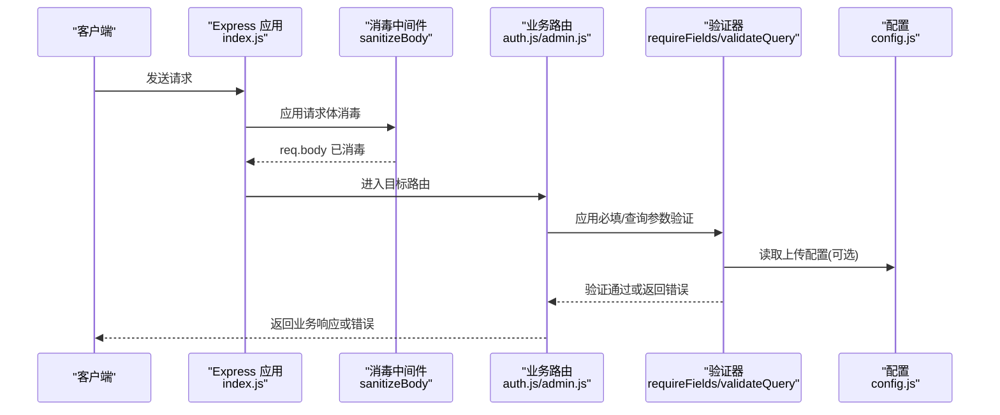
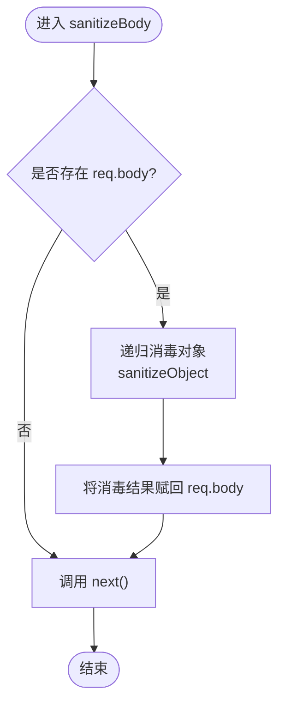
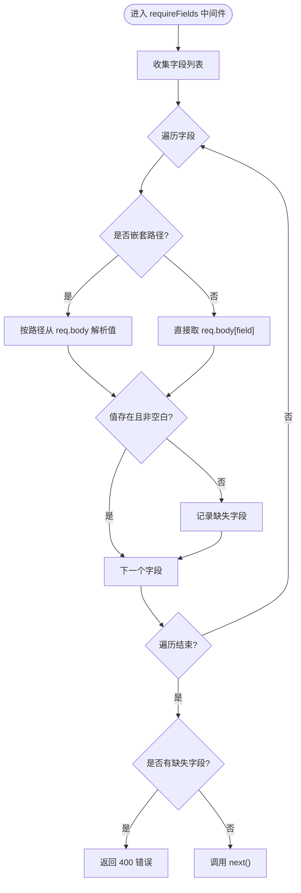
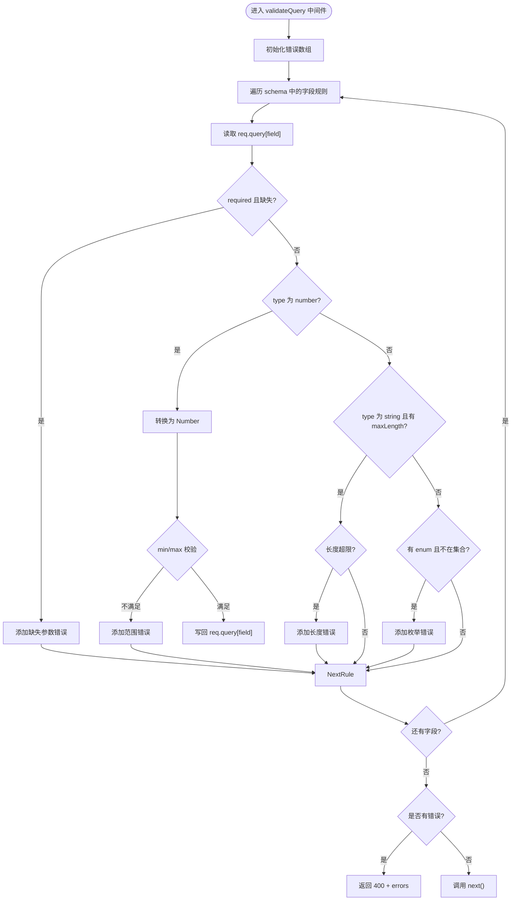
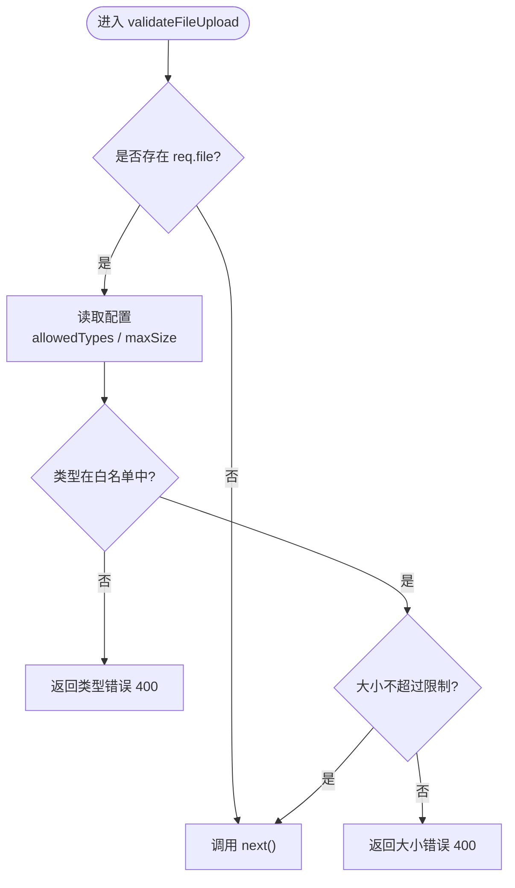
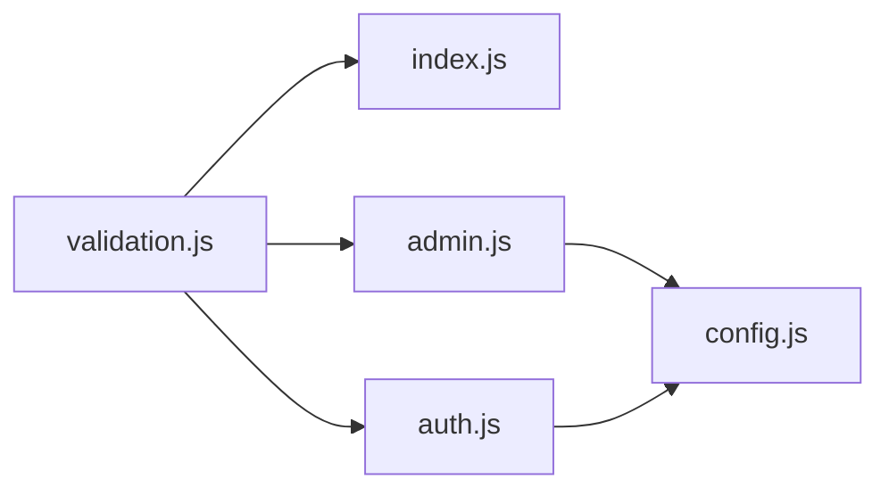

# 验证中间件

<cite>
**本文引用的文件**
- [validation.js](file://backend/middleware/validation.js)
- [index.js](file://backend/index.js)
- [auth.js](file://backend/routes/auth.js)
- [admin.js](file://backend/routes/admin.js)
- [config.js](file://backend/config.js)
</cite>

## 目录
1. [简介](#简介)
2. [项目结构](#项目结构)
3. [核心组件](#核心组件)
4. [架构总览](#架构总览)
5. [详细组件分析](#详细组件分析)
6. [依赖关系分析](#依赖关系分析)
7. [性能考量](#性能考量)
8. [故障排查指南](#故障排查指南)
9. [结论](#结论)

## 简介
本文件系统性阐述本项目的输入验证与消毒中间件，涵盖：
- 输入过滤与消毒：对请求体、查询参数、文件上传进行安全清洗
- 参数验证：必填字段、类型检查、范围限制、枚举校验
- 错误收集与格式化：统一的错误响应结构与消息组织
- 自定义规则与组合：如何扩展与组合多个验证器
- 生命周期与性能：中间件在请求生命周期中的执行时机与性能建议

## 项目结构
验证中间件位于 backend/middleware/validation.js，作为通用中间件被全局或按路由引入使用；同时在入口文件 backend/index.js 中对所有请求启用请求体消毒；在认证与管理路由中按需使用必填字段与查询参数验证。

图表来源
- [index.js:80-81](file://backend/index.js#L80-L81)
- [validation.js:52-57](file://backend/middleware/validation.js#L52-L57)
- [auth.js:96](file://backend/routes/auth.js#L96)
- [admin.js:66-71](file://backend/routes/admin.js#L66-L71)

章节来源
- [index.js:80-81](file://backend/index.js#L80-L81)
- [validation.js:52-57](file://backend/middleware/validation.js#L52-L57)

## 核心组件
- 请求体消毒中间件：对 req.body 进行递归消毒，移除潜在脚本与事件属性，清理空白
- 字符串消毒函数：移除 script 标签、事件属性、javascript 协议
- 对象消毒函数：递归处理对象、数组中的字符串字段
- 必填字段验证器：支持嵌套路径（如 a.b.c）的字段检查
- 查询参数验证器：支持数字类型、最小/最大值、字符串长度、枚举校验，并自动类型转换
- 文件上传验证器：基于配置的类型白名单与大小限制
- 基础格式校验：手机号与邮箱正则

章节来源
- [validation.js:9-47](file://backend/middleware/validation.js#L9-L47)
- [validation.js:79-98](file://backend/middleware/validation.js#L79-L98)
- [validation.js:103-149](file://backend/middleware/validation.js#L103-L149)
- [validation.js:154-180](file://backend/middleware/validation.js#L154-L180)
- [validation.js:62-74](file://backend/middleware/validation.js#L62-L74)

## 架构总览
验证中间件在请求生命周期中的位置如下：
- 全局阶段：在入口处启用请求体消毒，确保后续路由无需重复处理
- 路由阶段：按需引入必填字段与查询参数验证器，形成“前置校验”
- 文件阶段：在文件上传路由中引入文件类型与大小验证
- 错误阶段：统一返回 400 响应，包含 success、message、errors（可选）

图表来源
- [index.js:80-81](file://backend/index.js#L80-L81)
- [auth.js:96](file://backend/routes/auth.js#L96)
- [admin.js:66-71](file://backend/routes/admin.js#L66-L71)
- [config.js:55-60](file://backend/config.js#L55-L60)

## 详细组件分析

### 请求体消毒中间件
- 功能：对 req.body 进行消毒，递归处理对象与数组中的字符串字段
- 实现要点：
  - 字符串消毒：移除 script 标签、事件属性、javascript 协议
  - 对象消毒：递归遍历对象键值，数组元素逐项消毒
  - 全局启用：在入口文件中挂载，保证所有路由均受益
- 性能影响：对每个请求的 body 进行一次遍历与替换，复杂度 O(n)，其中 n 为字符串数量

图表来源
- [validation.js:52-57](file://backend/middleware/validation.js#L52-L57)
- [validation.js:27-47](file://backend/middleware/validation.js#L27-L47)
- [validation.js:9-22](file://backend/middleware/validation.js#L9-L22)

章节来源
- [validation.js:52-57](file://backend/middleware/validation.js#L52-L57)
- [validation.js:27-47](file://backend/middleware/validation.js#L27-L47)
- [validation.js:9-22](file://backend/middleware/validation.js#L9-L22)
- [index.js:80-81](file://backend/index.js#L80-L81)

### 必填字段验证器
- 功能：检查请求体中的一个或多个字段是否为空或仅空白
- 支持嵌套路径：使用点号分隔的路径（如 a.b.c）
- 行为：若发现缺失字段，立即返回 400，包含 success 与 message
- 适用场景：登录、注册、角色变更等关键字段保护

图表来源
- [validation.js:79-98](file://backend/middleware/validation.js#L79-L98)

章节来源
- [validation.js:79-98](file://backend/middleware/validation.js#L79-L98)
- [auth.js:96](file://backend/routes/auth.js#L96)
- [admin.js:230](file://backend/routes/admin.js#L230)

### 查询参数验证器
- 功能：对 GET 查询参数进行统一校验与类型转换
- 支持规则：
  - required：必填
  - type：number/string
  - min/max：数值范围
  - maxLength：字符串长度上限
  - enum：枚举集合
- 行为：收集所有错误，统一返回 400，包含 success、message、errors 数组

图表来源
- [validation.js:103-149](file://backend/middleware/validation.js#L103-L149)

章节来源
- [validation.js:103-149](file://backend/middleware/validation.js#L103-L149)
- [admin.js:66-71](file://backend/routes/admin.js#L66-L71)

### 文件上传验证器
- 功能：校验上传文件的 MIME 类型与大小
- 数据来源：从配置模块读取允许类型与最大大小
- 行为：类型不符或超大时返回 400，否则放行

图表来源
- [validation.js:154-180](file://backend/middleware/validation.js#L154-L180)
- [config.js:55-60](file://backend/config.js#L55-L60)

章节来源
- [validation.js:154-180](file://backend/middleware/validation.js#L154-L180)
- [config.js:55-60](file://backend/config.js#L55-L60)

### 基础格式校验
- 手机号校验：中国手机号格式（11 位数字，以 1 开头）
- 邮箱校验：基础邮箱正则
- 使用场景：在特定路由中补充格式校验（如注册流程）

章节来源
- [validation.js:62-74](file://backend/middleware/validation.js#L62-L74)
- [auth.js:155-170](file://backend/routes/auth.js#L155-L170)

## 依赖关系分析
- 入口应用依赖验证中间件：在 index.js 中全局启用 sanitizeBody
- 路由依赖验证器：auth.js 与 admin.js 按需引入 requireFields 与 validateQuery
- 配置依赖：validateFileUpload 依赖 config.js 中的上传配置

图表来源
- [index.js:18](file://backend/index.js#L18)
- [index.js:80-81](file://backend/index.js#L80-L81)
- [auth.js:12](file://backend/routes/auth.js#L12)
- [admin.js:18](file://backend/routes/admin.js#L18)
- [config.js:59](file://backend/config.js#L59)

章节来源
- [index.js:18](file://backend/index.js#L18)
- [index.js:80-81](file://backend/index.js#L80-L81)
- [auth.js:12](file://backend/routes/auth.js#L12)
- [admin.js:18](file://backend/routes/admin.js#L18)
- [config.js:55-60](file://backend/config.js#L55-L60)

## 性能考量
- 消毒复杂度：字符串消毒采用正则替换，整体复杂度近似 O(n)；对象/数组递归遍历，整体 O(N)，N 为字符串节点数
- 查询参数验证：遍历 schema 与参数，复杂度 O(F+P)，F 为规则数，P 为参数数
- 文件验证：类型匹配 O(T)（T 为类型数），大小比较 O(1)
- 建议：
  - 在高频路由中谨慎使用深层嵌套对象消毒
  - 对查询参数验证尽量精简 schema，避免冗余规则
  - 将 validateFileUpload 放在文件路由专用中间件链路，减少对普通路由的影响

[本节为通用性能讨论，不直接分析具体文件]

## 故障排查指南
- 缺少必填字段
  - 症状：返回 400，message 包含缺失字段列表
  - 排查：确认请求体字段名与路径是否正确，注意嵌套路径的点号分隔
  - 参考路径：[validation.js:79-98](file://backend/middleware/validation.js#L79-L98)
- 查询参数类型错误
  - 症状：返回 400，errors 包含具体字段与错误描述
  - 排查：确认传入值是否符合 type、min/max、maxLength、enum 规则
  - 参考路径：[validation.js:103-149](file://backend/middleware/validation.js#L103-L149)
- 文件类型或大小问题
  - 症状：返回 400，message 指明类型或大小限制
  - 排查：核对 config.js 中的 allowedTypes 与 maxSize 设置
  - 参考路径：[validation.js:154-180](file://backend/middleware/validation.js#L154-L180)，[config.js:55-60](file://backend/config.js#L55-L60)
- 请求体未消毒
  - 症状：业务逻辑中出现潜在脚本或多余空白
  - 排查：确认入口已启用 sanitizeBody
  - 参考路径：[index.js:80-81](file://backend/index.js#L80-L81)

章节来源
- [validation.js:79-98](file://backend/middleware/validation.js#L79-L98)
- [validation.js:103-149](file://backend/middleware/validation.js#L103-L149)
- [validation.js:154-180](file://backend/middleware/validation.js#L154-L180)
- [config.js:55-60](file://backend/config.js#L55-L60)
- [index.js:80-81](file://backend/index.js#L80-L81)

## 结论
本验证中间件提供了从输入消毒到参数验证的完整链路，具备：
- 统一的错误格式与清晰的消息组织
- 可组合的验证器（消毒、必填、查询参数、文件）
- 与配置模块解耦的可扩展性
- 在请求生命周期中的合理位置，兼顾安全性与性能

建议在新增路由时：
- 默认启用 sanitizeBody
- 按需引入 requireFields 与 validateQuery
- 对文件上传路由引入 validateFileUpload
- 通过配置模块集中管理上传策略

[本节为总结性内容，不直接分析具体文件]