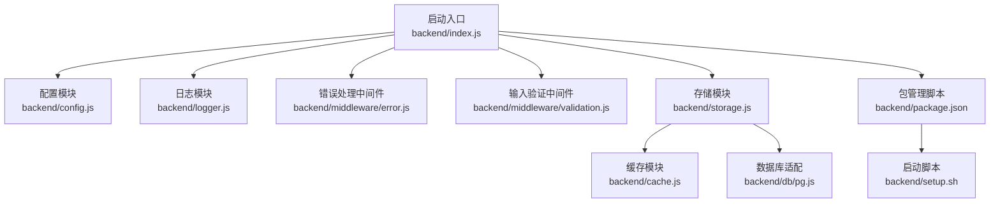
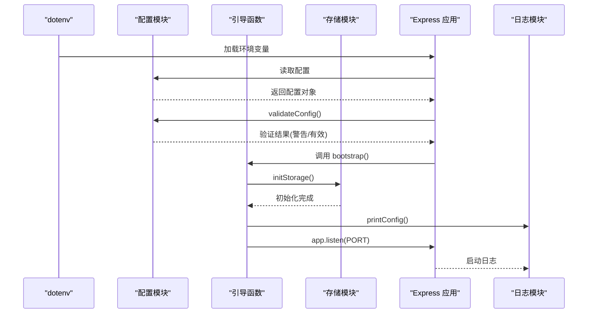
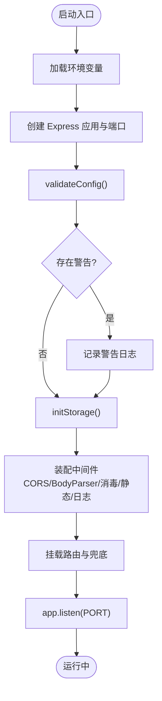
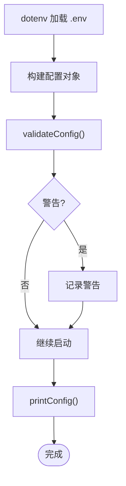
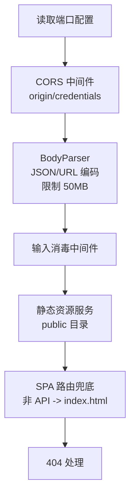
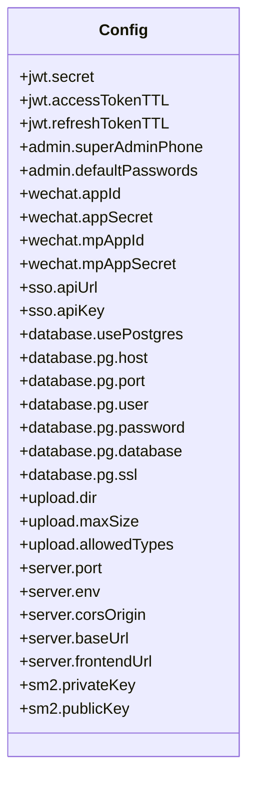
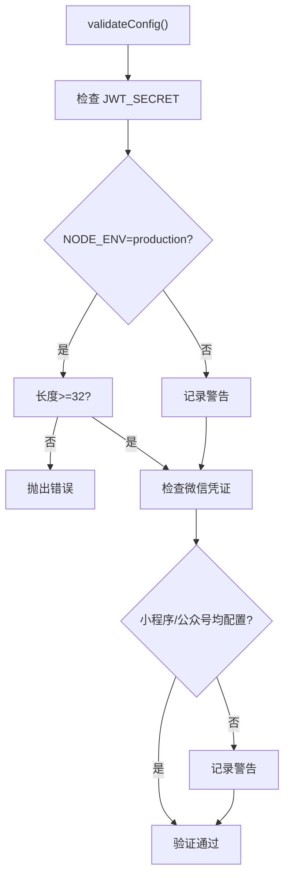
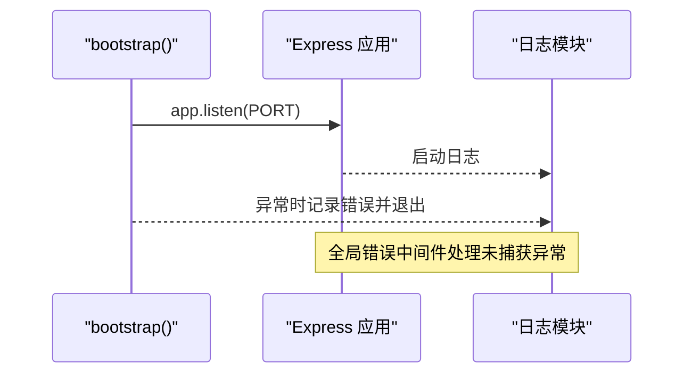
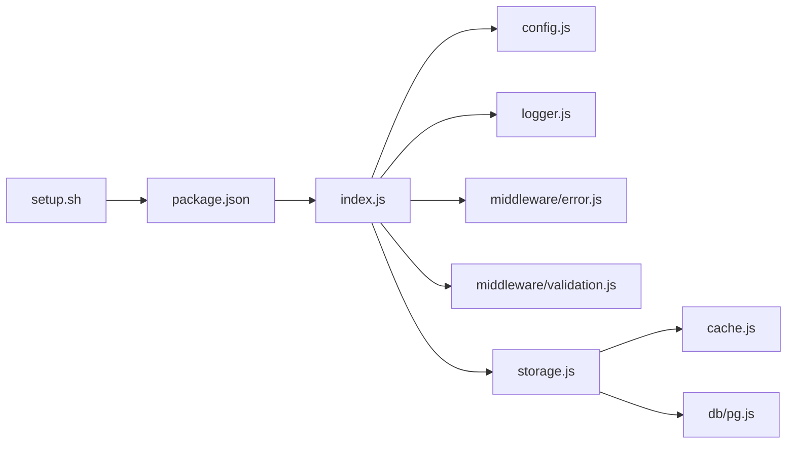

# 服务器启动与配置

<cite>
**本文引用的文件**
- [index.js](file://backend/index.js)
- [config.js](file://backend/config.js)
- [package.json](file://backend/package.json)
- [logger.js](file://backend/logger.js)
- [error.js](file://backend/middleware/error.js)
- [validation.js](file://backend/middleware/validation.js)
- [storage.js](file://backend/storage.js)
- [cache.js](file://backend/cache.js)
- [pg.js](file://backend/db/pg.js)
- [setup.sh](file://backend/setup.sh)
- [OPTIMIZATION_SUMMARY.md](file://backend/OPTIMIZATION_SUMMARY.md)
</cite>

## 目录
1. [简介](#简介)
2. [项目结构](#项目结构)
3. [核心组件](#核心组件)
4. [架构总览](#架构总览)
5. [详细组件分析](#详细组件分析)
6. [依赖关系分析](#依赖关系分析)
7. [性能考量](#性能考量)
8. [故障排查指南](#故障排查指南)
9. [结论](#结论)
10. [附录](#附录)

## 简介
本文件面向低空飞行服务平台的服务器启动与配置，系统性阐述 Express 应用初始化流程、环境变量加载机制、配置验证与打印、服务器端口与 CORS 设置、静态资源服务、配置文件结构与环境变量管理、配置验证规则、启动异常处理、服务器生命周期与优雅关闭策略，以及性能优化实践。文档同时提供可视化图示与可追溯的章节来源，帮助开发者快速理解并安全地定制与运维服务。

## 项目结构
后端采用模块化组织，关键启动与配置相关文件如下：
- 启动入口：backend/index.js
- 配置管理：backend/config.js
- 环境变量与脚本：backend/package.json、backend/setup.sh
- 日志与错误处理：backend/logger.js、backend/middleware/error.js
- 输入验证与消毒：backend/middleware/validation.js
- 存储与缓存：backend/storage.js、backend/cache.js
- 数据库适配：backend/db/pg.js

**图表来源**
- [index.js:1-1401](file://backend/index.js#L1-L1401)
- [config.js:1-123](file://backend/config.js#L1-L123)
- [logger.js:1-104](file://backend/logger.js#L1-L104)
- [error.js:1-90](file://backend/middleware/error.js#L1-L90)
- [validation.js:1-192](file://backend/middleware/validation.js#L1-L192)
- [storage.js:1-197](file://backend/storage.js#L1-L197)
- [cache.js:1-119](file://backend/cache.js#L1-L119)
- [pg.js:1-56](file://backend/db/pg.js#L1-L56)
- [package.json:1-34](file://backend/package.json#L1-L34)
- [setup.sh:1-58](file://backend/setup.sh#L1-L58)

**章节来源**
- [index.js:1-1401](file://backend/index.js#L1-L1401)
- [config.js:1-123](file://backend/config.js#L1-L123)
- [package.json:1-34](file://backend/package.json#L1-L34)
- [setup.sh:1-58](file://backend/setup.sh#L1-L58)

## 核心组件
- Express 应用初始化与中间件装配：在启动入口中完成 dotenv 加载、Express 实例创建、CORS、bodyParser、输入消毒、静态资源服务、请求日志、错误处理与 404 处理挂载。
- 配置模块：集中管理 JWT、管理员、微信、SSO、数据库、上传、服务器、SM2 等配置，并提供配置验证与打印。
- 存储与缓存：统一 JSON 文件/PostgreSQL 存储抽象，配合内存缓存减少 I/O。
- 日志与错误处理：结构化日志记录与全局错误处理中间件，区分开发与生产环境的错误信息输出。
- 数据库适配：根据环境变量选择 PostgreSQL 或本地 JSON 文件存储。

**章节来源**
- [index.js:1-1401](file://backend/index.js#L1-L1401)
- [config.js:78-123](file://backend/config.js#L78-L123)
- [storage.js:42-197](file://backend/storage.js#L42-L197)
- [cache.js:5-119](file://backend/cache.js#L5-L119)
- [logger.js:85-104](file://backend/logger.js#L85-L104)
- [error.js:9-89](file://backend/middleware/error.js#L9-L89)
- [pg.js:3-56](file://backend/db/pg.js#L3-L56)

## 架构总览
下图展示了服务器启动的关键路径：dotenv 加载、配置验证、存储初始化、Express 应用装配、监听端口与日志输出。

**图表来源**
- [index.js:1-26](file://backend/index.js#L1-L26)
- [index.js:1380-1401](file://backend/index.js#L1380-L1401)
- [config.js:78-123](file://backend/config.js#L78-L123)
- [storage.js:42-63](file://backend/storage.js#L42-L63)
- [logger.js:107-116](file://backend/logger.js#L107-L116)

**章节来源**
- [index.js:1-26](file://backend/index.js#L1-L26)
- [index.js:1380-1401](file://backend/index.js#L1380-L1401)
- [config.js:78-123](file://backend/config.js#L78-L123)
- [storage.js:42-63](file://backend/storage.js#L42-L63)
- [logger.js:107-116](file://backend/logger.js#L107-L116)

## 详细组件分析

### Express 应用初始化与中间件装配
- 环境变量加载：通过 dotenv 在应用启动初期加载 .env。
- 应用实例创建：初始化 Express 实例与端口读取。
- 配置验证：调用 validateConfig 输出警告；生产环境对 JWT 密钥长度进行强制校验。
- 中间件装配：
  - CORS：基于配置的 origin 与 credentials。
  - Body 解析：JSON/URL 编码，限制 50MB。
  - 输入消毒：全局 sanitizeBody 中间件。
  - 静态资源：提供 public 目录静态文件服务。
  - 请求日志：记录方法、URL、状态码、耗时与客户端 IP。
  - 错误处理与 404：全局 errorHandler 与 notFoundHandler。
- 路由挂载：管理后台路由、SPA 路由兜底与错误处理中间件挂载。

**图表来源**
- [index.js:1-26](file://backend/index.js#L1-L26)
- [index.js:71-1378](file://backend/index.js#L71-L1378)

**章节来源**
- [index.js:1-26](file://backend/index.js#L1-L26)
- [index.js:71-1378](file://backend/index.js#L71-L1378)

### 环境变量加载机制与配置验证
- 环境变量加载：通过 dotenv 在入口处加载 .env。
- 配置对象：集中于 config.js，涵盖 JWT、管理员、微信、SSO、数据库、上传、服务器、SM2 等。
- 配置验证：
  - 默认值提示：JWT_SECRET 使用默认值时发出警告。
  - 微信凭证完整性：若小程序或公众号凭证缺失，发出警告。
  - 生产环境强制：JWT_SECRET 长度至少 32 字符。
- 配置打印：printConfig 输出环境、端口、数据库类型、敏感信息摘要等。

**图表来源**
- [config.js:78-123](file://backend/config.js#L78-L123)
- [logger.js:107-116](file://backend/logger.js#L107-L116)

**章节来源**
- [config.js:78-123](file://backend/config.js#L78-L123)
- [logger.js:107-116](file://backend/logger.js#L107-L116)

### 服务器端口配置、CORS 跨域与静态文件服务
- 服务器端口：从配置读取，默认 3000。
- CORS：origin 来自配置，credentials 为 true。
- 静态文件：express.static 提供 public 目录静态资源服务。
- SPA 路由兜底：非 API 路由返回前端入口页面，静态资源缺失返回 404。

**图表来源**
- [index.js:22-84](file://backend/index.js#L22-L84)
- [index.js:1354-1378](file://backend/index.js#L1354-L1378)

**章节来源**
- [index.js:22-84](file://backend/index.js#L22-L84)
- [index.js:1354-1378](file://backend/index.js#L1354-L1378)

### 配置文件结构与环境变量管理
- 配置键位：
  - jwt：secret、accessTokenTTL、refreshTokenTTL
  - admin：superAdminPhone、defaultPasswords
  - wechat：appId/appSecret、mpAppId/mpAppSecret
  - sso：apiUrl/apiKey
  - database：usePostgres、pg.host/port/user/password/database/ssl
  - upload：dir/maxSize/allowedTypes
  - server：port/env/corsOrigin/baseUrl/frontendUrl
  - sm2：privateKey/publicKey
- 环境变量映射：config.js 从 process.env 读取，提供合理默认值。
- 脚本与模板：package.json 提供 start/dev 脚本；setup.sh 创建 .env、logs、uploads 并提示关键配置。

**图表来源**
- [config.js:8-76](file://backend/config.js#L8-L76)

**章节来源**
- [config.js:8-76](file://backend/config.js#L8-L76)
- [package.json:6-11](file://backend/package.json#L6-L11)
- [setup.sh:9-24](file://backend/setup.sh#L9-L24)

### 配置验证规则
- JWT_SECRET：开发环境默认值发出警告；生产环境要求至少 32 字符。
- 微信凭证：小程序与公众号凭证任一缺失发出警告。
- 数据库：根据 USE_POSTGRES 决定存储后端。
- 上传：默认上传目录、最大大小与允许类型可配置。

**图表来源**
- [config.js:78-104](file://backend/config.js#L78-L104)

**章节来源**
- [config.js:78-104](file://backend/config.js#L78-L104)

### 自定义服务器参数与扩展配置选项
- 自定义端口：通过环境变量 PORT 覆盖默认 3000。
- CORS 跨域：通过 CORS_ORIGIN 配置 origin，credentials 为 true。
- 静态资源：public 目录即为静态资源根目录。
- 扩展配置：可在 config.js 中增加新的配置键位，并在相应模块中读取；通过环境变量注入。
- 示例参考路径：
  - 端口与 CORS 设置：[index.js:22-75](file://backend/index.js#L22-L75)
  - 配置对象与验证：[config.js:8-104](file://backend/config.js#L8-L104)
  - 存储初始化与数据库切换：[storage.js:42-63](file://backend/storage.js#L42-L63)，[pg.js:3-56](file://backend/db/pg.js#L3-L56)

**章节来源**
- [index.js:22-75](file://backend/index.js#L22-L75)
- [config.js:8-104](file://backend/config.js#L8-L104)
- [storage.js:42-63](file://backend/storage.js#L42-L63)
- [pg.js:3-56](file://backend/db/pg.js#L3-L56)

### 启动异常处理与服务器生命周期
- 启动异常：bootstrap 捕获异常并通过日志记录并退出进程。
- 生命周期：应用启动后记录环境、数据库类型与端口；未处理异常通过全局错误中间件捕获并记录。
- 优雅关闭：当前代码未显式实现优雅关闭钩子；建议在生产环境中增加 SIGTERM/SIGINT 处理，释放资源与连接池。

**图表来源**
- [index.js:1380-1401](file://backend/index.js#L1380-L1401)
- [error.js:9-62](file://backend/middleware/error.js#L9-L62)

**章节来源**
- [index.js:1380-1401](file://backend/index.js#L1380-L1401)
- [error.js:9-62](file://backend/middleware/error.js#L9-L62)

## 依赖关系分析
- 启动入口依赖配置模块、存储模块、日志模块与错误处理中间件。
- 存储模块依赖缓存模块与数据库适配。
- 配置模块被启动入口与存储模块共同依赖。
- 数据库适配仅在启用 PostgreSQL 时生效。

**图表来源**
- [index.js:1-1401](file://backend/index.js#L1-L1401)
- [config.js:1-123](file://backend/config.js#L1-L123)
- [logger.js:1-104](file://backend/logger.js#L1-L104)
- [error.js:1-90](file://backend/middleware/error.js#L1-L90)
- [validation.js:1-192](file://backend/middleware/validation.js#L1-L192)
- [storage.js:1-197](file://backend/storage.js#L1-L197)
- [cache.js:1-119](file://backend/cache.js#L1-L119)
- [pg.js:1-56](file://backend/db/pg.js#L1-L56)
- [package.json:1-34](file://backend/package.json#L1-L34)
- [setup.sh:1-58](file://backend/setup.sh#L1-L58)

**章节来源**
- [index.js:1-1401](file://backend/index.js#L1-L1401)
- [storage.js:1-197](file://backend/storage.js#L1-L197)
- [pg.js:1-56](file://backend/db/pg.js#L1-L56)

## 性能考量
- 缓存策略：内存缓存减少 JSON 文件读取，用户、申请、案例、服务配置分别设定不同 TTL。
- 存储抽象：统一 read/write 接口，PostgreSQL 与 JSON 文件双栈，便于横向扩展。
- 日志与请求追踪：结构化日志记录请求耗时、状态码与客户端 IP，便于性能分析。
- 上传与压缩：图片压缩端点与上传限制，降低带宽与存储压力。
- 建议：在生产环境引入 Redis 缓存、连接池复用、CDN 与异步任务队列。

**章节来源**
- [cache.js:5-119](file://backend/cache.js#L5-L119)
- [storage.js:134-181](file://backend/storage.js#L134-L181)
- [logger.js:75-94](file://backend/logger.js#L75-L94)
- [index.js:86-114](file://backend/index.js#L86-L114)

## 故障排查指南
- 启动失败：检查 .env 是否存在且关键配置是否完整；查看启动日志与错误日志。
- 配置警告：JWT_SECRET 使用默认值或微信凭证缺失会在启动时记录警告。
- 数据库问题：确认 USE_POSTGRES 与数据库连接参数；PostgreSQL 模式下确保表存在。
- 上传失败：检查文件类型与大小限制；查看上传目录权限。
- 错误处理：全局错误中间件会记录错误上下文并在开发环境返回详细信息。

**章节来源**
- [config.js:78-104](file://backend/config.js#L78-L104)
- [pg.js:39-48](file://backend/db/pg.js#L39-L48)
- [error.js:9-62](file://backend/middleware/error.js#L9-L62)
- [setup.sh:9-24](file://backend/setup.sh#L9-L24)

## 结论
本文档系统梳理了低空飞行服务平台服务器的启动与配置流程，明确了 dotenv 加载、配置验证、中间件装配、静态资源与 CORS、存储与缓存、日志与错误处理、数据库适配与性能优化策略。通过模块化设计与环境变量管理，系统具备良好的可扩展性与可维护性。建议在生产环境中补充优雅关闭、连接池管理与缓存持久化方案，持续提升稳定性与性能。

## 附录
- 快速配置脚本：setup.sh 会创建 .env、logs、uploads 并提示关键配置项。
- 优化总结：OPTIMIZATION_SUMMARY.md 提供安全、性能、可维护性方面的优化要点与迁移建议。

**章节来源**
- [setup.sh:1-58](file://backend/setup.sh#L1-L58)
- [OPTIMIZATION_SUMMARY.md:271-325](file://backend/OPTIMIZATION_SUMMARY.md#L271-L325)