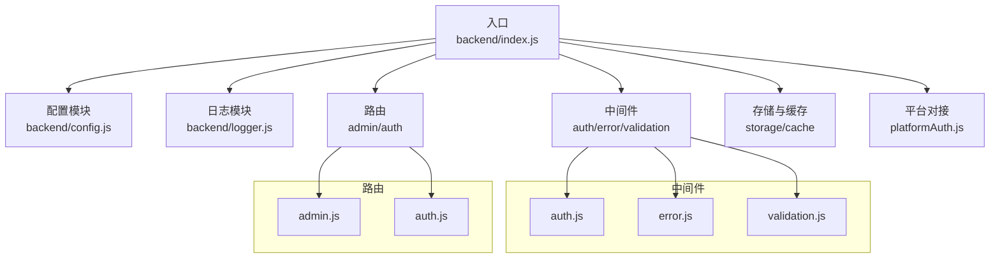
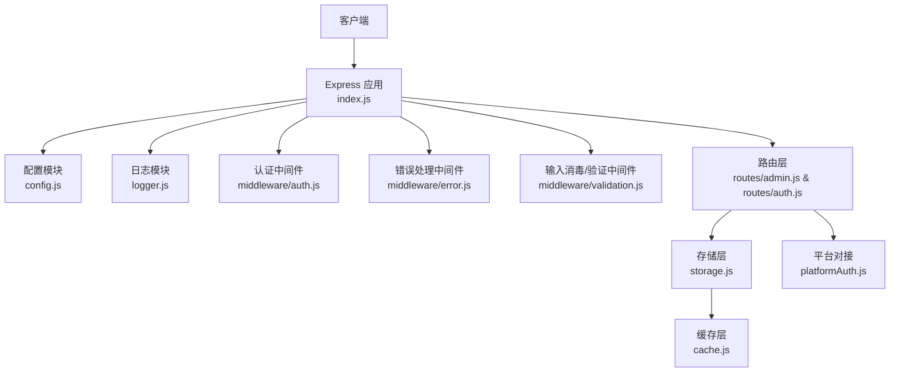
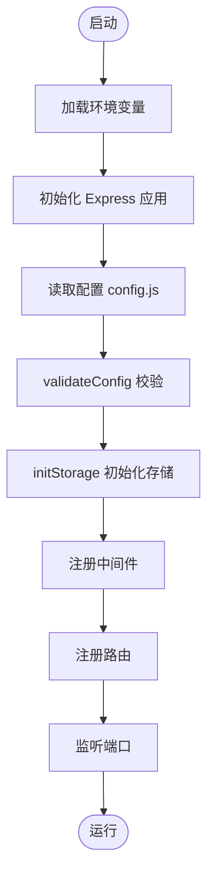
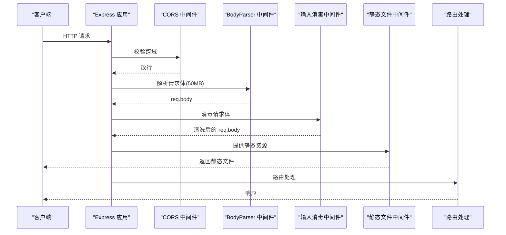
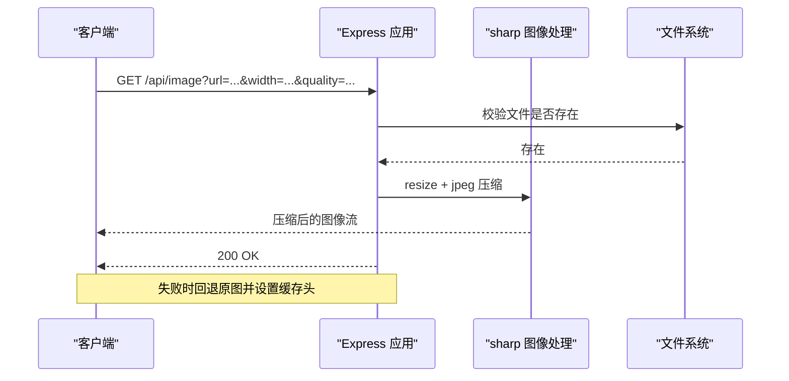
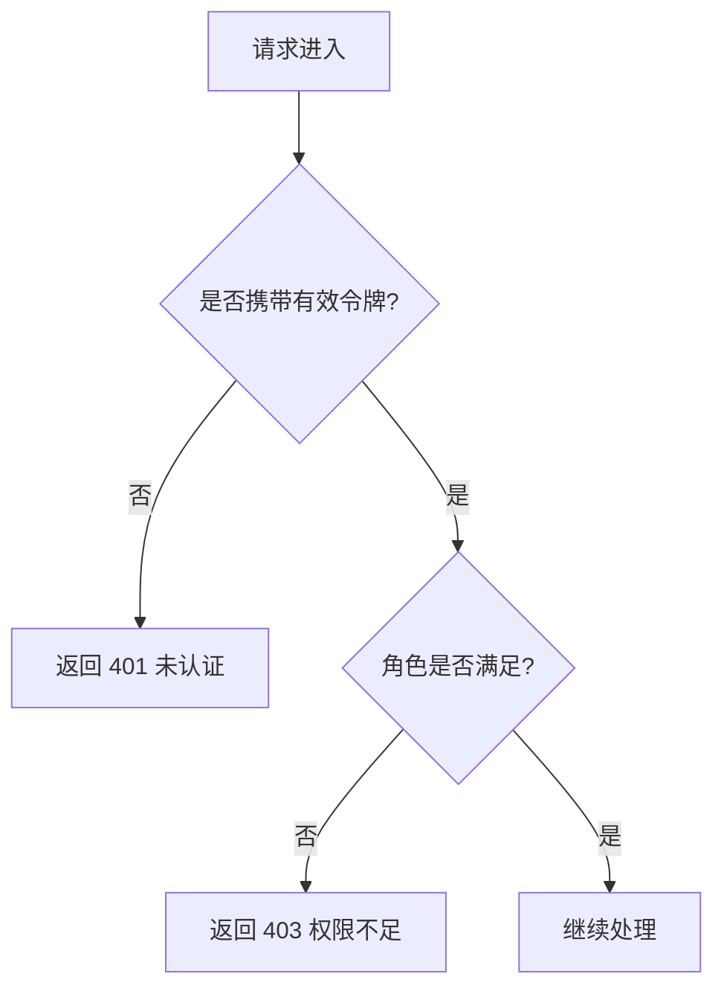
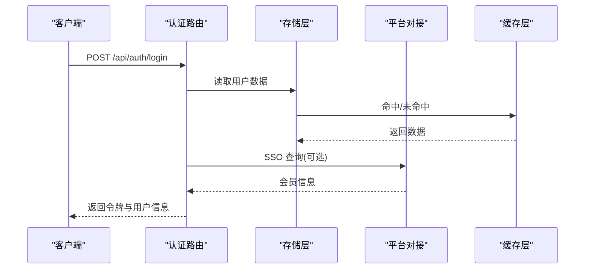
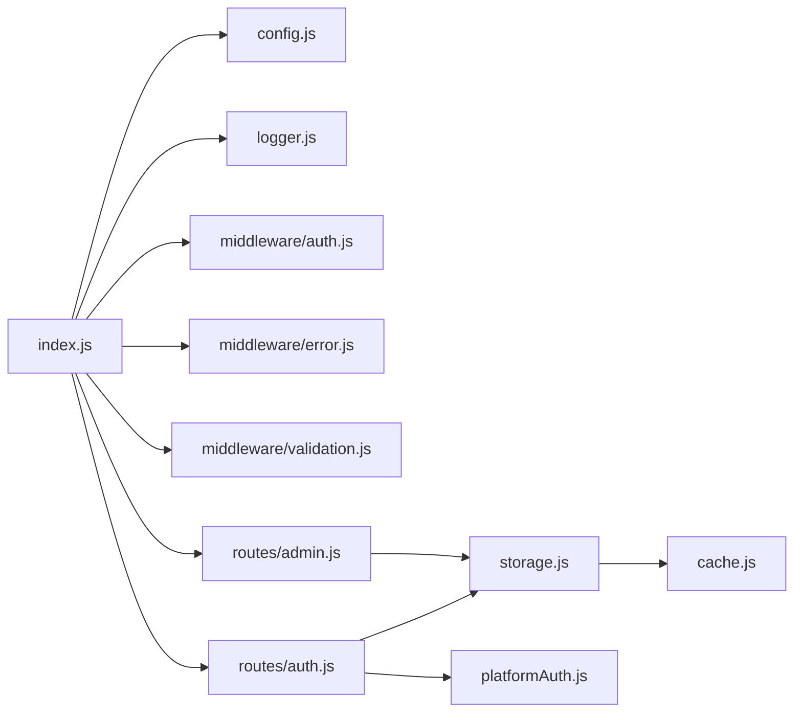

# 核心服务模块

<cite>
**本文引用的文件**
- [backend/index.js](file://backend/index.js)
- [backend/config.js](file://backend/config.js)
- [backend/logger.js](file://backend/logger.js)
- [backend/middleware/auth.js](file://backend/middleware/auth.js)
- [backend/middleware/error.js](file://backend/middleware/error.js)
- [backend/middleware/validation.js](file://backend/middleware/validation.js)
- [backend/routes/admin.js](file://backend/routes/admin.js)
- [backend/routes/auth.js](file://backend/routes/auth.js)
- [backend/storage.js](file://backend/storage.js)
- [backend/cache.js](file://backend/cache.js)
- [backend/platformAuth.js](file://backend/platformAuth.js)
- [backend/package.json](file://backend/package.json)
</cite>

## 目录
1. [简介](#简介)
2. [项目结构](#项目结构)
3. [核心组件](#核心组件)
4. [架构总览](#架构总览)
5. [详细组件分析](#详细组件分析)
6. [依赖关系分析](#依赖关系分析)
7. [性能考虑](#性能考虑)
8. [故障排查指南](#故障排查指南)
9. [结论](#结论)
10. [附录](#附录)

## 简介
本文件面向低空飞行服务平台的核心服务模块，系统性阐述服务器启动与配置流程、Express 应用初始化、中间件配置、静态文件服务设置；深入解析 CORS 配置、请求体解析、输入消毒、图片压缩处理等核心功能；同时涵盖配置验证机制、环境变量管理、日志系统集成，并提供扩展服务功能、自定义中间件与配置服务器参数的实践路径，最后总结请求处理流程、错误捕获机制与性能优化策略。

## 项目结构
后端采用 Express 应用作为入口，围绕配置模块、日志模块、中间件层、路由层与数据存储层构建。核心文件组织如下：
- 入口与应用初始化：backend/index.js
- 配置与校验：backend/config.js
- 日志系统：backend/logger.js
- 中间件：backend/middleware/auth.js、backend/middleware/error.js、backend/middleware/validation.js
- 路由：backend/routes/admin.js、backend/routes/auth.js
- 存储与缓存：backend/storage.js、backend/cache.js
- 平台对接：backend/platformAuth.js
- 依赖声明：backend/package.json

**图表来源**
- [backend/index.js:1-1401](file://backend/index.js#L1-L1401)
- [backend/config.js:1-123](file://backend/config.js#L1-L123)
- [backend/logger.js:1-104](file://backend/logger.js#L1-L104)
- [backend/middleware/auth.js:1-168](file://backend/middleware/auth.js#L1-L168)
- [backend/middleware/error.js:1-90](file://backend/middleware/error.js#L1-L90)
- [backend/middleware/validation.js:1-192](file://backend/middleware/validation.js#L1-L192)
- [backend/routes/admin.js:1-514](file://backend/routes/admin.js#L1-L514)
- [backend/routes/auth.js:1-591](file://backend/routes/auth.js#L1-L591)
- [backend/storage.js:1-197](file://backend/storage.js#L1-L197)
- [backend/cache.js:1-119](file://backend/cache.js#L1-L119)
- [backend/platformAuth.js:1-177](file://backend/platformAuth.js#L1-L177)

**章节来源**
- [backend/index.js:1-1401](file://backend/index.js#L1-L1401)
- [backend/package.json:1-34](file://backend/package.json#L1-L34)

## 核心组件
- 服务器启动与配置流程
  - 加载环境变量 dotenv
  - 初始化 Express 应用与端口
  - 配置校验 validateConfig，打印配置 printConfig
  - 初始化存储 initStorage
  - 注册中间件与路由
  - 启动监听
- Express 应用初始化
  - CORS、bodyParser、输入消毒中间件、静态文件服务
  - 统一日志中间件与错误处理中间件
- 中间件配置
  - 认证与权限：authRequired、roleRequired、optionalAuth、rateLimit
  - 错误处理：errorHandler、notFoundHandler、asyncHandler
  - 输入验证与消毒：sanitizeBody、requireFields、validateQuery、validateFileUpload
- 静态文件服务设置
  - express.static 提供 /public 目录静态资源
- 图片压缩处理
  - /api/image 接口基于 sharp 进行缩放与 JPEG 压缩，带回退逻辑与缓存头
- 配置验证机制与环境变量管理
  - config.js 从环境变量读取并集中管理敏感配置，提供 validateConfig 与 printConfig
- 日志系统集成
  - logger.js 提供结构化日志，支持控制台与文件输出，含请求与错误上下文

**章节来源**
- [backend/index.js:1-1401](file://backend/index.js#L1-L1401)
- [backend/config.js:1-123](file://backend/config.js#L1-L123)
- [backend/logger.js:1-104](file://backend/logger.js#L1-L104)
- [backend/middleware/auth.js:1-168](file://backend/middleware/auth.js#L1-L168)
- [backend/middleware/error.js:1-90](file://backend/middleware/error.js#L1-L90)
- [backend/middleware/validation.js:1-192](file://backend/middleware/validation.js#L1-L192)

## 架构总览
下图展示核心服务模块的运行时交互：Express 应用加载配置与日志，注册中间件与路由，路由调用存储与平台对接模块，最终返回响应。

**图表来源**
- [backend/index.js:1-1401](file://backend/index.js#L1-L1401)
- [backend/config.js:1-123](file://backend/config.js#L1-L123)
- [backend/logger.js:1-104](file://backend/logger.js#L1-L104)
- [backend/middleware/auth.js:1-168](file://backend/middleware/auth.js#L1-L168)
- [backend/middleware/error.js:1-90](file://backend/middleware/error.js#L1-L90)
- [backend/middleware/validation.js:1-192](file://backend/middleware/validation.js#L1-L192)
- [backend/routes/admin.js:1-514](file://backend/routes/admin.js#L1-L514)
- [backend/routes/auth.js:1-591](file://backend/routes/auth.js#L1-L591)
- [backend/storage.js:1-197](file://backend/storage.js#L1-L197)
- [backend/cache.js:1-119](file://backend/cache.js#L1-L119)
- [backend/platformAuth.js:1-177](file://backend/platformAuth.js#L1-L177)

## 详细组件分析

### 服务器启动与配置流程
- 启动步骤
  - 加载 .env 环境变量
  - 读取 config.server.port
  - validateConfig 校验关键配置，记录警告
  - initStorage 初始化数据库/文件存储
  - 注册中间件与路由
  - 监听端口
- 配置验证
  - 校验 JWT_SECRET 是否为默认值
  - 校验微信小程序与公众号凭据
  - 生产环境对 JWT_SECRET 长度进行强制校验
  - printConfig 输出环境、端口、数据库类型、敏感配置摘要

**图表来源**
- [backend/index.js:1-1401](file://backend/index.js#L1-L1401)
- [backend/config.js:78-123](file://backend/config.js#L78-L123)

**章节来源**
- [backend/index.js:1-1401](file://backend/index.js#L1-L1401)
- [backend/config.js:1-123](file://backend/config.js#L1-L123)

### Express 应用初始化与中间件配置
- CORS 配置
  - 使用 config.server.corsOrigin 与 credentials: true
- 请求体解析
  - body-parser 支持 JSON 与 URL 编码，限制 50MB
- 输入消毒
  - sanitizeBody 对 req.body 进行递归消毒，移除脚本标签、事件属性、javascript: 协议等
- 静态文件服务
  - express.static 提供 /public 目录静态资源
- 请求日志
  - 自定义中间件记录方法、URL、状态码、耗时、IP
- 错误处理
  - errorHandler、notFoundHandler、asyncHandler 统一处理错误与 404

**图表来源**
- [backend/index.js:71-128](file://backend/index.js#L71-L128)
- [backend/middleware/validation.js:50-57](file://backend/middleware/validation.js#L50-L57)

**章节来源**
- [backend/index.js:71-128](file://backend/index.js#L71-L128)
- [backend/middleware/validation.js:1-192](file://backend/middleware/validation.js#L1-L192)

### 静态文件服务与图片压缩处理
- 静态文件服务
  - express.static 挂载 /public 目录，支持前端资源与上传文件访问
- 图片压缩接口
  - GET /api/image?url=...&width=...&quality=...
  - 使用 sharp 进行缩放与 JPEG 压缩，设置缓存头
  - 失败时回退到原图并设置较短缓存

**图表来源**
- [backend/index.js:86-114](file://backend/index.js#L86-L114)

**章节来源**
- [backend/index.js:86-114](file://backend/index.js#L86-L114)

### 配置验证机制与环境变量管理
- 配置项
  - JWT：secret、accessTokenTTL、refreshTokenTTL
  - 管理员：superAdminPhone、默认密码（随机生成）
  - 微信：小程序 appId/appSecret、公众号 mpAppId/mpAppSecret
  - SSO：平台接口地址、API Key
  - 数据库：USE_POSTGRES、PG 主机、端口、用户、密码、数据库、SSL
  - 上传：目录、最大大小、允许类型
  - 服务器：端口、环境、CORS 来源、基础 URL、前端 URL
  - SM2：私钥、公钥
- 校验规则
  - JWT_SECRET 使用默认值给出警告
  - 微信凭据缺失给出警告
  - 生产环境要求 JWT_SECRET 至少 32 字符
- 打印配置
  - 输出环境、端口、数据库类型、敏感配置摘要

**章节来源**
- [backend/config.js:1-123](file://backend/config.js#L1-L123)

### 日志系统集成
- 结构化日志
  - 控制台输出：error/warn/info/debug
  - 文件输出：按日期分文件，追加写入
- 上下文信息
  - 请求日志：方法、URL、状态码、响应时间、IP、UA
  - 错误日志：消息、方法、URL、IP、堆栈、请求体摘要
- 日志级别与目录
  - 可通过 LOG_LEVEL 与 LOG_DIR 控制

**章节来源**
- [backend/logger.js:1-104](file://backend/logger.js#L1-L104)

### 认证与权限中间件
- authRequired
  - 校验 Authorization Bearer 令牌，解码后注入 req.user
- roleRequired
  - 角色白名单校验，拒绝时记录告警
- optionalAuth
  - 可选认证，失败不阻断请求
- rateLimit
  - 简单滑动窗口限流，定期清理过期数据

**图表来源**
- [backend/middleware/auth.js:11-75](file://backend/middleware/auth.js#L11-L75)

**章节来源**
- [backend/middleware/auth.js:1-168](file://backend/middleware/auth.js#L1-L168)

### 错误处理中间件
- errorHandler
  - 记录错误上下文
  - 区分 Multer 文件大小/字段错误、JWT 过期/无效、数据库约束错误
  - 开发环境返回堆栈与详情
- notFoundHandler
  - 404 接口不存在
- asyncHandler
  - 包裹异步函数，统一交给错误处理中间件

**章节来源**
- [backend/middleware/error.js:1-90](file://backend/middleware/error.js#L1-L90)

### 输入消毒与验证中间件
- sanitizeBody/sanitizeObject/sanitizeString
  - 移除脚本标签、事件属性、javascript: 协议，修剪空白
- requireFields
  - 校验必填字段（支持嵌套路径）
- validateQuery
  - 数字范围、字符串长度、枚举值校验
- validateFileUpload
  - 基于 config.upload.allowedTypes 与 maxSize 校验

**章节来源**
- [backend/middleware/validation.js:1-192](file://backend/middleware/validation.js#L1-L192)

### 路由层：认证与管理
- 认证路由（routes/auth.js）
  - 登录/注册/刷新/登出
  - SSO 验证与自动注册
  - 微信公众号与小程序登录
  - 登录/注册限流
- 管理路由（routes/admin.js）
  - 仪表板统计、申请列表与状态更新、导出 Excel
  - 用户列表与角色变更
  - 服务配置读取/更新（按角色隔离）
  - 评价审核与删除

**图表来源**
- [backend/routes/auth.js:96-147](file://backend/routes/auth.js#L96-L147)
- [backend/storage.js:134-142](file://backend/storage.js#L134-L142)
- [backend/platformAuth.js:165-172](file://backend/platformAuth.js#L165-L172)

**章节来源**
- [backend/routes/auth.js:1-591](file://backend/routes/auth.js#L1-L591)
- [backend/routes/admin.js:1-514](file://backend/routes/admin.js#L1-L514)

### 存储与缓存
- 存储层
  - 支持 JSON 文件与 PostgreSQL 两种后端
  - initStorage 初始化各表/文件
  - readJsonStore/writeJsonStore 读写 JSON 存储
- 缓存层
  - 内存缓存，支持 TTL、清理过期、统计
  - CacheKeys 常量定义键空间
  - 各数据读取函数结合缓存，降低 IO

**章节来源**
- [backend/storage.js:1-197](file://backend/storage.js#L1-L197)
- [backend/cache.js:1-119](file://backend/cache.js#L1-L119)

### 平台对接（SSO）
- 平台对接
  - 基于 SM2/SM4 加解密与签名，构造请求体
  - 发送请求到平台接口，解密响应 dataenc
  - 提供 queryMemberByAuthCode 查询会员信息

**章节来源**
- [backend/platformAuth.js:1-177](file://backend/platformAuth.js#L1-L177)

## 依赖关系分析
- Express 应用依赖配置、日志、中间件与路由
- 路由依赖存储与平台对接
- 存储依赖缓存与数据库/文件系统
- 中间件相互独立，按需组合

**图表来源**
- [backend/index.js:1-1401](file://backend/index.js#L1-L1401)
- [backend/config.js:1-123](file://backend/config.js#L1-L123)
- [backend/logger.js:1-104](file://backend/logger.js#L1-L104)
- [backend/middleware/auth.js:1-168](file://backend/middleware/auth.js#L1-L168)
- [backend/middleware/error.js:1-90](file://backend/middleware/error.js#L1-L90)
- [backend/middleware/validation.js:1-192](file://backend/middleware/validation.js#L1-L192)
- [backend/routes/auth.js:1-591](file://backend/routes/auth.js#L1-L591)
- [backend/routes/admin.js:1-514](file://backend/routes/admin.js#L1-L514)
- [backend/storage.js:1-197](file://backend/storage.js#L1-L197)
- [backend/cache.js:1-119](file://backend/cache.js#L1-L119)
- [backend/platformAuth.js:1-177](file://backend/platformAuth.js#L1-L177)

**章节来源**
- [backend/package.json:12-29](file://backend/package.json#L12-L29)

## 性能考虑
- 缓存策略
  - 用户、案例、申请、配置、评价分别设置不同 TTL，减少重复读取
  - 写入后主动清除对应缓存键，保证一致性
- 图像压缩
  - 使用 sharp 进行高效压缩，设置合理缓存头
  - 失败回退原图，避免中断用户体验
- 限流
  - 登录/注册限流防止暴力破解与滥用
- 存储后端
  - PostgreSQL 与 JSON 文件双后端切换，生产建议使用 PG

[本节为通用指导，无需具体文件分析]

## 故障排查指南
- 配置问题
  - validateConfig 报告 JWT_SECRET 默认值、微信凭据缺失等警告
  - 生产环境 JWT_SECRET 长度不足将抛错
- 日志定位
  - 使用 logger.errorWithContext 记录错误上下文
  - 请求日志包含方法、URL、状态码、响应时间、IP、UA
- 常见错误
  - 401 令牌无效/过期：检查 Authorization 头与 JWT_SECRET
  - 403 权限不足：确认角色白名单
  - 404 接口不存在：检查路由拼写与挂载顺序
  - 上传失败：检查文件类型与大小限制
- 平台对接
  - 确认平台接口地址、SM2/SM4 配置完整
  - 查看调试输出与响应结构

**章节来源**
- [backend/config.js:78-123](file://backend/config.js#L78-L123)
- [backend/logger.js:85-94](file://backend/logger.js#L85-L94)
- [backend/middleware/error.js:9-62](file://backend/middleware/error.js#L9-L62)
- [backend/platformAuth.js:30-38](file://backend/platformAuth.js#L30-L38)

## 结论
核心服务模块以 Express 为核心，通过配置驱动、中间件组合与路由分层，实现了认证鉴权、输入消毒、静态资源与图像压缩、平台对接与存储抽象。配合结构化日志与缓存策略，具备良好的可维护性与可扩展性。建议在生产环境完善密钥管理、启用 HTTPS、强化限流与监控，并持续优化缓存命中率与存储性能。

[本节为总结，无需具体文件分析]

## 附录

### 扩展服务功能与自定义中间件示例路径
- 新增认证中间件
  - 参考 [backend/middleware/auth.js:11-75](file://backend/middleware/auth.js#L11-L75)
- 新增输入验证规则
  - 参考 [backend/middleware/validation.js:62-149](file://backend/middleware/validation.js#L62-L149)
- 新增错误类型处理
  - 参考 [backend/middleware/error.js:16-61](file://backend/middleware/error.js#L16-L61)
- 自定义静态资源目录
  - 参考 [backend/index.js:83-84](file://backend/index.js#L83-L84)
- 自定义图片压缩参数
  - 参考 [backend/index.js:86-114](file://backend/index.js#L86-L114)

### 配置服务器参数示例路径
- 环境变量与默认值
  - 参考 [backend/config.js:7-76](file://backend/config.js#L7-L76)
- 配置校验与打印
  - 参考 [backend/config.js:78-123](file://backend/config.js#L78-L123)

### 请求处理流程与错误捕获机制
- 典型登录流程
  - 参考 [backend/routes/auth.js:96-147](file://backend/routes/auth.js#L96-L147)
- 统一错误捕获
  - 参考 [backend/middleware/error.js:9-62](file://backend/middleware/error.js#L9-L62)
- 异步错误包装
  - 参考 [backend/middleware/error.js:79-83](file://backend/middleware/error.js#L79-L83)