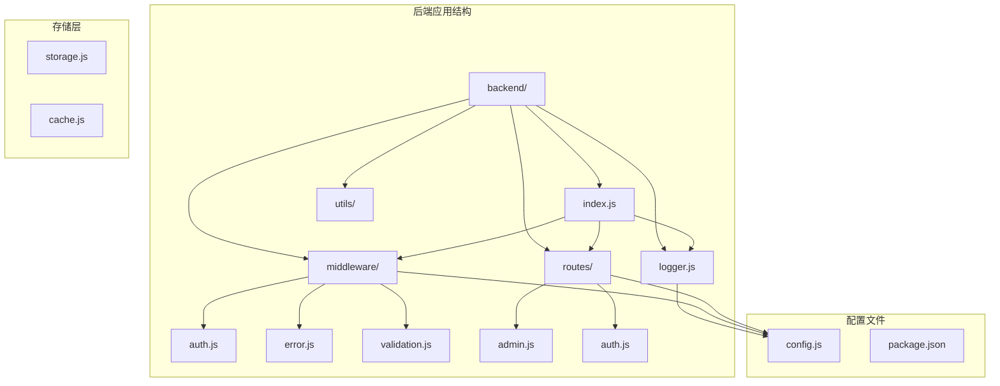
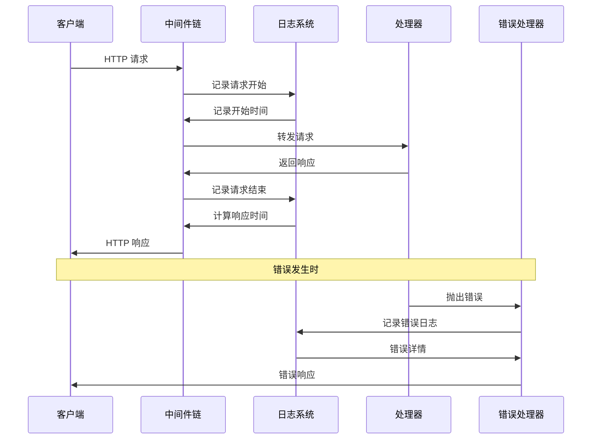
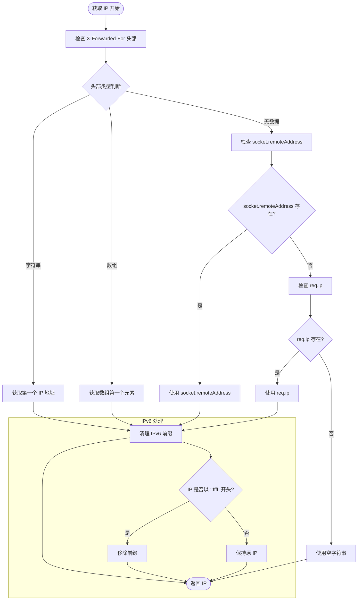
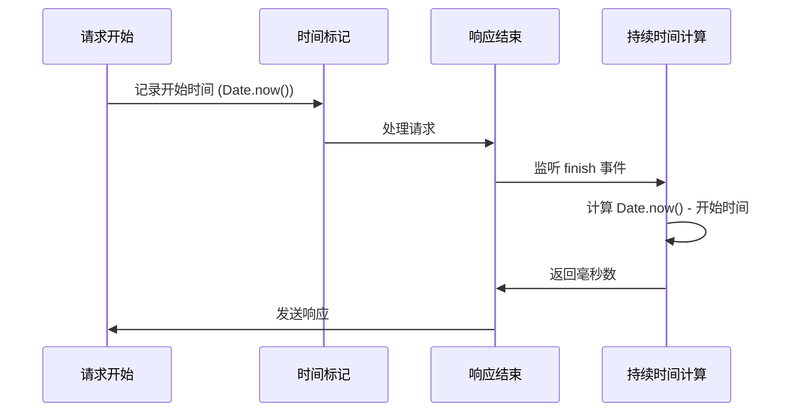
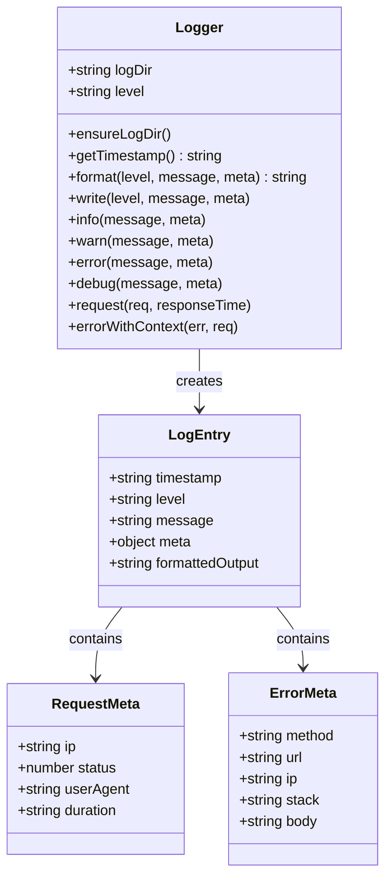
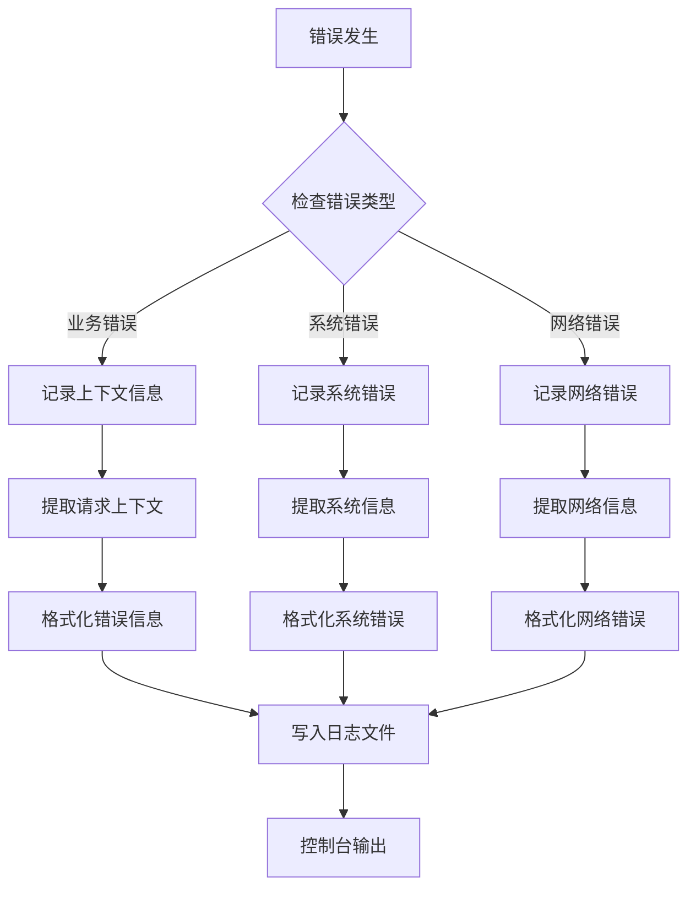
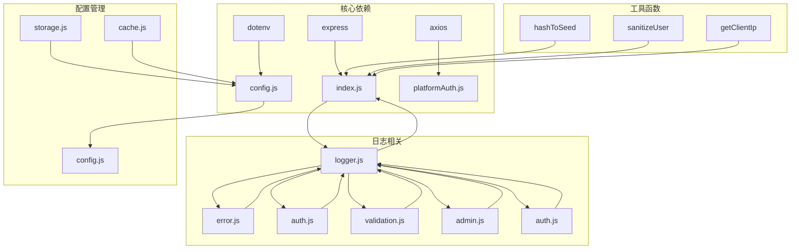
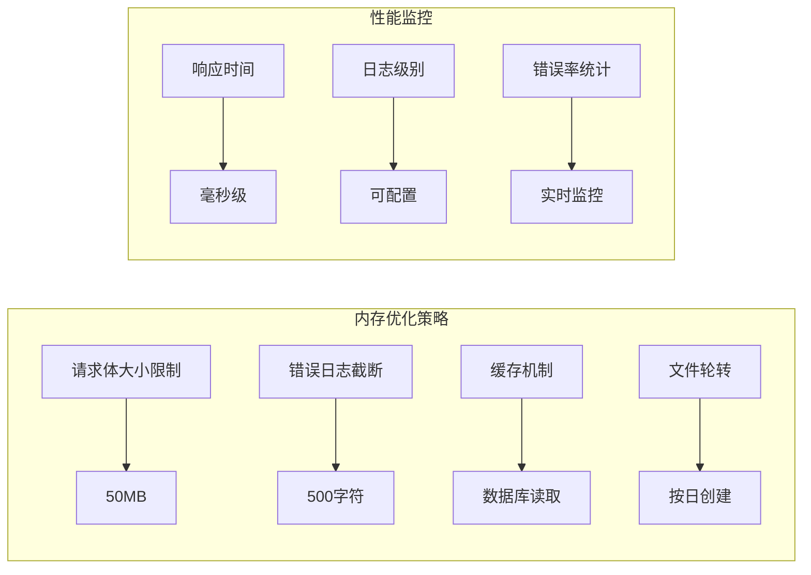

# 请求日志系统

<cite>
**本文档引用的文件**
- [logger.js](file://backend/logger.js)
- [index.js](file://backend/index.js)
- [error.js](file://backend/middleware/error.js)
- [auth.js](file://backend/middleware/auth.js)
- [validation.js](file://backend/middleware/validation.js)
- [admin.js](file://backend/routes/admin.js)
- [auth.js](file://backend/routes/auth.js)
- [config.js](file://backend/config.js)
- [package.json](file://backend/package.json)
</cite>

## 目录
1. [简介](#简介)
2. [项目结构](#项目结构)
3. [核心组件](#核心组件)
4. [架构概览](#架构概览)
5. [详细组件分析](#详细组件分析)
6. [依赖关系分析](#依赖关系分析)
7. [性能考虑](#性能考虑)
8. [故障排除指南](#故障排除指南)
9. [结论](#结论)
10. [附录](#附录)

## 简介

低空飞行服务平台的请求日志系统是一个基于 Node.js 和 Express 的完整日志解决方案。该系统提供了请求拦截器、日志格式化、性能监控、IP 地址获取算法等功能，支持多种日志级别和错误处理机制。

系统采用模块化设计，通过中间件模式实现请求拦截，使用结构化日志格式记录关键信息，并提供灵活的配置选项来满足不同环境的需求。

## 项目结构

项目采用分层架构，主要目录结构如下：

**图表来源**
- [index.js:1-50](file://backend/index.js#L1-L50)
- [logger.js:1-20](file://backend/logger.js#L1-L20)

**章节来源**
- [index.js:1-80](file://backend/index.js#L1-L80)
- [logger.js:1-104](file://backend/logger.js#L1-L104)

## 核心组件

### 日志模块 (Logger)

日志模块是整个系统的核心组件，提供了完整的日志记录功能：

- **结构化日志格式**：支持 JSON 格式的结构化日志输出
- **多级别日志**：支持 error、warn、info、debug 四个级别
- **文件轮转**：按日期自动创建日志文件
- **控制台输出**：同时支持控制台和文件双重输出

### 请求拦截器

系统通过 Express 中间件实现请求拦截，捕获每个 HTTP 请求的关键信息：

- **请求时长计算**：精确测量请求处理时间
- **状态码记录**：记录请求的 HTTP 状态码
- **IP 地址获取**：支持代理服务器场景的 IP 获取
- **用户代理识别**：记录客户端信息

### 错误处理系统

集成全局错误处理中间件，提供完整的错误日志记录：

- **上下文信息**：记录请求方法、URL、IP 等上下文信息
- **堆栈跟踪**：在开发环境中提供详细的错误堆栈
- **敏感信息过滤**：避免在日志中泄露敏感信息

**章节来源**
- [logger.js:75-95](file://backend/logger.js#L75-L95)
- [index.js:116-128](file://backend/index.js#L116-L128)
- [error.js:9-62](file://backend/middleware/error.js#L9-L62)

## 架构概览

系统采用中间件驱动的架构模式，通过多个层次的中间件实现不同的功能：

**图表来源**
- [index.js:116-128](file://backend/index.js#L116-L128)
- [error.js:9-62](file://backend/middleware/error.js#L9-L62)

## 详细组件分析

### IP 地址获取算法

系统实现了智能的 IP 地址获取算法，能够正确处理代理服务器场景：

**图表来源**
- [index.js:130-140](file://backend/index.js#L130-L140)

**算法特点**：
- 支持标准代理协议 (X-Forwarded-For)
- 处理 IPv6 地址格式转换
- 提供多层回退机制
- 自动清理 IPv6 映射前缀

**章节来源**
- [index.js:130-140](file://backend/index.js#L130-L140)

### 请求持续时间计算

系统通过高精度时间戳计算请求处理时间：

**图表来源**
- [index.js:117-127](file://backend/index.js#L117-L127)

**计算精度**：
- 使用毫秒级精度
- 基于 Node.js 内置时间函数
- 在响应完成后计算，确保准确性

**章节来源**
- [index.js:117-127](file://backend/index.js#L117-L127)

### 日志格式化系统

系统支持灵活的日志格式化，包含结构化元数据：

**图表来源**
- [logger.js:9-104](file://backend/logger.js#L9-L104)

**日志格式特性**：
- ISO 8601 时间戳格式
- 结构化 JSON 元数据
- 可配置的日志级别
- 自动文件轮转

**章节来源**
- [logger.js:26-57](file://backend/logger.js#L26-L57)

### 日志级别配置

系统支持四种日志级别，每种级别有不同的用途：

| 级别 | 用途 | 输出内容 |
|------|------|----------|
| error | 错误信息 | 错误消息、堆栈跟踪、请求上下文 |
| warn | 警告信息 | 警告消息、上下文信息 |
| info | 一般信息 | 请求信息、响应状态、处理时间 |
| debug | 调试信息 | 详细调试信息 |

**配置方式**：
- 环境变量 LOG_LEVEL 控制级别
- 运行时动态调整
- 支持生产环境优化

**章节来源**
- [logger.js:32-36](file://backend/logger.js#L32-L36)
- [logger.js:98-101](file://backend/logger.js#L98-L101)

### 错误日志处理

系统提供完整的错误日志处理机制：

**图表来源**
- [error.js:9-62](file://backend/middleware/error.js#L9-L62)
- [logger.js:85-94](file://backend/logger.js#L85-L94)

**错误处理流程**：
- 捕获所有未处理异常
- 提取详细的请求上下文
- 格式化错误信息
- 写入日志文件
- 控制台输出

**章节来源**
- [error.js:9-62](file://backend/middleware/error.js#L9-L62)
- [logger.js:85-94](file://backend/logger.js#L85-L94)

## 依赖关系分析

系统各组件之间的依赖关系如下：

**图表来源**
- [package.json:12-28](file://backend/package.json#L12-L28)
- [index.js:1-50](file://backend/index.js#L1-L50)

**依赖特点**：
- 最小化核心依赖
- 模块化设计便于维护
- 环境变量驱动配置
- 中间件模式提高可扩展性

**章节来源**
- [package.json:12-28](file://backend/package.json#L12-L28)
- [index.js:1-50](file://backend/index.js#L1-L50)

## 性能考虑

### 日志性能优化

系统在设计时充分考虑了性能影响：

- **异步文件写入**：使用同步文件操作，确保日志完整性
- **内存管理**：避免在日志中存储大对象
- **条件记录**：根据日志级别决定是否记录
- **缓冲机制**：减少磁盘 I/O 操作频率

### 内存使用优化

**优化措施**：
- 请求体大小限制防止内存溢出
- 错误日志内容截断避免过度占用
- 缓存机制减少重复读取
- 文件轮转策略控制磁盘空间

**章节来源**
- [index.js:77-78](file://backend/index.js#L77-L78)
- [logger.js:92](file://backend/logger.js#L92)

## 故障排除指南

### 常见问题诊断

| 问题类型 | 症状 | 解决方案 |
|----------|------|----------|
| 日志文件无法创建 | 控制台显示错误信息 | 检查日志目录权限 |
| IP 地址显示为 ::ffff: | 代理服务器配置问题 | 配置正确的代理头 |
| 请求时间显示为 0 | 中间件执行顺序问题 | 确保中间件正确加载 |
| 错误日志缺失 | 错误处理中间件未启用 | 检查中间件注册顺序 |

### 调试技巧

1. **启用调试模式**：设置 LOG_LEVEL=debug 获取详细信息
2. **临时禁用日志**：在开发环境中可以临时关闭日志输出
3. **分环境配置**：使用不同环境变量区分开发和生产环境
4. **日志轮转监控**：定期检查日志文件大小和数量

**章节来源**
- [logger.js:53-55](file://backend/logger.js#L53-L55)
- [config.js:78-104](file://backend/config.js#L78-L104)

## 结论

低空飞行服务平台的请求日志系统是一个设计精良、功能完整的日志解决方案。系统通过模块化设计、中间件模式和结构化日志格式，提供了全面的请求监控和错误追踪能力。

**主要优势**：
- 完整的请求生命周期监控
- 智能的 IP 地址获取算法
- 灵活的日志级别配置
- 详细的错误上下文记录
- 性能友好的实现方式

**适用场景**：
- 生产环境监控
- 开发调试支持
- 性能分析优化
- 安全审计追踪

## 附录

### 配置选项

| 配置项 | 默认值 | 描述 |
|--------|--------|------|
| LOG_DIR | ./logs | 日志文件存储目录 |
| LOG_LEVEL | info | 日志级别 (error/warn/info/debug) |
| PORT | 3000 | 服务器端口号 |
| NODE_ENV | development | 运行环境 |

### 自定义扩展

系统支持以下自定义扩展：

1. **自定义日志格式**：通过修改 Logger 类的 format 方法
2. **第三方日志服务集成**：可替换文件输出为其他服务
3. **日志过滤规则**：根据特定条件过滤日志内容
4. **性能监控指标**：扩展日志内容记录性能数据

**章节来源**
- [logger.js:98-101](file://backend/logger.js#L98-L101)
- [config.js:62-69](file://backend/config.js#L62-L69)