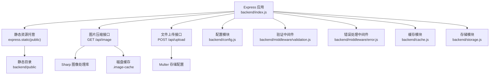
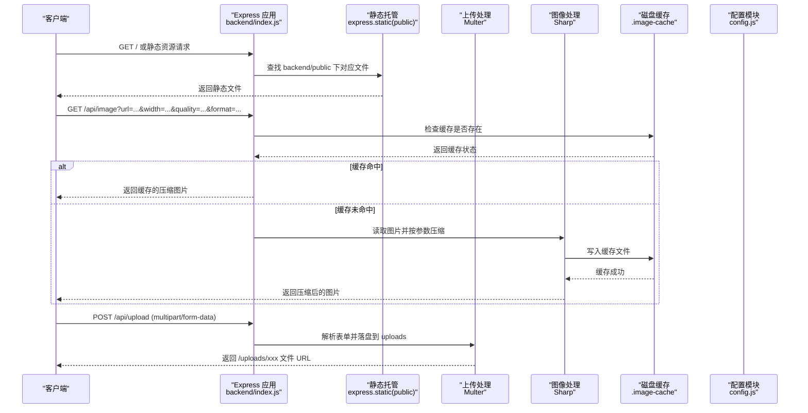
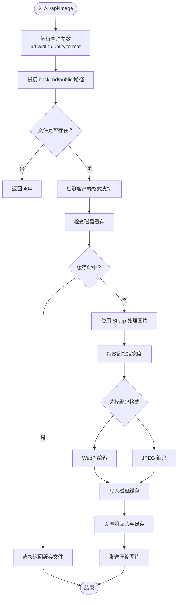
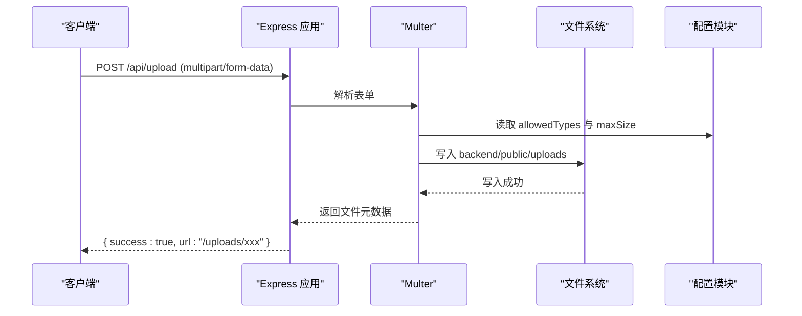
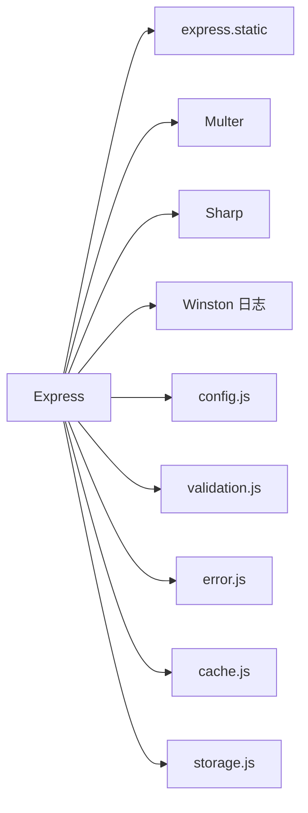

# 静态文件服务

<cite>
**本文引用的文件**
- [index.js](file://backend/index.js)
- [config.js](file://backend/config.js)
- [validation.js](file://backend/middleware/validation.js)
- [error.js](file://backend/middleware/error.js)
- [cache.js](file://backend/cache.js)
- [storage.js](file://backend/storage.js)
- [package.json](file://backend/package.json)
- [index.html](file://backend/public/index.html)
</cite>

## 更新摘要
**所做更改**
- 新增 WebP 格式支持与自动格式检测功能
- 实现磁盘缓存机制，显著提升图像处理性能
- 完善错误回退策略，增强服务稳定性
- 更新图片压缩服务架构，支持多种输出格式
- 增强客户端兼容性检测与响应头优化

## 目录
1. [简介](#简介)
2. [项目结构](#项目结构)
3. [核心组件](#核心组件)
4. [架构总览](#架构总览)
5. [详细组件分析](#详细组件分析)
6. [依赖关系分析](#依赖关系分析)
7. [性能考量](#性能考量)
8. [故障排除指南](#故障排除指南)
9. [结论](#结论)
10. [附录](#附录)

## 简介
本文件面向低空飞行服务平台的静态文件服务，系统性阐述以下主题：
- 静态文件托管配置与路径解析
- MIME 类型处理机制
- 图片压缩服务的实现原理、Sharp 库使用与磁盘缓存策略
- 文件上传处理、Multer 配置与安全校验
- WebP 格式支持与自动格式检测
- 如何扩展静态文件服务、自定义文件处理器、配置 CDN 集成
- 性能优化、安全注意事项与常见问题排查

## 项目结构
后端通过 Express 提供静态资源托管，并在同应用内提供图片压缩与文件上传能力。关键目录与文件如下：
- backend/public：静态资源根目录，包含 HTML、CSS、JS、图片、视频等
- backend/.image-cache：磁盘缓存目录，存储压缩后的图片文件
- backend/index.js：应用入口，注册静态托管、图片压缩、文件上传等路由
- backend/config.js：集中式配置（含上传与服务器参数）
- backend/middleware/validation.js：输入消毒与文件上传校验
- backend/middleware/error.js：统一错误处理（含 Multer 限制）
- backend/cache.js：内存缓存模块
- backend/storage.js：数据持久化与缓存键常量
- backend/package.json：依赖声明（含 sharp、multer）

**图表来源**
- [index.js:83-114](file://backend/index.js#L83-L114)
- [index.js:261-285](file://backend/index.js#L261-L285)
- [config.js:55-60](file://backend/config.js#L55-L60)
- [validation.js:154-180](file://backend/middleware/validation.js#L154-L180)
- [error.js:16-29](file://backend/middleware/error.js#L16-L29)
- [cache.js:101-119](file://backend/cache.js#L101-L119)
- [storage.js:134-181](file://backend/storage.js#L134-L181)

**章节来源**
- [index.js:83-114](file://backend/index.js#L83-L114)
- [index.js:261-285](file://backend/index.js#L261-L285)
- [config.js:55-60](file://backend/config.js#L55-L60)

## 核心组件
- 静态文件托管：使用 Express 内置的静态托管中间件，将 backend/public 目录作为静态资源根目录对外提供服务。
- 图片压缩服务：提供 /api/image 接口，基于 Sharp 对指定图片进行缩放与多格式压缩（JPEG/WebP），支持磁盘缓存与自动格式检测；失败时回退到原图。
- 文件上传服务：基于 Multer 的磁盘存储，将上传文件保存到 backend/public/uploads，并返回相对 URL。
- 安全与校验：通过输入消毒中间件与文件类型/大小校验中间件，结合配置模块限制上传类型与大小；统一错误处理捕获 Multer 限制错误。
- 缓存策略：针对数据库读写使用内存缓存模块，降低频繁读取 JSON 文件的开销；图片压缩支持磁盘缓存机制。

**章节来源**
- [index.js:83-114](file://backend/index.js#L83-L114)
- [index.js:261-285](file://backend/index.js#L261-L285)
- [validation.js:154-180](file://backend/middleware/validation.js#L154-L180)
- [error.js:16-29](file://backend/middleware/error.js#L16-L29)
- [cache.js:101-119](file://backend/cache.js#L101-L119)
- [storage.js:134-181](file://backend/storage.js#L134-L181)

## 架构总览
下图展示了静态文件服务在系统中的位置与交互：

**图表来源**
- [index.js:83-114](file://backend/index.js#L83-L114)
- [index.js:261-285](file://backend/index.js#L261-L285)
- [config.js:55-60](file://backend/config.js#L55-L60)

## 详细组件分析

### 静态文件托管与路径解析
- 配置方式：通过 express.static 将 backend/public 设为静态资源根目录，所有静态请求由该中间件处理。
- 路径解析规则：请求路径直接映射到 backend/public 下的文件；例如 /assets/index-DSPAQUCo.js 映射到 backend/public/assets/index-DSPAQUCo.js。
- HTML 中的资源引用：前端 index.html 中的资源链接均以绝对路径形式指向静态托管根目录，确保跨页面一致加载。
- 缓存优化：启用 7 天缓存、ETag 和 Last-Modified 支持，提升静态资源加载性能。

**章节来源**
- [index.js:83-89](file://backend/index.js#L83-L89)
- [index.html:30-33](file://backend/public/index.html#L30-L33)

### MIME 类型处理
- Express 静态托管会根据文件扩展名自动设置 Content-Type；例如 .css、.js、.jpg、.png、.mp4 等。
- 本项目未显式覆写 MIME 类型，遵循 Express/Node 默认行为；如需自定义，可在应用启动前通过中间件或自定义 send 包装器进行补充。

**章节来源**
- [index.js:83-89](file://backend/index.js#L83-L89)

### 图片压缩服务（/api/image）
- 接口设计：GET /api/image?url=...&width=...&quality=...&format=...
- 参数解析：从查询参数提取 url、width、quality、format；width 默认 800，quality 默认 75。
- 路径解析与安全：将 url 解析为 backend/public 下的绝对路径，若路径不存在则返回 404。
- 格式检测与选择：优先检测客户端 Accept 头中的 image/webp 支持，自动选择 WebP 或 JPEG 输出格式。
- 处理流程：使用 Sharp 对图片进行缩放（保持纵横比、不放大）并输出相应格式；设置响应头 Content-Type 与缓存控制。
- 磁盘缓存机制：生成基于源文件修改时间和参数的缓存键，支持 WebP/JPEG 双格式缓存。
- 回退策略：当 Sharp 处理失败时，记录警告并回退到原图，同时设置较短缓存时间。

**图表来源**
- [index.js:98-153](file://backend/index.js#L98-L153)

**章节来源**
- [index.js:98-153](file://backend/index.js#L98-L153)

### 图片压缩服务实现要点
- Sharp 库使用：在运行时动态 require('sharp')，对图片执行 resize 与多格式编码；WebP 启用质量压缩，JPEG 启用 progressive 提升渐进渲染体验。
- 磁盘缓存策略：成功压缩时设置 30 天缓存（immutable），失败回退时设置 1 小时缓存，减少重复处理与带宽消耗。
- 格式智能检测：通过 Accept 头自动判断客户端对 WebP 的支持情况，优先提供 WebP 以获得更好的压缩效果。
- 错误处理：捕获异常并记录日志，保证服务可用性与可观测性。

**章节来源**
- [index.js:129-152](file://backend/index.js#L129-L152)
- [package.json:25](file://backend/package.json#L25)

### 文件上传处理（/api/upload）
- 存储配置：使用 Multer 的 diskStorage，destination 自动创建 backend/public/uploads 目录，filename 采用时间戳+随机数+原始扩展名，避免冲突。
- 接口设计：POST /api/upload，字段名为 file；成功返回 { success: true, url: '/uploads/xxx' }。
- 安全校验：通过 validateFileUpload 中间件对文件类型与大小进行校验，结合 config.upload.allowedTypes 与 maxSize。

**图表来源**
- [index.js:317-324](file://backend/index.js#L317-L324)
- [validation.js:154-180](file://backend/middleware/validation.js#L154-L180)
- [config.js:55-60](file://backend/config.js#L55-L60)

**章节来源**
- [index.js:317-324](file://backend/index.js#L317-L324)
- [validation.js:154-180](file://backend/middleware/validation.js#L154-L180)
- [config.js:55-60](file://backend/config.js#L55-L60)

### 文件安全检查
- 输入消毒：sanitizeBody 中间件对请求体进行 XSS 过滤与脚本标签清理，降低注入风险。
- 文件类型与大小：validateFileUpload 严格校验文件 MIME 类型与大小，防止恶意或超大文件上传。
- 统一错误处理：error.js 捕获 LIMIT_FILE_SIZE、LIMIT_UNEXPECTED_FILE 等 Multer 限制错误并返回友好提示。

**章节来源**
- [validation.js:52-57](file://backend/middleware/validation.js#L52-L57)
- [validation.js:154-180](file://backend/middleware/validation.js#L154-L180)
- [error.js:16-29](file://backend/middleware/error.js#L16-L29)

### 缓存策略与性能
- 数据层缓存：storage.js 对用户、案例、申请、配置、评论等数据读取使用 cache.js 的内存缓存，分别设置不同 TTL，减少磁盘 IO。
- 图片压缩缓存：/api/image 成功压缩时设置 30 天缓存，失败回退时设置 1 小时缓存，兼顾一致性与性能。
- 静态资源缓存：express.static 启用 7 天缓存、ETag 和 Last-Modified 支持，显著提升静态资源加载性能。
- 建议：对热点静态资源可结合 CDN 缓存策略，进一步降低源站压力。

**章节来源**
- [storage.js:134-181](file://backend/storage.js#L134-L181)
- [cache.js:101-119](file://backend/cache.js#L101-L119)
- [index.js:83-89](file://backend/index.js#L83-L89)

## 依赖关系分析
- Express：提供静态托管、路由与中间件能力
- Multer：处理 multipart/form-data，实现文件上传
- Sharp：高性能图像处理库，支持多格式压缩
- Winston：日志记录（用于图片压缩失败的警告）
- winston：日志记录（用于图片压缩失败的警告）

**图表来源**
- [index.js:83-114](file://backend/index.js#L83-L114)
- [index.js:261-285](file://backend/index.js#L261-L285)
- [package.json:12-28](file://backend/package.json#L12-L28)

**章节来源**
- [package.json:12-28](file://backend/package.json#L12-L28)

## 性能考量
- 静态资源：启用 7 天缓存、ETag 和 Last-Modified 支持，显著提升静态资源加载性能。
- 图片压缩：智能格式检测与磁盘缓存机制，避免重复处理；合理设置 width 与 quality，避免过度压缩影响体验。
- 文件上传：限制文件大小与类型，避免磁盘膨胀；定期清理 uploads 目录。
- 数据缓存：storage.js 已内置缓存，注意缓存键与 TTL 的合理性。
- WebP 优化：自动检测客户端支持情况，优先提供 WebP 格式以获得更好的压缩效果。

## 故障排除指南
- 图片压缩失败
  - 现象：/api/image 返回原图或报错
  - 排查：查看日志中关于 Sharp 的警告；确认图片路径有效且可读；检查 Sharp 依赖是否正确安装
  - 参考
    - [index.js:146-152](file://backend/index.js#L146-L152)
- WebP 格式不支持
  - 现象：客户端收到 JPEG 而非 WebP
  - 排查：检查客户端 Accept 头是否包含 image/webp；确认客户端浏览器支持 WebP
  - 参考
    - [index.js:109-112](file://backend/index.js#L109-L112)
- 磁盘缓存问题
  - 现象：缓存文件未生成或无法读取
  - 排查：确认 .image-cache 目录存在且有写入权限；检查磁盘空间；验证缓存文件命名规则
  - 参考
    - [index.js:92-96](file://backend/index.js#L92-L96)
- 文件上传失败
  - 现象：返回"文件过大"或"不支持的文件类型"
  - 排查：核对 config.upload.allowedTypes 与 maxSize；确认前端表单字段名与文件类型
  - 参考
    - [error.js:16-29](file://backend/middleware/error.js#L16-L29)
    - [validation.js:154-180](file://backend/middleware/validation.js#L154-L180)
    - [config.js:55-60](file://backend/config.js#L55-L60)
- 静态资源 404
  - 现象：访问 /assets/... 或 /images/... 返回 404
  - 排查：确认文件存在于 backend/public 对应目录；检查路径大小写与拼写
  - 参考
    - [index.js:83-89](file://backend/index.js#L83-L89)
- CORS 与跨域
  - 现象：前端跨域请求被阻止
  - 排查：检查 config.server.corsOrigin 是否包含前端地址
  - 参考
    - [index.js:72-75](file://backend/index.js#L72-L75)
    - [config.js:62-69](file://backend/config.js#L62-L69)

## 结论
本静态文件服务以 Express 为核心，结合 Multer 与 Sharp 实现了完整的静态托管、图片压缩与文件上传能力。新增的 WebP 格式支持、磁盘缓存机制和自动格式检测显著提升了图像处理的性能和兼容性。通过配置化与中间件机制实现了安全与性能的平衡。建议在生产环境中进一步引入 CDN、完善监控告警，并持续优化缓存策略与上传限制。

## 附录

### 如何扩展静态文件服务
- 新增静态目录
  - 在 backend/public 下新增子目录，无需额外配置即可通过 /dir/xxx 访问
  - 参考
    - [index.js:83-89](file://backend/index.js#L83-L89)
- 自定义文件处理器
  - 在 /api 下新增路由，结合 fs 与 path 实现自定义逻辑（如水印、裁剪、批量转换）
  - 参考
    - [index.js:98-153](file://backend/index.js#L98-L153)
- 配置 CDN 集成
  - 将静态资源托管迁移至 CDN，前端通过 CDN 域名访问；后端仍保留 /api/image 与 /api/upload 以提供处理与上传能力
  - 参考
    - [index.js:83-89](file://backend/index.js#L83-L89)
    - [index.js:317-324](file://backend/index.js#L317-L324)

### 关键配置项参考
- 服务器与上传
  - 参考
    - [config.js:55-60](file://backend/config.js#L55-L60)
    - [config.js:62-69](file://backend/config.js#L62-L69)
- 缓存键与 TTL
  - 参考
    - [storage.js:134-181](file://backend/storage.js#L134-L181)
    - [cache.js:101-119](file://backend/cache.js#L101-L119)
- WebP 格式支持
  - 参考
    - [index.js:109-112](file://backend/index.js#L109-L112)
    - [index.js:133-137](file://backend/index.js#L133-L137)