# JWT认证机制

<cite>
**本文档引用的文件**
- [backend/middleware/auth.js](file://backend/middleware/auth.js)
- [backend/routes/auth.js](file://backend/routes/auth.js)
- [backend/config.js](file://backend/config.js)
- [backend/storage.js](file://backend/storage.js)
- [backend/cache.js](file://backend/cache.js)
- [backend/platformAuth.js](file://backend/platformAuth.js)
- [frontend/h5/src/utils/http.js](file://frontend/h5/src/utils/http.js)
- [frontend/h5/src/stores/user.js](file://frontend/h5/src/stores/user.js)
- [backend/index.js](file://backend/index.js)
</cite>

## 目录
1. [简介](#简介)
2. [项目结构](#项目结构)
3. [核心组件](#核心组件)
4. [架构概览](#架构概览)
5. [详细组件分析](#详细组件分析)
6. [依赖关系分析](#依赖关系分析)
7. [性能考虑](#性能考虑)
8. [故障排除指南](#故障排除指南)
9. [结论](#结论)

## 简介

本项目实现了基于JWT（JSON Web Token）的完整认证机制，包括令牌生成、验证、刷新和登出功能。系统支持多种认证方式，包括传统用户名密码认证、微信小程序认证、微信公众号OAuth认证以及单点登录（SSO）认证。

JWT认证机制提供了以下核心特性：
- 基于Bearer Token的HTTP认证
- 访问令牌和刷新令牌双重机制
- 角色权限控制
- 可选认证支持
- 速率限制保护
- 多种第三方认证集成

## 项目结构

JWT认证机制在项目中的组织结构如下：

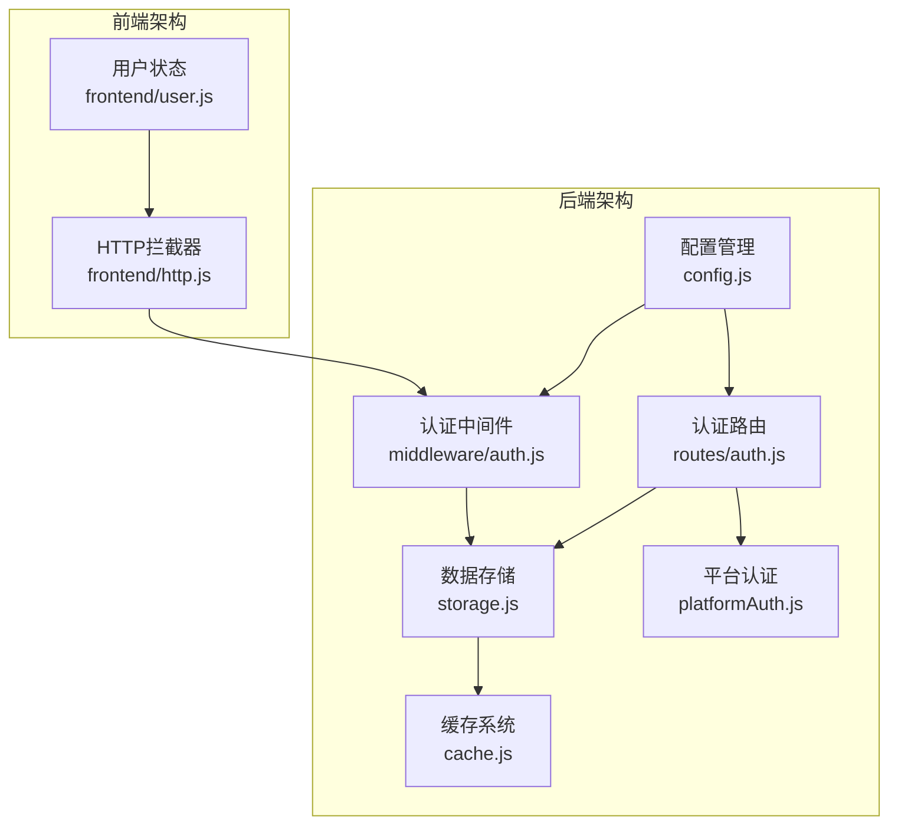

**图表来源**
- [backend/config.js:1-123](file://backend/config.js#L1-L123)
- [backend/middleware/auth.js:1-168](file://backend/middleware/auth.js#L1-L168)
- [backend/routes/auth.js:1-591](file://backend/routes/auth.js#L1-L591)

**章节来源**
- [backend/config.js:1-123](file://backend/config.js#L1-L123)
- [backend/middleware/auth.js:1-168](file://backend/middleware/auth.js#L1-L168)
- [backend/routes/auth.js:1-591](file://backend/routes/auth.js#L1-L591)

## 核心组件

### JWT配置管理

系统通过集中化的配置管理确保JWT的安全性和灵活性：

| 配置项 | 默认值 | 生产环境要求 | 描述 |
|--------|--------|-------------|------|
| JWT_SECRET | change-this-to-random-string-in-production | 至少32字符 | JWT签名密钥，生产环境必须使用强随机字符串 |
| ACCESS_TOKEN_TTL | 30m | 根据业务需求调整 | 访问令牌有效期，建议较短 |
| REFRESH_TOKEN_TTL | 7d | 根据安全策略调整 | 刷新令牌有效期，建议较长 |

### 认证中间件

系统提供了三种认证中间件：

1. **必需认证** (`authRequired`): 强制要求有效的JWT令牌
2. **可选认证** (`optionalAuth`): 有令牌则验证，无令牌则跳过
3. **角色认证** (`roleRequired`): 基于角色的权限控制

### 令牌管理

系统采用双令牌机制：
- **访问令牌**: 短期有效，用于API访问
- **刷新令牌**: 长期有效，用于获取新的访问令牌

**章节来源**
- [backend/config.js:10-14](file://backend/config.js#L10-L14)
- [backend/middleware/auth.js:11-101](file://backend/middleware/auth.js#L11-L101)

## 架构概览

JWT认证系统的整体架构采用分层设计，确保安全性、可扩展性和易维护性：

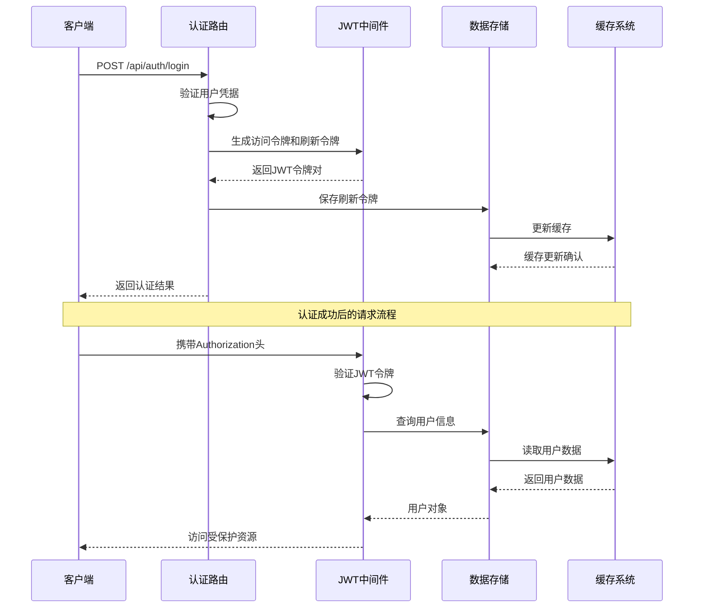

**图表来源**
- [backend/routes/auth.js:96-147](file://backend/routes/auth.js#L96-L147)
- [backend/middleware/auth.js:11-45](file://backend/middleware/auth.js#L11-L45)
- [backend/storage.js:134-142](file://backend/storage.js#L134-L142)

## 详细组件分析

### JWT令牌生成流程

令牌生成采用标准化的JWT结构，包含必要的声明（Claims）：

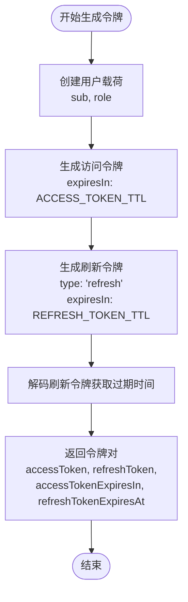

**图表来源**
- [backend/routes/auth.js:49-73](file://backend/routes/auth.js#L49-L73)
- [backend/index.js:159-176](file://backend/index.js#L159-L176)

令牌载荷包含以下关键字段：
- `sub`: 用户标识符（用户ID）
- `role`: 用户角色
- `type`: 令牌类型（访问令牌或刷新令牌）

**章节来源**
- [backend/routes/auth.js:49-73](file://backend/routes/auth.js#L49-L73)
- [backend/index.js:159-176](file://backend/index.js#L159-L176)

### 令牌验证过程

令牌验证采用严格的安全检查机制：

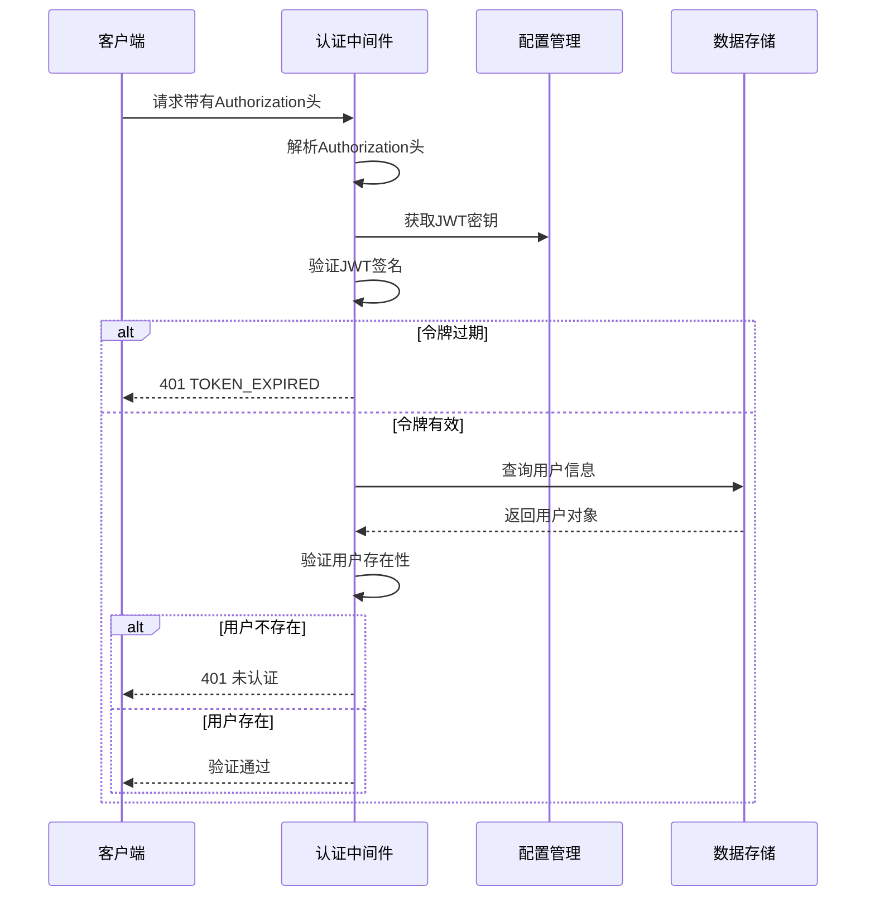

**图表来源**
- [backend/middleware/auth.js:23-44](file://backend/middleware/auth.js#L23-L44)
- [backend/routes/auth.js:230-294](file://backend/routes/auth.js#L230-L294)

验证流程的关键步骤：
1. **头部解析**: 检查Authorization头格式和Bearer前缀
2. **签名验证**: 使用配置的密钥验证JWT签名
3. **过期检查**: 验证令牌是否过期
4. **用户验证**: 确认用户仍然存在于数据库中

**章节来源**
- [backend/middleware/auth.js:11-45](file://backend/middleware/auth.js#L11-L45)
- [backend/routes/auth.js:230-294](file://backend/routes/auth.js#L230-L294)

### 错误处理机制

系统实现了多层次的错误处理机制：

| 错误类型 | HTTP状态码 | 错误代码 | 描述 |
|----------|------------|----------|------|
| 未提供令牌 | 401 | - | 请求缺少Authorization头 |
| 令牌格式错误 | 401 | - | Authorization头格式不正确 |
| 令牌过期 | 401 | TOKEN_EXPIRED | JWT令牌已过期 |
| 无效令牌 | 401 | - | JWT签名验证失败 |
| 权限不足 | 403 | - | 用户角色不满足要求 |
| 请求过于频繁 | 429 | - | 超出速率限制 |

**章节来源**
- [backend/middleware/auth.js:14-44](file://backend/middleware/auth.js#L14-L44)
- [backend/middleware/auth.js:67-71](file://backend/middleware/auth.js#L67-L71)

### Token刷新策略

系统实现了安全的令牌刷新机制：

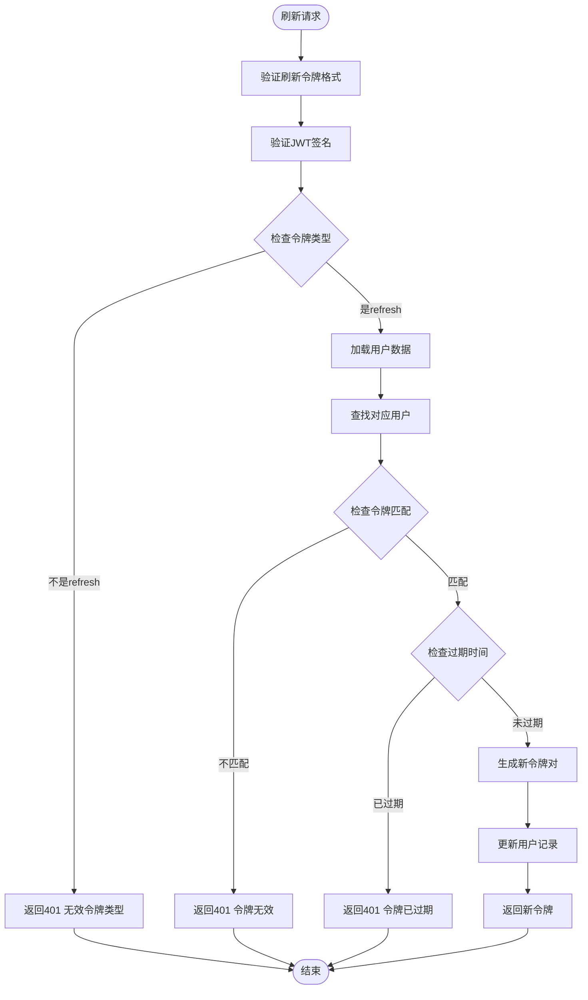

**图表来源**
- [backend/routes/auth.js:230-294](file://backend/routes/auth.js#L230-L294)
- [backend/index.js:652-680](file://backend/index.js#L652-L680)

刷新策略的关键安全措施：
- **令牌类型检查**: 确保使用的是刷新令牌而非访问令牌
- **令牌匹配验证**: 确保数据库中的令牌与请求的令牌一致
- **过期时间检查**: 验证刷新令牌的有效期
- **原子操作**: 刷新令牌时同时更新数据库记录

**章节来源**
- [backend/routes/auth.js:230-294](file://backend/routes/auth.js#L230-L294)
- [backend/index.js:652-680](file://backend/index.js#L652-L680)

### JWT中间件实现原理

认证中间件采用Express.js中间件模式，提供统一的认证接口：

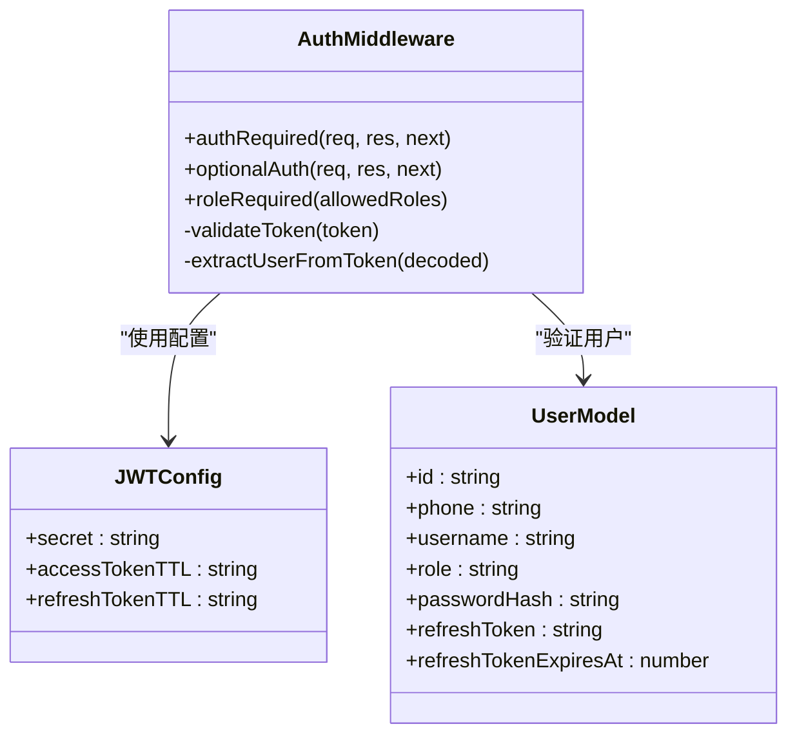

**图表来源**
- [backend/middleware/auth.js:11-101](file://backend/middleware/auth.js#L11-L101)
- [backend/config.js:10-14](file://backend/config.js#L10-L14)

中间件的核心功能：
- **认证头解析**: 从Authorization头中提取JWT令牌
- **令牌验证**: 使用配置的密钥验证JWT签名
- **用户信息提取**: 从令牌载荷中提取用户标识和角色
- **错误处理**: 统一处理各种认证错误情况

**章节来源**
- [backend/middleware/auth.js:11-101](file://backend/middleware/auth.js#L11-L101)

### 认证头解析和用户信息提取

认证中间件的认证头解析逻辑：

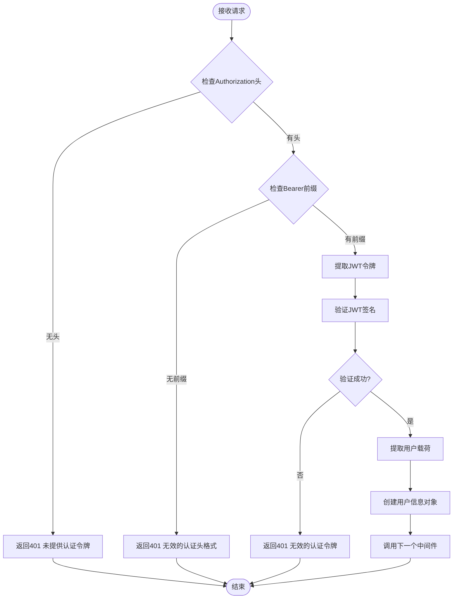

**图表来源**
- [backend/middleware/auth.js:11-45](file://backend/middleware/auth.js#L11-L45)

用户信息提取过程：
- **用户ID**: 从`sub`字段获取
- **用户角色**: 从`role`字段获取
- **用户对象**: 从数据库中查询完整用户信息

**章节来源**
- [backend/middleware/auth.js:11-45](file://backend/middleware/auth.js#L11-L45)

### 可选认证功能

可选认证中间件允许某些API端点在没有令牌的情况下正常工作：

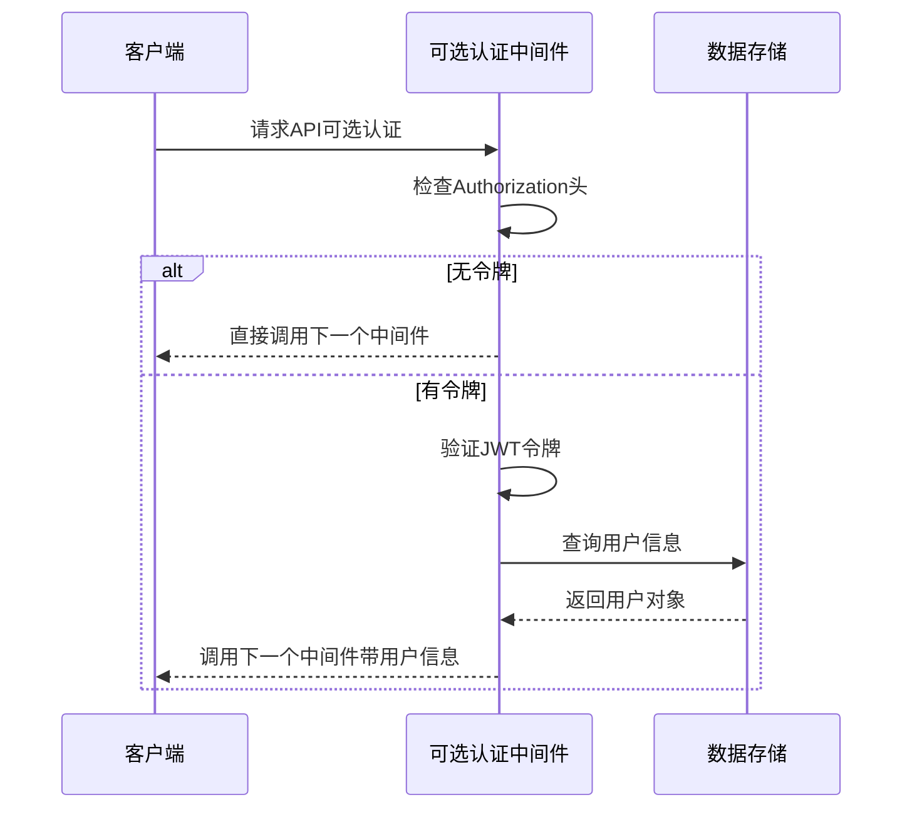

**图表来源**
- [backend/middleware/auth.js:80-101](file://backend/middleware/auth.js#L80-L101)

可选认证的使用场景：
- **公开API**: 如用户注册、登录等
- **混合认证**: 部分功能需要认证，部分不需要
- **降级处理**: 当令牌无效时不影响整体功能

**章节来源**
- [backend/middleware/auth.js:80-101](file://backend/middleware/auth.js#L80-L101)

## 依赖关系分析

JWT认证机制的依赖关系图：

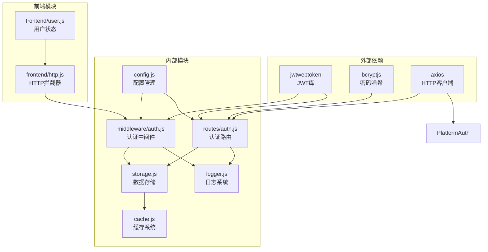

**图表来源**
- [backend/middleware/auth.js:4-6](file://backend/middleware/auth.js#L4-L6)
- [backend/routes/auth.js:5-14](file://backend/routes/auth.js#L5-L14)
- [backend/config.js:5](file://backend/config.js#L5)

**章节来源**
- [backend/middleware/auth.js:4-6](file://backend/middleware/auth.js#L4-L6)
- [backend/routes/auth.js:5-14](file://backend/routes/auth.js#L5-L14)
- [backend/config.js:5](file://backend/config.js#L5)

## 性能考虑

### 缓存策略

系统采用了多层缓存机制来提升性能：

| 缓存层级 | 缓存键 | 过期时间 | 用途 |
|----------|--------|----------|------|
| 应用级缓存 | db:users | 60秒 | 用户数据缓存 |
| 应用级缓存 | db:cases | 5分钟 | 案例数据缓存 |
| 应用级缓存 | db:applications | 1分钟 | 申请数据缓存 |
| 应用级缓存 | db:services_config | 5分钟 | 服务配置缓存 |
| 应用级缓存 | db:reviews | 1分钟 | 评价数据缓存 |
| 应用级缓存 | stats:admin | 5分钟 | 管理统计缓存 |

### 速率限制

系统实现了基于IP的简单速率限制：

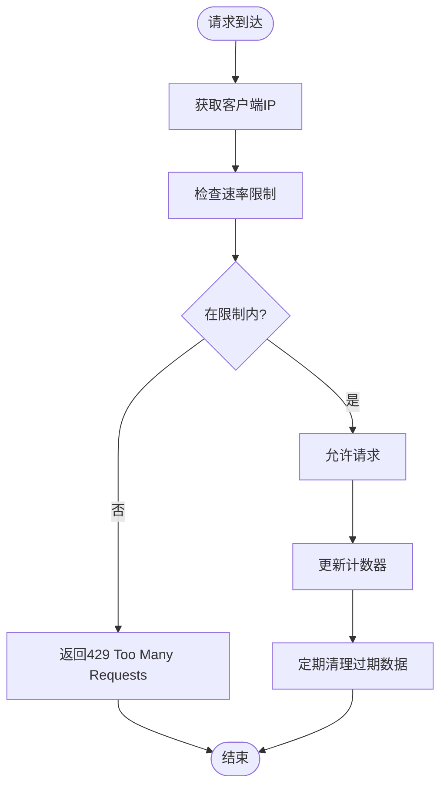

**图表来源**
- [backend/middleware/auth.js:108-160](file://backend/middleware/auth.js#L108-L160)

速率限制配置：
- **登录端点**: 15分钟内最多20次请求
- **注册端点**: 15分钟内最多10次请求
- **清理间隔**: 每分钟清理一次过期数据

### 性能优化建议

1. **缓存优化**: 
   - 对频繁访问的用户数据启用缓存
   - 合理设置缓存过期时间
   - 在数据更新时及时清理缓存

2. **数据库优化**:
   - 为用户表建立适当的索引
   - 使用连接池管理数据库连接
   - 实现批量操作减少数据库往返

3. **网络优化**:
   - 使用HTTP/2协议提升传输效率
   - 实现请求合并减少网络开销
   - 启用Gzip压缩减少传输数据量

4. **内存优化**:
   - 控制中间件链长度
   - 及时释放不再使用的变量
   - 监控内存使用情况

**章节来源**
- [backend/cache.js:1-119](file://backend/cache.js#L1-L119)
- [backend/middleware/auth.js:108-160](file://backend/middleware/auth.js#L108-L160)
- [backend/storage.js:134-142](file://backend/storage.js#L134-L142)

## 故障排除指南

### 常见问题诊断

| 问题症状 | 可能原因 | 解决方案 |
|----------|----------|----------|
| 401 未提供认证令牌 | 客户端未发送Authorization头 | 确保前端正确设置Authorization头 |
| 401 令牌格式错误 | Authorization头格式不正确 | 检查Bearer前缀和令牌格式 |
| 401 令牌已过期 | ACCESS_TOKEN_TTL过期 | 调用刷新令牌接口获取新令牌 |
| 401 无效的认证令牌 | JWT_SECRET不匹配或令牌被篡改 | 检查服务器配置和令牌完整性 |
| 403 权限不足 | 用户角色不满足要求 | 检查用户角色和权限配置 |
| 429 请求过于频繁 | 超出速率限制 | 等待一段时间后重试或增加限制 |

### 日志分析

系统提供了详细的日志记录机制：

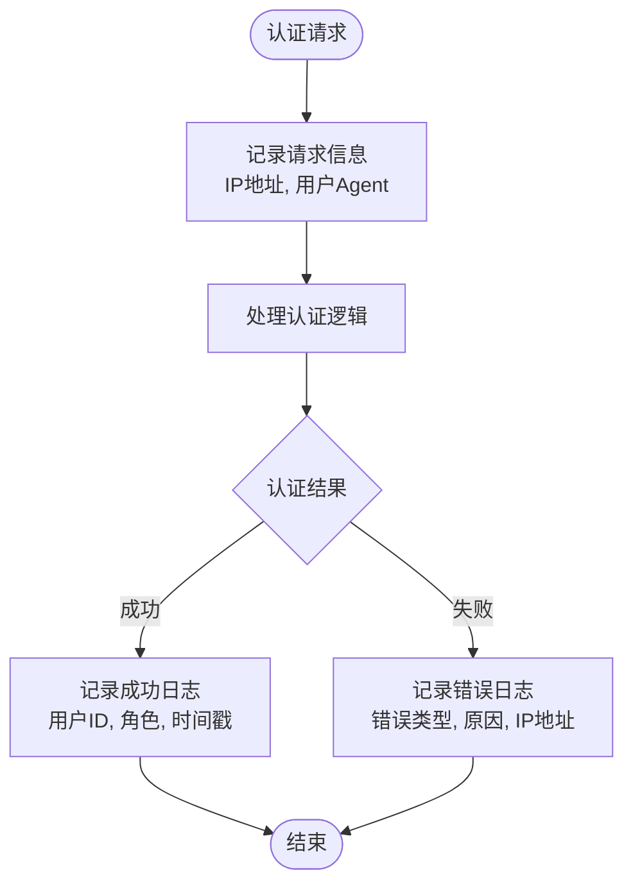

**图表来源**
- [backend/middleware/auth.js:39](file://backend/middleware/auth.js#L39)
- [backend/routes/auth.js:111](file://backend/routes/auth.js#L111)

### 调试技巧

1. **开发环境调试**:
   - 启用详细日志输出
   - 使用浏览器开发者工具监控网络请求
   - 检查JWT令牌的载荷内容

2. **生产环境监控**:
   - 监控认证失败率
   - 跟踪异常IP地址
   - 分析令牌过期分布

3. **性能监控**:
   - 监控认证响应时间
   - 跟踪缓存命中率
   - 分析数据库查询性能

**章节来源**
- [backend/middleware/auth.js:39](file://backend/middleware/auth.js#L39)
- [backend/routes/auth.js:111](file://backend/routes/auth.js#L111)

## 结论

本JWT认证机制提供了完整、安全、高效的用户身份验证解决方案。系统的主要优势包括：

### 安全特性
- **双令牌机制**: 访问令牌和刷新令牌分离，提高安全性
- **严格的验证流程**: 多层次的令牌验证和用户状态检查
- **配置驱动的安全**: 通过环境变量管理敏感配置
- **速率限制保护**: 防止暴力破解和DDoS攻击

### 功能完整性
- **多种认证方式**: 支持传统认证和第三方认证
- **灵活的权限控制**: 基于角色的细粒度权限管理
- **可选认证支持**: 满足不同API端点的认证需求
- **完善的错误处理**: 统一的错误响应和日志记录

### 性能优化
- **多层缓存策略**: 减少数据库访问压力
- **智能速率限制**: 平衡安全性和用户体验
- **异步处理**: 非阻塞的认证流程
- **内存优化**: 合理的内存使用和垃圾回收

### 扩展性考虑
- **模块化设计**: 清晰的组件分离便于维护
- **配置灵活**: 支持多种部署环境和配置需求
- **插件化架构**: 易于添加新的认证方式和功能

对于生产环境部署，建议重点关注以下方面：
1. **密钥安全管理**: 使用强随机字符串作为JWT_SECRET
2. **证书和HTTPS**: 确保传输层安全
3. **监控和告警**: 建立完善的监控体系
4. **备份和恢复**: 制定数据备份和灾难恢复计划
5. **定期审计**: 定期审查安全配置和访问日志

通过遵循这些最佳实践，本JWT认证机制能够为企业级应用提供可靠的身份验证服务。