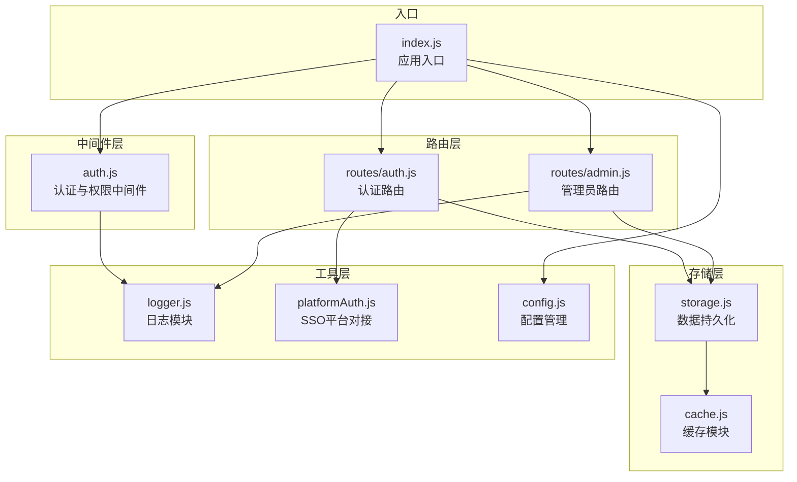
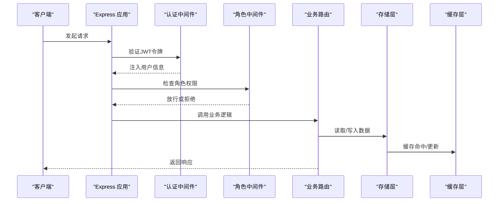
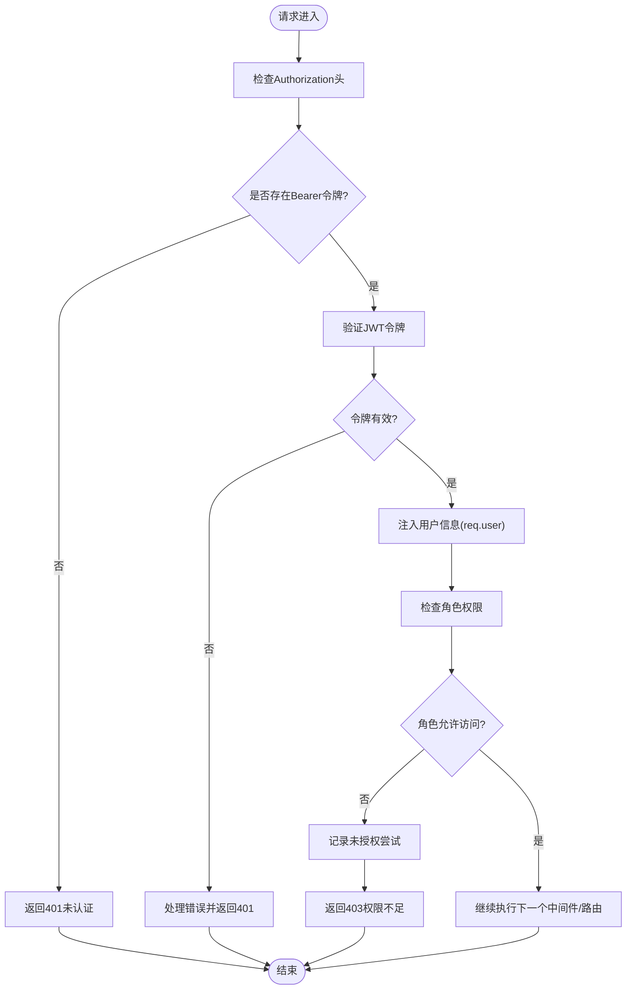
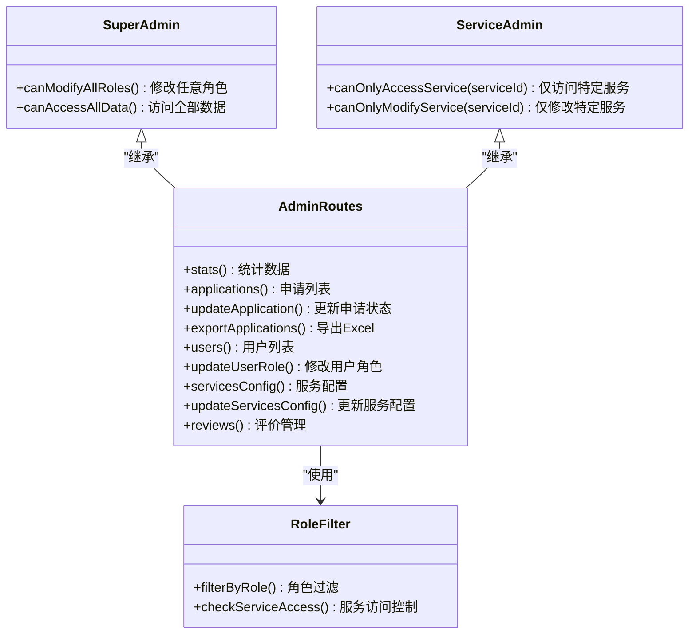
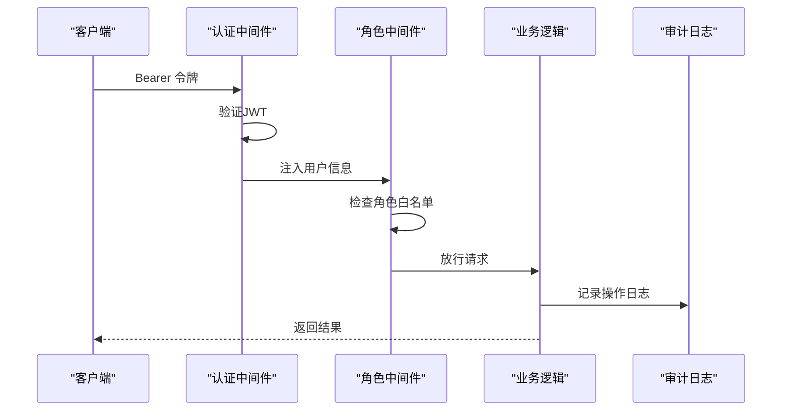
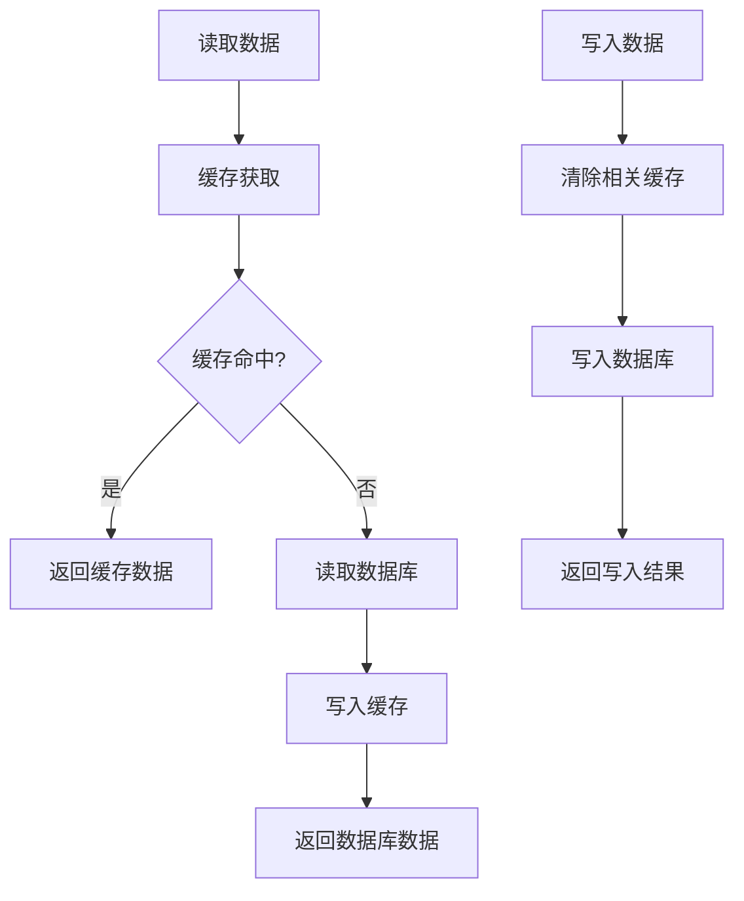
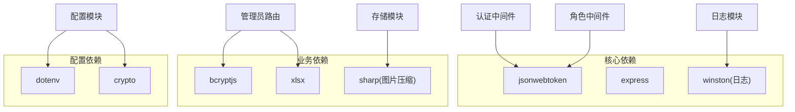

# 基于角色的权限控制

<cite>
**本文档引用的文件**
- [backend/middleware/auth.js](file://backend/middleware/auth.js)
- [backend/routes/admin.js](file://backend/routes/admin.js)
- [backend/routes/auth.js](file://backend/routes/auth.js)
- [backend/storage.js](file://backend/storage.js)
- [backend/cache.js](file://backend/cache.js)
- [backend/logger.js](file://backend/logger.js)
- [backend/config.js](file://backend/config.js)
- [backend/index.js](file://backend/index.js)
- [backend/platformAuth.js](file://backend/platformAuth.js)
</cite>

## 目录
1. [简介](#简介)
2. [项目结构](#项目结构)
3. [核心组件](#核心组件)
4. [架构总览](#架构总览)
5. [详细组件分析](#详细组件分析)
6. [依赖关系分析](#依赖关系分析)
7. [性能考虑](#性能考虑)
8. [故障排除指南](#故障排除指南)
9. [结论](#结论)
10. [附录](#附录)

## 简介
本项目实现了基于角色的权限控制系统（RBAC），通过 JWT 令牌进行身份认证，并在中间件层实现细粒度的角色权限控制。系统支持多种用户角色，包括普通用户、管理员、DSL 管理员、研学管理员等，针对不同角色提供差异化功能访问权限。同时提供了权限缓存、审计日志、速率限制等安全增强特性。

## 项目结构
后端采用 Express 框架，权限控制相关的核心文件分布如下：
- 中间件层：认证与权限校验中间件
- 路由层：业务路由，包含管理员专用路由
- 存储层：用户数据持久化与缓存
- 配置层：JWT、管理员、数据库等配置
- 工具层：日志、SSO 平台对接等

图表来源
- [backend/middleware/auth.js:1-168](file://backend/middleware/auth.js#L1-L168)
- [backend/routes/auth.js:1-591](file://backend/routes/auth.js#L1-L591)
- [backend/routes/admin.js:1-514](file://backend/routes/admin.js#L1-L514)
- [backend/storage.js:1-197](file://backend/storage.js#L1-L197)
- [backend/cache.js:1-119](file://backend/cache.js#L1-L119)
- [backend/logger.js:1-104](file://backend/logger.js#L1-L104)
- [backend/platformAuth.js:1-177](file://backend/platformAuth.js#L1-L177)
- [backend/config.js:1-123](file://backend/config.js#L1-L123)
- [backend/index.js:1-800](file://backend/index.js#L1-L800)

章节来源
- [backend/middleware/auth.js:1-168](file://backend/middleware/auth.js#L1-L168)
- [backend/routes/admin.js:1-514](file://backend/routes/admin.js#L1-L514)
- [backend/routes/auth.js:1-591](file://backend/routes/auth.js#L1-L591)
- [backend/storage.js:1-197](file://backend/storage.js#L1-L197)
- [backend/cache.js:1-119](file://backend/cache.js#L1-L119)
- [backend/logger.js:1-104](file://backend/logger.js#L1-L104)
- [backend/config.js:1-123](file://backend/config.js#L1-L123)
- [backend/index.js:1-800](file://backend/index.js#L1-L800)

## 核心组件
- 认证中间件：负责 JWT 令牌解析与用户信息注入
- 角色权限中间件：基于角色白名单进行访问控制
- 管理员路由：提供仪表板、用户管理、服务配置等功能
- 存储与缓存：用户数据持久化与缓存优化
- 日志与审计：统一的日志记录与审计追踪
- 配置管理：集中化的安全配置

章节来源
- [backend/middleware/auth.js:11-75](file://backend/middleware/auth.js#L11-L75)
- [backend/routes/admin.js:212-277](file://backend/routes/admin.js#L212-L277)
- [backend/storage.js:134-181](file://backend/storage.js#L134-L181)
- [backend/cache.js:5-99](file://backend/cache.js#L5-L99)
- [backend/logger.js:59-94](file://backend/logger.js#L59-L94)
- [backend/config.js:8-76](file://backend/config.js#L8-L76)

## 架构总览
系统采用中间件驱动的权限控制架构，JWT 令牌在请求进入时被解析并注入到请求对象中，随后根据路由配置决定是否需要进行角色权限校验。

图表来源
- [backend/middleware/auth.js:11-75](file://backend/middleware/auth.js#L11-L75)
- [backend/routes/admin.js:212-277](file://backend/routes/admin.js#L212-L277)
- [backend/storage.js:134-181](file://backend/storage.js#L134-L181)
- [backend/cache.js:54-67](file://backend/cache.js#L54-L67)

## 详细组件分析

### 认证与权限中间件
认证中间件负责：
- 解析 Authorization 头中的 Bearer 令牌
- 验证 JWT 令牌的有效性与签名
- 将用户标识与角色注入到请求对象
- 处理令牌过期与无效的情况

角色中间件负责：
- 基于角色白名单进行访问控制
- 记录未授权访问尝试
- 支持可选认证场景

图表来源
- [backend/middleware/auth.js:11-75](file://backend/middleware/auth.js#L11-L75)

章节来源
- [backend/middleware/auth.js:11-75](file://backend/middleware/auth.js#L11-L75)

### 管理员权限设计
管理员路由实现了精细化的权限控制：
- 仪表板统计：根据角色过滤数据范围
- 用户管理：仅管理员可查看用户列表
- 角色变更：超级管理员可修改所有用户角色
- 服务配置：DSL/研学管理员仅能修改对应服务配置
- 申请管理：按服务类型限制操作范围

图表来源
- [backend/routes/admin.js:29-61](file://backend/routes/admin.js#L29-L61)
- [backend/routes/admin.js:212-277](file://backend/routes/admin.js#L212-L277)
- [backend/routes/admin.js:282-357](file://backend/routes/admin.js#L282-L357)

章节来源
- [backend/routes/admin.js:29-61](file://backend/routes/admin.js#L29-L61)
- [backend/routes/admin.js:212-277](file://backend/routes/admin.js#L212-L277)
- [backend/routes/admin.js:282-357](file://backend/routes/admin.js#L282-L357)

### 用户角色定义与权限级别
系统支持以下角色层级：
- user：普通用户，基础访问权限
- admin：超级管理员，最高权限
- dsl_admin：DSL 服务管理员
- study_admin：研学服务管理员

角色权限矩阵：
- user：仅能访问个人数据与基本功能
- admin：可访问所有管理功能
- dsl_admin：仅能访问 DSL 相关数据与配置
- study_admin：仅能访问研学相关数据与配置

章节来源
- [backend/routes/admin.js:234-241](file://backend/routes/admin.js#L234-L241)
- [backend/index.js:290-365](file://backend/index.js#L290-L365)

### 权限验证流程
权限验证采用多层防护机制：
1. 认证阶段：JWT 令牌验证
2. 角色阶段：角色白名单匹配
3. 业务阶段：服务类型与数据范围控制
4. 审计阶段：日志记录与监控

图表来源
- [backend/middleware/auth.js:11-75](file://backend/middleware/auth.js#L11-L75)
- [backend/routes/admin.js:116-166](file://backend/routes/admin.js#L116-L166)
- [backend/logger.js:59-94](file://backend/logger.js#L59-L94)

### 权限继承机制
系统通过组合中间件实现权限继承：
- 所有管理路由先经过认证中间件
- 部分路由再经过角色中间件
- 业务逻辑内部进行细粒度权限检查
- 支持可选认证中间件处理匿名访问场景

章节来源
- [backend/routes/admin.js:23-24](file://backend/routes/admin.js#L23-L24)
- [backend/middleware/auth.js:77-101](file://backend/middleware/auth.js#L77-L101)

### 动态权限控制
系统支持运行时权限调整：
- 用户角色动态变更
- 服务配置按角色隔离
- 数据访问范围动态控制
- 速率限制动态配置

章节来源
- [backend/routes/admin.js:230-277](file://backend/routes/admin.js#L230-L277)
- [backend/middleware/auth.js:108-143](file://backend/middleware/auth.js#L108-L143)

### 细粒度权限控制
实现细节包括：
- 服务类型级别的数据隔离
- 操作权限的动态判断
- 敏感操作的二次确认
- 权限变更的审计追踪

章节来源
- [backend/routes/admin.js:133-145](file://backend/routes/admin.js#L133-L145)
- [backend/routes/admin.js:315-335](file://backend/routes/admin.js#L315-L335)

### 权限缓存优化
系统采用多级缓存策略：
- 内存缓存：60秒TTL的通用缓存
- 读写分离：读操作走缓存，写操作清缓存
- 缓存键管理：统一的缓存键命名规范
- 定时清理：过期缓存自动清理

图表来源
- [backend/cache.js:14-67](file://backend/cache.js#L14-L67)
- [backend/storage.js:134-181](file://backend/storage.js#L134-L181)

章节来源
- [backend/cache.js:5-99](file://backend/cache.js#L5-L99)
- [backend/storage.js:134-181](file://backend/storage.js#L134-L181)

### 权限审计日志
系统提供完整的审计能力：
- 认证与授权事件记录
- 敏感操作审计追踪
- 请求响应时间统计
- 异常错误上下文记录

章节来源
- [backend/logger.js:59-94](file://backend/logger.js#L59-L94)
- [backend/middleware/auth.js:60-65](file://backend/middleware/auth.js#L60-L65)

## 依赖关系分析
权限控制系统的依赖关系如下：

图表来源
- [backend/middleware/auth.js:4-6](file://backend/middleware/auth.js#L4-L6)
- [backend/routes/admin.js:5-8](file://backend/routes/admin.js#L5-L8)
- [backend/storage.js:1-3](file://backend/storage.js#L1-L3)
- [backend/logger.js:5-7](file://backend/logger.js#L5-L7)
- [backend/config.js:5-6](file://backend/config.js#L5-L6)

章节来源
- [backend/middleware/auth.js:4-6](file://backend/middleware/auth.js#L4-L6)
- [backend/routes/admin.js:5-8](file://backend/routes/admin.js#L5-L8)
- [backend/storage.js:1-3](file://backend/storage.js#L1-L3)
- [backend/logger.js:5-7](file://backend/logger.js#L5-L7)
- [backend/config.js:5-6](file://backend/config.js#L5-L6)

## 性能考虑
- 缓存策略：合理设置TTL，平衡数据一致性与性能
- 数据库访问：批量读取与写入，减少IO次数
- 中间件链路：最小化中间件数量，避免重复计算
- 日志级别：生产环境使用info级别，避免过度日志
- 速率限制：防止暴力破解与DDoS攻击

## 故障排除指南
常见问题与解决方案：
- 令牌过期：使用刷新令牌获取新令牌
- 权限不足：检查用户角色与路由配置
- 数据不一致：检查缓存清理策略
- 日志异常：检查日志目录权限与磁盘空间

章节来源
- [backend/middleware/auth.js:31-44](file://backend/middleware/auth.js#L31-L44)
- [backend/routes/admin.js:254-259](file://backend/routes/admin.js#L254-L259)
- [backend/cache.js:72-79](file://backend/cache.js#L72-L79)
- [backend/logger.js:16-20](file://backend/logger.js#L16-L20)

## 结论
本权限控制系统通过 JWT 认证与中间件权限控制相结合，实现了灵活且安全的 RBAC 架构。系统支持多角色分级、细粒度权限控制、动态权限调整、缓存优化与完整审计日志，能够满足复杂业务场景下的权限管理需求。建议在生产环境中进一步完善权限矩阵配置、加强安全监控与定期审计。

## 附录

### 权限扩展方法
- 新增角色：在配置中定义新角色，更新中间件白名单
- 自定义权限规则：在业务逻辑中添加条件判断
- 动态权限控制：基于用户属性与上下文动态计算权限
- 权限继承：通过中间件组合实现权限继承关系

### 最佳实践
- 始终使用 HTTPS 传输令牌
- 定期轮换 JWT 密钥
- 实施严格的输入验证
- 启用详细的审计日志
- 定期审查权限配置