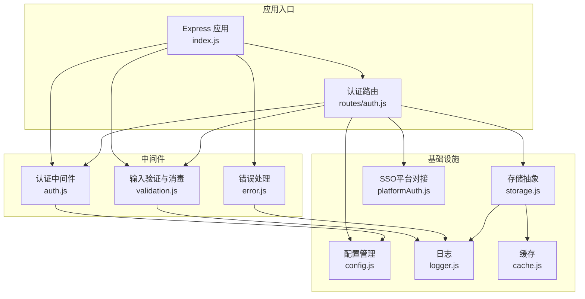
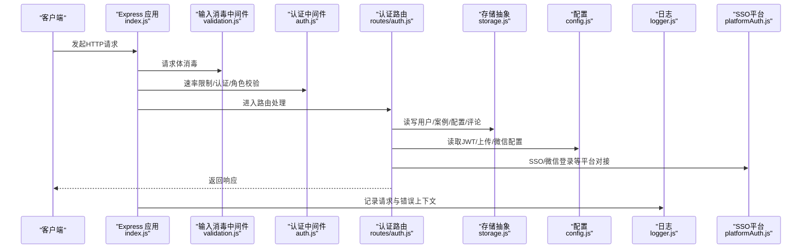
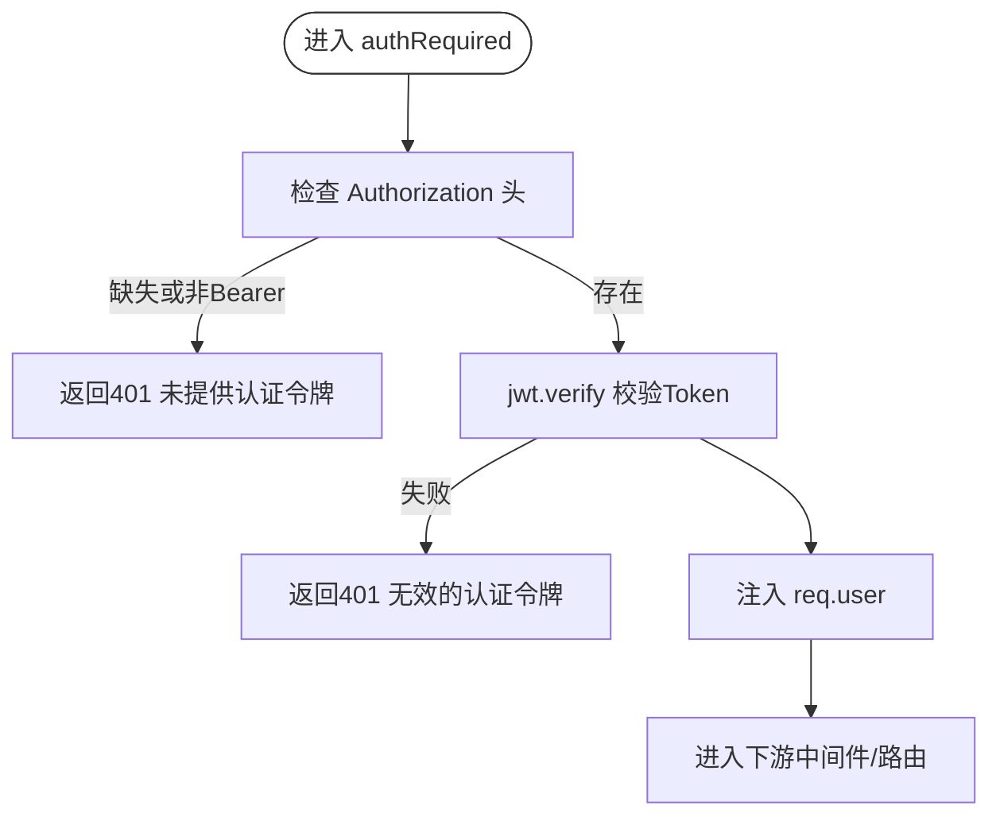
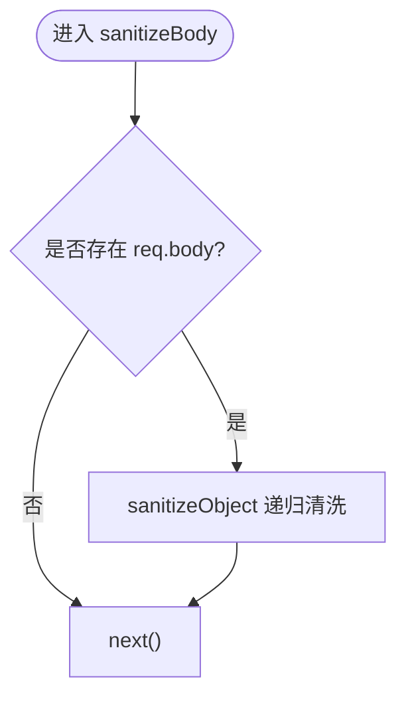
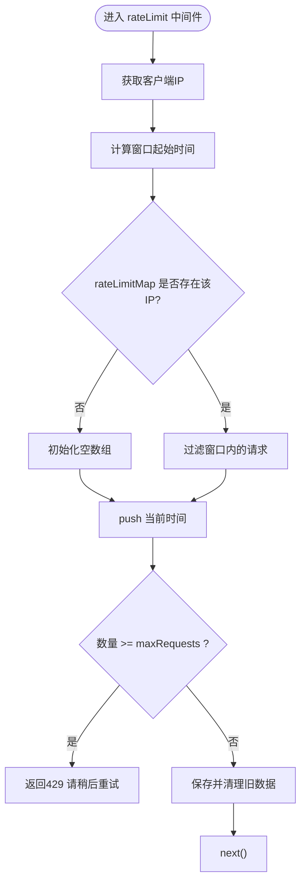
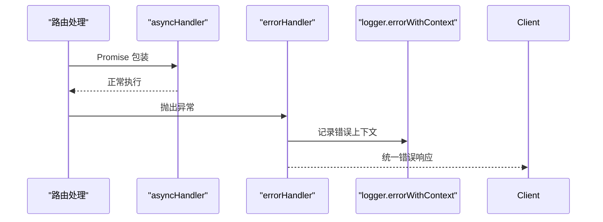
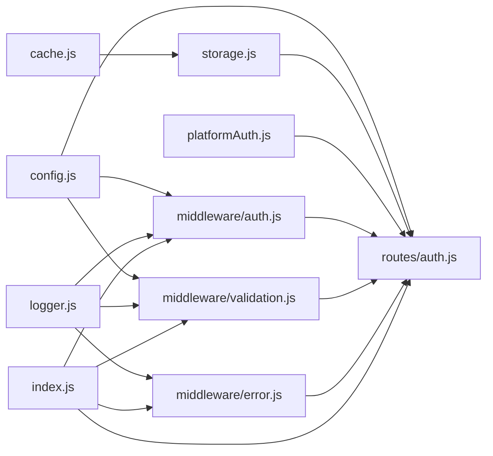

# 安全中间件与防护

<cite>
**本文引用的文件**
- [backend/middleware/auth.js](file://backend/middleware/auth.js)
- [backend/middleware/validation.js](file://backend/middleware/validation.js)
- [backend/middleware/error.js](file://backend/middleware/error.js)
- [backend/index.js](file://backend/index.js)
- [backend/routes/auth.js](file://backend/routes/auth.js)
- [backend/config.js](file://backend/config.js)
- [backend/logger.js](file://backend/logger.js)
- [backend/cache.js](file://backend/cache.js)
- [backend/storage.js](file://backend/storage.js)
- [backend/platformAuth.js](file://backend/platformAuth.js)
</cite>

## 目录
1. [简介](#简介)
2. [项目结构](#项目结构)
3. [核心组件](#核心组件)
4. [架构总览](#架构总览)
5. [组件详解](#组件详解)
6. [依赖关系分析](#依赖关系分析)
7. [性能考量](#性能考量)
8. [故障排查指南](#故障排查指南)
9. [结论](#结论)
10. [附录](#附录)

## 简介
本文件面向安全中间件与防护系统，系统性梳理认证中间件、请求验证与输入过滤、速率限制与防暴力破解、请求频率控制、安全配置与策略、异常检测与监控、扩展与自定义能力，并给出API安全防护、CSRF防护与威胁处理建议。内容基于仓库现有实现进行归纳与可视化，帮助开发者快速理解与落地安全实践。

## 项目结构
后端采用Express框架，安全相关能力主要分布在中间件、路由、配置与基础设施模块中：
- 中间件层：认证、可选认证、角色校验、速率限制、输入消毒与验证、错误处理
- 路由层：认证相关接口（登录、注册、刷新、登出、SSO、微信登录等）
- 配置层：集中管理JWT、上传、数据库、服务器、SM2等敏感配置
- 基础设施：日志、缓存、持久化存储、平台对接（SSO）

图表来源
- [backend/index.js:116-128](file://backend/index.js#L116-L128)
- [backend/middleware/auth.js:162-167](file://backend/middleware/auth.js#L162-L167)
- [backend/middleware/validation.js:182-191](file://backend/middleware/validation.js#L182-L191)
- [backend/middleware/error.js:85-89](file://backend/middleware/error.js#L85-L89)
- [backend/routes/auth.js:10-14](file://backend/routes/auth.js#L10-L14)
- [backend/config.js:78-122](file://backend/config.js#L78-L122)
- [backend/logger.js:97-103](file://backend/logger.js#L97-L103)
- [backend/cache.js:101-118](file://backend/cache.js#L101-L118)
- [backend/storage.js:183-197](file://backend/storage.js#L183-L197)
- [backend/platformAuth.js:165-176](file://backend/platformAuth.js#L165-L176)

章节来源
- [backend/index.js:116-128](file://backend/index.js#L116-L128)
- [backend/middleware/auth.js:162-167](file://backend/middleware/auth.js#L162-L167)
- [backend/middleware/validation.js:182-191](file://backend/middleware/validation.js#L182-L191)
- [backend/middleware/error.js:85-89](file://backend/middleware/error.js#L85-L89)
- [backend/routes/auth.js:10-14](file://backend/routes/auth.js#L10-L14)
- [backend/config.js:78-122](file://backend/config.js#L78-L122)
- [backend/logger.js:97-103](file://backend/logger.js#L97-L103)
- [backend/cache.js:101-118](file://backend/cache.js#L101-L118)
- [backend/storage.js:183-197](file://backend/storage.js#L183-L197)
- [backend/platformAuth.js:165-176](file://backend/platformAuth.js#L165-L176)

## 核心组件
- 认证中间件：提供强制认证、可选认证、角色校验、基础速率限制
- 输入验证与消毒：统一请求体消毒、查询参数校验、文件上传校验
- 错误处理：全局错误捕获、404处理、异步错误包装
- 安全配置：JWT密钥、令牌有效期、上传限制、服务器与微信配置
- 日志与监控：结构化日志、请求上下文日志、错误上下文日志
- 缓存与存储：内存缓存、JSON/PG存储抽象、自动缓存清理
- 平台对接：SSO加密签名与加解密流程

章节来源
- [backend/middleware/auth.js:11-167](file://backend/middleware/auth.js#L11-L167)
- [backend/middleware/validation.js:9-191](file://backend/middleware/validation.js#L9-L191)
- [backend/middleware/error.js:9-89](file://backend/middleware/error.js#L9-L89)
- [backend/config.js:8-76](file://backend/config.js#L8-L76)
- [backend/logger.js:9-103](file://backend/logger.js#L9-L103)
- [backend/cache.js:5-118](file://backend/cache.js#L5-L118)
- [backend/storage.js:42-197](file://backend/storage.js#L42-L197)
- [backend/platformAuth.js:25-176](file://backend/platformAuth.js#L25-L176)

## 架构总览
下图展示认证与安全相关的关键交互路径：请求进入应用后先经过输入消毒与速率限制，再进入路由层；路由层调用存储与平台对接模块，同时使用配置与日志模块；错误处理中间件贯穿始终。

图表来源
- [backend/index.js:116-128](file://backend/index.js#L116-L128)
- [backend/middleware/validation.js:52-57](file://backend/middleware/validation.js#L52-L57)
- [backend/middleware/auth.js:108-143](file://backend/middleware/auth.js#L108-L143)
- [backend/routes/auth.js:10-14](file://backend/routes/auth.js#L10-L14)
- [backend/storage.js:134-181](file://backend/storage.js#L134-L181)
- [backend/config.js:8-76](file://backend/config.js#L8-L76)
- [backend/logger.js:75-94](file://backend/logger.js#L75-L94)
- [backend/platformAuth.js:135-163](file://backend/platformAuth.js#L135-L163)

## 组件详解

### 认证中间件
- 强制认证：校验Authorization头与JWT签名，注入用户信息
- 角色校验：基于用户角色的权限拦截
- 可选认证：仅当存在有效Token时才注入用户信息
- 速率限制：按IP窗口计数，超限返回429

图表来源
- [backend/middleware/auth.js:11-45](file://backend/middleware/auth.js#L11-L45)

章节来源
- [backend/middleware/auth.js:11-45](file://backend/middleware/auth.js#L11-L45)
- [backend/middleware/auth.js:50-75](file://backend/middleware/auth.js#L50-L75)
- [backend/middleware/auth.js:80-101](file://backend/middleware/auth.js#L80-L101)
- [backend/middleware/auth.js:108-160](file://backend/middleware/auth.js#L108-L160)

### 请求验证与输入过滤
- 请求体消毒：递归清洗字符串字段，移除脚本标签、事件属性、javascript协议
- 查询参数校验：支持必填、类型(number/string)、范围(min/max)、枚举
- 文件上传校验：类型白名单与大小限制
- 必填字段校验：支持嵌套字段路径

图表来源
- [backend/middleware/validation.js:52-57](file://backend/middleware/validation.js#L52-L57)
- [backend/middleware/validation.js:27-47](file://backend/middleware/validation.js#L27-L47)
- [backend/middleware/validation.js:9-22](file://backend/middleware/validation.js#L9-L22)

章节来源
- [backend/middleware/validation.js:9-22](file://backend/middleware/validation.js#L9-L22)
- [backend/middleware/validation.js:27-47](file://backend/middleware/validation.js#L27-L47)
- [backend/middleware/validation.js:52-57](file://backend/middleware/validation.js#L52-L57)
- [backend/middleware/validation.js:103-149](file://backend/middleware/validation.js#L103-L149)
- [backend/middleware/validation.js:154-180](file://backend/middleware/validation.js#L154-L180)
- [backend/middleware/validation.js:79-98](file://backend/middleware/validation.js#L79-L98)

### 速率限制与防暴力破解
- 简单滑动窗口：按IP维护时间戳列表，窗口内请求数超过阈值即触发限流
- 定期清理：每分钟清理过期请求记录，避免内存膨胀
- 登录/注册差异化阈值：登录更严格，注册次之

图表来源
- [backend/middleware/auth.js:108-160](file://backend/middleware/auth.js#L108-L160)

章节来源
- [backend/middleware/auth.js:108-160](file://backend/middleware/auth.js#L108-L160)
- [backend/routes/auth.js:18-20](file://backend/routes/auth.js#L18-L20)

### 错误处理与异常检测
- 全局错误捕获：记录错误上下文，区分Multer、JWT、数据库约束等错误类型
- 404处理：接口不存在统一响应
- 异步错误包装：避免try-catch重复，统一交给错误处理中间件

图表来源
- [backend/middleware/error.js:79-83](file://backend/middleware/error.js#L79-L83)
- [backend/middleware/error.js:9-62](file://backend/middleware/error.js#L9-L62)

章节来源
- [backend/middleware/error.js:9-62](file://backend/middleware/error.js#L9-L62)
- [backend/middleware/error.js:67-73](file://backend/middleware/error.js#L67-L73)
- [backend/middleware/error.js:79-83](file://backend/middleware/error.js#L79-L83)

### 安全配置与策略
- JWT：密钥、访问令牌与刷新令牌有效期
- 上传：目录、大小、类型白名单
- 服务器：端口、环境、CORS、前后端地址
- 微信：小程序与公众号AppId/Secret
- SSO：平台地址、机构号、SM2私钥、SM4密钥
- 管理员：超级管理员手机号与默认密码（随机生成）

章节来源
- [backend/config.js:8-76](file://backend/config.js#L8-L76)
- [backend/config.js:78-104](file://backend/config.js#L78-L104)
- [backend/config.js:106-122](file://backend/config.js#L106-L122)

### 日志与监控
- 结构化日志：控制台与文件输出，支持info/warn/error/debug
- 请求日志：记录方法、URL、状态码、耗时、IP
- 错误日志：记录方法、URL、IP、堆栈、请求体片段

章节来源
- [backend/logger.js:9-103](file://backend/logger.js#L9-L103)

### 缓存与存储
- 内存缓存：Map存储，带TTL与定期清理
- 存储抽象：JSON文件或PostgreSQL，统一读写接口，自动解析双序列化数据
- 缓存键：用户、案例、申请、服务配置、评论等

章节来源
- [backend/cache.js:5-118](file://backend/cache.js#L5-L118)
- [backend/storage.js:42-197](file://backend/storage.js#L42-L197)

### 平台对接（SSO）
- 请求构建：时间戳、流水号、HDATA与数据体加密
- 签名：SHA1摘要+SM2签名
- 加解密：SM4 ECB模式，hex→base64流转
- 响应解密与校验

章节来源
- [backend/platformAuth.js:25-176](file://backend/platformAuth.js#L25-L176)

## 依赖关系分析
- 中间件依赖配置模块（JWT密钥、上传配置）与日志模块
- 路由依赖中间件、存储、配置、平台对接
- 应用入口依赖中间件、路由、日志、配置
- 存储依赖缓存与日志

图表来源
- [backend/config.js:78-122](file://backend/config.js#L78-L122)
- [backend/middleware/auth.js:162-167](file://backend/middleware/auth.js#L162-L167)
- [backend/middleware/validation.js:182-191](file://backend/middleware/validation.js#L182-L191)
- [backend/middleware/error.js:85-89](file://backend/middleware/error.js#L85-L89)
- [backend/routes/auth.js:10-14](file://backend/routes/auth.js#L10-L14)
- [backend/logger.js:97-103](file://backend/logger.js#L97-L103)
- [backend/cache.js:101-118](file://backend/cache.js#L101-L118)
- [backend/storage.js:183-197](file://backend/storage.js#L183-L197)
- [backend/platformAuth.js:165-176](file://backend/platformAuth.js#L165-L176)
- [backend/index.js:116-128](file://backend/index.js#L116-L128)

## 性能考量
- 速率限制：内存Map存储，每分钟清理，适合单实例部署；如需分布式，建议替换为Redis等共享存储
- 输入消毒：对请求体进行递归清洗，复杂度与字段数量线性相关；建议配合查询参数校验减少无效负载
- 缓存：60秒用户缓存、5分钟案例/配置缓存，降低文件IO；注意缓存键一致性与清理策略
- 日志：结构化输出，生产环境建议落盘与轮转，避免磁盘打满

## 故障排查指南
- 认证失败
  - 检查Authorization头格式与JWT签名
  - 核对JWT密钥与有效期配置
  - 查看日志中“无效的认证令牌/令牌已过期”记录
- 速率限制触发
  - 检查IP识别是否正确（代理场景需考虑X-Forwarded-For）
  - 调整窗口与阈值，或启用分布式限流
- 参数校验失败
  - 确认必填字段与类型、范围、枚举规则
  - 检查查询参数是否被正确转换为数字
- 文件上传失败
  - 确认文件类型与大小限制
  - 检查上传目录权限
- SSO对接异常
  - 核对平台地址、机构号、SM2/SM4配置
  - 检查签名与加解密流程日志

章节来源
- [backend/middleware/auth.js:23-44](file://backend/middleware/auth.js#L23-L44)
- [backend/middleware/error.js:31-45](file://backend/middleware/error.js#L31-L45)
- [backend/middleware/validation.js:103-149](file://backend/middleware/validation.js#L103-L149)
- [backend/middleware/validation.js:154-180](file://backend/middleware/validation.js#L154-L180)
- [backend/platformAuth.js:135-163](file://backend/platformAuth.js#L135-L163)

## 结论
本项目在中间件层实现了认证、输入过滤、速率限制与错误处理的基础安全能力，并通过配置模块集中管理敏感参数。结合日志与缓存，形成可观察、可扩展的安全基座。建议在生产环境中进一步强化：
- CSRF防护：引入同源策略、CSRF Token与CSP
- 传输安全：HTTPS/TLS、HSTS、安全响应头
- 分布式限流：Redis/数据库共享计数器
- 审计与告警：统一审计日志与异常告警
- 定期安全扫描：依赖与配置漏洞扫描

## 附录

### 安全中间件扩展清单
- 自定义验证规则：在validation中间件中新增校验函数，复用validateQuery/schema
- 自定义速率限制：扩展rateLimit为基于Redis的分布式实现
- 自定义错误类型：在errorHandler中新增业务错误映射
- 自定义日志字段：在logger中增加上下文字段，便于追踪

章节来源
- [backend/middleware/validation.js:103-149](file://backend/middleware/validation.js#L103-L149)
- [backend/middleware/auth.js:108-160](file://backend/middleware/auth.js#L108-L160)
- [backend/middleware/error.js:9-62](file://backend/middleware/error.js#L9-L62)
- [backend/logger.js:75-94](file://backend/logger.js#L75-L94)