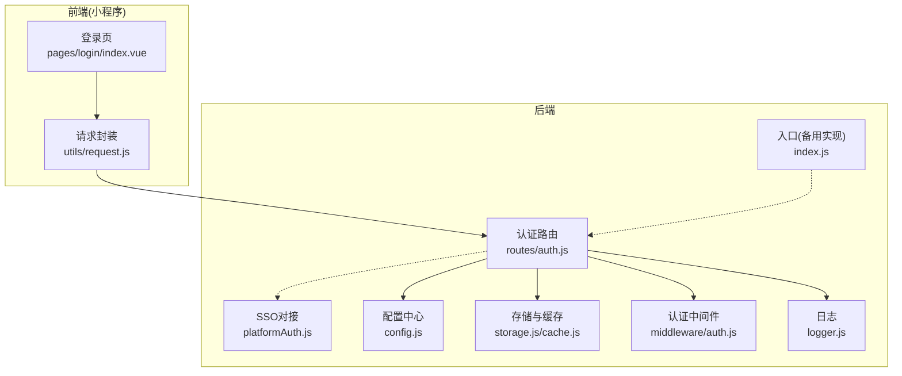
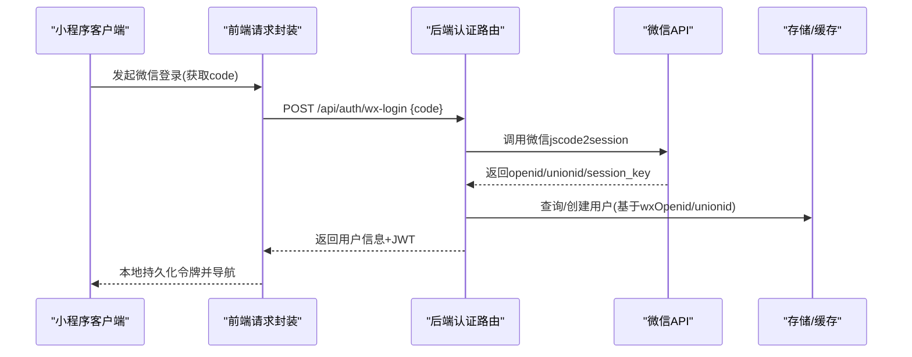
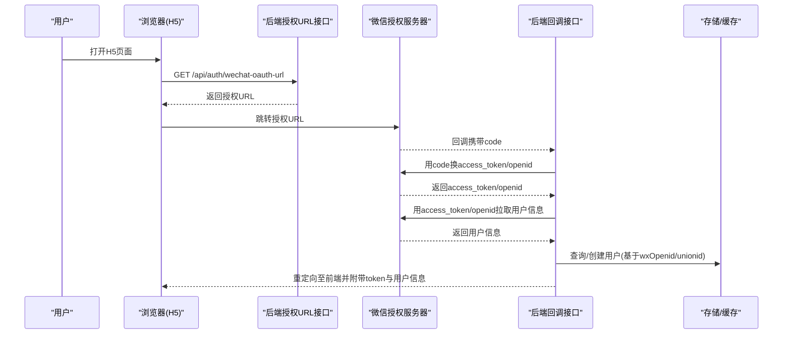
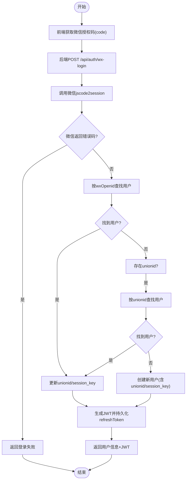
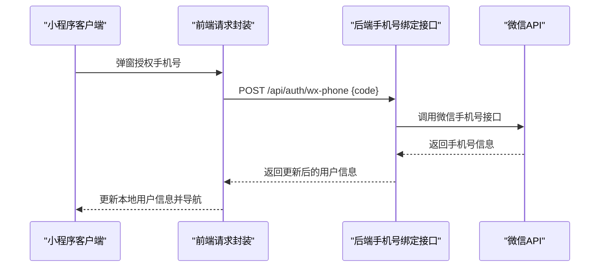
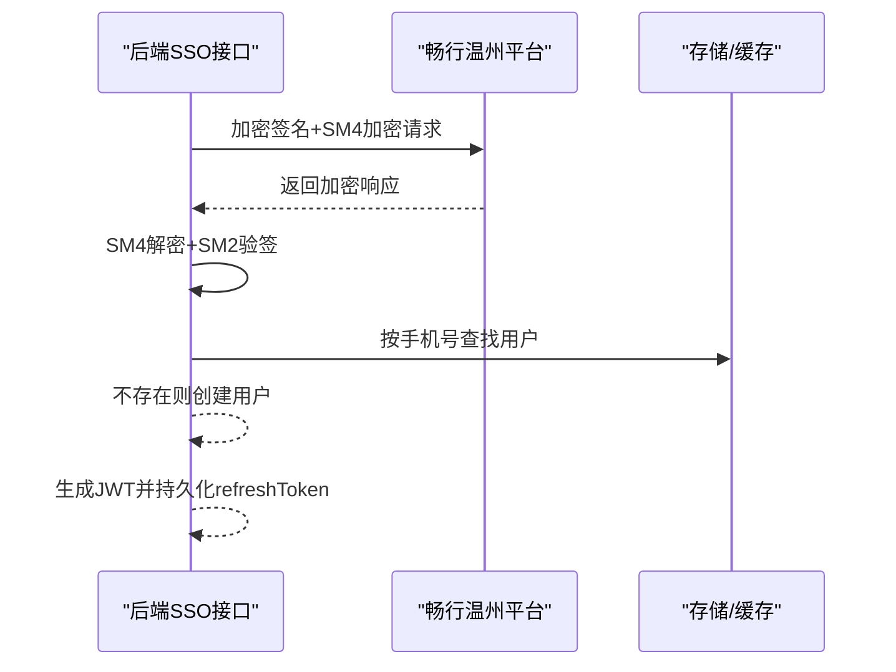
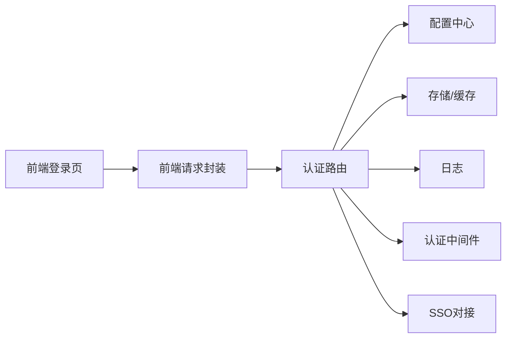

# 微信登录集成

<cite>
**本文档引用的文件**
- [backend/routes/auth.js](file://backend/routes/auth.js)
- [backend/platformAuth.js](file://backend/platformAuth.js)
- [backend/config.js](file://backend/config.js)
- [backend/middleware/auth.js](file://backend/middleware/auth.js)
- [backend/storage.js](file://backend/storage.js)
- [backend/cache.js](file://backend/cache.js)
- [backend/logger.js](file://backend/logger.js)
- [backend/index.js](file://backend/index.js)
- [frontend/miniprogram/pages/login/index.vue](file://frontend/miniprogram/pages/login/index.vue)
- [frontend/miniprogram/utils/request.js](file://frontend/miniprogram/utils/request.js)
</cite>

## 目录
1. [简介](#简介)
2. [项目结构](#项目结构)
3. [核心组件](#核心组件)
4. [架构总览](#架构总览)
5. [详细组件分析](#详细组件分析)
6. [依赖关系分析](#依赖关系分析)
7. [性能考虑](#性能考虑)
8. [故障排除指南](#故障排除指南)
9. [结论](#结论)

## 简介
本文件面向微信登录集成系统，围绕后端认证路由、微信OAuth2.0授权流程、access_token交换、用户信息获取与unionid处理、用户绑定机制等进行深入说明，并覆盖配置项、回调地址、安全参数、错误处理与重试机制、用户状态同步、平台用户关联、多设备登录处理以及授权撤销处理等主题。文档同时提供可视化图示与最佳实践建议，帮助开发者快速理解并部署微信登录能力。

## 项目结构
微信登录相关代码主要分布在后端路由、配置、存储与中间件模块，以及前端小程序登录页与请求封装模块。整体采用前后端分离架构，后端提供REST接口，前端通过小程序SDK发起登录与授权请求。

**图表来源**
- [backend/routes/auth.js](file://backend/routes/auth.js)
- [backend/config.js](file://backend/config.js)
- [backend/storage.js](file://backend/storage.js)
- [backend/cache.js](file://backend/cache.js)
- [backend/middleware/auth.js](file://backend/middleware/auth.js)
- [backend/logger.js](file://backend/logger.js)
- [backend/index.js](file://backend/index.js)
- [frontend/miniprogram/pages/login/index.vue](file://frontend/miniprogram/pages/login/index.vue)
- [frontend/miniprogram/utils/request.js](file://frontend/miniprogram/utils/request.js)

**章节来源**
- [backend/routes/auth.js](file://backend/routes/auth.js)
- [backend/config.js](file://backend/config.js)
- [backend/storage.js](file://backend/storage.js)
- [backend/cache.js](file://backend/cache.js)
- [backend/middleware/auth.js](file://backend/middleware/auth.js)
- [backend/logger.js](file://backend/logger.js)
- [backend/index.js](file://backend/index.js)
- [frontend/miniprogram/pages/login/index.vue](file://frontend/miniprogram/pages/login/index.vue)
- [frontend/miniprogram/utils/request.js](file://frontend/miniprogram/utils/request.js)

## 核心组件
- 认证路由模块：提供微信公众号OAuth授权URL生成、回调处理、小程序登录、手机号绑定等接口。
- 平台对接模块：提供SSO成员查询能力，支持与畅行温州平台对接。
- 配置中心：集中管理JWT、微信小程序/公众号、服务器、数据库、上传等配置。
- 存储与缓存：统一用户数据读写与缓存策略，降低文件IO压力。
- 认证中间件：提供JWT校验、可选认证、角色校验与请求限流。
- 日志模块：结构化日志记录，便于问题追踪与审计。
- 前端登录页与请求封装：小程序登录、授权弹窗、手机号绑定、令牌刷新与重试。

**章节来源**
- [backend/routes/auth.js](file://backend/routes/auth.js)
- [backend/platformAuth.js](file://backend/platformAuth.js)
- [backend/config.js](file://backend/config.js)
- [backend/storage.js](file://backend/storage.js)
- [backend/cache.js](file://backend/cache.js)
- [backend/middleware/auth.js](file://backend/middleware/auth.js)
- [backend/logger.js](file://backend/logger.js)
- [frontend/miniprogram/pages/login/index.vue](file://frontend/miniprogram/pages/login/index.vue)
- [frontend/miniprogram/utils/request.js](file://frontend/miniprogram/utils/request.js)

## 架构总览
微信登录涉及两种场景：
- 小程序登录：通过code换取openid/unionid，创建或更新用户，发放JWT。
- 公众号网页授权：引导用户授权，回调后用code换access_token与openid，拉取用户信息，创建或更新用户并发放JWT。

**图表来源**
- [backend/routes/auth.js](file://backend/routes/auth.js)
- [frontend/miniprogram/pages/login/index.vue](file://frontend/miniprogram/pages/login/index.vue)
- [frontend/miniprogram/utils/request.js](file://frontend/miniprogram/utils/request.js)

## 详细组件分析

### 组件A：微信公众号OAuth授权流程
- 授权URL生成：后端提供获取授权URL接口，使用公众号AppID与回调地址拼接授权链接，scope选择用户信息授权。
- 回调处理：接收微信回调的code，先换取access_token与openid，再拉取用户信息，最后创建或更新用户并发放JWT。
- 错误处理：对微信返回的错误码进行判断与日志记录，失败时重定向至登录页并附带错误参数。

**图表来源**
- [backend/routes/auth.js](file://backend/routes/auth.js)

**章节来源**
- [backend/routes/auth.js](file://backend/routes/auth.js)

### 组件B：微信小程序登录流程
- 小程序登录：前端调用uni.login获取code，后端通过微信jscode2session换取openid/unionid/session_key，创建或更新用户并发放JWT。
- unionid处理：优先按unionid匹配用户；若无unionid则回退到openid；若仍无则新建用户。
- 新用户与手机号绑定：登录成功后若检测到新用户或未绑定手机号，弹出手机号授权弹窗，授权后调用手机号绑定接口更新用户信息。

**图表来源**
- [backend/routes/auth.js](file://backend/routes/auth.js)
- [backend/index.js](file://backend/index.js)

**章节来源**
- [backend/routes/auth.js](file://backend/routes/auth.js)
- [backend/index.js](file://backend/index.js)
- [frontend/miniprogram/pages/login/index.vue](file://frontend/miniprogram/pages/login/index.vue)

### 组件C：用户绑定与手机号授权
- 手机号授权：在小程序端通过开放能力获取手机号授权码，后端调用微信接口换取手机号并更新用户信息。
- 多设备登录：通过JWT refresh token机制实现令牌续期；前端在401时触发刷新队列，避免并发刷新导致的重复请求。
- 用户状态同步：登录成功后将用户信息与令牌持久化到本地存储，后续请求自动附加Authorization头。

**图表来源**
- [backend/routes/auth.js](file://backend/routes/auth.js)
- [frontend/miniprogram/pages/login/index.vue](file://frontend/miniprogram/pages/login/index.vue)
- [frontend/miniprogram/utils/request.js](file://frontend/miniprogram/utils/request.js)

**章节来源**
- [backend/routes/auth.js](file://backend/routes/auth.js)
- [frontend/miniprogram/pages/login/index.vue](file://frontend/miniprogram/pages/login/index.vue)
- [frontend/miniprogram/utils/request.js](file://frontend/miniprogram/utils/request.js)

### 组件D：SSO对接与平台用户关联
- SSO查询：通过平台提供的加密签名与SM4加解密，向平台查询成员信息，返回手机号等关键字段。
- 平台用户关联：后端SSO接口根据返回的手机号匹配本地用户，若不存在则自动创建用户并发放JWT。
- 安全参数：SM2签名与SM4加解密参数均来自环境变量，确保生产安全。

**图表来源**
- [backend/platformAuth.js](file://backend/platformAuth.js)
- [backend/routes/auth.js](file://backend/routes/auth.js)

**章节来源**
- [backend/platformAuth.js](file://backend/platformAuth.js)
- [backend/routes/auth.js](file://backend/routes/auth.js)

## 依赖关系分析
- 认证路由依赖配置中心、存储模块、缓存模块与日志模块；同时通过中间件实现JWT校验与限流。
- 小程序登录与公众号授权均依赖微信官方API；手机号绑定依赖微信开放平台手机号接口。
- 前端请求封装依赖后端认证路由与令牌存储；在401时触发刷新逻辑，避免重复刷新。

**图表来源**
- [backend/routes/auth.js](file://backend/routes/auth.js)
- [backend/config.js](file://backend/config.js)
- [backend/storage.js](file://backend/storage.js)
- [backend/cache.js](file://backend/cache.js)
- [backend/logger.js](file://backend/logger.js)
- [backend/middleware/auth.js](file://backend/middleware/auth.js)
- [backend/platformAuth.js](file://backend/platformAuth.js)
- [frontend/miniprogram/utils/request.js](file://frontend/miniprogram/utils/request.js)
- [frontend/miniprogram/pages/login/index.vue](file://frontend/miniprogram/pages/login/index.vue)

**章节来源**
- [backend/routes/auth.js](file://backend/routes/auth.js)
- [backend/config.js](file://backend/config.js)
- [backend/storage.js](file://backend/storage.js)
- [backend/cache.js](file://backend/cache.js)
- [backend/logger.js](file://backend/logger.js)
- [backend/middleware/auth.js](file://backend/middleware/auth.js)
- [backend/platformAuth.js](file://backend/platformAuth.js)
- [frontend/miniprogram/utils/request.js](file://frontend/miniprogram/utils/request.js)
- [frontend/miniprogram/pages/login/index.vue](file://frontend/miniprogram/pages/login/index.vue)

## 性能考虑
- 缓存策略：用户数据读写使用缓存模块，默认60秒过期，显著降低文件IO与数据库压力。
- 速率限制：登录接口内置简单滑动窗口限流，防止暴力破解与滥用。
- 并发控制：前端在刷新令牌时维护刷新队列，避免并发刷新导致的重复请求与资源浪费。
- 数据库切换：支持PostgreSQL与JSON文件存储，生产环境建议使用PostgreSQL以提升稳定性与扩展性。

**章节来源**
- [backend/cache.js](file://backend/cache.js)
- [backend/middleware/auth.js](file://backend/middleware/auth.js)
- [frontend/miniprogram/utils/request.js](file://frontend/miniprogram/utils/request.js)
- [backend/storage.js](file://backend/storage.js)

## 故障排除指南
- 微信登录失败：检查微信小程序/公众号配置是否正确，确认回调地址与服务器域名已在微信公众平台配置。
- 授权失败：公众号授权需用户手动同意，若未授权将无法获取用户信息；检查授权scope与state参数。
- 令牌刷新异常：确认refreshToken存在且未过期；前端401时会尝试刷新，若刷新失败需重新登录。
- SSO对接失败：检查SM2私钥、SM4密钥与平台参数是否正确；关注签名与加解密过程中的日志。
- 日志定位：后端日志模块记录关键错误与上下文，便于排查微信API返回错误与业务异常。

**章节来源**
- [backend/routes/auth.js](file://backend/routes/auth.js)
- [backend/platformAuth.js](file://backend/platformAuth.js)
- [backend/logger.js](file://backend/logger.js)
- [backend/config.js](file://backend/config.js)

## 结论
本微信登录集成方案覆盖了小程序与公众号两大场景，实现了从授权码获取、access_token交换、用户信息拉取到用户绑定与JWT发放的完整闭环。通过配置中心集中管理安全参数、缓存与速率限制保障性能、日志与SSO对接增强可观测性与平台集成能力，能够满足中小型项目的微信登录需求。建议在生产环境中完善回调域名配置、启用HTTPS、强化密钥管理与监控告警，并结合业务场景扩展多设备登录与授权撤销处理策略。