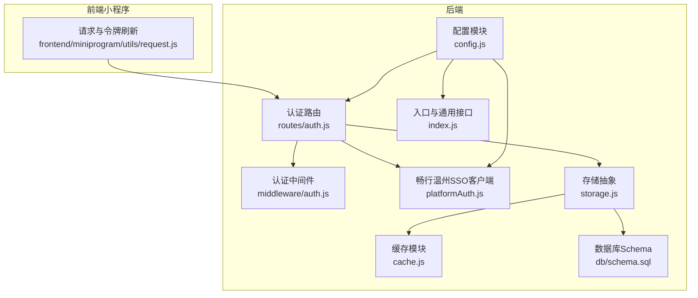
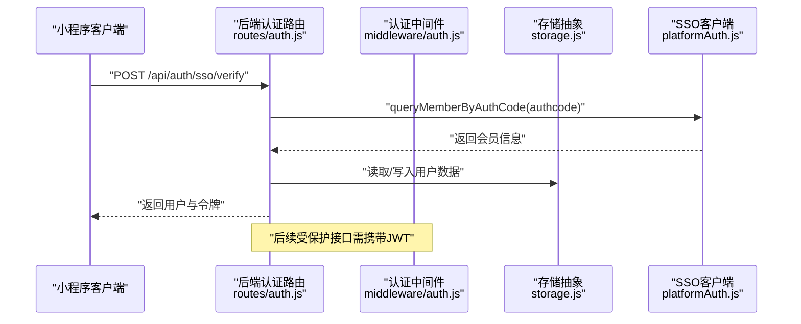
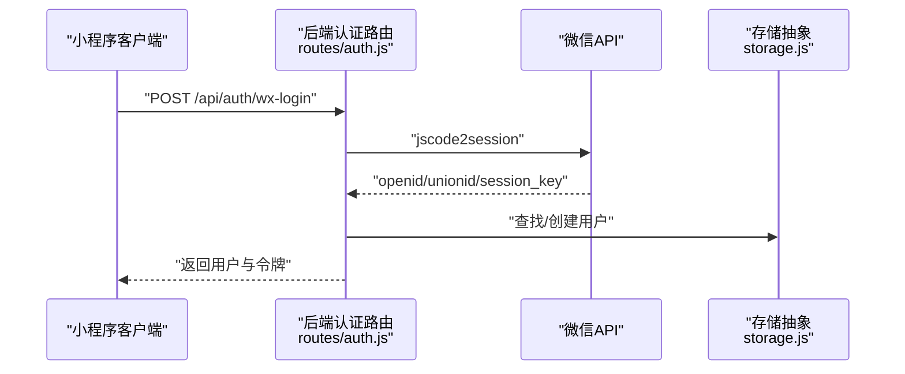
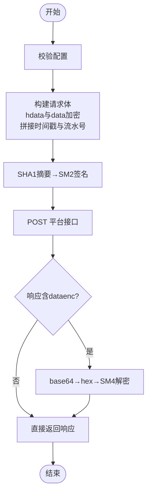
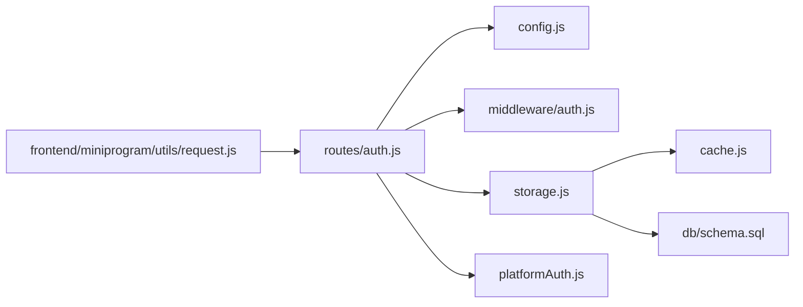

# 外部集成系统

<cite>
**本文引用的文件**
- [config.js](file://backend/config.js)
- [platformAuth.js](file://backend/platformAuth.js)
- [auth.js](file://backend/routes/auth.js)
- [auth中间件.js](file://backend/middleware/auth.js)
- [storage.js](file://backend/storage.js)
- [cache.js](file://backend/cache.js)
- [schema.sql](file://backend/db/schema.sql)
- [index.js](file://backend/index.js)
- [request.js](file://frontend/miniprogram/utils/request.js)
- [接入参数.txt](file://docs/接入文档/接入参数.txt)
- [畅行温州-会员查询-Apifox.json](file://docs/接入文档/畅行温州-会员查询-Apifox.json)
- [package.json](file://backend/package.json)
</cite>

## 目录
1. [简介](#简介)
2. [项目结构](#项目结构)
3. [核心组件](#核心组件)
4. [架构总览](#架构总览)
5. [详细组件分析](#详细组件分析)
6. [依赖关系分析](#依赖关系分析)
7. [性能考量](#性能考量)
8. [故障排除指南](#故障排除指南)
9. [结论](#结论)
10. [附录](#附录)

## 简介
本文件面向低空飞行服务平台的外部集成系统，聚焦以下三大主题：
- 微信API集成：包括微信登录（小程序与公众号H5）、微信支付（概念性说明）、消息推送（概念性说明）、小程序开发支持。
- 畅行温州SSO集成：包括SSO配置、用户信息同步、权限映射、错误处理。
- 第三方服务集成：阿里云OSS（对象存储）、腾讯云服务（概念性说明）、邮件服务（概念性说明）、短信服务（概念性说明）。

文档解释集成架构、认证流程、数据同步机制，并提供配置方法、API调用示例路径、故障排除指南以及安全考虑与最佳实践建议。

## 项目结构
后端采用Express框架，集中配置管理、认证中间件、路由与存储；前端小程序使用UniApp生态，封装了请求与令牌刷新逻辑；数据库支持本地JSON与PostgreSQL两种模式，具备统一的读写抽象层。

**图表来源**
- [config.js:1-123](file://backend/config.js#L1-L123)
- [auth中间件.js:1-168](file://backend/middleware/auth.js#L1-L168)
- [auth.js:1-591](file://backend/routes/auth.js#L1-L591)
- [platformAuth.js:1-177](file://backend/platformAuth.js#L1-L177)
- [storage.js:1-197](file://backend/storage.js#L1-L197)
- [cache.js:1-119](file://backend/cache.js#L1-L119)
- [schema.sql:1-10](file://backend/db/schema.sql#L1-L10)
- [index.js:1-800](file://backend/index.js#L1-L800)
- [request.js:1-144](file://frontend/miniprogram/utils/request.js#L1-L144)

**章节来源**
- [config.js:1-123](file://backend/config.js#L1-L123)
- [auth.js:1-591](file://backend/routes/auth.js#L1-L591)
- [platformAuth.js:1-177](file://backend/platformAuth.js#L1-L177)
- [storage.js:1-197](file://backend/storage.js#L1-L197)
- [cache.js:1-119](file://backend/cache.js#L1-L119)
- [schema.sql:1-10](file://backend/db/schema.sql#L1-L10)
- [index.js:1-800](file://backend/index.js#L1-L800)
- [request.js:1-144](file://frontend/miniprogram/utils/request.js#L1-L144)

## 核心组件
- 配置管理：集中管理JWT、管理员、微信、SSO、数据库、上传、服务器与SM2等敏感配置，提供校验与打印功能。
- 认证中间件：提供JWT校验、可选认证、角色校验与请求限流。
- 认证路由：提供登录、注册、刷新令牌、登出、SSO登录、微信登录、微信公众号授权等接口。
- SSO客户端：封装畅行温州平台的加密、签名、请求体构建与响应解密。
- 存储与缓存：统一读写抽象，支持JSON文件与PostgreSQL，内置内存缓存。
- 前端请求封装：小程序侧统一封装请求、令牌存储与刷新队列。

**章节来源**
- [config.js:1-123](file://backend/config.js#L1-L123)
- [auth中间件.js:1-168](file://backend/middleware/auth.js#L1-L168)
- [auth.js:1-591](file://backend/routes/auth.js#L1-L591)
- [platformAuth.js:1-177](file://backend/platformAuth.js#L1-L177)
- [storage.js:1-197](file://backend/storage.js#L1-L197)
- [cache.js:1-119](file://backend/cache.js#L1-L119)
- [request.js:1-144](file://frontend/miniprogram/utils/request.js#L1-L144)

## 架构总览
系统采用“前端小程序 + 后端服务 + 外部平台/数据库”的三层架构。前端通过HTTP与后端交互，后端通过配置模块加载环境变量，通过认证中间件保护路由，通过存储模块持久化用户与业务数据，通过SSO客户端与畅行温州平台进行加密通信。

**图表来源**
- [auth.js:320-392](file://backend/routes/auth.js#L320-L392)
- [platformAuth.js:165-172](file://backend/platformAuth.js#L165-L172)
- [storage.js:134-142](file://backend/storage.js#L134-L142)
- [auth中间件.js:11-45](file://backend/middleware/auth.js#L11-L45)

## 详细组件分析

### 微信API集成
- 小程序登录
  - 流程：前端传入code，后端调用微信jscode2session接口换取openid/unionid/session_key，查找或创建用户，签发JWT并持久化刷新令牌。
  - 关键点：支持unionid关联、session_key存储、自动升级旧密码、向后兼容明文密码。
- 公众号H5授权登录
  - 流程：后端生成授权URL，用户授权后回调获取access_token与openid，再拉取用户信息，查找或创建用户并重定向携带token与用户信息。
  - 关键点：支持snsapi_userinfo与snsapi_base两种scope；回调后端重定向携带base64编码的用户与令牌数据。
- 微信支付与消息推送
  - 当前代码未实现微信支付与消息推送的具体接口，仅保留配置项与注释提示。如需扩展，建议新增独立模块并遵循后端统一鉴权与日志记录规范。

**图表来源**
- [auth.js:510-588](file://backend/routes/auth.js#L510-L588)
- [storage.js:134-142](file://backend/storage.js#L134-L142)

**章节来源**
- [auth.js:398-508](file://backend/routes/auth.js#L398-L508)
- [auth.js:510-588](file://backend/routes/auth.js#L510-L588)
- [config.js:26-34](file://backend/config.js#L26-L34)

### 畅行温州SSO集成
- 配置与初始化
  - 通过环境变量加载平台地址、机构ID、商户ID、渠道ID、SM2私钥、SM4密钥等参数，并进行完整性校验。
- 加密与签名
  - SM4对称加密（ECB模式），输出hex后再base64；SM2签名基于SHA1摘要与userId（joininstid的UTF-8 hex）。
- 请求体构建
  - 组装hdata与data两部分，分别加密后放入请求体，附加时间戳与随机流水号，最后计算签名。
- 响应解密
  - 若dataenc存在，先base64→hex→SM4解密，再解析为JSON。
- 错误处理
  - 对空响应、result非0000、网络异常等场景抛出明确错误，便于上层捕获与日志记录。

**图表来源**
- [platformAuth.js:30-38](file://backend/platformAuth.js#L30-L38)
- [platformAuth.js:112-133](file://backend/platformAuth.js#L112-L133)
- [platformAuth.js:135-163](file://backend/platformAuth.js#L135-L163)

**章节来源**
- [platformAuth.js:1-177](file://backend/platformAuth.js#L1-L177)
- [auth.js:320-392](file://backend/routes/auth.js#L320-L392)
- [接入参数.txt:1-28](file://docs/接入文档/接入参数.txt#L1-L28)
- [畅行温州-会员查询-Apifox.json:1-32](file://docs/接入文档/畅行温州-会员查询-Apifox.json#L1-L32)

### 第三方服务集成
- 阿里云OSS（对象存储）
  - 代码中存在图片压缩与静态资源服务端点，可用于OSS直传后的缩略图处理与缓存策略，但未见OSS SDK调用示例。建议在后端新增OSS上传服务，结合签名直传与回调校验，确保安全性。
- 腾讯云服务
  - 未在代码中发现直接调用，可按类似OSS的模式新增模块，统一鉴权与日志。
- 邮件服务
  - 未在代码中发现直接调用，可新增邮件发送服务，结合模板与队列异步处理。
- 短信服务
  - 未在代码中发现直接调用，可新增短信发送服务，结合验证码缓存与频率控制。

**章节来源**
- [index.js:86-114](file://backend/index.js#L86-L114)
- [package.json:12-29](file://backend/package.json#L12-L29)

## 依赖关系分析
- 组件耦合
  - 认证路由依赖配置模块、认证中间件、存储模块与SSO客户端。
  - 存储模块依赖缓存模块与数据库Schema，支持JSON与PostgreSQL双栈。
  - 前端请求封装依赖后端认证路由与令牌刷新接口。
- 外部依赖
  - axios用于HTTP调用（微信与SSO）、bcrypt用于密码哈希、jsonwebtoken用于JWT、sm-crypto用于SM2/SM4。

**图表来源**
- [auth.js:1-591](file://backend/routes/auth.js#L1-L591)
- [config.js:1-123](file://backend/config.js#L1-L123)
- [auth中间件.js:1-168](file://backend/middleware/auth.js#L1-L168)
- [storage.js:1-197](file://backend/storage.js#L1-L197)
- [cache.js:1-119](file://backend/cache.js#L1-L119)
- [schema.sql:1-10](file://backend/db/schema.sql#L1-L10)
- [request.js:1-144](file://frontend/miniprogram/utils/request.js#L1-L144)

**章节来源**
- [auth.js:1-591](file://backend/routes/auth.js#L1-L591)
- [storage.js:1-197](file://backend/storage.js#L1-L197)
- [cache.js:1-119](file://backend/cache.js#L1-L119)
- [schema.sql:1-10](file://backend/db/schema.sql#L1-L10)
- [request.js:1-144](file://frontend/miniprogram/utils/request.js#L1-L144)

## 性能考量
- 缓存策略
  - 用户数据缓存60秒，案例与服务配置缓存5分钟，减少磁盘IO与数据库压力。
- 速率限制
  - 登录/注册接口内置简单滑动窗口限流，防止暴力破解与刷单。
- 图片压缩
  - 提供图片压缩端点，支持尺寸与质量参数，失败时回退原图并设置合理缓存头。
- 数据库选择
  - 支持PostgreSQL JSONB存储，便于未来规范化与索引优化。

**章节来源**
- [cache.js:1-119](file://backend/cache.js#L1-L119)
- [storage.js:134-181](file://backend/storage.js#L134-L181)
- [auth中间件.js:108-143](file://backend/middleware/auth.js#L108-L143)
- [index.js:86-114](file://backend/index.js#L86-L114)
- [schema.sql:1-10](file://backend/db/schema.sql#L1-L10)

## 故障排除指南
- 配置问题
  - JWT密钥过短或使用默认值：启动时会警告；生产环境需设置足够长度的密钥。
  - 微信小程序/公众号未配置：相关接口返回“未配置”错误。
  - SSO参数缺失：初始化即抛出异常，检查环境变量与接入参数文件。
- 认证失败
  - 令牌无效或过期：中间件返回401；前端需触发刷新令牌流程。
  - 刷新令牌失效：检查本地存储与数据库中refreshToken一致性。
- 微信登录失败
  - code过期或无效：微信返回errcode；检查前端传参与后端日志。
  - jscode2session失败：检查appid/secret与网络连通性。
- SSO查询失败
  - 平台返回非0000结果：检查authcode与签名参数；查看响应描述。
  - 响应解密异常：确认SM4密钥长度与base64/hex转换正确。
- 前端令牌刷新
  - 401时自动排队重试：若刷新失败，清除本地令牌并引导重新登录。

**章节来源**
- [config.js:78-104](file://backend/config.js#L78-L104)
- [auth中间件.js:11-45](file://backend/middleware/auth.js#L11-L45)
- [auth.js:230-294](file://backend/routes/auth.js#L230-L294)
- [auth.js:510-588](file://backend/routes/auth.js#L510-L588)
- [platformAuth.js:135-163](file://backend/platformAuth.js#L135-L163)
- [request.js:36-134](file://frontend/miniprogram/utils/request.js#L36-L134)

## 结论
本系统通过集中配置、统一认证中间件与存储抽象，实现了微信与SSO的外部集成能力。建议后续补充微信支付与消息推送、OSS直传与回调校验、短信与邮件服务模块，并持续完善日志与监控，确保生产环境的安全与稳定。

## 附录

### 配置方法
- 环境变量（示例字段）
  - JWT：JWT_SECRET、ACCESS_TOKEN_TTL、REFRESH_TOKEN_TTL
  - 管理员：SUPER_ADMIN_PHONE、DSL_ADMIN_PASSWORD、STUDY_ADMIN_PASSWORD
  - 微信：WX_APPID、WX_SECRET、WX_MP_APPID、WX_MP_SECRET
  - SSO：SSO_API_URL、SSO_API_KEY、PLATFORM_*（详见接入参数）
  - 数据库：USE_POSTGRES、PG_HOST、PG_PORT、PG_USER、PG_PASSWORD、PG_DATABASE、PG_SSL
  - 服务器：PORT、NODE_ENV、CORS_ORIGIN、BASE_URL、FRONTEND_URL
  - SM2：SM2_PRIVATE_KEY、SM2_PUBLIC_KEY
- 配置校验与打印
  - 启动时自动校验关键配置并输出摘要信息，生产环境需确保密钥强度与参数完整。

**章节来源**
- [config.js:7-122](file://backend/config.js#L7-L122)
- [接入参数.txt:1-28](file://docs/接入文档/接入参数.txt#L1-L28)

### API调用示例（路径参考）
- SSO登录
  - 方法：POST
  - 路径：/api/auth/sso/verify
  - 参数：authcode（或jyauthcode）
  - 返回：用户信息与JWT
  - 参考：[auth.js:320-392](file://backend/routes/auth.js#L320-L392)
- 微信小程序登录
  - 方法：POST
  - 路径：/api/auth/wx-login
  - 参数：code
  - 返回：用户与JWT
  - 参考：[auth.js:510-588](file://backend/routes/auth.js#L510-L588)
- 微信公众号授权URL
  - 方法：GET
  - 路径：/api/auth/wechat-oauth-url?redirectUrl=...
  - 返回：授权URL
  - 参考：[auth.js:398-421](file://backend/routes/auth.js#L398-L421)
- 微信公众号授权回调
  - 方法：GET
  - 路径：/api/auth/wechat-oauth/callback?code=&state=
  - 返回：前端重定向携带用户与令牌
  - 参考：[auth.js:427-508](file://backend/routes/auth.js#L427-L508)
- 令牌刷新
  - 方法：POST
  - 路径：/api/auth/refresh
  - 参数：refreshToken
  - 返回：新的accessToken
  - 参考：[auth.js:230-294](file://backend/routes/auth.js#L230-L294)

### 安全考虑与最佳实践
- 密钥管理
  - 生产环境必须设置强JWT密钥；SM2/SM4密钥严格保密，定期轮换。
- 传输安全
  - 使用HTTPS；敏感参数避免日志泄露。
- 输入校验
  - 使用中间件对请求体进行消毒与必填字段校验。
- 速率限制
  - 登录/注册接口启用限流，防止暴力破解。
- 日志审计
  - 记录关键操作与错误，便于追踪与取证。
- 前端令牌安全
  - 仅在内存/安全存储中存放令牌；刷新失败立即清空并引导重新登录。