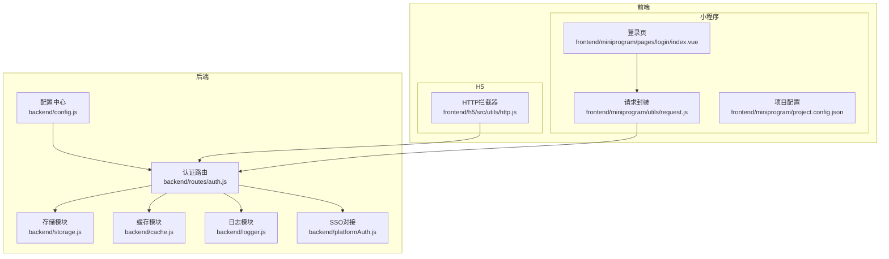
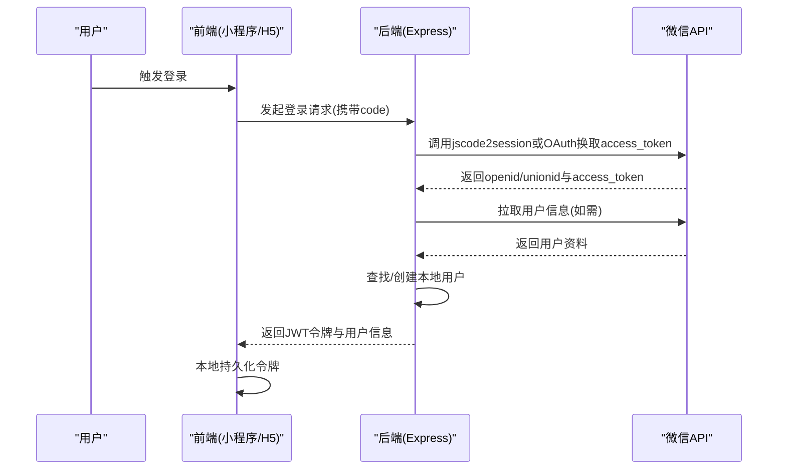
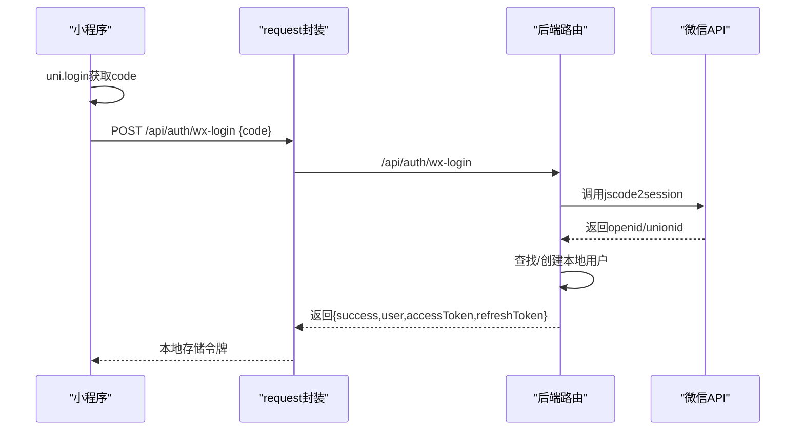
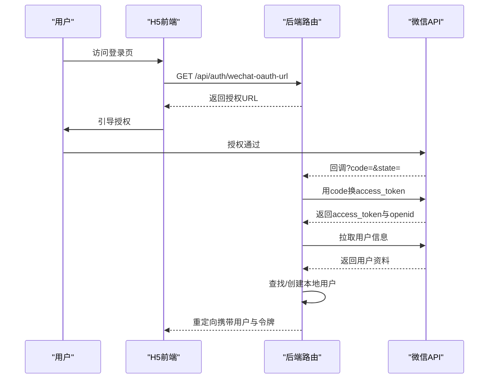
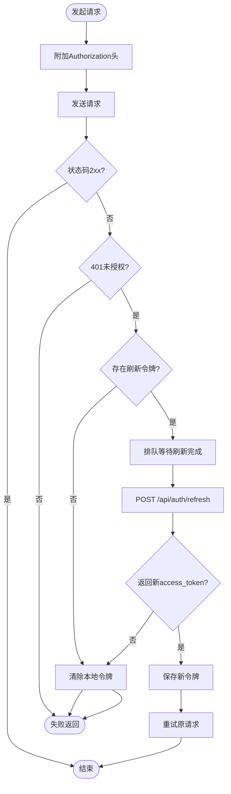
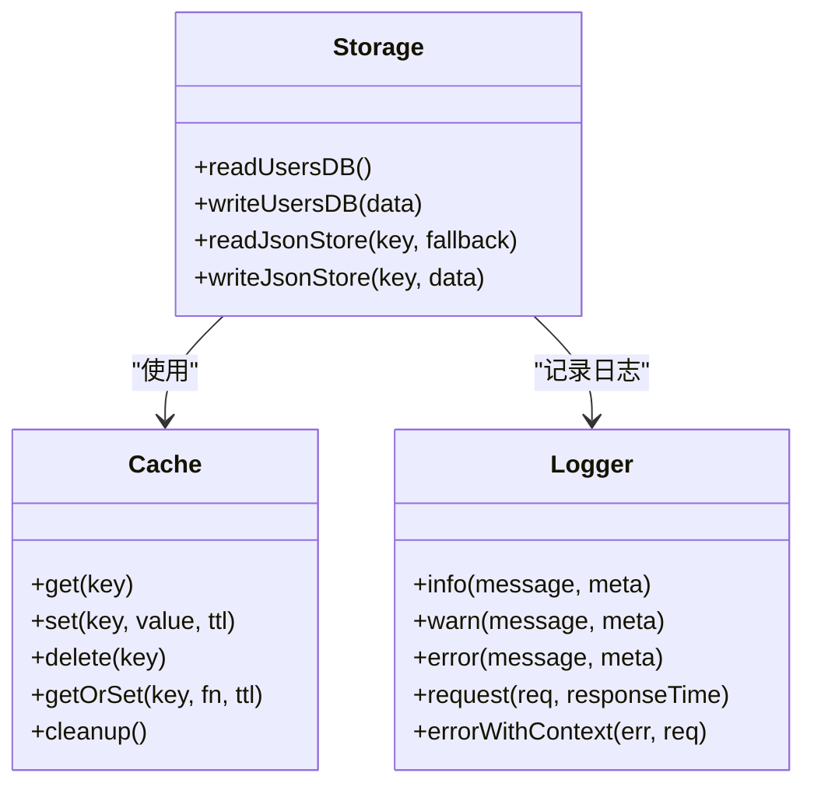
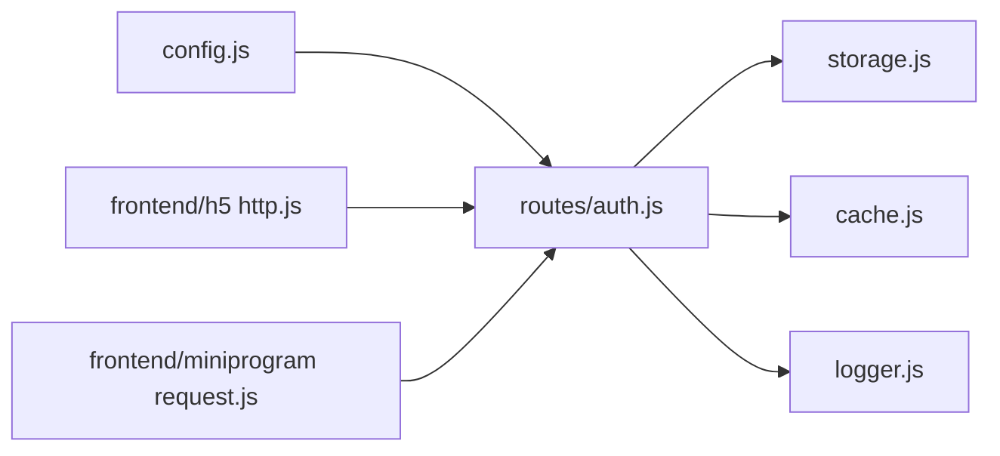

# 微信API集成

<cite>
**本文引用的文件**
- [backend/config.js](file://backend/config.js)
- [backend/routes/auth.js](file://backend/routes/auth.js)
- [backend/storage.js](file://backend/storage.js)
- [backend/cache.js](file://backend/cache.js)
- [backend/logger.js](file://backend/logger.js)
- [backend/platformAuth.js](file://backend/platformAuth.js)
- [backend/package.json](file://backend/package.json)
- [frontend/h5/src/utils/http.js](file://frontend/h5/src/utils/http.js)
- [frontend/miniprogram/utils/request.js](file://frontend/miniprogram/utils/request.js)
- [frontend/miniprogram/pages/login/index.vue](file://frontend/miniprogram/pages/login/index.vue)
- [frontend/miniprogram/project.config.json](file://frontend/miniprogram/project.config.json)
</cite>

## 目录
1. [简介](#简介)
2. [项目结构](#项目结构)
3. [核心组件](#核心组件)
4. [架构总览](#架构总览)
5. [详细组件分析](#详细组件分析)
6. [依赖关系分析](#依赖关系分析)
7. [性能考量](#性能考量)
8. [故障排查指南](#故障排查指南)
9. [结论](#结论)
10. [附录](#附录)

## 简介
本文件面向“微信API集成”的完整技术文档，覆盖以下主题：
- 微信登录集成：OAuth2.0授权流程、用户信息获取、access_token管理
- 微信支付集成：配置方法、支付参数设置、回调处理机制（概念性说明）
- 微信消息推送：模板消息、客服消息、事件推送（概念性说明）
- 小程序开发集成：小程序登录、wx.request封装、云开发使用（概念性说明）
- 安全考虑与性能优化建议
- 配置示例、API调用路径与常见问题解决方案

说明：当前仓库实现了微信公众号网页授权登录与微信小程序登录；微信支付与消息推送在本仓库未发现直接实现，本文提供通用集成思路与最佳实践。

## 项目结构
后端采用 Express + Node.js，前端包含 H5 和小程序两套入口。微信相关能力集中在后端认证路由与前端请求封装中。

**图表来源**
- [backend/config.js:1-123](file://backend/config.js#L1-L123)
- [backend/routes/auth.js:1-591](file://backend/routes/auth.js#L1-L591)
- [backend/storage.js:1-197](file://backend/storage.js#L1-L197)
- [backend/cache.js:1-119](file://backend/cache.js#L1-L119)
- [backend/logger.js:1-104](file://backend/logger.js#L1-L104)
- [backend/platformAuth.js:1-177](file://backend/platformAuth.js#L1-L177)
- [frontend/h5/src/utils/http.js:1-99](file://frontend/h5/src/utils/http.js#L1-L99)
- [frontend/miniprogram/utils/request.js:1-144](file://frontend/miniprogram/utils/request.js#L1-L144)
- [frontend/miniprogram/pages/login/index.vue:1-387](file://frontend/miniprogram/pages/login/index.vue#L1-L387)
- [frontend/miniprogram/project.config.json:1-35](file://frontend/miniprogram/project.config.json#L1-L35)

**章节来源**
- [backend/config.js:1-123](file://backend/config.js#L1-L123)
- [backend/routes/auth.js:1-591](file://backend/routes/auth.js#L1-L591)
- [frontend/h5/src/utils/http.js:1-99](file://frontend/h5/src/utils/http.js#L1-L99)
- [frontend/miniprogram/utils/request.js:1-144](file://frontend/miniprogram/utils/request.js#L1-L144)

## 核心组件
- 配置中心：集中管理 JWT、微信、数据库、服务器等配置，支持运行时校验与打印。
- 认证路由：提供登录、注册、刷新令牌、登出、微信公众号授权、微信小程序登录等接口。
- 存储模块：统一读写 users 等 JSON 数据，支持缓存与 PostgreSQL 后端切换。
- 缓存模块：基于内存 Map 的 TTL 缓存，降低频繁读取成本。
- 日志模块：结构化日志记录，便于审计与排障。
- SSO 对接：与畅行温州平台的加解密与签名流程对接（与微信无直接关系）。

**章节来源**
- [backend/config.js:1-123](file://backend/config.js#L1-L123)
- [backend/routes/auth.js:1-591](file://backend/routes/auth.js#L1-L591)
- [backend/storage.js:134-142](file://backend/storage.js#L134-L142)
- [backend/cache.js:5-119](file://backend/cache.js#L5-L119)
- [backend/logger.js:1-104](file://backend/logger.js#L1-L104)
- [backend/platformAuth.js:1-177](file://backend/platformAuth.js#L1-L177)

## 架构总览
微信登录（小程序与公众号）的整体流程如下：

**图表来源**
- [backend/routes/auth.js:513-588](file://backend/routes/auth.js#L513-L588)
- [backend/routes/auth.js:427-508](file://backend/routes/auth.js#L427-L508)

## 详细组件分析

### 组件A：微信登录（小程序）
- 实现要点
  - 前端调用 uni.login 获取临时登录凭证 code
  - 前端通过封装的 request 发送 POST /api/auth/wx-login 并携带 code
  - 后端调用微信 jscode2session 接口换取 openid/unionid
  - 后端查找或创建本地用户，签发 JWT 并返回给前端
  - 前端将 accessToken/refreshToken 写入本地存储，后续请求自动附加 Authorization

**图表来源**
- [frontend/miniprogram/pages/login/index.vue:120-158](file://frontend/miniprogram/pages/login/index.vue#L120-L158)
- [frontend/miniprogram/utils/request.js:59-134](file://frontend/miniprogram/utils/request.js#L59-L134)
- [backend/routes/auth.js:513-588](file://backend/routes/auth.js#L513-L588)

**章节来源**
- [frontend/miniprogram/pages/login/index.vue:120-158](file://frontend/miniprogram/pages/login/index.vue#L120-L158)
- [frontend/miniprogram/utils/request.js:59-134](file://frontend/miniprogram/utils/request.js#L59-L134)
- [backend/routes/auth.js:513-588](file://backend/routes/auth.js#L513-L588)

### 组件B：微信登录（公众号H5网页授权）
- 实现要点
  - 前端调用 GET /api/auth/wechat-oauth-url 获取授权URL
  - 用户在微信中授权后，微信回调至 /api/auth/wechat-oauth/callback
  - 后端用 code 换取 access_token 与 openid，再拉取用户信息
  - 查找/创建本地用户并签发 JWT，重定向回前端并附带用户与令牌信息

**图表来源**
- [backend/routes/auth.js:398-421](file://backend/routes/auth.js#L398-L421)
- [backend/routes/auth.js:427-508](file://backend/routes/auth.js#L427-L508)

**章节来源**
- [backend/routes/auth.js:398-421](file://backend/routes/auth.js#L398-L421)
- [backend/routes/auth.js:427-508](file://backend/routes/auth.js#L427-L508)

### 组件C：访问令牌与刷新机制（H5与小程序）
- 实现要点
  - H5：axios 拦截器自动附加 Bearer 令牌；401 时触发刷新流程
  - 小程序：自定义 request 封装，统一处理 401 与并发刷新队列
  - 刷新逻辑：携带 refreshToken 调用 /api/auth/refresh，成功后更新本地令牌并重试原请求

**图表来源**
- [frontend/h5/src/utils/http.js:19-78](file://frontend/h5/src/utils/http.js#L19-L78)
- [frontend/miniprogram/utils/request.js:36-134](file://frontend/miniprogram/utils/request.js#L36-L134)
- [backend/routes/auth.js:230-294](file://backend/routes/auth.js#L230-L294)

**章节来源**
- [frontend/h5/src/utils/http.js:19-78](file://frontend/h5/src/utils/http.js#L19-L78)
- [frontend/miniprogram/utils/request.js:36-134](file://frontend/miniprogram/utils/request.js#L36-L134)
- [backend/routes/auth.js:230-294](file://backend/routes/auth.js#L230-L294)

### 组件D：用户数据存储与缓存
- 存储模块负责 users 等 JSON 数据的读写，支持 PostgreSQL 或本地 JSON 文件两种后端
- 缓存模块提供 TTL 缓存，降低频繁读取成本
- 日志模块记录关键操作与错误上下文

**图表来源**
- [backend/storage.js:134-197](file://backend/storage.js#L134-L197)
- [backend/cache.js:5-119](file://backend/cache.js#L5-L119)
- [backend/logger.js:1-104](file://backend/logger.js#L1-L104)

**章节来源**
- [backend/storage.js:134-197](file://backend/storage.js#L134-L197)
- [backend/cache.js:5-119](file://backend/cache.js#L5-L119)
- [backend/logger.js:1-104](file://backend/logger.js#L1-L104)

## 依赖关系分析
- 配置中心被认证路由、存储、缓存、日志等模块广泛依赖
- 认证路由依赖存储与缓存进行用户数据读写与缓存控制
- 前端 H5 与小程序均依赖后端认证路由与令牌刷新机制
- 项目依赖中包含 sm-crypto 等国密算法库，用于 SSO 对接（与微信无直接关系）

**图表来源**
- [backend/config.js:1-123](file://backend/config.js#L1-L123)
- [backend/routes/auth.js:1-591](file://backend/routes/auth.js#L1-591)
- [backend/storage.js:1-197](file://backend/storage.js#L1-L197)
- [backend/cache.js:1-119](file://backend/cache.js#L1-L119)
- [backend/logger.js:1-104](file://backend/logger.js#L1-L104)
- [frontend/h5/src/utils/http.js:1-99](file://frontend/h5/src/utils/http.js#L1-L99)
- [frontend/miniprogram/utils/request.js:1-144](file://frontend/miniprogram/utils/request.js#L1-L144)

**章节来源**
- [backend/package.json:12-29](file://backend/package.json#L12-L29)
- [backend/config.js:1-123](file://backend/config.js#L1-L123)
- [backend/routes/auth.js:1-591](file://backend/routes/auth.js#L1-L591)

## 性能考量
- 缓存策略
  - users 与各类数据使用 TTL 缓存，减少磁盘/数据库 IO
  - 建议根据业务热点调整缓存 TTL，平衡一致性与性能
- 请求拦截与并发控制
  - H5 与小程序均实现了 401 自动刷新与并发队列，避免重复刷新与请求丢失
- 数据库选择
  - 支持 PostgreSQL 与 JSON 文件两种后端，生产建议使用 PostgreSQL 并开启连接池
- 日志级别
  - 生产环境建议提升日志级别，避免过多 debug 输出影响性能

[本节为通用指导，无需特定文件引用]

## 故障排查指南
- 配置检查
  - 确认 WX_APPID/WX_SECRET 与 WX_MP_APPID/WX_MP_SECRET 已正确设置
  - 生产环境 JWT_SECRET 长度应≥32字符
- 常见错误定位
  - 微信登录失败：查看后端日志中的 errcode/errmsg，确认 code 是否过期
  - 401 未授权：检查刷新令牌是否有效、是否过期、是否被清除
  - 用户信息缺失：确认授权作用域是否包含用户信息（公众号 snsapi_userinfo）
- 前端调试
  - H5：检查 axios 拦截器是否附加 Authorization 头
  - 小程序：检查本地存储的 accessToken/refreshToken 是否存在

**章节来源**
- [backend/config.js:79-104](file://backend/config.js#L79-L104)
- [backend/routes/auth.js:536-542](file://backend/routes/auth.js#L536-L542)
- [backend/routes/auth.js:287-293](file://backend/routes/auth.js#L287-L293)
- [frontend/h5/src/utils/http.js:19-78](file://frontend/h5/src/utils/http.js#L19-L78)
- [frontend/miniprogram/utils/request.js:36-134](file://frontend/miniprogram/utils/request.js#L36-L134)

## 结论
本项目已完整实现微信小程序与公众号网页授权登录，具备完善的令牌管理与自动刷新机制。对于微信支付与消息推送，当前仓库未提供直接实现，建议按本文提供的通用集成思路扩展。

[本节为总结，无需特定文件引用]

## 附录

### A. 微信登录配置清单
- 小程序
  - WX_APPID、WX_SECRET
- 公众号H5
  - WX_MP_APPID、WX_MP_SECRET
- 服务器
  - BASE_URL、FRONTEND_URL（用于回调与重定向）

**章节来源**
- [backend/config.js:26-76](file://backend/config.js#L26-L76)

### B. API调用路径参考
- 获取微信公众号授权URL
  - GET /api/auth/wechat-oauth-url
- 微信公众号授权回调
  - GET /api/auth/wechat-oauth/callback
- 小程序登录
  - POST /api/auth/wx-login
- 刷新令牌
  - POST /api/auth/refresh

**章节来源**
- [backend/routes/auth.js:398-421](file://backend/routes/auth.js#L398-L421)
- [backend/routes/auth.js:427-508](file://backend/routes/auth.js#L427-L508)
- [backend/routes/auth.js:513-588](file://backend/routes/auth.js#L513-L588)
- [backend/routes/auth.js:230-294](file://backend/routes/auth.js#L230-L294)

### C. 安全建议
- 强制 HTTPS 传输，避免令牌泄露
- 生产环境使用强 JWT_SECRET，定期轮换
- 对微信回调参数进行严格校验与防重放
- 限制登录与刷新接口的频率，防止暴力破解

[本节为通用指导，无需特定文件引用]

### D. 微信支付与消息推送（概念性说明）
- 微信支付集成
  - 服务端统一下单，前端调起支付
  - 支付回调服务端验签并更新订单状态
  - 建议使用 HTTPS、严格的参数校验与幂等设计
- 消息推送
  - 模板消息：服务端调用微信模板消息接口
  - 客服消息：服务端调用客服接口发送
  - 事件推送：服务端接收并解析事件，异步处理

[本节为通用指导，无需特定文件引用]