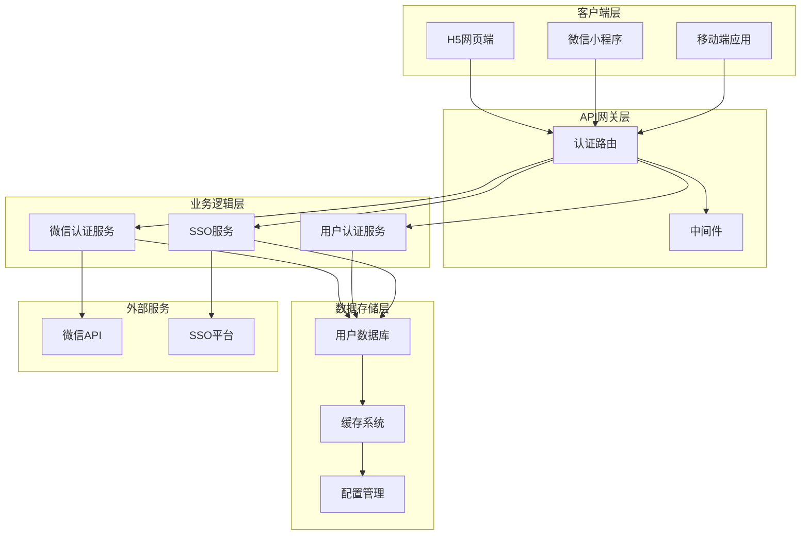
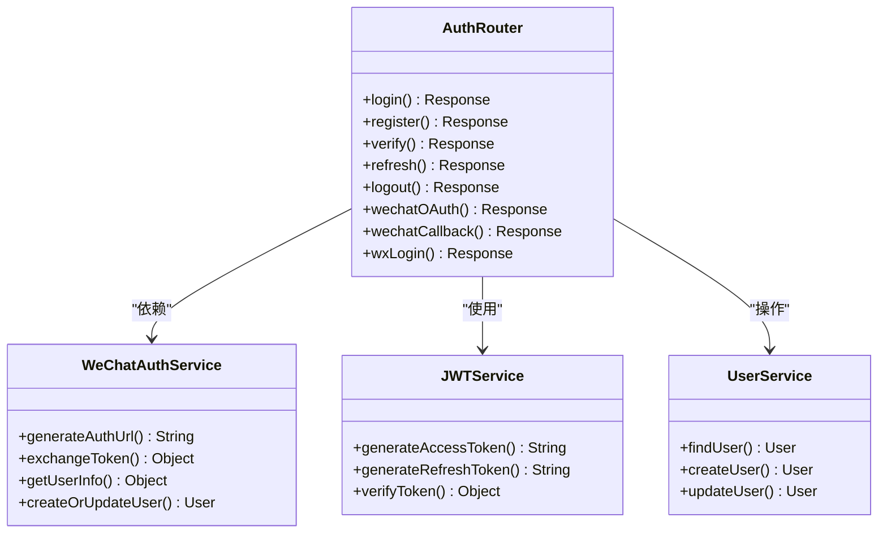
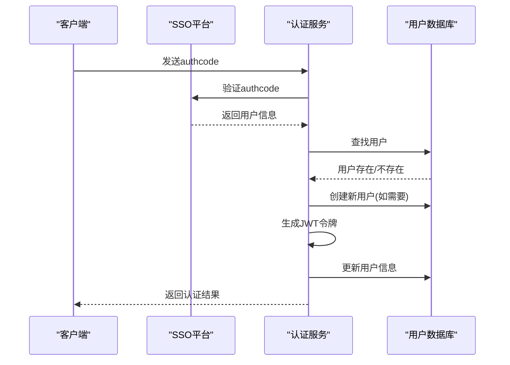
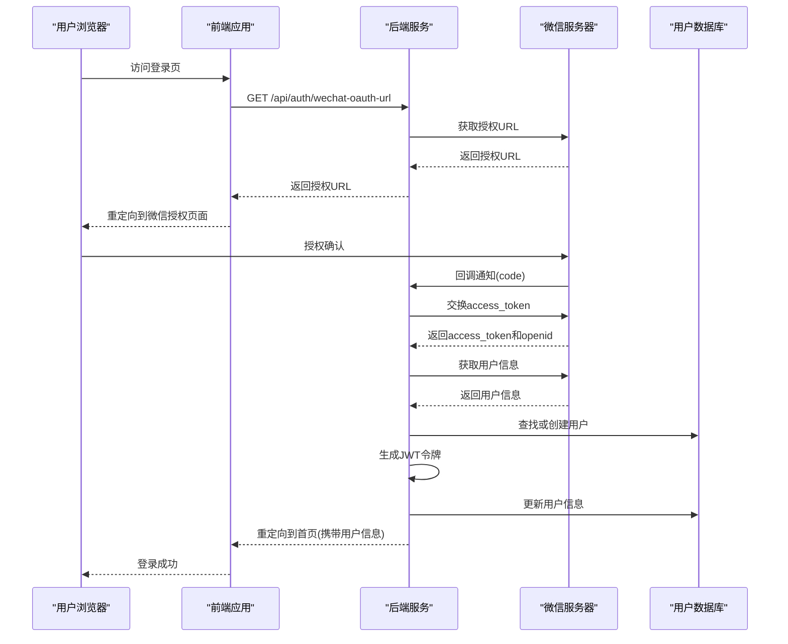
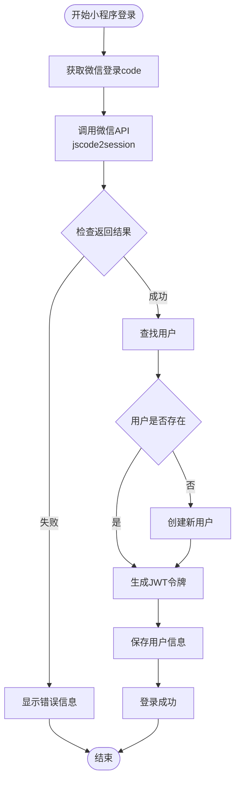
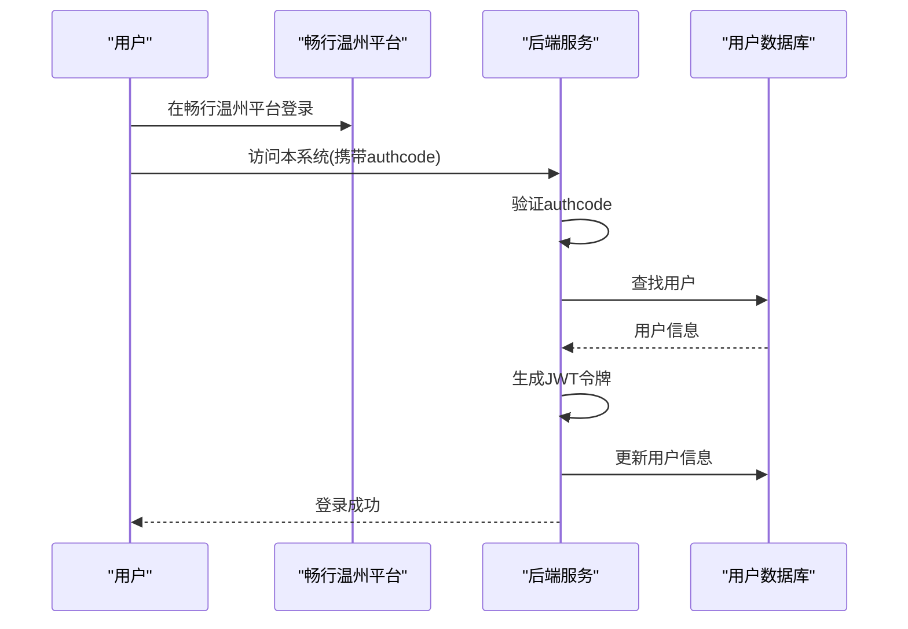
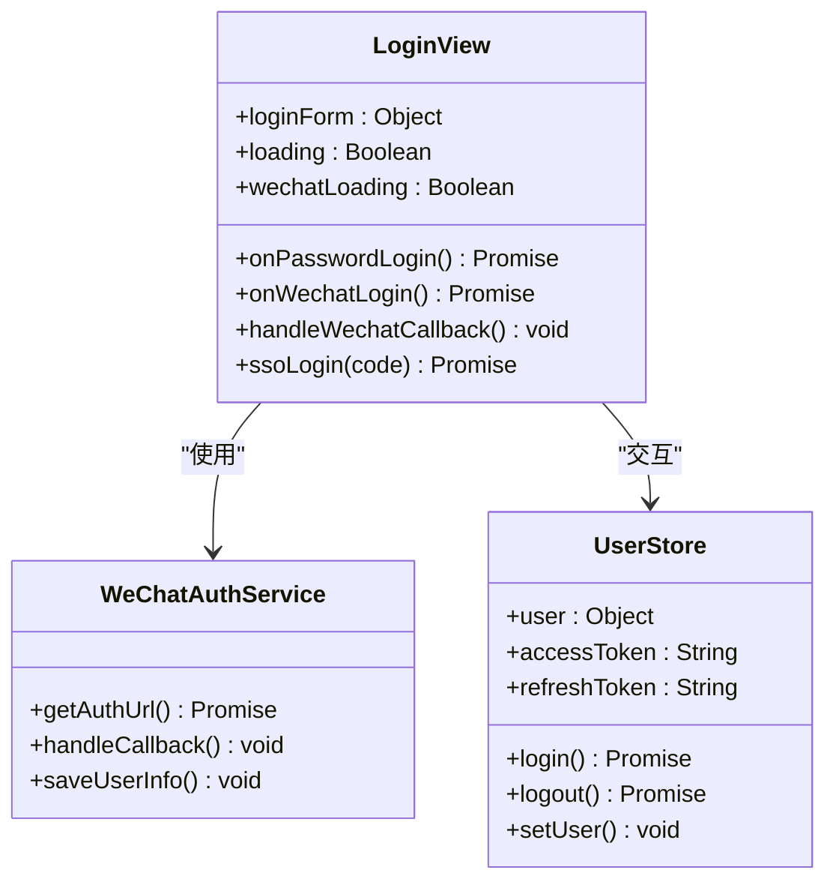
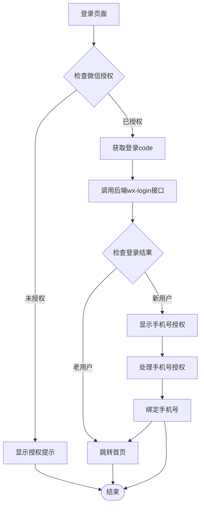
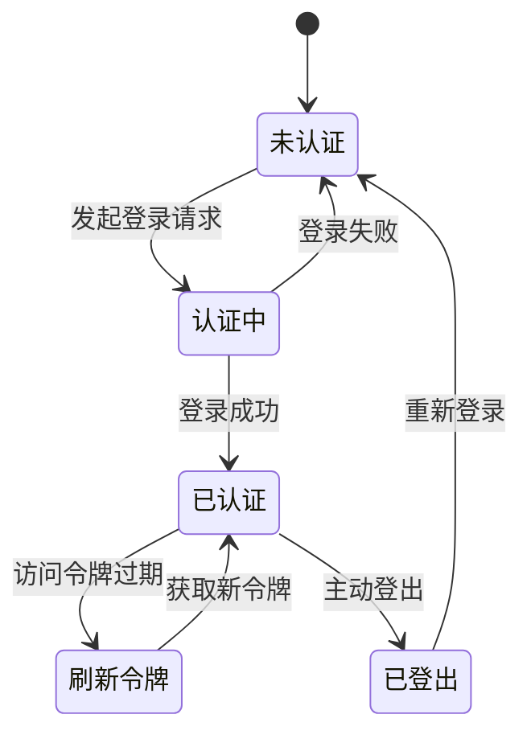

# 微信官方账号OAuth登录

<cite>
**本文档引用的文件**
- [backend/routers/auth.js](file://backend/routers/auth.js)
- [backend/platformAuth.js](file://backend/platformAuth.js)
- [backend/middleware/auth.js](file://backend/middleware/auth.js)
- [backend/config.js](file://backend/config.js)
- [backend/storage.js](file://backend/storage.js)
- [frontend/h5/src/views/login/Index.vue](file://frontend/h5/src/views/login/Index.vue)
- [frontend/h5/src/stores/user.js](file://frontend/h5/src/stores/user.js)
- [frontend/miniprogram/pages/login/index.vue](file://frontend/miniprogram/pages/login/index.vue)
- [frontend/miniprogram/pages/mine/index.vue](file://frontend/miniprogram/pages/mine/index.vue)
</cite>

## 目录
1. [项目概述](#项目概述)
2. [系统架构](#系统架构)
3. [核心组件](#核心组件)
4. [微信OAuth登录流程](#微信oauth登录流程)
5. [SSO集成](#sso集成)
6. [前端实现](#前端实现)
7. [安全机制](#安全机制)
8. [部署配置](#部署配置)
9. [故障排除](#故障排除)
10. [总结](#总结)

## 项目概述

本项目是一个基于Node.js和Vue.js构建的低空综合服务平台，集成了微信官方账号OAuth登录功能。系统支持多种登录方式，包括传统的账号密码登录、微信公众号OAuth授权登录、微信小程序一键登录以及SSO单点登录。

微信OAuth登录是整个系统的重要组成部分，为用户提供了便捷的第三方登录体验，同时确保了用户数据的安全性和系统的可扩展性。

## 系统架构

**图表来源**
- [backend/routers/auth.js:1-591](file://backend/routers/auth.js#L1-L591)
- [backend/platformAuth.js:1-177](file://backend/platformAuth.js#L1-L177)

## 核心组件

### 认证路由模块

认证路由模块是整个OAuth登录系统的核心，负责处理所有与用户认证相关的HTTP请求。该模块实现了RESTful API设计，提供了完整的用户认证生命周期管理。

**图表来源**
- [backend/routers/auth.js:96-591](file://backend/routers/auth.js#L96-L591)

### 平台认证服务

平台认证服务专门处理SSO（Single Sign-On）单点登录功能，与畅行温州平台进行集成，为用户提供统一的身份认证体验。

**图表来源**
- [backend/platformAuth.js:165-172](file://backend/platformAuth.js#L165-L172)

**章节来源**
- [backend/routers/auth.js:1-591](file://backend/routers/auth.js#L1-L591)
- [backend/platformAuth.js:1-177](file://backend/platformAuth.js#L1-L177)

## 微信OAuth登录流程

### H5网页授权登录

H5网页授权登录是最复杂的微信OAuth流程，涉及多个步骤和安全考虑：

**图表来源**
- [backend/routers/auth.js:398-508](file://backend/routers/auth.js#L398-L508)

### 微信小程序一键登录

小程序一键登录流程相对简化，适合移动应用场景：

**图表来源**
- [backend/routers/auth.js:513-588](file://backend/routers/auth.js#L513-L588)

**章节来源**
- [backend/routers/auth.js:398-588](file://backend/routers/auth.js#L398-L588)

## SSO集成

### SSO认证流程

SSO（Single Sign-On）单点登录功能允许用户通过畅行温州平台进行统一认证，然后在本系统中自动登录。

**图表来源**
- [backend/routers/auth.js:322-392](file://backend/routers/auth.js#L322-L392)
- [backend/platformAuth.js:165-172](file://backend/platformAuth.js#L165-L172)

### SSO安全机制

SSO系统采用了多重安全措施来确保认证过程的安全性：

1. **SM4对称加密**：使用SM4算法对敏感数据进行加密传输
2. **SM2数字签名**：使用SM2算法对请求进行数字签名验证
3. **SHA1摘要**：对请求内容进行SHA1摘要计算
4. **随机数机制**：每次请求都包含随机生成的序列号

**章节来源**
- [backend/platformAuth.js:1-177](file://backend/platformAuth.js#L1-L177)

## 前端实现

### H5网页端登录实现

H5网页端的登录功能提供了完整的微信OAuth登录体验：

**图表来源**
- [frontend/h5/src/views/login/Index.vue:90-242](file://frontend/h5/src/views/login/Index.vue#L90-L242)
- [frontend/h5/src/stores/user.js:7-177](file://frontend/h5/src/stores/user.js#L7-L177)

### 微信小程序登录实现

小程序端的登录功能针对移动设备进行了优化：

**图表来源**
- [frontend/miniprogram/pages/login/index.vue:120-188](file://frontend/miniprogram/pages/login/index.vue#L120-L188)

**章节来源**
- [frontend/h5/src/views/login/Index.vue:1-330](file://frontend/h5/src/views/login/Index.vue#L1-L330)
- [frontend/miniprogram/pages/login/index.vue:1-387](file://frontend/miniprogram/pages/login/index.vue#L1-L387)

## 安全机制

### JWT令牌管理

系统采用JWT（JSON Web Token）进行用户身份认证和授权管理：

**图表来源**
- [backend/routers/auth.js:49-73](file://backend/routers/auth.js#L49-L73)
- [backend/routers/auth.js:230-294](file://backend/routers/auth.js#L230-L294)

### 密码安全

系统实现了多层次的密码安全策略：

1. **BCrypt哈希**：使用BCrypt算法对用户密码进行哈希存储
2. **向后兼容**：支持明文密码的自动升级机制
3. **密码强度验证**：确保用户设置足够强的密码

### 请求限流

为了防止暴力破解和DDoS攻击，系统实现了智能的请求限流机制：

- **IP维度限流**：基于客户端IP地址进行请求频率控制
- **时间窗口**：15分钟内的请求次数限制
- **动态阈值**：不同端点有不同的请求限制

**章节来源**
- [backend/routers/auth.js:25-44](file://backend/routers/auth.js#L25-L44)
- [backend/middleware/auth.js:108-160](file://backend/middleware/auth.js#L108-L160)

## 部署配置

### 环境变量配置

系统通过环境变量进行灵活的配置管理：

| 配置项 | 描述 | 必需 | 默认值 |
|--------|------|------|--------|
| WX_APPID | 微信小程序AppID | 是 | '' |
| WX_SECRET | 微信小程序密钥 | 是 | '' |
| WX_MP_APPID | 微信公众号AppID | 是 | '' |
| WX_MP_SECRET | 微信公众号密钥 | 是 | '' |
| JWT_SECRET | JWT密钥 | 是 | 'change-this-to-random-string-in-production' |
| ACCESS_TOKEN_TTL | 访问令牌有效期 | 否 | '30m' |
| REFRESH_TOKEN_TTL | 刷新令牌有效期 | 否 | '7d' |

### 数据存储配置

系统支持两种数据存储模式：

1. **JSON文件存储**：适用于开发和测试环境
2. **PostgreSQL存储**：适用于生产环境

**章节来源**
- [backend/config.js:1-123](file://backend/config.js#L1-L123)
- [backend/storage.js:1-361](file://backend/storage.js#L1-L361)

## 故障排除

### 常见问题及解决方案

| 问题类型 | 症状 | 可能原因 | 解决方案 |
|----------|------|----------|----------|
| 微信授权失败 | 登录后重定向到错误页面 | 微信配置错误或回调地址不匹配 | 检查微信公众号配置和回调URL |
| 令牌过期 | 接口调用返回401错误 | 访问令牌已过期 | 调用刷新令牌接口获取新令牌 |
| 用户不存在 | 查询用户信息失败 | 用户数据损坏或删除 | 检查用户数据库状态 |
| SSO认证失败 | 无法通过SSO平台验证 | 网络连接或平台服务异常 | 检查网络连接和平台服务状态 |

### 日志监控

系统提供了完善的日志记录机制，便于问题诊断和性能监控：

- **认证日志**：记录所有认证尝试和结果
- **错误日志**：捕获和记录系统异常
- **访问日志**：跟踪用户行为和系统使用情况

**章节来源**
- [backend/routers/auth.js:110-116](file://backend/routers/auth.js#L110-L116)
- [backend/middleware/auth.js:148-160](file://backend/middleware/auth.js#L148-L160)

## 总结

微信官方账号OAuth登录系统是一个功能完整、安全可靠的用户认证解决方案。系统通过以下特点确保了良好的用户体验和安全性：

1. **多平台支持**：同时支持H5网页、微信小程序等多种客户端
2. **安全可靠**：采用JWT令牌、BCrypt哈希等多重安全机制
3. **易于扩展**：模块化设计便于功能扩展和维护
4. **开发友好**：提供清晰的API接口和详细的错误处理

该系统为低空综合服务平台提供了坚实的用户认证基础，为后续的功能扩展和业务发展奠定了良好的技术基础。