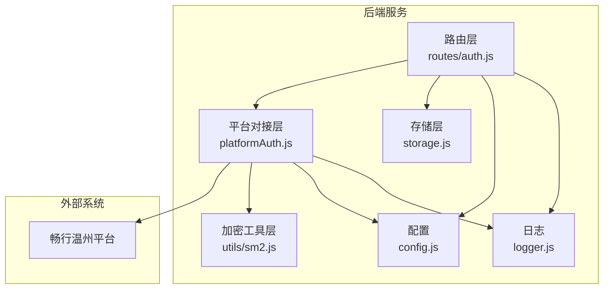
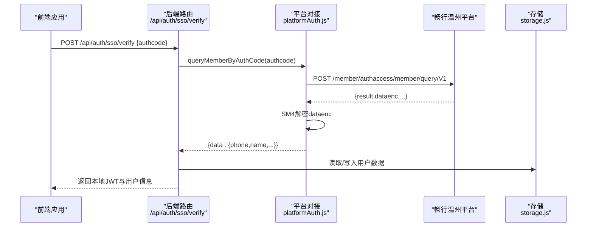
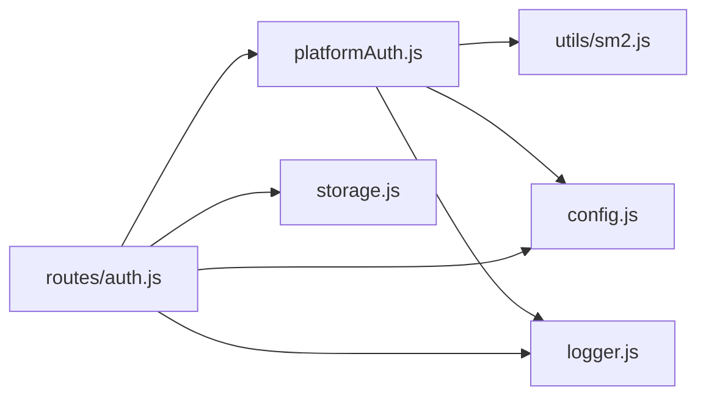

# 畅行温州SSO集成

<cite>
**本文引用的文件列表**
- [platformAuth.js](file://backend/platformAuth.js)
- [sm2.js](file://backend/utils/sm2.js)
- [auth.js](file://backend/routes/auth.js)
- [config.js](file://backend/config.js)
- [logger.js](file://backend/logger.js)
- [storage.js](file://backend/storage.js)
- [create-request.js](file://backend/create-request.js)
- [接入参数.txt](file://docs/接入文档/接入参数.txt)
- [畅行温州-会员查询-Apifox.json](file://docs/接入文档/畅行温州-会员查询-Apifox.json)
</cite>

## 目录
1. [简介](#简介)
2. [项目结构](#项目结构)
3. [核心组件](#核心组件)
4. [架构总览](#架构总览)
5. [详细组件分析](#详细组件分析)
6. [依赖关系分析](#依赖关系分析)
7. [性能考量](#性能考量)
8. [故障排除指南](#故障排除指南)
9. [结论](#结论)
10. [附录](#附录)

## 简介
本文件面向集成“畅行温州”SSO单点登录的开发者，系统性说明以下内容：
- SSO认证流程：授权码获取、用户信息查询、token交换机制
- 国密算法实现：SM2/SM4密钥管理、数据加解密、签名验证
- 请求报文构建规则：时间戳格式化、随机数生成、签名内容构造
- 响应数据解析流程：数据解密、状态码校验、错误处理机制
- 完整配置参数说明、API调用示例与调试工具使用指南
- 安全加密最佳实践与常见问题排查

## 项目结构
后端采用Express框架，按职责分层组织：
- 平台对接层：负责与畅行温州平台交互（请求构建、加解密、签名、HTTP调用）
- 路由层：对外提供SSO登录、用户信息等REST接口
- 工具层：通用加密工具（SM2签名/验签）
- 存储层：用户数据持久化与缓存
- 配置与日志：集中配置与结构化日志

图表来源
- [auth.js:1-591](file://backend/routes/auth.js#L1-L591)
- [platformAuth.js:1-177](file://backend/platformAuth.js#L1-L177)
- [sm2.js:1-190](file://backend/utils/sm2.js#L1-L190)
- [storage.js:1-197](file://backend/storage.js#L1-L197)
- [config.js:1-123](file://backend/config.js#L1-L123)
- [logger.js:1-104](file://backend/logger.js#L1-L104)

章节来源
- [auth.js:1-591](file://backend/routes/auth.js#L1-L591)
- [platformAuth.js:1-177](file://backend/platformAuth.js#L1-L177)

## 核心组件
- 平台对接模块：封装与畅行温州平台的通信，包括请求体构建、SM4加密、SM2签名、响应解密与状态校验
- SSO路由：提供SSO登录接口，内部调用平台对接模块获取用户信息并发放本地JWT
- SM2工具：提供与Java SDK兼容的SM2签名/验签能力
- 配置中心：集中管理JWT、微信、SSO、数据库、服务器、国密密钥等配置
- 存储与缓存：用户数据读写与缓存控制
- 日志：统一结构化日志输出

章节来源
- [platformAuth.js:1-177](file://backend/platformAuth.js#L1-L177)
- [auth.js:320-392](file://backend/routes/auth.js#L320-L392)
- [sm2.js:1-190](file://backend/utils/sm2.js#L1-L190)
- [config.js:1-123](file://backend/config.js#L1-L123)
- [storage.js:134-142](file://backend/storage.js#L134-L142)
- [logger.js:1-104](file://backend/logger.js#L1-L104)

## 架构总览
SSO登录流程概览如下：

图表来源
- [auth.js:320-392](file://backend/routes/auth.js#L320-L392)
- [platformAuth.js:135-172](file://backend/platformAuth.js#L135-L172)
- [storage.js:134-142](file://backend/storage.js#L134-L142)

## 详细组件分析

### 组件一：平台对接模块（platformAuth.js）
职责与流程
- 配置校验：确保平台基础URL、机构ID、商户ID、渠道ID、SM2私钥、SM4密钥均配置
- 请求体构建：生成joininstid、joininstssn、reqdate、reqtime；分别对hdata与data进行SM4加密
- 签名：对排序后的键值拼接字符串做SHA1摘要，再以SM2对摘要进行签名（userId为joininstid的UTF-8 hex）
- 发送请求：POST到平台接口，打印请求与响应日志
- 响应解析：若返回dataenc则进行SM4解密，校验result字段（非0000即视为失败）

请求报文构建规则
- 时间戳格式化：reqdate为YYYYMMDD，reqtime为HHMMSS
- 随机数生成：joininstssn为reqdate+reqtime+6位随机数，长度不超过20
- 签名内容构造：对请求体所有键按字典序排序拼接“key+value”
- 加密与签名：hdata与data分别SM4加密，整体签名

响应解析流程
- 空响应校验：若无响应体抛错
- 结果码校验：result存在且不为“0000”时抛错
- 数据解密：若存在dataenc则SM4解密并注入data字段
- 返回标准化：返回平台原始响应（含解密后的data）

章节来源
- [platformAuth.js:5-38](file://backend/platformAuth.js#L5-L38)
- [platformAuth.js:40-64](file://backend/platformAuth.js#L40-L64)
- [platformAuth.js:66-90](file://backend/platformAuth.js#L66-L90)
- [platformAuth.js:92-110](file://backend/platformAuth.js#L92-L110)
- [platformAuth.js:112-133](file://backend/platformAuth.js#L112-L133)
- [platformAuth.js:135-163](file://backend/platformAuth.js#L135-L163)
- [platformAuth.js:165-172](file://backend/platformAuth.js#L165-L172)

### 组件二：SM2签名工具（utils/sm2.js）
功能与兼容性
- SM2签名/验签：支持标准DER格式与自定义r||s格式
- 与Java SDK兼容：提供针对Java SDK的签名/验签函数，明确userId与hash参数
- 密钥对生成：基于sm-crypto生成hex格式的密钥对
- 配置依赖：从config.js读取SM2公私钥

章节来源
- [sm2.js:22-62](file://backend/utils/sm2.js#L22-L62)
- [sm2.js:75-112](file://backend/utils/sm2.js#L75-L112)
- [sm2.js:138-156](file://backend/utils/sm2.js#L138-L156)
- [sm2.js:167-181](file://backend/utils/sm2.js#L167-L181)
- [config.js:71-76](file://backend/config.js#L71-L76)

### 组件三：SSO路由（routes/auth.js）
SSO登录流程
- 参数校验：要求authcode存在
- 调用平台对接：queryMemberByAuthCode获取会员信息
- 用户匹配/创建：根据phone查找或自动创建本地用户
- 生成本地JWT：发放accessToken与refreshToken
- 刷新令牌持久化：更新用户记录中的refreshToken与过期时间戳
- 响应清理：返回脱敏后的用户信息与令牌

章节来源
- [auth.js:320-392](file://backend/routes/auth.js#L320-L392)
- [auth.js:96-147](file://backend/routes/auth.js#L96-L147)
- [auth.js:230-294](file://backend/routes/auth.js#L230-L294)
- [storage.js:134-142](file://backend/storage.js#L134-L142)

### 组件四：请求构建工具（create-request.js）
用途与用法
- 生成完整请求：包含URL、方法、Headers、Body与调试信息
- 支持指定authcode或自动生成测试authcode
- 输出单行JSON便于复制粘贴至Apifox等工具

章节来源
- [create-request.js:1-124](file://backend/create-request.js#L1-L124)
- [畅行温州-会员查询-Apifox.json:1-32](file://docs/接入文档/畅行温州-会员查询-Apifox.json#L1-L32)

## 依赖关系分析

图表来源
- [auth.js:14](file://backend/routes/auth.js#L14)
- [platformAuth.js:3](file://backend/platformAuth.js#L3)
- [sm2.js:5](file://backend/utils/sm2.js#L5)
- [config.js:5](file://backend/config.js#L5)
- [logger.js:5](file://backend/logger.js#L5)
- [storage.js:3](file://backend/storage.js#L3)

章节来源
- [auth.js:1-591](file://backend/routes/auth.js#L1-L591)
- [platformAuth.js:1-177](file://backend/platformAuth.js#L1-L177)

## 性能考量
- 缓存策略：用户数据读取使用缓存（60秒），减少磁盘IO与数据库压力
- 请求超时：平台HTTP客户端设置15秒超时，避免阻塞
- 日志级别：生产环境建议提升日志级别，降低I/O开销
- 加解密成本：SM4加密/解密与SM2签名/验签在高并发下需关注CPU占用，必要时引入连接池与限流

章节来源
- [storage.js:134-142](file://backend/storage.js#L134-L142)
- [platformAuth.js:25-28](file://backend/platformAuth.js#L25-L28)
- [logger.js:107-116](file://backend/logger.js#L107-L116)

## 故障排除指南
常见问题与定位步骤
- 平台响应为空：检查网络连通性与平台地址配置
- 平台返回失败：核对result与resultdesc，确认SM2私钥、SM4密钥、joininstid、hdata参数
- 签名/验签失败：确认userId为joininstid的UTF-8 hex，hash参数与Java SDK一致
- 加密/解密异常：确认SM4密钥长度与格式（32位十六进制），ECB模式
- 时间戳/随机数异常：确认reqdate/reqtime格式与joininstssn生成逻辑
- 用户未找到：确认authcode对应的真实手机号已在平台侧生效

调试工具与日志
- 使用create-request.js生成请求体，便于在Apifox中复现问题
- 开启DEBUG日志查看签名内容、SHA1摘要、签名hex/base64等中间值
- 检查后端日志文件，定位错误堆栈与上下文

章节来源
- [platformAuth.js:135-163](file://backend/platformAuth.js#L135-L163)
- [sm2.js:138-156](file://backend/utils/sm2.js#L138-L156)
- [create-request.js:109-124](file://backend/create-request.js#L109-L124)
- [logger.js:75-94](file://backend/logger.js#L75-L94)

## 结论
本集成方案以清晰的分层设计实现了与畅行温州平台的SSO对接，结合SM2/SM4国密算法与严格的请求/响应处理流程，具备良好的安全性与可维护性。通过统一的配置中心、结构化日志与调试工具，能够快速定位问题并保障线上稳定运行。

## 附录

### A. 配置参数说明
- 平台对接参数（来自接入参数.txt）
  - 平台基础URL、joininstid、authinstid
  - SM2公钥/私钥、SM4密钥
  - hdata：instid、mchntid、chnlid
- 环境变量（来自config.js）
  - JWT密钥、过期时间
  - 微信小程序/公众号配置
  - SSO接口与密钥
  - 数据库与服务器配置
  - SM2公私钥（用于通用SM2工具）

章节来源
- [接入参数.txt:1-28](file://docs/接入文档/接入参数.txt#L1-L28)
- [config.js:8-76](file://backend/config.js#L8-L76)

### B. API调用示例
- SSO登录接口
  - 方法：POST
  - 路径：/api/auth/sso/verify
  - 请求体：{ authcode }
  - 成功响应：success、user（脱敏）、accessToken、refreshToken
- 请求构建参考
  - 使用create-request.js生成完整请求体，复制到Apifox
  - 示例集合见畅行温州-会员查询-Apifox.json

章节来源
- [auth.js:320-392](file://backend/routes/auth.js#L320-L392)
- [create-request.js:68-107](file://backend/create-request.js#L68-L107)
- [畅行温州-会员查询-Apifox.json:7-31](file://docs/接入文档/畅行温州-会员查询-Apifox.json#L7-L31)

### C. 请求报文构建规则详解
- 时间戳格式化：reqdate=YYYYMMDD，reqtime=HHMMSS
- 随机数生成：joininstssn=reqdate+reqtime+6位随机数，长度≤20
- 签名内容构造：对请求体键按字典序排序拼接“key+value”
- 加密：SM4 ECB模式，明文为JSON字符串，输出hex后再base64
- 签名：SHA1摘要后用SM2签名，userId为joininstid的UTF-8 hex

章节来源
- [platformAuth.js:40-64](file://backend/platformAuth.js#L40-L64)
- [platformAuth.js:66-90](file://backend/platformAuth.js#L66-L90)
- [platformAuth.js:92-110](file://backend/platformAuth.js#L92-L110)
- [platformAuth.js:112-133](file://backend/platformAuth.js#L112-L133)

### D. 响应数据解析流程
- 校验响应体是否存在
- 校验result字段（非0000即失败）
- 若存在dataenc则SM4解密并注入data
- 返回标准化响应

章节来源
- [platformAuth.js:135-163](file://backend/platformAuth.js#L135-L163)

### E. 安全加密最佳实践
- 密钥管理
  - SM2私钥仅保留在受控环境中，避免硬编码
  - SM4密钥长度与格式严格校验（32位十六进制）
- 传输安全
  - 使用HTTPS与TLS
  - 严格校验平台证书（生产环境）
- 日志安全
  - 生产环境避免输出敏感字段
  - 使用结构化日志，统一脱敏
- 参数校验
  - 对输入参数进行白名单与格式校验
  - 对平台返回的字段进行严格校验

章节来源
- [config.js:78-104](file://backend/config.js#L78-L104)
- [logger.js:26-57](file://backend/logger.js#L26-L57)