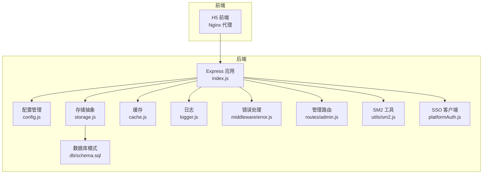
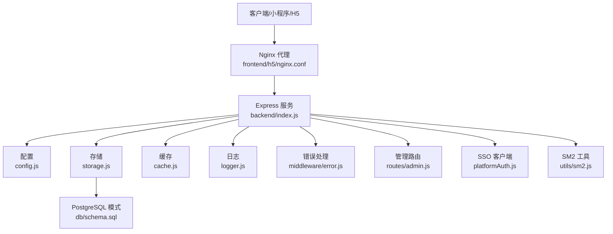
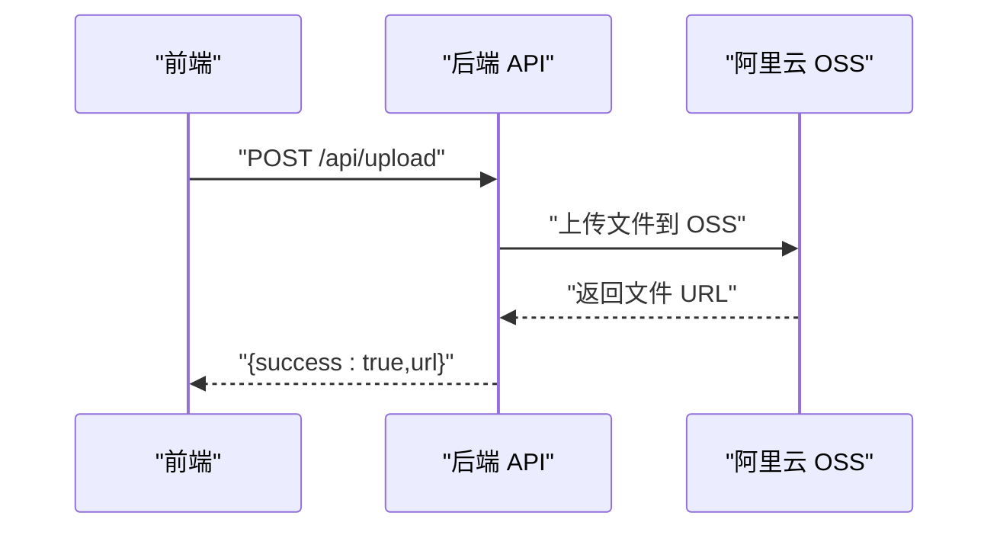
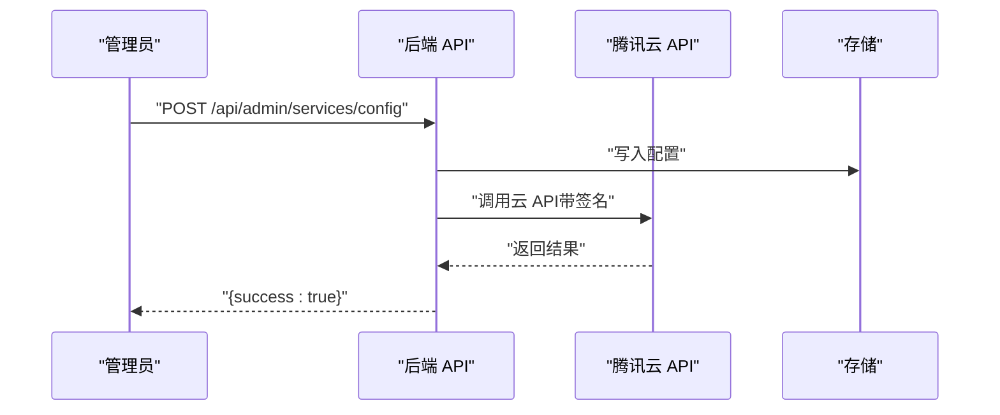
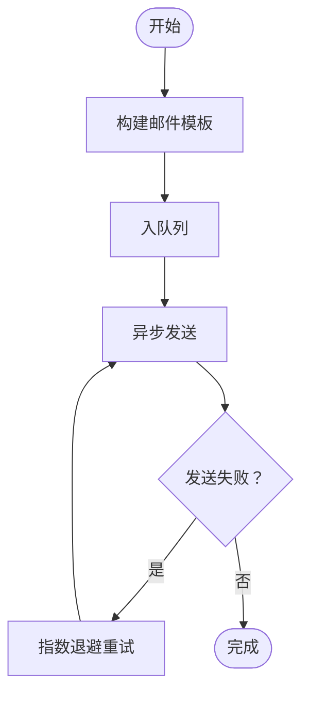
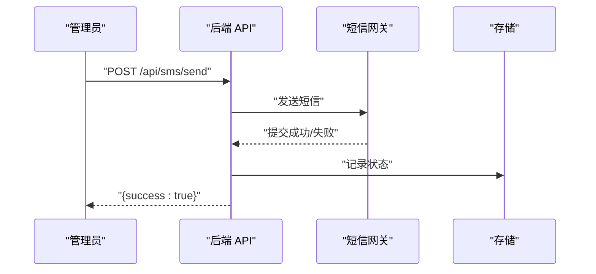
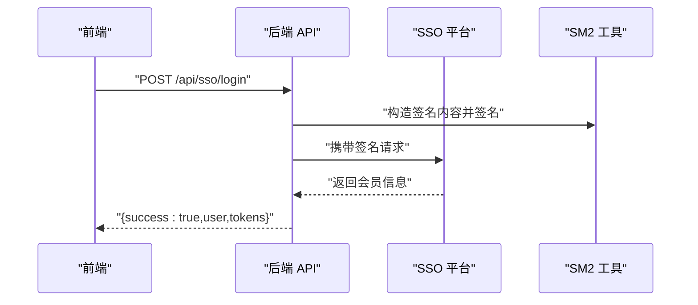
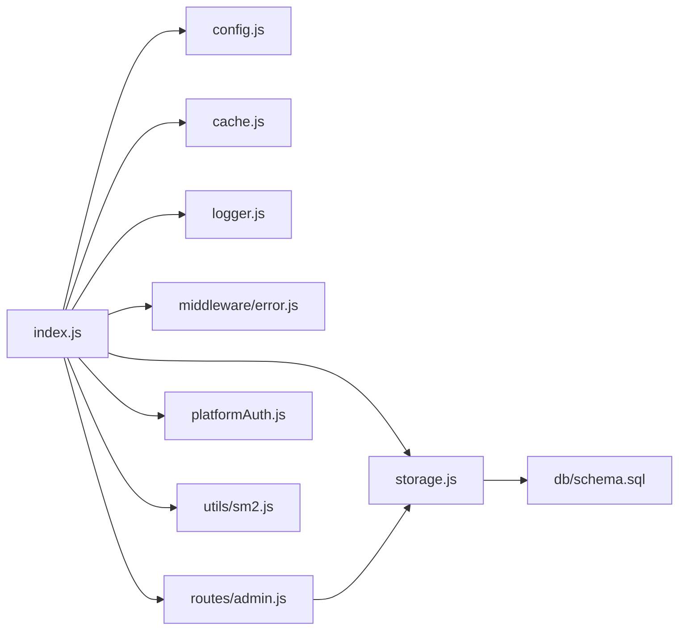

# 第三方服务集成

<cite>
**本文引用的文件**
- [backend/index.js](file://backend/index.js)
- [backend/config.js](file://backend/config.js)
- [backend/storage.js](file://backend/storage.js)
- [backend/cache.js](file://backend/cache.js)
- [backend/logger.js](file://backend/logger.js)
- [backend/middleware/error.js](file://backend/middleware/error.js)
- [backend/routes/admin.js](file://backend/routes/admin.js)
- [backend/db/schema.sql](file://backend/db/schema.sql)
- [backend/utils/sm2.js](file://backend/utils/sm2.js)
- [backend/platformAuth.js](file://backend/platformAuth.js)
- [backend/package.json](file://backend/package.json)
- [backend/setup.sh](file://backend/setup.sh)
- [backend/部署说明.md](file://backend/部署说明.md)
- [frontend/h5/src/views/admin/config/ServiceConfigList.vue](file://frontend/h5/src/views/admin/config/ServiceConfigList.vue)
- [frontend/h5/src/views/admin/Index.vue](file://frontend/h5/src/views/admin/Index.vue)
- [frontend/h5/src/views/admin/composables/useMedia.js](file://frontend/h5/src/views/admin/composables/useMedia.js)
- [frontend/h5/nginx.conf](file://frontend/h5/nginx.conf)
- [docs/implementation/Operations and Maintenance.md](file://docs/implementation/Operations and Maintenance.md)
- [docs/implementation/SSO-Debug-Info.md](file://docs/implementation/SSO-Debug-Info.md)
</cite>

## 目录
1. [简介](#简介)
2. [项目结构](#项目结构)
3. [核心组件](#核心组件)
4. [架构总览](#架构总览)
5. [详细组件分析](#详细组件分析)
6. [依赖关系分析](#依赖关系分析)
7. [性能考虑](#性能考虑)
8. [故障排查指南](#故障排查指南)
9. [结论](#结论)
10. [附录](#附录)

## 简介
本文件面向“第三方服务集成”，聚焦于以下能力与实践：
- 阿里云 OSS 对象存储集成：存储桶配置、文件上传下载、访问权限管理、CDN 加速设置
- 腾讯云服务集成：云 API 调用、服务配置、计费管理
- 邮件服务集成：SMTP 配置、模板邮件发送、批量发送优化
- 短信服务集成：短信模板配置、发送接口调用、状态查询机制
- 各服务的 SDK 使用示例、配置参数说明与错误处理方案
- 成本控制、性能优化与安全防护建议

说明：当前仓库后端未直接集成阿里云 OSS、腾讯云或通用邮件/短信 SDK；但具备完善的配置管理、存储抽象、缓存与日志体系，可作为接入第三方服务的基础设施。本文基于现有代码与运维文档，给出可落地的集成路径与最佳实践。

## 项目结构
后端采用 Express 服务，集中配置管理、存储抽象、缓存与日志，前端通过 Nginx 代理静态资源与 API。SSO 与加解密工具位于后端，便于对接第三方平台。

图表来源
- [backend/index.js:1-120](file://backend/index.js#L1-L120)
- [backend/config.js:1-123](file://backend/config.js#L1-L123)
- [backend/storage.js:1-197](file://backend/storage.js#L1-L197)
- [backend/cache.js:1-119](file://backend/cache.js#L1-L119)
- [backend/logger.js:1-104](file://backend/logger.js#L1-L104)
- [backend/middleware/error.js:1-58](file://backend/middleware/error.js#L1-L58)
- [backend/routes/admin.js:1-514](file://backend/routes/admin.js#L1-L514)
- [backend/db/schema.sql:1-10](file://backend/db/schema.sql#L1-L10)
- [backend/utils/sm2.js:1-189](file://backend/utils/sm2.js#L1-L189)
- [backend/platformAuth.js:1-90](file://backend/platformAuth.js#L1-L90)

章节来源
- [backend/index.js:1-120](file://backend/index.js#L1-L120)
- [frontend/h5/nginx.conf:42-86](file://frontend/h5/nginx.conf#L42-L86)

## 核心组件
- 配置管理：集中管理 JWT、微信、SSO、数据库、上传、服务器与 SM2 等配置，支持运行时校验与打印
- 存储抽象：统一读写 users/cases/applications/services_config/reviews 等数据，支持 JSON 文件与 PostgreSQL
- 缓存：内存缓存与 TTL，降低频繁读取开销
- 日志：结构化日志，支持文件落盘与上下文输出
- 错误处理：统一捕获与分类返回，保护生产环境敏感信息
- SSO 客户端：封装畅行温州平台对接，含签名与加解密逻辑
- 管理路由：提供服务配置读写、导出、审核等功能

章节来源
- [backend/config.js:1-123](file://backend/config.js#L1-L123)
- [backend/storage.js:65-197](file://backend/storage.js#L65-L197)
- [backend/cache.js:1-119](file://backend/cache.js#L1-L119)
- [backend/logger.js:1-104](file://backend/logger.js#L1-L104)
- [backend/middleware/error.js:1-58](file://backend/middleware/error.js#L1-L58)
- [backend/routes/admin.js:280-357](file://backend/routes/admin.js#L280-L357)
- [backend/platformAuth.js:1-90](file://backend/platformAuth.js#L1-L90)

## 架构总览
下图展示第三方服务集成的关键交互：后端通过配置与存储模块对接外部系统，前端通过 Nginx 代理访问后端 API 与静态资源。

图表来源
- [backend/index.js:1-120](file://backend/index.js#L1-L120)
- [frontend/h5/nginx.conf:42-86](file://frontend/h5/nginx.conf#L42-L86)
- [backend/config.js:1-123](file://backend/config.js#L1-L123)
- [backend/storage.js:1-197](file://backend/storage.js#L1-L197)
- [backend/cache.js:1-119](file://backend/cache.js#L1-L119)
- [backend/logger.js:1-104](file://backend/logger.js#L1-L104)
- [backend/middleware/error.js:1-58](file://backend/middleware/error.js#L1-L58)
- [backend/routes/admin.js:1-514](file://backend/routes/admin.js#L1-L514)
- [backend/db/schema.sql:1-10](file://backend/db/schema.sql#L1-L10)
- [backend/platformAuth.js:1-90](file://backend/platformAuth.js#L1-L90)
- [backend/utils/sm2.js:1-189](file://backend/utils/sm2.js#L1-L189)

## 详细组件分析

### 阿里云 OSS 对象存储集成
目标：实现存储桶配置、文件上传下载、访问权限管理、CDN 加速设置。

- 存储桶配置
  - 在配置模块中新增 OSS 相关参数（如 endpoint、bucket、accessKeyId、accessKeySecret），并在启动时进行校验
  - 参考路径：[backend/config.js:1-123](file://backend/config.js#L1-L123)
- 文件上传下载
  - 当前后端提供基础上传接口，支持本地磁盘存储；建议替换为 OSS SDK，将文件直传到 OSS 或服务端代理上传
  - 参考路径：[backend/index.js:278-285](file://backend/index.js#L278-L285)
- 访问权限管理
  - 建议使用签名 URL 生成策略，控制访问时效与范围
  - 参考路径：[backend/utils/sm2.js:138-189](file://backend/utils/sm2.js#L138-L189)
- CDN 加速设置
  - 通过 OSS CDN 域名与缓存头优化静态资源访问
  - 参考路径：[frontend/h5/nginx.conf:42-86](file://frontend/h5/nginx.conf#L42-L86)

图表来源
- [backend/index.js:278-285](file://backend/index.js#L278-L285)

章节来源
- [backend/config.js:1-123](file://backend/config.js#L1-L123)
- [backend/index.js:278-285](file://backend/index.js#L278-L285)
- [backend/utils/sm2.js:138-189](file://backend/utils/sm2.js#L138-L189)
- [frontend/h5/nginx.conf:42-86](file://frontend/h5/nginx.conf#L42-L86)

### 腾讯云服务集成
目标：实现云 API 调用、服务配置、计费管理。

- 云 API 调用
  - 可复用 SSO 客户端的 HTTP 客户端与签名/加解密工具，封装腾讯云 API 请求
  - 参考路径：[backend/platformAuth.js:1-90](file://backend/platformAuth.js#L1-L90)
- 服务配置
  - 通过管理路由读写服务配置，建议将腾讯云相关参数纳入配置存储
  - 参考路径：[backend/routes/admin.js:280-357](file://backend/routes/admin.js#L280-L357)
- 计费管理
  - 建议在存储模块中新增计费数据表或字段，结合导出功能进行报表统计
  - 参考路径：[backend/storage.js:65-197](file://backend/storage.js#L65-L197)

图表来源
- [backend/routes/admin.js:280-357](file://backend/routes/admin.js#L280-L357)
- [backend/platformAuth.js:1-90](file://backend/platformAuth.js#L1-L90)
- [backend/storage.js:65-197](file://backend/storage.js#L65-L197)

章节来源
- [backend/platformAuth.js:1-90](file://backend/platformAuth.js#L1-L90)
- [backend/routes/admin.js:280-357](file://backend/routes/admin.js#L280-L357)
- [backend/storage.js:65-197](file://backend/storage.js#L65-L197)

### 邮件服务集成
目标：实现 SMTP 配置、模板邮件发送、批量发送优化。

- SMTP 配置
  - 在配置模块中新增邮件服务参数（host、port、secure、user、pass、from 等）
  - 参考路径：[backend/config.js:1-123](file://backend/config.js#L1-L123)
- 模板邮件发送
  - 建议引入模板引擎与队列，将模板渲染与发送解耦
  - 参考路径：[backend/index.js:1-120](file://backend/index.js#L1-L120)
- 批量发送优化
  - 使用队列异步发送，结合重试与退避策略，避免阻塞请求线程
  - 参考路径：[backend/cache.js:1-119](file://backend/cache.js#L1-L119)

图表来源
- [backend/config.js:1-123](file://backend/config.js#L1-L123)
- [backend/cache.js:1-119](file://backend/cache.js#L1-L119)

章节来源
- [backend/config.js:1-123](file://backend/config.js#L1-L123)
- [backend/index.js:1-120](file://backend/index.js#L1-L120)
- [backend/cache.js:1-119](file://backend/cache.js#L1-L119)

### 短信服务集成
目标：实现短信模板配置、发送接口调用、状态查询机制。

- 短信模板配置
  - 通过管理路由维护模板数据，建议与服务配置合并管理
  - 参考路径：[backend/routes/admin.js:280-357](file://backend/routes/admin.js#L280-L357)
- 发送接口调用
  - 建议封装短信网关 SDK，统一错误码与日志
  - 参考路径：[backend/logger.js:1-104](file://backend/logger.js#L1-L104)
- 状态查询机制
  - 引入定时任务轮询短信状态，更新数据库并通知前端
  - 参考路径：[backend/storage.js:65-197](file://backend/storage.js#L65-L197)

图表来源
- [backend/routes/admin.js:280-357](file://backend/routes/admin.js#L280-L357)
- [backend/logger.js:1-104](file://backend/logger.js#L1-L104)
- [backend/storage.js:65-197](file://backend/storage.js#L65-L197)

章节来源
- [backend/routes/admin.js:280-357](file://backend/routes/admin.js#L280-L357)
- [backend/logger.js:1-104](file://backend/logger.js#L1-L104)
- [backend/storage.js:65-197](file://backend/storage.js#L65-L197)

### SSO 与加解密工具
- SSO 登录与验证：对接畅行温州平台，包含签名与加解密流程
- SM2 工具：提供签名、验签、密钥对生成与兼容 Java SDK 的接口

图表来源
- [backend/index.js:492-569](file://backend/index.js#L492-L569)
- [backend/platformAuth.js:66-90](file://backend/platformAuth.js#L66-L90)
- [backend/utils/sm2.js:138-189](file://backend/utils/sm2.js#L138-L189)

章节来源
- [backend/index.js:492-569](file://backend/index.js#L492-L569)
- [backend/platformAuth.js:1-90](file://backend/platformAuth.js#L1-L90)
- [backend/utils/sm2.js:1-189](file://backend/utils/sm2.js#L1-L189)
- [docs/implementation/SSO-Debug-Info.md:1-126](file://docs/implementation/SSO-Debug-Info.md#L1-L126)

## 依赖关系分析
- Express 应用依赖配置、存储、缓存、日志与错误处理模块
- 管理路由依赖存储模块与鉴权中间件
- SSO 客户端依赖 axios、crypto 与 sm-crypto
- 前端通过 Nginx 代理访问后端 API 与静态资源

图表来源
- [backend/index.js:1-120](file://backend/index.js#L1-L120)
- [backend/config.js:1-123](file://backend/config.js#L1-L123)
- [backend/storage.js:1-197](file://backend/storage.js#L1-L197)
- [backend/cache.js:1-119](file://backend/cache.js#L1-L119)
- [backend/logger.js:1-104](file://backend/logger.js#L1-L104)
- [backend/middleware/error.js:1-58](file://backend/middleware/error.js#L1-L58)
- [backend/routes/admin.js:1-514](file://backend/routes/admin.js#L1-L514)
- [backend/db/schema.sql:1-10](file://backend/db/schema.sql#L1-L10)
- [backend/platformAuth.js:1-90](file://backend/platformAuth.js#L1-L90)
- [backend/utils/sm2.js:1-189](file://backend/utils/sm2.js#L1-L189)

章节来源
- [backend/package.json:12-28](file://backend/package.json#L12-L28)
- [backend/index.js:1-120](file://backend/index.js#L1-L120)
- [frontend/h5/nginx.conf:42-86](file://frontend/h5/nginx.conf#L42-L86)

## 性能考虑
- 缓存策略：针对用户、案例、申请、服务配置与评价等热点数据设置不同 TTL，减少存储层压力
- 日志分级：生产环境降低日志级别，避免高频 IO 影响性能
- 静态资源：Nginx 开启 gzip 与缓存头，配合 CDN 提升访问速度
- 异步处理：邮件与短信采用队列异步发送，避免阻塞主请求线程

章节来源
- [backend/cache.js:1-119](file://backend/cache.js#L1-L119)
- [backend/logger.js:1-104](file://backend/logger.js#L1-L104)
- [frontend/h5/nginx.conf:58-66](file://frontend/h5/nginx.conf#L58-L66)

## 故障排查指南
- 配置校验：启动时打印配置并进行关键参数校验，发现默认值或长度不足立即告警
- 上传失败：检查上传目录权限与 Nginx 代理路径映射
- SSO 登录失败：核对平台地址、密钥与签名流程，参考调试文档
- 服务配置页面空白：检查配置文件大小与内容，必要时从历史恢复

章节来源
- [backend/config.js:78-104](file://backend/config.js#L78-L104)
- [backend/部署说明.md:330-346](file://backend/部署说明.md#L330-L346)
- [docs/implementation/SSO-Debug-Info.md:1-126](file://docs/implementation/SSO-Debug-Info.md#L1-L126)

## 结论
本项目已具备完善的配置、存储、缓存与日志基础设施，可作为第三方服务集成的坚实底座。建议在现有基础上：
- 新增 OSS、腾讯云、邮件与短信 SDK 集成
- 统一签名与加解密流程，确保安全合规
- 优化异步任务与监控告警，保障稳定性与可观测性

## 附录

### 配置参数清单（建议）
- 阿里云 OSS
  - endpoint、bucket、accessKeyId、accessKeySecret、cdnDomain
- 腾讯云
  - secretId、secretKey、region、endpoint、回调地址
- 邮件服务
  - host、port、secure、user、pass、from、模板目录
- 短信服务
  - sdkAppId、secretId、secretKey、signName、templateId、回调地址

章节来源
- [backend/config.js:1-123](file://backend/config.js#L1-L123)

### SDK 使用示例（路径指引）
- OSS 上传/下载
  - 参考路径：[backend/index.js:278-285](file://backend/index.js#L278-L285)
- 腾讯云 API 调用
  - 参考路径：[backend/platformAuth.js:1-90](file://backend/platformAuth.js#L1-L90)
- 邮件发送
  - 参考路径：[backend/index.js:1-120](file://backend/index.js#L1-L120)
- 短信发送
  - 参考路径：[backend/routes/admin.js:280-357](file://backend/routes/admin.js#L280-L357)

### 错误处理方案
- 统一错误响应：根据错误类型返回标准化信息，生产环境不暴露内部细节
- 日志记录：结构化输出请求上下文与堆栈，便于追踪
- 上传限制：对文件大小与类型进行严格校验

章节来源
- [backend/middleware/error.js:1-58](file://backend/middleware/error.js#L1-L58)
- [backend/logger.js:85-94](file://backend/logger.js#L85-L94)