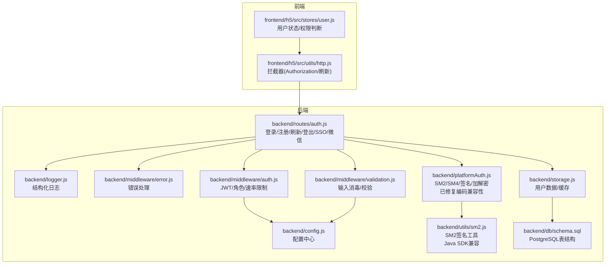
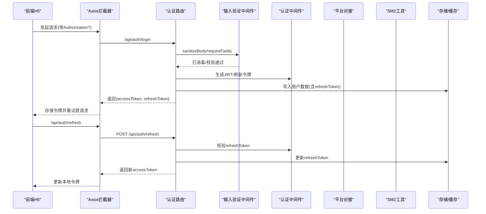
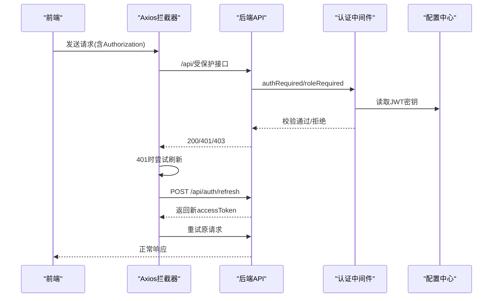
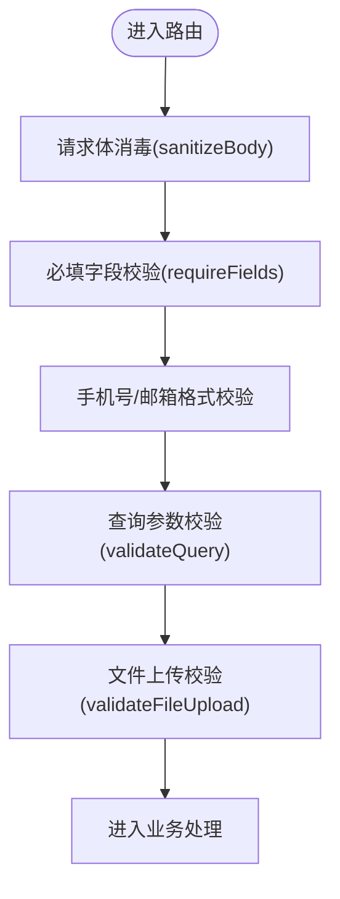
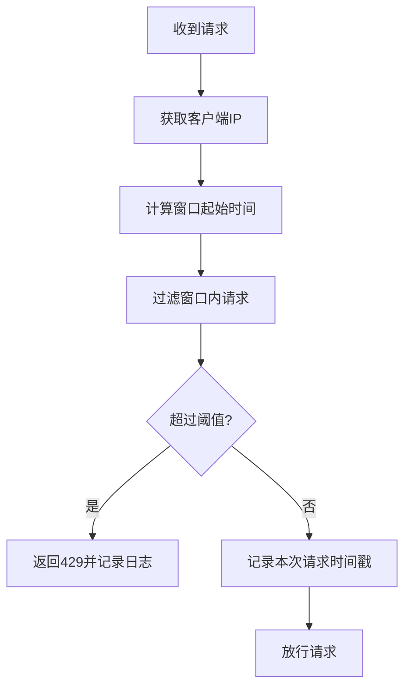
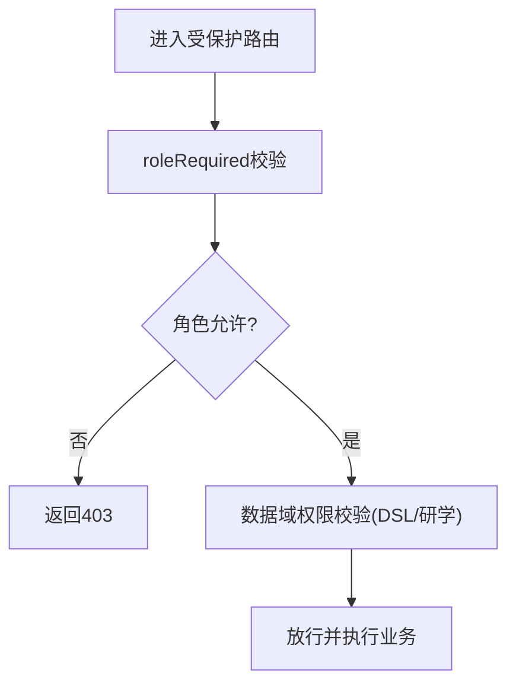
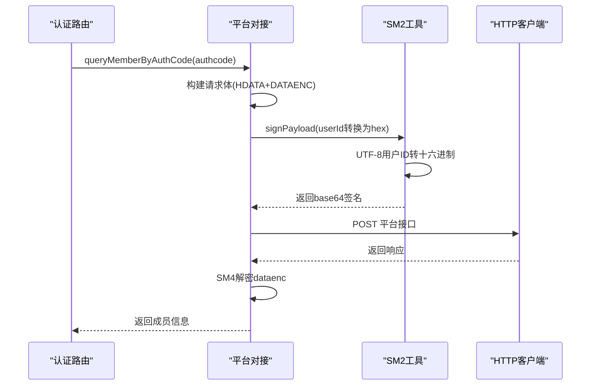
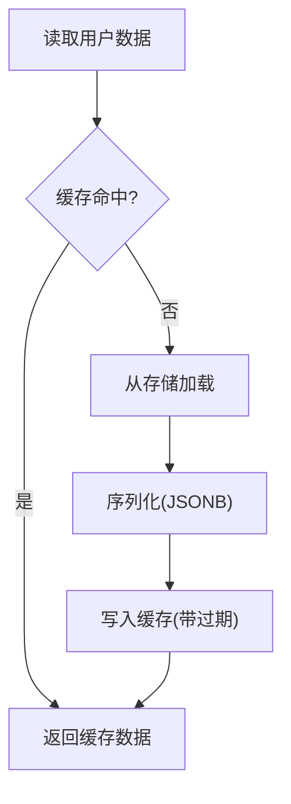
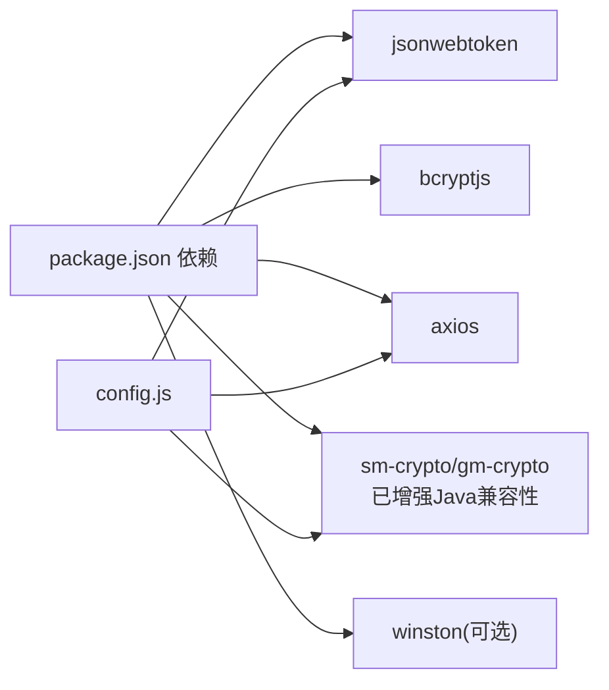

# 安全与权限

<cite>
**本文引用的文件**
- [backend/middleware/auth.js](file://backend/middleware/auth.js)
- [backend/middleware/validation.js](file://backend/middleware/validation.js)
- [backend/middleware/error.js](file://backend/middleware/error.js)
- [backend/routes/auth.js](file://backend/routes/auth.js)
- [backend/platformAuth.js](file://backend/platformAuth.js)
- [backend/utils/sm2.js](file://backend/utils/sm2.js)
- [backend/config.js](file://backend/config.js)
- [backend/storage.js](file://backend/storage.js)
- [backend/logger.js](file://backend/logger.js)
- [backend/db/schema.sql](file://backend/db/schema.sql)
- [backend/package.json](file://backend/package.json)
- [backend/QUICK_REFERENCE.md](file://backend/QUICK_REFERENCE.md)
- [backend/OPTIMIZATION_SUMMARY.md](file://backend/OPTIMIZATION_SUMMARY.md)
- [frontend/h5/src/utils/http.js](file://frontend/h5/src/utils/http.js)
- [frontend/h5/src/stores/user.js](file://frontend/h5/src/stores/user.js)
- [docs/接入文档/参考案例/测试类/JieYiHttpClient.java](file://docs/接入文档/参考案例/测试类/JieYiHttpClient.java)
</cite>

## 更新摘要
**变更内容**
- 新增SM2签名编码兼容性章节，详细说明UTF-8到十六进制转换的实现
- 更新平台对接与加密章节，反映SM2签名编码问题的修复
- 新增Java SDK兼容性说明，确保与Java后端系统的互操作性
- 更新安全配置示例，包含SM2密钥配置要求

## 目录
1. [简介](#简介)
2. [项目结构](#项目结构)
3. [核心组件](#核心组件)
4. [架构总览](#架构总览)
5. [详细组件分析](#详细组件分析)
6. [依赖关系分析](#依赖关系分析)
7. [性能考量](#性能考量)
8. [故障排查指南](#故障排查指南)
9. [结论](#结论)
10. [附录](#附录)

## 简介
本文件面向"低空飞行服务平台"的安全与权限系统，围绕认证与授权、输入验证、XSS/CSRF防护、速率限制、日志审计、漏洞防护与应急响应、合规与数据保护等方面进行系统化梳理，并结合后端中间件、路由、配置与前端状态管理的实际实现，给出可操作的最佳实践与排障指引。

**更新** 本版本重点增强了平台认证系统的安全性和与Java后端系统的兼容性，特别是解决了SM2签名编码问题，确保用户ID的UTF-8到十六进制正确转换。

## 项目结构
后端采用模块化中间件与路由分离的设计，安全相关能力主要分布在以下模块：
- 认证与权限中间件：负责 JWT 校验、角色校验、可选认证、速率限制
- 输入验证与消毒中间件：统一请求体消毒、参数校验、文件上传校验
- 错误处理中间件：统一错误响应、404、异步错误包装
- 认证路由：登录、注册、刷新、登出、SSO、微信登录等
- 平台对接：与畅行温州平台的 SM2/SM4 加解密与签名，现已解决编码兼容性问题
- 配置中心：集中管理 JWT、微信、SSO、数据库、上传、服务器等敏感配置
- 存储与缓存：用户数据读写、缓存键与过期策略
- 日志：结构化日志记录与请求/错误上下文
- 前端：Axios 拦截器自动注入 Authorization，Pinia 管理用户态与权限

**图表来源**
- [backend/routes/auth.js:1-591](file://backend/routes/auth.js#L1-L591)
- [backend/middleware/auth.js:1-168](file://backend/middleware/auth.js#L1-L168)
- [backend/middleware/validation.js:1-192](file://backend/middleware/validation.js#L1-L192)
- [backend/middleware/error.js:1-90](file://backend/middleware/error.js#L1-L90)
- [backend/platformAuth.js:1-177](file://backend/platformAuth.js#L1-L177)
- [backend/utils/sm2.js:1-190](file://backend/utils/sm2.js#L1-L190)
- [backend/storage.js:1-197](file://backend/storage.js#L1-L197)
- [backend/config.js:1-123](file://backend/config.js#L1-L123)
- [backend/logger.js:1-104](file://backend/logger.js#L1-L104)
- [backend/db/schema.sql:1-10](file://backend/db/schema.sql#L1-L10)
- [frontend/h5/src/utils/http.js:1-99](file://frontend/h5/src/utils/http.js#L1-L99)
- [frontend/h5/src/stores/user.js:1-177](file://frontend/h5/src/stores/user.js#L1-L177)

**章节来源**
- [backend/routes/auth.js:1-591](file://backend/routes/auth.js#L1-L591)
- [backend/middleware/auth.js:1-168](file://backend/middleware/auth.js#L1-L168)
- [backend/middleware/validation.js:1-192](file://backend/middleware/validation.js#L1-L192)
- [backend/middleware/error.js:1-90](file://backend/middleware/error.js#L1-L90)
- [backend/platformAuth.js:1-177](file://backend/platformAuth.js#L1-L177)
- [backend/utils/sm2.js:1-190](file://backend/utils/sm2.js#L1-L190)
- [backend/storage.js:1-197](file://backend/storage.js#L1-L197)
- [backend/config.js:1-123](file://backend/config.js#L1-L123)
- [backend/logger.js:1-104](file://backend/logger.js#L1-L104)
- [backend/db/schema.sql:1-10](file://backend/db/schema.sql#L1-L10)
- [frontend/h5/src/utils/http.js:1-99](file://frontend/h5/src/utils/http.js#L1-L99)
- [frontend/h5/src/stores/user.js:1-177](file://frontend/h5/src/stores/user.js#L1-L177)

## 核心组件
- JWT 安全与认证
  - 后端使用对称密钥签发访问令牌与刷新令牌；前端通过 Axios 拦截器自动注入 Authorization 头；支持刷新令牌轮换与过期校验
- 输入验证与 XSS 防护
  - 统一请求体消毒，移除脚本标签、事件属性、javascript 协议；必填字段与查询参数校验；文件上传类型与大小限制
- 速率限制
  - 基于内存 Map 的滑动窗口限流，针对登录/注册接口进行差异化限制
- 权限控制
  - 角色中间件按角色放行；后端对 DSL/研学管理员的数据域进行隔离；前端基于角色渲染菜单与路由守卫
- 平台对接与加密
  - **已增强** SM2/SM4 加解密与签名，现已解决UTF-8用户ID到十六进制的编码转换问题，确保与Java后端系统的完全兼容
- 日志与审计
  - 结构化日志记录请求与错误上下文，便于审计与排障
- 存储与缓存
  - 用户数据缓存与失效策略，支持 JSON 文件与 PostgreSQL 两种后端

**更新** 平台对接模块现已修复SM2签名编码兼容性问题，确保与Java SDK的完全互操作。

**章节来源**
- [backend/middleware/auth.js:11-168](file://backend/middleware/auth.js#L11-L168)
- [backend/middleware/validation.js:9-192](file://backend/middleware/validation.js#L9-L192)
- [backend/routes/auth.js:25-294](file://backend/routes/auth.js#L25-L294)
- [backend/platformAuth.js:66-163](file://backend/platformAuth.js#L66-L163)
- [backend/utils/sm2.js:138-156](file://backend/utils/sm2.js#L138-L156)
- [backend/storage.js:134-197](file://backend/storage.js#L134-L197)
- [backend/logger.js:26-94](file://backend/logger.js#L26-L94)

## 架构总览
下图展示认证与权限的关键交互流程：前端发起登录/注册/刷新请求，后端进行输入消毒与参数校验，JWT 验证与角色校验，SSO/微信登录对接平台接口，最终返回受保护资源。

**图表来源**
- [frontend/h5/src/utils/http.js:19-78](file://frontend/h5/src/utils/http.js#L19-L78)
- [backend/routes/auth.js:96-294](file://backend/routes/auth.js#L96-L294)
- [backend/middleware/validation.js:52-98](file://backend/middleware/validation.js#L52-L98)
- [backend/middleware/auth.js:11-45](file://backend/middleware/auth.js#L11-L45)
- [backend/storage.js:139-142](file://backend/storage.js#L139-L142)

## 详细组件分析

### JWT 安全与认证机制
- 令牌签发与解析
  - 访问令牌与刷新令牌分别签发，访问令牌较短有效期，刷新令牌较长有效期；刷新时校验令牌类型与用户存在性
- 前端自动注入与刷新
  - Axios 拦截器自动附加 Bearer Token；401 时触发刷新流程，成功后重试原请求
- 令牌存储与安全
  - 前端使用本地存储保存令牌；建议生产环境考虑 HttpOnly Cookie 或更安全的存储方案
- 后端中间件
  - 必需认证、可选认证、角色校验、速率限制；对过期与无效令牌进行明确区分

**图表来源**
- [frontend/h5/src/utils/http.js:19-78](file://frontend/h5/src/utils/http.js#L19-L78)
- [backend/middleware/auth.js:11-75](file://backend/middleware/auth.js#L11-L75)
- [backend/config.js:10-14](file://backend/config.js#L10-L14)

**章节来源**
- [backend/routes/auth.js:49-73](file://backend/routes/auth.js#L49-L73)
- [backend/middleware/auth.js:11-75](file://backend/middleware/auth.js#L11-L75)
- [frontend/h5/src/utils/http.js:19-78](file://frontend/h5/src/utils/http.js#L19-L78)

### 输入验证与 XSS 防护
- 请求体消毒
  - 移除 script 标签、事件属性、javascript 协议；对字符串字段递归消毒
- 参数校验
  - 必填字段校验、手机号/邮箱格式校验、查询参数类型/范围/枚举校验
- 文件上传校验
  - 限定 MIME 类型与大小，避免恶意文件上传
- 效果
  - 有效降低 XSS 与注入风险，统一错误响应，提升接口健壮性

**图表来源**
- [backend/middleware/validation.js:52-180](file://backend/middleware/validation.js#L52-L180)

**章节来源**
- [backend/middleware/validation.js:9-192](file://backend/middleware/validation.js#L9-L192)

### CSRF 防护
- 当前实现要点
  - 未发现显式的 CSRF Token 机制或 SameSite Cookie 设置
- 建议
  - 对于基于浏览器的 Web 应用，建议启用 SameSite Cookie、CSRF Token 校验或双重提交 Cookie 等机制
  - 若为移动端/H5 场景，建议配合后端白名单与来源校验

[本节为通用建议，不直接分析具体文件，故无"章节来源"]

### 速率限制
- 实现方式
  - 基于 Map 的滑动窗口计数，按 IP 维度统计请求时间戳，超限返回 429
- 配置
  - 登录接口默认每 15 分钟最多 20 次；注册接口默认每 15 分钟最多 10 次
- 维护
  - 定时清理过期数据，避免内存泄漏

**图表来源**
- [backend/middleware/auth.js:108-160](file://backend/middleware/auth.js#L108-L160)

**章节来源**
- [backend/middleware/auth.js:108-160](file://backend/middleware/auth.js#L108-L160)

### 权限控制（角色/资源/操作/数据）
- 角色权限
  - 支持 admin、dsl_admin、study_admin 等角色；后端通过 roleRequired 中间件校验
- 资源与操作权限
  - 路由层与业务层结合，对敏感操作进行角色限制
- 数据权限
  - DSL/研学管理员仅能访问特定 serviceId 的数据；前端根据角色渲染菜单与路由守卫
- 前端状态与鉴权
  - Pinia Store 维护用户态与权限判断，统一在组件中使用

**图表来源**
- [backend/middleware/auth.js:50-75](file://backend/middleware/auth.js#L50-L75)
- [frontend/h5/src/stores/user.js:18-35](file://frontend/h5/src/stores/user.js#L18-L35)

**章节来源**
- [backend/middleware/auth.js:50-75](file://backend/middleware/auth.js#L50-L75)
- [frontend/h5/src/stores/user.js:18-35](file://frontend/h5/src/stores/user.js#L18-L35)

### 平台对接与加密（SSO）- 已增强
- 加密与签名
  - SM4 对称加密（ECB 模式），SM2 数字签名；对请求体与数据进行加解密与签名
- **关键安全改进** UTF-8到十六进制编码转换
  - **已修复**：Java 端使用 `joininstidStr.getBytes("utf-8")` 获取用户ID字节，sm-crypto 期望 userId 为 hex 格式，因此需要将 UTF-8 字符串转为 hex
  - 使用 `Buffer.from(userId, 'utf8').toString('hex')` 确保与Java SDK完全兼容
- 参数构建
  - 时间戳、流水号、机构号、渠道号等字段按规范拼接并签名
- 错误处理
  - 对平台返回的错误码进行解析与抛错，避免泄露内部细节

**图表来源**
- [backend/routes/auth.js:322-392](file://backend/routes/auth.js#L322-L392)
- [backend/platformAuth.js:71-90](file://backend/platformAuth.js#L71-L90)
- [backend/utils/sm2.js:138-156](file://backend/utils/sm2.js#L138-L156)

**章节来源**
- [backend/platformAuth.js:66-163](file://backend/platformAuth.js#L66-L163)
- [backend/utils/sm2.js:138-156](file://backend/utils/sm2.js#L138-L156)
- [backend/routes/auth.js:322-392](file://backend/routes/auth.js#L322-L392)

### SM2签名编码兼容性详解
- **问题背景**
  - Java SDK 使用 `getBytes("utf-8")` 获取用户ID字节，而JavaScript默认使用UTF-8字符串
  - sm-crypto库期望userId为十六进制格式，而非原始UTF-8字符串
- **解决方案**
  - 在签名前将用户ID从UTF-8字符串转换为十六进制格式
  - 使用 `Buffer.from(userId, 'utf8').toString('hex')` 进行转换
  - 确保与Java SDK的 `SM2Utils.sign(joininstidStr.getBytes("utf-8"), ...)` 完全兼容
- **实现细节**
  - `signForJavaSDK` 函数专门处理Java SDK兼容性
  - 支持DER和r||s格式签名，满足不同Java SDK版本需求
  - 提供完整的日志记录，便于调试和问题排查

**章节来源**
- [backend/platformAuth.js:80-86](file://backend/platformAuth.js#L80-L86)
- [backend/utils/sm2.js:138-156](file://backend/utils/sm2.js#L138-L156)
- [docs/接入文档/参考案例/测试类/JieYiHttpClient.java:99-101](file://docs/接入文档/参考案例/测试类/JieYiHttpClient.java#L99-L101)

### 存储与缓存
- 用户数据缓存
  - 读取时使用缓存，写入时清除对应缓存键；不同数据设置不同过期时间
- 存储后端
  - 支持 JSON 文件与 PostgreSQL；PostgreSQL 使用 json_store 表存储 JSONB 数据

**图表来源**
- [backend/storage.js:134-142](file://backend/storage.js#L134-L142)
- [backend/db/schema.sql:1-10](file://backend/db/schema.sql#L1-L10)

**章节来源**
- [backend/storage.js:134-197](file://backend/storage.js#L134-L197)
- [backend/db/schema.sql:1-10](file://backend/db/schema.sql#L1-L10)

### 日志与审计
- 结构化日志
  - 记录请求方法、URL、状态码、耗时、IP、UA；错误记录堆栈与请求体片段
- 审计要点
  - 登录失败、权限拒绝、速率限制触发、刷新令牌失败等均记录日志，便于审计与追踪

**章节来源**
- [backend/logger.js:26-94](file://backend/logger.js#L26-L94)
- [backend/middleware/auth.js:126-130](file://backend/middleware/auth.js#L126-L130)
- [backend/routes/auth.js:111-116](file://backend/routes/auth.js#L111-L116)

## 依赖关系分析
- 关键依赖
  - jsonwebtoken：JWT 签发与校验
  - bcryptjs：密码哈希
  - axios：HTTP 客户端与平台对接
  - sm-crypto/gm-crypto：SM2/SM4 加解密与签名（现已支持Java SDK兼容性）
  - winston：日志（可选，项目内置简单实现）
- 配置与运行
  - 通过环境变量集中管理密钥、微信、SSO、数据库、上传、服务器等配置

**图表来源**
- [backend/package.json:12-28](file://backend/package.json#L12-L28)
- [backend/config.js:10-76](file://backend/config.js#L10-L76)

**章节来源**
- [backend/package.json:12-28](file://backend/package.json#L12-L28)
- [backend/config.js:10-76](file://backend/config.js#L10-L76)

## 性能考量
- 缓存策略
  - 用户/申请/案例/服务配置分别设置 60s/60s/5min/5min 缓存，显著降低 I/O
- 速率限制
  - 针对登录/注册接口进行差异化限流，防止暴力破解与滥用
- 日志开销
  - 结构化日志按级别输出，生产环境建议降低日志级别与频率

[本节提供一般性指导，不直接分析具体文件，故无"章节来源"]

## 故障排查指南
- 登录失败
  - 检查 .env 中 JWT_SECRET、管理员密码是否正确；确认密码强度与手机号格式；查看日志定位错误
- 401/403
  - 核对 Authorization 头是否正确；确认角色权限；检查刷新令牌是否过期
- 速率限制 429
  - 检查客户端是否重复请求；调整限流阈值或等待窗口期
- **SSO/微信登录异常**
  - **新增** 检查SM2签名编码转换是否正确；确认用户ID的UTF-8到十六进制转换；查看平台返回错误码
  - **新增** 验证Java SDK兼容性，确保签名格式符合预期
- 日志定位
  - 使用快速参考中的命令查看今日日志与错误日志

**更新** 新增了SM2签名编码问题的故障排查指导。

**章节来源**
- [backend/middleware/error.js:9-62](file://backend/middleware/error.js#L9-L62)
- [backend/QUICK_REFERENCE.md:100-111](file://backend/QUICK_REFERENCE.md#L100-L111)
- [backend/OPTIMIZATION_SUMMARY.md:414-423](file://backend/OPTIMIZATION_SUMMARY.md#L414-L423)

## 结论
本项目在认证、输入验证、XSS 防护、速率限制、权限隔离、日志审计等方面形成了较为完整的安全基线。**最新版本**特别增强了平台认证系统的安全性，通过解决SM2签名编码兼容性问题，确保与Java后端系统的完全互操作。建议在生产环境中进一步完善 CSRF 防护、HTTPS、密钥轮换与审计告警机制，持续优化缓存与数据库性能，并加强自动化测试与监控。

**更新** 本版本的结论特别强调了SM2签名编码兼容性的安全增强。

[本节为总结性内容，不直接分析具体文件，故无"章节来源"]

## 附录

### 安全配置示例与最佳实践
- JWT 密钥
  - 设置至少 32 字符的随机密钥；生产环境禁止使用默认值
- CORS 与来源校验
  - 明确允许的前端域名；避免通配符
- HTTPS
  - 生产环境强制启用 TLS
- 令牌存储
  - 前端建议使用更安全的存储方案；避免明文存储
- 密码策略
  - 强制最小长度与复杂度；定期轮换管理员密码
- 日志与审计
  - 保留必要的审计日志；限制日志文件权限
- **SM2密钥配置**
  - **新增** 确保SM2私钥和公钥正确配置；验证与Java SDK的兼容性

**更新** 新增了SM2密钥配置的安全要求。

**章节来源**
- [backend/config.js:78-104](file://backend/config.js#L78-L104)
- [backend/QUICK_REFERENCE.md:76-84](file://backend/QUICK_REFERENCE.md#L76-L84)

### 常见安全问题与解决方案
- XSS
  - 已通过请求体消毒与事件属性移除缓解；仍需在前端渲染时注意内容转义
- 注入攻击
  - 已通过参数校验与文件上传限制缓解；数据库层建议使用参数化查询（PG 已支持）
- 暴力破解
  - 已启用速率限制；建议结合验证码与账户锁定策略
- 权限绕过
  - 已实现角色与数据域隔离；建议增加审计日志与异常行为检测
- **SM2签名兼容性问题**
  - **新增** 已通过UTF-8到十六进制转换解决；确保与Java SDK完全兼容

**更新** 新增了SM2签名兼容性问题的解决方案。

**章节来源**
- [backend/middleware/validation.js:9-47](file://backend/middleware/validation.js#L9-L47)
- [backend/middleware/auth.js:108-160](file://backend/middleware/auth.js#L108-L160)

### 合规性与数据保护
- 数据最小化
  - 返回用户信息时进行敏感字段清理
- 数据传输安全
  - 建议启用 HTTPS；敏感字段使用加密存储
- 审计与追溯
  - 结构化日志记录关键操作；保留审计日志以便追溯
- **平台对接合规性**
  - **新增** 确保与Java SDK的完全兼容性；遵循第三方平台的安全规范

**更新** 新增了平台对接的合规性要求。

**章节来源**
- [backend/routes/auth.js:78-91](file://backend/routes/auth.js#L78-L91)
- [backend/logger.js:26-94](file://backend/logger.js#L26-L94)

### Java SDK兼容性技术规范
- **用户ID编码规范**
  - Java SDK使用 `getBytes("utf-8")` 获取用户ID字节
  - JavaScript端必须使用 `Buffer.from(userId, 'utf-8').toString('hex')` 转换
- **签名格式要求**
  - 支持DER和r||s两种格式
  - 与Java SDK的 `SM2Utils.sign()` 方法完全兼容
- **调试与验证**
  - 提供详细的日志记录，包括原始签名内容、SHA1摘要、十六进制转换后的用户ID
  - 支持双向兼容性验证，确保签名和验签的正确性

**新增** 专门的技术规范章节，详细说明Java SDK兼容性的实现细节。

**章节来源**
- [backend/platformAuth.js:80-86](file://backend/platformAuth.js#L80-L86)
- [backend/utils/sm2.js:138-156](file://backend/utils/sm2.js#L138-L156)
- [docs/接入文档/参考案例/测试类/JieYiHttpClient.java:99-101](file://docs/接入文档/参考案例/测试类/JieYiHttpClient.java#L99-L101)