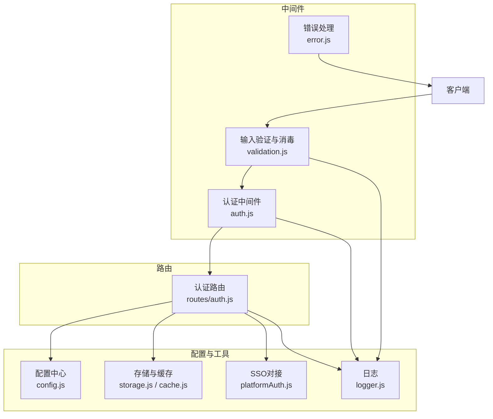
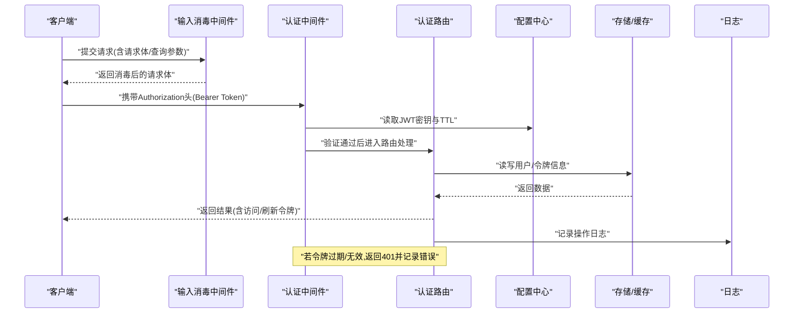
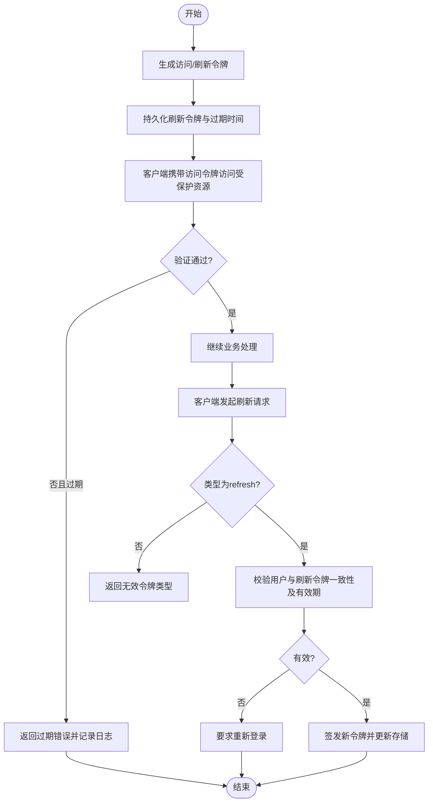
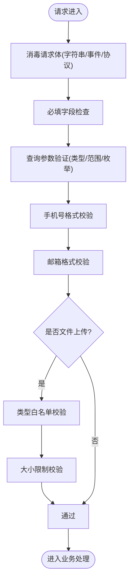
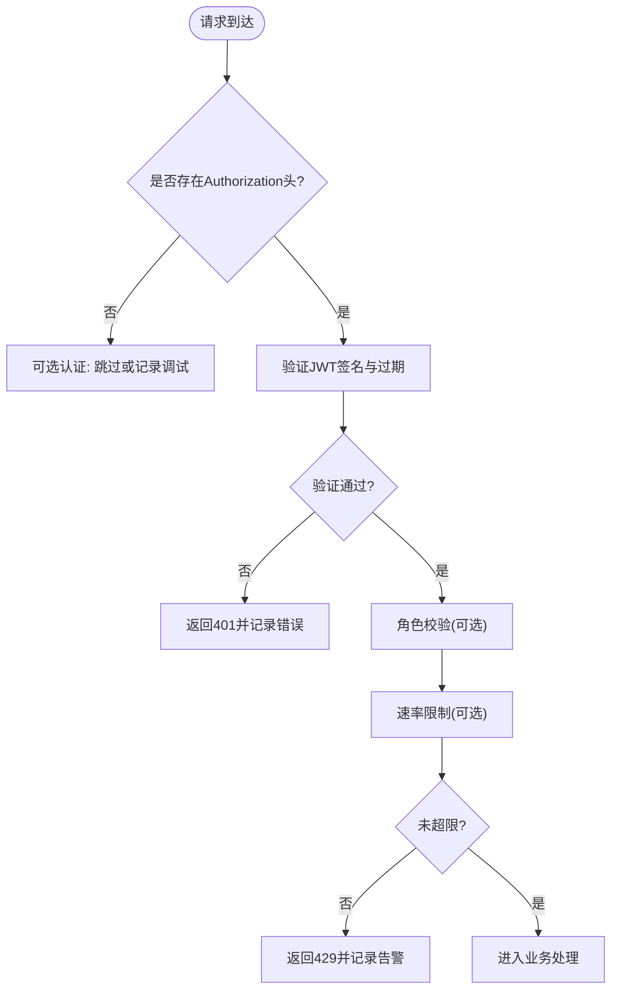
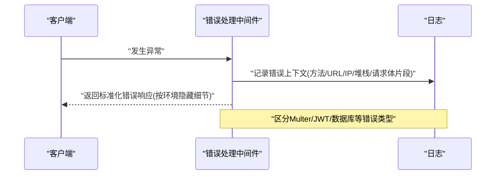
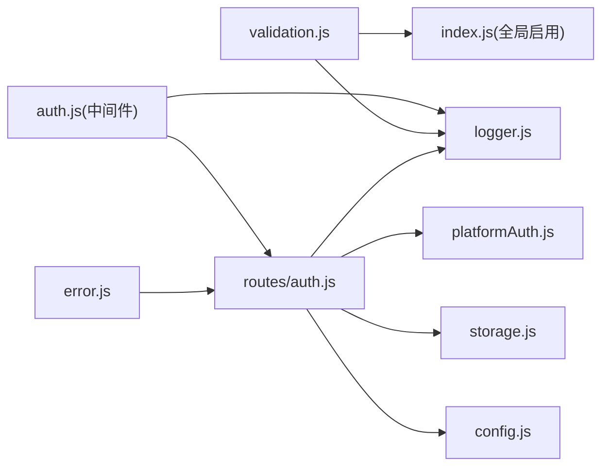

# 安全策略

<cite>
**本文引用的文件列表**
- [auth.js](file://backend/middleware/auth.js)
- [validation.js](file://backend/middleware/validation.js)
- [error.js](file://backend/middleware/error.js)
- [auth.js](file://backend/routes/auth.js)
- [config.js](file://backend/config.js)
- [logger.js](file://backend/logger.js)
- [storage.js](file://backend/storage.js)
- [platformAuth.js](file://backend/platformAuth.js)
- [index.js](file://backend/index.js)
- [cache.js](file://backend/cache.js)
</cite>

## 目录
1. [简介](#简介)
2. [项目结构](#项目结构)
3. [核心组件](#核心组件)
4. [架构总览](#架构总览)
5. [详细组件分析](#详细组件分析)
6. [依赖关系分析](#依赖关系分析)
7. [性能考量](#性能考量)
8. [故障排查指南](#故障排查指南)
9. [结论](#结论)
10. [附录](#附录)

## 简介
本文件面向低空飞行服务平台的安全策略，系统性阐述后端安全机制的设计与实现，重点覆盖：
- JWT 安全机制：令牌生成、验证、过期与刷新策略
- 输入验证与消毒中间件：XSS 脚本过滤、HTML 事件属性移除、javascript 协议防护、手机号/邮箱格式校验、必填字段检查、查询参数验证、文件上传类型与大小限制
- 安全配置与最佳实践：环境变量安全、默认密钥提示、生产环境校验
- 安全审计日志与异常处理：统一错误处理、请求上下文日志、敏感信息脱敏

## 项目结构
后端采用分层设计，安全相关能力主要集中在中间件、路由与配置模块：
- 中间件层：认证鉴权、输入消毒、错误处理、速率限制
- 路由层：认证相关接口（登录、注册、刷新、登出、SSO、微信登录等）
- 配置层：集中管理 JWT、上传、数据库、微信、服务器等敏感配置
- 工具层：日志、缓存、存储、平台对接（SSO）

图表来源
- [auth.js:1-168](file://backend/middleware/auth.js#L1-L168)
- [validation.js:1-192](file://backend/middleware/validation.js#L1-L192)
- [error.js:1-90](file://backend/middleware/error.js#L1-L90)
- [auth.js:1-591](file://backend/routes/auth.js#L1-L591)
- [config.js:1-123](file://backend/config.js#L1-L123)
- [logger.js:1-104](file://backend/logger.js#L1-L104)
- [storage.js:1-197](file://backend/storage.js#L1-L197)
- [platformAuth.js:1-177](file://backend/platformAuth.js#L1-L177)

章节来源
- [auth.js:1-168](file://backend/middleware/auth.js#L1-L168)
- [validation.js:1-192](file://backend/middleware/validation.js#L1-L192)
- [error.js:1-90](file://backend/middleware/error.js#L1-L90)
- [auth.js:1-591](file://backend/routes/auth.js#L1-L591)
- [config.js:1-123](file://backend/config.js#L1-L123)
- [logger.js:1-104](file://backend/logger.js#L1-L104)
- [storage.js:1-197](file://backend/storage.js#L1-L197)
- [platformAuth.js:1-177](file://backend/platformAuth.js#L1-L177)

## 核心组件
- 认证与权限中间件：提供强制认证、可选认证、角色校验、速率限制
- 输入验证与消毒中间件：对请求体进行 XSS 过滤、事件属性移除、javascript 协议清洗、手机号/邮箱格式校验、必填字段检查、查询参数校验、文件上传类型与大小限制
- 错误处理中间件：统一捕获异常、区分业务错误类型、记录上下文日志、按环境返回安全的错误信息
- JWT 安全机制：基于对称密钥签发访问令牌与刷新令牌，严格区分令牌类型与有效期，支持刷新与登出
- 安全配置中心：集中管理 JWT 密钥、上传限制、数据库与微信配置，并在生产环境进行安全校验
- 日志与审计：结构化日志记录请求与错误，隐藏敏感信息，便于审计与排障

章节来源
- [auth.js:1-168](file://backend/middleware/auth.js#L1-L168)
- [validation.js:1-192](file://backend/middleware/validation.js#L1-L192)
- [error.js:1-90](file://backend/middleware/error.js#L1-L90)
- [auth.js:1-591](file://backend/routes/auth.js#L1-L591)
- [config.js:1-123](file://backend/config.js#L1-L123)
- [logger.js:1-104](file://backend/logger.js#L1-L104)

## 架构总览
下图展示认证与安全相关的关键交互流程，涵盖 JWT 令牌生成与验证、输入消毒、错误处理与日志记录。

图表来源
- [auth.js:11-45](file://backend/middleware/auth.js#L11-L45)
- [validation.js:52-57](file://backend/middleware/validation.js#L52-L57)
- [auth.js:96-147](file://backend/routes/auth.js#L96-L147)
- [config.js:10-14](file://backend/config.js#L10-L14)
- [logger.js:76-94](file://backend/logger.js#L76-L94)

## 详细组件分析

### JWT 安全机制与令牌生命周期
- 令牌类型与用途
  - 访问令牌：短期有效，用于受保护资源访问
  - 刷新令牌：长期有效，仅用于换取新的访问令牌
- 令牌生成
  - 访问令牌：携带用户标识与角色，按配置的 TTL 生效
  - 刷新令牌：携带用户标识与固定类型标记，按配置的 TTL 生效
- 令牌验证
  - 强制认证中间件：要求 Authorization 头以 Bearer 开头，验证签名与过期时间
  - 刷新接口：严格校验令牌类型为 refresh，核对用户记录与过期时间
- 过期与刷新策略
  - 访问令牌过期：返回特定错误码，引导客户端重新登录或刷新
  - 刷新令牌过期：拒绝刷新请求，要求重新登录
  - 登出：清除用户记录中的刷新令牌，使旧令牌失效
- 安全要点
  - 严格区分令牌类型，防止混淆
  - 刷新令牌仅在服务端验证，不暴露给前端
  - 刷新时重新签发并更新存储，确保幂等与一致性

图表来源
- [auth.js:49-73](file://backend/routes/auth.js#L49-L73)
- [auth.js:230-294](file://backend/routes/auth.js#L230-L294)
- [auth.js:23-44](file://backend/middleware/auth.js#L23-L44)

章节来源
- [auth.js:49-73](file://backend/routes/auth.js#L49-L73)
- [auth.js:230-294](file://backend/routes/auth.js#L230-L294)
- [auth.js:23-44](file://backend/middleware/auth.js#L23-L44)
- [config.js:10-14](file://backend/config.js#L10-L14)

### 输入验证与消毒中间件
- XSS 与脚本过滤
  - 移除 script 标签及其内容
  - 移除 HTML 事件属性（如 onclick/onload 等）
  - 移除 javascript: 协议
- 对象递归消毒
  - 支持深层嵌套对象与数组的字符串字段消毒
- 查询参数验证
  - 必填校验、类型校验（数字）、范围校验（min/max）、长度校验、枚举校验
- 文件上传验证
  - 限定 MIME 类型白名单
  - 限制最大文件大小
- 手机号与邮箱格式校验
  - 手机号：中国手机号格式校验
  - 邮箱：基础邮箱格式校验
- 必填字段检查
  - 支持路径式字段提取（如嵌套对象）并判断空值

图表来源
- [validation.js:9-22](file://backend/middleware/validation.js#L9-L22)
- [validation.js:27-47](file://backend/middleware/validation.js#L27-L47)
- [validation.js:80-98](file://backend/middleware/validation.js#L80-L98)
- [validation.js:103-149](file://backend/middleware/validation.js#L103-L149)
- [validation.js:154-180](file://backend/middleware/validation.js#L154-L180)

章节来源
- [validation.js:9-22](file://backend/middleware/validation.js#L9-L22)
- [validation.js:27-47](file://backend/middleware/validation.js#L27-L47)
- [validation.js:62-74](file://backend/middleware/validation.js#L62-L74)
- [validation.js:80-98](file://backend/middleware/validation.js#L80-L98)
- [validation.js:103-149](file://backend/middleware/validation.js#L103-L149)
- [validation.js:154-180](file://backend/middleware/validation.js#L154-L180)

### 认证中间件与速率限制
- 强制认证：要求 Bearer 令牌，验证失败返回 401
- 角色校验：根据用户角色放行或返回 403
- 可选认证：存在令牌则验证，不存在则跳过，不阻断请求
- 速率限制：基于内存 Map 统计每 IP 的请求次数，窗口期清理，超限返回 429 并记录告警

图表来源
- [auth.js:11-45](file://backend/middleware/auth.js#L11-L45)
- [auth.js:50-75](file://backend/middleware/auth.js#L50-L75)
- [auth.js:80-101](file://backend/middleware/auth.js#L80-L101)
- [auth.js:108-143](file://backend/middleware/auth.js#L108-L143)

章节来源
- [auth.js:11-45](file://backend/middleware/auth.js#L11-L45)
- [auth.js:50-75](file://backend/middleware/auth.js#L50-L75)
- [auth.js:80-101](file://backend/middleware/auth.js#L80-L101)
- [auth.js:108-143](file://backend/middleware/auth.js#L108-L143)

### 错误处理与审计日志
- 全局错误处理：记录错误上下文（方法、URL、IP、堆栈、请求体片段），区分业务错误类型（文件大小、令牌错误、数据库约束等），按环境决定是否返回详细信息
- 404 处理：统一返回接口不存在，并记录请求路径
- 异步错误包装：避免 try-catch 嵌套，统一捕获 Promise 异常
- 结构化日志：包含时间戳、级别、消息与元数据；请求日志记录状态码、耗时、UA、IP；错误日志包含堆栈与请求体摘要

图表来源
- [error.js:9-62](file://backend/middleware/error.js#L9-L62)
- [logger.js:76-94](file://backend/logger.js#L76-L94)

章节来源
- [error.js:9-62](file://backend/middleware/error.js#L9-L62)
- [logger.js:76-94](file://backend/logger.js#L76-L94)

### 安全配置与最佳实践
- JWT 密钥与 TTL：从环境变量读取，生产环境要求密钥长度≥32字符，否则抛错
- 上传配置：目录、最大大小、允许的 MIME 类型
- 微信配置：小程序与公众号 AppId/Secret
- 数据库配置：PostgreSQL 开关、连接参数、SSL
- 服务器配置：端口、环境、CORS 源、前后端地址
- 最佳实践
  - 生产环境务必设置强随机密钥
  - 限制上传类型与大小，避免恶意文件
  - 在反向代理层开启 HTTPS 与安全头
  - 定期轮换密钥并迁移旧令牌

章节来源
- [config.js:78-104](file://backend/config.js#L78-L104)
- [config.js:55-76](file://backend/config.js#L55-L76)

### SSO 与第三方登录安全
- SSO 接口：基于 SM2/SM4 加解密与签名，请求体构建与校验，响应解密与结果判定
- 微信登录：小程序 code→session、公众号授权流程、回调处理与用户创建/更新
- 安全要点
  - 严格校验平台返回码与结果码
  - 敏感参数仅在服务端处理，不透传到前端
  - 微信回调重定向时避免泄露敏感信息

章节来源
- [platformAuth.js:165-172](file://backend/platformAuth.js#L165-L172)
- [auth.js:322-392](file://backend/routes/auth.js#L322-L392)
- [auth.js:427-508](file://backend/routes/auth.js#L427-L508)
- [auth.js:513-588](file://backend/routes/auth.js#L513-L588)

## 依赖关系分析
- 认证路由依赖认证中间件与配置中心，读写用户存储，调用 SSO 对接
- 输入消毒中间件在应用启动时全局启用，影响所有路由
- 错误处理中间件位于路由之后，统一捕获异常并记录日志
- 存储模块提供用户与业务数据的读写，配合缓存模块降低文件 IO

图表来源
- [index.js:18-81](file://backend/index.js#L18-L81)
- [auth.js:1-168](file://backend/middleware/auth.js#L1-L168)
- [validation.js:1-192](file://backend/middleware/validation.js#L1-L192)
- [error.js:1-90](file://backend/middleware/error.js#L1-L90)
- [auth.js:1-591](file://backend/routes/auth.js#L1-L591)
- [config.js:1-123](file://backend/config.js#L1-L123)
- [storage.js:1-197](file://backend/storage.js#L1-L197)
- [platformAuth.js:1-177](file://backend/platformAuth.js#L1-L177)
- [logger.js:1-104](file://backend/logger.js#L1-L104)

章节来源
- [index.js:18-81](file://backend/index.js#L18-L81)
- [auth.js:1-168](file://backend/middleware/auth.js#L1-L168)
- [validation.js:1-192](file://backend/middleware/validation.js#L1-L192)
- [error.js:1-90](file://backend/middleware/error.js#L1-L90)
- [auth.js:1-591](file://backend/routes/auth.js#L1-L591)
- [config.js:1-123](file://backend/config.js#L1-L123)
- [storage.js:1-197](file://backend/storage.js#L1-L197)
- [platformAuth.js:1-177](file://backend/platformAuth.js#L1-L177)
- [logger.js:1-104](file://backend/logger.js#L1-L104)

## 性能考量
- 缓存策略：用户数据与部分配置使用内存缓存，降低 JSON 文件读写开销
- 速率限制：基于内存 Map 的简单实现，定期清理过期请求记录
- 日志：结构化输出，避免大体积请求体完整打印，仅截断摘要
- 建议
  - 在高并发场景考虑引入 Redis 缓存与分布式速率限制
  - 对日志文件进行滚动与压缩，避免磁盘膨胀

章节来源
- [cache.js:1-119](file://backend/cache.js#L1-L119)
- [auth.js:108-160](file://backend/middleware/auth.js#L108-L160)
- [logger.js:26-56](file://backend/logger.js#L26-L56)

## 故障排查指南
- 401 未认证/令牌过期
  - 检查 Authorization 头是否为 Bearer 令牌
  - 核对 JWT 密钥与 TTL 配置
  - 若提示令牌过期，引导客户端使用刷新接口
- 403 权限不足
  - 检查用户角色与路由所需角色匹配
- 400 参数/文件错误
  - 参数验证失败：检查必填字段、类型、范围、枚举
  - 文件上传失败：确认类型与大小限制
- 429 请求过于频繁
  - 检查速率限制配置与客户端重试策略
- 500 服务器错误
  - 查看日志中的堆栈与请求上下文，定位具体异常

章节来源
- [error.js:9-62](file://backend/middleware/error.js#L9-L62)
- [validation.js:103-149](file://backend/middleware/validation.js#L103-L149)
- [validation.js:154-180](file://backend/middleware/validation.js#L154-L180)
- [auth.js:108-143](file://backend/middleware/auth.js#L108-L143)

## 结论
本项目在安全方面建立了较为完善的基础设施：
- 通过严格的 JWT 令牌生命周期管理与刷新策略，保障会话安全
- 通过输入消毒与参数校验，有效降低 XSS、注入与参数滥用风险
- 通过统一错误处理与结构化日志，提升可观测性与审计能力
- 通过集中配置与生产环境校验，降低密钥与配置泄露风险
建议在后续迭代中引入更健壮的速率限制与缓存方案，并持续完善安全监控与应急响应机制。

## 附录
- 安全配置示例（环境变量）
  - JWT_SECRET：生产环境必须≥32字符
  - ACCESS_TOKEN_TTL/REFRESH_TOKEN_TTL：按需配置
  - MAX_FILE_SIZE：单位字节
  - ALLOWED_FILE_TYPES：逗号分隔的 MIME 类型
  - WX_APPID/WX_SECRET/WX_MP_APPID/WX_MP_SECRET：微信登录配置
  - SSO_API_URL/SSO_API_KEY：SSO 接口配置
- 常见威胁与防护
  - XSS：输入消毒、事件属性移除、javascript 协议过滤
  - 注入攻击：参数类型与范围校验、数据库约束
  - 令牌滥用：严格区分令牌类型、过期与刷新策略
  - 恶意文件：类型白名单与大小限制
  - 频繁请求：速率限制与告警