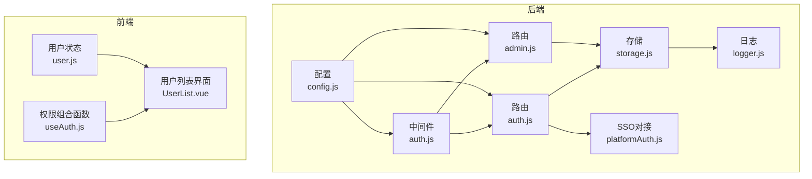
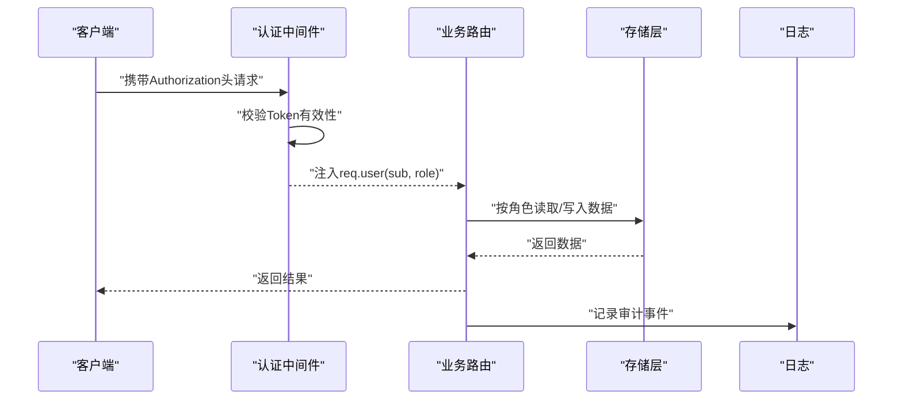
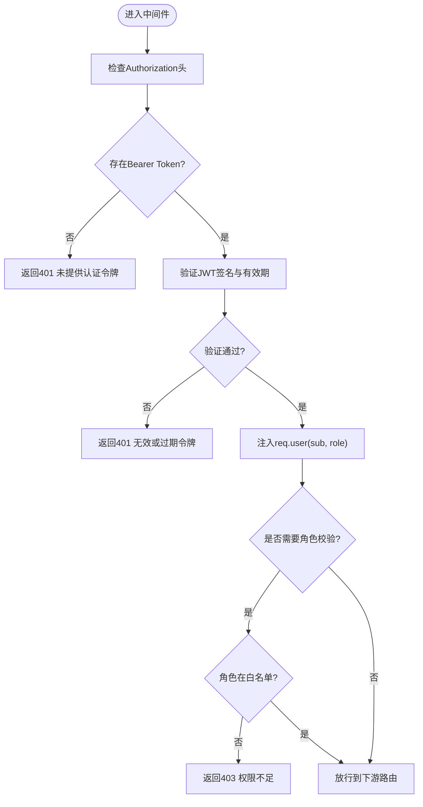
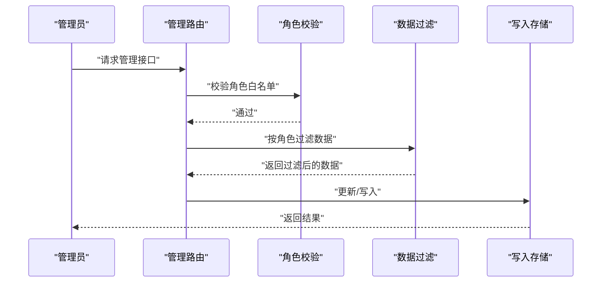
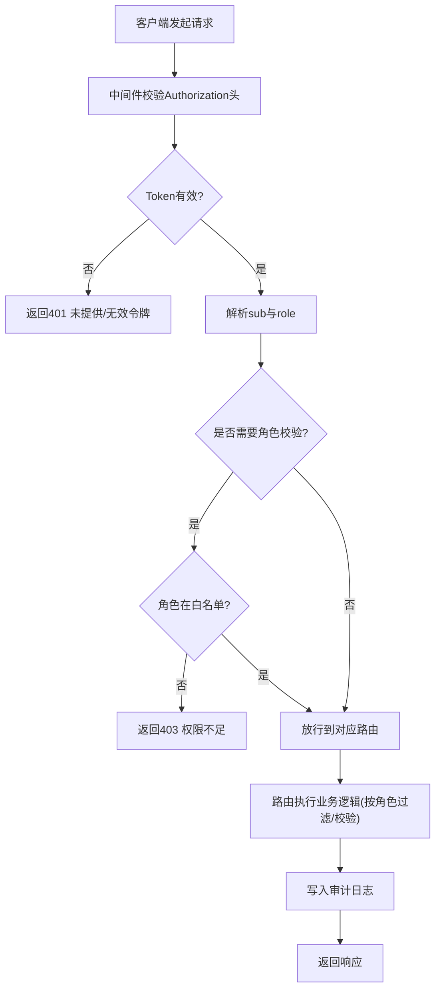
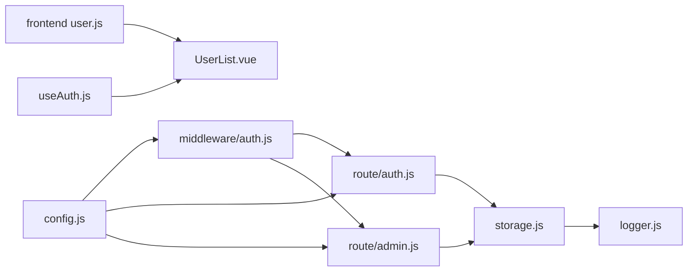

# 权限控制

<cite>
**本文引用的文件**
- [backend/middleware/auth.js](file://backend/middleware/auth.js)
- [backend/route/admin.js](file://backend/route/admin.js)
- [backend/route/auth.js](file://backend/route/auth.js)
- [backend/config.js](file://backend/config.js)
- [backend/storage.js](file://backend/storage.js)
- [backend/logger.js](file://backend/logger.js)
- [backend/platformAuth.js](file://backend/platformAuth.js)
- [frontend/h5/src/stores/user.js](file://frontend/h5/src/stores/user.js)
- [frontend/h5/src/views/admin/composables/useAuth.js](file://frontend/h5/src/views/admin/composables/useAuth.js)
- [frontend/h5/src/views/admin/users/UserList.vue](file://frontend/h5/src/views/admin/users/UserList.vue)
</cite>

## 目录
1. [简介](#简介)
2. [项目结构](#项目结构)
3. [核心组件](#核心组件)
4. [架构总览](#架构总览)
5. [详细组件分析](#详细组件分析)
6. [依赖关系分析](#依赖关系分析)
7. [性能考量](#性能考量)
8. [故障排查指南](#故障排查指南)
9. [结论](#结论)
10. [附录](#附录)

## 简介
本文件面向低空飞行服务平台的权限控制系统，系统性梳理并说明角色权限设计、资源权限控制、操作权限管理与数据权限隔离的实现方式；解释JWT令牌中的权限信息解析、权限验证中间件、权限继承与覆盖机制；阐述管理员权限系统、菜单与按钮权限控制；并提供权限配置示例、权限验证流程图与常见问题排查方法，以及权限审计与异常访问监控机制。

## 项目结构
后端采用Express + 中间件 + 路由分层的权限控制架构，前端通过Pinia Store与组合式函数在UI层进行权限判定与菜单/按钮渲染控制。权限相关的关键位置如下：
- 后端中间件：认证与角色校验、可选认证、速率限制
- 后端路由：认证路由、管理路由（含按角色的数据隔离与操作权限）
- 配置中心：JWT密钥、管理员默认口令、微信与SSO配置
- 存储层：用户、申请、案例、服务配置、评价等数据的读写与缓存
- 前端：用户状态管理、权限组合函数、用户列表界面的权限切换逻辑

图表来源
- [backend/middleware/auth.js:1-168](file://backend/middleware/auth.js#L1-L168)
- [backend/route/auth.js:1-591](file://backend/route/auth.js#L1-L591)
- [backend/route/admin.js:1-514](file://backend/route/admin.js#L1-L514)
- [backend/config.js:1-123](file://backend/config.js#L1-L123)
- [backend/storage.js:1-197](file://backend/storage.js#L1-L197)
- [backend/logger.js:1-104](file://backend/logger.js#L1-L104)
- [backend/platformAuth.js:1-177](file://backend/platformAuth.js#L1-L177)
- [frontend/h5/src/stores/user.js:1-177](file://frontend/h5/src/stores/user.js#L1-L177)
- [frontend/h5/src/views/admin/composables/useAuth.js:1-45](file://frontend/h5/src/views/admin/composables/useAuth.js#L1-L45)
- [frontend/h5/src/views/admin/users/UserList.vue:1-120](file://frontend/h5/src/views/admin/users/UserList.vue#L1-L120)

章节来源
- [backend/middleware/auth.js:1-168](file://backend/middleware/auth.js#L1-L168)
- [backend/route/auth.js:1-591](file://backend/route/auth.js#L1-L591)
- [backend/route/admin.js:1-514](file://backend/route/admin.js#L1-L514)
- [backend/config.js:1-123](file://backend/config.js#L1-L123)
- [backend/storage.js:1-197](file://backend/storage.js#L1-L197)
- [backend/logger.js:1-104](file://backend/logger.js#L1-L104)
- [backend/platformAuth.js:1-177](file://backend/platformAuth.js#L1-L177)
- [frontend/h5/src/stores/user.js:1-177](file://frontend/h5/src/stores/user.js#L1-L177)
- [frontend/h5/src/views/admin/composables/useAuth.js:1-45](file://frontend/h5/src/views/admin/composables/useAuth.js#L1-L45)
- [frontend/h5/src/views/admin/users/UserList.vue:1-120](file://frontend/h5/src/views/admin/users/UserList.vue#L1-L120)

## 核心组件
- JWT认证与角色中间件：负责校验Authorization头中的Bearer Token，解析sub与role，并注入到req.user；支持可选认证与速率限制。
- 管理路由：对管理端接口进行统一认证；按角色进行数据隔离与操作权限控制；提供统计、申请管理、导出、服务配置、评价审核等功能。
- 认证路由：登录、注册、刷新令牌、登出、SSO验证、微信授权登录等；生成并下发JWT与刷新令牌。
- 配置中心：集中管理JWT密钥、管理员默认口令、微信与SSO配置、数据库与服务器参数。
- 存储层：封装用户、申请、案例、服务配置、评价等数据的读写与缓存；支持PostgreSQL与JSON文件两种存储后端。
- 日志模块：结构化日志记录，便于审计与异常追踪。
- 前端权限：Pinia Store与组合式函数在UI层进行角色判断与权限控制；用户列表界面支持超级管理员切换用户角色。

章节来源
- [backend/middleware/auth.js:11-101](file://backend/middleware/auth.js#L11-L101)
- [backend/route/admin.js:23-277](file://backend/route/admin.js#L23-L277)
- [backend/route/auth.js:96-392](file://backend/route/auth.js#L96-L392)
- [backend/config.js:8-76](file://backend/config.js#L8-L76)
- [backend/storage.js:134-181](file://backend/storage.js#L134-L181)
- [backend/logger.js:97-104](file://backend/logger.js#L97-L104)
- [frontend/h5/src/stores/user.js:7-35](file://frontend/h5/src/stores/user.js#L7-L35)
- [frontend/h5/src/views/admin/composables/useAuth.js:6-44](file://frontend/h5/src/views/admin/composables/useAuth.js#L6-L44)

## 架构总览
系统采用“中间件前置 + 路由细化”的权限控制架构。JWT令牌中包含用户标识与角色，中间件负责解析与校验；路由层根据角色执行数据隔离与操作权限控制；存储层提供统一的数据访问入口并内置缓存；前端通过状态管理与组合式函数在UI侧进行权限判定与渲染。

图表来源
- [backend/middleware/auth.js:11-45](file://backend/middleware/auth.js#L11-L45)
- [backend/route/admin.js:23-61](file://backend/route/admin.js#L23-L61)
- [backend/storage.js:134-181](file://backend/storage.js#L134-L181)
- [backend/logger.js:97-104](file://backend/logger.js#L97-L104)

## 详细组件分析

### 角色权限设计与权限矩阵
- 角色定义
  - user：普通用户，具备基础功能访问权限。
  - admin：平台管理员，可管理用户列表与通用数据。
  - dsl_admin：DSL服务管理员，仅能访问与操作指定服务ID的数据。
  - study_admin：研学服务管理员，仅能访问与操作指定服务ID的数据。
  - 超级管理员：手机号固定为特定值，拥有最高权限，不可被修改其角色。
- 权限矩阵（基于代码实现）
  - 管理员路由统一使用认证中间件；部分接口使用角色白名单校验。
  - dsl_admin与study_admin在统计、申请列表、导出、服务配置等接口中，按服务ID进行数据隔离。
  - 用户角色切换仅超级管理员可操作，且不可修改超级管理员自身角色。

章节来源
- [backend/route/admin.js:212-277](file://backend/route/admin.js#L212-L277)
- [backend/route/admin.js:39-43](file://backend/route/admin.js#L39-L43)
- [backend/route/admin.js:77-81](file://backend/route/admin.js#L77-L81)
- [backend/config.js:17-24](file://backend/config.js#L17-L24)

### JWT令牌中的权限信息解析与中间件实现
- 令牌结构：payload包含sub（用户ID）与role（角色），签发时设置过期时间。
- 中间件职责：
  - 必需认证：校验Authorization头，解析并验证JWT，失败时返回401。
  - 可选认证：若存在有效Token则注入用户信息，否则放行。
  - 角色校验：基于角色白名单进行访问控制。
  - 速率限制：基于内存Map按IP统计窗口内请求次数，超限返回429。
- 异常处理：过期令牌、无效签名、角色不符均返回相应错误码与日志。

图表来源
- [backend/middleware/auth.js:11-75](file://backend/middleware/auth.js#L11-L75)
- [backend/middleware/auth.js:108-143](file://backend/middleware/auth.js#L108-L143)

章节来源
- [backend/middleware/auth.js:11-101](file://backend/middleware/auth.js#L11-L101)
- [backend/middleware/auth.js:108-160](file://backend/middleware/auth.js#L108-L160)

### 管理员权限系统与数据权限隔离
- 管理员路由统一使用认证中间件；部分接口使用角色白名单校验（如用户列表仅admin可访问）。
- 数据权限隔离：
  - 统计接口：dsl_admin仅能看到指定服务ID的数据；study_admin同理。
  - 申请列表：按角色过滤服务ID；支持状态与服务ID筛选、排序与分页。
  - 申请状态更新：校验当前用户角色与目标申请的服务ID是否匹配。
  - 导出：按角色过滤后导出。
  - 服务配置：admin可修改全部；dsl_admin仅能修改指定服务；study_admin仅能修改指定服务。
- 超级管理员保护：不可修改超级管理员角色，防止越权。

图表来源
- [backend/route/admin.js:23-61](file://backend/route/admin.js#L23-L61)
- [backend/route/admin.js:116-166](file://backend/route/admin.js#L116-L166)
- [backend/route/admin.js:171-207](file://backend/route/admin.js#L171-L207)
- [backend/route/admin.js:282-357](file://backend/route/admin.js#L282-L357)

章节来源
- [backend/route/admin.js:23-277](file://backend/route/admin.js#L23-L277)

### 资源权限控制与操作权限管理
- API接口访问控制：所有管理接口统一认证；部分接口进一步角色白名单校验。
- CRUD与批量操作：
  - 申请状态更新：支持状态变更与备注更新。
  - 申请导出：支持Excel导出。
  - 用户角色切换：仅超级管理员可操作。
  - 服务配置更新：按角色限定可修改范围。
  - 评价审核与删除：支持通过/拒绝与删除。
- 批量操作：前端可选择多条记录进行导出等操作（示例见用户列表界面）。

章节来源
- [backend/route/admin.js:116-166](file://backend/route/admin.js#L116-L166)
- [backend/route/admin.js:171-207](file://backend/route/admin.js#L171-L207)
- [backend/route/admin.js:230-277](file://backend/route/admin.js#L230-L277)
- [backend/route/admin.js:310-357](file://backend/route/admin.js#L310-L357)
- [backend/route/admin.js:442-511](file://backend/route/admin.js#L442-L511)
- [frontend/h5/src/views/admin/users/UserList.vue:73-91](file://frontend/h5/src/views/admin/users/UserList.vue#L73-L91)

### 前端权限控制（菜单与按钮）
- Pinia Store：提供isLoggedIn、isAdmin、isDslAdmin、isStudyAdmin、canManage等计算属性，用于UI层权限判定。
- 组合式函数：useAuth在组件内提供用户角色与权限刷新能力。
- 用户列表界面：仅超级管理员可见“切换权限”按钮，且不可修改超级管理员自身角色。

章节来源
- [frontend/h5/src/stores/user.js:14-35](file://frontend/h5/src/stores/user.js#L14-L35)
- [frontend/h5/src/views/admin/composables/useAuth.js:6-44](file://frontend/h5/src/views/admin/composables/useAuth.js#L6-L44)
- [frontend/h5/src/views/admin/users/UserList.vue:73-91](file://frontend/h5/src/views/admin/users/UserList.vue#L73-L91)

### 权限继承与覆盖机制
- 角色继承：admin具备更广的权限集合，dsl_admin与study_admin分别继承各自服务域内的权限。
- 权限覆盖：超级管理员对所有角色具有最终覆盖权（不可修改自身角色）。
- 路由层覆盖：部分接口通过角色白名单强制覆盖默认权限策略。

章节来源
- [backend/route/admin.js:212-277](file://backend/route/admin.js#L212-L277)
- [backend/config.js:17-24](file://backend/config.js#L17-L24)

### 权限配置示例
- JWT配置：密钥、访问令牌与刷新令牌过期时间。
- 管理员配置：超级管理员手机号、默认口令（首次使用后应修改）。
- 微信与SSO配置：小程序与公众号AppId/Secret、SSO接口与密钥。
- 服务器与数据库：端口、环境、CORS、数据库连接参数。

章节来源
- [backend/config.js:8-76](file://backend/config.js#L8-L76)

### 权限验证流程图

图表来源
- [backend/middleware/auth.js:11-75](file://backend/middleware/auth.js#L11-L75)
- [backend/route/admin.js:23-61](file://backend/route/admin.js#L23-L61)
- [backend/logger.js:97-104](file://backend/logger.js#L97-L104)

## 依赖关系分析
- 中间件依赖配置中心提供的JWT密钥；路由依赖中间件与存储层；前端依赖后端接口与本地存储。
- 存储层同时支持JSON文件与PostgreSQL，具备缓存与双序列化兼容处理。
- 日志模块为全局审计提供统一出口。

图表来源
- [backend/config.js:8-76](file://backend/config.js#L8-L76)
- [backend/middleware/auth.js:1-168](file://backend/middleware/auth.js#L1-L168)
- [backend/route/auth.js:1-591](file://backend/route/auth.js#L1-L591)
- [backend/route/admin.js:1-514](file://backend/route/admin.js#L1-L514)
- [backend/storage.js:1-197](file://backend/storage.js#L1-L197)
- [backend/logger.js:1-104](file://backend/logger.js#L1-L104)
- [frontend/h5/src/stores/user.js:1-177](file://frontend/h5/src/stores/user.js#L1-L177)
- [frontend/h5/src/views/admin/composables/useAuth.js:1-45](file://frontend/h5/src/views/admin/composables/useAuth.js#L1-L45)
- [frontend/h5/src/views/admin/users/UserList.vue:1-120](file://frontend/h5/src/views/admin/users/UserList.vue#L1-L120)

章节来源
- [backend/config.js:8-76](file://backend/config.js#L8-L76)
- [backend/middleware/auth.js:1-168](file://backend/middleware/auth.js#L1-L168)
- [backend/route/auth.js:1-591](file://backend/route/auth.js#L1-L591)
- [backend/route/admin.js:1-514](file://backend/route/admin.js#L1-L514)
- [backend/storage.js:1-197](file://backend/storage.js#L1-L197)
- [backend/logger.js:1-104](file://backend/logger.js#L1-L104)
- [frontend/h5/src/stores/user.js:1-177](file://frontend/h5/src/stores/user.js#L1-L177)
- [frontend/h5/src/views/admin/composables/useAuth.js:1-45](file://frontend/h5/src/views/admin/composables/useAuth.js#L1-L45)
- [frontend/h5/src/views/admin/users/UserList.vue:1-120](file://frontend/h5/src/views/admin/users/UserList.vue#L1-L120)

## 性能考量
- 缓存策略：存储层对用户、申请、案例、服务配置、评价等数据设置不同TTL的缓存，减少重复读取与数据库压力。
- 速率限制：基于内存Map的简单限流，窗口为15分钟，默认最大请求次数为100次，超过返回429。
- 日志级别：生产环境建议提升日志级别以降低I/O开销。

章节来源
- [backend/storage.js:134-181](file://backend/storage.js#L134-L181)
- [backend/middleware/auth.js:108-160](file://backend/middleware/auth.js#L108-L160)
- [backend/config.js:106-116](file://backend/config.js#L106-L116)

## 故障排查指南
- 令牌相关
  - 401 未提供认证令牌：确认Authorization头格式为Bearer Token。
  - 401 令牌已过期：调用刷新接口获取新令牌。
  - 401 无效的认证令牌：检查JWT密钥与签名算法一致性。
- 角色相关
  - 403 权限不足：确认用户角色是否满足接口角色白名单；检查数据权限隔离逻辑（服务ID过滤）。
  - 超级管理员不可修改：确认手机号是否为超级管理员固定值。
- 速率限制
  - 429 请求过于频繁：检查客户端重试策略与服务端限流阈值。
- 日志审计
  - 使用日志模块记录的结构化信息定位异常请求与错误上下文。

章节来源
- [backend/middleware/auth.js:11-45](file://backend/middleware/auth.js#L11-L45)
- [backend/middleware/auth.js:50-75](file://backend/middleware/auth.js#L50-L75)
- [backend/middleware/auth.js:108-160](file://backend/middleware/auth.js#L108-L160)
- [backend/route/admin.js:133-145](file://backend/route/admin.js#L133-L145)
- [backend/logger.js:97-104](file://backend/logger.js#L97-L104)

## 结论
本权限控制系统以JWT为核心，结合中间件与路由层实现细粒度的角色权限与数据隔离；通过配置中心集中管理密钥与默认口令，前端在UI层进行权限判定与渲染；存储层提供缓存与双后端支持；日志模块为审计与异常追踪提供保障。整体架构清晰、职责分离明确，适合在低空飞行服务平台中稳定运行。

## 附录
- SSO对接：通过平台提供的SM2/SM4加解密与签名机制，实现与畅行温州平台的认证对接。
- 微信登录：支持H5网页授权与小程序登录，自动创建或查找用户并下发令牌。

章节来源
- [backend/platformAuth.js:165-172](file://backend/platformAuth.js#L165-L172)
- [backend/route/auth.js:322-392](file://backend/route/auth.js#L322-L392)
- [backend/route/auth.js:513-588](file://backend/route/auth.js#L513-L588)