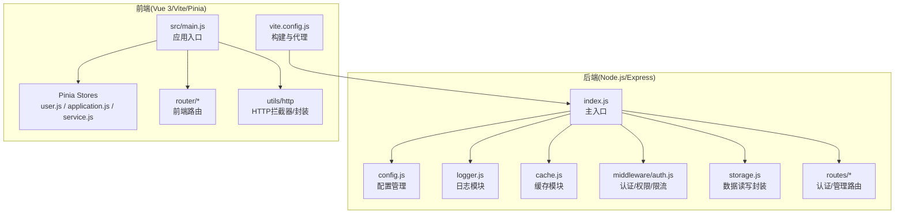
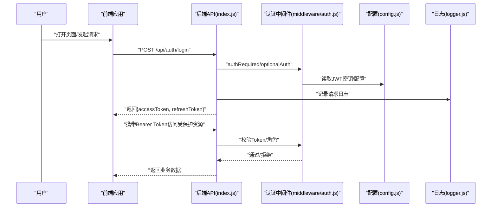
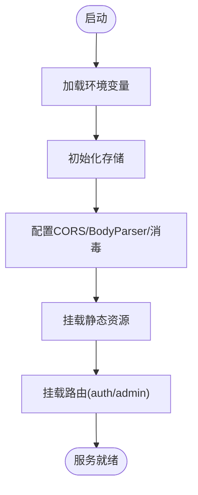
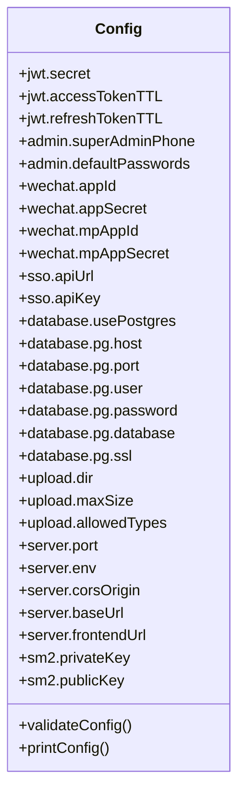
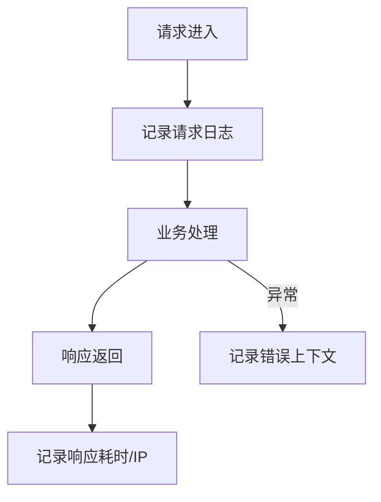
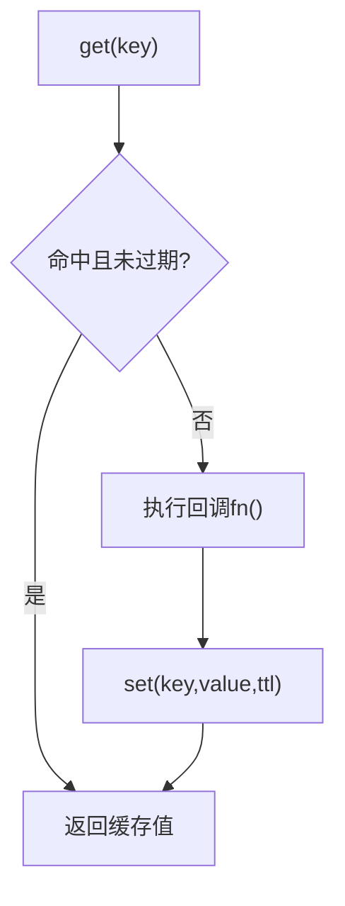
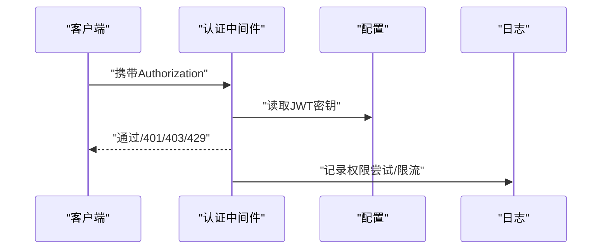
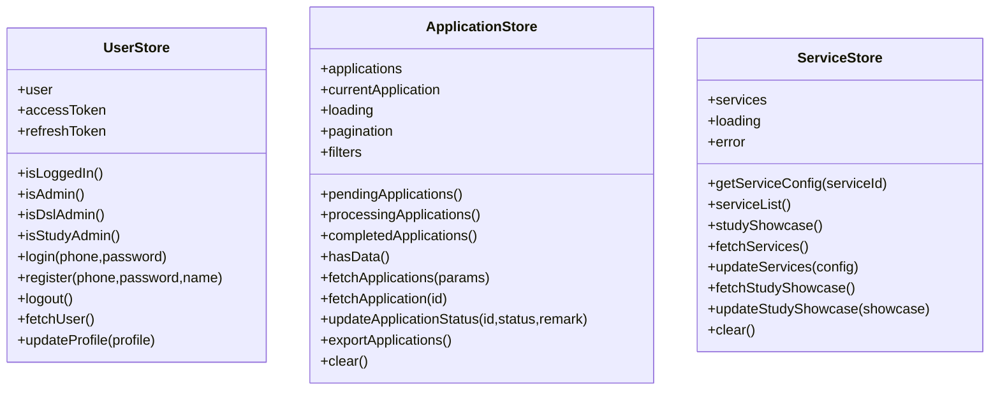
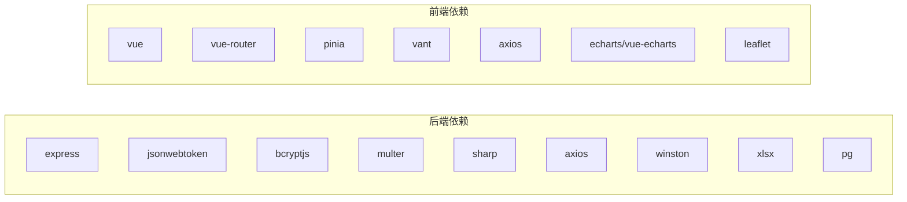

# 开发指南

<cite>
**本文引用的文件**
- [backend/package.json](file://backend/package.json)
- [frontend/h5/package.json](file://frontend/h5/package.json)
- [backend/OPTIMIZATION_SUMMARY.md](file://backend/OPTIMIZATION_SUMMARY.md)
- [backend/REFACTORING.md](file://backend/REFACTORING.md)
- [backend/QUICK_REFERENCE.md](file://backend/QUICK_REFERENCE.md)
- [backend/index.js](file://backend/index.js)
- [backend/config.js](file://backend/config.js)
- [backend/logger.js](file://backend/logger.js)
- [backend/cache.js](file://backend/cache.js)
- [backend/middleware/auth.js](file://backend/middleware/auth.js)
- [frontend/h5/src/main.js](file://frontend/h5/src/main.js)
- [frontend/h5/vite.config.js](file://frontend/h5/vite.config.js)
- [frontend/h5/src/stores/user.js](file://frontend/h5/src/stores/user.js)
- [frontend/h5/src/stores/application.js](file://frontend/h5/src/stores/application.js)
- [frontend/h5/src/stores/service.js](file://frontend/h5/src/stores/service.js)
</cite>

## 目录
1. [简介](#简介)
2. [项目结构](#项目结构)
3. [核心组件](#核心组件)
4. [架构总览](#架构总览)
5. [详细组件分析](#详细组件分析)
6. [依赖关系分析](#依赖关系分析)
7. [性能考虑](#性能考虑)
8. [故障排查指南](#故障排查指南)
9. [结论](#结论)
10. [附录](#附录)

## 简介
本开发指南面向低空飞行服务平台的开发者与贡献者，系统阐述开发规范、贡献流程、代码重构与性能优化策略、最佳实践以及质量保证流程。文档同时提供开发工具配置、调试技巧与测试策略，并说明如何参与开源贡献与社区协作。

## 项目结构
项目采用前后端分离架构，后端基于 Node.js/Express，前端基于 Vue 3 + Vite + Pinia。后端通过模块化中间件、路由与配置管理实现安全、可维护与高性能的服务；前端通过 Pinia 状态管理与组件化设计提升开发体验与可维护性。

**图表来源**
- [backend/index.js:1-1401](file://backend/index.js#L1-L1401)
- [backend/config.js:1-123](file://backend/config.js#L1-L123)
- [backend/logger.js:1-104](file://backend/logger.js#L1-L104)
- [backend/cache.js:1-119](file://backend/cache.js#L1-L119)
- [backend/middleware/auth.js:1-168](file://backend/middleware/auth.js#L1-L168)
- [frontend/h5/src/main.js:1-22](file://frontend/h5/src/main.js#L1-L22)
- [frontend/h5/vite.config.js:1-54](file://frontend/h5/vite.config.js#L1-L54)

**章节来源**
- [backend/package.json:1-34](file://backend/package.json#L1-L34)
- [frontend/h5/package.json:1-27](file://frontend/h5/package.json#L1-L27)
- [backend/OPTIMIZATION_SUMMARY.md:1-548](file://backend/OPTIMIZATION_SUMMARY.md#L1-L548)
- [backend/QUICK_REFERENCE.md:1-224](file://backend/QUICK_REFERENCE.md#L1-L224)

## 核心组件
- 配置管理：集中管理 JWT、管理员、微信、数据库、上传、服务器与 SM2 等配置，支持环境变量注入与校验。
- 日志模块：提供结构化日志记录，按日期切分文件，支持多级别输出与请求/错误上下文记录。
- 缓存模块：提供内存缓存与 TTL 管理，减少 I/O，提升响应速度。
- 认证与权限中间件：统一 JWT 校验、角色校验、可选认证与简单限流。
- 前端状态管理：基于 Pinia 的用户、申请、服务配置状态管理，支持持久化与派生状态。
- 构建与代理：Vite 提供开发服务器、代理与打包优化，支持安全响应头。

**章节来源**
- [backend/config.js:1-123](file://backend/config.js#L1-L123)
- [backend/logger.js:1-104](file://backend/logger.js#L1-L104)
- [backend/cache.js:1-119](file://backend/cache.js#L1-L119)
- [backend/middleware/auth.js:1-168](file://backend/middleware/auth.js#L1-L168)
- [frontend/h5/src/stores/user.js:1-177](file://frontend/h5/src/stores/user.js#L1-L177)
- [frontend/h5/src/stores/application.js:1-177](file://frontend/h5/src/stores/application.js#L1-L177)
- [frontend/h5/src/stores/service.js:1-164](file://frontend/h5/src/stores/service.js#L1-L164)
- [frontend/h5/vite.config.js:1-54](file://frontend/h5/vite.config.js#L1-L54)

## 架构总览
后端通过 Express 提供 REST API，使用中间件实现认证、权限与输入消毒；前端通过 Vite 开发，使用 Pinia 管理状态并通过 axios 发起请求。系统强调安全性（JWT、XSS 防护、速率限制）、可维护性（模块化、日志、错误处理）与性能（缓存、图片压缩、CDN 友好）。

**图表来源**
- [backend/index.js:434-476](file://backend/index.js#L434-L476)
- [backend/middleware/auth.js:11-45](file://backend/middleware/auth.js#L11-L45)
- [backend/config.js:10-14](file://backend/config.js#L10-L14)
- [backend/logger.js:75-83](file://backend/logger.js#L75-L83)

## 详细组件分析

### 后端主入口与路由组织
- 主入口负责加载环境变量、初始化存储、配置 CORS、中间件与静态资源，并挂载认证与管理路由。
- 提供登录、注册、SSO、微信登录、刷新与登出等认证相关接口。
- 提供图片压缩、文件上传、客户端IP识别、游戏分配等辅助能力。

**图表来源**
- [backend/index.js:1-800](file://backend/index.js#L1-L800)

**章节来源**
- [backend/index.js:1-800](file://backend/index.js#L1-L800)

### 配置管理模块
- 统一管理 JWT、管理员、微信、SSO、数据库、上传、服务器与 SM2 等配置。
- 提供配置校验与打印，确保生产环境安全。

**图表来源**
- [backend/config.js:1-123](file://backend/config.js#L1-L123)

**章节来源**
- [backend/config.js:1-123](file://backend/config.js#L1-L123)

### 日志模块
- 提供 info/warn/error/debug 多级别日志，按日期切分文件，支持请求与错误上下文记录。

**图表来源**
- [backend/logger.js:75-94](file://backend/logger.js#L75-L94)

**章节来源**
- [backend/logger.js:1-104](file://backend/logger.js#L1-L104)

### 缓存模块
- 提供 get/set/delete/clear/getOrSet/cleanup/stats 等能力，支持 TTL 与定期清理。

**图表来源**
- [backend/cache.js:14-67](file://backend/cache.js#L14-L67)

**章节来源**
- [backend/cache.js:1-119](file://backend/cache.js#L1-L119)

### 认证与权限中间件
- authRequired：校验 Bearer Token 并注入用户信息。
- roleRequired：基于角色的权限控制。
- optionalAuth：可选认证，不影响请求。
- rateLimit：基于内存的简单限流。

**图表来源**
- [backend/middleware/auth.js:11-160](file://backend/middleware/auth.js#L11-L160)

**章节来源**
- [backend/middleware/auth.js:1-168](file://backend/middleware/auth.js#L1-L168)

### 前端应用入口与状态管理
- 应用入口初始化 Pinia、路由与组件库，并注入全局样式与 HTTP 封装。
- 用户状态：登录/注册/登出/刷新用户信息/更新资料。
- 申请状态：列表/详情/状态更新/导出 Excel。
- 服务配置：获取/更新服务配置与研学展示数据。

**图表来源**
- [frontend/h5/src/stores/user.js:1-177](file://frontend/h5/src/stores/user.js#L1-L177)
- [frontend/h5/src/stores/application.js:1-177](file://frontend/h5/src/stores/application.js#L1-L177)
- [frontend/h5/src/stores/service.js:1-164](file://frontend/h5/src/stores/service.js#L1-L164)

**章节来源**
- [frontend/h5/src/main.js:1-22](file://frontend/h5/src/main.js#L1-L22)
- [frontend/h5/src/stores/user.js:1-177](file://frontend/h5/src/stores/user.js#L1-L177)
- [frontend/h5/src/stores/application.js:1-177](file://frontend/h5/src/stores/application.js#L1-L177)
- [frontend/h5/src/stores/service.js:1-164](file://frontend/h5/src/stores/service.js#L1-L164)

## 依赖关系分析
- 后端依赖：Express、JWT、bcrypt、Multer、Sharp、Axios、Winston、XLSX、PG 等。
- 前端依赖：Vue 3、Vue Router、Pinia、Vant、Axios、ECharts、Leaflet 等。
- 构建与开发：Vite、@vitejs/plugin-vue、basic-SSL（可选）。

**图表来源**
- [backend/package.json:12-28](file://backend/package.json#L12-L28)
- [frontend/h5/package.json:10-19](file://frontend/h5/package.json#L10-L19)

**章节来源**
- [backend/package.json:1-34](file://backend/package.json#L1-L34)
- [frontend/h5/package.json:1-27](file://frontend/h5/package.json#L1-L27)

## 性能考虑
- 缓存策略：针对用户、申请、案例、服务配置等设置合理 TTL，显著降低 I/O 与响应时间。
- 图片压缩：提供在线压缩接口，支持宽高与质量参数，失败回退原图并设置缓存头。
- 上传优化：限制文件大小与类型，结合 CDN 与云存储可进一步优化。
- 前端打包：Vite 按需拆分大依赖（如 ECharts），减少首屏体积。
- 数据库迁移：建议从 JSON 文件迁移到 PostgreSQL，增加索引与事务支持。

**章节来源**
- [backend/cache.js:108-116](file://backend/cache.js#L108-L116)
- [backend/index.js:86-114](file://backend/index.js#L86-L114)
- [frontend/h5/vite.config.js:22-30](file://frontend/h5/vite.config.js#L22-L30)
- [backend/OPTIMIZATION_SUMMARY.md:474-514](file://backend/OPTIMIZATION_SUMMARY.md#L474-L514)

## 故障排查指南
- 配置检查：确认 JWT_SECRET、管理员密码、微信 AppID/Secret、CORS 域名等配置正确。
- 日志查看：使用 tail 查看当日日志，grep 过滤错误；关注请求耗时与异常堆栈。
- 缓存问题：写入会自动清理对应缓存；若仍不一致，可清空缓存或绕过缓存读取。
- 登录失败：检查 .env 配置、密码长度、日志输出与网络连通性。
- 权限问题：确认角色与路由守卫配置，核对权限过滤逻辑。

**章节来源**
- [backend/QUICK_REFERENCE.md:115-136](file://backend/QUICK_REFERENCE.md#L115-L136)
- [backend/OPTIMIZATION_SUMMARY.md:398-441](file://backend/OPTIMIZATION_SUMMARY.md#L398-L441)
- [backend/logger.js:75-94](file://backend/logger.js#L75-L94)

## 结论
本指南提供了从架构、模块、开发规范到性能优化与故障排查的完整路径。建议在开发中遵循模块化、安全与可维护性的原则，逐步引入数据库、缓存与监控体系，持续提升系统稳定性与扩展性。

## 附录

### 开发规范与最佳实践
- 代码风格：统一使用现代 ES 模块语法，模块化组织代码，避免全局污染。
- 命名规范：变量与函数使用小驼峰，常量使用全大写加下划线，文件与目录使用中线分隔。
- 注释规范：公共接口与复杂逻辑提供清晰注释，说明输入、输出与边界条件。
- 提交规范：使用语义化提交信息，描述变更目的与影响范围，必要时附带测试要点。

### 贡献指南
- 开发流程：Fork -> 分支 -> 提交 -> Pull Request -> 评审 -> 合并。
- 问题报告：提供复现步骤、期望行为、实际行为与环境信息。
- 功能请求：描述场景、收益与可能的实现方案。
- 社区贡献：遵守社区行为准则，及时响应评审意见。

### 代码重构指导
- 渐进式迁移：保留旧入口，逐步引入新模块与中间件，确保向后兼容。
- 安全加固：移除硬编码密码，使用环境变量与输入消毒，完善权限隔离。
- 性能优化：引入缓存、图片压缩、CDN 友好响应头，前端按需打包。
- 可观测性：完善日志与错误上下文，建立监控告警与备份策略。

### 质量保证流程
- 单元测试：为关键模块编写单元测试，覆盖边界与异常路径。
- 集成测试：模拟真实请求链路，验证认证、权限与业务流程。
- 安全扫描：定期扫描依赖漏洞，更新敏感配置与密钥轮换。
- 回归测试：每次变更后进行回归测试，确保功能稳定。

### 开发工具配置与调试
- 后端：使用 nodemon 开发热更新，配合日志与断点调试。
- 前端：Vite 提供快速热更新与代理，浏览器调试工具定位问题。
- 代理配置：Vite 代理 /api 与 /uploads 到后端，便于联调。

**章节来源**
- [backend/REFACTORING.md:65-139](file://backend/REFACTORING.md#L65-L139)
- [backend/OPTIMIZATION_SUMMARY.md:271-324](file://backend/OPTIMIZATION_SUMMARY.md#L271-L324)
- [frontend/h5/vite.config.js:31-51](file://frontend/h5/vite.config.js#L31-L51)