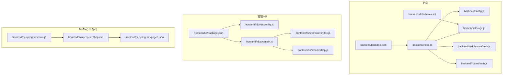
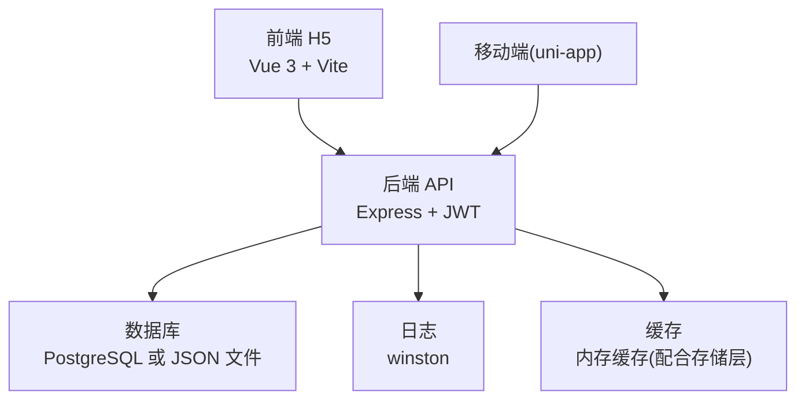
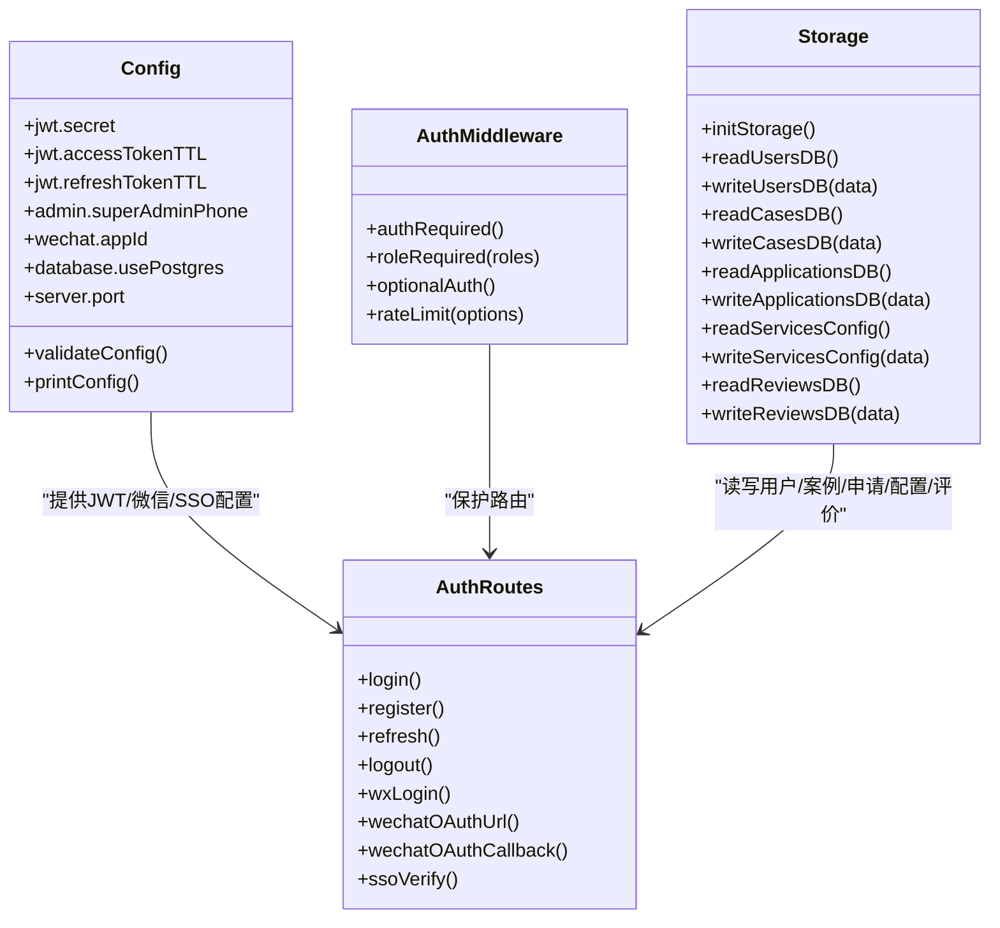
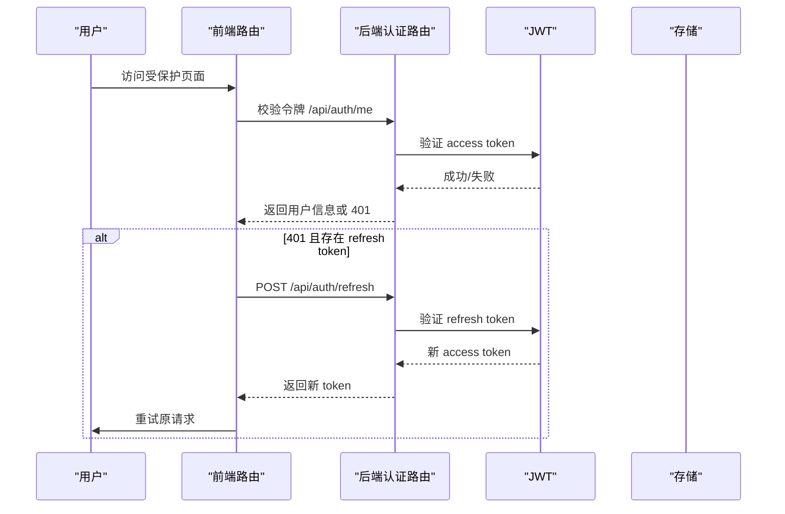
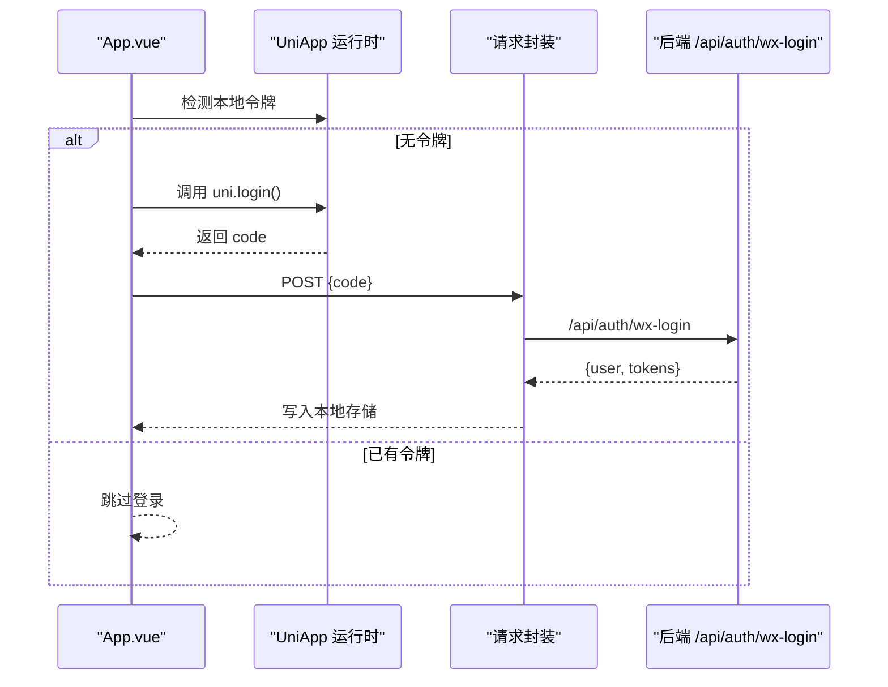
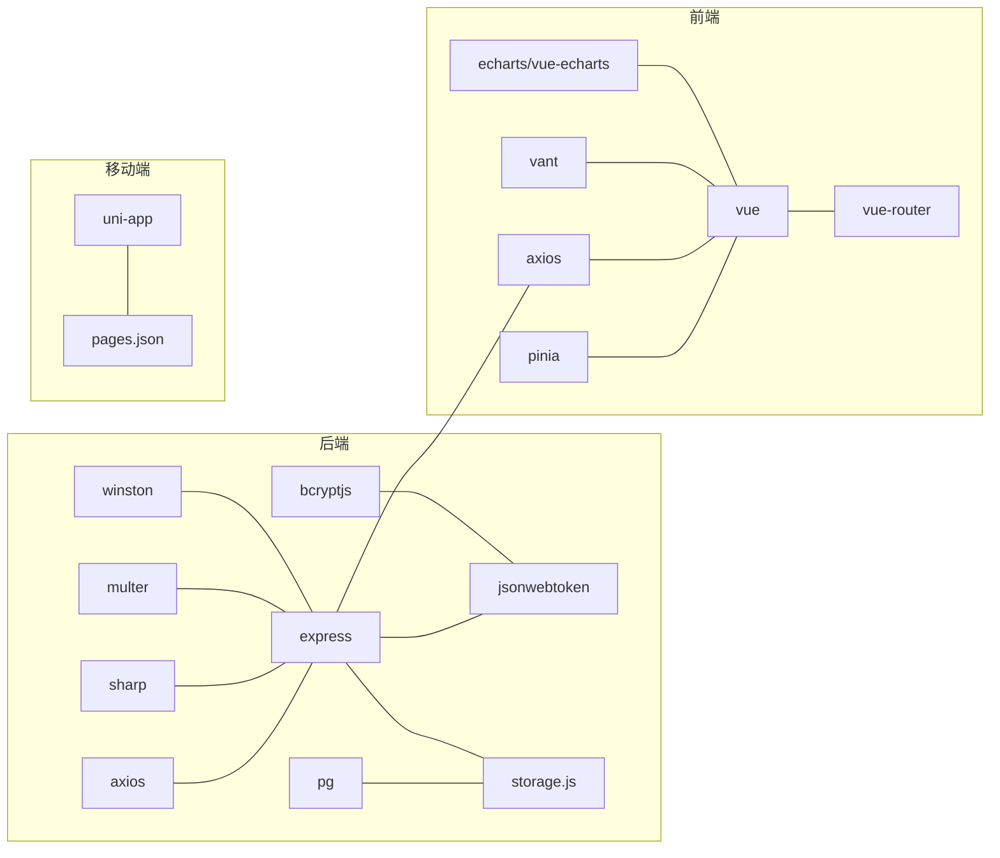

# 技术栈与依赖

<cite>
**本文引用的文件**   
- [backend/package.json](file://backend/package.json)
- [backend/index.js](file://backend/index.js)
- [backend/config.js](file://backend/config.js)
- [backend/db/schema.sql](file://backend/db/schema.sql)
- [backend/storage.js](file://backend/storage.js)
- [backend/middleware/auth.js](file://backend/middleware/auth.js)
- [backend/routes/auth.js](file://backend/routes/auth.js)
- [frontend/h5/package.json](file://frontend/h5/package.json)
- [frontend/h5/vite.config.js](file://frontend/h5/vite.config.js)
- [frontend/h5/src/main.js](file://frontend/h5/src/main.js)
- [frontend/h5/src/router/index.js](file://frontend/h5/src/router/index.js)
- [frontend/h5/src/utils/http.js](file://frontend/h5/src/utils/http.js)
- [frontend/miniprogram/main.js](file://frontend/miniprogram/main.js)
- [frontend/miniprogram/App.vue](file://frontend/miniprogram/App.vue)
- [frontend/miniprogram/pages.json](file://frontend/miniprogram/pages.json)
</cite>

## 目录
1. [简介](#简介)
2. [项目结构](#项目结构)
3. [核心组件](#核心组件)
4. [架构总览](#架构总览)
5. [详细组件分析](#详细组件分析)
6. [依赖分析](#依赖分析)
7. [性能考虑](#性能考虑)
8. [故障排查指南](#故障排查指南)
9. [结论](#结论)
10. [附录](#附录)

## 简介
本文件面向低空飞行服务平台的开发者与运维人员，系统化梳理后端、前端与移动端三端技术栈与依赖，解释各组件选择原因及其在项目中的职责，并提供依赖关系图谱、开发环境配置、安装与版本管理策略以及最佳实践建议。

## 项目结构
项目采用多包/多入口的分层组织方式：
- 后端：基于 Node.js + Express 的 REST API 服务，负责认证、业务数据持久化与第三方对接。
- 前端 H5：基于 Vue 3 + Vite 的移动端优先 Web 应用，使用 Pinia 进行状态管理，Vant 提供移动端 UI 组件。
- 移动端：基于 UniApp 的跨平台应用，支持小程序、H5 等运行环境，统一业务逻辑与页面结构。

图表来源
- [backend/package.json:1-34](file://backend/package.json#L1-L34)
- [backend/index.js:1-120](file://backend/index.js#L1-L120)
- [backend/config.js:1-123](file://backend/config.js#L1-L123)
- [backend/db/schema.sql:1-10](file://backend/db/schema.sql#L1-L10)
- [backend/storage.js:1-63](file://backend/storage.js#L1-L63)
- [backend/middleware/auth.js:1-45](file://backend/middleware/auth.js#L1-L45)
- [backend/routes/auth.js:1-50](file://backend/routes/auth.js#L1-L50)
- [frontend/h5/package.json:1-27](file://frontend/h5/package.json#L1-L27)
- [frontend/h5/vite.config.js:1-54](file://frontend/h5/vite.config.js#L1-L54)
- [frontend/h5/src/main.js:1-22](file://frontend/h5/src/main.js#L1-L22)
- [frontend/h5/src/router/index.js:1-50](file://frontend/h5/src/router/index.js#L1-L50)
- [frontend/h5/src/utils/http.js:1-30](file://frontend/h5/src/utils/http.js#L1-L30)
- [frontend/miniprogram/main.js:1-22](file://frontend/miniprogram/main.js#L1-L22)
- [frontend/miniprogram/App.vue:1-45](file://frontend/miniprogram/App.vue#L1-L45)
- [frontend/miniprogram/pages.json:1-40](file://frontend/miniprogram/pages.json#L1-L40)

章节来源
- [backend/package.json:1-34](file://backend/package.json#L1-L34)
- [frontend/h5/package.json:1-27](file://frontend/h5/package.json#L1-L27)

## 核心组件
- 后端技术栈
  - 运行时与框架：Node.js、Express
  - 认证与安全：JWT、bcryptjs、jsonwebtoken
  - 数据库：PostgreSQL（可选）；本地 JSON 存储作为过渡方案
  - 工具与媒体：sharp（图片压缩）、multer（文件上传）、axios（HTTP 客户端）
  - 日志与配置：winston（日志）、dotenv（环境变量）、配置集中化与校验
- 前端技术栈
  - 框架与构建：Vue 3、Vite
  - 状态管理：Pinia
  - UI 组件：Vant
  - 路由与网络：vue-router、axios
  - 开发工具：@vitejs/plugin-vue、vite
- 移动端技术栈
  - 跨平台框架：UniApp
  - 页面与导航：pages.json 配置
  - 运行时：条件编译适配 Vue 2/Vue 3

章节来源
- [backend/package.json:12-28](file://backend/package.json#L12-L28)
- [frontend/h5/package.json:10-20](file://frontend/h5/package.json#L10-L20)
- [frontend/miniprogram/main.js:14-22](file://frontend/miniprogram/main.js#L14-L22)

## 架构总览
整体采用“后端 API + 前端 SPA + 移动端跨平台”的三层架构。后端提供统一认证与业务接口，前端通过代理访问后端，移动端通过 HTTP 请求与后端交互。

图表来源
- [backend/index.js:1-120](file://backend/index.js#L1-L120)
- [backend/storage.js:1-63](file://backend/storage.js#L1-L63)
- [frontend/h5/vite.config.js:35-44](file://frontend/h5/vite.config.js#L35-L44)

## 详细组件分析

### 后端组件分析
- 配置与安全
  - 配置集中化：JWT 密钥、管理员默认口令、微信与 SSO 参数、数据库开关、上传与服务器参数均通过 config.js 管理，并进行生产环境校验。
  - 安全策略：启动时打印配置摘要，对默认密钥与敏感参数发出警告；生产环境强制密钥长度。
- 认证与权限
  - 中间件：authRequired、optionalAuth、roleRequired、rateLimit 实现统一鉴权、角色控制与请求限流。
  - 路由：/api/auth 下提供登录、注册、SSO、微信登录、刷新与登出等接口。
  - Token：JWT 生成与刷新，区分 access/refresh 与过期时间。
- 数据存储
  - 多后端支持：优先 PostgreSQL（JSONB），回退为本地 JSON 文件；统一读写封装与缓存。
  - 初始化：首次启动确保表与文件存在。
- 中间件与路由
  - CORS、BodyParser、静态资源、请求日志、输入清洗、错误处理等中间件贯穿全站。
  - 图片压缩、文件上传、客户端 IP 辅助接口等扩展能力。

图表来源
- [backend/config.js:8-76](file://backend/config.js#L8-L76)
- [backend/middleware/auth.js:11-167](file://backend/middleware/auth.js#L11-L167)
- [backend/storage.js:42-181](file://backend/storage.js#L42-L181)
- [backend/routes/auth.js:96-590](file://backend/routes/auth.js#L96-L590)

章节来源
- [backend/config.js:78-123](file://backend/config.js#L78-L123)
- [backend/middleware/auth.js:11-167](file://backend/middleware/auth.js#L11-L167)
- [backend/storage.js:42-181](file://backend/storage.js#L42-L181)
- [backend/routes/auth.js:96-590](file://backend/routes/auth.js#L96-L590)

### 前端组件分析
- 应用初始化
  - 注册 Pinia、Vue Router、Vant，并挂载全局样式与 HTTP 初始化。
- 路由与权限
  - 前端路由守卫：拦截 admin 权限路径，校验本地用户与令牌；支持 jyauthcode/authcode 透传登录。
- HTTP 与 Token 刷新
  - Axios 请求拦截器自动附加 Bearer Token；响应拦截器处理 401 并触发刷新流程，队列化并发刷新请求。
- 构建与代理
  - Vite 代理 /api 与 /uploads 到后端；输出分包策略拆分图表库依赖；开发服务器安全响应头。

图表来源
- [frontend/h5/src/router/index.js:155-223](file://frontend/h5/src/router/index.js#L155-L223)
- [frontend/h5/src/utils/http.js:28-78](file://frontend/h5/src/utils/http.js#L28-L78)
- [backend/routes/auth.js:230-294](file://backend/routes/auth.js#L230-L294)

章节来源
- [frontend/h5/src/main.js:14-22](file://frontend/h5/src/main.js#L14-L22)
- [frontend/h5/src/router/index.js:155-223](file://frontend/h5/src/router/index.js#L155-L223)
- [frontend/h5/src/utils/http.js:19-78](file://frontend/h5/src/utils/http.js#L19-L78)
- [frontend/h5/vite.config.js:35-44](file://frontend/h5/vite.config.js#L35-L44)

### 移动端组件分析
- 运行时与登录
  - 在小程序环境下尝试静默微信登录，若无本地令牌则调用后端 /api/auth/wx-login 获取令牌并持久化。
- 页面与导航
  - pages.json 统一声明页面、标题栏与 tabBar，便于跨端一致的导航体验。

图表来源
- [frontend/miniprogram/App.vue:14-37](file://frontend/miniprogram/App.vue#L14-L37)
- [frontend/miniprogram/main.js:14-22](file://frontend/miniprogram/main.js#L14-L22)

章节来源
- [frontend/miniprogram/App.vue:14-37](file://frontend/miniprogram/App.vue#L14-L37)
- [frontend/miniprogram/pages.json:1-163](file://frontend/miniprogram/pages.json#L1-L163)

## 依赖分析
- 后端依赖
  - 核心：express、jsonwebtoken、bcryptjs、cors、body-parser、dotenv
  - 数据：pg（PostgreSQL 驱动）、lowdb（本地 JSON）
  - 工具：multer（上传）、sharp（图片压缩）、axios（HTTP）、winston（日志）、xlsx（Excel）
- 前端依赖
  - 核心：vue、vue-router、pinia、axios
  - UI：vant、vue-echarts、echarts、leaflet
  - 构建：vite、@vitejs/plugin-vue
- 移动端依赖
  - 框架：uni-app（通过 main.js 条件编译适配 Vue 2/3）

图表来源
- [backend/package.json:12-28](file://backend/package.json#L12-L28)
- [frontend/h5/package.json:10-20](file://frontend/h5/package.json#L10-L20)
- [frontend/miniprogram/main.js:14-22](file://frontend/miniprogram/main.js#L14-L22)

章节来源
- [backend/package.json:12-28](file://backend/package.json#L12-L28)
- [frontend/h5/package.json:10-20](file://frontend/h5/package.json#L10-L20)

## 性能考虑
- 缓存策略
  - 后端存储层对用户、案例、申请、配置、评价分别设置不同 TTL 的内存缓存，降低数据库/文件 IO 压力。
- 图片处理
  - 后端提供按宽与质量动态压缩接口，带缓存头，减少重复计算与带宽消耗。
- 构建优化
  - 前端 Vite 通过 manualChunks 将图表库独立打包，提升缓存命中率与首屏渲染效率。
- 限流与安全
  - 中间件提供简单但有效的请求限流，结合日志记录，有助于抵御暴力破解与滥用。

章节来源
- [backend/storage.js:134-181](file://backend/storage.js#L134-L181)
- [backend/index.js:86-114](file://backend/index.js#L86-L114)
- [frontend/h5/vite.config.js:22-30](file://frontend/h5/vite.config.js#L22-L30)
- [backend/middleware/auth.js:108-160](file://backend/middleware/auth.js#L108-L160)

## 故障排查指南
- 认证相关
  - 401 未认证/令牌过期：检查前端是否正确设置 Authorization 头；确认后端 JWT 密钥与过期时间配置；必要时使用刷新接口获取新令牌。
  - 角色受限：确认用户角色字段与路由守卫允许的角色集合匹配。
- 数据存储
  - PostgreSQL 未启用：确认环境变量 USE_POSTGRES；如启用需先执行迁移脚本创建表。
  - JSON 文件损坏：检查 data.json、users.json 等文件完整性，必要时回滚或重建。
- 微信登录
  - 小程序登录失败：核对 appId/appSecret 与后端配置；检查静默登录流程与后端 /api/auth/wx-login 返回。
  - 公众号授权：核对回调地址与后端生成的授权 URL。
- 前端代理
  - /api 与 /uploads 无法访问：检查 Vite 代理 target 与后端端口一致性。

章节来源
- [backend/routes/auth.js:513-588](file://backend/routes/auth.js#L513-L588)
- [backend/config.js:78-104](file://backend/config.js#L78-L104)
- [backend/storage.js:42-63](file://backend/storage.js#L42-L63)
- [frontend/h5/vite.config.js:35-44](file://frontend/h5/vite.config.js#L35-L44)

## 结论
本项目在技术选型上兼顾易用性与可扩展性：后端以 Express + JWT 快速搭建认证与业务接口，支持 PostgreSQL 与本地 JSON 双后端；前端采用 Vue 3 + Vite + Pinia，具备良好的开发体验与性能表现；移动端通过 UniApp 实现跨平台复用。建议在生产环境中强化密钥管理、完善数据库迁移与备份策略，并持续优化缓存与图片处理链路。

## 附录

### 开发环境配置与安装
- 后端
  - 安装依赖：使用包管理器安装 backend/package.json 中的依赖。
  - 环境变量：复制示例文件并补充 JWT_SECRET、数据库连接、微信与 SSO 参数。
  - 启动：开发模式使用 nodemon；生产模式使用 node index.js。
- 前端 H5
  - 安装依赖：安装 frontend/h5/package.json 中的依赖。
  - 启动：使用 Vite 开发服务器；代理目标指向后端地址。
- 移动端
  - 安装依赖：根据 uni-app 工程配置安装依赖。
  - 启动：使用 HBuilderX 或命令行工具运行对应平台。

章节来源
- [backend/package.json:6-11](file://backend/package.json#L6-L11)
- [backend/config.js:106-116](file://backend/config.js#L106-L116)
- [frontend/h5/package.json:5-9](file://frontend/h5/package.json#L5-L9)
- [frontend/h5/vite.config.js:6-9](file://frontend/h5/vite.config.js#L6-L9)

### 版本与兼容性要点
- Node.js 与 npm/yarn：建议使用 LTS 版本，确保依赖兼容。
- Vue 3 与 Vite：与 @vitejs/plugin-vue 兼容；注意浏览器兼容性与 polyfill 需求。
- Express：与 cors、body-parser、multer 等中间件保持同步版本。
- PostgreSQL：与 pg 驱动兼容；JSONB 字段与 lowdb 回退方案需在迁移脚本中统一处理。

章节来源
- [backend/package.json:12-28](file://backend/package.json#L12-L28)
- [frontend/h5/package.json:10-20](file://frontend/h5/package.json#L10-L20)

### 最佳实践建议
- 安全
  - 生产环境必须设置强密钥并轮换；开启 HTTPS 与安全响应头。
  - 对外部接口调用（微信、SSO）增加超时与重试策略。
- 可靠性
  - 使用数据库事务与幂等设计；对关键写操作增加唯一索引与冲突处理。
  - 前端对 401 场景做统一兜底与提示。
- 可维护性
  - 统一错误码与日志结构；对敏感字段脱敏输出。
  - 对大文件上传与图片压缩增加进度反馈与失败重试。