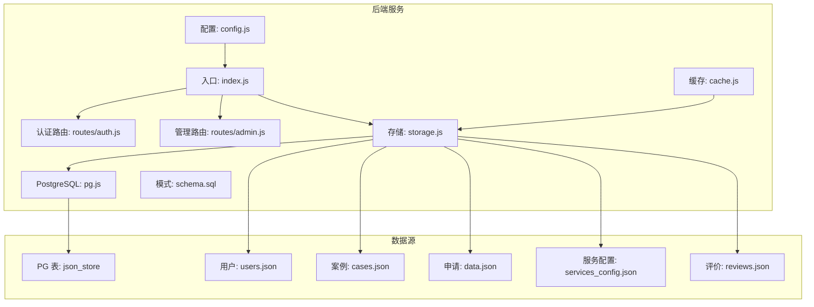
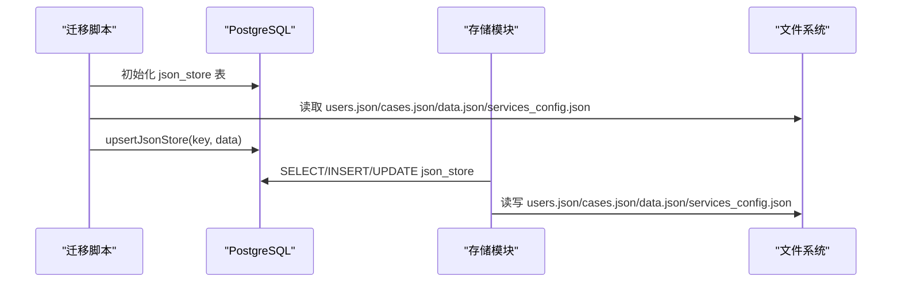
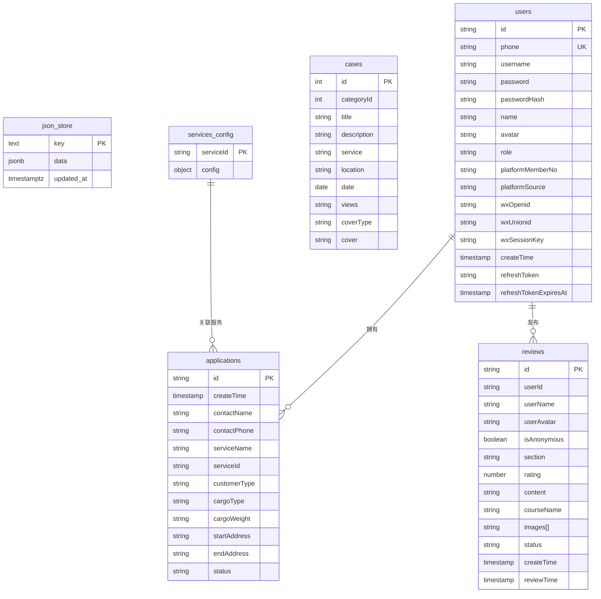
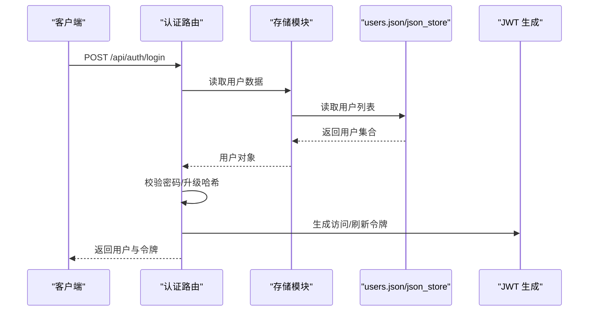
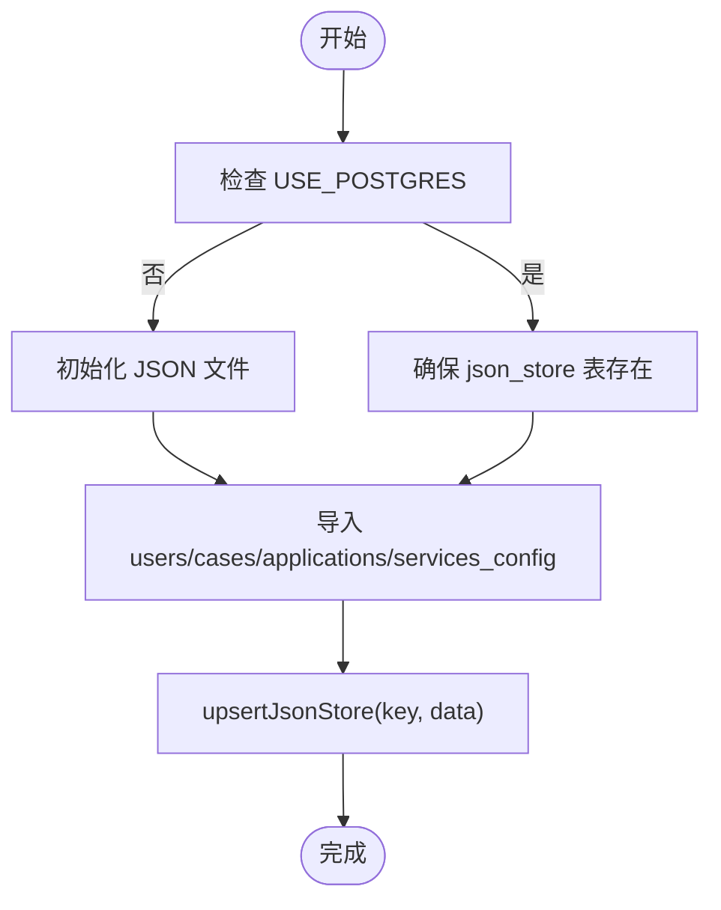

# 数据库设计

<cite>
**本文引用的文件**
- [schema.sql](file://backend/db/schema.sql)
- [migrate.js](file://backend/db/migrate.js)
- [pg.js](file://backend/db/pg.js)
- [storage.js](file://backend/storage.js)
- [cache.js](file://backend/cache.js)
- [index.js](file://backend/index.js)
- [config.js](file://backend/config.js)
- [data.json](file://backend/data.json)
- [cases.json](file://backend/cases.json)
- [users.json](file://backend/users.json)
- [services_config.json](file://backend/services_config.json)
- [reviews.json](file://backend/reviews.json)
- [admin.js](file://backend/routes/admin.js)
- [auth.js](file://backend/routes/auth.js)
- [package.json](file://backend/package.json)
</cite>

## 目录
1. [简介](#简介)
2. [项目结构](#项目结构)
3. [核心组件](#核心组件)
4. [架构总览](#架构总览)
5. [详细组件分析](#详细组件分析)
6. [依赖分析](#依赖分析)
7. [性能考量](#性能考量)
8. [故障排查指南](#故障排查指南)
9. [结论](#结论)
10. [附录](#附录)

## 简介
本设计文档面向低空飞行服务平台，聚焦数据库与数据模型设计。当前系统采用“JSON文件存储 + 可选 PostgreSQL JSON 存储”的混合方案，支持用户、服务配置、申请、案例与评价等核心数据的持久化与访问。文档将详细说明数据模型、表结构关系、字段定义与数据类型、主键/外键与索引设计、约束与校验规则、业务规则、数据访问模式、缓存策略、性能优化、迁移路径与版本管理、以及数据安全与隐私保护。

## 项目结构
后端采用 Node.js + Express 架构，数据库层通过统一的存储抽象模块对接本地 JSON 文件或 PostgreSQL 的 JSON 存储表。迁移脚本负责初始化与数据导入，配置模块集中管理运行参数，中间件提供认证、校验与错误处理，路由模块暴露 REST API。

图表来源
- [index.js:1-120](file://backend/index.js#L1-L120)
- [storage.js:1-63](file://backend/storage.js#L1-L63)
- [pg.js:1-56](file://backend/db/pg.js#L1-L56)
- [schema.sql:1-10](file://backend/db/schema.sql#L1-L10)
- [config.js:1-123](file://backend/config.js#L1-L123)

章节来源
- [index.js:1-120](file://backend/index.js#L1-L120)
- [storage.js:1-63](file://backend/storage.js#L1-L63)
- [pg.js:1-56](file://backend/db/pg.js#L1-L56)
- [schema.sql:1-10](file://backend/db/schema.sql#L1-L10)
- [config.js:1-123](file://backend/config.js#L1-L123)

## 核心组件
- 存储抽象层：统一读写接口，自动切换本地 JSON 文件或 PostgreSQL JSON 存储。
- 迁移脚本：初始化 json_store 表并批量导入初始数据。
- 缓存层：基于内存 Map 的 TTL 缓存，降低频繁读取成本。
- 配置中心：集中管理 JWT、数据库、上传、微信、SSO 等配置。
- 路由与中间件：提供认证、授权、速率限制、输入清洗与错误处理。

章节来源
- [storage.js:134-197](file://backend/storage.js#L134-L197)
- [migrate.js:35-62](file://backend/db/migrate.js#L35-L62)
- [cache.js:1-119](file://backend/cache.js#L1-L119)
- [config.js:7-123](file://backend/config.js#L7-L123)
- [auth.js:96-147](file://backend/routes/auth.js#L96-L147)
- [admin.js:29-61](file://backend/routes/admin.js#L29-L61)

## 架构总览
系统支持两种运行模式：
- 本地 JSON 模式：所有数据以 JSON 文件形式存储，适合开发与轻量部署。
- PostgreSQL 模式：启用 USE_POSTGRES=1 时，使用 json_store 表存储 JSONB 数据，支持扩展规范化表结构。

图表来源
- [migrate.js:35-62](file://backend/db/migrate.js#L35-L62)
- [pg.js:39-48](file://backend/db/pg.js#L39-L48)
- [storage.js:65-132](file://backend/storage.js#L65-L132)

章节来源
- [migrate.js:1-62](file://backend/db/migrate.js#L1-L62)
- [pg.js:39-48](file://backend/db/pg.js#L39-L48)
- [storage.js:42-63](file://backend/storage.js#L42-L63)

## 详细组件分析

### 数据模型设计
- 用户数据模型
  - 字段概览：标识、手机号、用户名、密码哈希、昵称、头像、角色、平台关联信息、创建时间、刷新令牌与过期时间等。
  - 数据类型：字符串、布尔、枚举（角色）、时间戳。
  - 约束与规则：手机号唯一性、密码强度校验、角色合法性、SSO/微信登录兼容。
- 服务数据模型
  - 字段概览：服务ID映射到配置对象，包含名称、标语、图标、颜色、简介、项目、优势、联系方式、地址、课程信息、展示图集等。
  - 数据类型：字符串、数组、对象、数值。
  - 约束与规则：按服务ID分组，管理员按角色可见/编辑范围受限。
- 申请数据模型
  - 字段概览：申请ID、创建时间、联系人、电话、服务ID/名称、客户类型、货物/体积/重量、起终点、期望时间/紧急度、特殊条件、文件列表、备注、巡检/吊运/托管/培训/赛事相关字段、状态、订单号、更新时间等。
  - 数据类型：字符串、数组、对象、数值、布尔。
  - 约束与规则：状态枚举（待处理/处理中/已完成），按服务ID与角色过滤。
- 案例数据模型
  - 字段概览：标题、描述、地点、日期、封面类型/链接、媒体资源（图片/视频）、亮点、分类ID、服务类别、全文描述等。
  - 数据类型：字符串、数组、对象。
  - 约束与规则：封面类型与媒体资源结构一致。
- 评价数据模型
  - 字段概览：评价ID、用户ID/名称/头像、匿名标记、板块、评分、内容、课程名、图片列表、状态、创建/审核时间。
  - 数据类型：字符串、布尔、数值、时间戳。
  - 约束与规则：状态枚举（待审/通过/拒绝），板块划分。

章节来源
- [users.json:1-58](file://backend/users.json#L1-L58)
- [services_config.json:1-1230](file://backend/services_config.json#L1-L1230)
- [data.json:1-594](file://backend/data.json#L1-L594)
- [cases.json:1-88](file://backend/cases.json#L1-L88)
- [reviews.json:1-54](file://backend/reviews.json#L1-L54)

### 数据库模式定义与表结构
- json_store 表（PostgreSQL 模式）
  - 字段
    - key：文本，主键
    - data：JSONB，非空
    - updated_at：带时区的时间戳，默认当前时间
  - 索引与约束
    - 主键：key
    - 可选：按业务需要添加 GIN 索引于 JSONB 字段（如 data->>'status'）
  - 设计意图：统一存储多类 JSON 数据，便于迁移与扩展。

章节来源
- [schema.sql:1-10](file://backend/db/schema.sql#L1-L10)
- [pg.js:39-48](file://backend/db/pg.js#L39-L48)

### 字段定义与数据类型
- 用户：id、phone、username、password、passwordHash、name、avatar、role、platformMemberNo、platformSource、wxOpenid、wxUnionid、wxSessionKey、createTime、refreshToken、refreshTokenExpiresAt
- 服务配置：以服务ID为键的对象，包含 name、slogan、icon、color、mainColor、intro、projects、advantages、contactPhone、address、studyShowcase、trainingInfo、packages、courseSchedule、studyPrice、headerImage、highlights 等
- 申请：id、createTime、contactName、contactPhone、serviceName、serviceId、customerType、cargoType、cargoWeight、startAddress、endAddress、status、以及大量与具体服务相关的字段
- 案例：id、categoryId、title、description、service、location、date、views、coverType、cover、media、fullDescription、highlights
- 评价：id、userId、userName、userAvatar、isAnonymous、section、rating、content、courseName、images、status、createTime、reviewTime

章节来源
- [users.json:1-58](file://backend/users.json#L1-L58)
- [services_config.json:1-1230](file://backend/services_config.json#L1-L1230)
- [data.json:1-594](file://backend/data.json#L1-L594)
- [cases.json:1-88](file://backend/cases.json#L1-L88)
- [reviews.json:1-54](file://backend/reviews.json#L1-L54)

### 主键/外键关系与索引设计
- 当前模式
  - json_store.key 为主键
  - 无显式外键约束，数据完整性依赖应用层
  - 可选索引：对 JSONB 字段常用查询键（如 status、serviceId）建立 GIN 索引
- 规范化建议
  - 用户表：id 主键，phone 唯一键
  - 申请表：id 主键，外键关联用户表（可选）
  - 案例表：id 主键
  - 服务配置表：以服务ID为主键
  - 评价表：id 主键，外键关联用户表（可选）

章节来源
- [schema.sql:1-10](file://backend/db/schema.sql#L1-L10)
- [users.json:1-58](file://backend/users.json#L1-L58)
- [data.json:1-594](file://backend/data.json#L1-L594)
- [cases.json:1-88](file://backend/cases.json#L1-L88)
- [reviews.json:1-54](file://backend/reviews.json#L1-L54)

### 约束与业务规则
- 用户
  - 角色枚举：user、admin、dsl_admin、study_admin
  - 手机号唯一性
  - 密码强度与哈希存储
- 申请
  - 状态枚举：待处理、处理中、已完成
  - 按角色与服务ID过滤显示
- 服务配置
  - 研学管理员仅可见/编辑服务9
  - DSL管理员仅可见/编辑服务13
- 评价
  - 状态枚举：pending、approved、rejected
  - 管理员审核流程

章节来源
- [admin.js:234-277](file://backend/routes/admin.js#L234-L277)
- [admin.js:314-357](file://backend/routes/admin.js#L314-L357)
- [admin.js:442-481](file://backend/routes/admin.js#L442-L481)
- [auth.js:152-205](file://backend/routes/auth.js#L152-L205)

### 数据访问模式
- 读取：根据 USE_POSTGRES 切换，优先缓存，再读取 JSON 文件或 json_store 表
- 写入：清除对应缓存键，再写入 JSON 文件或 json_store 表
- 缓存策略
  - 用户：60 秒
  - 案例：5 分钟
  - 申请：1 分钟
  - 服务配置：5 分钟
  - 评价：60 秒
  - 全局缓存每 5 分钟清理过期项

章节来源
- [storage.js:134-197](file://backend/storage.js#L134-L197)
- [cache.js:1-119](file://backend/cache.js#L1-L119)

### 数据验证规则
- 登录/注册
  - 登录必填：账号或用户名、密码
  - 注册必填：手机号、密码、姓名；手机号格式校验；密码长度≥6
- 申请
  - 不同服务类型字段差异较大，前端/后端需按服务ID进行字段校验
- 评价
  - 评分与内容必填；状态变更需为 approved/rejected

章节来源
- [auth.js:96-147](file://backend/routes/auth.js#L96-L147)
- [auth.js:152-205](file://backend/routes/auth.js#L152-L205)
- [admin.js:442-481](file://backend/routes/admin.js#L442-L481)

### 数据架构图

图表来源
- [schema.sql:1-10](file://backend/db/schema.sql#L1-L10)
- [users.json:1-58](file://backend/users.json#L1-L58)
- [data.json:1-594](file://backend/data.json#L1-L594)
- [cases.json:1-88](file://backend/cases.json#L1-L88)
- [reviews.json:1-54](file://backend/reviews.json#L1-L54)
- [services_config.json:1-1230](file://backend/services_config.json#L1-L1230)

## 依赖分析
- 运行时依赖
  - express、pg、bcryptjs、jsonwebtoken、multer、xlsx、sharp、axios 等
- 配置驱动
  - USE_POSTGRES 控制数据库模式
  - JWT_SECRET、ACCESS_TOKEN_TTL、REFRESH_TOKEN_TTL 控制认证
  - PG_* 与 UPLOAD_* 等环境变量控制连接与上传
- 路由与中间件
  - 认证中间件：鉴权、角色校验、速率限制
  - 校验中间件：字段必填、查询参数校验
  - 错误处理中间件：统一错误响应

章节来源
- [package.json:12-29](file://backend/package.json#L12-L29)
- [config.js:7-76](file://backend/config.js#L7-L76)
- [auth.js:18-21](file://backend/routes/auth.js#L18-L21)
- [admin.js:17-20](file://backend/routes/admin.js#L17-L20)

## 性能考量
- 缓存
  - 针对高频读取的数据设置 TTL，减少磁盘与数据库 IO
  - 写入后主动失效对应缓存键，保证一致性
- 查询优化
  - PostgreSQL 模式下对 JSONB 字段常用查询键建立 GIN 索引
  - 分页与排序在应用层完成，避免复杂 SQL
- I/O 优化
  - 图片压缩与缓存头设置，减轻静态资源压力
  - Excel 导出使用流式写入，避免内存峰值

章节来源
- [cache.js:1-119](file://backend/cache.js#L1-L119)
- [storage.js:134-197](file://backend/storage.js#L134-L197)
- [index.js:86-114](file://backend/index.js#L86-L114)
- [admin.js:171-207](file://backend/routes/admin.js#L171-L207)

## 故障排查指南
- PostgreSQL 未启用
  - 症状：调用数据库接口报错
  - 处理：设置 USE_POSTGRES=1 并提供数据库连接参数
- 迁移失败
  - 症状：json_store 表未创建或数据未导入
  - 处理：执行迁移脚本，检查数据文件是否存在且可解析
- 缓存异常
  - 症状：读取到旧数据
  - 处理：确认写入后缓存键已删除，等待下次读取重建
- 认证问题
  - 症状：登录失败、Token 无效
  - 处理：检查 JWT_SECRET、过期时间与刷新流程

章节来源
- [pg.js:31-37](file://backend/db/pg.js#L31-L37)
- [migrate.js:35-62](file://backend/db/migrate.js#L35-L62)
- [storage.js:139-142](file://backend/storage.js#L139-L142)
- [auth.js:230-294](file://backend/routes/auth.js#L230-L294)

## 结论
本设计以“JSON 文件 + 可选 PostgreSQL JSON 存储”为核心，兼顾易用性与可扩展性。通过统一的存储抽象、缓存与中间件机制，实现了清晰的数据访问模式与良好的性能表现。后续可在 PostgreSQL 模式下逐步引入规范化表结构与索引，以支撑更大规模与更复杂的业务场景。

## 附录

### 数据访问序列图（登录）

图表来源
- [auth.js:96-147](file://backend/routes/auth.js#L96-L147)
- [storage.js:65-100](file://backend/storage.js#L65-L100)

### 数据迁移流程图

图表来源
- [migrate.js:35-62](file://backend/db/migrate.js#L35-L62)
- [pg.js:39-48](file://backend/db/pg.js#L39-L48)
- [storage.js:120-132](file://backend/storage.js#L120-L132)

### 样本数据
- 用户样例
  - 字段示例：id、phone、name、role、passwordHash、refreshToken、refreshTokenExpiresAt
  - 示例路径：[users.json:1-58](file://backend/users.json#L1-L58)
- 服务配置样例
  - 字段示例：服务ID、名称、标语、图标、颜色、简介、项目、优势、联系方式、地址、课程信息、展示图集
  - 示例路径：[services_config.json:1-1230](file://backend/services_config.json#L1-L1230)
- 申请样例
  - 字段示例：id、createTime、contactName、contactPhone、serviceName、serviceId、status、订单号、客户类型、货物/体积/重量、起终点、特殊条件、文件列表、备注、巡检/吊运/托管/培训/赛事相关字段
  - 示例路径：[data.json:1-594](file://backend/data.json#L1-L594)
- 案例样例
  - 字段示例：id、categoryId、title、description、service、location、date、views、coverType、cover、media、fullDescription、highlights
  - 示例路径：[cases.json:1-88](file://backend/cases.json#L1-L88)
- 评价样例
  - 字段示例：id、userId、userName、userAvatar、isAnonymous、section、rating、content、courseName、images、status、createTime、reviewTime
  - 示例路径：[reviews.json:1-54](file://backend/reviews.json#L1-L54)