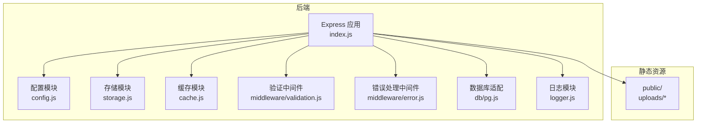
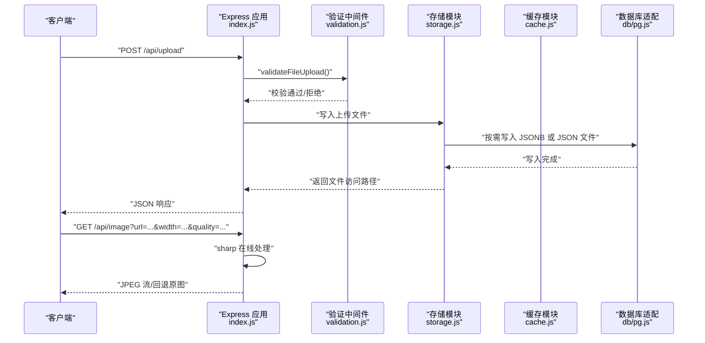
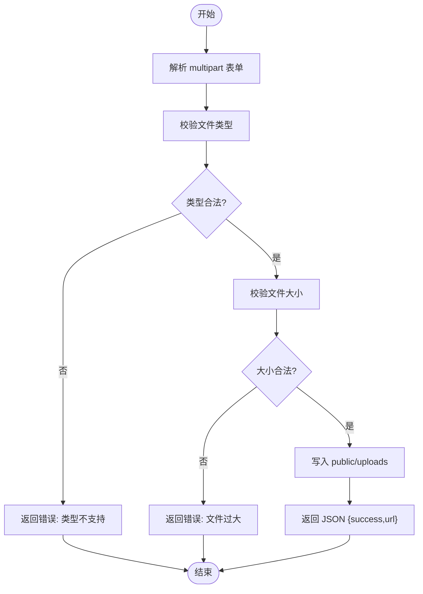
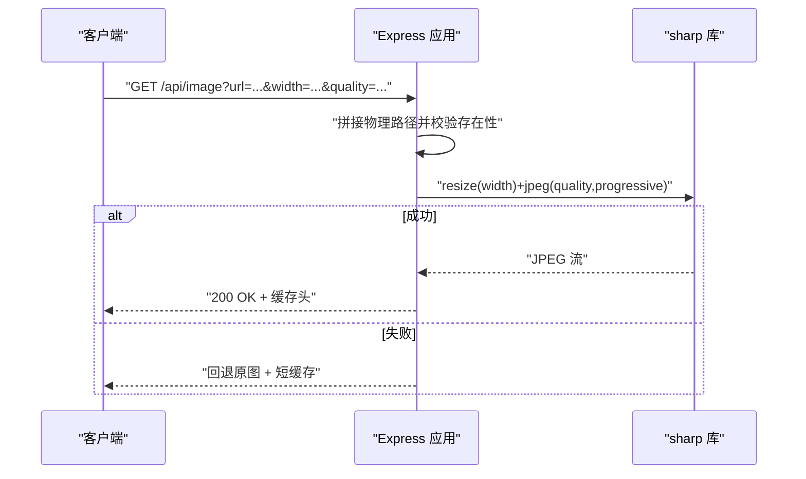
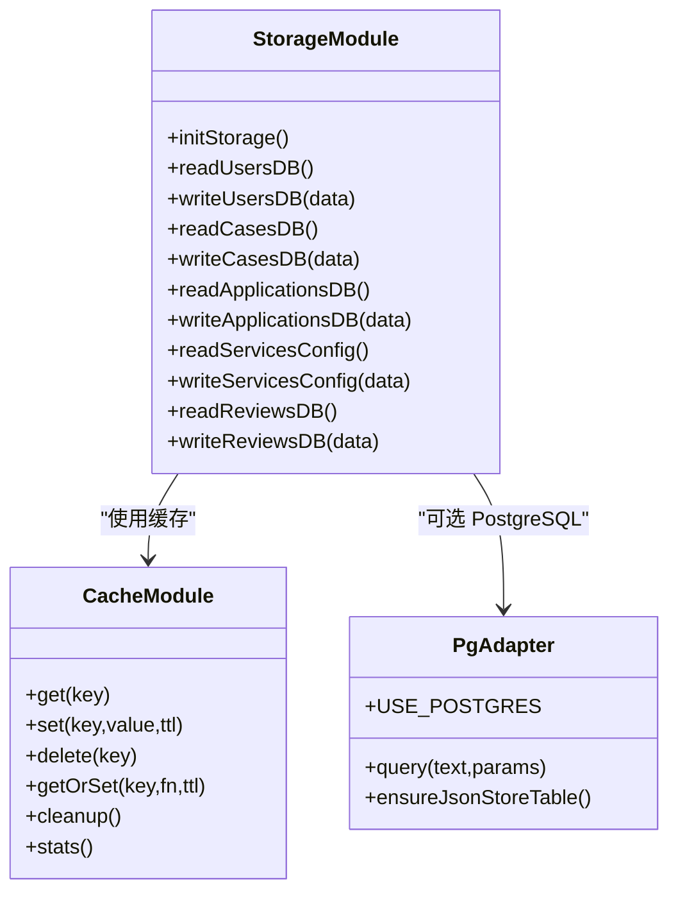
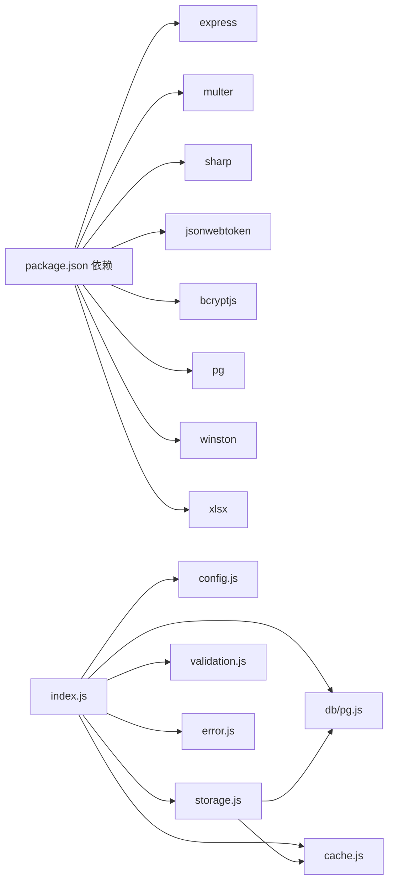

# 文件处理系统

<cite>
**本文引用的文件**
- [backend/index.js](file://backend/index.js)
- [backend/config.js](file://backend/config.js)
- [backend/storage.js](file://backend/storage.js)
- [backend/cache.js](file://backend/cache.js)
- [backend/middleware/validation.js](file://backend/middleware/validation.js)
- [backend/middleware/error.js](file://backend/middleware/error.js)
- [backend/db/pg.js](file://backend/db/pg.js)
- [backend/package.json](file://backend/package.json)
- [backend/logger.js](file://backend/logger.js)
- [backend/public/assets/useMedia-BxF9bGdl.js](file://backend/public/assets/useMedia-BxF9bGdl.js)
- [frontend/h5/src/views/admin/composables/useMedia.js](file://frontend/h5/src/views/admin/composables/useMedia.js)
</cite>

## 目录
1. [简介](#简介)
2. [项目结构](#项目结构)
3. [核心组件](#核心组件)
4. [架构总览](#架构总览)
5. [详细组件分析](#详细组件分析)
6. [依赖关系分析](#依赖关系分析)
7. [性能考虑](#性能考虑)
8. [故障排查指南](#故障排查指南)
9. [结论](#结论)
10. [附录](#附录)

## 简介
本文件处理系统服务于低空飞行服务平台，提供统一的文件上传、存储、访问与图片动态处理能力。系统支持：
- 文件上传：基于多部分表单上传，具备类型与大小校验、安全消毒与错误处理
- 图片处理：在线缩放、质量压缩与渐进式 JPEG 输出，带缓存与回退策略
- 存储架构：本地磁盘与 PostgreSQL 双模式，支持 JSON 文件与 JSONB 存储
- 权限与安全：请求消毒、JWT 认证、CORS 与错误统一处理
- 性能与运维：内存缓存、静态资源托管、日志记录与健康监控

## 项目结构
后端采用 Express 作为 Web 框架，核心文件位于 backend 目录；前端静态资源通过 Express 的静态文件中间件提供。

图表来源
- [backend/index.js:83-114](file://backend/index.js#L83-L114)
- [backend/config.js:55-76](file://backend/config.js#L55-L76)
- [backend/storage.js:42-63](file://backend/storage.js#L42-L63)
- [backend/cache.js:101-119](file://backend/cache.js#L101-L119)
- [backend/middleware/validation.js:154-180](file://backend/middleware/validation.js#L154-L180)
- [backend/middleware/error.js:9-62](file://backend/middleware/error.js#L9-L62)
- [backend/db/pg.js:39-48](file://backend/db/pg.js#L39-L48)
- [backend/logger.js:98-104](file://backend/logger.js#L98-L104)

章节来源
- [backend/index.js:83-114](file://backend/index.js#L83-L114)
- [backend/package.json:12-28](file://backend/package.json#L12-L28)

## 核心组件
- 上传与验证：基于 multer 的磁盘存储，结合自定义验证中间件进行类型与大小校验
- 图片处理：基于 sharp 的在线缩放与压缩，支持宽高与质量参数，失败时回退原图
- 存储与缓存：双写路径（JSON 文件或 PostgreSQL JSONB），配合内存缓存降低读取压力
- 安全与错误：输入消毒、JWT 认证、CORS、统一错误处理与日志记录
- 静态资源：public 目录托管静态文件，上传文件位于 uploads 子目录

章节来源
- [backend/index.js:261-285](file://backend/index.js#L261-L285)
- [backend/index.js:86-114](file://backend/index.js#L86-L114)
- [backend/storage.js:65-132](file://backend/storage.js#L65-L132)
- [backend/cache.js:5-99](file://backend/cache.js#L5-L99)
- [backend/middleware/validation.js:154-180](file://backend/middleware/validation.js#L154-L180)
- [backend/middleware/error.js:9-62](file://backend/middleware/error.js#L9-L62)

## 架构总览
系统整体流程：客户端发起上传或图片处理请求，后端经中间件进行安全与校验，再由存储模块持久化或读取，必要时通过缓存加速，最终返回结果。

图表来源
- [backend/index.js:278-285](file://backend/index.js#L278-L285)
- [backend/index.js:86-114](file://backend/index.js#L86-L114)
- [backend/middleware/validation.js:154-180](file://backend/middleware/validation.js#L154-L180)
- [backend/storage.js:102-132](file://backend/storage.js#L102-L132)
- [backend/db/pg.js:31-37](file://backend/db/pg.js#L31-L37)

## 详细组件分析

### 文件上传处理
- 上传配置
  - 目标目录：public/uploads
  - 文件名规则：时间戳 + 随机数 + 原扩展名
  - 上传字段：单文件字段名为 file
- 文件验证
  - 类型白名单：通过配置项控制
  - 大小限制：通过配置项控制
  - 中间件：validateFileUpload
- 存储策略
  - 本地磁盘：直接写入 public/uploads
  - 数据持久化：应用数据通过 storage.js 写入 JSON 或 PostgreSQL
- 安全检查
  - 输入消毒：sanitizeBody
  - CORS：按配置开放跨域
  - 错误处理：统一错误中间件捕获上传异常

图表来源
- [backend/index.js:261-285](file://backend/index.js#L261-L285)
- [backend/middleware/validation.js:154-180](file://backend/middleware/validation.js#L154-L180)
- [backend/config.js:55-60](file://backend/config.js#L55-L60)

章节来源
- [backend/index.js:261-285](file://backend/index.js#L261-L285)
- [backend/middleware/validation.js:154-180](file://backend/middleware/validation.js#L154-L180)
- [backend/config.js:55-60](file://backend/config.js#L55-L60)

### 图片处理系统
- 功能特性
  - 在线缩放：根据 width 参数调整宽度，保持比例
  - 质量压缩：根据 quality 参数设置 JPEG 质量
  - 渐进式 JPEG：提升首屏加载体验
  - 缓存策略：成功处理后设置较长缓存，失败回退原图并设置短期缓存
- 回退机制
  - 处理失败时自动回退到原始图片
- CDN 集成建议
  - 将 /api/image 映射到 CDN 边缘节点，利用其缓存与全球分发能力
  - 对于 /uploads/*，建议通过独立域名或 CDN 提供静态资源访问

图表来源
- [backend/index.js:86-114](file://backend/index.js#L86-L114)

章节来源
- [backend/index.js:86-114](file://backend/index.js#L86-L114)

### 文件存储架构与命名规则
- 存储模式
  - 本地 JSON 文件：默认模式，适用于开发与小规模场景
  - PostgreSQL JSONB：生产推荐，具备更强一致性与扩展性
- 命名规则
  - 上传文件：时间戳 + 随机数 + 原扩展名，避免冲突
  - 访问路径：/uploads/{filename}
- 数据持久化
  - 应用数据（用户、案例、申请、配置、评价）通过 storage.js 统一读写
  - 支持缓存键常量，按业务粒度设置 TTL

图表来源
- [backend/storage.js:134-181](file://backend/storage.js#L134-L181)
- [backend/cache.js:5-99](file://backend/cache.js#L5-L99)
- [backend/db/pg.js:39-48](file://backend/db/pg.js#L39-L48)

章节来源
- [backend/storage.js:42-63](file://backend/storage.js#L42-L63)
- [backend/storage.js:134-181](file://backend/storage.js#L134-L181)
- [backend/db/pg.js:39-48](file://backend/db/pg.js#L39-L48)

### 访问权限控制
- 认证与授权
  - JWT：生成与刷新令牌，校验失败统一返回 401
  - 角色控制：roleRequired 中间件按角色放行
  - 可选认证：authOptional 允许匿名访问
- 输入安全
  - sanitizeBody：对请求体进行 XSS 与脚本标签清洗
  - validateQuery：对查询参数进行类型与范围校验
- CORS：按配置允许来源与凭证

章节来源
- [backend/index.js:183-231](file://backend/index.js#L183-L231)
- [backend/middleware/validation.js:52-57](file://backend/middleware/validation.js#L52-L57)
- [backend/middleware/validation.js:103-148](file://backend/middleware/validation.js#L103-L148)
- [backend/index.js:71-79](file://backend/index.js#L71-L79)

### 错误处理机制
- 统一错误处理
  - 上传错误：文件过大、字段不匹配等
  - JWT 错误：无效令牌、过期令牌
  - 数据库约束：违反约束统一返回 400
- 开发与生产差异
  - 生产环境不暴露堆栈细节
- 日志记录
  - 结构化日志，包含请求上下文与错误详情

章节来源
- [backend/middleware/error.js:9-62](file://backend/middleware/error.js#L9-L62)
- [backend/logger.js:86-94](file://backend/logger.js#L86-L94)

### 第三方存储服务集成方案
- 云存储对接思路
  - 替换本地磁盘存储：将上传逻辑改为调用云存储 SDK，返回云地址
  - 保持现有 URL 形态：前端仍使用 /uploads/{filename}，后端做重定向或代理
  - CDN 集成：云存储返回的 URL 通过 CDN 加速
- 配置迁移
  - 通过环境变量切换存储后端（如 USE_POSTGRES 与云存储相关变量）
  - 保持 storage.js 的读写接口不变，便于平滑迁移

章节来源
- [backend/config.js:42-53](file://backend/config.js#L42-L53)
- [backend/storage.js:102-132](file://backend/storage.js#L102-L132)

## 依赖关系分析
- 运行时依赖
  - express、multer、sharp、jsonwebtoken、bcryptjs、pg、winston、xlsx 等
- 关键耦合点
  - index.js 依赖 config、storage、cache、validation、error、pg
  - storage.js 依赖 fs、path、pg 与 cache
  - middleware 与 logger 独立但被 index.js 统一接入

图表来源
- [backend/package.json:12-28](file://backend/package.json#L12-L28)
- [backend/index.js:16-43](file://backend/index.js#L16-L43)

章节来源
- [backend/package.json:12-28](file://backend/package.json#L12-L28)
- [backend/index.js:16-43](file://backend/index.js#L16-L43)

## 性能考虑
- 缓存策略
  - 用户、案例、申请、配置、评价分别设置不同 TTL，降低数据库/文件 IO
  - 定期清理过期缓存，避免内存膨胀
- 图片处理
  - 成功处理后设置长缓存，失败回退短缓存，平衡一致性与性能
  - 使用渐进式 JPEG 提升感知速度
- 存储与网络
  - 上传目录与静态资源分离，利于 CDN 与反向代理
  - PostgreSQL JSONB 适合生产级并发与一致性需求

章节来源
- [backend/cache.js:54-67](file://backend/cache.js#L54-L67)
- [backend/storage.js:134-181](file://backend/storage.js#L134-L181)
- [backend/index.js:100-101](file://backend/index.js#L100-L101)

## 故障排查指南
- 上传失败
  - 检查 ALLOWED_FILE_TYPES 与 MAX_FILE_SIZE 配置
  - 查看错误中间件对 LIMIT_FILE_SIZE/LIMIT_UNEXPECTED_FILE 的处理
- 图片处理异常
  - 确认 sharp 可用且路径有效
  - 观察日志中图片处理失败的警告与回退行为
- 认证问题
  - 校验 JWT_SECRET、ACCESS_TOKEN_TTL、REFRESH_TOKEN_TTL
  - 检查令牌是否过期或被篡改
- 数据持久化
  - 若启用 PostgreSQL，确认连接参数与表存在

章节来源
- [backend/middleware/error.js:16-29](file://backend/middleware/error.js#L16-L29)
- [backend/index.js:107-113](file://backend/index.js#L107-L113)
- [backend/config.js:78-104](file://backend/config.js#L78-L104)
- [backend/db/pg.js:39-48](file://backend/db/pg.js#L39-L48)

## 结论
该文件处理系统以 Express 为核心，结合 multer、sharp、winston 与 pg 等依赖，提供了从上传、校验、存储到图片处理与缓存的完整链路。通过配置化与中间件抽象，系统具备良好的可维护性与扩展性；在生产环境中建议启用 PostgreSQL 与 CDN，以获得更好的一致性与性能表现。

## 附录

### 配置清单与示例
- JWT 配置
  - JWT_SECRET：生产环境必须足够强度
  - ACCESS_TOKEN_TTL、REFRESH_TOKEN_TTL：令牌有效期
- 服务器配置
  - PORT、CORS_ORIGIN、BASE_URL、FRONTEND_URL：运行与跨域参数
- 上传配置
  - UPLOAD_DIR：上传目录
  - MAX_FILE_SIZE：字节
  - ALLOWED_FILE_TYPES：MIME 白名单
- 数据库配置
  - USE_POSTGRES：启用 PostgreSQL
  - PG_HOST/PORT/USER/PASSWORD/DATABASE/SSL：PostgreSQL 连接参数
- 日志配置
  - LOG_DIR、LOG_LEVEL：日志目录与级别

章节来源
- [backend/config.js:8-76](file://backend/config.js#L8-L76)

### 使用指南
- 上传文件
  - 前端使用 multipart/form-data，字段名为 file
  - 上传成功后返回 url，前端可使用 normalizeMediaUrl 规范化显示
- 图片处理
  - GET /api/image?url=...&width=...&quality=...
  - 返回 JPEG 流，失败回退原图
- 前端 URL 规范化
  - 前端工具函数会将相对路径、本地主机地址规范化为可用 URL

章节来源
- [backend/index.js:278-285](file://backend/index.js#L278-L285)
- [backend/index.js:86-114](file://backend/index.js#L86-L114)
- [backend/public/assets/useMedia-BxF9bGdl.js:40-47](file://backend/public/assets/useMedia-BxF9bGdl.js#L40-L47)
- [frontend/h5/src/views/admin/composables/useMedia.js:7-34](file://frontend/h5/src/views/admin/composables/useMedia.js#L7-L34)