# 移动端应用架构

<cite>
**本文档引用的文件**
- [main.js](file://frontend/miniprogram/main.js)
- [App.vue](file://frontend/miniprogram/App.vue)
- [pages.json](file://frontend/miniprogram/pages.json)
- [manifest.json](file://frontend/miniprogram/manifest.json)
- [project.config.json](file://frontend/miniprogram/project.config.json)
- [Layout.vue](file://frontend/miniprogram/components/Layout.vue)
- [TabBar.vue](file://frontend/miniprogram/components/TabBar.vue)
- [request.js](file://frontend/miniprogram/utils/request.js)
- [nav.js](file://frontend/miniprogram/utils/nav.js)
- [services.js](file://frontend/miniprogram/utils/services.js)
- [home/index.vue](file://frontend/miniprogram/pages/home/index.vue)
- [services/index.vue](file://frontend/miniprogram/pages/services/index.vue)
- [services/apply.vue](file://frontend/miniprogram/pages/services/apply.vue)
- [mine/index.vue](file://frontend/miniprogram/pages/mine/index.vue)
- [login/index.vue](file://frontend/miniprogram/pages/login/index.vue)
</cite>

## 目录
1. [引言](#引言)
2. [项目结构](#项目结构)
3. [核心组件](#核心组件)
4. [架构概览](#架构概览)
5. [详细组件分析](#详细组件分析)
6. [依赖关系分析](#依赖关系分析)
7. [性能考虑](#性能考虑)
8. [故障排除指南](#故障排除指南)
9. [结论](#结论)
10. [附录](#附录)

## 引言

本文件为低空飞行服务平台移动端应用的架构文档，基于UniApp框架构建的小程序实现。文档详细说明了项目配置、页面结构、组件设计、路由配置，并深入分析了小程序页面设计（首页设计、服务页面、申请页面、个人中心），同时涵盖跨平台适配策略、性能优化方案、小程序开发规范、页面生命周期管理、组件通信机制以及移动端特有的功能实现（如微信登录、分享功能、地理位置服务）。最后提供开发调试指南和发布流程说明。

## 项目结构

前端项目采用UniApp跨平台解决方案，主要目录结构如下：

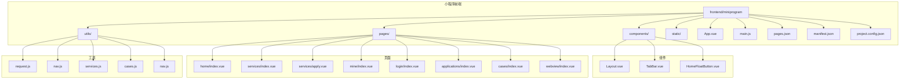

**图表来源**
- [main.js:1-22](file://frontend/miniprogram/main.js#L1-L22)
- [App.vue:1-45](file://frontend/miniprogram/App.vue#L1-L45)
- [pages.json:1-163](file://frontend/miniprogram/pages.json#L1-L163)

**章节来源**
- [main.js:1-22](file://frontend/miniprogram/main.js#L1-L22)
- [App.vue:1-45](file://frontend/miniprogram/App.vue#L1-L45)
- [pages.json:1-163](file://frontend/miniprogram/pages.json#L1-L163)
- [manifest.json:1-73](file://frontend/miniprogram/manifest.json#L1-L73)
- [project.config.json:1-35](file://frontend/miniprogram/project.config.json#L1-L35)

## 核心组件

### 应用入口与生命周期

应用入口通过main.js统一管理，支持Vue2/Vue3双模式：

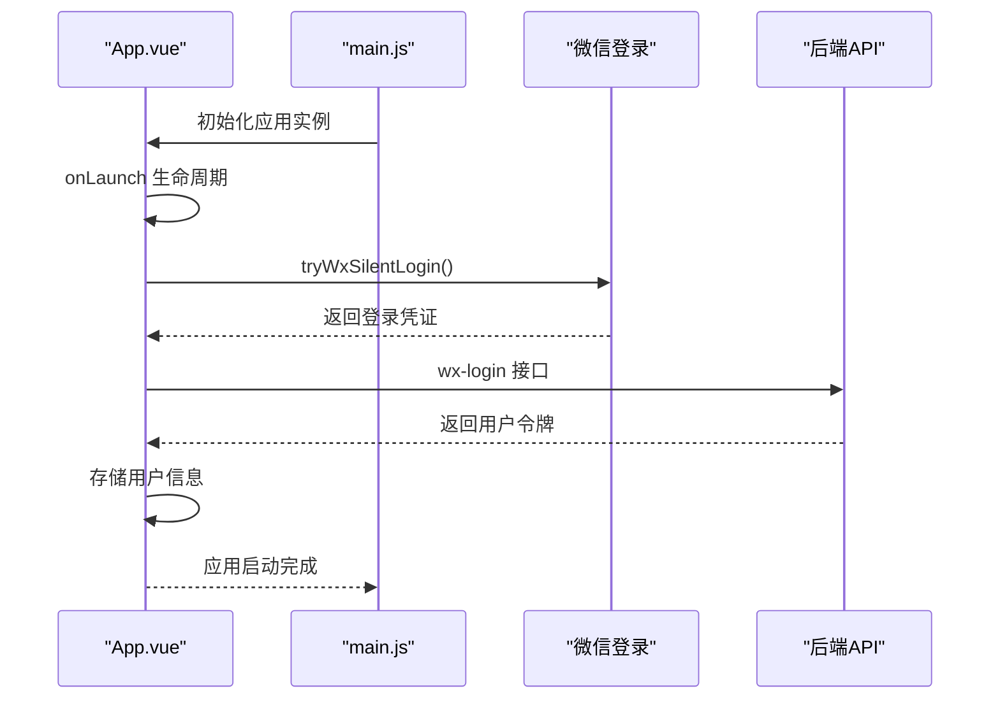

**图表来源**
- [main.js:14-22](file://frontend/miniprogram/main.js#L14-L22)
- [App.vue:13-38](file://frontend/miniprogram/App.vue#L13-L38)

### 布局组件系统

布局组件采用组合式API设计，提供统一的页面容器：

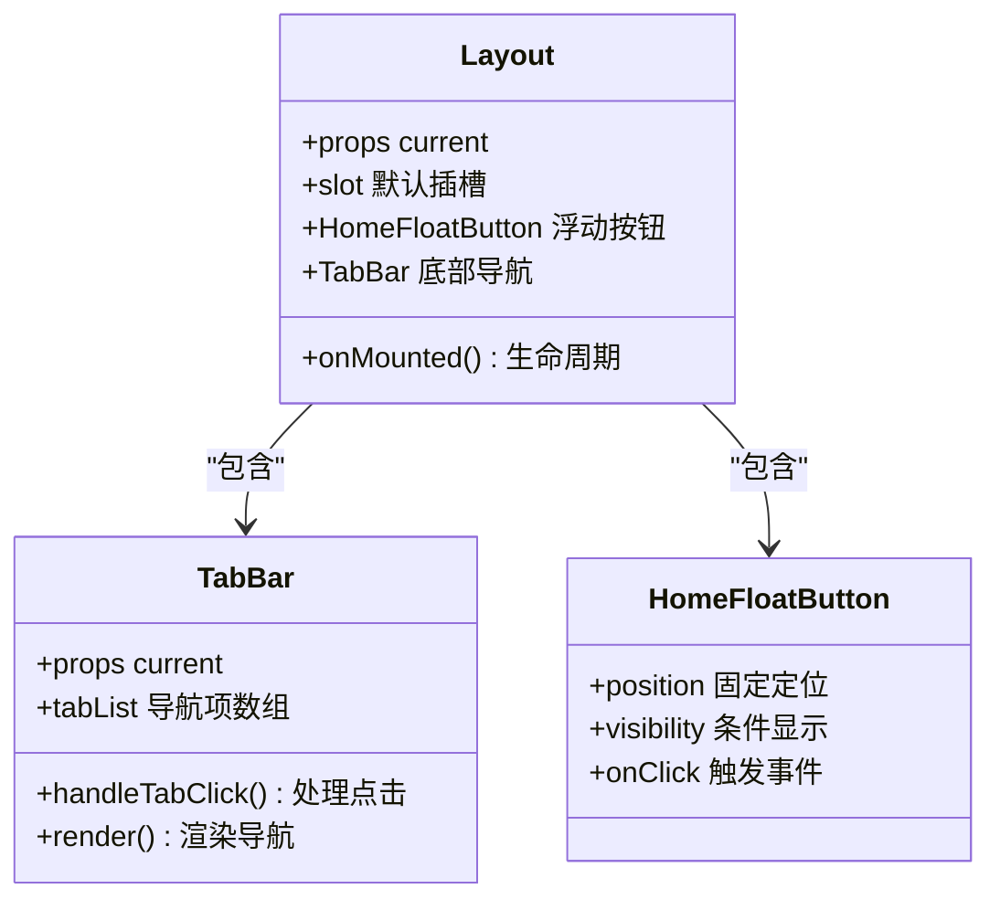

**图表来源**
- [Layout.vue:9-18](file://frontend/miniprogram/components/Layout.vue#L9-L18)
- [TabBar.vue:25-38](file://frontend/miniprogram/components/TabBar.vue#L25-L38)

**章节来源**
- [Layout.vue:1-24](file://frontend/miniprogram/components/Layout.vue#L1-L24)
- [TabBar.vue:1-99](file://frontend/miniprogram/components/TabBar.vue#L1-L99)

## 架构概览

应用采用分层架构设计，各层职责清晰：

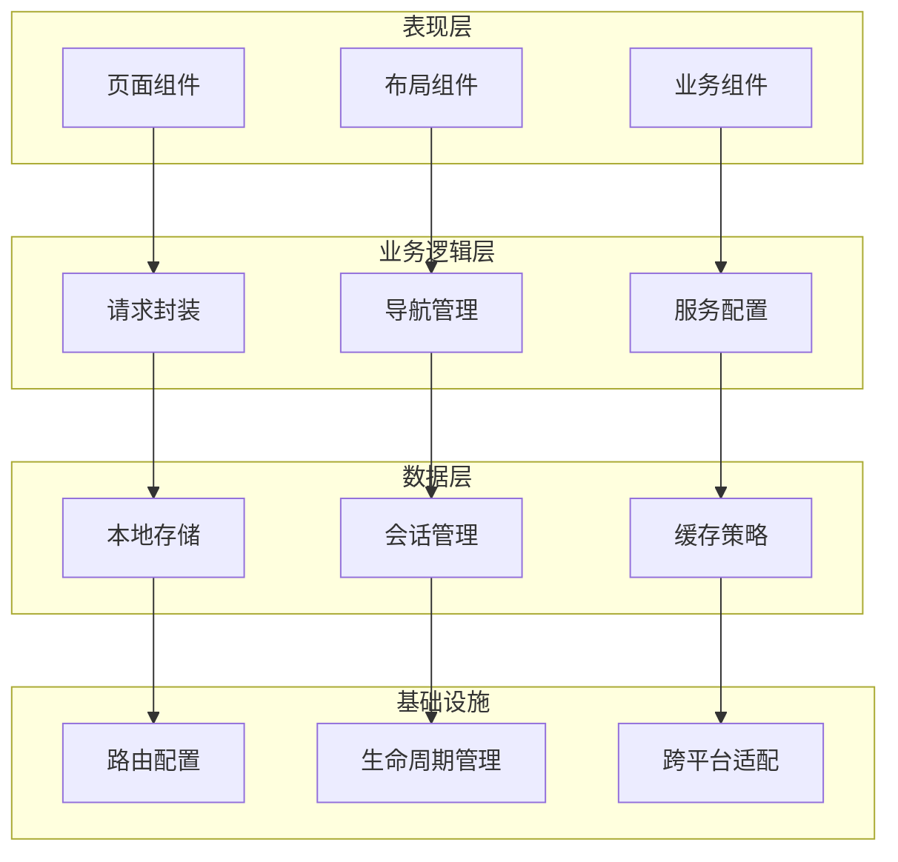

**图表来源**
- [request.js:59-134](file://frontend/miniprogram/utils/request.js#L59-L134)
- [nav.js:3-35](file://frontend/miniprogram/utils/nav.js#L3-L35)
- [services.js:1-65](file://frontend/miniprogram/utils/services.js#L1-L65)

## 详细组件分析

### 首页设计

首页采用沉浸式设计，结合轮播图、功能网格和服务推荐：

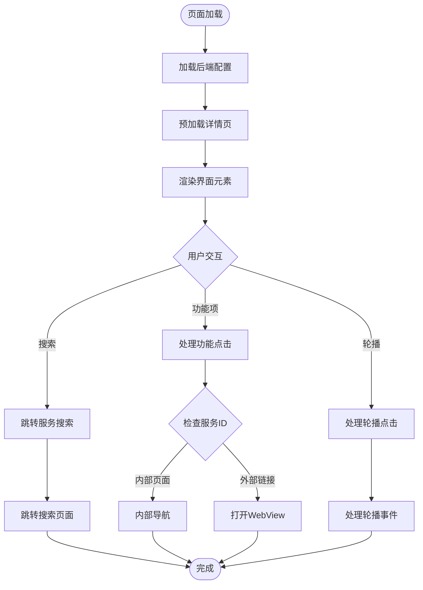

**图表来源**
- [home/index.vue:324-341](file://frontend/miniprogram/pages/home/index.vue#L324-L341)
- [home/index.vue:263-290](file://frontend/miniprogram/pages/home/index.vue#L263-L290)

首页核心特性包括：
- **沉浸式背景**：视频背景配合遮罩效果
- **功能网格**：服务分类展示，支持分页显示
- **通知系统**：垂直滚动通知栏
- **推荐内容**：精选案例和服务中心
- **下拉刷新**：集成下拉刷新功能

**章节来源**
- [home/index.vue:1-714](file://frontend/miniprogram/pages/home/index.vue#L1-L714)

### 服务页面

服务页面采用分组展示模式，支持搜索过滤：

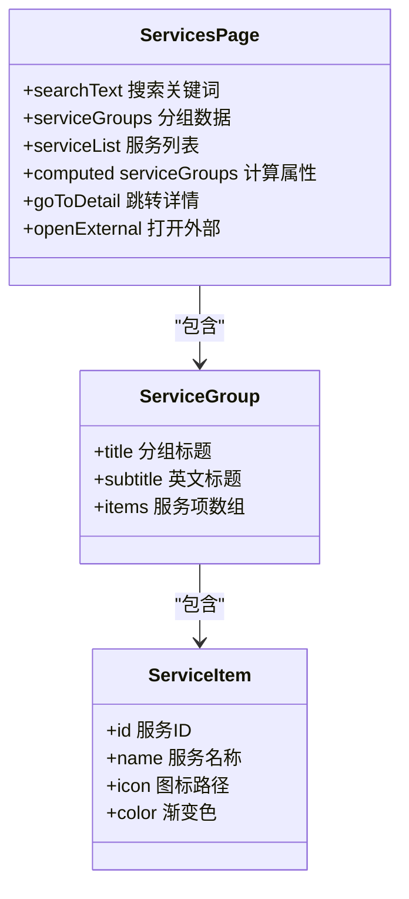

**图表来源**
- [services/index.vue:43-91](file://frontend/miniprogram/pages/services/index.vue#L43-L91)
- [services.js:19-41](file://frontend/miniprogram/utils/services.js#L19-L41)

**章节来源**
- [services/index.vue:1-208](file://frontend/miniprogram/pages/services/index.vue#L1-L208)
- [services.js:1-65](file://frontend/miniprogram/utils/services.js#L1-L65)

### 申请页面

申请页面支持多种服务类型的动态表单：

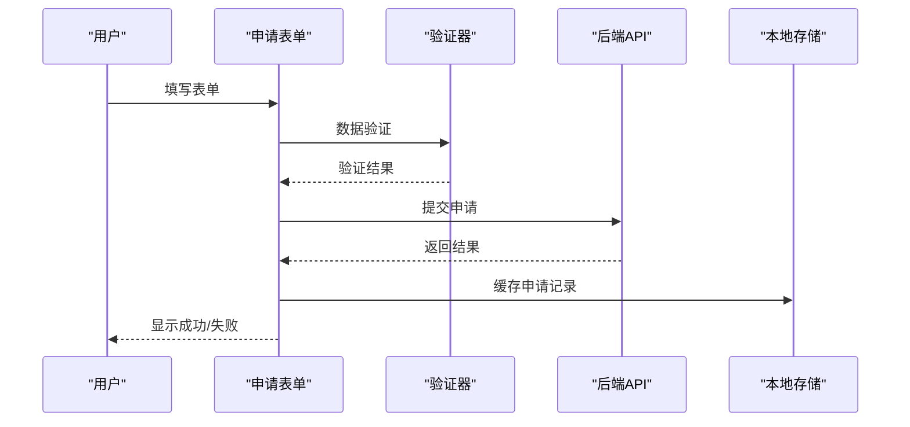

**图表来源**
- [services/apply.vue:574-651](file://frontend/miniprogram/pages/services/apply.vue#L574-L651)
- [request.js:19-34](file://frontend/miniprogram/utils/request.js#L19-L34)

申请页面特性：
- **动态表单**：根据服务ID显示不同字段
- **图片上传**：支持多张图片上传和预览
- **状态管理**：完整的申请状态跟踪
- **错误处理**：完善的异常处理机制

**章节来源**
- [services/apply.vue:1-699](file://frontend/miniprogram/pages/services/apply.vue#L1-L699)

### 个人中心

个人中心提供用户管理和系统设置功能：

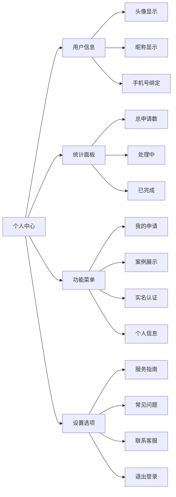

**图表来源**
- [mine/index.vue:124-271](file://frontend/miniprogram/pages/mine/index.vue#L124-L271)

**章节来源**
- [mine/index.vue:1-451](file://frontend/miniprogram/pages/mine/index.vue#L1-L451)

### 登录页面

登录页面支持多种登录方式：

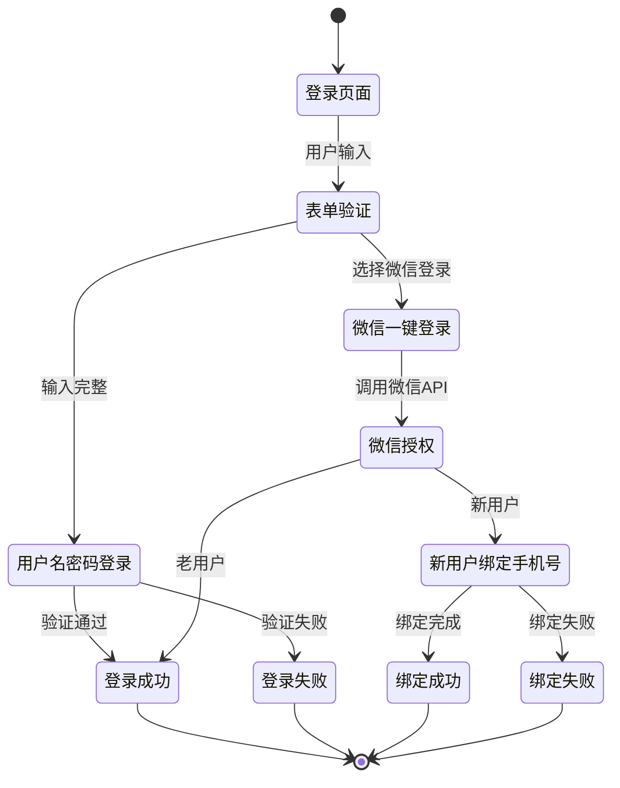

**图表来源**
- [login/index.vue:81-114](file://frontend/miniprogram/pages/login/index.vue#L81-L114)
- [login/index.vue:120-158](file://frontend/miniprogram/pages/login/index.vue#L120-L158)

**章节来源**
- [login/index.vue:1-387](file://frontend/miniprogram/pages/login/index.vue#L1-L387)

## 依赖关系分析

### 路由配置与页面映射

应用采用集中式路由配置，pages.json定义所有页面路径和样式：

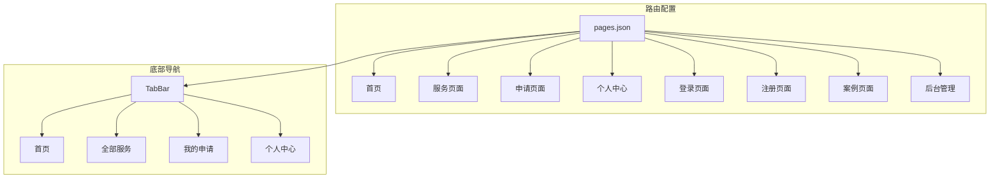

**图表来源**
- [pages.json:138-161](file://frontend/miniprogram/pages.json#L138-L161)
- [TabBar.vue:28-33](file://frontend/miniprogram/components/TabBar.vue#L28-L33)

### 请求与状态管理

应用采用统一的请求封装和状态管理：

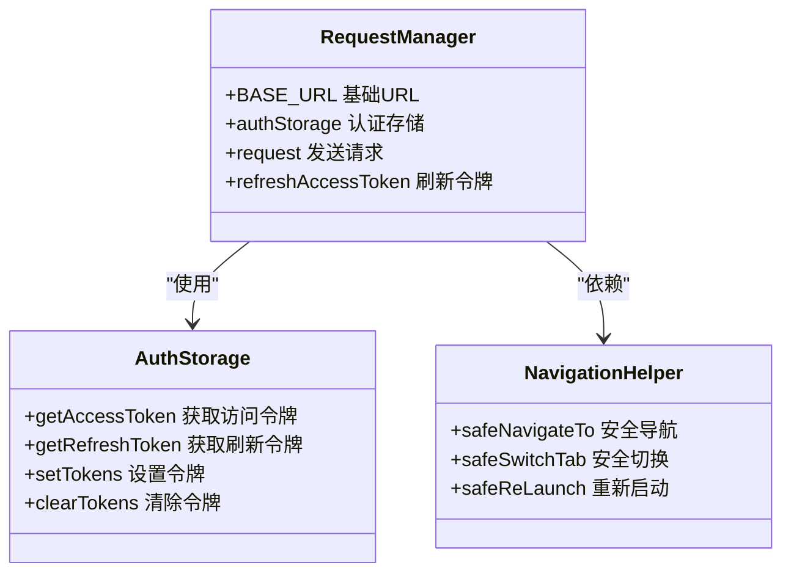

**图表来源**
- [request.js:59-134](file://frontend/miniprogram/utils/request.js#L59-L134)
- [nav.js:3-35](file://frontend/miniprogram/utils/nav.js#L3-L35)

**章节来源**
- [pages.json:1-163](file://frontend/miniprogram/pages.json#L1-L163)
- [request.js:1-144](file://frontend/miniprogram/utils/request.js#L1-L144)
- [nav.js:1-35](file://frontend/miniprogram/utils/nav.js#L1-L35)

## 性能考虑

### 资源优化策略

1. **图片资源优化**
   - 使用SVG矢量图标，支持任意缩放
   - 图片懒加载和预加载策略
   - 合理的图片尺寸和格式选择

2. **网络请求优化**
   - Token自动刷新机制
   - 请求队列排队处理
   - 错误重试和降级策略

3. **页面渲染优化**
   - 组件按需加载
   - 虚拟列表实现
   - 防抖节流处理

4. **内存管理**
   - 组件销毁清理
   - 事件监听器移除
   - 大对象及时释放

### 性能监控指标

- **首屏加载时间**：目标<3秒
- **页面切换延迟**：目标<200ms
- **内存占用**：持续监控，避免泄漏
- **网络请求成功率**：>99%

## 故障排除指南

### 常见问题诊断

1. **登录失败问题**
   ```mermaid
flowchart TD
A[登录失败] --> B{检查网络}
B --> |网络正常| C[检查凭证]
B --> |网络异常| D[提示网络错误]
C --> |凭证无效| E[重新登录]
C --> |凭证有效| F[检查服务器]
F --> |服务器异常| G[联系运维]
F --> |服务器正常| H[检查代码]
```

2. **页面空白问题**
   - 检查组件导入路径
   - 验证数据接口响应
   - 查看控制台错误日志

3. **图片加载失败**
   - 验证图片URL有效性
   - 检查CDN配置
   - 确认跨域设置

**章节来源**
- [request.js:117-123](file://frontend/miniprogram/utils/request.js#L117-L123)
- [login/index.vue:107-114](file://frontend/miniprogram/pages/login/index.vue#L107-L114)

## 结论

本架构文档详细阐述了低空飞行服务平台移动端应用的设计思路和技术实现。通过UniApp框架实现了跨平台兼容，采用模块化组件设计提升了代码复用性，通过统一的请求封装和状态管理确保了系统的稳定性和可维护性。页面采用现代化的设计理念，提供了良好的用户体验。建议在后续开发中继续优化性能指标，完善错误处理机制，并持续改进用户体验。

## 附录

### 开发环境配置

1. **Node.js版本要求**：>=16.0.0
2. **HBuilderX版本**：最新稳定版
3. **微信开发者工具**：最新版本
4. **依赖包管理**：npm/yarn

### 调试技巧

1. **远程调试**
   - 使用微信开发者工具
   - 启用真机调试模式
   - 查看网络请求详情

2. **性能分析**
   - 使用性能面板监控
   - 分析内存使用情况
   - 监控页面渲染性能

3. **错误追踪**
   - 启用详细日志
   - 捕获异常信息
   - 记录用户操作轨迹

### 发布流程

1. **构建准备**
   - 更新版本号
   - 配置生产环境变量
   - 生成证书文件

2. **代码检查**
   - 运行单元测试
   - 代码质量扫描
   - 性能基准测试

3. **打包发布**
   - 生成小程序包
   - 上传到平台
   - 提交审核

4. **监控维护**
   - 监控应用状态
   - 收集用户反馈
   - 及时修复问题