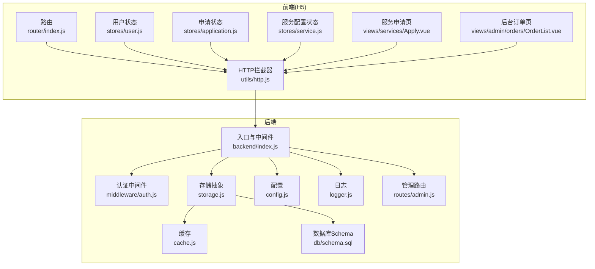
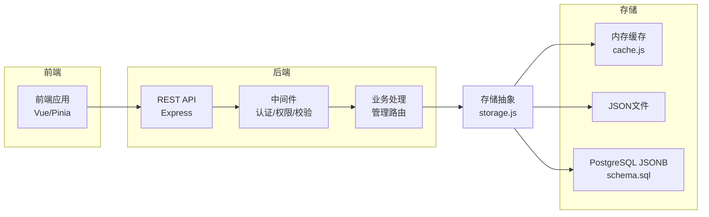
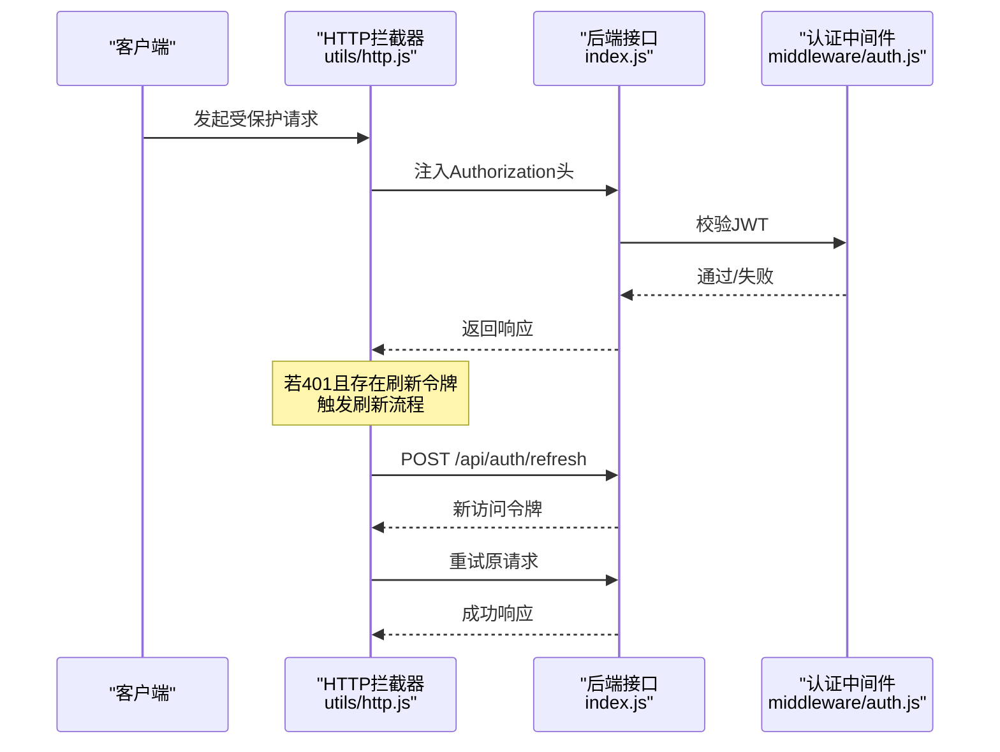
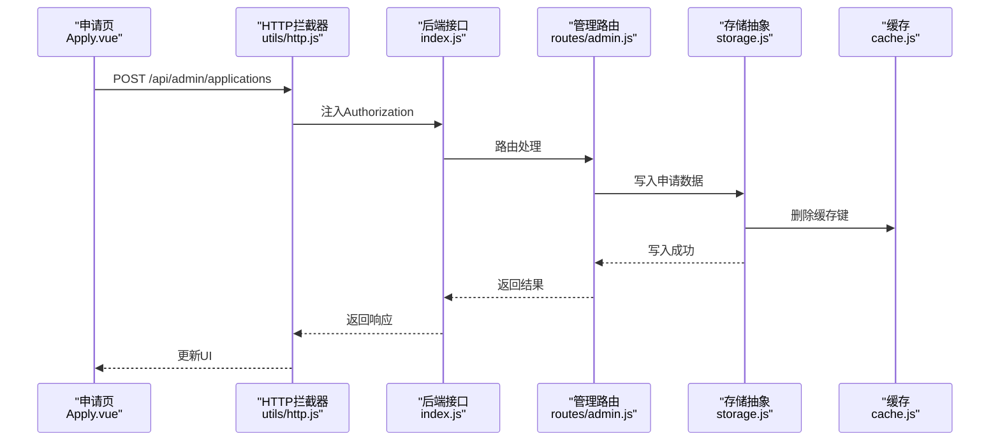
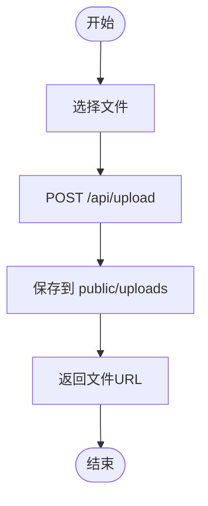
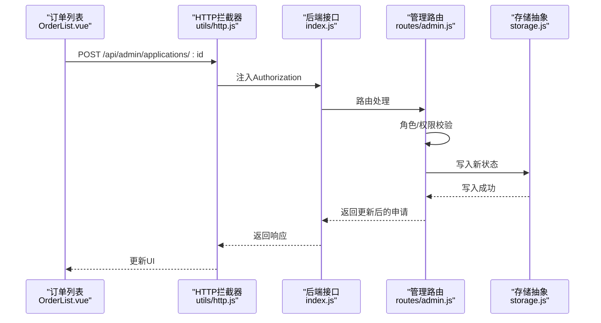
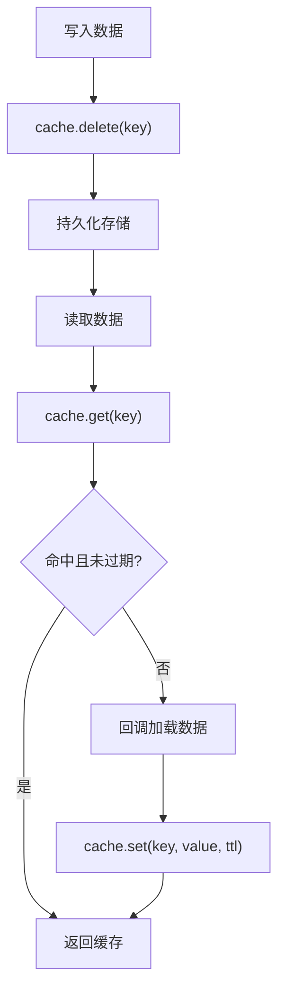
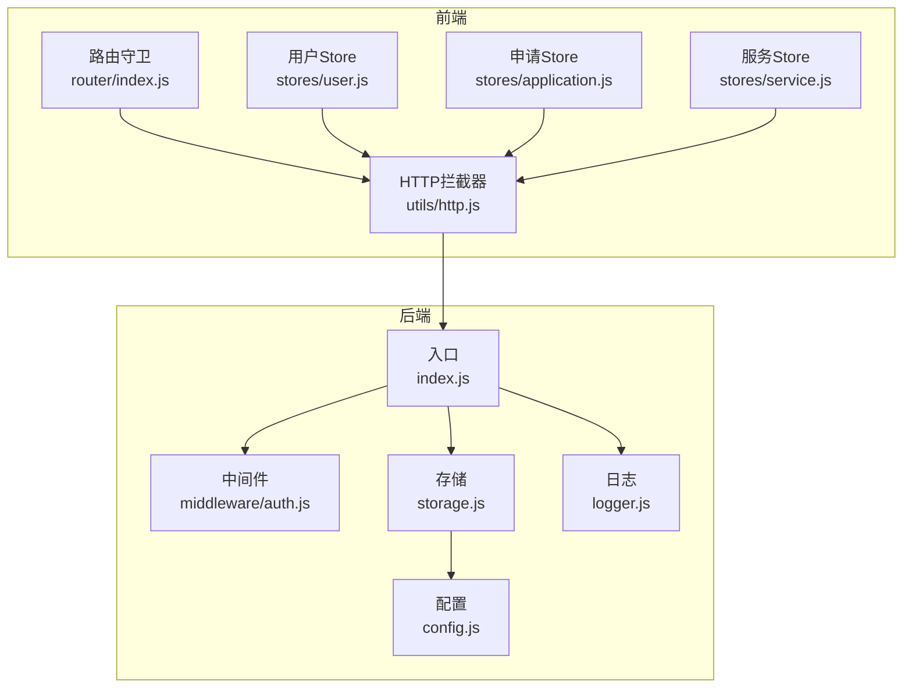

# 数据流架构

<cite>
**本文引用的文件**
- [backend/index.js](file://backend/index.js)
- [backend/storage.js](file://backend/storage.js)
- [backend/cache.js](file://backend/cache.js)
- [backend/routes/admin.js](file://backend/routes/admin.js)
- [backend/middleware/auth.js](file://backend/middleware/auth.js)
- [backend/db/schema.sql](file://backend/db/schema.sql)
- [backend/config.js](file://backend/config.js)
- [backend/logger.js](file://backend/logger.js)
- [frontend/h5/src/utils/http.js](file://frontend/h5/src/utils/http.js)
- [frontend/h5/src/router/index.js](file://frontend/h5/src/router/index.js)
- [frontend/h5/src/stores/user.js](file://frontend/h5/src/stores/user.js)
- [frontend/h5/src/stores/application.js](file://frontend/h5/src/stores/application.js)
- [frontend/h5/src/stores/service.js](file://frontend/h5/src/stores/service.js)
- [frontend/h5/src/views/services/Apply.vue](file://frontend/h5/src/views/services/Apply.vue)
- [frontend/h5/src/views/admin/orders/orderList.vue](file://frontend/h5/src/views/admin/orders/OrderList.vue)
</cite>

## 目录
1. [引言](#引言)
2. [项目结构](#项目结构)
3. [核心组件](#核心组件)
4. [架构总览](#架构总览)
5. [详细组件分析](#详细组件分析)
6. [依赖关系分析](#依赖关系分析)
7. [性能考量](#性能考量)
8. [故障排查指南](#故障排查指南)
9. [结论](#结论)
10. [附录](#附录)

## 引言
本文件面向低空飞行服务平台，系统性梳理数据流架构，覆盖用户数据流、服务申请数据流、文件上传数据流、状态变更数据流等关键路径，解释从前端状态管理到后端存储的完整链路；阐述缓存策略、数据同步机制与一致性保障；提供数据流图与时序图，并给出数据访问模式与性能优化建议。

## 项目结构
系统采用前后端分离架构：
- 前端（H5）基于 Vue + Pinia，负责用户态与页面交互、状态管理与网络请求拦截。
- 后端基于 Express，提供 REST API、认证鉴权、数据持久化与缓存。

图表来源
- [frontend/h5/src/router/index.js:150-227](file://frontend/h5/src/router/index.js#L150-L227)
- [frontend/h5/src/utils/http.js:1-99](file://frontend/h5/src/utils/http.js#L1-L99)
- [frontend/h5/src/stores/user.js:1-177](file://frontend/h5/src/stores/user.js#L1-L177)
- [frontend/h5/src/stores/application.js:1-177](file://frontend/h5/src/stores/application.js#L1-L177)
- [frontend/h5/src/stores/service.js:1-164](file://frontend/h5/src/stores/service.js#L1-L164)
- [frontend/h5/src/views/services/Apply.vue:1-800](file://frontend/h5/src/views/services/Apply.vue#L1-L800)
- [frontend/h5/src/views/admin/orders/OrderList.vue:1-258](file://frontend/h5/src/views/admin/orders/OrderList.vue#L1-L258)
- [backend/index.js:1-1401](file://backend/index.js#L1-L1401)
- [backend/middleware/auth.js:1-168](file://backend/middleware/auth.js#L1-L168)
- [backend/storage.js:1-197](file://backend/storage.js#L1-L197)
- [backend/cache.js:1-119](file://backend/cache.js#L1-L119)
- [backend/db/schema.sql:1-10](file://backend/db/schema.sql#L1-L10)
- [backend/config.js:1-123](file://backend/config.js#L1-L123)
- [backend/logger.js:1-104](file://backend/logger.js#L1-L104)

章节来源
- [backend/index.js:1-1401](file://backend/index.js#L1-L1401)
- [backend/storage.js:1-197](file://backend/storage.js#L1-L197)
- [backend/cache.js:1-119](file://backend/cache.js#L1-L119)
- [backend/routes/admin.js:1-514](file://backend/routes/admin.js#L1-L514)
- [backend/middleware/auth.js:1-168](file://backend/middleware/auth.js#L1-L168)
- [backend/db/schema.sql:1-10](file://backend/db/schema.sql#L1-L10)
- [backend/config.js:1-123](file://backend/config.js#L1-L123)
- [backend/logger.js:1-104](file://backend/logger.js#L1-L104)
- [frontend/h5/src/utils/http.js:1-99](file://frontend/h5/src/utils/http.js#L1-L99)
- [frontend/h5/src/router/index.js:150-227](file://frontend/h5/src/router/index.js#L150-L227)
- [frontend/h5/src/stores/user.js:1-177](file://frontend/h5/src/stores/user.js#L1-L177)
- [frontend/h5/src/stores/application.js:1-177](file://frontend/h5/src/stores/application.js#L1-L177)
- [frontend/h5/src/stores/service.js:1-164](file://frontend/h5/src/stores/service.js#L1-L164)
- [frontend/h5/src/views/services/Apply.vue:1-800](file://frontend/h5/src/views/services/Apply.vue#L1-L800)
- [frontend/h5/src/views/admin/orders/OrderList.vue:1-258](file://frontend/h5/src/views/admin/orders/OrderList.vue#L1-L258)

## 核心组件
- 前端状态管理（Pinia）
  - 用户状态：登录、登出、刷新用户信息、角色判断、本地持久化。
  - 申请状态：申请列表、分页、筛选、状态更新、导出。
  - 服务配置状态：服务配置读取/更新、研学展示数据读取/更新。
- HTTP拦截器：统一注入 Authorization，自动刷新令牌，队列化并发刷新请求。
- 后端存储与缓存：JSON文件或PostgreSQL JSONB 存储，内存缓存+TTL，写入后主动失效。
- 认证与权限：JWT 验证、可选认证、角色校验、速率限制。
- 管理路由：申请列表、状态更新、导出、用户与评价管理、服务配置管理。

章节来源
- [frontend/h5/src/stores/user.js:1-177](file://frontend/h5/src/stores/user.js#L1-L177)
- [frontend/h5/src/stores/application.js:1-177](file://frontend/h5/src/stores/application.js#L1-L177)
- [frontend/h5/src/stores/service.js:1-164](file://frontend/h5/src/stores/service.js#L1-L164)
- [frontend/h5/src/utils/http.js:1-99](file://frontend/h5/src/utils/http.js#L1-L99)
- [backend/storage.js:1-197](file://backend/storage.js#L1-L197)
- [backend/cache.js:1-119](file://backend/cache.js#L1-L119)
- [backend/middleware/auth.js:1-168](file://backend/middleware/auth.js#L1-L168)
- [backend/routes/admin.js:1-514](file://backend/routes/admin.js#L1-L514)

## 架构总览
系统数据流自顶向下分为三层：
- 表现层（前端）：页面组件与状态管理，发起网络请求，维护本地状态。
- 服务层（后端）：路由处理、中间件（认证/权限/校验）、业务逻辑、数据访问。
- 数据层（存储）：内存缓存、JSON文件或PostgreSQL JSONB。

图表来源
- [backend/index.js:1-1401](file://backend/index.js#L1-L1401)
- [backend/storage.js:1-197](file://backend/storage.js#L1-L197)
- [backend/cache.js:1-119](file://backend/cache.js#L1-L119)
- [backend/db/schema.sql:1-10](file://backend/db/schema.sql#L1-L10)
- [backend/middleware/auth.js:1-168](file://backend/middleware/auth.js#L1-L168)
- [backend/routes/admin.js:1-514](file://backend/routes/admin.js#L1-L514)

## 详细组件分析

### 用户数据流（登录/登出/令牌刷新）
- 前端
  - 登录/注册：调用后端接口，成功后写入本地存储与 Pinia。
  - 登出：调用后端接口，清空本地状态。
  - 令牌刷新：拦截器检测401，使用刷新令牌换取新访问令牌，重试原请求。
- 后端
  - JWT签发与校验，支持可选认证与角色限制。
  - 登录/注册/刷新/登出接口，写入/清除刷新令牌。

图表来源
- [frontend/h5/src/utils/http.js:1-99](file://frontend/h5/src/utils/http.js#L1-L99)
- [backend/index.js:434-693](file://backend/index.js#L434-L693)
- [backend/middleware/auth.js:1-168](file://backend/middleware/auth.js#L1-L168)

章节来源
- [frontend/h5/src/stores/user.js:1-177](file://frontend/h5/src/stores/user.js#L1-L177)
- [frontend/h5/src/utils/http.js:1-99](file://frontend/h5/src/utils/http.js#L1-L99)
- [backend/index.js:434-693](file://backend/index.js#L434-L693)
- [backend/middleware/auth.js:1-168](file://backend/middleware/auth.js#L1-L168)

### 服务申请数据流（前端表单到后端存储）
- 前端
  - 服务申请页根据服务ID渲染不同表单字段，提交时序列化表单数据。
  - 订单管理页拉取申请列表，支持按日期范围筛选与导出。
- 后端
  - 管理路由提供申请列表、状态更新、导出等接口。
  - 写入申请数据时主动失效缓存，确保后续读取一致。

图表来源
- [frontend/h5/src/views/services/Apply.vue:1-800](file://frontend/h5/src/views/services/Apply.vue#L1-L800)
- [frontend/h5/src/utils/http.js:1-99](file://frontend/h5/src/utils/http.js#L1-L99)
- [backend/routes/admin.js:116-166](file://backend/routes/admin.js#L116-L166)
- [backend/storage.js:154-162](file://backend/storage.js#L154-L162)
- [backend/cache.js:108-119](file://backend/cache.js#L108-L119)

章节来源
- [frontend/h5/src/views/services/Apply.vue:1-800](file://frontend/h5/src/views/services/Apply.vue#L1-L800)
- [frontend/h5/src/views/admin/orders/OrderList.vue:1-258](file://frontend/h5/src/views/admin/orders/OrderList.vue#L1-L258)
- [backend/routes/admin.js:66-111](file://backend/routes/admin.js#L66-L111)
- [backend/storage.js:154-162](file://backend/storage.js#L154-L162)

### 文件上传数据流（图片/视频上传）
- 前端
  - 使用上传组件选择文件，提交到后端上传接口。
- 后端
  - 基于Multer保存到磁盘目录，返回访问URL。

图表来源
- [backend/index.js:278-285](file://backend/index.js#L278-L285)

章节来源
- [backend/index.js:261-285](file://backend/index.js#L261-L285)

### 状态变更数据流（后台订单状态更新）
- 前端
  - 订单列表页点击状态弹窗，选择新状态后提交。
- 后端
  - 管理路由校验角色与权限，更新状态并写回存储。

图表来源
- [frontend/h5/src/views/admin/orders/OrderList.vue:212-226](file://frontend/h5/src/views/admin/orders/OrderList.vue#L212-L226)
- [backend/routes/admin.js:116-166](file://backend/routes/admin.js#L116-L166)
- [backend/storage.js:154-162](file://backend/storage.js#L154-L162)

章节来源
- [frontend/h5/src/views/admin/orders/OrderList.vue:1-258](file://frontend/h5/src/views/admin/orders/OrderList.vue#L1-L258)
- [backend/routes/admin.js:116-166](file://backend/routes/admin.js#L116-L166)

### 数据缓存策略与一致性
- 缓存策略
  - 内存缓存：Map结构，带TTL，定时清理过期项。
  - 缓存键：用户、申请、案例、服务配置、评价等。
  - 读取：getOrSet，命中直接返回，未命中回调加载并写入缓存。
  - 写入：写入后删除对应缓存键，确保下一次读取一致。
- 一致性
  - 写操作后主动失效缓存，避免脏读。
  - 读多写少场景（案例、服务配置）采用较长TTL，降低IO压力。
  - 写少读多场景（用户、申请、评价）采用较短TTL，保证实时性。

图表来源
- [backend/cache.js:1-119](file://backend/cache.js#L1-L119)
- [backend/storage.js:134-181](file://backend/storage.js#L134-L181)

章节来源
- [backend/cache.js:1-119](file://backend/cache.js#L1-L119)
- [backend/storage.js:134-181](file://backend/storage.js#L134-L181)

### 数据同步机制
- 前端状态同步
  - Pinia Store 作为单一事实源，组件通过 actions 与 getters 读写状态。
  - 订单状态更新后，同时更新列表与详情项，保证UI一致性。
- 后端数据同步
  - 写入申请/用户/配置等数据后，删除对应缓存键，确保下次读取来自最新存储。
  - 管理端导出Excel时，按角色与筛选条件聚合数据，避免重复计算。

章节来源
- [frontend/h5/src/stores/application.js:1-177](file://frontend/h5/src/stores/application.js#L1-L177)
- [backend/routes/admin.js:171-207](file://backend/routes/admin.js#L171-L207)
- [backend/storage.js:134-181](file://backend/storage.js#L134-L181)

## 依赖关系分析
- 前端依赖
  - 路由守卫：SSO授权码处理、后台管理权限校验。
  - HTTP拦截器：统一注入Authorization、刷新令牌、队列化并发刷新。
  - Pinia Store：用户、申请、服务配置状态管理。
- 后端依赖
  - 中间件：认证、权限、速率限制。
  - 存储：JSON文件或PostgreSQL JSONB，统一读写接口。
  - 配置：集中管理JWT、数据库、上传、服务器等配置。
  - 日志：结构化日志，便于审计与排障。

图表来源
- [frontend/h5/src/router/index.js:150-227](file://frontend/h5/src/router/index.js#L150-L227)
- [frontend/h5/src/utils/http.js:1-99](file://frontend/h5/src/utils/http.js#L1-L99)
- [frontend/h5/src/stores/user.js:1-177](file://frontend/h5/src/stores/user.js#L1-L177)
- [frontend/h5/src/stores/application.js:1-177](file://frontend/h5/src/stores/application.js#L1-L177)
- [frontend/h5/src/stores/service.js:1-164](file://frontend/h5/src/stores/service.js#L1-L164)
- [backend/index.js:1-1401](file://backend/index.js#L1-L1401)
- [backend/middleware/auth.js:1-168](file://backend/middleware/auth.js#L1-L168)
- [backend/storage.js:1-197](file://backend/storage.js#L1-L197)
- [backend/config.js:1-123](file://backend/config.js#L1-L123)
- [backend/logger.js:1-104](file://backend/logger.js#L1-L104)

章节来源
- [frontend/h5/src/router/index.js:150-227](file://frontend/h5/src/router/index.js#L150-L227)
- [frontend/h5/src/utils/http.js:1-99](file://frontend/h5/src/utils/http.js#L1-L99)
- [backend/index.js:1-1401](file://backend/index.js#L1-L1401)
- [backend/middleware/auth.js:1-168](file://backend/middleware/auth.js#L1-L168)
- [backend/storage.js:1-197](file://backend/storage.js#L1-L197)
- [backend/config.js:1-123](file://backend/config.js#L1-L123)
- [backend/logger.js:1-104](file://backend/logger.js#L1-L104)

## 性能考量
- 缓存命中率
  - 对案例、服务配置等静态/半静态数据采用较长TTL，显著降低IO。
  - 对申请、用户、评价等动态数据采用较短TTL，平衡实时性与性能。
- 并发控制
  - 令牌刷新采用互斥锁与队列，避免同一用户并发刷新导致的重复请求风暴。
- IO优化
  - 写入后主动失效缓存，避免脏读；批量导出时一次性聚合数据，减少多次读取。
- 存储迁移
  - 支持PostgreSQL JSONB存储，便于未来扩展规范化表结构与索引。

章节来源
- [backend/cache.js:1-119](file://backend/cache.js#L1-L119)
- [backend/storage.js:1-197](file://backend/storage.js#L1-L197)
- [backend/db/schema.sql:1-10](file://backend/db/schema.sql#L1-L10)
- [frontend/h5/src/utils/http.js:1-99](file://frontend/h5/src/utils/http.js#L1-L99)

## 故障排查指南
- 认证失败
  - 检查JWT密钥、过期时间配置；确认前端是否正确注入Authorization头。
- 401与令牌刷新
  - 查看拦截器是否正确触发刷新流程；确认刷新令牌有效且未被后端清除。
- 写入不生效
  - 检查后端写入接口是否调用缓存失效；确认存储文件或数据库连接正常。
- 导出异常
  - 检查管理路由导出逻辑与角色权限；确认Excel生成与响应头设置正确。
- 日志审计
  - 使用结构化日志定位错误上下文，关注请求方法、URL、IP、堆栈与请求体摘要。

章节来源
- [backend/middleware/auth.js:1-168](file://backend/middleware/auth.js#L1-L168)
- [frontend/h5/src/utils/http.js:1-99](file://frontend/h5/src/utils/http.js#L1-L99)
- [backend/storage.js:134-181](file://backend/storage.js#L134-L181)
- [backend/routes/admin.js:171-207](file://backend/routes/admin.js#L171-L207)
- [backend/logger.js:1-104](file://backend/logger.js#L1-L104)

## 结论
本架构以“前端状态管理 + 后端REST + 统一存储抽象”为核心，结合内存缓存与写后失效策略，实现了高效、可扩展的数据流。通过严格的认证与权限控制、结构化日志与配置管理，保障了系统安全性与可观测性。建议在生产环境中强化密钥管理、启用HTTPS与数据库索引，并持续监控缓存命中率与响应延迟，以进一步优化用户体验与系统稳定性。

## 附录
- 关键配置项
  - JWT密钥、访问/刷新令牌有效期、管理员默认口令、微信小程序/公众号配置、SSO接口、数据库类型与连接、上传目录与大小限制、服务器端口与CORS、SM2密钥。
- 数据模型要点
  - 申请、用户、案例、服务配置、评价等数据通过统一存储接口读写，支持JSON文件或PostgreSQL JSONB。
- 前端路由与SSO
  - 支持authcode/jyauthcode参数，自动完成SSO登录并写入本地存储与令牌。

章节来源
- [backend/config.js:1-123](file://backend/config.js#L1-L123)
- [backend/db/schema.sql:1-10](file://backend/db/schema.sql#L1-L10)
- [frontend/h5/src/router/index.js:158-182](file://frontend/h5/src/router/index.js#L158-L182)