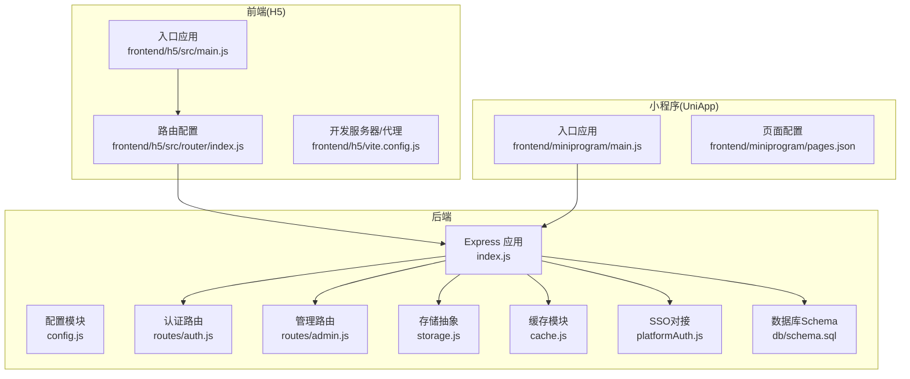
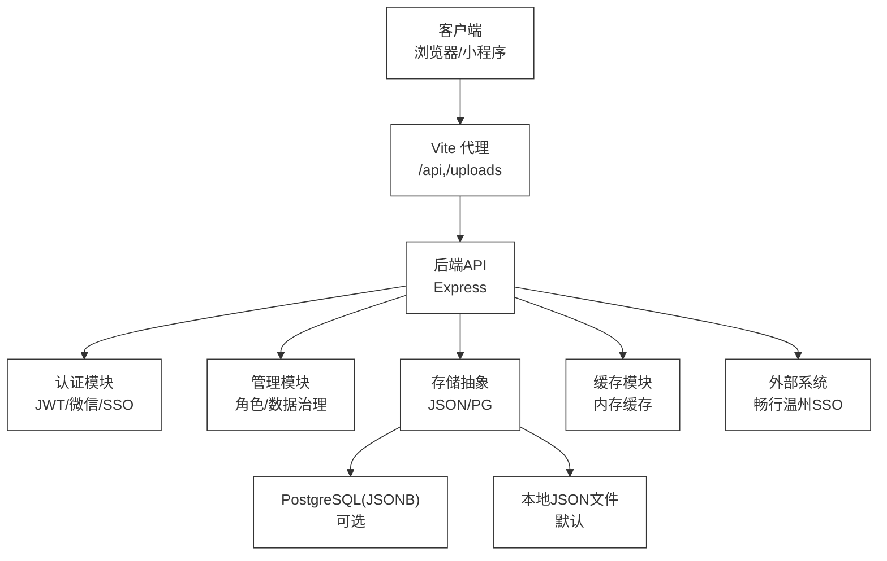
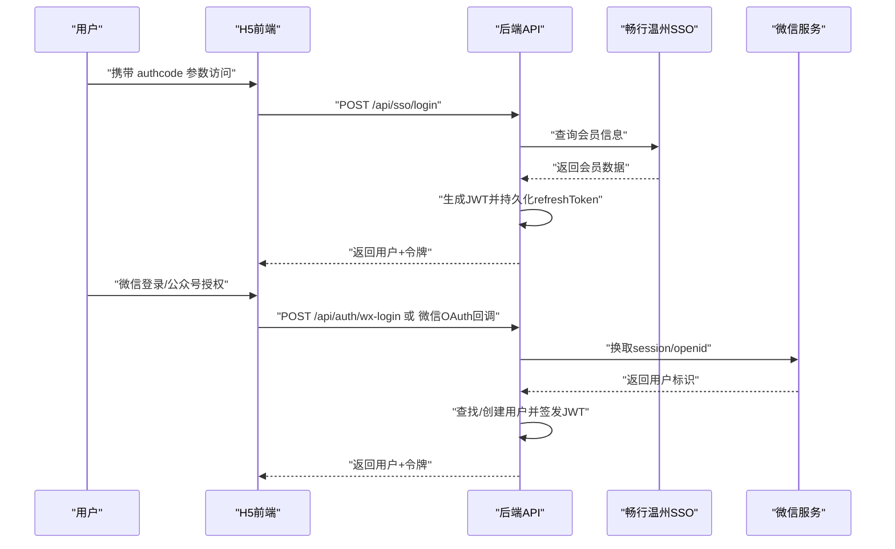
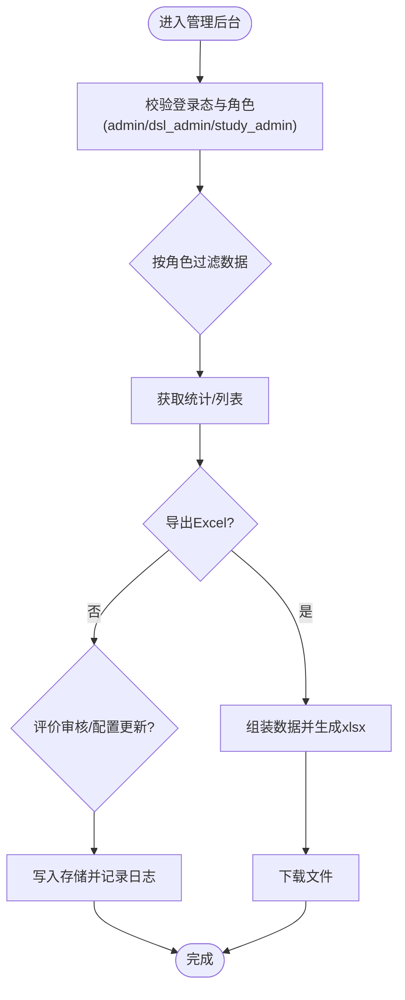
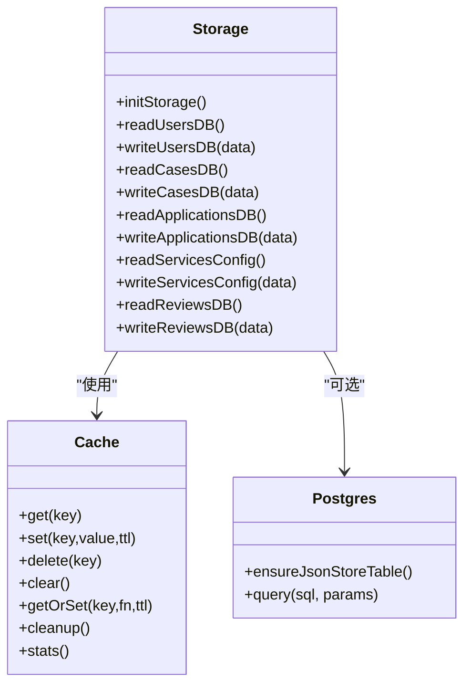
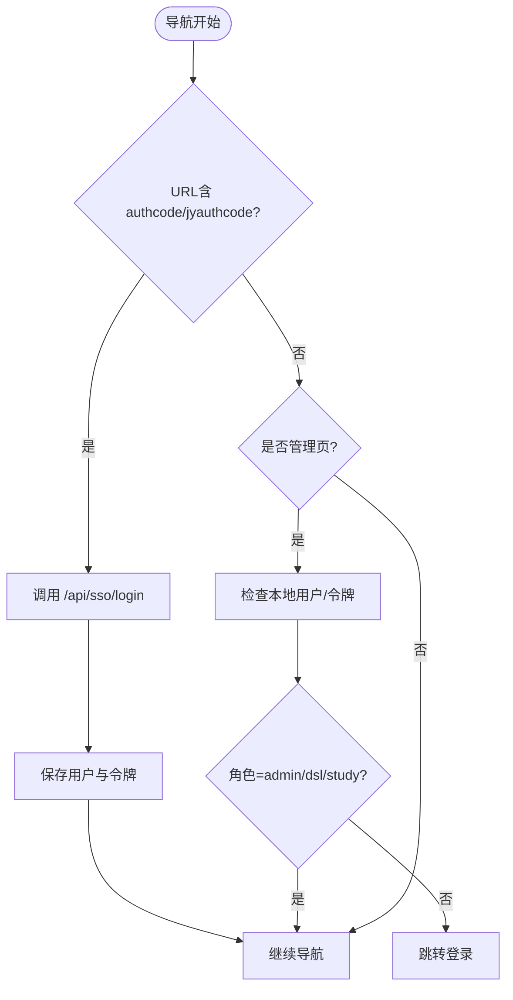
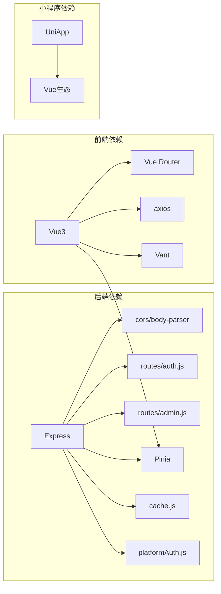

# 整体架构概览

<cite>
**本文档引用的文件**
- [backend/package.json](file://backend/package.json)
- [frontend/h5/package.json](file://frontend/h5/package.json)
- [backend/index.js](file://backend/index.js)
- [backend/config.js](file://backend/config.js)
- [backend/routes/admin.js](file://backend/routes/admin.js)
- [backend/routes/auth.js](file://backend/routes/auth.js)
- [backend/storage.js](file://backend/storage.js)
- [backend/cache.js](file://backend/cache.js)
- [backend/platformAuth.js](file://backend/platformAuth.js)
- [backend/db/schema.sql](file://backend/db/schema.sql)
- [frontend/h5/src/main.js](file://frontend/h5/src/main.js)
- [frontend/h5/src/router/index.js](file://frontend/h5/src/router/index.js)
- [frontend/h5/vite.config.js](file://frontend/h5/vite.config.js)
- [frontend/miniprogram/main.js](file://frontend/miniprogram/main.js)
- [frontend/miniprogram/pages.json](file://frontend/miniprogram/pages.json)
</cite>

## 目录
1. [引言](#引言)
2. [项目结构](#项目结构)
3. [核心组件](#核心组件)
4. [架构总览](#架构总览)
5. [详细组件分析](#详细组件分析)
6. [依赖关系分析](#依赖关系分析)
7. [性能考量](#性能考量)
8. [故障排查指南](#故障排查指南)
9. [结论](#结论)

## 引言
本文件面向低空飞行服务平台的整体架构，聚焦于前后端分离、多端架构（Web端、移动端、小程序）、微服务化设计思路的实现现状与演进方向。文档从系统边界、分层架构（表现层、业务层、数据层）、模块化组织方式、技术选型与权衡、外部依赖与集成点等方面进行系统性梳理，并提供高层架构图与组件交互图，帮助开发者快速理解系统设计。

## 项目结构
项目采用前后端分离的单仓库多模块布局：
- 后端（Node.js + Express）：提供REST API、认证鉴权、SSO对接、静态资源服务、文件上传与压缩、缓存与存储抽象。
- 前端（Vue3 + Vite）：H5 Web应用，提供路由守卫、状态管理（Pinia）、HTTP拦截与鉴权。
- 小程序（UniApp）：基于Vue生态的多端适配，统一页面配置与导航栏样式。

图表来源
- [backend/index.js:1-1401](file://backend/index.js#L1-L1401)
- [backend/config.js:1-123](file://backend/config.js#L1-L123)
- [backend/routes/auth.js:1-591](file://backend/routes/auth.js#L1-L591)
- [backend/routes/admin.js:1-514](file://backend/routes/admin.js#L1-L514)
- [backend/storage.js:1-197](file://backend/storage.js#L1-L197)
- [backend/cache.js:1-119](file://backend/cache.js#L1-L119)
- [backend/platformAuth.js:1-177](file://backend/platformAuth.js#L1-L177)
- [backend/db/schema.sql:1-10](file://backend/db/schema.sql#L1-L10)
- [frontend/h5/src/main.js:1-22](file://frontend/h5/src/main.js#L1-L22)
- [frontend/h5/src/router/index.js:1-227](file://frontend/h5/src/router/index.js#L1-L227)
- [frontend/h5/vite.config.js:1-54](file://frontend/h5/vite.config.js#L1-L54)
- [frontend/miniprogram/main.js:1-22](file://frontend/miniprogram/main.js#L1-L22)
- [frontend/miniprogram/pages.json:1-163](file://frontend/miniprogram/pages.json#L1-L163)

章节来源
- [backend/package.json:1-34](file://backend/package.json#L1-L34)
- [frontend/h5/package.json:1-27](file://frontend/h5/package.json#L1-L27)

## 核心组件
- 表现层（前端）
  - H5 Web：Vue3 + Vite，路由守卫负责SSO授权码处理、登录态校验与角色权限控制；代理后端API与上传资源。
  - 小程序：UniApp多端适配，页面配置统一导航样式与TabBar。
- 业务层（后端）
  - Express应用：中间件链路（CORS、BodyParser、输入消毒、静态资源、请求日志），路由模块化（认证、管理、公开接口）。
  - 认证与授权：JWT令牌签发与刷新、基于角色的权限控制、微信公众号/小程序登录、SSO对接。
  - 存储与缓存：统一存储抽象支持JSON文件与PostgreSQL JSONB，内置内存缓存与过期清理。
  - 外部集成：畅行温州平台SSO接口，含SM2签名与SM4加解密。
- 数据层
  - 开发阶段默认JSON文件存储，生产可切换PostgreSQL JSONB表；提供初始化与迁移能力。

章节来源
- [backend/index.js:1-1401](file://backend/index.js#L1-L1401)
- [backend/routes/auth.js:1-591](file://backend/routes/auth.js#L1-L591)
- [backend/routes/admin.js:1-514](file://backend/routes/admin.js#L1-L514)
- [backend/storage.js:1-197](file://backend/storage.js#L1-L197)
- [backend/cache.js:1-119](file://backend/cache.js#L1-L119)
- [backend/platformAuth.js:1-177](file://backend/platformAuth.js#L1-L177)
- [frontend/h5/src/router/index.js:1-227](file://frontend/h5/src/router/index.js#L1-L227)
- [frontend/miniprogram/pages.json:1-163](file://frontend/miniprogram/pages.json#L1-L163)

## 架构总览
系统采用“前后端分离 + 多端同构”的架构模式：
- 前端通过HTTP与后端交互，H5使用Vite代理转发至后端API；小程序通过网络请求直连后端。
- 后端提供统一REST API，内部按功能拆分路由模块，配合中间件实现横切关注点（日志、安全、输入清洗）。
- 存储层通过抽象屏蔽底层差异，初期以JSON文件为主，具备平滑迁移到PostgreSQL的能力。
- 外部依赖主要为SSO平台接口与微信生态，均通过独立模块封装，便于替换与测试。

图表来源
- [backend/index.js:1-1401](file://backend/index.js#L1-L1401)
- [backend/routes/auth.js:1-591](file://backend/routes/auth.js#L1-L591)
- [backend/routes/admin.js:1-514](file://backend/routes/admin.js#L1-L514)
- [backend/storage.js:1-197](file://backend/storage.js#L1-L197)
- [backend/cache.js:1-119](file://backend/cache.js#L1-L119)
- [backend/platformAuth.js:1-177](file://backend/platformAuth.js#L1-L177)
- [frontend/h5/vite.config.js:1-54](file://frontend/h5/vite.config.js#L1-L54)

## 详细组件分析

### 认证与授权流程（SSO/微信/JWT）

图表来源
- [backend/index.js:477-570](file://backend/index.js#L477-L570)
- [backend/routes/auth.js:513-588](file://backend/routes/auth.js#L513-L588)
- [backend/platformAuth.js:165-172](file://backend/platformAuth.js#L165-L172)

章节来源
- [backend/index.js:477-570](file://backend/index.js#L477-L570)
- [backend/routes/auth.js:513-588](file://backend/routes/auth.js#L513-L588)
- [backend/platformAuth.js:165-172](file://backend/platformAuth.js#L165-L172)

### 管理后台数据流（统计/导出/审核）

图表来源
- [backend/routes/admin.js:29-61](file://backend/routes/admin.js#L29-L61)
- [backend/routes/admin.js:171-207](file://backend/routes/admin.js#L171-L207)
- [backend/routes/admin.js:442-481](file://backend/routes/admin.js#L442-L481)

章节来源
- [backend/routes/admin.js:29-61](file://backend/routes/admin.js#L29-L61)
- [backend/routes/admin.js:171-207](file://backend/routes/admin.js#L171-L207)
- [backend/routes/admin.js:442-481](file://backend/routes/admin.js#L442-L481)

### 存储与缓存抽象

图表来源
- [backend/storage.js:1-197](file://backend/storage.js#L1-L197)
- [backend/cache.js:1-119](file://backend/cache.js#L1-L119)
- [backend/db/schema.sql:1-10](file://backend/db/schema.sql#L1-L10)

章节来源
- [backend/storage.js:1-197](file://backend/storage.js#L1-L197)
- [backend/cache.js:1-119](file://backend/cache.js#L1-L119)
- [backend/db/schema.sql:1-10](file://backend/db/schema.sql#L1-L10)

### 前端路由与鉴权守卫

图表来源
- [frontend/h5/src/router/index.js:155-223](file://frontend/h5/src/router/index.js#L155-L223)

章节来源
- [frontend/h5/src/router/index.js:155-223](file://frontend/h5/src/router/index.js#L155-L223)

## 依赖关系分析
- 技术栈与依赖
  - 后端：Express、JWT、bcrypt、Multer、Sharp、Axios、Winston、XLSX、PostgreSQL驱动等。
  - 前端：Vue3、Pinia、Vue Router、Vant、axios、echarts、leaflet等。
  - 小程序：UniApp、Vue生态、基础适配层。
- 关键依赖关系
  - 前端通过Vite代理将/api前缀转发至后端，确保开发时跨域与联调便利。
  - 后端路由模块化，认证与管理路由分别承担不同职责，降低耦合度。
  - 存储抽象与缓存模块解耦数据持久化与读写性能，便于扩展。

图表来源
- [backend/package.json:12-28](file://backend/package.json#L12-L28)
- [frontend/h5/package.json:10-19](file://frontend/h5/package.json#L10-L19)
- [backend/index.js:4-22](file://backend/index.js#L4-L22)
- [frontend/h5/src/main.js:1-22](file://frontend/h5/src/main.js#L1-L22)
- [frontend/miniprogram/main.js:1-22](file://frontend/miniprogram/main.js#L1-L22)

章节来源
- [backend/package.json:12-28](file://backend/package.json#L12-L28)
- [frontend/h5/package.json:10-19](file://frontend/h5/package.json#L10-L19)
- [backend/index.js:4-22](file://backend/index.js#L4-L22)
- [frontend/h5/src/main.js:1-22](file://frontend/h5/src/main.js#L1-L22)
- [frontend/miniprogram/main.js:1-22](file://frontend/miniprogram/main.js#L1-L22)

## 性能考量
- 缓存策略
  - 内存缓存按键粒度设置TTL，热点数据（用户、案例、申请、配置、评价）分层缓存，降低文件IO与数据库压力。
  - 定期清理过期缓存，避免内存泄漏。
- 图片处理
  - 提供图片压缩接口，支持动态尺寸与质量参数，带缓存头，减轻CDN与带宽压力。
- 文件上传
  - 基于Multer磁盘存储，结合Sharp进行压缩，限制最大体积与类型，保障存储与传输效率。
- 数据库迁移
  - JSON文件存储便于开发与演示，生产可无缝切换PostgreSQL JSONB，具备索引与事务能力。

章节来源
- [backend/cache.js:1-119](file://backend/cache.js#L1-L119)
- [backend/index.js:86-114](file://backend/index.js#L86-L114)
- [backend/storage.js:134-181](file://backend/storage.js#L134-L181)
- [backend/db/schema.sql:1-10](file://backend/db/schema.sql#L1-L10)

## 故障排查指南
- 常见问题定位
  - 配置校验：启动时打印配置摘要，若JWT密钥为默认值或微信凭证缺失，需在环境变量中补齐。
  - 日志：请求中间件记录状态码、耗时与IP，便于追踪异常。
  - SSO对接：检查平台地址、机构ID、SM2私钥与SM4密钥配置，确认加解密流程与签名内容。
- 建议排查步骤
  - 确认环境变量与配置文件完整，执行配置校验。
  - 检查代理配置是否正确转发/api与/uploads。
  - 观察缓存命中率与过期情况，必要时清空缓存验证数据一致性。
  - 对接SSO时开启调试输出，核对加密/签名参数与平台返回结果。

章节来源
- [backend/config.js:78-116](file://backend/config.js#L78-L116)
- [backend/index.js:116-128](file://backend/index.js#L116-L128)
- [backend/platformAuth.js:30-38](file://backend/platformAuth.js#L30-L38)

## 结论
本项目在保持轻量与易部署的前提下，实现了前后端分离与多端一致体验。后端通过模块化路由、统一存储与缓存、以及SSO/微信生态集成，构建了可扩展的服务层；前端以Vue3为核心，配合路由守卫与代理机制，提供了良好的开发与运行体验。建议后续在以下方面持续演进：
- 逐步引入微服务化：将认证、订单、内容、评价等子域拆分为独立服务，配合API网关与服务发现。
- 完善可观测性：增加指标采集、分布式追踪与告警，提升线上稳定性。
- 安全加固：强化令牌轮换策略、速率限制与输入校验，定期进行渗透测试。
- 数据库规范化：从JSONB向关系模型演进，建立索引与分区策略，支撑高并发场景。