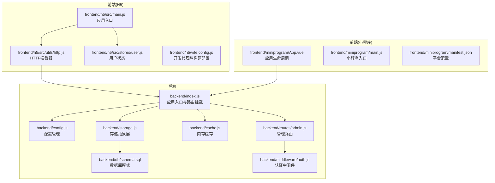
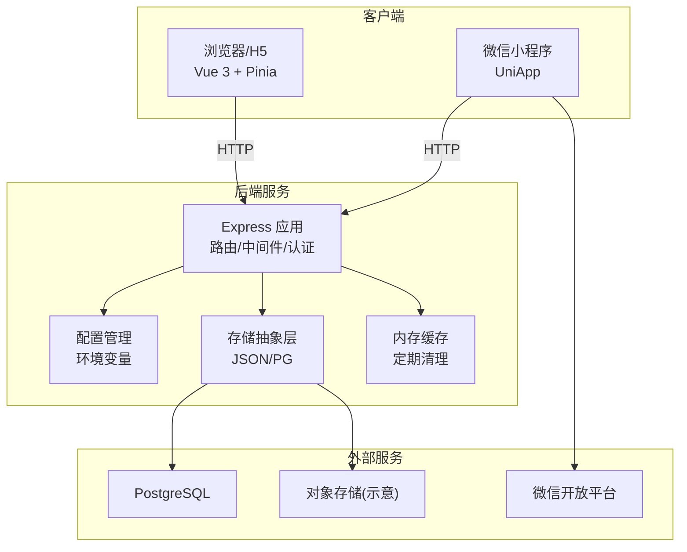
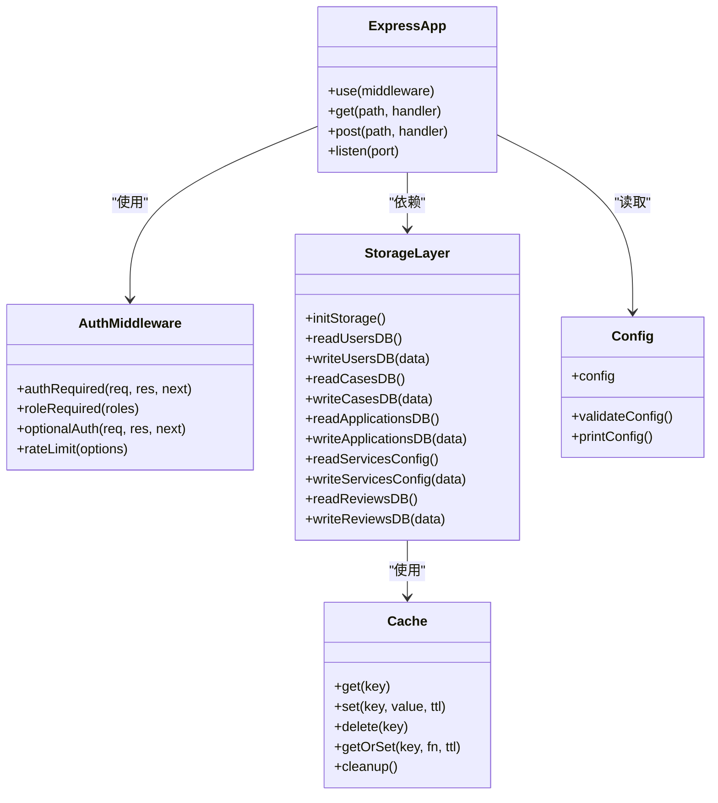
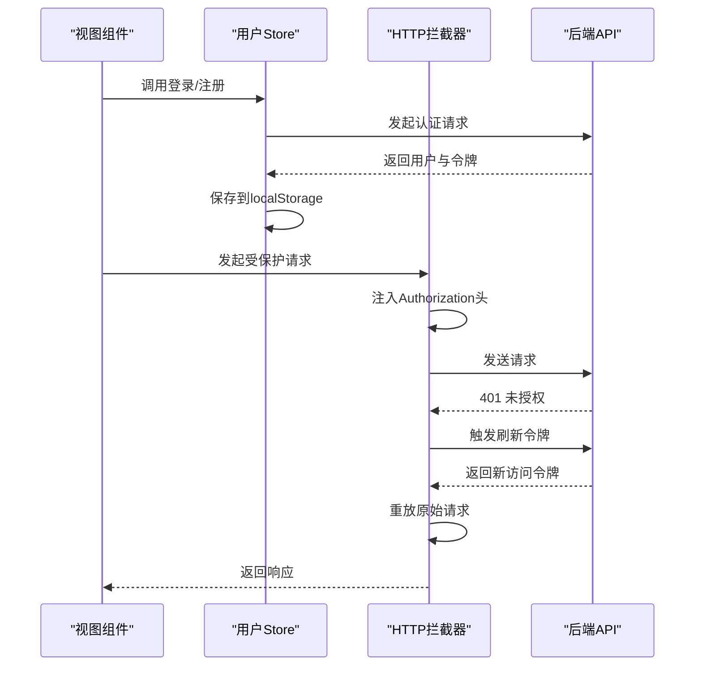
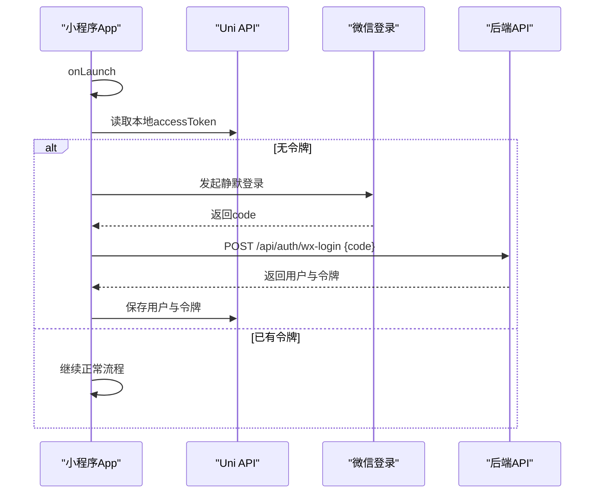
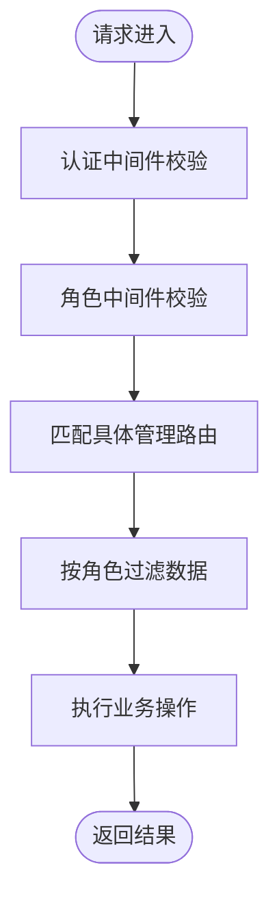
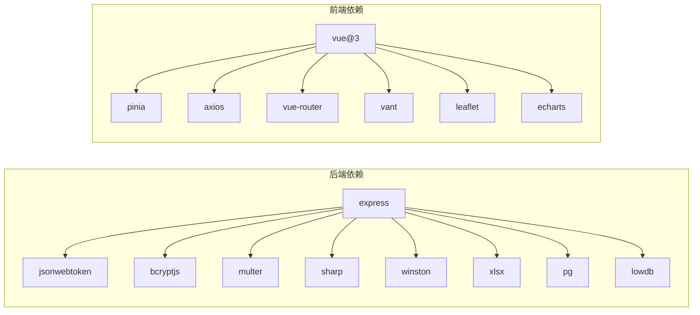

# 系统架构设计

<cite>
**本文档引用的文件**
- [backend/index.js](file://backend/index.js)
- [backend/config.js](file://backend/config.js)
- [backend/package.json](file://backend/package.json)
- [backend/storage.js](file://backend/storage.js)
- [backend/cache.js](file://backend/cache.js)
- [backend/db/schema.sql](file://backend/db/schema.sql)
- [backend/routes/admin.js](file://backend/routes/admin.js)
- [backend/middleware/auth.js](file://backend/middleware/auth.js)
- [frontend/h5/src/main.js](file://frontend/h5/src/main.js)
- [frontend/h5/src/stores/user.js](file://frontend/h5/src/stores/user.js)
- [frontend/h5/src/utils/http.js](file://frontend/h5/src/utils/http.js)
- [frontend/h5/vite.config.js](file://frontend/h5/vite.config.js)
- [frontend/miniprogram/App.vue](file://frontend/miniprogram/App.vue)
- [frontend/miniprogram/main.js](file://frontend/miniprogram/main.js)
- [frontend/miniprogram/manifest.json](file://frontend/miniprogram/manifest.json)
</cite>

## 目录
1. [引言](#引言)
2. [项目结构](#项目结构)
3. [核心组件](#核心组件)
4. [架构总览](#架构总览)
5. [详细组件分析](#详细组件分析)
6. [依赖分析](#依赖分析)
7. [性能考虑](#性能考虑)
8. [故障排除指南](#故障排除指南)
9. [结论](#结论)

## 引言
本系统为低空飞行服务平台，采用前后端分离与多端架构设计，支持Web(H5)、微信小程序等多端访问。后端基于Express构建REST服务，采用JWT进行认证与授权，并通过存储抽象层实现数据持久化；前端采用Vue 3 + Pinia状态管理，移动端基于UniApp跨平台框架。系统具备清晰的分层设计、模块化组织与良好的扩展性，支持从JSON文件到PostgreSQL的存储迁移路径。

## 项目结构
项目采用按功能域划分的目录组织方式，后端与前端分别独立存放，便于维护与扩展。后端包含配置、中间件、路由、存储、缓存、数据库脚本等模块；前端包含H5与小程序两套实现，共享部分工具与状态管理逻辑。

**图表来源**
- [backend/index.js:1-120](file://backend/index.js#L1-L120)
- [backend/config.js:1-123](file://backend/config.js#L1-L123)
- [backend/storage.js:1-63](file://backend/storage.js#L1-L63)
- [backend/cache.js:1-119](file://backend/cache.js#L1-L119)
- [backend/db/schema.sql:1-10](file://backend/db/schema.sql#L1-L10)
- [backend/routes/admin.js:1-50](file://backend/routes/admin.js#L1-L50)
- [backend/middleware/auth.js:1-45](file://backend/middleware/auth.js#L1-L45)
- [frontend/h5/src/main.js:1-22](file://frontend/h5/src/main.js#L1-L22)
- [frontend/h5/src/utils/http.js:1-99](file://frontend/h5/src/utils/http.js#L1-L99)
- [frontend/h5/src/stores/user.js:1-60](file://frontend/h5/src/stores/user.js#L1-L60)
- [frontend/h5/vite.config.js:1-54](file://frontend/h5/vite.config.js#L1-L54)
- [frontend/miniprogram/App.vue:1-45](file://frontend/miniprogram/App.vue#L1-L45)
- [frontend/miniprogram/main.js:1-22](file://frontend/miniprogram/main.js#L1-L22)
- [frontend/miniprogram/manifest.json:1-73](file://frontend/miniprogram/manifest.json#L1-L73)

**章节来源**
- [backend/index.js:1-120](file://backend/index.js#L1-L120)
- [frontend/h5/src/main.js:1-22](file://frontend/h5/src/main.js#L1-L22)
- [frontend/miniprogram/main.js:1-22](file://frontend/miniprogram/main.js#L1-L22)

## 核心组件
- 后端服务：基于Express，提供REST API、JWT认证、输入清洗、CORS、静态资源服务、图片压缩、请求日志、错误处理等能力。
- 存储抽象层：统一读写接口，支持JSON文件与PostgreSQL两种后端，自动选择并提供缓存封装。
- 认证中间件：提供强制认证、可选认证、角色校验与基础速率限制。
- 前端H5：Vue 3 + Pinia，Axios拦截器自动处理刷新令牌与重试队列。
- 移动端：UniApp跨平台，支持微信小程序登录与静默登录流程。
- 配置管理：集中管理JWT、数据库、微信、SSO、上传、服务器等配置项。

**章节来源**
- [backend/index.js:434-693](file://backend/index.js#L434-L693)
- [backend/storage.js:134-181](file://backend/storage.js#L134-L181)
- [backend/middleware/auth.js:11-75](file://backend/middleware/auth.js#L11-L75)
- [frontend/h5/src/stores/user.js:1-177](file://frontend/h5/src/stores/user.js#L1-L177)
- [frontend/h5/src/utils/http.js:19-78](file://frontend/h5/src/utils/http.js#L19-L78)
- [frontend/miniprogram/App.vue:14-37](file://frontend/miniprogram/App.vue#L14-L37)
- [backend/config.js:7-123](file://backend/config.js#L7-L123)

## 架构总览
系统采用前后端分离与多端架构，后端作为统一的数据与业务服务提供者，前端通过HTTP协议访问后端API；移动端通过HTTP或原生SDK访问后端。认证采用JWT，支持刷新令牌机制；存储层支持JSON文件与PostgreSQL，便于平滑迁移。

**图表来源**
- [backend/index.js:1-120](file://backend/index.js#L1-L120)
- [backend/storage.js:1-63](file://backend/storage.js#L1-L63)
- [backend/cache.js:101-119](file://backend/cache.js#L101-L119)
- [backend/config.js:7-123](file://backend/config.js#L7-L123)
- [frontend/miniprogram/App.vue:14-37](file://frontend/miniprogram/App.vue#L14-L37)

## 详细组件分析

### 后端服务架构（Express + JWT + 存储抽象）
- 应用入口与中间件
  - 初始化dotenv，加载环境变量与配置。
  - 配置CORS、BodyParser、静态资源、请求日志。
  - 注入输入清洗中间件与错误处理中间件。
  - 挂载路由模块（如管理路由）。
- 认证与授权
  - JWT签名与解析，支持访问令牌与刷新令牌。
  - 提供强制认证、可选认证与角色校验中间件。
  - 支持微信登录、手机号绑定、SSO登录等多渠道认证。
- 存储抽象层
  - 统一读写接口，内部根据配置选择JSON文件或PostgreSQL。
  - 对用户、案例、申请、服务配置、评价等数据进行封装。
  - 结合内存缓存减少IO开销，定时清理过期缓存。
- 数据库模式
  - PostgreSQL阶段1采用json_store表存储JSON数据，支持未来规范化扩展。

**图表来源**
- [backend/index.js:183-231](file://backend/index.js#L183-L231)
- [backend/middleware/auth.js:11-75](file://backend/middleware/auth.js#L11-L75)
- [backend/storage.js:134-181](file://backend/storage.js#L134-L181)
- [backend/cache.js:5-99](file://backend/cache.js#L5-L99)
- [backend/config.js:78-123](file://backend/config.js#L78-L123)

**章节来源**
- [backend/index.js:183-231](file://backend/index.js#L183-L231)
- [backend/middleware/auth.js:11-75](file://backend/middleware/auth.js#L11-L75)
- [backend/storage.js:134-181](file://backend/storage.js#L134-L181)
- [backend/cache.js:5-99](file://backend/cache.js#L5-L99)
- [backend/config.js:78-123](file://backend/config.js#L78-L123)

### 前端应用架构（Vue 3 + Pinia）
- 应用入口
  - 创建Vue应用，注册Pinia、路由、Vant组件库与全局样式。
- 状态管理
  - 用户状态store负责登录、注册、登出、刷新用户信息、角色判断等。
  - 本地持久化存储用户信息与令牌。
- HTTP拦截器
  - 自动在请求头添加Authorization。
  - 处理401未授权：触发刷新令牌流程，排队重试，失败则清除本地令牌并中断。

**图表来源**
- [frontend/h5/src/stores/user.js:37-120](file://frontend/h5/src/stores/user.js#L37-L120)
- [frontend/h5/src/utils/http.js:19-78](file://frontend/h5/src/utils/http.js#L19-L78)
- [backend/index.js:434-693](file://backend/index.js#L434-L693)

**章节来源**
- [frontend/h5/src/main.js:1-22](file://frontend/h5/src/main.js#L1-L22)
- [frontend/h5/src/stores/user.js:1-177](file://frontend/h5/src/stores/user.js#L1-L177)
- [frontend/h5/src/utils/http.js:19-78](file://frontend/h5/src/utils/http.js#L19-L78)

### 移动端架构（UniApp跨平台）
- 应用生命周期
  - 在App启动时尝试微信静默登录，若本地无令牌则发起微信登录换取后端令牌。
- 平台配置
  - manifest定义各平台能力与权限声明，适配多端发布。

**图表来源**
- [frontend/miniprogram/App.vue:14-37](file://frontend/miniprogram/App.vue#L14-L37)
- [backend/index.js:696-762](file://backend/index.js#L696-L762)

**章节来源**
- [frontend/miniprogram/App.vue:1-45](file://frontend/miniprogram/App.vue#L1-L45)
- [frontend/miniprogram/manifest.json:1-73](file://frontend/miniprogram/manifest.json#L1-L73)

### 管理路由与权限控制
- 管理路由
  - 仪表板统计、申请列表、导出Excel、用户管理、服务配置、评价审核等。
  - 根据管理员角色（admin/dsl_admin/study_admin）进行数据过滤与权限控制。
- 权限模型
  - 基于JWT的用户身份与角色，结合中间件实现强校验。

**图表来源**
- [backend/routes/admin.js:29-61](file://backend/routes/admin.js#L29-L61)
- [backend/routes/admin.js:116-166](file://backend/routes/admin.js#L116-L166)
- [backend/middleware/auth.js:50-75](file://backend/middleware/auth.js#L50-L75)

**章节来源**
- [backend/routes/admin.js:1-514](file://backend/routes/admin.js#L1-L514)
- [backend/middleware/auth.js:50-75](file://backend/middleware/auth.js#L50-L75)

## 依赖分析
- 后端依赖
  - Express提供Web框架，jsonwebtoken实现JWT，bcryptjs用于密码哈希，multer处理文件上传，sharp提供图片压缩，winston记录日志，xlsx导出Excel。
- 前端依赖
  - Vue 3提供响应式UI，Pinia管理状态，Axios发送HTTP请求，Vant提供移动端UI组件，vue-router提供路由。
- 配置与运行
  - 通过dotenv加载环境变量，支持开发与生产环境切换；Vite提供开发代理与构建优化。

**图表来源**
- [backend/package.json:12-29](file://backend/package.json#L12-L29)
- [frontend/h5/package.json:10-20](file://frontend/h5/package.json#L10-L20)

**章节来源**
- [backend/package.json:12-29](file://backend/package.json#L12-L29)
- [frontend/h5/package.json:10-20](file://frontend/h5/package.json#L10-L20)

## 性能考虑
- 缓存策略
  - 内存缓存针对用户、案例、申请、服务配置、评价等数据设置不同TTL，降低存储层压力。
  - 定期清理过期缓存，避免内存膨胀。
- IO优化
  - 存储抽象层统一接口，支持PostgreSQL以获得更好的并发与事务能力。
- 图片处理
  - 提供图片压缩接口，带缓存头，减少带宽与渲染时间。
- 前端优化
  - Vite配置手动分包，将图表相关依赖单独拆分，提升首屏性能。
  - Axios拦截器统一处理401与刷新令牌，减少重复逻辑。

**章节来源**
- [backend/cache.js:54-99](file://backend/cache.js#L54-L99)
- [backend/storage.js:134-181](file://backend/storage.js#L134-L181)
- [backend/index.js:86-114](file://backend/index.js#L86-L114)
- [frontend/h5/vite.config.js:22-30](file://frontend/h5/vite.config.js#L22-L30)
- [frontend/h5/src/utils/http.js:19-78](file://frontend/h5/src/utils/http.js#L19-L78)

## 故障排除指南
- 认证问题
  - 401未授权：检查本地是否存在refreshToken，确认后端JWT密钥配置正确。
  - 令牌过期：通过刷新令牌接口获取新访问令牌，拦截器会自动处理重试。
- 存储问题
  - JSON文件损坏：检查对应数据文件是否存在且可读写；必要时回退到PostgreSQL。
  - 缓存异常：观察缓存清理定时任务是否正常，检查TTL设置是否合理。
- 微信登录
  - 小程序登录失败：确认微信AppID/Secret配置，检查静默登录流程与后端微信登录接口。
- 开发代理
  - 前端无法访问后端：检查Vite代理配置与后端CORS设置，确保代理目标地址正确。

**章节来源**
- [backend/middleware/auth.js:31-44](file://backend/middleware/auth.js#L31-L44)
- [frontend/h5/src/utils/http.js:60-78](file://frontend/h5/src/utils/http.js#L60-L78)
- [backend/config.js:82-98](file://backend/config.js#L82-L98)
- [frontend/h5/vite.config.js:35-44](file://frontend/h5/vite.config.js#L35-L44)

## 结论
本系统通过前后端分离与多端架构实现了统一的服务提供与灵活的客户端接入。后端以Express为核心，配合JWT认证、存储抽象层与缓存机制，具备良好的扩展性与可维护性；前端采用Vue 3 + Pinia，结合HTTP拦截器与状态管理，提供了流畅的用户体验；移动端基于UniApp，支持微信登录与静默登录。整体架构在保证安全性的同时，兼顾了性能与可扩展性，为后续向PostgreSQL迁移与功能扩展奠定了坚实基础。