# 组件关系图

<cite>
**本文档引用的文件**
- [backend/index.js](file://backend/index.js)
- [backend/config.js](file://backend/config.js)
- [backend/cache.js](file://backend/cache.js)
- [backend/storage.js](file://backend/storage.js)
- [backend/routes/admin.js](file://backend/routes/admin.js)
- [backend/routes/auth.js](file://backend/routes/auth.js)
- [backend/middleware/auth.js](file://backend/middleware/auth.js)
- [backend/middleware/validation.js](file://backend/middleware/validation.js)
- [backend/db/schema.sql](file://backend/db/schema.sql)
- [backend/package.json](file://backend/package.json)
- [frontend/h5/src/main.js](file://frontend/h5/src/main.js)
- [frontend/h5/src/router/index.js](file://frontend/h5/src/router/index.js)
- [frontend/h5/src/stores/user.js](file://frontend/h5/src/stores/user.js)
- [frontend/h5/src/utils/http.js](file://frontend/h5/src/utils/http.js)
- [frontend/h5/package.json](file://frontend/h5/package.json)
</cite>

## 目录
1. [简介](#简介)
2. [项目结构](#项目结构)
3. [核心组件](#核心组件)
4. [架构总览](#架构总览)
5. [详细组件分析](#详细组件分析)
6. [依赖关系分析](#依赖关系分析)
7. [性能考虑](#性能考虑)
8. [故障排除指南](#故障排除指南)
9. [结论](#结论)

## 简介
本文件面向低空飞行服务平台，提供系统组件关系图与交互说明，涵盖后端服务、前端应用、存储与中间件等模块。文档重点解释组件间的调用关系、数据传递方式、控制流方向、职责划分与接口定义，并给出组件生命周期管理与组件间通信机制的说明。

## 项目结构
系统采用前后端分离架构：
- 后端：基于 Node.js + Express 的 REST API 服务，负责认证、业务路由、数据持久化与缓存。
- 前端：Vue 3 + Vite 构建的 H5 应用，使用 Pinia 管理状态，Axios 进行 HTTP 通信。
- 存储：支持 JSON 文件与 PostgreSQL 两种模式，通过统一的存储抽象层访问。
- 中间件：认证、权限、输入验证与速率限制等横切关注点。

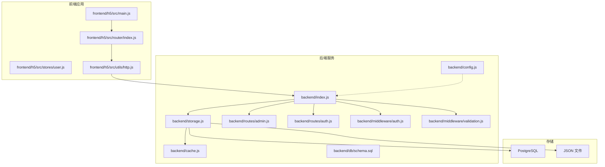

**图表来源**
- [backend/index.js:1-120](file://backend/index.js#L1-L120)
- [backend/config.js:1-123](file://backend/config.js#L1-L123)
- [backend/cache.js:1-119](file://backend/cache.js#L1-L119)
- [backend/storage.js:1-197](file://backend/storage.js#L1-L197)
- [backend/routes/admin.js:1-514](file://backend/routes/admin.js#L1-L514)
- [backend/routes/auth.js:1-591](file://backend/routes/auth.js#L1-L591)
- [backend/middleware/auth.js:1-168](file://backend/middleware/auth.js#L1-L168)
- [backend/middleware/validation.js:1-192](file://backend/middleware/validation.js#L1-L192)
- [backend/db/schema.sql:1-10](file://backend/db/schema.sql#L1-L10)
- [frontend/h5/src/main.js:1-22](file://frontend/h5/src/main.js#L1-L22)
- [frontend/h5/src/router/index.js:1-227](file://frontend/h5/src/router/index.js#L1-L227)
- [frontend/h5/src/stores/user.js:1-177](file://frontend/h5/src/stores/user.js#L1-L177)
- [frontend/h5/src/utils/http.js:1-99](file://frontend/h5/src/utils/http.js#L1-L99)

**章节来源**
- [backend/index.js:1-120](file://backend/index.js#L1-L120)
- [frontend/h5/src/main.js:1-22](file://frontend/h5/src/main.js#L1-L22)

## 核心组件
- 后端入口与中间件
  - Express 应用初始化、CORS、静态资源、请求日志、输入消毒、鉴权中间件、错误处理等。
- 配置管理
  - 集中管理 JWT、数据库、微信、SSO、上传、服务器等配置项。
- 缓存模块
  - 内存缓存，带 TTL 与清理策略，封装常用键空间。
- 存储抽象
  - 统一读写接口，支持 JSON 文件与 PostgreSQL；内置缓存包装。
- 认证与权限
  - JWT 验证、角色校验、可选认证、速率限制。
- 输入验证
  - 请求体消毒、字段必填校验、查询参数校验、文件上传校验。
- 业务路由
  - 认证路由（登录、注册、刷新、登出、SSO、微信登录等）与管理路由（统计、申请、用户、配置、评价等）。
- 前端应用
  - Vue 应用初始化、路由守卫、Pinia 状态管理、HTTP 通信与令牌刷新。

**章节来源**
- [backend/index.js:1-120](file://backend/index.js#L1-L120)
- [backend/config.js:1-123](file://backend/config.js#L1-L123)
- [backend/cache.js:1-119](file://backend/cache.js#L1-L119)
- [backend/storage.js:1-197](file://backend/storage.js#L1-L197)
- [backend/middleware/auth.js:1-168](file://backend/middleware/auth.js#L1-L168)
- [backend/middleware/validation.js:1-192](file://backend/middleware/validation.js#L1-L192)
- [backend/routes/auth.js:1-591](file://backend/routes/auth.js#L1-L591)
- [backend/routes/admin.js:1-514](file://backend/routes/admin.js#L1-L514)
- [frontend/h5/src/main.js:1-22](file://frontend/h5/src/main.js#L1-L22)
- [frontend/h5/src/router/index.js:1-227](file://frontend/h5/src/router/index.js#L1-L227)
- [frontend/h5/src/stores/user.js:1-177](file://frontend/h5/src/stores/user.js#L1-L177)
- [frontend/h5/src/utils/http.js:1-99](file://frontend/h5/src/utils/http.js#L1-L99)

## 架构总览
系统采用分层架构：
- 表现层：前端 H5 应用，负责用户交互与状态管理。
- 控制层：后端 Express 路由与中间件，处理请求、鉴权与业务逻辑。
- 持久层：存储抽象层统一访问 JSON 文件或 PostgreSQL。
- 外部集成：微信 OAuth、SSO 授权码查询等。

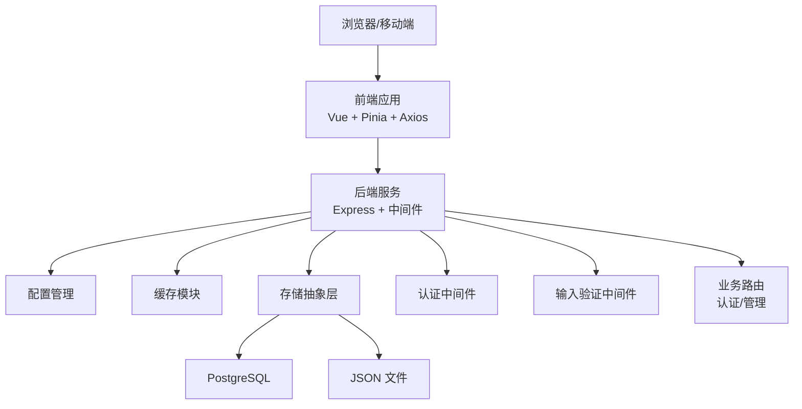

**图表来源**
- [backend/index.js:1-120](file://backend/index.js#L1-L120)
- [backend/config.js:1-123](file://backend/config.js#L1-L123)
- [backend/cache.js:1-119](file://backend/cache.js#L1-L119)
- [backend/storage.js:1-197](file://backend/storage.js#L1-L197)
- [backend/middleware/auth.js:1-168](file://backend/middleware/auth.js#L1-L168)
- [backend/middleware/validation.js:1-192](file://backend/middleware/validation.js#L1-L192)
- [backend/routes/auth.js:1-591](file://backend/routes/auth.js#L1-L591)
- [backend/routes/admin.js:1-514](file://backend/routes/admin.js#L1-L514)
- [frontend/h5/src/main.js:1-22](file://frontend/h5/src/main.js#L1-L22)

## 详细组件分析

### 后端入口与中间件
- 入口初始化：加载环境变量、创建 Express 实例、配置 CORS、静态资源、请求体解析、输入消毒、请求日志、路由挂载。
- 中间件链路：鉴权中间件（JWT 验证、角色校验、可选认证）、输入验证中间件（消毒、字段校验、查询参数校验、文件校验）、错误处理中间件。
- 关键流程：登录/注册/刷新/登出、SSO 登录、微信登录、文件上传、图片压缩、游戏分配等。

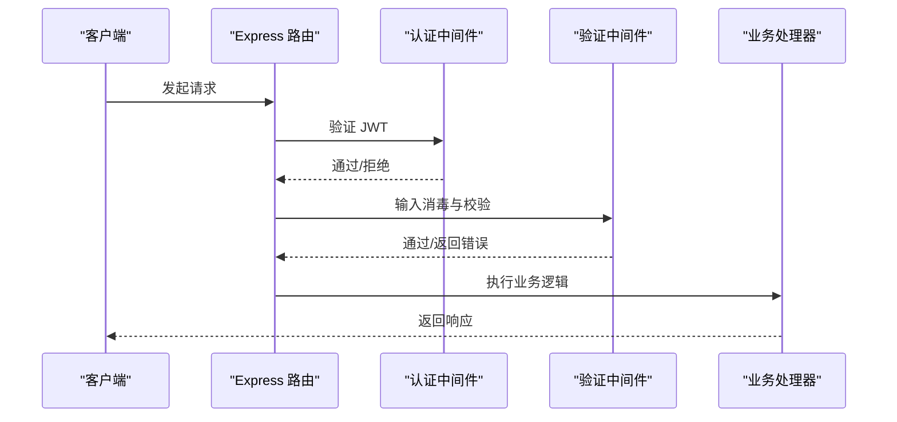

**图表来源**
- [backend/index.js:183-231](file://backend/index.js#L183-L231)
- [backend/middleware/auth.js:11-45](file://backend/middleware/auth.js#L11-L45)
- [backend/middleware/validation.js:52-57](file://backend/middleware/validation.js#L52-L57)

**章节来源**
- [backend/index.js:183-231](file://backend/index.js#L183-L231)
- [backend/middleware/auth.js:11-45](file://backend/middleware/auth.js#L11-L45)
- [backend/middleware/validation.js:52-57](file://backend/middleware/validation.js#L52-L57)

### 配置管理
- 集中配置：JWT 密钥与有效期、管理员默认密码、微信小程序/公众号、SSO 接口、数据库连接、上传限制、服务器地址等。
- 配置校验：运行时对默认密钥、微信凭证、生产环境密钥长度进行告警或抛错。
- 配置打印：启动时输出关键配置摘要（脱敏）。

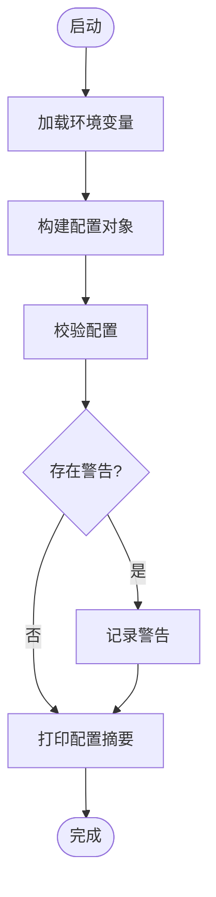

**图表来源**
- [backend/config.js:78-116](file://backend/config.js#L78-L116)

**章节来源**
- [backend/config.js:78-116](file://backend/config.js#L78-L116)

### 缓存模块
- 功能：内存 Map 存储，支持 TTL、过期清理、getOrSet 回调、统计信息。
- 键空间：用户、申请、案例、服务配置、评价、管理员统计、用户信息等。
- 清理策略：定时清理过期项。

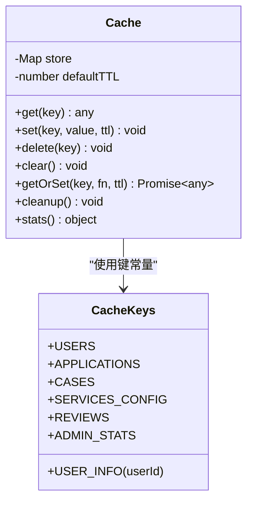

**图表来源**
- [backend/cache.js:5-119](file://backend/cache.js#L5-L119)

**章节来源**
- [backend/cache.js:5-119](file://backend/cache.js#L5-L119)

### 存储抽象层
- 初始化：根据配置决定使用 PostgreSQL 或 JSON 文件，确保表/文件存在。
- 读写：统一 JSON 存储接口，PostgreSQL 使用 JSONB 字段；提供缓存包装。
- 数据模型：用户、申请、案例、服务配置、评价等。

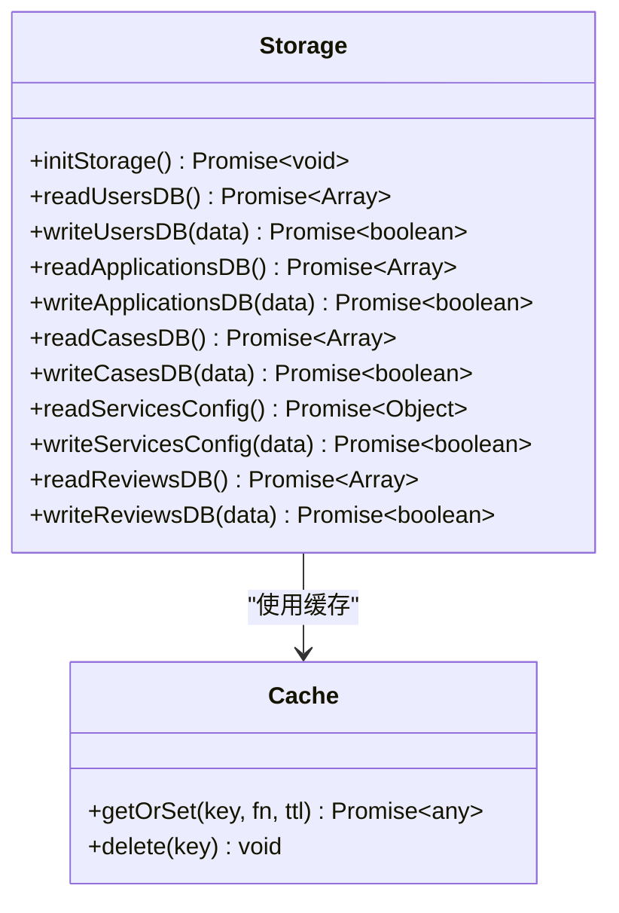

**图表来源**
- [backend/storage.js:42-197](file://backend/storage.js#L42-L197)
- [backend/cache.js:54-67](file://backend/cache.js#L54-L67)

**章节来源**
- [backend/storage.js:42-197](file://backend/storage.js#L42-L197)

### 认证与权限中间件
- 鉴权：从 Authorization 头提取 Bearer Token，验证 JWT，注入用户信息。
- 角色：角色白名单校验，支持管理员/DSL管理员/研学管理员。
- 可选认证：无 Token 时放行，Token 无效时记录日志。
- 速率限制：基于 IP 的滑动窗口计数，定期清理。

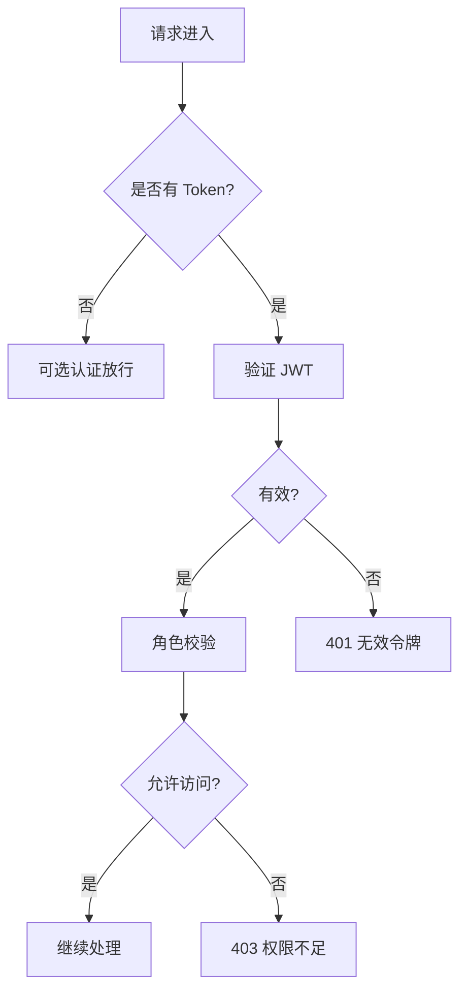

**图表来源**
- [backend/middleware/auth.js:11-75](file://backend/middleware/auth.js#L11-L75)

**章节来源**
- [backend/middleware/auth.js:11-75](file://backend/middleware/auth.js#L11-L75)

### 输入验证中间件
- 消毒：移除脚本标签、事件属性、javascript: 协议，清理字符串。
- 校验：手机号/邮箱正则、必填字段、查询参数类型与范围、文件类型与大小。

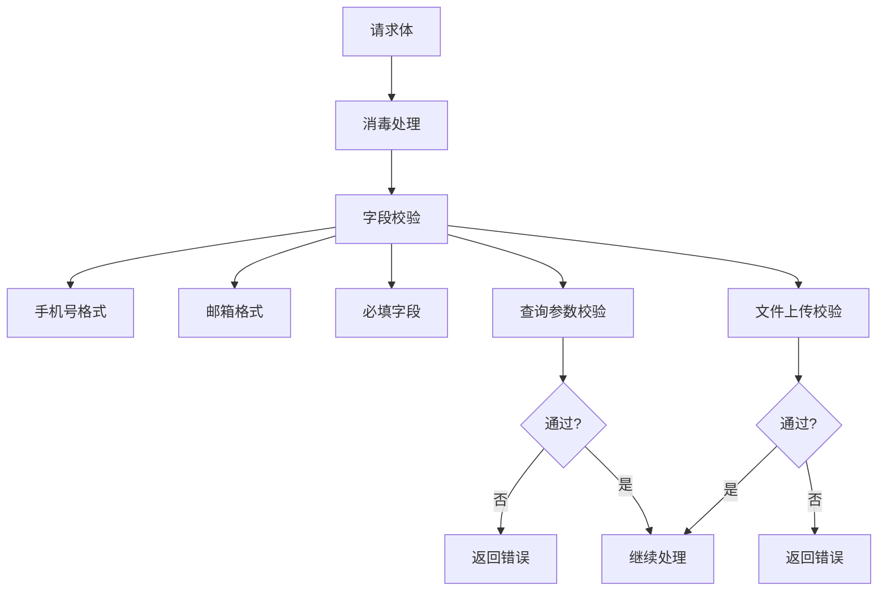

**图表来源**
- [backend/middleware/validation.js:9-192](file://backend/middleware/validation.js#L9-L192)

**章节来源**
- [backend/middleware/validation.js:9-192](file://backend/middleware/validation.js#L9-L192)

### 业务路由（认证）
- 登录/注册：手机号+密码，向后兼容明文密码自动升级为哈希。
- 刷新/登出：刷新令牌验证与替换，登出清除刷新令牌。
- SSO：授权码换取用户信息并登录。
- 微信登录：小程序 code2session 获取 openid/unionid 并登录。
- 微信公众号 OAuth：授权 URL 与回调，获取用户信息并登录。

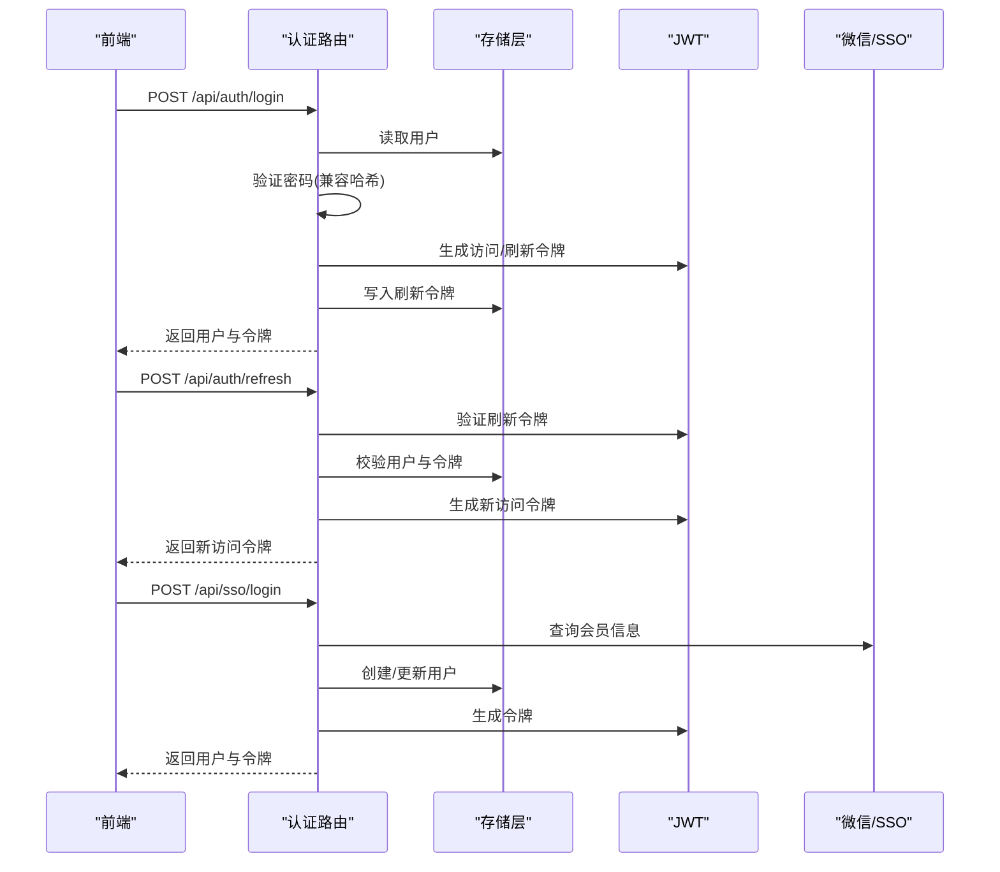

**图表来源**
- [backend/routes/auth.js:96-392](file://backend/routes/auth.js#L96-L392)

**章节来源**
- [backend/routes/auth.js:96-392](file://backend/routes/auth.js#L96-L392)

### 业务路由（管理）
- 统计：仪表板聚合申请、用户、案例数量与最近订单。
- 申请管理：分页、筛选、状态更新、导出 Excel。
- 用户管理：角色变更（防篡改超级管理员）。
- 服务配置：按角色可见/可编辑不同服务配置。
- 评价管理：审核、删除。

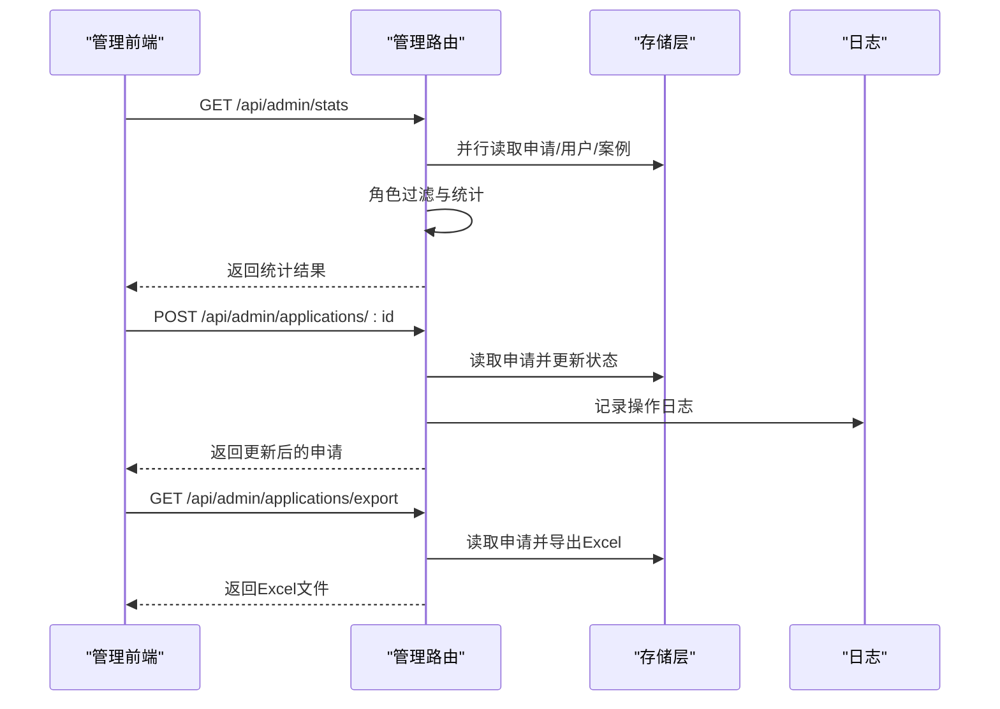

**图表来源**
- [backend/routes/admin.js:29-207](file://backend/routes/admin.js#L29-L207)

**章节来源**
- [backend/routes/admin.js:29-207](file://backend/routes/admin.js#L29-L207)

### 前端应用
- 应用初始化：创建 Vue 应用，注册 Pinia、路由、Vant 组件库。
- 路由守卫：全局前置守卫，处理 SSO 授权码、鉴权与角色校验、管理员路由保护。
- 状态管理：用户 Store 管理登录态、角色判断、用户信息获取与更新。
- HTTP 通信：Axios 拦截器，自动附加 Bearer Token；401 时刷新访问令牌并重试。

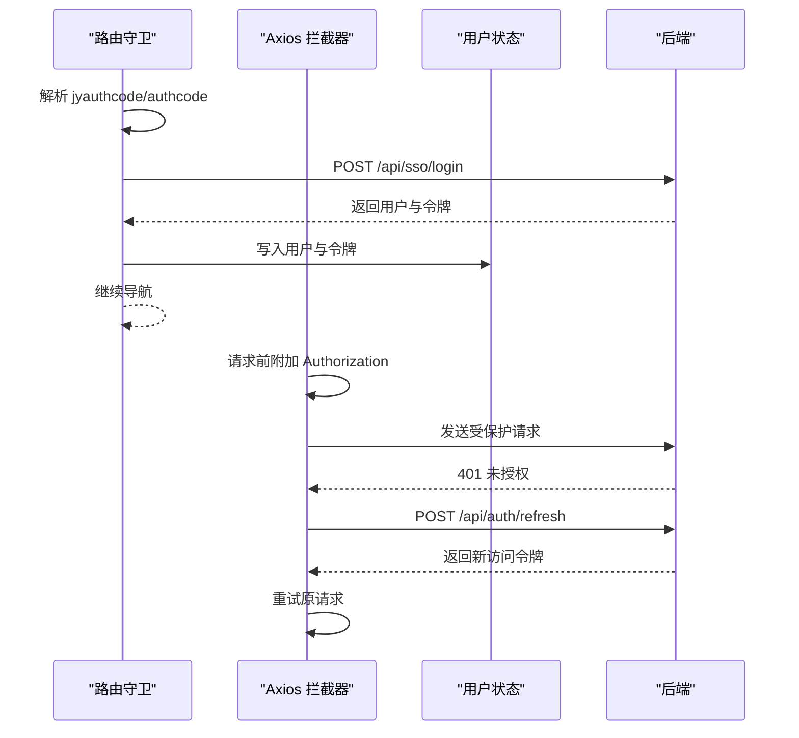

**图表来源**
- [frontend/h5/src/router/index.js:155-223](file://frontend/h5/src/router/index.js#L155-L223)
- [frontend/h5/src/utils/http.js:19-78](file://frontend/h5/src/utils/http.js#L19-L78)
- [frontend/h5/src/stores/user.js:37-120](file://frontend/h5/src/stores/user.js#L37-L120)

**章节来源**
- [frontend/h5/src/router/index.js:155-223](file://frontend/h5/src/router/index.js#L155-L223)
- [frontend/h5/src/utils/http.js:19-78](file://frontend/h5/src/utils/http.js#L19-L78)
- [frontend/h5/src/stores/user.js:37-120](file://frontend/h5/src/stores/user.js#L37-L120)

## 依赖关系分析
- 后端依赖
  - Express、CORS、BodyParser、Multer、Sharp、Axios、Bcrypt、JWT、LowDB、PG、Winston、XLSX 等。
  - 通过配置模块集中管理敏感与环境相关参数。
- 前端依赖
  - Vue 3、Vue Router、Pinia、Vant、Axios、Vue ECharts 等。
- 存储依赖
  - PostgreSQL JSONB 与 Node FS；通过统一接口屏蔽差异。

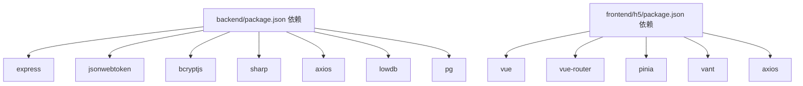

**图表来源**
- [backend/package.json:12-29](file://backend/package.json#L12-L29)
- [frontend/h5/package.json:10-20](file://frontend/h5/package.json#L10-L20)

**章节来源**
- [backend/package.json:12-29](file://backend/package.json#L12-L29)
- [frontend/h5/package.json:10-20](file://frontend/h5/package.json#L10-L20)

## 性能考虑
- 缓存策略：用户/申请/案例/服务配置/评价分别设置不同 TTL，降低数据库/文件 IO 压力。
- 并行读取：管理端统计使用 Promise.all 并行读取多表数据。
- 图片处理：提供图片压缩接口，失败回退原图，设置缓存头。
- 速率限制：基于内存 Map 的滑动窗口，防止暴力破解与滥用。
- 数据库迁移：PostgreSQL 使用 JSONB 字段，便于扩展与未来规范化。

**章节来源**
- [backend/cache.js:54-67](file://backend/cache.js#L54-L67)
- [backend/routes/admin.js:30-34](file://backend/routes/admin.js#L30-L34)
- [backend/index.js:87-114](file://backend/index.js#L87-L114)
- [backend/middleware/auth.js:108-160](file://backend/middleware/auth.js#L108-L160)
- [backend/db/schema.sql:1-10](file://backend/db/schema.sql#L1-L10)

## 故障排除指南
- 401 未认证/令牌过期
  - 前端拦截器会尝试刷新访问令牌；若刷新失败，清除本地令牌并中断请求。
- 403 权限不足
  - 管理路由对角色进行严格校验，非管理员访问会被拒绝。
- 参数校验失败
  - 输入消毒与查询参数校验会返回明确错误信息，检查必填字段与类型范围。
- 微信/SSO 登录失败
  - 检查配置项（AppID/Secret、回调地址、授权码），查看后端日志。
- 文件上传失败
  - 检查文件类型与大小限制，确认上传目录可写。

**章节来源**
- [frontend/h5/src/utils/http.js:28-78](file://frontend/h5/src/utils/http.js#L28-L78)
- [backend/middleware/auth.js:50-75](file://backend/middleware/auth.js#L50-L75)
- [backend/middleware/validation.js:79-149](file://backend/middleware/validation.js#L79-L149)
- [backend/routes/auth.js:398-508](file://backend/routes/auth.js#L398-L508)
- [backend/middleware/validation.js:154-180](file://backend/middleware/validation.js#L154-L180)

## 结论
本系统通过清晰的分层设计与中间件机制，实现了认证、权限、输入验证与存储抽象的解耦。前端通过 Pinia 与 Axios 完成状态管理与令牌刷新，后端通过统一的存储层适配多种持久化方案。建议在生产环境中强化密钥管理、启用 HTTPS、完善监控与日志审计，并持续优化缓存策略与数据库索引以提升性能。