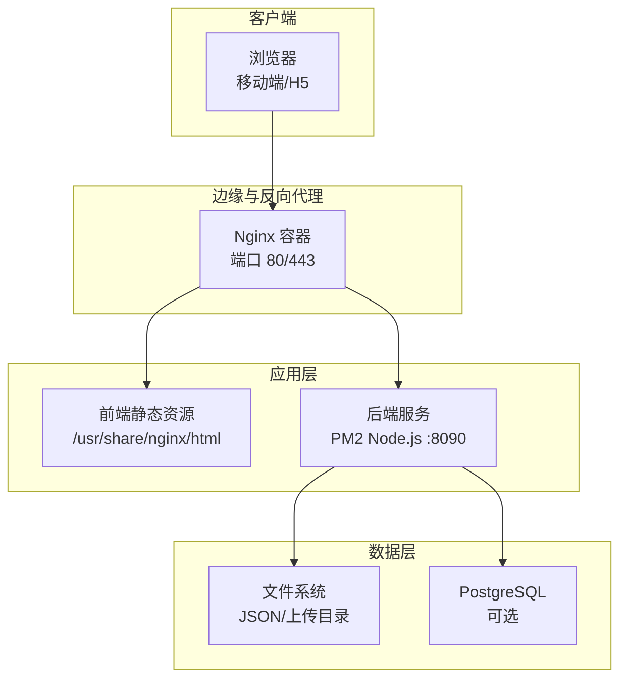
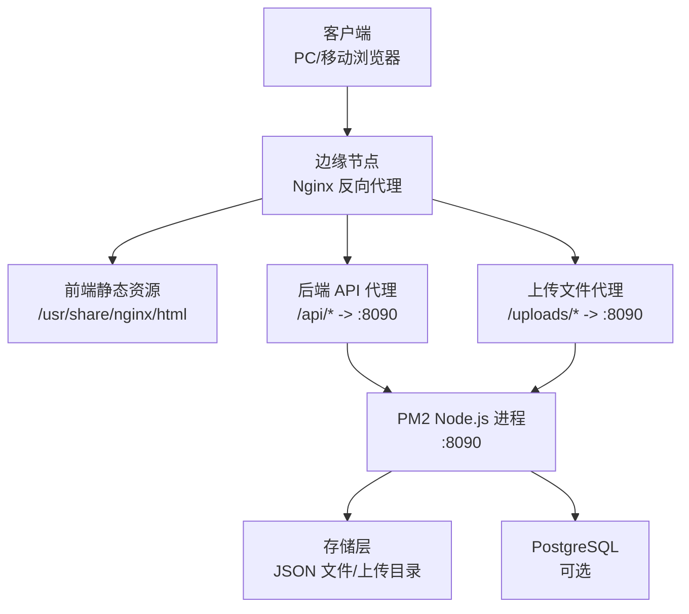
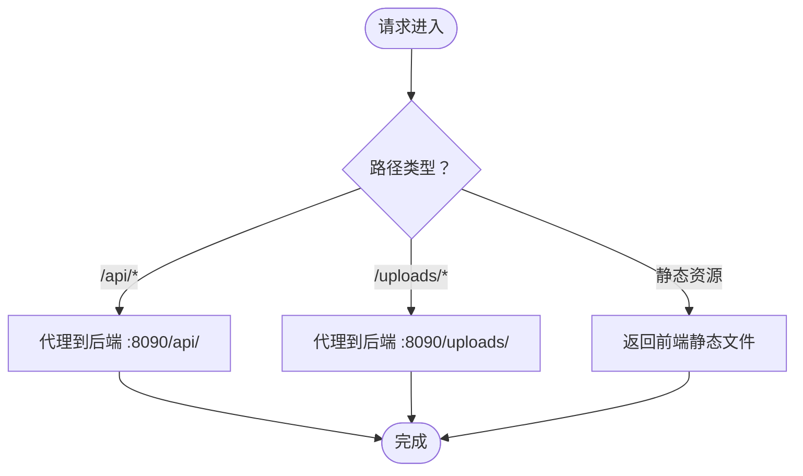
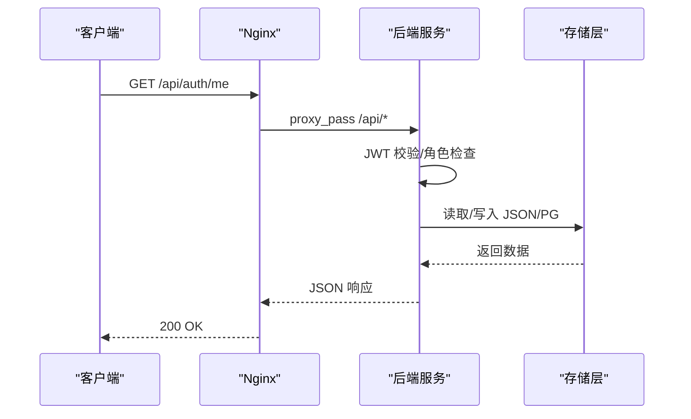
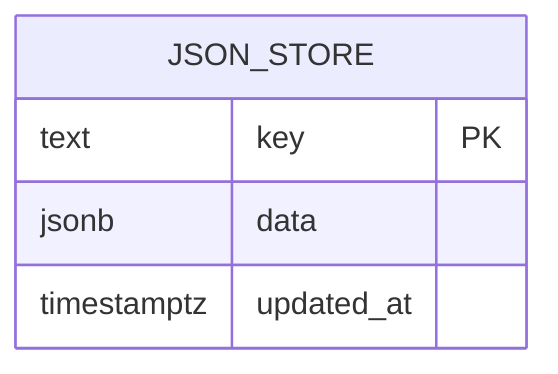
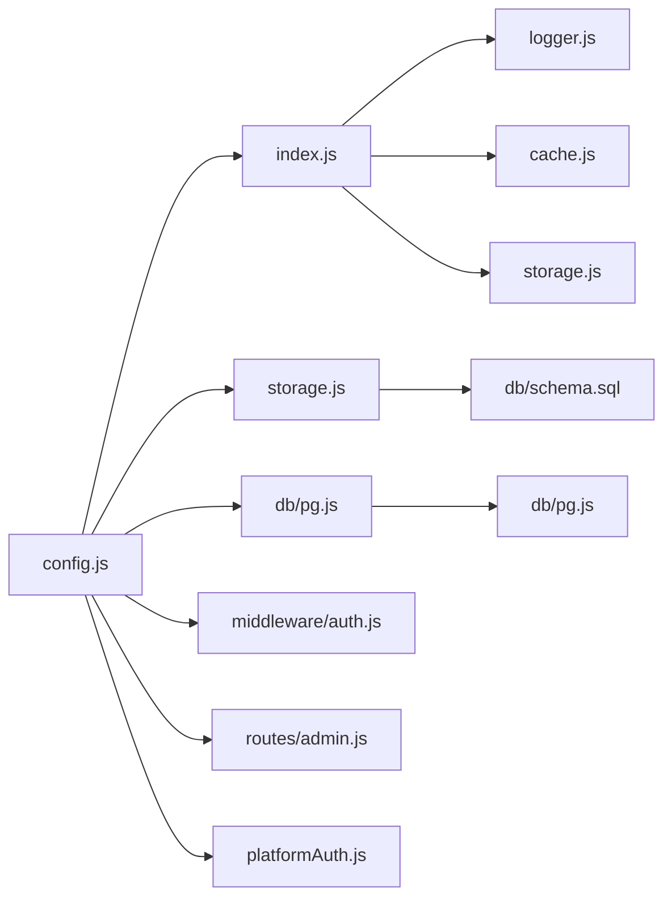

# 部署架构

<cite>
**本文引用的文件**
- [backend/package.json](file://backend/package.json)
- [backend/index.js](file://backend/index.js)
- [backend/config.js](file://backend/config.js)
- [backend/storage.js](file://backend/storage.js)
- [backend/db/schema.sql](file://backend/db/schema.sql)
- [backend/db/pg.js](file://backend/db/pg.js)
- [backend/logger.js](file://backend/logger.js)
- [backend/cache.js](file://backend/cache.js)
- [backend/middleware/auth.js](file://backend/middleware/auth.js)
- [backend/routes/admin.js](file://backend/routes/admin.js)
- [backend/platformAuth.js](file://backend/platformAuth.js)
- [backend/setup.sh](file://backend/setup.sh)
- [backend/部署说明.md](file://backend/部署说明.md)
- [frontend/h5/Dockerfile](file://frontend/h5/Dockerfile)
- [frontend/h5/nginx.conf](file://frontend/h5/nginx.conf)
- [frontend/h5/vite.config.js](file://frontend/h5/vite.config.js)
</cite>

## 目录
1. [简介](#简介)
2. [项目结构](#项目结构)
3. [核心组件](#核心组件)
4. [架构总览](#架构总览)
5. [详细组件分析](#详细组件分析)
6. [依赖关系分析](#依赖关系分析)
7. [性能考量](#性能考量)
8. [故障排查指南](#故障排查指南)
9. [结论](#结论)
10. [附录](#附录)

## 简介
本文件面向低空飞行服务平台的部署运维团队，提供一套完整的部署架构说明，覆盖服务器配置、负载均衡策略、容器化部署方案、前后端分离部署、静态资源托管、数据库部署、环境配置管理、反向代理与 SSL 证书配置、以及监控、日志与备份等运维保障措施。文档同时给出开发、测试、生产三类环境的部署策略与最佳实践，并配套部署架构图与部署流程说明。

## 项目结构
项目采用前后端分离架构：
- 前端：基于 Vue3 + Vite 的 H5 应用，构建产物部署于 Nginx 容器。
- 后端：基于 Express 的 Node.js 服务，通过 PM2 守护进程运行，监听 8090 端口。
- 反向代理：Nginx 作为统一入口，负责静态资源分发与 API/上传文件代理。
- 数据存储：默认使用 JSON 文件存储；可选 PostgreSQL（通过环境变量启用）。

图表来源
- [frontend/h5/nginx.conf:1-87](file://frontend/h5/nginx.conf#L1-L87)
- [backend/index.js:1-1401](file://backend/index.js#L1-L1401)
- [backend/db/pg.js:1-56](file://backend/db/pg.js#L1-L56)
- [backend/storage.js:1-197](file://backend/storage.js#L1-L197)

章节来源
- [backend/部署说明.md:1-350](file://backend/部署说明.md#L1-L350)
- [frontend/h5/nginx.conf:1-87](file://frontend/h5/nginx.conf#L1-L87)
- [backend/index.js:1-1401](file://backend/index.js#L1-L1401)

## 核心组件
- 反向代理与静态资源：Nginx 容器承载前端静态文件与 API 代理，支持 gzip 压缩与 HTTPS。
- 后端服务：Express + PM2，提供认证、SSO、文件上传、管理后台等接口。
- 存储层：默认 JSON 文件；可切换 PostgreSQL（通过环境变量启用），并提供迁移脚本。
- 配置管理：集中于 config.js，支持 JWT、微信、SSO、数据库、上传、服务器等配置项。
- 日志与缓存：内置结构化日志与内存缓存，降低文件读写压力。
- 安全中间件：JWT 校验、角色控制、可选认证与基础速率限制。

章节来源
- [backend/config.js:1-123](file://backend/config.js#L1-L123)
- [backend/logger.js:1-104](file://backend/logger.js#L1-L104)
- [backend/cache.js:1-119](file://backend/cache.js#L1-L119)
- [backend/middleware/auth.js:1-168](file://backend/middleware/auth.js#L1-L168)
- [backend/db/pg.js:1-56](file://backend/db/pg.js#L1-L56)
- [backend/storage.js:1-197](file://backend/storage.js#L1-L197)

## 架构总览
下图展示了生产环境的典型部署拓扑与流量走向：

图表来源
- [frontend/h5/nginx.conf:26-41](file://frontend/h5/nginx.conf#L26-L41)
- [backend/index.js:83-114](file://backend/index.js#L83-L114)
- [backend/storage.js:1-197](file://backend/storage.js#L1-L197)
- [backend/db/pg.js:1-56](file://backend/db/pg.js#L1-L56)

## 详细组件分析

### 反向代理与静态资源托管（Nginx）
- 静态资源：Nginx 容器挂载前端构建产物，提供 gzip 压缩与 SPA 路由回退。
- API 代理：将 /api/ 与 /uploads/ 请求转发至后端 Node.js 服务（容器网络地址）。
- HTTPS：配置 SSL 证书与协议参数，支持域名访问。
- Docker 化：使用官方 Nginx 镜像，Dockerfile 指定复制构建产物与自定义配置。

图表来源
- [frontend/h5/nginx.conf:15-41](file://frontend/h5/nginx.conf#L15-L41)

章节来源
- [frontend/h5/nginx.conf:1-87](file://frontend/h5/nginx.conf#L1-L87)
- [frontend/h5/Dockerfile:1-22](file://frontend/h5/Dockerfile#L1-L22)

### 后端服务（Node.js + PM2）
- 启动方式：PM2 守护进程，监听 8090 端口，支持开机自启与进程持久化。
- CORS 与静态资源：启用 CORS 并提供 /public 下的静态资源与上传目录。
- 认证与权限：JWT 校验、角色控制、可选认证与基础速率限制。
- SSO 对接：集成畅行温州平台，支持 SM2/SM4 加解密与签名。
- 存储抽象：统一读写封装，支持 JSON 文件与 PostgreSQL（可选）。

图表来源
- [backend/middleware/auth.js:11-45](file://backend/middleware/auth.js#L11-L45)
- [backend/routes/admin.js:282-305](file://backend/routes/admin.js#L282-L305)
- [backend/storage.js:134-181](file://backend/storage.js#L134-L181)

章节来源
- [backend/index.js:1-1401](file://backend/index.js#L1-L1401)
- [backend/middleware/auth.js:1-168](file://backend/middleware/auth.js#L1-L168)
- [backend/routes/admin.js:1-514](file://backend/routes/admin.js#L1-L514)
- [backend/platformAuth.js:1-177](file://backend/platformAuth.js#L1-L177)

### 数据存储与数据库
- 默认存储：JSON 文件（用户、申请、案例、配置、评价等），由 storage.js 统一封装。
- PostgreSQL：通过环境变量启用，提供连接池与表初始化（json_store 表）。
- 迁移脚本：提供 schema.sql 与 migrate.js，便于数据库演进。

图表来源
- [backend/db/schema.sql:1-10](file://backend/db/schema.sql#L1-L10)
- [backend/db/pg.js:39-48](file://backend/db/pg.js#L39-L48)

章节来源
- [backend/storage.js:1-197](file://backend/storage.js#L1-L197)
- [backend/db/pg.js:1-56](file://backend/db/pg.js#L1-L56)
- [backend/db/schema.sql:1-10](file://backend/db/schema.sql#L1-L10)

### 配置管理与环境变量
- 集中式配置：JWT、微信、SSO、数据库、上传、服务器、SM2 等均通过 config.js 读取环境变量。
- 校验与告警：启动时进行配置校验，生产环境对密钥长度提出强制要求。
- 示例脚本：setup.sh 自动创建 .env、安装依赖、创建日志与上传目录。

章节来源
- [backend/config.js:1-123](file://backend/config.js#L1-L123)
- [backend/setup.sh:1-58](file://backend/setup.sh#L1-L58)

### 日志与缓存
- 结构化日志：logger.js 输出到控制台与按日切分的文件，支持 info/warn/error/debug。
- 内存缓存：cache.js 提供 TTL 缓存，减少频繁读写 JSON 文件，定时清理过期项。

章节来源
- [backend/logger.js:1-104](file://backend/logger.js#L1-L104)
- [backend/cache.js:1-119](file://backend/cache.js#L1-L119)

### 安全与中间件
- 认证中间件：authRequired、optionalAuth、roleRequired 实现 JWT 校验与角色过滤。
- 速率限制：简单内存级滑动窗口限流，定期清理。
- 输入清洗：validation 中间件对请求体进行清洗与字段校验。

章节来源
- [backend/middleware/auth.js:1-168](file://backend/middleware/auth.js#L1-L168)
- [backend/index.js:183-218](file://backend/index.js#L183-L218)

## 依赖关系分析

图表来源
- [backend/config.js:1-123](file://backend/config.js#L1-L123)
- [backend/index.js:1-1401](file://backend/index.js#L1-L1401)
- [backend/storage.js:1-197](file://backend/storage.js#L1-L197)
- [backend/db/pg.js:1-56](file://backend/db/pg.js#L1-L56)
- [backend/db/schema.sql:1-10](file://backend/db/schema.sql#L1-L10)
- [backend/middleware/auth.js:1-168](file://backend/middleware/auth.js#L1-L168)
- [backend/routes/admin.js:1-514](file://backend/routes/admin.js#L1-L514)
- [backend/platformAuth.js:1-177](file://backend/platformAuth.js#L1-L177)
- [backend/logger.js:1-104](file://backend/logger.js#L1-L104)
- [backend/cache.js:1-119](file://backend/cache.js#L1-L119)

## 性能考量
- 静态资源压缩：Nginx 启用 gzip，减少带宽消耗。
- 缓存策略：内存缓存与短 TTL，降低后端读取压力；上传目录与图片压缩接口减少后端 IO。
- 数据库选择：生产建议启用 PostgreSQL，配合连接池与索引规划。
- 进程守护：PM2 提供进程健康与自动重启能力，结合日志与监控实现可观测性。

## 故障排查指南
- 端口占用：如遇端口被占用，调整启动命令中的端口或释放占用进程。
- 前端更新无效：确认已复制新构建产物到容器内并执行 Nginx 重载。
- git pull 数据文件冲突：运行 git stash 临时保存本地业务数据，拉取后再恢复。
- 图片/上传失败：检查上传目录权限与 Nginx 代理路径映射。
- SSO 登录失败：核对平台接口地址、密钥与签名参数。
- 服务配置页面空白：检查服务配置文件大小，必要时从历史恢复并重启服务。

章节来源
- [backend/部署说明.md:316-346](file://backend/部署说明.md#L316-L346)

## 结论
本部署架构以 Nginx 容器化托管前端静态资源与反向代理为核心，后端通过 PM2 守护进程提供稳定的服务能力，存储层兼顾 JSON 文件与 PostgreSQL 的灵活性。通过完善的配置管理、日志与缓存机制，以及清晰的部署流程与故障排查指引，能够满足开发、测试与生产的多环境部署需求。

## 附录

### 不同环境部署策略与最佳实践
- 开发环境
  - 前端：Vite 开发服务器，端口 5173；后端：本地 Node.js + nodemon，端口 3000。
  - 配置：使用 .env.example 生成 .env，设置较短 JWT 过期时间以便调试。
- 测试环境
  - 前端：构建产物复制到 backend/public/，通过 Docker Nginx 提供服务。
  - 后端：PM2 运行，端口 8090；数据库可使用轻量 PostgreSQL。
- 生产环境
  - 前端：Docker Nginx + HTTPS；后端：PM2 + 反向代理；数据库：生产级 PostgreSQL。
  - 安全：严格设置 JWT 密钥长度与 HTTPS 参数；开启访问日志与错误日志。

章节来源
- [backend/部署说明.md:43-100](file://backend/部署说明.md#L43-L100)
- [frontend/h5/vite.config.js:31-52](file://frontend/h5/vite.config.js#L31-L52)

### 部署流程说明（生产）
- 前端构建与复制：构建前端产物，复制到 backend/public/。
- 代码推送：提交并推送到远端仓库，服务器拉取。
- 后端启动：安装生产依赖，PM2 启动服务并保存进程列表。
- 前端更新：清空容器内旧静态资源，复制新构建产物并重载 Nginx。
- 验证：检查 API 响应与前端资源版本，浏览器强制刷新确认。

章节来源
- [backend/部署说明.md:101-270](file://backend/部署说明.md#L101-L270)

### 运维保障措施
- 监控：结合 PM2、Nginx 日志与后端结构化日志，建立告警与巡检机制。
- 日志：按日切分文件，保留关键错误堆栈与请求上下文。
- 备份：定期备份运行时数据文件与数据库快照，确保可恢复性。

章节来源
- [backend/logger.js:1-104](file://backend/logger.js#L1-L104)
- [backend/storage.js:1-197](file://backend/storage.js#L1-L197)
- [backend/db/pg.js:1-56](file://backend/db/pg.js#L1-L56)